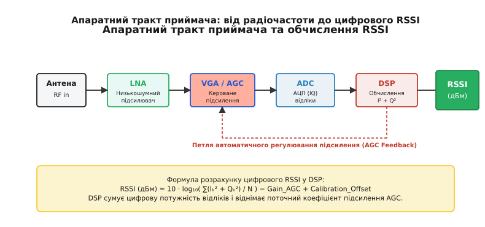
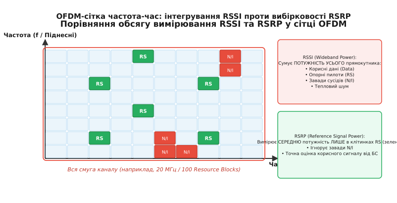

# Рівень сигналу RSSI та RSRP

<preknowlist>
- [Потужність і децибели](root:com-medium/power-decibels) — логарифмічна шкала вимірювання потужності в дБм (dBm) та відносних дБ (dB).
- [Загасання у просторі](root:com-medium/free-space-loss) — як електромагнітна хвиля втрачає щільність потоку потужності з відстанню.
- [Метрики якості лінку](root:com-medium/link-quality-metrics) — відношення сигнал/шум (SNR) та енергія на біт (Eb/N0).
- [Багатопроменевість](root:com-medium/multipath-fading) — інтерференція відбитих променів і швидкі завмирання.
</preknowlist>

Коли бездротовий приймач опиняється на відстані кілометра від базової станції, на його антенний вхід надходить електромагнітна потужність порядком `10⁻¹⁰ Вт` (`-70 дБм`), а на межі зони прийому ця величина падає до `10⁻¹⁵ Вт` (`-120 дБм`). Для стабільного демодулювання даних аналогово-цифровий перетворювач (АЦП) мусить отримувати сигнал суворо визначеної амплітуди, незалежно від того, знаходиться абонент під вежею чи в підземному паркінгу. Якщо вхідний тракт підсилює занадто слабкий сигнал недостатньо, символи губляться в шумах дискретизації; якщо ж підсилення надмірне — підсилювачі заходять у насичення, викривляючи сузір'я модуляції. Щоб утримувати амплітуду у вузькому динамічному вікні, радіомодем безперервно вимірює вхідну енергію ефіру. Проте в сучасних широкосмугових системах один лише індикатор виміряної потужності може показувати «ідеальний» сигнал у центрі міста, де реальна швидкість передачі даних падає до нуля через завади сусідніх передавачів.

> 🔧 **Навіщо це.** Без точного вимірювання потужності приймач не здатний налаштувати коефіцієнт підсилення власного входу (LNA/VGA), а операційна система не може визначити, коли час перемикати смартфон на сусідню вежу (процедура handoff). Нерозуміння різниці між інтегральною потужністю RSSI та вибірковою потужністю RSRP призводить до помилок при розгортанні бездротових мереж, коли пристрій «бачить» сильний сигнал, але не здатний встановити з'єднання.

## Фізична природа та механізм вимірювання RSSI

Індикатор рівня прийнятого сигналу (Received Signal Strength Indicator, RSSI) виник як аналогова напруга в колі автоматичного регулювання підсилення (АРУ / AGC) приймача. Фізично RSSI являє собою **широкосмугову інтегральну потужність**, виміряну на вхідних клемах радіочастотного тракту в межах усієї смуги пропускання приймального фільтра.

Детальний розвиток вимірювальних приладів від стрілочних S-метрів 1930-х років до цифрових реєстраторів описано в [Від аналогового S-метра до цифри: історія індикації рівня сигналу](root:com-medium/rssi-signal-strength/hist-rssi-origin.md).

Апаратний процес формування значення RSSI відбувається в кілька етапів у цифровому процесорі сигналів (DSP) після квадратурного демодулювання:


*Апаратний тракт приймача: від високочастотного входу до цифровізованого значення RSSI через замкнену петлю АРУ.*

1. High-Frequency RF сигнал надходить з антени на малошумний підсилювач (Low Noise Amplifier, LNA).
2. Після змішувача сигнал проміжної частоти проходит через підсилювач зі змінним коефіцієнтом підсилення (Variable Gain Amplifier, VGA), стан якого контролюється цифро-аналоговим перетворювачем петлі АРУ.
3. Аналогово-цифровий перетворювач (АЦП) отримує квадратурні відліки `I[k]` (In-phase) та `Q[k]` (Quadrature).
4. Цифровий процесор обчислює суму квадратів амплітуд для вікна з `N` відліків:

```
P_digital = (1 / N) · ∑ ( I[k]² + Q[k]² )
```

5. Оскільки АЦП бачить лише вирівняний рівень після VGA, абсолютна потужність на антенному вході відновлюється зворотним розрахунком: до цифрової потужності додається поточне загасання АРУ та калібрувальна поправка, збережена в енергонезалежній пам'яті (EEPROM) при розробці пристрою:

```
RSSI_dBm = 10 · log10( P_digital ) - Gain_LNA_dB - Gain_VGA_dB + Calibration_Offset_dB
```

### Динамічний діапазон та шуми квантування АЦП

Ширина динамічного діапазону АЦП прямо обмежує діапазон вимірювання RSSI. Відповідно до теорії цифрової обробки сигналів, кожен ефективний розряд (ENOB) АЦП дає приблизно `6.02 дБ` динамічного діапазону. 

Для 10-бітного АЦП максимальний теоретичний динамічний діапазон становить близько `60 дБ`. Якщо вхідний сигнал падає нижче наймолодшого значущого розряду (LSB), він повністю губиться в шумі квантування. Саме тому сучасні радіоприймачі 4G/5G та SDR (Software Defined Radio) використовують 12-бітні або 14-бітні АЦП із розширеним динамічним діапазоном до `84 дБ`, підкріплені швидкими цифровими петлями АРУ з часом реакції менше ніж `10 мікросекунд`.

Головна фізична особливість RSSI полягає в його **невибірковості**. Приймач не знає, кому належать електромагнітні хвилі, що пройшли крізь антену. Сумарна потужність `RSSI` дорівнює алгебраїчній сумі потужностей усіх джерел у смузі:

```
RSSI_mW = P_signal_mW + P_interference_mW + P_noise_mW
```

Якщо поруч із Wi-Fi роутером (канал `2.4 ГГц`) працює мікрохвильова піч або чужа точка доступу на тому ж каналі, приймач зафіксує високий RSSI (наприклад, `-50 дБм`). Проте корисний сигнал може бути повністю закритий завадою, що унеможливить виділення кадрів даних.

## Обмеження RSSI у мультиносійних системах OFDM

У сучасних широкосмугових стандартах зв'язку (Wi-Fi 4/5/6, 3G/4G LTE, 5G NR) передача даних здійснюється не на одній суцільній несучій, а за допомогою мультиплексування з ортогональним частотним поділом (OFDM). Сукупна смуга каналу (наприклад, `20 МГц` або `100 МГц`) розбивається на сотні або тисячі вузьких ортогональних піднесних (Resource Elements, RE), які групуються в ресурсні блоки (Resource Blocks, RB).

У такій структурі спектра RSSI виявляється «сліпим» індикатором з двох причин:

1. **Нерівномірність завантаження спектра:** Якщо базова станція передає дані лише для кількох абонентів, більша частина піднесних залишається порожньою. RSSI вимірює середню потужність усьому прямокутнику «частота-час». Коли спектр порожній, RSSI падає, хоча потужність окремих активних піднесних залишається максимальною.
2. **Вузькосмугові завади та багатопроменевий селективний завмирання:** Якщо внаслідок інтерференції відбитих променів кілька піднесних потрапляють у глибокий провал spectrum notch, а сусідні піднесні підсилюються, RSSI покаже стабільне середнє значення, причому декодування на провалених піднесних буде руйнувати блоки даних (Block Error Rate, BLER).

Графічне зіставлення принципу охоплення потужності між широкосмуговим RSSI та вибірковим RSRP наведено нижче:


*Частотно-часова сітка OFDM: RSSI вимірює енергію всього прямокутника, тоді як RSRP оцінює лише зелені елементи опорних пилотно-синхронізаційних сигналів (RS).*

Оскільки для оцінки якості соти та прийняття рішення про переключення потрібен індикатор, який вимірює потужність **саме конкретної базової станції**, консорціум 3GPP розробив метрику RSRP.

## RSRP: Потужність опорного сигналу базової станції

Щоб оцінити справжній рівень сигналу конкретної вежі у зашумленому ефірі, приймач мобільного пристрою опирається на структуру ресурсної сітки OFDM. Кожна базова станція випромінює опорний пилотний сигнал із суворо фіксованою потужністю у заздалегідь відомих позиціях частотно-часового прямокутника — це специфічні для стільниці опорні сигнали (Cell-specific Reference Signals, CRS у LTE або Secondary Synchronization Signals / PBCH DMRS у складі SSB-блоку в 5G NR).

Прийшовши на антену разом із корисними даними інших абонентів, завадами від сусідніх сотей і тепловим шумом тракту, вхідна суміш коливань розкладається на окремі ресурсно-часові елементи (Resource Elements, RE). Приймач виконує кореляційну обробку прийнятих відліків у позиціях опорних символів із відомою псевдовипадковою послідовністю пилота саме цієї соти. Завдяки власній ортогональності та високій автокореляції пилот-сигналу, узгоджена фільтрація «проявляє» амплітуду еталонних відліків, повністю відсікаючи сторонній шум та ортогональні завади сусідніх веж.

Провівши таке виділення та обчисливши лінійне середнє значення потужності виключно в ресурсно-часових елементах (Resource Elements), які містять специфічні для стільниці опорні сигнали, приймач отримує підсумкову оцінку сили сигналу соти. Цей вибірковий параметр і називається **RSRP (Reference Signal Received Power)**.

Математичні рівняння та строгі формули зв'язку між RSRP, RSSI та показниками затухання викладено у вставці [Математична модель вимірювання RSRP, RSRQ та логарифмічного затухання](root:com-medium/rssi-signal-strength/math-rsrp-rsrq-derivation.md).

Значення RSRP вимірюється в дБм і лежить у діапазоні від `-140 дБм` (гранична чутливість 4G/5G модемів) до `-44 дБм` (безпосередня близькість до антени передавача).

### Структура сітки 5G NR SSB та вимірювання променів (Beam RSRP)

У мережах п'ятого покоління (5G NR), що працюють у високочастотних діапазонах FR2 (міліметрові хвилі, 24–52 ГГц), базова станція не покриває соту суцільним широким випромінюванням. Замість цього застосовується масивне формування променів (Massive MIMO Beamforming).

Сигнали синхронізації 5G передаються у вигляді спеціальних блоків **SSB (Synchronization Signal Block)**, які по черзі сканують простір за допомогою вузьких променів (Beam Sweeping). 

Мобільний пристрій вимірює метрику **SS-RSRP (Synchronization Signal RSRP)** для кожного з 64 можливих променів окремо і повідомляє базовій станції індекс найкращого променя. Якщо виміряне значення SS-RSRP для поточного променя падає на `6…10 дБ` через перешкоду (наприклад, руку або голову користувача), базова станція миттєво переключається на резервний промінь без розриву з'єднання.

### Шкала інтерпретації рівнів RSRP у стільникових мережах:
- **`-75 дБм` і вище (Відмінний рівень):** Приймач знаходиться близько до базової станції або в зоні прямої видимості (LOS). Забезпечується максимальний коефіцієнт спектральної ефективності (модуляція 256-QAM).
- **`-76 дБм … -95 дБм` (Добрий рівень):** Надійне покриття у міській забудові. Висока швидкість передачі даних, стабільне з'єднання.
- **`-96 дБм … -110 дБм` (Задовільний / Середній рівень):** Зона напівзакритого прийому (всередині будівель). Модем вимушено знижує порядок модуляції до QPSK/16-QAM, зростає кількість повторних передач (HARQ retransmissions).
- **`-111 дБм … -125 дБм` (Слабкий / Граничний рівень):** Межа зони покриття стільниці. Можливі затримки пакетів та просідання швидкості.
- **Нижче `-125 дБм` (Критичний рівень):** Небезпека втрати синхронізації та обриву сесії (Radio Link Failure, RLF).

## Комплексна оцінка каналу: RSRQ та SINR

Хоча RSRP дає чисту оцінку потужності бажаного передавача, він не показує, наскільки завантажена стільниця та які завади створюють сусідні вежі. Для повної характеристики 3GPP вводить метрику **RSRQ (Reference Signal Received Quality)**.

RSRQ визначається як нормоване відношення виміряного RSRP до сумарного широкосмугового RSSI, виміряного в тому ж блоці:

```
RSRQ = ( N_RB · RSRP_mW ) / RSSI_mW
```

У логарифмічному вигляді формулу записують як:

```
RSRQ_dB = RSRP_dBm + 10 · log10( N_RB ) - RSSI_dBm
```

Де `N_RB` — кількість вимірювальних ресурсних блоків (наприклад, `N_RB = 100` для смуги `20 МГц`).

### Фізичний зміст RSRQ:
RSRQ показує «чистоту» та завантаженість каналу:
1. **Порожня сота без завад:** Оскільки передаються лише пилоти, сумарний RSSI малий, і значення RSRQ наближається до теоретичного максимуму `-3 дБ`.
2. **Повністю завантажена сота без зовнішніх завад:** Усі піднесні передають дані. Сумарний RSSI в `12` разів більший за RSRP одного пилота (бо блок містить 12 піднесних). В результаті `RSRQ = 1/12`, що в дБ становить `-10.8 дБ`.
3. **Сота з сильними завадами від сусідів:** Зовнішні вежі створюють високий RSSI, тоді як RSRP власної соти залишається малим. Значення RSRQ падає нижче `-15 дБ … -20 дБ`.

Ще однією критичною метрикою є **SINR (Signal-to-Interference-plus-Noise Ratio)** — безпосереднє відношення потужності корисного сигналу до сумарної потужності завад та шуму в ресурсному елементі. На відміну від RSRP, SINR прямо визначає граничну пропускну здатність каналу за теоремою Шеннона.

| Метрика | Що вимірює | Фізичний сенс | Типовий діапазон |
| :--- | :--- | :--- | :--- |
| **RSSI** | Інтегральна потужність у всій смузі | Загальна енергія ефіру (сигнал + завади + шум) | `-110 … -30 дБм` |
| **RSRP** | Потужність одного пилота БС | Чиста сила сигналу конкретної вежі | `-140 … -44 дБм` |
| **RSRQ** | Співвідношення RSRP до RSSI | Якість каналу та рівень завад/завантаження | `-20 … -3 дБ` |
| **SINR** | Сигнал / (Завада + Шум) | Чистота виділеного символу для розрахунку MCS | `-10 … +35 дБ` |

## Практична фільтрація та прийняття рішень про Хендовер

У реальному ефірі потужність сигналу постійно піддається двошаровим завмиранням:
- **Швидкі завмирання (Fast Rayleigh / Rician Fading):** Спричинені багатопроменевою інтерференцією від рухомих об'єктів. Рівень сигналу може змінюватися на `20…30 дБ` при переміщенні антени всього на пів довжини хвилі (на декілька сантиметрів).
- **Повільні завмирання (Slow Shadow Fading):** Спричинені екрануванням сигнала будівлями, пагорбами та деревами (описуються логарифмічно-нормальним розподілом).

Якщо модем реагуватиме на кожне миттєве падіння RSRP, виміряне за 1 мілісекунду, система увійде в стан нескінченних спроб перемикання між вежами. Для запобігання цьому у протоколах 3GPP (Layer 3 Filtering) та в автономних мікроконтролерних системах застосовують **експоненційне ковзне середнє (IIR/EMA фільтрацію)**.

Рівняння IIR-фільтра першого порядку має вигляд:

```
RSRP_filtered[n] = α · RSRP_raw[n] + (1 - α) · RSRP_filtered[n-1]
```

Де `α` (0.0 < α <= 1.0) — коефіцієнт згладжування. Мале значення `α = 0.1` ефективно зрізає пікові сплески шуму, залишаючи плавний тренд зміни відстані.

Готовий приклад розробки алгоритму фільтрації та гістерезисного автомата станів мовою C та C++ подано у вставці [Реалізація IIR-фільтрації RSSI та логіки хендовера](root:com-medium/rssi-signal-strength/proj-rssi-filter-c.md).

### Системні події вимірювання 3GPP RRC (Events A1–A6)

Протокол керування радіоресурсами (Radio Resource Control, RRC) визначає суворий набор подій (Event triggers) для автоматичної передачі звітів про вимірювання (Measurement Reports) від мобільного пристрою до базової станції:

1. **Event A1 (Serving becomes better than threshold):** Поточна сота стала кращою за заданий поріг. Модем скасовує пошук альтернативних веж, заощаджуючи заряд батареї.
2. **Event A2 (Serving becomes worse than threshold):** Якість сигналу поточної соти впала нижче порогу. Модем вмикає приймач вимірювань для пошуку сусідніх частот та технологій (Inter-frequency / Inter-RAT Measurement).
3. **Event A3 (Neighbor becomes offset better than serving):** Потужність RSRP сусідньої соти стала вищою за RSRP поточної соти на величину гістерезису `Offset`. Це головний тригер для міжстільникового хендовера (Intra-LTE Handover).
4. **Event A4 (Neighbor becomes better than threshold):** Сусідська сота перевищила абсолютний поріг сили сигналу.
5. **Event A5 (Serving becomes worse than th1 AND Neighbor becomes better than th2):** Поточна сота впала нижче порогу `Th1`, а сусідська перевищила поріг `Th2`. Застосовується при переході на межі зон покриття.

Для випитування цих даних із промислових модемів розробники використовують низку стандартизованих команд, зібраних у вставці [Інтерфейси вичитування рівнів сигналу: AT-команди та системні API](root:com-medium/rssi-signal-strength/api-cellular-at-commands.md).

## Динаміка замкненої петлі АРУ та шуми вимірювання

Апаратний тракт АРУ (AGC) функціонує як замкнена система автоматичного керування зі зворотним зв'язком. Оскільки вхідний радіосигнал може різко змінитися при огинанні будівлі або виході з тіні (наприклад, на `40 дБ` за кілька мілісекунд), петля АРУ має дві різні характеристики часу реакції:

1. **Час атаки (Attack Time):** Швидкість зменшення підсилення при різкому зростанні вхідної потужності. Визначено у мікросекундах (`10…50 мкс`), щоб запобігти короткочасному насиченню АЦП та кліпінгу квадратурних відліків `I/Q`.
2. **Час спаду (Decay / Release Time):** Швидкість збільшення підсилення при зникненні сигналу. Зазвичай налаштовується більш повільною (`100…500 мс`), щоб уникнути підсилення внутрішніх шумів під цепь у паузах між пакетами.

Якщо коефіцієнт згладжування петлі АРУ вибрано некоректно, система входить у стан автоколивань (AGC Hunting). У такому режимі АРУ постійно "перелітає" оптимальну точку підсилення, через що цифровий RSSI починає коливатися навіть у абсолютно статичному середовищі.

## Вимірювання RSRP у режимі агрегації носіїв (Carrier Aggregation)

У сучасних мережах LTE-Advanced та 5G NR для збільшення пропускної здатності використовується режим агрегації носіїв (Carrier Aggregation, CA), у якому пристрій одночасно приймає дані на кількох рознесених частотних смугах (Component Carriers, CC).

У такому режимі вимірювання RSRP та RSRQ проводиться незалежно для кожної компоненти:
- **Primary Component Carrier (PCC):** Основна несуча смуга, на якій підтримується RRC-з'єднання та передаються командні сигнали.
- **Secondary Component Carriers (SCC1, SCC2…):** Додаткові смуги даних, які підключаються та відключаються динамічно залежно від поточного RSRP на цих частотах.

Оскільки частоти несучих можуть суттєво відрізнятися (наприклад, `800 МГц` для PCC та `2600 МГц` для SCC1), радіохвилі зазнають різного загасання у просторі. Приймач мобільного пристрою формує окремий вектор вимірювань для кожної несучої. Базова станція відключає агрегацію SCC, якщо RSRP відповідної додаткової несучої падає нижче `-105 дБм`, зберігаючи при цьому основне з'єднання на PCC.

## Оцінка відстані за RSSI та радіолокація

У бездротових сенсорних мережах (Bluetooth LE, Zigbee, Wi-Fi RTLS) RSSI часто застосовують для непрямої оцінки відстані між вузлами та трилатерації (триангуляції позиції).

Базова логарифмічна модель втрат у середовищі (Log-Distance Path Loss Model) пов'язує відстань `d` із виміряним RSSI:

```
RSSI(d)_dBm = RSSI(1m)_dBm - 10 · n · log10( d )
```

Де `n` — коефіцієнт згасання середовища (від `2.0` у вільному просторі до `4.0` у залізобетонних будівлях).

Проте практичне використання RSSI для дальнометрії обмежене високою чутливістю до затінення. Падіння RSSI на `6 дБ` через випадково зачинені двері інтерпретується математичною моделлю як подвоєння відстані до об'єкта. Тому сучасні системи точної локації (UWB, Wi-Fi RTT 802.11mc) відмовляються від вимірювання амплітуди RSSI на користь вимірювання часу прольоту хвилі (Time of Flight, ToF / RTT).

## Підсумок

Вимірювання сили сигналу еволюціонувало від суб'єктивної оцінки чутливості слуху оператора до багаторівневого спектрального аналізу. RSSI залишається базовим індикатором загальної енергетичної завантаженості радіоефіру та первинного налаштування аналогового тракту АРУ. Водночас для системного управління широкосмуговими мультиносійними каналами LTE та 5G ключову роль відіграє RSRP, який ізолює потужність бажаного еталонного пилота і в поєднанні з RSRQ та SINR надає вичерпну картину якості бездротового лінку.
