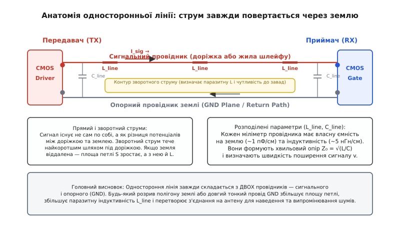
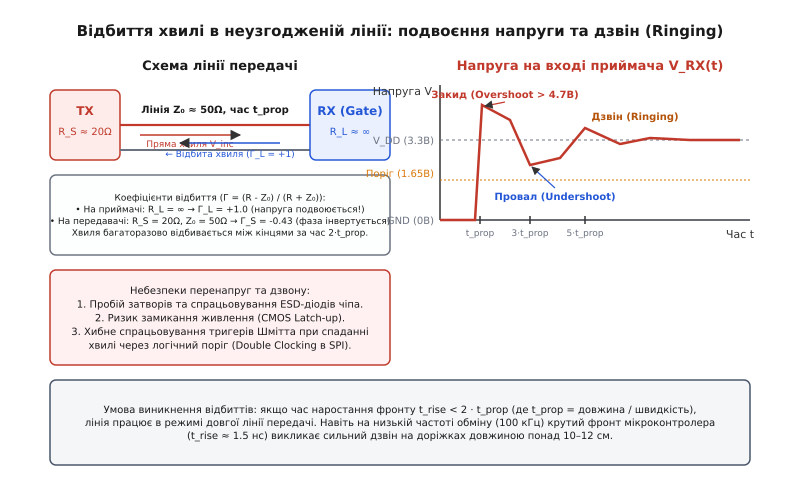
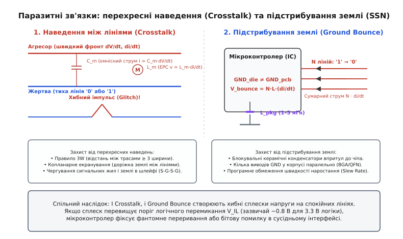
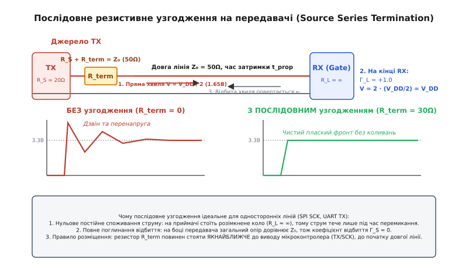

# Межі односторонніх ліній

<preknowlist>
- [Закон Ома](root:hw-analog/ohms-law) — зв'язок напруги, струму та опору провідника.
- [Стала RC](root:hw-analog/rc-time-constant) — час заряджання розподіленої ємності через еквівалентний опір.
- [Земля й шини](root:hw-pcb/ground-power-rails) — спільний зворотний провідник як шлях поворотного струму.
- [Диференційна пара](root:com-medium/differential-pair) — передача сигналу двома протифазними лініями без опори на землю.
</preknowlist>

Інженер з'єднує 3.3-вольтовий мікроконтролер із зовнішнім датчиком або мікросхемою флешпам'яті через звичайний стрічковий шлейф завдовжки 40 см і запускає шину SPI на тактовій частоті 10 МГц. Програма зависає на першій же транзакції: логічний аналізатор фіксує подвійні тактові імпульси замість одного, байти зчитуються з бітовими зміщеннями, а деякі мікросхеми взагалі блокуються внутрішнім захистом. Підключений осцилограф виявляє, що замість охайних прямокутних перепадів на лініях зв'язку виникають шалені коливання: амплітуда фронтів підстрибує до 4.8 В, провалюється нижче нуля до -1.1 В, а на сусідній неактивній лінії передачі даних з'являються фантомні сплески амплітудою понад 1 В. Уся ця катастрофа розгортається на системі, де програмний код є бездоганним, а електрична схема повністю відповідає документації.

Корінь проблеми полягає в тому, що на високих швидкостях звичайний мідний провідник перестає поводитися як ідеальне з'єднання з нульовим опором. У так званих односторонніх лініях зв'язку (від англійського *single-ended signaling* — передача одного електричного потенціалу відносно спільного зворотного провідника землі) сигнал фізично поширюється у вигляді електромагнітної хвилі, замкненої між сигнальним провідником і землею. Щойно тривалість перемикання логічного рівня стає порівнянною з часом руху хвилі по дроту, розподілена ємність, індуктивність провідника та його взаємодія із сусідніми колами починають спотворювати сигнал за законами електродинаміки.

### Анатомія односторонньої лінії: невидимий зворотний шлях

Будь-який електричний сигнал існує лише як різниця потенціалів між двома точками, а електричний струм завжди тече замкненим контуром. В односторонніх інтерфейсах — таких як [UART](root:com-devices/uart), [SPI](root:com-devices/spi-bus), [I²C](root:com-devices/i2c-bus), [1-Wire](root:com-devices/one-wire) та звичайні виводи GPIO — сигналом є напруга окремого провідника відносно спільної опорної площини або дроту землі (GND). Передавач виставляє потенціал на виводі, сподіваючись, що приймач на іншому кінці побачить точно таку саму напругу відносно своєї локальної землі.

Щойно передавач відкриває верхній транзистор вихідного каскаду й підтягує лінію до напруги живлення, прямий струм рушає по сигнальній доріжці в бік приймача. Цей струм заряджає електричну місткість між провідником і землею, а отже, у землі неминуче виникає зворотний струм рівної сили, який повертається до джерела живлення передавача. На низьких частотах постійний струм обирає шлях найменшого омічного опору, розтікаючись по всій доступній площині землі. Але для швидких змінних сигналів вирішальним стає шлях найменшої індуктивності: зворотний струм концентрується в металі землі безпосередньо під сигнальною доріжкою, утворюючи якомога вужчу петлю струму.


*Одностороння лінія завжди складається з двох провідників: сигнального і зворотного (GND). Прямий і зворотний струми утворюють контур, площа якого визначає паразитну індуктивність лінії та її сприйнятливість до зовнішніх завад.*

Кожен реальний провідник має три фундаментальні паразити (від грецького *parasitos* — «нахлібник»), рівномірно розмазані вздовж усієї його довжини:

1. Погонну ємність `C_line` (від латинського *capacitas* — «місткість») — електричне поле між сигнальним провідником і навколишніми заземленими металевими поверхнями. Для стандартної мікросмужкової доріжки на друкованій платі з діелектриком FR4 погонна ємність становить близько 0.8–1.2 пФ на кожен сантиметр довжини (80–120 пФ/м). У стрічковому багатожильному шлейфі без індивідуального екранування вона сягає 100–150 пФ/м.
2. Погонну індуктивність `L_line` (від латинського *inductio* — «наведення») — магнітне поле, яке створює контур струму між сигнальним дротом і зворотним шляхом землі. Що більша відстань між сигнальною жилою та землею, то більша площа контуру і то вища індуктивність: від 3–5 нГн/см для доріжки над суцільним полігоном землі до 10–20 нГн/см для окремого дроту, віднесеного від земляного контакту.
3. Активний опір провідника `R_line` — омічні втрати в міді, які для типових доріжок плати становлять частки ома, але на високих частотах зростають через скін-ефект (витіснення струму до поверхні провідника).

Поки лінія коротка, а перемикання повільні, ці розподілені параметри (від латинського *distributio* — «розподіл») майже непомітні. Але щойно частота або крутизна сигналів зростає, лінія раптово перетворюється на самостійну хвильову систему зі своїм власним характером.

> 🔧 **Навіщо це.** Якщо розірвати полігон землі під швидкісною лінією SPI або провести сигнал довгим гнучким джоротом без земляної жили поруч, площа контуру зворотного струму зросте в десятки разів. Це миттєво підкине паразитну індуктивність `L_line`, перетворивши провідник на ефективну випромінювальну антену, яка збиватиме роботу сусідніх радіомодулів та сприйматиме будь-які побутові завади.

### Межа зосереджених та розподілених параметрів: правило часу наростання

Головна омана цифрової електроніки полягає в думці, що поведінка лінії зв'язку залежить лише від тактової частоти інтерфейсу (наприклад, 100 кГц у UART чи 10 МГц у SPI). Насправді фізика визначається не частотою повторення бітів, а **крутизною фронту перемикання** — часом наростання `t_rise` (від 10% до 90% амплітуди) та часом спадання `t_fall`.

Електромагнітне поле не поширюється по провіднику миттєво. Його швидкість `v` обмежена швидкістю світла у вакуумі `c` та діелектричною проникністю ізолятора `ε_r`:

```
v = c / √(ε_r)
```

Для стандартного склотекстоліту друкованих плат FR4 відносна діелектрична проникність становить `ε_r ≈ 4.2–4.5`, звідки швидкість поширення сигналу по доріжці:

```
v ≈ (3.0 · 10⁸ м/с) / √(4.2)        [швидкість світла у вакуумі та діелектрик FR4]
  ≈ (3.0 · 10⁸ м/с) / 2.05          [обчислення кореня з діелектричної проникності]
  ≈ 1.46 · 10⁸ м/с                  [швидкість поширення хвилі в текстоліті]
  ≈ 15 см/нс                        [переведення в одиниці сантиметр на наносекунду]
```

У повітрі або в кабелях із пінополіетиленовою ізоляцією швидкість дещо вища — близько 18–20 см/нс. Час проходження сигналу по лінії довжиною `l` в один бік називають часом затримки поширення (propagation delay):

```
t_prop = l / v
```

А повний час, потрібний електромагнітній хвилі, щоб дістатися від передавача до приймача і відбитися назад до передавача (round-trip time), становить рівно `2 · t_prop`.

Тепер зіставимо дві величини: час наростання фронту вихідного каскаду `t_rise` та час подвійного пробігу хвилі `2 · t_prop`. Усе різноманіття режимів роботи лінії ділиться строго на дві фізичні зони:

1. **Режим зосереджених параметрів (Lumped Circuit):** якщо `t_rise > 2 · t_prop` (або консервативно `t_rise > 4 · t_prop`), електрична хвиля встигає кілька разів пробігти лінію туди й назад і повністю заспокоїтися ще до того, як вихідний транзистор передавача завершить перемикання. Напруга по всій довжині провідника в кожен момент часу є практично однаковою. Провідник поводиться як простий ємнісний конденсатор із місткістю `C_total = C_line · l`, і його можна аналізувати звичайними законами Кірхгофа.
2. **Режим розподілених параметрів / довгої лінії (Transmission Line):** якщо `t_rise < 2 · t_prop`, фронт сигналу вже вирушив у дорогу і змінює свій рівень швидше, ніж інформація про стан дальнього кінця лінії повернеться до передавача. Уздовж одного й того самого дроту в одну мить часу існують різні рівні напруги. Провідник стає лінією передачі, де панують хвильові процеси, біжучі хвилі та відбиття від країв.

Порахуймо критичну довжину доріжки `l_crit`, за якої лінія стає довгою, для типового сучасного 32-бітного мікроконтролера (STM32, ESP32 або RP2040):

```
t_rise = 1.5 нс      [типова тривалість фронту CMOS-виходу]
v = 15 см/нс         [швидкість поширення в текстоліті FR4]

l_crit = (v · t_rise) / 2
       = (15 см/нс · 1.5 нс) / 2
       = 11.25 см
```

Якщо доріжка на платі довша за 11 см, або якщо плата з'єднана з модулем плоским шлейфом довжиною 15–20 см, лінія гарантовано працює в режимі лінії передачі. І це справедливо навіть якщо ви передаєте одиночний байт UART раз на секунду: мікроконтролер перемикає вивід зі швидкістю 1.5 нс, породжуючи надшвидку електромагнітну хвилю, якій байдужа ваша середня тактова частота.

### Хвильовий опір та ефект відбиття: чому сигнал відлунює й подвоюється

Коли передавач виставляє на початку лінії крутий перепад напруги, ця хвиля ще не знає, що підключено на протилежному кінці — відкритий вхід мікросхеми, резистор чи коротке замикання. У момент поширення хвиля відчуває лише опір самого простору між сигнальним провідником і землею, заряджаючи погонні ємності через погонні індуктивності. Це динамічне співвідношення напруги та струму хвилі називають **хвильовим опором** або характеристичним імпедансом `Z₀` (від грецького *kharaktēr* — «ознака» та латинського *impedire* — «перешкоджати»):

```
Z₀ = √(L_line / C_line)
```

Для стандартних мікросмужкових ліній на платі завширшки 0.2–0.3 мм над землею хвильовий опір зазвичай лежить у межах `Z₀ ≈ 50–65 Ω`. Для стрічкового шлейфу без спеціального чергування земель `Z₀` становить близько `100–130 Ω`.

Щойно фронт напруги `V_inc` (падаюча хвиля, від англійського *incident wave*) добігає кінця лінії, він зустрічає навантаження з опором `R_L`. Якщо опір навантаження відрізняється від хвильового опору лінії (`R_L ≠ Z₀`), енергія хвилі не може поглинутися повністю. Частина електромагнітної енергії (а іноді й уся вона) відбивається назад до передавача у вигляді відбитої хвилі (від латинського *reflectere* — «відбивати»).

Співвідношення між амплітудою відбитої хвилі `V_refl` та падаючої хвилі `V_inc` описується коефіцієнтом відбиття `Г` (велика грецька літера гамма):

```
Г = (R_L - Z₀) / (R_L + Z₀)
```

Розглянемо, що відбувається на вході типового приймача цифрових мікросхем. Вхід приймача — це затвор польового транзистора (CMOS), вхідний опір якого за постійним струмом сягає мегаомів і гігаомів (`R_L ≈ ∞`, розімкнене коло):

```
Г_L = (∞ - Z₀) / (∞ + Z₀) = +1.0
```

Коефіцієнт відбиття дорівнює плюс одиниці. Це означає, що хвиля відбивається повністю без втрати амплітуди і з тим самим знаком. Напруга на вході приймача в мить приходу фронту складається з падаючої та відбитої хвиль:

```
V_RX = V_inc + V_refl               [сума падаючої та відбитої хвиль на кінці лінії]
     = V_inc + (+1.0 · V_inc)       [підставили коефіцієнт відбиття Г_L = +1.0]
     = 2 · V_inc                    [подвоєння амплітуди на розімкненому вході]
```

Напруга на приймачі **подвоюється**! Відбита хвиля амплітудою `V_inc` вирушає у зворотну подорож до передавача.


*Хвиля відбивається від розімкненого входу приймача з коефіцієнтом Г = +1, подвоюючи напругу, а потім відбивається від низького вихідного опору передавача з інверсією знака, породжуючи дзвін (ringing).*

Тепер простежимо, що станеться, коли відбита хвиля повернеться до передавача. Вихідний каскад передавача у ввімкненому стані має дуже малий внутрішній опір відкритого транзистора `R_S` (зазвичай `R_S ≈ 15–25 Ω`). Розрахуємо коефіцієнт відбиття на передавачі `Г_S` для лінії з `Z₀ = 50 Ω`:

```
Г_S = (R_S - Z₀) / (R_S + Z₀)       [формула коефіцієнта відбиття на джерелі]
    = (20 - 50) / (20 + 50)         [підставили R_S = 20 Ω та Z₀ = 50 Ω]
    = -30 / 70                      [різниця та сума імпедансів]
    ≈ -0.43                         [інверсія знака хвилі та часткове згасання]
```

Коефіцієнт відбиття виявився від'ємним. Це означає, що хвиля відбивається від передавача з інверсією фази (зміною знака) і зменшеною амплітудою, знову прямуючи до приймача. Прибувши на приймач через час `3 · t_prop`, вона знову відбивається з `Г_L = +1`, викликаючи глибокий провал напруги.

Цей циклічний процес триває доти, доки активний опір провідника та вихідного каскаду повністю не розсіє енергію коливань. На екрані осцилографа цей перехідний процес виглядає як серія згасаючих сплесків, які в інженерній практиці називають **дзвоном** (від англійського *ringing*):

- **Перенапруга / закид (Overshoot):** під час першого відбиття напруга на 3.3-вольтовій лінії може легко підскочити до 4.5–5.0 В. Це перевантажує вхідний діелектрик затвора мікросхеми, викликає відкривання вбудованих захисних діодів ESD (Electrostatic Discharge) і може спровокувати тиристорний ефект защіпання ([CMOS Latch-up](root:hw-components/transistor-switch)), який коротко замикає живлення на землю й спалює чіп.
- **Провал / викид униз (Undershoot):** зворотне коливання провалює напругу значно нижче нуля (до -0.8...-1.2 В) або нижче рівня логічної одиниці. Якщо під час передачі тактового сигналу SPI (SCK) зворотний провал перетне поріг перемикання логічного елемента (зазвичай 1.65 В для 3.3 В логіки), вхідний тригер Шмітта спрацює вдруге. Приймач порахує один фізичний імпульс тактового генератора як два (так званий ефект Double Clocking), зсуне біти в регістрі на одиницю і безповоротно спотворить весь кадр даних.

> 🔧 **Навіщо це.** Саме тому на лініях SPI найчастіше виникають таємничі помилки формату: передаєте `0x55`, а приймач читає `0xAA` або `0x2A`. Проблема не в протоколі й не в прошивці — це відбиття тактового сигналу SCK створили зайві тактові імпульси на крутих фронтах.

### Перехресні наведення: ємнісний та індуктивний зв'язок між доріжками

В односторонніх системах кілька сигнальних ліній зазвичай прокладають паралельно одна одній: 8-бітна паралельна шина, чотири лінії шини SPI (SCK, MOSI, MISO, CS) або жмут проводів у плоскому стрічковому кабелі. Коли дві доріжки проходять поруч, між ними неминуче виникають паразитна взаємна ємність `C_m` та взаємна індуктивність `L_m`.

Явище передачі паразитної енергії від однієї активної лінії до сусідньої неактивної називають **перехресними наведеннями** або паразитним проникненням сигналу (від англійського *crosstalk*):

- Лінію, на якій відбувається швидке перемикання сигналу з великим `dV/dt` та `di/dt`, називають **агресором** (Aggressor).
- Сусідню лінію, яка в цей час утримує стабільний логічний рівень або приймає слабкий сигнал, називають **жертвою** (Victim).


*Ліворуч: ємнісний струм зміщення та індуктивна ЕРС від швидкого фронту агресора наводять шум на сусідню лінію. Праворуч: розряд ємностей навантаження через індуктивність корпусу чіпа підкидає потенціал внутрішньої землі.*

Паразитний зв'язок працює через два незалежні фізичні механізми:

1. **Ємнісне наведення (електричне поле):** швидка зміна напруги на агресорі `dV_aggressor / dt` проганяє струм зміщення крізь взаємну ємність `C_m` безпосередньо в лінію жертви:
   ```
   i_crosstalk = C_m · (dV_aggressor / dt)
   ```
   Цей струм затікає в лінію жертви і, розтікаючись в обидва боки до її термінаторів або входів, створює сплески напруги однакової полярності на ближньому та дальньому кінцях.
2. **Індуктивне наведення (магнітне поле):** швидка зміна струму в агресорі `di_aggressor / dt` створює змінний магнітний потік, який пронизує контур лінії жертви й наводить у ньому електрорушійну силу згідно із законом Фарадея:
   ```
   v_crosstalk = L_m · (di_aggressor / dt)
   ```
   Індуктивна напруга діє в протилежному напрямку до напрямку струму агресора на ближньому кінці й додається до ємнісної напруги на дальньому.

Розрізняють два типи наведень залежно від точки спостереження:
- **Ближнє перехресне наведення (NEXT — Near-End Crosstalk):** напруга шуму, виміряна на кінці жертви, найближчому до передавача агресора. Тут ємнісна та індуктивна складові мають однаковий знак і підсумовуються, створюючи широкий імпульс шуму.
- **Дальнє перехресне наведення (FEXT — Far-End Crosstalk):** напруга шуму на кінці жертви біля приймача. Тут ємнісний струм та індуктивна ЕРС мають протилежні знаки й частково віднімаються, але через неоднорідність діелектрика плати (мікросмужка частково межує з повітрям, а частково з FR4) їхні швидкості різняться, формуючи короткий гострий пік.

Чому односторонні лінії настільки беззахисні перед перехресними наведеннями? Тому що вони мають спільний зворотний провідник землі й не мають другого протифазного провідника поруч, який міг би скомпенсувати поле. Якщо на лінії SPI тактовий сигнал SCK із крутим фронтом 1 нс перемикається поруч із вхідною лінією даних MISO, ємнісний і магнітний сплеск легко досягає амплітуди 0.8–1.2 В. Приймач мікроконтролера сприймає цей сплеск як помилкову одиницю на вході даних.

Для боротьби з перехресними наведеннями на друкованих платах застосовують класичне **правило 3W**: відстань між осьовими лініями сусідніх доріжок повинна бути щонайменше втричі більшою за ширину самої доріжки `W` (тобто зазор між краями доріжок `S ≥ 2W`). Це зменшує взаємну ємність `C_m` та взаємну індуктивність `L_m` приблизно на 70%. На критичних лініях (таких як тактовий сигнал) між доріжками прокладають додаткову заземлену трасу з перехідними отворами на землю — так зване копланарне екранування (від латинського *co-* — «разом» та *planum* — «площина»).

### Підстрибування землі (Ground Bounce) та шум одночасного перемикання (SSN)

Ще одне важке обмеження односторонніх інтерфейсів виникає не на самій платі, а всередині кремнієвого чіпа та його пластикового корпусу. Коли мікросхема керує паралельною шиною (наприклад, 8 або 16 ліній даних паралельного дисплея чи пам'яті), усі вихідні каскади використовують спільну кремнієву підкладку та спільні виводи живлення й землі корпусу.

Кожен металевий вивід мікросхеми, внутрішній контактний провідник (bond wire) від кристала до ніжки та перехідні отвори на платі мають власну паразитну індуктивність `L_GND`, яка становить від 1 до 5 нГн для корпусів типу QFP/TSSOP (у BGA-корпусах вона нижча — близько 0.5–1 нГн завдяки кульковим виводам).

Уявімо ситуацію: 8 ліній паралельної шини одночасно перемикаються зі стану логічної одиниці (3.3 В) у стан логічного нуля (0 В). Кожна лінія має паразитну ємність навантаження `C_load ≈ 30 пФ` (ємність доріжки плюс вхідна ємність приймача). Під час відкривання нижніх N-канальних транзисторів усі ці вісім ємностей починають миттєво розряджатися через вивід землі мікросхеми.

Струм розряду однієї лінії при тривалості спаду `t_fall = 1.0 нс` сягає:

```
I_peak = C_load · (ΔV / t_fall)                         [струм перезаряджання ємності навантаження]
       = (30 · 10⁻¹² Ф) · (3.3 В / 1.0 · 10⁻⁹ с)       [підставили параметри лінії]
       = 0.099 А                                        [розрахунок добутку]
       ≈ 100 мА                                         [піковий струм одного виводу]
```

Вісім ліній, що перемикаються одночасно, викидають у спільний земляний вивід сумарний піковий струм `I_total ≈ 8 · 100 мА = 0.8 А` за 1 наносекунду. Швидкість зміни струму складає:

```
di / dt = 0.8 А / 1.0 · 10⁻⁹ с                          [відношення струму до часу перемикання]
        = 8 · 10⁸ А/с                                   [швидкість наростання струму]
```

Згідно із законом електромагнітної індукції, на індуктивності виводу землі `L_GND = 2 нГн` виникає падіння напруги:

```
V_bounce = L_GND · (di / dt)                            [закон електромагнітної індукції]
         = (2 · 10⁻⁹ Гн) · (8 · 10⁸ А/с)               [підставили індуктивність виводу та di/dt]
         = 1.6 В                                        [стрибок потенціалу внутрішньої землі]
```

Це явище називають **підстрибуванням землі** (від англійського *ground bounce*) або шумом одночасного перемикання (SSN — *Simultaneous Switching Noise*).

Напруга внутрішньої земляної шини кристала `GND_die` на частку наносекунди підстрибує на 1.6 В відносно зовнішньої системної землі друкованої плати `GND_pcb`! Якщо в цей самий момент дев'ятий вивід мікроконтролера повинен був стабільно утримувати логічний нуль на лінії переривання або вибору мікросхеми CS (Chip Select), його транзистор з'єднаний саме з цією підстрибнувшою внутрішньою землею. Назовні, на спокійній лінії, з'являється імпульс напруги амплітудою 1.6 В. Оскільки типовий поріг розпізнавання логічного нуля `V_IL` для 3.3-вольтової логіки становить близько 0.8 В, приймач розцінить цей підскок як логічну одиницю — відбудеться хибне переривання або мимовільне скидання підпорядкованого пристрою.

Аналогічний процес відбувається на виводі живлення (VCC Sag / Power Bounce), коли кілька ліній одночасно переходять із нуля в одиницю: внутрішня шина живлення мікроконтролера різко просідає вниз, що може призвести до перезавантаження ядра чіпа вбудованим супервізором живлення (Brown-out Reset).

### Ємнісна деградація фронтів та RC-інтегрування

Досі ми розглядали лінії з двотактними вихідними каскадами (Push-Pull), де транзистори активно притягують лінію як до живлення, так і до землі. Проте цілий клас популярних однопровідних та двопровідних шин — насамперед [I²C](root:com-devices/i2c-bus), [1-Wire](root:com-devices/one-wire), лінії керування живленням та апаратні лінії переривань — побудовані за схемою з **відкритим стоком / відкритим колектором** (Open-Drain / Open-Collector).

В інтерфейсах із відкритим стоком активний транзистор може лише примусово притягнути лінію до землі (формуючи крутий фронт спаду). Повернення лінії у високий стан логічної одиниці відбувається пасивно — за рахунок зовнішнього резистора підтяжки `R_pullup`, підключеного до шини живлення.

У такому режимі лінія перетворюється на класичний інтегрувальний [RC-ланцюг](root:hw-analog/rc-time-constant). Заряджання сумарної паразитної ємності лінії `C_bus` описується експоненційним законом:

```
V(t) = V_DD · (1 - e^(-t / (R_pullup · C_bus)))
```

Час наростання напруги від рівня 10% до рівня 90% від `V_DD` розраховується через натуральний логарифм:

```
t_rise = ln(0.9 / 0.1) · R_pullup · C_bus               [інтервал наростання від 10% до 90%]
       = ln(9) · R_pullup · C_bus                       [відношення граничних рівнів напруги]
       ≈ 2.197 · R_pullup · C_bus                       [чисельне значення логарифма]
```

Специфікація стандарту I²C жорстко обмежує максимальну ємність шини величиною `C_max = 400 пФ` для стандартного режиму (Standard-mode, 100 кбіт/с) та швидкого режиму (Fast-mode, 400 кбіт/с).

Порахуймо час наростання фронту для типової системи з підтяжкою `R_pullup = 4.7 кΩ` та ємністю кабелю з кількома підключеними датчиками `C_bus = 400 пФ`:

```
t_rise = 2.2 · (4.7 · 10³ Ом) · (400 · 10⁻¹² Ф)         [підставили опір 4.7 кОм та ємність 400 пФ]
       = 2.2 · 4.7 · 400 · 10⁻⁹ с                       [спрощення степенів]
       ≈ 4.14 · 10⁻⁶ с                                  [розрахунок добутку в секундах]
       = 4.14 мкс                                       [час наростання фронту сигналу I2C]
```

Отриманий час наростання `4.14 мкс` перевищує весь період тактового сигналу шини на частоті 400 кГц (`T = 1 / 400 кГц = 2.5 мкс`, де тривалість напівперіоду високого рівня становить лише 1.25 мкс)! Напруга на лінії просто фізично не встигає піднятися вище порогу логічної одиниці до того, як наступний біт знову притягне її до землі. Прямокутний сигнал перетворюється на трикутні коливання мізерної амплітуди, і зв'язок повністю руйнується.

Щоб хоч якось працювати на довгих дротах, доводиться або знижувати тактову частоту шини до одиниць кілогерців, або зменшувати номінал резистора підтяжки (наприклад, до 1 кОм). Але зменшення `R_pullup` збільшує постійний струм, який мусить пропустити через себе крихітний вихідний транзистор датчика під час утримання логічного нуля:

```
I_sink = V_DD / R_pullup                                [закон Ома для відкритого стоку]
       = 3.3 В / 1000 Ом                                [підставили напругу живлення та опір]
       = 3.3 мА                                         [струм утримання логічного нуля]
```

Якщо опір зробити занадто малим, струм перевищить гранично допустимий струм стікання транзистора (зазвичай 3 мА за стандартом I²C), напруга логічного нуля зросте вище допустимого рівня `V_OL = 0.4 В`, і приймач перестане бачити нуль.

Крім того, для двотактних ліній на високих частотах ємність навантаження зумовлює динамічне споживання енергії. Кожне перемикання вимагає перезаряджання ємності `C_line`, що створює розсіювану потужність:

```
P_dynamic = C_line · V_DD² · f
```

На частоті 50 МГц лінія з ємністю 100 пФ при напрузі 3.3 В споживає `P = 100 · 10⁻¹² · 3.3² · 50 · 10⁶ ≈ 54.5 мВт` лише на перезаряджання власної паразитної ємності одного провідника. Для 16-бітної шини це майже 1 Вт зайвого тепла, яке безпосередньо розігріває вихідні каскади мікросхеми.

### Методи інженерного приборкання та узгодження ліній

Розуміння фізичних причин спотворень дозволяє інженерам ефективно продовжувати працездатність односторонніх ліній за допомогою чотирьох перевірених методів:

#### 1. Послідовне резистивне узгодження на передавачі (Source Series Termination)

Найпростіший, найдешевший та найбільш енергоефективний спосіб повністю знищити хвильовий дзвін та перенапруги на односпрямованих лініях (таких як SPI SCK, SPI MOSI, UART TX) — це встановлення послідовного резистора `R_term` безпосередньо біля виводу передавача.


*Послідовний резистор R_term разом із внутрішнім опором драйвера утворює точний імпеданс Z₀. На приймачі напруга подвоюється до повної амплітуди, а повернена хвиля повністю поглинається передавачем.*

Номінал резистора узгодження обирають так, щоб сума вихідного опору драйвера `R_S` та доданого резистора `R_term` точно дорівнювала хвильовому опору лінії:

```
R_term = Z₀ - R_S
```

Якщо вихідний опір транзистора мікроконтролера складає `R_S ≈ 20 Ω`, а лінія на платі має хвильовий опір `Z₀ = 50 Ω`, необхідний номінал становить:

```
R_term = 50 Ω - 20 Ω = 30 Ω  (стандартний ряд: 27–33 Ω)
```

Як це працює по кроках:
1. У момент перемикання вихідний подільник, утворений опором `(R_S + R_term = 50 Ω)` та хвильовим опором лінії `Z₀ = 50 Ω`, ділить напругу живлення `V_DD` рівно навпіл.
2. По лінії біжить сходинка напруги з половинною амплітудою `V_inc = V_DD / 2` (1.65 В).
3. Досягнувши розімкненого входу приймача (`R_L ≈ ∞`), хвиля відбивається з коефіцієнтом `Г_L = +1.0`. Напруга на вході приймача миттєво підскакує до повної напруги:
   ```
   V_RX = V_inc · (1 + Г_L)                     [формула подвоєння напруги на розімкненому кінці]
        = (V_DD / 2) · (1 + 1)                  [підставили напівхвилю та Г_L = +1.0]
        = V_DD                                  [чиста повна напруга живлення 3.3 В]
   ```
   Приймач бачить чистий, ідеальний логічний рівень без жодного перевищення!
4. Відбита хвиля амплітудою `V_DD / 2` повертається назад до передавача.
5. На боці передавача загальний опір кола дорівнює `R_S + R_term = Z₀`. Розрахуємо коефіцієнт відбиття на передавачі:
   ```
   Г_S = ( (R_S + R_term) - Z₀ ) / ( (R_S + R_term) + Z₀ )  [коефіцієнт відбиття з доданим резистором]
       = (50 - 50) / (50 + 50)                              [підставили узгоджений опір R_S + R_term = 50 Ω]
       = 0                                                  [хвиля повністю поглинається без відбиття]
   ```
   Коефіцієнт відбиття дорівнює нулю! Відбита хвиля **повністю поглинається** на передавачі без жодних вторинних відбиттів. Дзвін знищено в зародку.

Головна перевага послідовного узгодження над паралельним (де резистор ставлять на приймачі паралельно до землі) полягає в **нульовому постійному споживанні енергії**. Оскільки на дальньому кінці стоїть розімкнений CMOS-вхід, постійний струм через лінію не тече взагалі — енергія витрачається лише протягом короткого часу прольоту хвилі `t_prop`.

#### 2. Програмне керування швидкістю наростання (Slew Rate Control)

Найвитонченіший спосіб усунути проблеми довгої лінії — взагалі не дати їй стати довгою. Якщо штучно збільшити час наростання фронту `t_rise` так, щоб виконувалася умова зосередженого кола `t_rise > 2 · t_prop`, хвильові ефекти, перехресні наведення та підстрибування землі спадають на порядок.

Сучасні мікроконтролери дозволяють регулювати крутизну фронту та вихідну потужність драйвера (Drive Strength) для кожного виводу GPIO через внутрішні регістри. Зменшення крутизни фронту досягається вмиканням меншої кількості паралельних транзисторів у вихідному каскаді чіпа.

:::tabs
```stm32
/* Налаштування GPIO у мікроконтролерах STM32 (HAL / LL)
 * Для ліній SPI або UART на частотах до 10-20 МГц слід обирати
 * помірну швидкість наростання замість максимальної VERY_HIGH. */

GPIO_InitTypeDef gpio = {0};
gpio.Pin = GPIO_PIN_5 | GPIO_PIN_7; // SCK, MOSI
gpio.Mode = GPIO_MODE_AF_PP;
gpio.Pull = GPIO_NOPULL;

/* GPIO_SPEED_FREQ_LOW     : t_rise ≈ 20-50 нс (ідеально для I2C, UART)
 * GPIO_SPEED_FREQ_MEDIUM  : t_rise ≈ 10-15 нс (для SPI до 10-15 МГц)
 * GPIO_SPEED_FREQ_HIGH    : t_rise ≈ 4-6 нс
 * GPIO_SPEED_FREQ_VERY_HIGH: t_rise ≈ 1.2-2 нс (джерело сильного дзвону!) */
gpio.Speed = GPIO_SPEED_FREQ_MEDIUM;

HAL_GPIO_Init(GPIOA, &gpio);
```
```esp-idf
/* Налаштування сили вихідного каскаду в ESP-IDF (ESP32)
 * Зниження струмової здатності сповільнює dV/dt та di/dt,
 * радикально пригнічуючи Ground Bounce та дзвін. */

#include "driver/gpio.h"

gpio_config_t io_conf = {
    .pin_bit_mask = (1ULL << GPIO_NUM_18), // SPI CLK
    .mode = GPIO_MODE_OUTPUT,
    .pull_up_en = GPIO_PULLUP_DISABLE,
    .pull_down_en = GPIO_PULLDOWN_DISABLE,
    .intr_type = GPIO_INTR_DISABLE
};
gpio_config(&io_conf);

/* Доступні рівні:
 * GPIO_DRIVE_CAP_0 : слабкий (~5 мА, найм'якший фронт)
 * GPIO_DRIVE_CAP_1 : середній (~10 мА)
 * GPIO_DRIVE_CAP_2 : стандартний (~20 мА)
 * GPIO_DRIVE_CAP_3 : максимальний (~40 мА, максимальний шум) */
gpio_set_drive_capability(GPIO_NUM_18, GPIO_DRIVE_CAP_1);
```
```arduino
/* В середовищі Arduino для сумісних ядер (наприклад, RP2040 або STM32)
 * доступне керування slew rate через прямий доступ до регістрів або API */

void setup() {
    pinMode(13, OUTPUT); // SPI SCK
    
    #if defined(ARDUINO_ARCH_RP2040)
    // Обмеження швидкості наростання на RP2040 (Raspberry Pi Pico)
    // Slew rate: 0 = повільний (Slow), 1 = швидкий (Fast)
    gpio_set_slew_rate(13, GPIO_SLEW_RATE_SLOW);
    gpio_set_drive_strength(13, GPIO_DRIVE_STRENGTH_4MA);
    #endif
}

void loop() {
    // Основний цикл обміну
}
```
:::

Збільшення часу фронту з 1.5 нс до 15 нс знижує `di/dt` та `dV/dt` рівно вдесятеро. Це пропорційно зменшує амплітуду перехресних наведень на сусідні лінії та усуває підстрибування внутрішньої землі мікросхеми, не вимагаючи жодних додаткових компонентів на платі.

#### 3. Керування зворотним шляхом та чергування жил у шлейфах

Якщо сигнал необхідно передати через гнучкий стрічковий кабель, головне правило побудови лінії — **мінімізація площі контуру**.

У шлейфі неприпустимо виділяти під землю один дріт на краю роз'єму, а решту жил віддавати під швидкісні сигнали. Правильне чергування проводів вимагає чергування жил за схемою **S-G-S-G** (Signal-Ground-Signal-Ground): між кожними двома сигнальними лініями обов'язково прокладають індивідуальну заземлену жилу.

Заземлена жила одночасно вирішує три завдання:
- Створює безпосередній зворотний шлях струму з мінімальною петлею та індуктивністю для кожного сигналу.
- Стабілізує хвильовий опір лінії `Z₀` на рівні близько 90–110 Ом.
- Працює як електростатичний та магнітний екран між сусідніми сигналами, знижуючи перехресні наведення (Crosstalk) на 20–30 дБ.

#### 4. Активні прискорювачі шин (Bus Accelerators) для відкритих стоків

Для довгих ліній I²C з великою сумарною ємністю (понад 400 пФ) замість зменшення опору резисторів застосовують спеціалізовані мікросхеми активного прискорення фронтів (наприклад, LTC4311 або PCA9515).

Прискорювач відстежує стан лінії: поки напруга нижча за 0.6 В, він не втручається в роботу. Щойно вихідний транзистор закривається і напруга на лінії починає повільно зростати за рахунок пасивного резистора підтяжки, внутрішній компаратор прискорювача фіксує перехід і на короткий час (близько 30–50 нс) підключає до лінії потужне джерело струму (до 10–20 мА). Це джерело форсовано заряджає паразитно-ємнісний кабель, формуючи ідеально вертикальний фронт наростання, після чого вимикається. Це дозволяє шині I²C стабільно працювати на швидкості 400 кГц навіть на кабелях завдовжки до 10–15 метрів.

### Фізична межа: коли односторонніх ліній недостатньо

Попри всі інженерні хитрощі, односторонній спосіб передачі сигналів має непереборну фізичну межу, зумовлену самою своєю структурою: прив'язкою вимірювання до зовнішньої опори — спільної землі.

Зведемо фундаментальні обмеження односторонніх ліній у порівняльну таблицю:

| Фізичний фактор | Одностороння лінія (Single-Ended) | Диференційна пара (Differential Pair) |
| :--- | :--- | :--- |
| **Опорний рівень** | Спільна земля (GND), схильна до шумів і зсуву | Протифазний дріт тієї ж пари (A − B) |
| **Синфазні завади** | Прямо потрапляють у корисний сигнал | Повністю віднімаються приймачем (CMRR > 60 дБ) |
| **Зсув потенціалів земель** | Спотворює логічний поріг (збій при ΔV > 0.5 В) | Ігнорується в діапазоні ±7...±12 В ([RS-485](root:com-medium/rs-485-multidrop-bus)) |
| **Випромінювання завад (EMI)** | Високе (велика петля між сигналом і землею) | Мізерне (протилежні поля витків гасять одне одного) |
| **Підстрибування землі (SSN)** | Прямо модулює напругу спокійних ліній | Не впливає (струми в парі взаємно врівноважені) |
| **Розмах напруги** | Великий (1.8 В, 3.3 В, 5.0 В) для захисту від шуму | Малий (0.2–0.4 В у LVDS/Ethernet), менше споживання |
| **Гранична довжина на 10 МГц** | 0.3–0.5 метра | 100–1200 метрів (RS-485 / Ethernet) |

Коли проект виходить за межі друкованої плати, довжина з'єднувального кабелю перевищує 1–2 метри, або швидкість обміну зростає понад 50–100 МГц, подальша боротьба за живучість односторонньої лінії втрачає економічний і технічний сенс. Жодні резистори послідовного узгодження та екранування не здатні захистити сигнал від різниці потенціалів між заземленнями двох віддалених корпусів приладів чи потужних наведень промислових електродвигунів.

Саме в цій точці односторонні лінії передають естафету [Диференційним парам](root:com-medium/differential-pair) та промисловим стандартам фізичного рівня — [RS-485](root:com-medium/rs-485-multidrop-bus), [CAN](root:com-devices/can-arbitration), [USB](root:com-devices/usb-device-basics), Ethernet та LVDS, які кодують інформацію у відносній різниці між двома провідниками, усуваючи залежність від нестабільної спільної землі.
