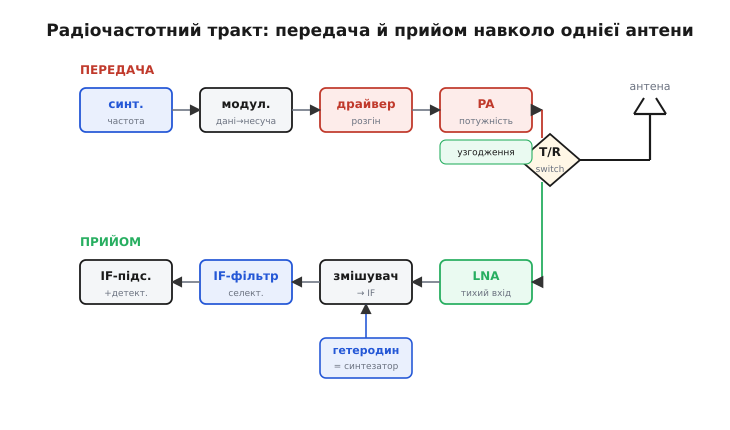
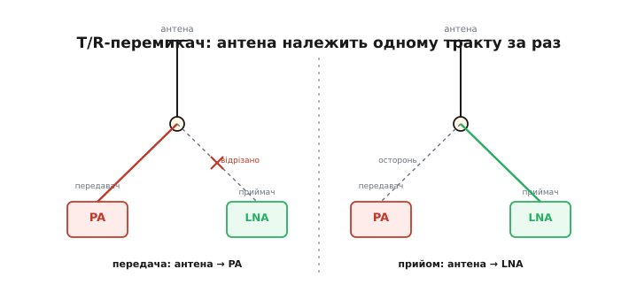
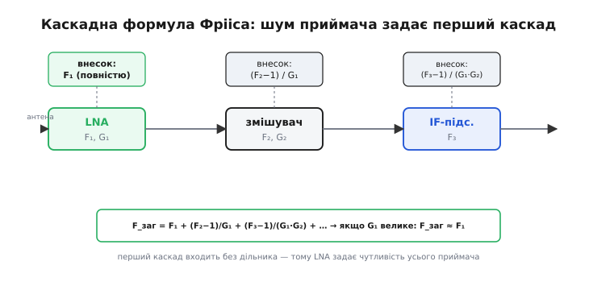

# 🔌 Радіочастотний тракт приймача-передавача

Між цифрою, що народжує біти, і антеною, що кидає їх у простір, лежить смуга аналогового заліза — **радіочастотний тракт** (англ. *RF frontend*, «радіочастотний передній край»). Це та частина, де сигнал ще не число, а справжнє коливання на сотнях мегагерц чи гігагерцах, і де вирішується дві речі, від яких залежить увесь зв'язок: **скільки потужності ми віддамо в ефір** і **найслабший сигнал, який зуміємо звідти вивудити**. Перше — робота передавального боку, друге — приймального. Обидва сходяться в одній точці, антені, і саме навколо цієї спільної точки збудований весь тракт.

Тут ми пройдемо ланцюг ланка за ланкою — не як список деталей, а як живий шлях коливання: від підсилювача потужності на передачі, через перемикач, що ділить антену між «кажу» і «слухаю», до тихого вхідного каскаду, змішувача й гетеродина на прийомі. Головне питання, яке тримає всю розповідь: **чому потужність додають одні ланки, а чутливість задає рівно одна — найтихіша на вході**. Це не випадковість схемотехніки, а глибокий фізичний закон, і коли ти його відчуєш, увесь тракт складеться в голові сам.

Клас цей повністю описується принципом дії — байдуже, який чип чи виробник: кожен радіомодуль, кожен приймач-передавач телеметрії, кожен трансивер на кристалі має ці самі ланки в тому самому порядку. Тому це компонент, а не конкретна модель.

---

## Клас пристрою: два тракти навколо однієї антени

Найперше, що варто відчути: у трансивера (англ. *transceiver*, від *transmitter* + *receiver* — «передавач-приймач в одному») насправді **два різні тракти**, і вони майже не мають спільного заліза, крім антени. Тракт передачі гучний і грубий: його задача — узяти слабеньке коливання із синтезатора й **розігнати** його до потрібних міліватів чи ватів, не спотворивши. Тракт прийому — навпаки, ніжний і полохливий: його задача — узяти крихту потужності з антени (часто менше мільярдної частки вата) і **підняти** її, майже не додавши власного бруду.

Ці дві задачі — розігнати сильне й не забруднити слабке — фізично несумісні в одному ланцюгу. Гучний передавач сипле шумом і гармоніками; тихий приймач того шуму не витримає. Тому їх **розводять**, а антену між ними ділить перемикач. У цьому й уся анатомія тракту.


*Два тракти навколо спільної антени. Зверху — передача: синтезатор задає частоту, драйвер і підсилювач потужності (PA) розганяють сигнал, узгоджувальна мережа віддає його в антену. Знизу — прийом: малошумний підсилювач (LNA) обережно піднімає крихту з антени, змішувач переносить її на проміжну частоту (IF), гетеродин/синтезатор задає, куди саме. T/R-перемикач по черзі під'єднує антену то до PA, то до LNA — обидва тракти ту саму частоту водночас не займають.*

Пройдімо цей ланцюг двічі — спершу вниз по передачі, тоді вгору по прийому, — і на кожній ланці спитаймо одне: що вона робить із **бюджетом лінії** (тим балансом потужності, який вирішує, чи долетить сигнал).

---

## Передавальний бік: розігнати, не спотворивши

### Підсилювач потужності: остання й найгарячіша ланка

Синтезатор і модулятор дають на виході коливання правильної частоти й форми, але **кволе** — одиниці міліватів, а то й менше. У такому вигляді воно в ефір не піде: за перший же кілометр загасання у вільному просторі з'їсть його з головою. Треба розігнати. Це робить **підсилювач потужності** (англ. *power amplifier*, PA) — остання активна ланка перед антеною й та, що визначає першу цифру бюджету, потужність передавача P_tx.

Логіка тут проста й пряма: кожен децибел, доданий PA, — це децибел, що з'явиться в бюджеті лінії й, зрештою, у прийнятій потужності на тому кінці. Підняв вихід із 100 мВт (+20 дБм) до 1 Вт (+30 дБм) — додав 10 дБ, і лінк дотягнеться помітно далі. Але PA — це та ланка, де фізика найжорсткіше карає за жадібність, і причин дві.

Перша — **живлення й тепло**. PA перетворює постійний струм джерела на радіочастотну потужність, і робить це з ефективністю далеко не сто відсотків: половина, а то й більше, енергії йде в **тепло**. Ват у ефір — це часто два-три вати з батареї й помітний нагрів кристала. Звідси перша практична правда класу: у момент передачі PA тягне **сплеск струму**, і якщо джерело кволе, напруга просідає, тракт починає збоїти, а то й перезавантажується. Потужний передавач треба живити від міцного джерела, а не «з останніх міліампер» контролера.

Друга — **лінійність проти ефективності**, і це вічний конфлікт усієї передавальної схемотехніки. Щоб PA був економним, його заганяють у режим, де транзистор більшу частину періоду або повністю відкритий, або повністю закритий (класи C, D, E, F) — тоді на ньому мало що гріється. Але такий режим **спотворює** форму сигналу: він годиться лише для модуляцій, де важлива сама наявність несучої, а не її точна амплітуда (FM, FSK, класичний GFSK телеметрії). А от для модуляцій, де інформація захована в **амплітуді** (QAM, багатопозиційні схеми, будь-що з високим піком до середнього), спотворення руйнує повідомлення — доводиться тримати PA в лінійному, але **ненажерливому** режимі (клас A чи AB), де левова частка енергії йде в тепло намарно.

```
конфлікт PA:
  лінійний режим (A/AB)   → чиста форма, але низький ККД, багато тепла
  нелінійний режим (C/E/F)→ високий ККД, але спотворює амплітуду

  просте FSK/FM телеметрії → можна нелінійний, економний
  QAM / складна модуляція  → мусиш лінійний, гарячий
```

> 🔧 **Навіщо це.** Коли передавач «не тягне» заявлену дальність або гріється, дивись насамперед сюди. Просідає живлення під сплеск — лінк рветься не через радіо, а через слабке джерело; дай PA міцне живлення й товсті доріжки. А обираючи модуляцію, знай ціну: проста двопозиційна схема дозволяє економний PA й довший політ на батареї, багатопозиційна дає більше даних, але вимагає лінійного, гарячого й ненажерливого підсилювача. Це рішення тракту, а не «налаштування в прошивці».

### Узгодження PA з антеною: щоб потужність не відбилась назад

PA видав потужність — але щоб вона **пішла в антену**, а не відбилась назад у транзистор, між ними мусить стояти **узгоджувальна мережа** (англ. *matching network*). Причина глибша, ніж здається, і без неї не зрозуміти половини радіозаліза.

Будь-яка лінія, будь-який вихід має **хвильовий опір** — типово 50 Ом у радіотехніці. Якщо PA «бачить» на своєму виході рівно ті 50 Ом, він віддає всю потужність уперед. Але якщо опір навантаження інший — а антена сама по собі майже ніколи не має чистих 50 Ом на робочій частоті, — частина хвилі **відбивається** назад, як хвиля від краю натягнутої мотузки, коли той край закріплено не так, як треба. Відбита потужність не тільки не долетіла — вона повернулась у PA й гріє його даремно, а на лінії стоять пучності й вузли напруги. Наскільки погано узгоджено, міряють **коефіцієнтом стійної хвилі** (КСХ): чим більше відбилось, тим він гірший. Що таке відбиття, звідки береться КСХ і чому 50 Ом стали стандартом — окрема тема [відбиття і КСХ](root:com-medium/vswr); тут важливий наслідок: **неузгоджена антена краде потужність із бюджету ще до того, як хвиля пішла в ефір**.

> 🔧 Що треба знати про КСХ (коефіцієнт стійної хвилі): це число, що каже, яка частка потужності відбилась від навантаження назад у передавач через розбіжність опорів. КСХ = 1 — ідеал, усе пішло вперед; КСХ = 2 і гірше — помітна частка вернулась, гріє PA й не долетіла. Антену треба узгодити на 50 Ом на робочій частоті, інакше бюджет лінії тече дарма.

Узгоджувальна мережа — це кілька котушок і конденсаторів (іноді відрізок лінії), підібраних так, щоб **перетворити** опір антени назад на ті 50 Ом, які хоче бачити PA. Вона ж часто виконує другу роботу — **фільтрує**: пропускає робочу частоту й давить гармоніки, які нелінійний PA неминуче наплодив (подвоєну частоту, потроєну), щоб вони не полетіли в ефір і не порушили норми. Апарат узгодження — з чого будують ці мережі й як їх розраховують — виноситься окремо в [мережі узгодження імпедансу](root:com-medium/rf-matching-network-design); для тракту досить розуміти, навіщо вони: без узгодження PA віддає в антену лише частину того, що міг, а решту перетворює на власне тепло.

---

## Точка розділу: T/R-перемикач

Антена одна, а трактів два, і в один момент часу вона належить лише одному з них. Хто керує цим поділом — **T/R-перемикач** (transmit/receive, «передача/прийом»): маленький, але критичний вузол просто на антенному вході.

Логіка його очевидна, а тонкощі — ні. Коли радіо передає, перемикач з'єднує антену з виходом PA й **відрізає** вхід приймача. Це не примха, а виживання: PA видає, скажімо, +30 дБм (1 Вт), а вхідний каскад приймача розрахований ловити −110 дБм — різниця в **сто сорок децибелів**, тобто в сто трильйонів разів за потужністю. Якби той сплеск потрапив на вхід приймача, він би миттєво його спалив. Тому в режимі передачі приймач мусить бути надійно відключений, а будь-яка потужність, що все ж просочилась крізь неідеальний перемикач, — придушена. Коли ж радіо слухає, перемикач з'єднує антену з входом приймача, а вихід PA лишає осторонь.


*Один перемикач, два стани. Ліворуч — передача: антена з'єднана з PA, вхід приймача (LNA) відрізано, щоб потужний сплеск його не спалив. Праворуч — прийом: антена з'єднана з LNA, вихід PA осторонь. Найтонше — час перемикання: поки перемикач крутить стан і тракт заспокоюється, радіо глухе й німе водночас, і ці мікросекунди прямо крадуть пропускну здатність у напівдуплексі.*

Три речі роблять цей простий вузол підступним.

**Час перемикання.** Перемикач не спрацьовує миттєво: транзисторам треба перемкнутись, а трактові — заспокоїтись від перехідного сплеску. Ці мікросекунди — **мертвий час**, коли радіо ні передає, ні приймає. У напівдуплексному лінку (та сама частота, напрями по черзі) кожне перемикання «слухаю ↔ кажу» з'їдає цей час, і на високих швидкостях обміну він прямо краде пропускну здатність. Ось чому в командних каналах перемикання роблять якомога коротшим і намагаються не смикати його дарма.

**Розв'язка (ізоляція).** Жоден перемикач не відрізає ідеально — трохи потужності завжди просочується у відключене плече. У передачі це означає, що частина ватного сплеску PA все ж дотягується до входу приймача; розв'язка перемикача має бути достатньою, щоб те, що просочилось, не пошкодило й не оглушило вхідний каскад. Чим більша потужність PA, тим суворіша вимога до ізоляції.

**Втрати на вставку.** Перемикач сам по собі трохи гасить сигнал, який крізь нього проходить, — це **втрати на вставку** (англ. *insertion loss*). І тут криється неприємність, що передвіщає головну ідею всієї статті: у режимі прийому перемикач стоїть **перед** приймачем, тобто його втрати додаються **до входу**, ще до першого підсилення. А втрати на самому вході, як ми зараз побачимо, псують чутливість найболючіше — децибел, загублений тут, це децибел прямо з чутливості. Тому в тракті перемикач ставлять якнайближче до антени й вимагають від нього мінімальних втрат, а в найчутливіших приймачах LNA часом ставлять навіть **до** перемикача, щоб його втрати вже не рахувались на самому вході.

> 🔧 **Навіщо це.** Дивна поведінка на межі передача/прийом — часто це перемикач. Лінк ніби є, але половина коротких відповідей губиться — можливо, приймач ще «глухий» після передачі, не встиг перемкнутись; дай трактові трохи більше часу на розворот. А проєктуючи чи обираючи модуль для дальнього зв'язку, пам'ятай: втрати перемикача в приймальному плечі — це прямий податок на чутливість, і кожна десята дБ тут дорожча, ніж будь-де далі в тракті.

---

## Приймальний бік: почути крихту над шумом

Тепер найцікавіше — тракт прийому, де вирішується друга велика цифра бюджету, **чутливість**. І щоб зрозуміти всі його ланки, спершу треба відповісти на глибоке питання: а що взагалі заважає почути як завгодно слабкий сигнал? Чому не можна просто підсилити його в мільярд разів і читати?

### Чому є межа: тепловий шум

Межа не в підсиленні — підсилити можна майже скільки завгодно. Межа в тому, що разом із крихітним сигналом на вхід приходить **шум**, і підсилюється він так само. Якщо сигнал уже тоне в шумі, жодне підсилення його не витягне — воно підніме обидва однаково.

Звідки той шум? Найглибше джерело — **тепло**. У будь-якому опорі за температури вище абсолютного нуля електрони безладно смикаються від теплового руху, і цей хаос — це крихітна випадкова напруга на затискачах, **тепловий шум** (його ще звуть шумом Джонсона-Найквіста). Він є всюди, його не вимкнути, і його потужність задає сама фізика:

```
P_шум = k · T · B
        k — стала Больцмана, 1.38 × 10⁻²³ Дж/К
        T — температура, кельвіни (типово 290 К, ~кімнатна)
        B — смуга приймача, герци
```

Порахуймо цю межу в зручних одиницях. За кімнатної температури, у смузі один герц, теплова потужність виходить

```
10·log₁₀(k · T) ≈ −204 дБВт/Гц = −174 дБм/Гц
```

Оце **−174 дБм на герц смуги** — абсолютна підлога, нижче якої за кімнатної температури не чує жоден приймач у світі. Розширив смугу вдесятеро — підлога піднялась на 10 дБ (більше смуги впускає більше шуму). Це не вада заліза, а закон природи: сам ефір, саме тепло кладе цю межу.

Реальний приймач іще й **додає власного шуму** понад цю теплову підлогу — на скільки саме, каже його **коефіцієнт шуму** (англ. *noise figure*, NF): NF = 3 дБ означає, що приймач подвоїв наявний шум. Складаючи все докупи, чутливість — той найслабший сигнал, який приймач ще розбере, — виходить так:

```
чутливість = −174 + NF + 10·log₁₀(B) + SNR_потрібне   [дБм]
             NF        — власний шум приймача, дБ
             10·log(B) — плата за смугу
             SNR_потрібне — запас сигнал/шум, щоб демодулятор упорався
```

Сам концепт коефіцієнта шуму запровадив данський інженер **Гаральд Фрііс** (*Harald T. Friis*) у праці «Noise Figures of Radio Receivers» (Proc. IRE, липень 1944) — і, як побачимо, він же дав формулу, що пояснює головну загадку тракту. Глибше про теплову підлогу, шумову температуру й NF — окрема тема [коефіцієнта шуму](root:hw-analog/noise-figure); тут нам досить головного висновку: **чутливість визначається власним шумом приймача, а той шум майже цілком задається однією ланкою — найпершою.** Зараз побачимо, чому саме першою.

### Малошумний підсилювач: чому саме він задає чутливість

Ось серце всієї статті. На вході приймача, зразу за антеною (і за T/R-перемикачем), стоїть **малошумний підсилювач** (англ. *low-noise amplifier*, LNA). Його ім'я не про підсилення — підсилюють усі каскади, — а про те, **як мало власного шуму** він додає. І виявляється, що саме ця перша ланка майже одноосібно вирішує чутливість усього приймача. Чому так — не очевидно, тож розберімо від першопричини.

Уяви ланцюг каскадів: LNA, за ним змішувач, за ним IF-підсилювач. Кожен щось підсилює й кожен додає свого шуму. Питання: чий шум важить найбільше? Відповідь дає **каскадна формула Фрііса** — одна з найважливіших у радіотехніці:

```
F_заг = F₁ + (F₂ − 1)/G₁ + (F₃ − 1)/(G₁·G₂) + …
        Fₙ — шумовий множник n-ї ланки (NF у разах)
        Gₙ — підсилення n-ї ланки (у разах)
```

Придивись до знаменників. Шум **першої** ланки, F₁, входить у суму **повністю**, без жодного дільника. А шум другої ланки поділений на підсилення першої (G₁), шум третьої — на добуток підсилень перших двох, і так далі. Механізм за цією формулою простий і красивий: **перша ланка підсилює корисний сигнал разом зі своїм шумом, і той шум приходить у другу ланку вже великим — на його тлі власний шум другої ланки майже непомітний.** Що більше підсилює перший каскад, то глибше він «топить» шум усього, що стоїть за ним.


*Три каскади приймача. Внесок кожного в загальний шум — угорі. Перший (LNA) входить повністю; шум другого поділено на підсилення першого, шум третього — на добуток підсилень перших двох. Якщо LNA має велике підсилення й малий власний шум, він «топить» шумовий внесок усього, що далі, і чутливість приймача виходить майже такою, наче весь тракт — це один LNA.*

Звідси випливає весь рецепт вхідного каскаду. Щоб чутливість була доброю, треба, щоб F_заг ≈ F₁ був малим, а для цього LNA має **два** свойства водночас: власний шум якнайменший (мале F₁) і підсилення якнайбільше (велике G₁, щоб придушити внесок наступних ланок). Виконав ці дві умови — і весь приймач шумить майже так само тихо, як один LNA, хоч би скільки галасливих каскадів стояло за ним.

І тепер стає ясно все, що ми відкладали. **Чому втрати перед LNA такі болючі?** Бо будь-яка ланка перед першим підсиленням — перемикач, роз'єм, відрізок лінії — це теж елемент із власним шумом і, головне, **втратою**, а втрата на вході додається прямо до NF: пів-децибела втрат перемикача = пів-децибела гіршої чутливості, децибел за децибел. Ось чому перемикач вимагають малих втрат, а LNA тулять якнайближче до антени, іноді навіть **поперед** перемикача. **Чому LNA «малошумний», а не «потужний»?** Бо його робота — не розігнати (це справа PA на іншому боці), а **не забруднити** й дати досить підсилення, щоб решта тракту вже не мала значення. Найтихіша ланка стоїть першою — і саме тому чутливість приймача це, по суті, шум його вхідного каскаду.

> 🔧 **Навіщо це.** Це пояснює головне правило дальнього прийому: **щоб почути далекий апарат, полірують вхід приймача, а не крутять усе поспіль**. Кожна десята дБ, вигризена на самому вході — тихіший LNA, менші втрати перемикача, коротший і чистіший шлях від антени, — це десята дБ прямо в чутливість, тобто в дальність. А підсилення десь у глибині тракту чутливості майже не змінює. Тому наземну станцію, що мусить чути слабкий далекий сигнал, оснащують якісним малошумним входом — це часто дешевше й дієвіше, ніж нарощувати потужність на борту, де кожен грам і міліват на вазі.

### Змішувач і гетеродин: перенести на зручну частоту

LNA підняв слабкий сигнал, майже не забруднивши, — але сигнал усе ще сидить на високій робочій частоті (сотні МГц, гігагерци), а обробляти його там незручно: гострі фільтри й велике стабільне підсилення на такій частоті робити важко. Тому наступна ланка **переносить** сигнал на нижчу, зручну й **сталу** частоту. Робить це **змішувач** (англ. *mixer*) у парі з **гетеродином** (англ. *local oscillator*, LO — власний генератор приймача).

Уся хитрість — у перемноженні. Змішувач бере прийнятий сигнал на частоті f_RF і множить його на коливання гетеродина f_LO. З добутку двох синусоїд, за простою тригонометричною тотожністю, народжуються дві **нові** частоти — сума й різниця:

```
f_RF × f_LO  →  f_RF + f_LO   (сума — викидаємо)
                f_RF − f_LO   (різниця — лишаємо: це проміжна частота, IF)
```

Різниця f_RF − f_LO і є **проміжна частота** (англ. *intermediate frequency*, IF, або ПЧ) — та сама зручна стала частота, на якій далі йде вся важка робота. Уся модуляція, уся інформація при переносі **зберігається** недоторканою — змінюється лише частота, на якій вона сидить. А головне: щоб налаштуватись на іншу частоту, досить **зсунути гетеродин** так, щоб різниця лишилась тією самою IF. Тобто «ручка настройки» приймача — це насправді частота гетеродина. Ця архітектура «перенеси все на одну зручну частоту й там працюй» зветься супергетеродином і лежить в основі майже кожного приймача; чому вона така живуча й що таке дзеркальний канал — окрема тема [супергетеродина](root:hw-analog/superheterodyne).

Для тракту тут критична одна річ — **чистота гетеродина**. Гетеродин мусить бути гострим, чистим тоном; насправді ж будь-який реальний генератор трохи «дрижить» частотою й фазою — це **фазовий шум** (англ. *phase noise*), розмита спідниця навколо чистої лінії. І цей шум підступний, бо змішувач **переносить** його на сигнал: якщо поруч із корисним слабким сигналом стоїть потужна завада, брудний гетеродин «розмаже» цю заваду просто на IF корисного каналу й заглушить його. Тому в чутливих приймачах на гетеродин витрачають стільки ж зусиль, скільки на LNA: брудний гетеродин зводить нанівець тихий вхід.

> 🔧 **Навіщо це.** Коли приймач «чує» сусідні сильні канали як шум у своєму, підозрюй гетеродин. Чистий LNA не рятує, якщо гетеродин брудний: його фазовий шум змішується з близькою потужною завадою й падає прямо в корисну смугу. Ось чому «настройка з'їхала» чи «канал забитий поруч сильним передавачем» — це насамперед питання до гетеродина й синтезатора, що ним керує.

### Синтезатор частоти: як гетеродин знає, куди стати

Гетеродин мусить стояти **точно** на потрібній частоті — і не абиякій, а такій, щоб різниця з сигналом дала рівно задану IF, — та ще й уміти **перестроюватись** на інший канал за командою. Забезпечує це **синтезатор частоти** (англ. *frequency synthesizer*): вузол, що робить із одного стабільного опорного генератора (зазвичай кварцу) будь-яку потрібну частоту, керовану цифрою.

Ідея синтезатора — **петля фазового автопідстроювання** (англ. *phase-locked loop*, PLL): генератор порівнюють із опорним кварцом через дільник частоти й **підтягують**, доки вони не збіжаться за фазою. Змінюючи коефіцієнт дільника числом у регістрі, задають частоту з точністю кварцу. Саме тому в сучасному радіо настройка на канал — це запис числа в синтезатор, а не кручення конденсатора. Як влаштована ця петля, чому вона так стабільна й звідки береться той самий фазовий шум — окрема тема [синтезатора частоти](root:hw-analog/frequency-synthesizer); для тракту досить розуміти його роль: **синтезатор задає, яку частоту чути (керуючи гетеродином) і на якій передавати** — він спільний нерв обох трактів.

### IF-каскади: тут робиться важка робота

Сигнал перенесено на сталу IF — і далі весь тракт працює лише на ній. Тут стоять дві ланки, кожна робить те, що на високій частоті було б важко.

**IF-фільтр** задає **селективність** — здатність відрізнити потрібний канал від сусіднього. На одній фіксованій частоті зробити дуже гострий фільтр (кварцовий, керамічний, на ПАХ-резонаторі) — посильна задача, і саме він визначає, наскільки добре приймач відсікає сусідів. Селективність усього приймача живе тут, а не деінде.

**IF-підсилювач** дає основне **підсилення** — ті тисячі разів, яких бракувало. На нижчій сталій частоті тримати велике стабільне підсилення легко (на високій воно самозбуджувалось би). Тут же зазвичай сидить **автоматичне регулювання підсилення** (АРП, англ. *automatic gain control*, AGC): воно піднімає слабкий сигнал і притискає сильний, щоб на виході рівень був сталий незалежно від того, далеко апарат чи близько. Після IF сигнал уже досить сильний і чистий, щоб демодулятор витяг із нього біти.

Зверни увагу на розподіл ролей у всьому приймачі: **LNA задає чутливість** (чи почуємо взагалі), **IF-фільтр задає селективність** (чи відрізнимо потрібне від сусіднього), **IF-підсилювач дає силу** (щоб демодулятор упорався). Три різні задачі, три різні ланки — і плутати їх, шукаючи причину проблеми не там, — класична пастка.

---

## Керування трактом: вибір потужності PA кодом

Аналогове залізо тракту живе не саме по собі — ним керує цифра. Найчастіша команда, яку прошивка шле в тракт, — **вибір потужності передавача**: підняти на дальньому краю, приспустити зблизька (щоб економити батарею й не глушити сусідів). Керують цим через регістр PA — але наївно писати туди «десятку» не можна, бо реальний PA має **межі**, за якими або нічого не зміниться, або порушиш закон.

```c
/* Вибір рівня потужності PA телеметрійного тракту.
   Значення в регістр PA — умовні кроки підсилення (0..MAX_STEP);
   реальне відображення «крок → дБм» бере калібрувальна таблиця чипа.
   spi_write_reg / current_temp_c — платформні обгортки. */
#include <stdint.h>

#define REG_PA_LEVEL   0x1D
#define PA_STEP_MAX     20      /* верхня межа кроків підсилення PA        */
#define PA_LIMIT_LEGAL  17      /* стеля, дозволена регуляторами діапазону */
#define PA_TEMP_TRIP    85      /* °C: понад це — тепловий захист          */

/* Перевести бажану потужність (dBm) у крок регістра з урахуванням
   калібрування, законної стелі й теплового захисту. */
static uint8_t pa_step_for_dbm(int want_dbm) {
    /* груба лінійна калібровка «dBm → крок»; у житті — таблиця з даташита */
    int step = (want_dbm - (-1)) / 2;      /* напр. -1 dBm → 0, +19 → 10   */
    if (step < 0)            step = 0;
    if (step > PA_STEP_MAX)  step = PA_STEP_MAX;   /* вище фізичної межі не піднімеш */
    if (step > PA_LIMIT_LEGAL) step = PA_LIMIT_LEGAL; /* не порушуй норму діапазону */
    return (uint8_t)step;
}

int pa_set_power(int want_dbm) {
    if (current_temp_c() >= PA_TEMP_TRIP)
        want_dbm = -1;                     /* перегрів → притисни до мінімуму */

    uint8_t step = pa_step_for_dbm(want_dbm);
    spi_write_reg(REG_PA_LEVEL, step);
    return step;                           /* фактично встановлений крок      */
}
```

Три засторóги в цьому простому коді — і всі три випливають із фізики тракту. **Стеля кроків** (PA_STEP_MAX): просити більше, ніж PA фізично може, безглуздо — вище певного числа регістр уже нічого не додає, лише гріє. **Законна межа** (PA_LIMIT_LEGAL): дозволена потужність задана регулятором діапазону й країни, і перевищити її — не «оптимізація дальності», а порушення; стелю треба тримати в коді. **Тепловий захист**: під тривалою передачею на максимумі PA гріється, і розумна прошивка стежить за температурою й **сама** притискає потужність, поки кристал не охолоне, — бо перегрітий PA деградує й гине. Керування трактом — це не «виставив максимум і забув», а тримання PA в межах фізики й закону.

---

## Типові граблі класу

**PA самозбуджується.** Підсилювач із великим підсиленням легко перетворюється на **генератор**: якщо частина вихідної потужності просочується назад на вхід (через паразитний зв'язок, погану землю, невдале навантаження) і round-trip підсилення петлі перевищує одиницю, PA починає «свистіти» сам собою — генерує замість підсилювати. Формально стійкість оцінюють коефіцієнтом Роллета (K > 1 = стійкий за будь-якого пасивного навантаження); практично найчастіша причина зриву — **недостатня земля** (замало перехідних отворів, зайва індуктивність до землі) або неузгоджене навантаження, що показує PA опір із від'ємною дійсною частиною. Лік — добра земля, узгодження, іноді навмисне резистивне «загрублення», що жертвує частиною підсилення заради стійкості. Самозбуджений PA сипле сміттям по всьому спектру й порушує норми.

**Гетеродин шумить.** Брудний гетеродин (великий фазовий шум) зводить нанівець найтихіший LNA: його розмита спідниця змішується з близькою потужною завадою й падає в корисну смугу. Приймач із чудовим входом раптом «оглухає» поруч із сильним сусіднім передавачем — дивись на гетеродин і синтезатор.

**Втрати перед LNA.** Кожна десята дБ між антеною й першим підсиленням — перемикач, роз'єм, довгий брудний шлях, поганий узгоджувач — це десята дБ прямо з чутливості (каскадна формула Фрііса невблаганна). Найтихіший LNA не врятує, якщо перед ним висять втрати; вхід тримають коротким, чистим і малозагасним.

**T/R-перемикач надто повільний.** Довгий час перемикання «прийом ↔ передача» крає пропускну в напівдуплексі, а недостатня розв'язка пускає сплеск PA на вхід приймача — оглушує або палить його. Перемикач має бути швидким, малозагасним у приймальному плечі й досить ізолюючим під потужність PA.

**Неузгоджена антена.** КСХ гірший за норму — частина потужності PA відбилась назад, не долетіла й гріє передавач; на прийомі неузгодження так само краде слабкий сигнал. Антену узгоджують на 50 Ом на робочій частоті; «працює абияк» тут означає «половина бюджету тече дарма».

**PA без узгодження/фільтра.** Нелінійний економний PA плодить гармоніки; без вихідного фільтра-узгоджувача вони летять у ефір і порушують норми сусідніх смуг. Узгоджувальна мережа на виході PA — не лише про 50 Ом, а й про придушення того, що PA наплодив понад робочу частоту.

**Живлення просідає під сплеск.** PA в передачі тягне сплеск струму; кволе джерело просідає, тракт збоїть, лінк блимає. Потужний передавач живлять від міцного джерела з товстими доріжками, а не «з останніх міліампер».

> 🔧 **Підсумок.** Радіочастотний тракт — це два ланцюги навколо однієї антени. На передачі PA додає потужності в бюджет (ціна — тепло, живлення й конфлікт лінійності з ефективністю), а узгоджувальна мережа віддає її в антену, не пустивши назад. T/R-перемикач ділить антену між трактами, і його втрати в приймальному плечі — податок на чутливість. На прийомі LNA задає чутливість усього приймача (каскадна формула Фрііса: тихий і сильний перший каскад топить шум усього, що далі), змішувач із гетеродином переносить сигнал на сталу IF, синтезатор задає частоту, а IF-каскади дають селективність і силу. Одна думка тримає весь тракт: **потужність додають одні ланки, а межу чутливості кладе рівно одна — найтихіша, першою на вході.**
