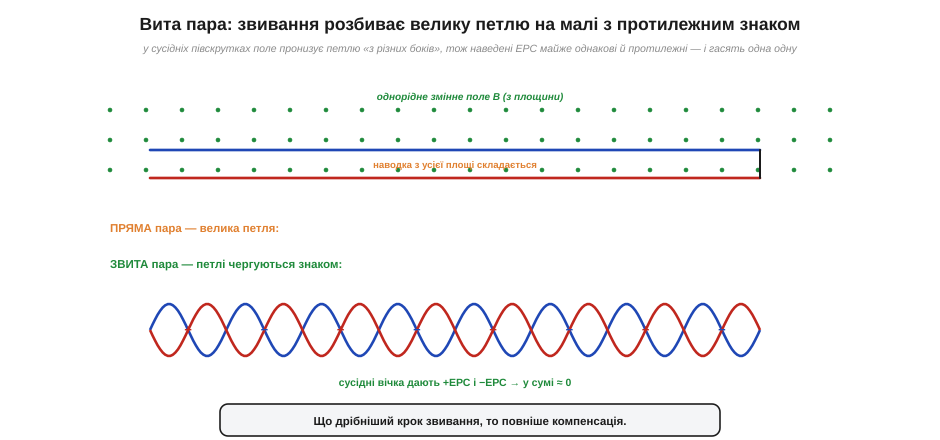
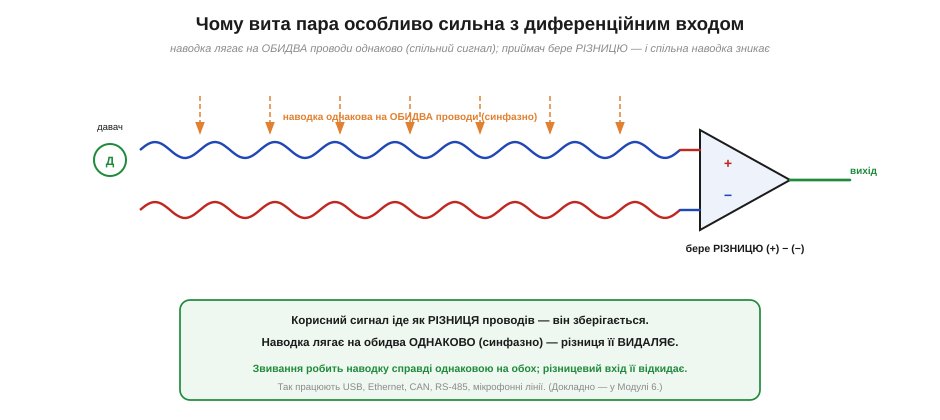

# Вита пара: геометрія проти наводок

З усіх засобів проти завад **вита пара** (*twisted pair*) — найелегантніший. Жодного екрана, жодної електроніки, жодних додаткових деталей — лише два проводи, **перевиті** один навколо одного. І ця проста геометрична хитрість гасить магнітну наводку на порядки. Вита пара — у телефонній лінії, в Ethernet-кабелі, в USB, у CAN-шині автомобіля, в лініях RS-485 і мікрофонів. Зрозуміти, **чому** перевивання працює, — значить остаточно засвоїти головну думку про [магнітну наводку](root:ph-electromagnetism/inductive-coupling): вона живе на **площі петлі**, а вмілою геометрією цю площу можна не просто зменшити, а змусити **саму себе погасити**.

Чому взагалі звивання, а не просто «притиснути проводи»? Адже відомо: тримай прямий і зворотний провід поряд — і площа петлі мала. Це правда, і притиснута пара вже сильно краща за розкидані дроти. Але в неї лишається одна **залишкова** петля по всій довжині: хай вузька, та якщо поле неоднорідне або проводи десь трохи розходяться, наводка з цієї петлі накопичується **в один бік** уздовж усього кабелю. Звивання робить наступний, вирішальний крок: воно не просто тримає площу малою, а **перевертає її знак** кожну півскрутку. Тепер наводка вже не накопичується — вона по черзі додається й віднімається, і в сумі сама себе з'їдає. Різниця як між «зробити калюжу маленькою» (притиснута пара) і «зробити так, щоб кожна крапля мала собі протилежну» (вита пара). Друге — принципово сильніше.

### Як звивання гасить наводку

В основі лежить механізм [магнітної (індуктивної) наводки](root:ph-electromagnetism/inductive-coupling): змінне поле B, пронизуючи площу петлі, наводить ЕРС, пропорційну цій площі. Якщо проводи притиснути впритул, площа стає малою — наводка слабшає. Але можна зробити хитріше. Перевиймо проводи — і вони утворять не одну велику петлю, а **ланцюжок дрібних петельок**, що чергуються: одна закручена «за годинниковою стрілкою», наступна — «проти», далі знову «за», і так уздовж усього кабелю.

А тепер ключ. Зовнішнє магнітне поле, пронизуючи дві **сусідні** півскрутки, входить у них **з протилежних боків** (бо вони закручені в різні боки). Тому наведена ЕРС у сусідніх петельках виходить **майже однакова за величиною, але протилежна за знаком**: одна петелька дає +ε, наступна −ε, далі знову +ε... І коли ми складаємо всі ці внески вздовж проводу (а в замкненому контурі вони саме складаються послідовно), сусідні +ε і −ε **взаємно гасяться**. У сумі наводка наближається до нуля — і тим точніше, чим дрібніший крок звивання й чим однорідніше поле.


*Угорі — пряма пара з однією великою петлею: наводка з усієї площі складається. Унизу — звита пара: ланцюжок дрібних петельок чергового знаку. У сусідніх півскрутках поле пронизує петлю «з різних боків», тож наведені ЕРС майже рівні й протилежні (+ та −) і гасять одна одну. Що дрібніший крок звивання, то повніша компенсація.*

Це геніально саме своєю «безкоштовністю»: компенсація вбудована в **геометрію**, вона працює сама, без живлення й налаштування. Перевиті проводи самі стежать, щоб кожна петелька, що ловить наводку в один бік, мала сусідку, що ловить її в протилежний. Що рівномірніший і дрібніший крок звивання, то точніша взаємна компенсація — тому в якісних кабелях крок звивання витриманий і навіть різний для різних пар (щоб сусідні пари ще й не наводили одна на одну).

Чому компенсація все ж не ідеальна, варто розуміти чесно, щоб не сподіватися на диво. По-перше, поле в реальності не зовсім однорідне: якщо агресор дуже близько до одного боку пари, сусідні петельки ловлять трохи різну наводку, і гасіння неповне. По-друге, крок звивання скінченний: на дуже високих частотах, коли довжина хвилі завади стає порівнянною з кроком звивання, картина «+ε, −ε» збивається, і захист погіршується. По-третє, сама пара має бути **симетрична** відносно землі (обидва проводи однаково віддалені від навколишніх предметів) — інакше наводка ляже на них трохи по-різному. Тому реальне придушення витою парою — не нескінченне, а конкретні десятки децибелів, тим більші, чим дрібніший і рівніший крок та чим симетричніша пара. Але навіть «недосконале» гасіння в десятки разів — це колосальний виграш за нульову ціну, і саме тому виту пару застосовують усюди.

Корисно й зіставити виту пару з екраном, бо вони борються з **різними** завадами і чудово доповнюють одне одного. [Екран](root:hw-pcb/shielding) (заземлена оболонка) — це передусім захист від **електричного** поля; проти магнітного він сам по собі майже безсилий. Вита пара — навпаки: вона блискуче гасить **магнітну** наводку (бо зводить площу петлі й перевертає її знак), але від електричного поля сама не захищає (поле наводиться на обидва проводи). Тому для повного захисту їх **поєднують**: вита пара **в** заземленому екрані (так влаштовані екрановані кабелі FTP/STP). Звивання прибирає магнітну наводку, екран — електричну. Кожен робить те, що вміє найкраще.

> 🔧 **Навіщо це.** Тому до будь-якого віддаленого давача тягнуть **виту пару**, а не два випадкові дроти; тому Ethernet-кабель усередині — це чотири окремо звиті пари; тому сигнальний і його зворотний (земляний) провід завжди ведуть разом і за змоги перевивають. Це найдешевший спосіб приборкати магнітну наводку — він не коштує нічого, крім того, щоб **скрутити** проводи замість того, щоб кинути їх абияк. Один цей навик — «не розводь сигнал і землю, перевивай їх» — рятує більше слабких сигналів, ніж будь-який екран.

### Чому вита пара особливо сильна з диференційним входом

Вита пара блищить у повну силу в парі з **диференційним прийомом** (*differential signaling*) — способом передавати сигнал не «провід відносно землі», а як **різницю** між двома проводами. Чому ці двоє створені одне для одного, видно з простого міркування про **синфазну** заваду.

Будь-яка наводка — ємнісна чи магнітна, що лишилася після звивання, — лягає на **обидва** проводи витої пари **практично однаково**: вони ж ідуть упритул, в однаковому полі, на однаковій відстані від агресора. Така однакова на обох проводах завада зветься **синфазною** (*common-mode*). А приймач бере не абсолютний рівень кожного проводу, а їхню **різницю**. Корисний сигнал переданий саме як різниця проводів — він зберігається. А синфазна завада, **однакова** на обох, при відніманні дає нуль: (сигнал + завада) − (завада) = сигнал. Завада зникає сама!


*Сигнал іде як РІЗНИЦЯ двох проводів витої пари. Наводка лягає на обидва проводи ОДНАКОВО (синфазно — бо проводи поруч, у тому самому полі). Приймач (різницевий вхід) бере (+)−(−): корисна різниця зберігається, а однакова на обох наводка віднімається до нуля. Так працюють USB, Ethernet, CAN, RS-485, мікрофонні лінії.*

Ось чому ці два прийоми посилюють один одного. **Звивання** робить наводку справді **однаковою** на обох проводах (без нього один провід ловив би більше, ніж інший, і завада не була б ідеально синфазною). А **диференційний вхід** цю однакову наводку **відкидає**, віднімаючи проводи. Перше готує заваду до знищення, друге її знищує. Разом вони дають захист, недосяжний для кожного окремо, — і саме тому на цьому дуеті збудовані всі сучасні швидкі й завадостійкі лінії зв'язку. (Як саме влаштований [диференційний прийом](root:com-medium/differential-pair) і чому він такий стійкий — окрема велика тема; тут досить інтуїції «однакову на обох заваду різниця прибирає».)

Здатність приймача відкидати синфазну заваду навіть має власну міру — її називають **коефіцієнтом подавлення синфазного сигналу** (*CMRR, common-mode rejection ratio*), і в добрих диференційних приймачів він сягає 80–120 дБ, тобто синфазна завада придушується в десятки тисяч і мільйони разів. Помножте це на десятки децибелів, що дає саме звивання, — і стає зрозуміло, чому виту пару з диференційним прийомом майже неможливо «забити» наводкою. Саме тому, попри здавалося б застарілий вигляд «двох скручених дротиків», ця технологія не лише не вмерла, а перемогла: Ethernet тримає гігабіти по витих парах, автомобільний CAN надійно працює в електрично «брудному» моторному відсіку, промисловий RS-485 тягне сигнал на сотні метрів повз силові кабелі. Усюди, де треба передати сигнал далеко й завадостійко, відповідь та сама — **вита пара плюс диференційний прийом**. Проста геометрія, помножена на просте віднімання, дає те, чого не купиш дорогою електронікою.

**Приклад (наскільки звивання гасить наводку).** Пряма пара з петлею завдовжки 1 м і шириною 1 см ловить, скажімо, наводку Uпрям. Перевиймо її з кроком 1 см — на метрі вийде близько 100 півскруток, що чергуються знаком:

```
пряма пара:   одна петля площею A = 0.01 м × 1 м = 0.01 м²  → наводка Uпрям
звита пара:   ~100 дрібних петельок, сусідні гасяться парами
              лишкова наводка ~ (Uпрям) / (кілька десятків)
              типове придушення витою парою: 20…40 дБ і більше
```

Двадцять-сорок децибелів придушення — це в десятки й сотні разів менша наводка, отримана **задарма**, самим лише скручуванням проводів. А додавши диференційний прийом, що відкидає синфазну заваду ще на 60–80 дБ, отримуємо лінію, якій майже байдуже до магнітних завад. Ось чому виту пару не витіснив жоден дорожчий засіб: проста геометрія дає те, за що інакше довелося б платити складною електронікою.

Звідки взагалі взялася ця ідея — скручувати проводи? Не з теорії, а з болючого досвіду. Перші телефонні лінії були однопровідними (зворотний струм ішов через землю — як у телеграфі), і вони нещадно ловили наводку від сусідніх ліній та, згодом, від силових і трамвайних мереж. Перехід на **два** проводи (повноцінна петля) і їх **звивання** виявився рятунком: наводка, що раніше била по одному проводу, тепер лягала на обидва однаково й гасилася. Це інженерне відкриття XIX століття виявилося настільки фундаментальним, що пережило всі зміни технологій — від механічних комутаторів до оптики поряд — і досі лежить в основі найшвидших мідних ліній. Рідко буває, щоб прийом, винайдений для телефону позаминулого століття, без змін працював у гігабітному Ethernet; вита пара — саме такий випадок. Як усе це втілено в [реальних кабелях](root:com-medium/utp-cable) — категорії (Cat 5e, Cat 6…), витриманий і різний для кожної пари крок звивання, екранований (FTP/STP) проти неекранованого (UTP), — окрема тема, але принцип, що стоїть за всіма цими цифрами, той самий: зменшити площу петлі й перевернути її знак звиванням.

> 📜 А чи знаєте ви, що звивання проводів **запатентував** не хто інший, як Александер Белл (1881)? Щоправда, тоді він боровся ще не з силовими наводками, а з перехресним «дзвоном» між телефонними лініями; справжня війна з гулом від трамваїв і силових мереж розгорнулася трохи пізніше. Як це було — у вставці [Телефон проти телеграфу: як Белл запатентував звивання](root:com-medium/twisted-pair/hist-twisted-pair.md).

Підсумок простий і потужний: магнітну наводку перемагає не екран і не дорога електроніка, а **геометрія** — площу петлі зменшують, тримаючи сигнал і його зворотний провід поряд, а звиванням ще й перевертають її знак, щоб наводка погасила саму себе. Додайте диференційний прийом, що відкидає однакову на обох проводах заваду, — і виходить лінія, якій магнітне поле майже байдуже. Проста геометрія, помножена на просте віднімання, — ось чому два скручені дротики досі несуть гігабіти там, де складніші засоби пасують.

---
