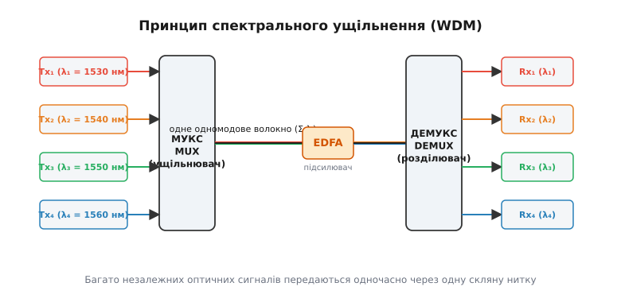
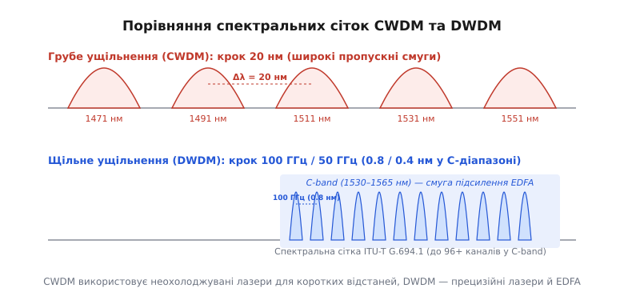
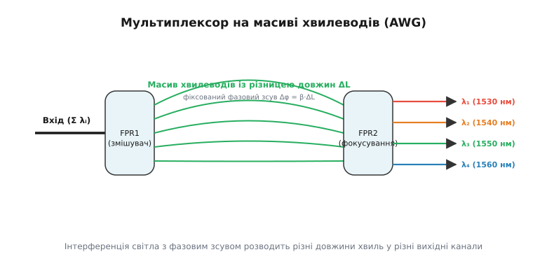

# Спектральне ущільнення (WDM)

<preknowlist>
- [Оптоволокно](root:com-medium/optical-fiber) — показник заломлення, одномодовий режим, загасання у склі та вікна прозорості.
- [Інтерференція хвиль](root:ph-waves/wave-interference) — накладання світлових хвиль, фазовий зсув, дифракційні ґратки.
</preknowlist>

Коли міжміська або трансокеанська оптична лінія вичерпує свою пропускну здатність, перед інженерами постає жорстокий економічний вибір. Перший шлях — викопати нову траншею в землі чи прокласти новий судновий кабель по дну океану й затягнути туди нову скляну нитку, що коштує мільйони доларів за кожен кілометр. Другий шлях — навчити вже прокладену скляну нитку передавати не один оптичний сигнал, а сотні сигналів одночасно. Скло, прозоре й лінійне за своєю природою, дозволяє багатьом світловим променям різного кольору (довжини хвилі) бігти тим самим одномодовим ядром, не змішуючись і не заважаючи один одному. Технологію, яка здійснює це мультиплексування, називають **спектральним ущільненням** або **WDM** (*Wavelength Division Multiplexing* — мультиплексування з розділенням за довжиною хвилі).

### 1. Базовий фізичний принцип: чому світлові хвилі не заважають одна одній

У основі спектрального ущільнення лежить фундаментальна властивість електромагнітного поля у діелектриках: **принцип суперпозиції хвиль**. У кварцовому склі (`SiO₂`) при помірних оптичних потужностях рівняння Максвелла є строго лінійними. Це означає, що коли через те саме одномодове волокно одночасно поширюються дві або більше світлових хвиль із різними частотами `f₁` та `f₂`, результуюче оптичне поле дорівнює точній векторній сумі цих хвиль. Вони перетинають одна одну без поглинання, розсіювання чи взаємного спотворення.

У радіозв'язку цей принцип відомий десятиліттями: в ефірі одночасно присутні сотні радіостанцій на різних частотах, а приймач налаштовується на потрібну несучу за допомогою резонансного контуру. Волоконно-оптичний зв'язок робить те саме, але на терагерцових частотах. Світловий діапазон, що використовується в оптоволокні, лежить у ближньому інфрачервоному спектрі з частотами близько `193 ТГц` (двісті трильйонів коливань за секунду).

Зв'язок між оптичною частотою хвилі `f`, її довжиною у вакуумі `λ` та швидкістю світла `c ≈ 3 × 10⁸ м/с` виражається фундаментальною формулою:

```text
f = c / λ
```

Для світлової хвилі з довжиною `λ = 1550 нм` (`1.55 × 10⁻⁶ м`) обчислимо відповідну оптичну частоту:

```text
f = 299792458 / (1.55 × 10⁻⁶)    [підстановка швидкості світла й довжини хвилі]
  = 1.93414 × 10¹⁴ Гц            [обчислення діленням]
  = 193.414 ТГц                 [переведення у терагерци]
```

Оскільки оптична частота вимірюється сотнями терагерц, загальна спектральна смуга прозорості кварцового волокна у проміжку від `1530 нм` до `1565 нм` (так званий C-діапазон, *Conventional Band*) складає близько `4.5 ТГц`. Це в тисячі разів перевищує весь радіочастотний спектр, розвіданий людством від довгих хвиль до міліметрових радарів.

Для ефективного використання цього велетенського спектрального ресурсу оптична лінія зв'язку будується як цілісний фотонний тракт.

Структурна схема WDM-лінії складається з п'яти ключових ланок:
1. **Передавачі (Tx)**: масив напівпровідникових лазерів, кожен з яких генерує світло строго фіксованої довжини хвилі (`λ₁`, `λ₂`, `λ₃`…).
2. **Оптичний мультиплексор (MUX)**: пасивний фотонний пристрій, який об'єднує багато колірних пучків від різних лазерів в один спільний світловий потік.
3. **Лінійне волокно**: одномодова скляна нитка, якою сумарний спектральний потік поширюється на десятки або сотні кілометрів.
4. **Оптичний підсилювач (EDFA)**: аналогове фотонне поле, яке підсилює всі спектральні канали одночасно без їх електронного розбирання.
5. **Оптичний демультиплексор (DEMUX)**: пасивний фотонний пристрій на приймальному кінці, який розкладає сумарне світло назад на окремі довжини хвиль і спрямовує кожну хвилю на свій персональний фотоприймач (Rx).


*Принцип розділення сигналів за довжинами хвиль у єдиному волокні за допомогою мультиплексора, підсилювача EDFA та демультиплексора.*

Суть лінійності кварцового скловолокна полягає в тім, що діелектрична сприйнятливість середовища залишається постійною в широкому діапазоні інтенсивностей світла. Коли два лазерних промені з різними довжинами хвиль потрапляють у скляну серцевину, вони створюють сумарну поляризацію середовища, яка є точним додаванням двох незалежних осциляцій. Це дозволяє кожному оптичному каналу нести власний потік цифрових даних (будь то Ethernet-пакети, цифрові відеопотоки чи телефонія) зі своєю власною швидкістю модуляції, абсолютно «не знаючи» про існування сусідніх каналів.

Про деталі того, як ця технологія розвивалася від перших експериментів 1970-х років до комерційного вибуху 1990-х, читайте в [Історії WDM](root:com-medium/wdm/hist-wdm.md).

---

### 2. Класифікація WDM: Грубе (CWDM) проти Щільного (DWDM)

У залежності від щільності розміщення оптичних каналів у спектрі та технології лазерів, спектральне ущільнення поділяють на два основних класи: **грубе (CWDM)** та **щільне (DWDM)**.

```text
                  ┌─────────────────────────────────────────┐
                  │       Спектральне ущільнення (WDM)       │
                  └────────────────────┬────────────────────┘
                                       │
            ┌──────────────────────────┴──────────────────────────┐
            ▼                                                     ▼
┌───────────────────────┐                             ┌───────────────────────┐
│     CWDM (Грубе)      │                             │     DWDM (Щільне)     │
├───────────────────────┤                             ├───────────────────────┤
│ • Крок: 20 нм         │                             │ • Крок: 100/50/25 ГГц │
│ • 18 каналів (O-L)    │                             │ • 96+ каналів (C/L)   │
│ • Неохолоджувані DFB  │                             │ • Охолоджувані TEC    │
│ • Відстань: < 80 км   │                             │ • Відстань: > 1000 км │
│ • Без підсилювачів    │                             │ • З підсилюванням EDFA│
└───────────────────────┘                             └───────────────────────┘
```

#### Грубе спектральне ущільнення (CWDM)

**CWDM** (*Coarse WDM*) стандартизоване рекомендацією ITU-T G.694.2. Воно використовує дуже широкий спектральний крок між сусідніми каналами — **20 нм** (близько `2.5 ТГц`). Спектральна сітка охоплює `18` стандартизованих довжин хвиль від `1271 нм` до `1611 нм`.

Головна перевага CWDM — **дешевизна лазерів та оптики**. Оскільки відстань між каналами складає `20 нм`, пропускні смуги оптичних фільтрів є широкими (`±6.5 нм`). Це дозволяє застосовувати недорогі напівпровідникові DFB-лазери без термоелектричних охолоджувачів (TEC). При зміні навколишньої температури від `-40 °C` до `+85 °C` довжина хвилі неохолоджуваного лазера плаває зі швидкістю близько `0.1 нм / °C`, тобто дрейфує на `8–10 нм`. Оскільки канал CWDM має ширину `20 нм`, лазерний промінь залишається всередині свого пропускного вікна без застосування складних систем термостабілізації.

Приймачі у CWDM-системах також виготовляються за спрощеною технологією: широкосмугові PIN-фотодіоди не вимагають точного спектрального селектування, оскільки розділення хвиль повністю виконується пасивним блоком тонкоплівкових фільтрів MUX/DEMUX.

Однак CWDM має два фундаментальних обмеження:
1. **Неможливість оптичного підсилення**: канали CWDM розкидані по всьому діапазону від `1271 нм` до `1611 нм`. Жоден сучасний оптичний підсилювач не здатен підсилити таку гігантську смугу (`340 нм`) одночасно.
2. **Обмежена дальність**: канали в E-діапазоні (`1371–1451 нм`) зазнають підвищеного загасання у волокні через водневий пік поглинання іонів `OH⁻`. Тому CWDM застосовують виключно на коротких дистанціях (до `40–80 км`) у міських мережах (*Metro/Access*), корпоративних з'єднаннях та мережах мобільного зв'язку 5G Fronthaul.

#### Щільне спектральне ущільнення (DWDM)

**DWDM** (*Dense WDM*) стандартизоване рекомендацією ITU-T G.694.1 і призначене для високошвидкісних магістралей великої дальності. У DWDM канали упаковані надзвичайно щільно: фіксований частотний крок складає **100 ГГц** (близько `0.8 нм`), **50 ГГц** (близько `0.4 нм`) або **25 ГГц** (близько `0.2 нм`).

Уся робоча сітка DWDM сконцентрована у вузьких вікнах найвищої прозорості кварцового скла: C-діапазоні (`1530–1565 нм`) та L-діапазоні (`1565–1625 нм`). У C-діапазоні при кроці `50 ГГц` уміщується **96 незалежних оптичних каналів** на одну пару волокон.

Завдяки тому, що всі канали DWDM лежать у проміжку `1530–1565 нм`, вони ідеально потрапляють у смугу підсилення **ербієвих підсилювачів (EDFA)**. Це дозволяє передавати сумарний багатотерабітний потік на тисячі кілометрів через десятки каскадних підсилювальних прольотів без жодного електронного регенератора.

Ціною високої щільності DWDM є висока вимогливість до точності джерела світла. Лазерний дрейф навіть на `0.1 нм` призведе до накладання на сусідній канал. Тому DWDM-передавачі оснащують прецизійними лазерами з термоелектричними охолоджувачами (TEC) та довжинохвильовими локерами (*wavelength lockers*), які утримують частоту лазера з точністю до кількох пікометрів.


*Порівняння 20-нанометрового кроку CWDM та 100/50-гігагерцового кроку DWDM у смузі підсилення EDFA (C-band).*

У системній інженерії вибір між CWDM та DWDM диктується економічним балансом між початковими капітальними витратами (*CAPEX*) та операційними масштабуваннями (*OPEX*). Для невеликого міського вузла на 4–8 каналів швидкістю 10 Гбіт/с пасивне CWDM рішення дає змогу зекономити до 70% вартості обладнання. Проте коли виникає потреба нарощування ємності до терабітних масштабів чи побудови міжміського лінійного тракту довжиною 500–2000 км, альтернативи DWDM не існує.

Детальну таблицю частот каналів ITU-T та карти реєстрів оптичних трансиверів дивіться у [Специфікації сітки ITU-T та DOM-моніторингу](root:com-medium/wdm/api-dwdm-grid.md).

---

### 3. Анатомія оптичного тракту: від транспондера до демультиплексора

Щоб зрозуміти, як фізичний сигнал проходить через лінію DWDM, розберемо роль кожного активного та пасивного елемента у тракті.

```text
Клієнтський ┌──────────┐ ITU-λ ┌──────┐ Σ λᵢ ┌──────┐ Σ λᵢ ┌────────┐ ITU-λ ┌──────────┐ Клієнтський
сигнал ────►│Транспондер├─────►│ MUX  ├────►│ EDFA ├────►│ DEMUX  ├─────►│Транспондер├────►сигнал
(сіра оптика)└──────────┘      └──────┘      └──────┘      └────────┘      └──────────┘ (сіра оптика)
```

#### Транспондери та Муксспондери

Більшість клієнтського мережевого обладнання (компутатори Ethernet, маршрутизатори, коммутатори) випромінюють так звану «сіру оптику» — стандартні світлові імпульси на довжині хвилі `850 нм` або `1310 нм` з широким спектром, які не прив'язані до сітки ITU.

Завдання **транспондера** — прийняти вхідний «сірий» оптичний сигнал, детектувати його фотодіодом, перетворити на цифровий потік даних і заново випромінити його на прецизійній «кольоровій» довжині хвилі `λ_i` строго за сіткою ITU-T DWDM. **Муксспондер** (*Muxponder*) виконує додаткову функцію: він приймає кілька низькошвидкісних клієнтських сигналів (наприклад, чотири канали по `10G Ethernet`) і мультиплексує їх в один високошвидкісний оптичний канал `40G` або `100G` на одній довжині хвилі (наприклад, за допомогою цифрових контейнерів оптичної транспорної мережі OTN / ITU-T G.709).

Транспондер також здійснює пряму корекцію помилок (FEC, *Forward Error Correction*). Блок FEC додає до кожного кадру вихідного цифрового сигналу виправляючі контрольні біти (наприклад, код Ріда-Соломона або турбо-коди). На приймальному боці декодер FEC здатний виправляти до `10⁻³` вхідних бітових помилок, знижуючи результуючий коефіцієнт помилок до `BER < 10⁻¹⁵`. Це дає так званий «енергетичний виграш кодування» (*coding gain*) у `6–9 дБ`, що дозволяє збільшити довжину міжпідсилювальних прольотів або підвищити стійкість системи до оптичного шуму.

#### Оптичні мультиплексори/демультиплексори (MUX / DEMUX)

Мультиплексор об'єднує окремі довжини хвиль в один промінь. На виході MUX всі оптичні канали поширюються по єдиній скляній нитці. Залежно від кількості каналів використовують дві основні фотонні технології:
- **Тонкоплівкові фільтри (TFF, *Thin Film Filters*)**: інтерференційні діелектричні дзеркала, що пропускають одну довжину хвилі й відбивають решту. Ідеальні для CWDM та компактних систем DWDM на `4–8` каналів.
- **Масиви хвилеводів (AWG, *Arrayed Waveguide Grating*)**: планарні світловодні мікросхеми, у яких світло розщеплюється на сотні паралельних оптичних мікроканалів із фіксованою різницею довжин `ΔL`. Проходячи ці канали, хвилі отримують фазовий зсув, пропорційний їх довжині хвилі `λ`, і при вихідній інтерференції фокусуються строго у власні вихідні порти. AWG дозволяє мультиплексувати `40`, `80` або `96` каналів на єдиному чіпі.


*Схема фотонної інтегральної мікросхеми AWG: інтерференція світла з фазовим зсувом розводить канали по вихідних хвилеводах.*

#### Оптичні підсилювачі (EDFA та Раман)

Під час поширення по волокну світло зазнає загасання (близько `0.22 дБ/км` на `1550 нм`). Через кожні `80 км` траси потужність сигналу падає майже у `60` разів (`17.6 дБ`).

Для підсилення багатоканального потоку в DWDM застосовують **підсилювачі на ербієвому волокні (EDFA)**. Короткий відрізок волокна (`10–30 м`), легований іонами ербію `Er³⁺`, накачується допоміжним лазером з довжиною хвилі `980 нм` або `1480 нм`. Вхідні світлові фотони WDM-каналів стимулюють збуджені іони ербію до випромінювання тотожних фотонів. У результаті **усі 96 каналів підсилюються одночасно** в одному скляному кабелі без перетворення світла в електрику.

Для вирівнювання коефіцієнта підсилення по всіх каналах у боксі EDFA обов'язково встановлюють оптичний фільтр вирівнювання підсилення (GFF, *Gain Flattening Filter*). Без GFF канали в центрі смуги підсилення (біля `1532 нм` та `1550 нм`) росли б швидше за крайні канали, що після кількох підсилювальних прольотів призвело б до повного придушення слабких крайніх каналів оптичним шумом.

На наддовгих магістралях додатково застосовують **стимульоване раманівське підсилення** (Raman amplifiers), яке перетворює саме магістральне волокно лінії на розподілене середовище підсилення шляхом подачі зустрічного випромінювання потужного лазера накачки.

Докладний аналіз внутрішньої будови TFF, AWG та систем автоматичного регулювання коефіцієнта підсилення AGC у підсилювачах EDFA наведено в описі [Оптичних мультиплексорів та підсилювачів](root:com-medium/wdm/comp-awg.md).

---

### 4. Динамічне перенаправлення довжин хвиль: ROADM та WSS

Перше покоління DWDM-систем було жорстко статичним: довжини хвиль прокладалися між двома фіксованими точками А та Б. Якщо на проміжній станції потрібно було виділити один канал, туди врізали пасивний оптичний фільтр Add/Drop. Щоб змінити маршрут оптичного каналу, доводилося вручну перекомутовувати оптичні патчкордні шнури в шафі.

Сучасні фотонні мережі будують на основі **перебудовуваних оптичних мультиплексорів вводу/виводу** (ROADM, *Reconfigurable Optical Add-Drop Multiplexer*).

Серцем ROADM є **перебудовуваний за довжиною хвилі оптичний комутатор** (WSS, *Wavelength Selective Switch*). Всередині WSS вхідний багатоколірний оптичний пучок розкладається у спектр за допомогою дифракційної ґратки й фокусується на матрицю з рідких кристалів на кремнії (LCoS, *Liquid Crystal on Silicon*) або масив мікроелектромеханічних дзеркал (MEMS).

```text
Вхідний потік        ┌────────────────────────────────────────┐   Вихід 1 (Транзит)
(λ₁, λ₂, λ₃, λ₄) ───►│       Оптичний комутатор WSS          ├─────────────────► λ₁, λ₃
                     │   (LCoS / MEMS рідкі кристали)        │
                     └───────────────────┬────────────────────┘   Вихід 2 (Drop)
                                         └───────────────────────► λ₂, λ₄
```

Керуючи напругою на кожному пікселі LCoS-матриці, мережевий контролер змінює фазовий рельєф рідких кристалів для будь-якої довжини хвилі `λ_i`. Це дозволяє програмово:
- Перенаправити хвилю `λ_i` у довільний транзитний вихідний порт без перетворення в електричний струм.
- Спрямувати хвилю `λ_i` на місцевий порт скидання (Drop) до приймача локального вузла.
- Підмішати нову довжину хвилі з порту вводу (Add) у загальний потік.
- Вирівняти оптичну потужність будь-якого окремого каналу (*Dynamic Gain Equalization*).

Завдяки ROADM оптична магістраль перетворюється на **прозору фотонну мережу** (*All-Optical Network*): світловий імпульс може пролетіти від Токіо до Лондона крізь десятки проміжних вузлів та океанських підсилювачів, ні разу не перетворюючись на електричний струм.

Сучасний мережевий рівень автоматично переналаштовує маршрути довжин хвиль при пошкодженні оптичного кабелю в ґрунті. Якщо магістральний кабель між містами А і Б перебито екскаватором, оптичний контролер за частки секунди віддає команду WSS-комутаторам у вузлах, і потрібні спектральні канали `λ_i` автоматично перенаправляються в обхід по резервному кільцю через місто В.

Архітектура **CDC-ROADM** додає три революційні властивості:
- **Colorless (безколірність)**: порти вводу/виводу більше не прив'язані до конкретної довжини хвилі.
- **Directionless (ненаправленість)**: транспондер можна програмно перенаправити у будь-який оптичний напрямок вузла (на північ, південь, схід чи захід).
- **Contentionless (безконфліктність)**: у той самий блок Add/Drop можна одночасно подавати кілька каналів з однаковою довжиною хвилі, що прийшли з різних напрямків мережі.

---

### 5. Фізичні обмеження, нелінійні ефекти та накопичення шуму

Хоча скло здається ідеальним середовищем, на високих швидкостях та довгих дистанціях DWDM зіштовхується з фундаментальними фізичними бар'єрами.

#### Хроматична та поляризаційна дисперсія

Навіть усередині єдиного оптичного каналу світловий імпульс складається з вузького спектра частот. Оскільки показник заломлення скла `n(λ)` залежить від довжини хвилі, різні спектральні компоненти імпульсу біжать волокном із різною швидкістю. На виході лінії світловий імпульс розпливається в часі. Це **хроматична дисперсія** (CD, *Chromatic Dispersion*), яка у стандартному волокні G.652 складає близько `17 пс / (нм · км)` на довжині хвилі `1550 нм`.

При довжині траси `1000 км` сумарна дисперсія досягає `17000 пс/нм`, що повністю нищить сигнал на швидкостях `10 Гбіт/с` та вище, якщо не вживати заходів компенсації. Додатково позначається **поляризаційна модова дисперсія** (PMD), викликана мікроскопічною некруглістю серцевини волокна, через яку дві ортогональні поляризаційні моди світла біжать з різними швидкостями.

#### Нелінійні ефекти Керра

Коли у скляну нитку діаметром всього `9 мікрометрів` ущільнюють `96` каналів, сумарна оптична потужність випромінювання перевищує сотні міліватів. Висока щільність електричного поля світлової хвилі розганяє нелінійний відгук електронних оболонок атомів кремнію — **ефект Керра** (залежність показника заломлення від інтенсивності світла `n = n₀ + n₂ · I`).

Нелінійність Керра викликає три небезпечних ефекти у DWDM:
1. **Самофазова модуляція (SPM)**: потужний імпульс каналу змінює власний показник заломлення, уширяючи свій спектр.
2. **Перехресна фазова модуляція (XPM)**: флуктуації потужності сусідніх каналів `λ_j` фазово модулюють канал `λ_i`.
3. **Чотирихвильове змішування (FWM, *Four-Wave Mixing*)**: три оптичні частоти `f_i`, `f_j`, `f_k` через нелінійну сприйнятливість скла генерують нову паразитичну частоту `f_ijk = f_i + f_j - f_k`. Якщо частотна сітка є рівновіддаленою, паразитична частота влучає прямо у діючий сусідній канал, створюючи непереборну заваду.

Для боротьби з FWM розроблено спеціальні волокна з ненульовою зміщеною дисперсією (NZ-DSF, ITU-T G.655). Невелика наявність хроматичної дисперсії змушує хвилі різних каналів рухатися з різними фазовими швидкостями, руйнуючи фазовий синхронізм нелінійного чотирихвильового змішування.

#### Накопичення оптичного шуму (OSNR)

Кожен проміжний підсилювач EDFA додає у волокно шум спонтанного випромінювання (ASE, *Amplified Spontaneous Emission*). Проходячи каскад із `N` підсилювачів, потужності шуму ASE додаються, погіршуючи підсумкове відношення оптичного сигналу до шуму (OSNR, *Optical Signal-to-Noise Ratio*).

Математичний розрахунок накопичення шуму OSNR, формулу граничної спектральної ефективності за Шенноном та рівняння чотирихвильового змішування дивіться у [Фізичних межах та розрахунку спектральної ефективності WDM](root:com-medium/wdm/math-wdm-capacity.md).

---

### 6. Еволюція до когерентного WDM та систем Flex-Grid

Упродовж двох десятиліть передача даних у DWDM здійснювалася амплітудною модуляцією прямого детектування (OOK, *On-Off Keying*): є світловий спалах — одиниця, немає — нуль. Проте на швидкостях понад `40 Гбіт/с` на канал прямому детектуванню не вистачило оптичного відношення сигнал/шум та стійкості до дисперсії.

Революцією 2010-х років став перехід до **когерентного оптичного зв'язку** (*Coherent DWDM*).

```text
Вхідне  ┌─────────┐ Оптичний ┌──────────────────────┐  IQ-сигнал  ┌───────────┐ Цифрові
світло ─►│Змішувач ├─────────►│ Матриця фотодіодів   ├───────────►│ Цифровий  ├──►дані
         │ (Hybrid)│          │ (Balanced Detectors) │            │DSP-процесор│   (100G/400G/800G)
         └────▲────┘          └──────────────────────┘            └───────────┘
              │
      ┌───────┴──────┐
      │Гетеродинний  │ (Локальний лазер фотоприймача)
      │  лазер (LO)  │
      └──────────────┘
```

У когерентній системі оптичний приймач не просто міряє інтенсивність світла фотодіодом. Він змішує вхідний світловий промінь з випромінюванням власного локального лазера-гетеродина (*Local Oscillator*). Це дозволяє виміряти **і амплітуду, і фазу, і поляризацію** світлової хвилі.

Застосовуючи подвійну поляризацію та квадратурну амплітудну модуляцію (DP-QPSK, DP-16QAM, DP-64QAM), когерентний транспондер передає кілька бітів інформації за один світловий символ. Потужний цифровий сигнальний процесор (DSP) на виході приймача компенсує хроматичну дисперсію `17000 пс/нм` та поляризаційне розпливання чисто математично у цифровій формі, повністю усуваючи потребу в громіздких оптичних компенсаторах дисперсії (DCM).

Когерентний цифровий сигнальний процесор (DSP) виконує алгоритм компенсації хроматичної дисперсії шляхом згортки цифрового сигналу з оберненою імпульсною характеристикою оптичного волокна. Алгоритм Constant Modulus Algorithm (CMA) виправляє поляризаційне змішування векторів електромагнітного поля, а алгоритми відновлення несучої фази нейтралізують фазовий шум передавального та гетеродинного лазерів.

#### Гнучка спектральна сітка (Flex-Grid)

З появою когерентних сигналів зі швидкостями `400 Гбіт/с`, `800 Гбіт/с` та `1.2 Тбіт/с` виявилося, що високі символьні швидкості (понад `90 Гбод`) більше не влазять у стандартний частотний крок `50 ГГц`.

Для вирішення цієї задачі ITU-T ухвалив розширення стандарту G.694.1 — **Flex-Grid (гнучка сітка)**. Замість фіксованих слотів по `50 ГГц` спектр волокна розбивається на дрібні атомарні гранули шириною **12.5 ГГц**. Для кожного оптичного каналу ROADM програмно нарізає спектральний слот довільної ширини, кратної `12.5 ГГц` (наприклад, `37.5 ГГц` для 100G, `62.5 ГГц` для 400G чи `112.5 ГГц` для 800G).

```text
Фіксована сітка 50 ГГц:  │ 50 ГГц │ 50 ГГц │ 50 ГГц │ 50 ГГц │  (Фіксовані межі)
Гнучка сітка Flex-Grid: │  37.5 ГГц  │   62.5 ГГц   │ 75 ГГц │  (Динамічні слоти n × 12.5 ГГц)
```

Практичну програмну реалізацію розрахунку спектральних параметрів каналів, накопичення OSNR та перевірки дисперсійного бюджету лінії наведено в [Моделюванні каналу DWDM та розрахунку оптичного бюджету](root:com-medium/wdm/proj-wdm-sim.md).

---

### 7. Практичне застосування та проектування ліній

При розробці та експлуатації магістральних ліній DWDM інженери розраховують оптичний бюджет потужності та запас за оптичним відношенням сигнал/шум.

Головний критерій працездатності тракту — забезпечення рівня оптичної потужності на приймачі в межах динамічного діапазону photo-приймача та підтримання OSNR вище порога незбігання помилок FEC (*Forward Error Correction*).

Оптичний бюджет розраховується за формулою:

```text
P_rx = P_tx - L_mux - (N_spans · L_span · α) - L_demux + (N_edfa · G_edfa)
```

де `P_tx` — рівень випромінювання лазера передавача (типово `0... +3 дБм` на канал), `L_mux` та `L_demux` — втрати на мультиплексуванні (`3...5 дБ`), `α` — коефіцієнт загасання кабелю, `G_edfa` — коефіцієнт підсилення проміжних підсилювачів.

Запас за потужністю вибирається не менше `3 дБ` для компенсації старіння лазерних діодів, можливих ремонтних зварок волокна при розривах кабелю та температурних коливань.

> 🔧 **Навіщо це.** Спектральне ущільнення WDM є не просто опцією, а **єдиним фізичним способом** існування сучасного інформаційного суспільства. Без WDM кожен морський кабель між континентами передавав би один канал `10 Гбіт/с`, а для забезпечення трафіку глобального Інтернету довелося б вкрити дно океанів мільйонами скляних кабелів.
> 
> На практиці WDM застосовують на трьох рівнях:
> 1. **Трансокеанські та міжконтинентальні магістралі**: системи DWDM з когерентними транспондерами та підсилювачами EDFA/Raman забезпечують ємність понад `20–30 терабіт за секунду` на пару волокон у кабелях через Атлантичний та Тихий океани.
> 2. **Міждатацентрові з'єднання (DCI, *Data Center Interconnect*)**: компактні системи DWDM формату 1U підключають датацентри хмарних провайдерів (Google, AWS, Azure, Cloudflare) на швидкостях `400G / 800G` за допомогою оптичних модулів QSFP-DD та OSFP ZR/ZR+.
> 3. **Міські та опорні мережі мобільного зв'язку (5G Fronthaul/Backhaul)**: грубе ущільнення CWDM та DWDM на базі оптичних модулів SFP28/QSFP28 дозволяє передавати десятки каналів від базових станцій 5G до центральних процесорних вузлів через єдину орендовану волоконну жилу.
