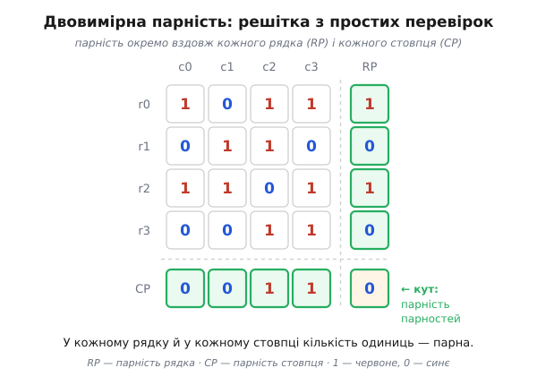
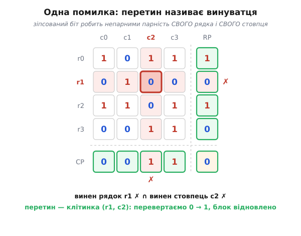
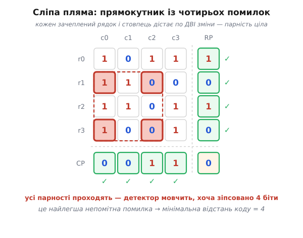

# Двовимірна парність

<preknowlist>
- [Біт парності](topic:com-modulation/parity-bit) — один зайвий біт = XOR усіх бітів даних; ловить непарне число помилок і сліпий до парного; сам лише сигналить про збій, а не показує його місце.
- [Відстань Геммінга](topic:com-modulation/hamming-distance) — мінімальна відстань між дозволеними словами коду; саме вона визначає, скільки помилок код виявить і скільки виправить.
</preknowlist>

Окремий [біт парності](topic:com-modulation/parity-bit) відповідає рівно на одне питання: чи перевернулося непарне число бітів? Тому він уміє зняти тривогу, але не вміє тицьнути пальцем — знає, що щось зламалося, і гадки не має, що саме. Напрошується наступне: чи не можна з кількох таких самих дешевих перевірок, розставлених з розумом, скласти не просто дзвінок тривоги, а **адресу** зіпсованого біта? Двовимірна парність (*2D parity*) відповідає — можна, і не потребує для цього нічого хитрішого за ті самі біти парності, лише викладені **решіткою**.

### Чому саме решітка

Одна перевірка парності дає один біт відповіді: «сума одиниць парна» або «непарна». Один біт — це замало навіть на те, щоб натякнути, **де** саме сталася біда: він не розрізняє першу клітинку від сотої, бо рахує їх усі в одну купу. Щоб указати місце, потрібні **координати**, а координата — це завжди перетин двох незалежних напрямків: рядка й стовпця, широти й довготи.

Звідси й ідея. Викладімо біти даних не в один довгий рядок, а **прямокутником**, і порахуймо парність **окремо вздовж кожного рядка** й **окремо вздовж кожного стовпця**. Тепер у кожного біта два «підписи»: у якому він рядку і в якому стовпці. Один перевернутий біт псує парність свого рядка **і** парність свого стовпця — і більше нічого. Один зіпсований рядок плюс один зіпсований стовпець перетинаються рівно в одній клітинці. Дві звичайні одновимірні перевірки, поставлені вздовж різних осей, разом дають **двовимірну** координату помилки.

### Решітка з парностей

Складаймо код на конкретному прикладі. Візьмімо 16 бітів даних і розкладімо їх у сітку 4×4. До кожного **рядка** допишімо праворуч біт парності (щоб одиниць у рядку разом стало парне число), а під кожним **стовпцем** — біт парності знизу. Права колонка зберігає парність рядків, нижня стрічка — парність стовпців.


*Двовимірна парність над блоком 4×4. Кожен рядок доповнено бітом, що робить кількість одиниць у ньому парною; так само кожен стовпець. Нижній правий кут — парність нижньої стрічки, і водночас парність правої колонки: ці два числа завжди збігаються, бо обидва рахують парність усіх 16 бітів даних. Тепер парне число одиниць має бути в кожному рядку й у кожному стовпці без винятку.*

```
        c0 c1 c2 c3 | RP
  r0:    1  0  1  1 |  1     рядок r0: одиниць 3 → додаємо 1, разом 4 (парно)
  r1:    0  1  1  0 |  0     рядок r1: одиниць 2 → додаємо 0
  r2:    1  1  0  1 |  1     рядок r2: одиниць 3 → додаємо 1
  r3:    0  0  1  1 |  0     рядок r3: одиниць 2 → додаємо 0
        -----------+---
  CP:    0  0  1  1 |  0     ← парність стовпців, а кут — парність усього
```

Кожен біт правої колонки (RP, *row parity*) — це просто XOR свого рядка; кожен біт нижньої стрічки (CP, *column parity*) — XOR свого стовпця. Лишається одна особлива клітинка: нижній правий кут. Її можна порахувати двояко — як парність нижньої стрічки або як парність правої колонки, — і обидва способи завжди дають те саме число, бо кожен із них насправді рахує парність усіх шістнадцяти бітів даних, тільки різним шляхом. Цей кут — **парність парностей**: він стереже самі біти парності, щоб і вони не залишились без нагляду. З ним уся таблиця стає симетричною: правило «в кожному рядку й у кожному стовпці одиниць парне число» тепер справджується скрізь, включно з доданими рядком і колонкою.

> 🔧 **Навіщо це.** Той самий прийом «парність уздовж рядків і вздовж стовпців» десятиліттями возили на магнітній стрічці й ганяли послідовними лініями під назвами LRC і VRC (докладніше — у [короткій історії цих скорочень](topic:com-modulation/2d-parity/hist-tape-vrc-lrc.md)). Причина проста: розкласти дані в сітку й додати два ряди парності коштує кільканадцять елементарних XOR-ів — стільки ж, скільки й звичайна парність, — а натомість дістаємо здатність не лише **побачити** поодиноку помилку, а й **виправити** її, не перепитуючи передавача. Там, де кожен повторний запит дорогий (стрічка вже перемотана, супутник за півсекунди від'їхав далі), уміння латати збій на місці варте цих кількох зайвих бітів.

### Перетин називає винуватця

Тепер найцікавіше — те, заради чого решітка й будувалася. Хай під час передачі перевернувся один біт даних, скажімо, у рядку `r1`, стовпці `c2`: була одиниця, стала нуль. Приймач перераховує всі парності й дивиться, які **не збігаються** з очікуваними (такий сигнал неузгодженості називають **синдромом**).


*Виправлення однієї помилки. Перевернутий біт робить непарною кількість одиниць у своєму рядку та у своєму стовпці — обидві перевірки червоніють. Рядок `r1` і стовпець `c2` перетинаються в єдиній клітинці; це й є зіпсований біт. Перевертаємо його назад — і блок цілий, без жодного повторного запиту до передавача.*

```
        c0 c1 c2 c3 | RP
  r0:    1  0  1  1 |  1     ✓
  r1:    0  1  0  0 |  0     ✗  одиниць 1 (непарно) → рядок r1 винен
  r2:    1  1  0  1 |  1     ✓
  r3:    0  0  1  1 |  0     ✓
        -----------+---
  CP:    0  0  1  1 |  0
               ✗             стовпець c2: одиниць 3 (непарно) → стовпець c2 винен

  винен рядок r1 ∩ винен стовпець c2  →  клітинка (r1, c2)
  перевертаємо (r1, c2) назад: 0 → 1  →  блок відновлено
```

Ось він, стрибок від «помітити» до «виправити». Звичайна парність дає лише бінарний вердикт — цілий блок чи битий. Дві парності вздовж двох осей дають **дві координати**, а дві координати однозначно вказують точку на площині. Приймач навіть не мусить нічого перепитувати: він сам знаходить зіпсований біт і сам його перевертає. Саме цю думку — що надлишок можна влаштувати так, щоб він **називав місце** помилки, — доведено до досконалості в [коді Геммінга](topic:com-modulation/hamming-code), де кілька біт парності складаються прямо в двійковий номер зіпсованого біта. Двовимірна парність — найпростіше й найнаочніше її втілення.

А що, коли перевернувся не біт даних, а сам біт парності — скажімо, у правій колонці? Тоді неузгодженим стане рівно один рядок (той, чию парність зіпсовано) і рівно один стовпець — колонка парності. Їхній перетин указує на **саму** зіпсовану клітинку парності. Схема не плутається: вона чесно каже «зіпсовано ось цей біт», а що він службовий, а не даних, — то й поготів, дані цілі. Симетрія таблиці працює на нас: біти парності захищені точно так само, як і біти даних.

### Що вона гарантує, а що ні

Одну помилку решітка завжди виправляє. Але щойно помилок стає більше, картина синдромів ускладнюється, і тут важливо не обманюватись. Розберімо чесно.

Хай перевернулися **два** біти в одному рядку. Парність цього рядка змінилася двічі — тобто повернулася на місце, рядок мовчить. Зате постраждали **два різні стовпці**, і обидва кричать. Приймач бачить дивну картину: жоден рядок не винен, а стовпців винних два. Це вже не схема однієї помилки (там було б рівно один рядок і рівно один стовпець), тож виправляти наосліп не можна — але сам факт збою видно ясно. Код чесно каже «щось зламалося, полагодити не беруся» і просить перепередати.

Хай тепер дві помилки лягли в **різні** рядки й **різні** стовпці. Тоді зчервоніють два рядки й два стовпці, а їхні перетини дадуть **чотири** клітинки-кандидати, з яких насправді зіпсовано лише дві — по діагоналі. Яку саме пару перевертати, розрізнити неможливо: обидві діагоналі однаково узгоджуються з синдромом. Знову: помилку **виявлено**, але не виправлено.

Звідси просте й чесне правило декодера: **рівно один поганий рядок і рівно один поганий стовпець → виправляємо їхній перетин; будь-яка інша картина синдромів → оголошуємо блок битим і просимо повтор.** У числах ця поведінка описується однією величиною — [мінімальною відстанню](topic:com-modulation/hamming-distance) коду, яка тут дорівнює 4: цього якраз вистачає, щоб гарантовано **виявити** будь-які одну, дві чи три помилки й **виправити** будь-яку одну. Звідки береться саме четвірка й чому вона межа — у [розкладі двовимірної парності як добутку двох простих кодів](topic:com-modulation/product-codes).

### Сліпа пляма: прямокутник

У кожного дешевого коду є конфігурація помилок, яку він не бачить; знайдімо її для решітки. Нам потрібні помилки, що **не зрушують жодної** парності — ні рядкової, ні стовпцевої. Парність рядка не зрушиться, якщо в ньому перевернути **парне** число бітів; те саме для стовпця. Найменша така фігура — чотири біти в кутах прямокутника.


*Сліпа пляма двовимірної парності. Перевернуто чотири біти, що стоять у кутах прямокутника: два рядки й два стовпці. Кожен зачеплений рядок дістає рівно дві зміни — його парність зберігається; кожен зачеплений стовпець теж дві — і його парність ціла. Усі перевірки проходять, детектор мовчить, хоча зіпсовано аж чотири біти. Це найлегша непомітна помилка — саме тому мінімальна відстань коду дорівнює 4.*

Кожен із двох зачеплених рядків дістає по дві зміни — його парність недоторкана. Кожен із двох стовпців — теж по дві, недоторкані й вони. Усі синдроми нульові, приймач упевнено каже «цілий блок», а насправді зіпсовано чотири біти. Ця прямокутна четвірка — найлегша помилка, яку код проґавлює; тому й кажуть, що його мінімальна відстань дорівнює саме 4, і на менше не спускається.

Виглядає як вирок, але на практиці ця слабкість трапляється рідше, ніж здається, і навіть обертається силою проти **пакетних** помилок. Пакетна помилка (*burst*) — це серія збоїв, що вдаряє по кількох **сусідніх** бітах поспіль. Якщо передавати блок рядок за рядком, такий пакет ляже всередині **одного** рядка. І хай він перекине хоч п'ять бітів підряд — кожен із цих п'яти сидить у **своєму** стовпці, тож п'ять стовпців зчервоніють і викажуть біду. Двовимірна парність **виявляє будь-який пакет завширшки до цілого рядка** — саме тому її часто ставили там, де завади приходять чергами. Про природу таких пакетів — стаття про [пакетні помилки](topic:com-modulation/burst-error); а прийом, що навмисно розкидає сусідні біти по різних рядках, щоб код бачив пакет як окремі поодинокі збої, — це [перемішування](topic:com-modulation/interleaving).

### Де вона живе і де її межа

Двовимірна парність народилася в залізі й довго була буденністю. На магнітній стрічці кожен запис через усі доріжки ніс біт парності (вертикальна перевірка, VRC), а наприкінці блоку дописувалась ціла стрічка парності вздовж доріжок (поздовжня перевірка, LRC) — разом виходила рівно та сама решітка. Той самий дует VRC+LRC перевіряв символи й блоки в ранніх послідовних протоколах, зокрема в IBM-івському Bisync, оголошеному 1967 року. Звідки взялися ці скорочення й чому саме стрічка їх любила — у [короткій історії LRC і VRC](topic:com-modulation/2d-parity/hist-tape-vrc-lrc.md). Та сама ідея «парність уздовж рядків і вздовж стовпців» живе й дотепер у більшому масштабі — у дискових масивах, де вздовж одного напрямку стоять диски даних, а вздовж іншого — диски парності.

Місце двовимірної парності в загальній картині зрозуміле. Вона потужніша за самотній біт парності — бо не лише бачить, а й лагодить поодиноку помилку, — і незрівнянно простіша й дешевша за справжні алгебраїчні коди. Але її гарантія скромна: виправити один збій, виявити кілька. Щойно канал шумить густо або б'є важкими пакетами по кількох рядках одразу, решітки замало — тоді беруть чутливіші до значень [контрольні суми](topic:com-modulation/checksums) чи [CRC](topic:com-modulation/crc) для виявлення, а для виправлення — потужні коди на кшталт [Ріда–Соломона](topic:com-modulation/reed-solomon), часто в парі з перемішуванням. Побачити всю механіку в дії — кодування сітки, впорскування збою, пошук і виправлення через перетин синдромів, а також демонстрацію прямокутної сліпої плями — можна в [робочому коді двовимірної парності](topic:com-modulation/2d-parity/proj-2d-parity.md).

І все ж саме ця скромна решітка вперше показує думку, на якій тримається вся теорія виправних кодів: надлишок можна влаштувати не просто щоб він сигналив про помилку, а щоб він **називав її місце**. Один біт парності дає тривогу; два ряди парності дають координату. А координата — це вже не «щось зламалося», це «зламалося **ось тут**, тримай, полагоджено».
