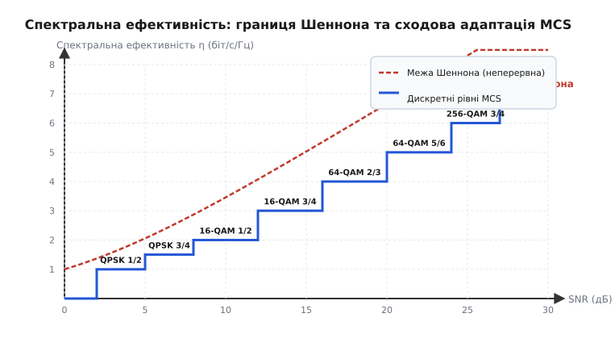
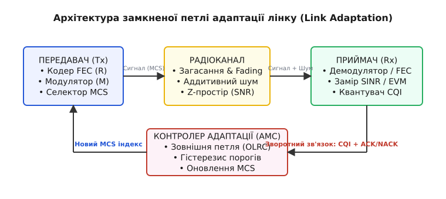
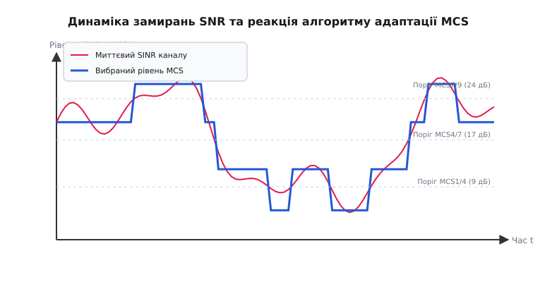

# Адаптивна модуляція і кодування

<preknowlist>
- [FSK і PSK](root:com-modulation/fsk-psk) — векторні сузір'я амплітудно-фазової модуляції.
- [BER і SNR: крива надійності каналу](root:com-modulation/ber-snr-curve) — залежність ймовірності помилки від енергетики сигналу.
- [FEC для потокового відео](root:com-modulation/fec-channel-coding) — завадостійке кодування каналу та швидкість коду.
- [Смуга і межа Шеннона](root:math-information/bandwidth-capacity) — теоретична межа спектральної ефективності каналу з шумом.
</preknowlist>

У мобільній мережі 4G LTE базова станція передає потік відео на смартфон користувача. Коли абонент знаходиться за 50 метрів від вежі в зоні прямої видимості, відношення сигналу до шуму (SNR) сягає 30 дБ — це дозволяє передавати 8 біт на символ за допомогою модуляції 256-QAM із завадостійким кодуванням 5/6. Проте коли користувач заходить у ліфт або заїжджає в підземний тунель, загасання радіохвиль знижує SNR до 3 дБ. За фіксованих налаштувань 256-QAM приймач бачить суцільне розмиття амплітудно-фазової сітки: ймовірність помилки блоку наближається до 100%, і передача повністю зупиняється. Якщо ж розробники зв'язку заздалегідь зафіксують найпростішу модуляцію QPSK 1/2 «з розрахунку на найгірший тунель», канал у затишному офісі віддаватиме лише 1 біт на символ замість 6.67 — втрачається понад 85% потенційної ємності ефіру.

Цю фундаментальну суперечність між надійністю та швидкістю вирішує **адаптивна модуляція і кодування** (англ. *Adaptive Modulation and Coding*, AMC; від лат. *adaptare* — пристосовувати). Замість використання незмінного сигналу передавач динамічно, сотні разів на секунду, змінює щільність модулювального сузір'я та надлишок завадостійкого коду відповідно до миттєвого стану радіоефіру.

## Дилема енергетики: чому фіксована модуляція програє ефіру

Будь-який цифровий бездротовий канал перебуває під впливом двох протилежних чинників: загасання сигналу з відстанню та шумів приймального тракту. Якість прийому оцінюють відношенням сигналу до шуму (англ. *Signal-to-Noise Ratio*, SNR) або з урахуванням завад від сусідніх вишок — відношенням сигналу до шуму й завад (англ. *Signal-to-Interference-plus-Noise Ratio*, SINR).

Високий порядок модуляції (наприклад, 256-QAM або 1024-QAM) пакує багато бітів у кожен випромінюваний символ. Проте відстань між сусідніми точками в сузір'ї стає мізерною. Найменший шумовий поштовх вибиває прийнятий вектор у сусідній сектор сузір'я, викликаючи помилку декодування. Низький порядок модуляції (QPSK або BPSK), навпаки, розносить точки сузір'я на максимальну фазову відстань одна від одної. Такий сигнал здатний пробивати важкий рівень завад, але кожен символ несе лише 1–2 біти.

Завадостійке кодування (англ. *Forward Error Correction*, FEC) діє за схожим принципом. Код зі швидкістю `R = k/n` додає `n - k` перевірочних бітів на кожні `k` корисних бітів. При `R = 1/2` половина випромінюваного обсягу — це надлишкова захисна інформація, яка дозволяє відбудувати дані навіть при втраті частини бітів. При `R = 9/10` захисний шар становить лише 10%, що дає високий корисний бітрейт, але вимагає майже ідеального каналу.

Якщо зафіксувати режим передачі на сталий рівень, виникає безвихідний компроміс:
1. **Агресивна фіксована схема (256-QAM 9/10):** дає величезну швидкість поблизу передавача, але вмить «падає» при найменшому зсуві пристрою за перешкоду або появі мультиплексних відлунь.
2. **Консервативна фіксована схема (QPSK 1/2):** працює стабільно на самій межі покриття, але марнує смугу частот, коли приймач знаходиться поруч із базовою станцією.

Адаптивна модуляція і кодування усуває цей компроміс. Вона перетворює лінію зв'язку з негнучкого дрібного каналу на саморегульовану систему, яка неперервно знімає метрики ефіру й обирає максимально можливу швидкість, за якої ймовірність помилки не перевищує допустимий ліміт.

## Концепція MCS: об'єднання модуляції та коду в єдину сітку

Щоб передавач і приймач узгоджено перемикали режими без надмірних накладних витрат, порядки модуляції та швидкості коду об'єднують у дискретний набір комбінацій — **схеми модуляції та кодування** (англ. *Modulation and Coding Scheme*, MCS).

Кожному індексу MCS відповідає чітко визначена підсумкова **спектральна ефективність** `η` (ета), яка вимірюється в бітах за секунду на один герц смуги (`біт/с/Гц`):

```
η = R · log₂(M)    [біт/с/Гц]
```

де `M` — кількість станів (точок) модулювального сузір'я, а `R = k/n` — швидкість завадостійкого коду.

Таблиця нижче демонструє типову сітку MCS, яка застосовується в сучасних бездротових стандартах (4G LTE, 5G NR та Wi-Fi 6):

| Індекс MCS | Модуляція | Бітів на символ `log₂(M)` | Швидкість коду `R` | Спектральна ефективність `η` | Необхідне SNR (BLER ≤ 10%) |
| :---: | :---: | :---: | :---: | :---: | :---: |
| **MCS 0** | QPSK | 2 | 1/2 (0.50) | 1.00 біт/с/Гц | 2.5 дБ |
| **MCS 1** | QPSK | 2 | 3/4 (0.75) | 1.50 біт/с/Гц | 5.0 дБ |
| **MCS 2** | 16-QAM | 4 | 1/2 (0.50) | 2.00 біт/с/Гц | 7.3 дБ |
| **MCS 3** | 16-QAM | 4 | 3/4 (0.75) | 3.00 біт/с/Гц | 10.5 дБ |
| **MCS 4** | 64-QAM | 6 | 2/3 (0.67) | 4.00 біт/с/Гц | 14.3 дБ |
| **MCS 5** | 64-QAM | 6 | 5/6 (0.83) | 5.00 біт/с/Гц | 18.0 дБ |
| **MCS 6** | 256-QAM | 8 | 3/4 (0.75) | 6.00 біт/с/Гц | 21.0 дБ |
| **MCS 7** | 256-QAM | 8 | 5/6 (0.83) | 6.67 біт/с/Гц | 24.5 дБ |

Зміна індексу MCS описується дискретною сходовою функцією. На графіку нижче показано зіставлення дискретних сходинок реальних рівнів MCS із теоретичною межею Шеннона:


*Дискретні рівні MCS формують сходову криву, яка прямує уздовж теоретичної границі Шеннона. При зростанні SNR система піднімається на вищу сходинку.*

Кожна сходинка MCS покриває свій діапазон SNR. Коли якість сигналу підвищується, адаптивний контролер переступає на вищу сходинку, збільшуючи пропускну здатність каналу. Повну алгебру розрахунку енергетичних порогів та межі Шеннона виведено в [математичному розрахунку порогів SNR і спектральної ефективності](root:com-modulation/adaptive-modulation/math-snr-mcs-thresholds.md).

## Архітектура замкненої петлі адаптації (Link Adaptation)

Для здійснення адаптації передавач повинен знати, що відбувається на приймальній стороні. Механізм зворотного зв'язку та вибору індексу MCS називають **адаптацією лінку** (англ. *Link Adaptation*). Існує дві базові архітектури управління:

1. **Відкрита петля (Open-loop Adaptation):** Передавач самостійно оцінює якість каналу за непрямими ознаками — наприклад, за рівнем сигналу зворотного напрямку (в припущенні взаємності каналу, англ. *channel reciprocity*) або за коефіцієнтом втрати пакетів ACK/NACK.
2. **Замкнена петля (Closed-loop Adaptation):** Приймач постійно вимірює характеристики ефіру й прямо передає передавачу звіт про стан каналу.

Замкнена петля є найбільш точною та ефективною. Вона складається з чотирьох послідовних кроків:


*Приймач знімає метрики каналу, квантує їх у показник CQI і надсилає назад на передавач, де AMC-контролер оновлює поточний індекс MCS.*

### Крок 1. Замір стану каналу (CSI Estimation)
Приймач аналізує ефір за допомогою спецсигналів — **пилотів** (англ. *pilot symbols* / *Reference Signals*, RS). Вони передаються на відомих частотах із фіксованою амплітудою та фазою. Зіставляючи прийняту хвилю з еталоном, демодулятор розраховує:
* **SINR (Signal-to-Interference-plus-Noise Ratio):** співвідношення корисної енергії до завад і шуму.
* **EVM (Error Vector Magnitude):** векторну величину відхилення прийнятих точок сузір'я від їх ідеальних центрів.
* **Частотно-вибіркову характеристику:** амплітудний профіль згасання піднесних у широкому каналі (OFDM).

### Крок 2. Квантування індексу CQI (Channel Quality Indicator)
Виміряне значення SINR (наприклад, `14.8 дБ`) є неперервним числом із плаваючою крапкою. Передавати його по зворотному каналу в сирому вигляді марнотратно. Тому приймач квантує виміряний рівень у короткий цілочисельний індекс — **індикатор якості каналу** (англ. *Channel Quality Indicator*, CQI).

В LTE та 5G NR індекс CQI кодується 4 бітами (від 1 до 15). Кожен індекс CQI прямо вказує базовій станції найбільший MCS, за якого ймовірність помилки блоку кадру (англ. *Block Error Rate*, BLER) не перевищить 10%.

### Крок 3. Передача зворотного зв'язку (Feedback Loop)
Індекс CQI упаковується в службовий кадр зворотного каналу (наприклад, PUCCH в LTE або звичайний ACK-пакет у Wi-Fi). Важливим параметром є **затримка зворотного зв'язку** (англ. *feedback latency*). У мобільних мережах 4G/5G звіт CQI надсилається кожні 2–10 мілісекунд.

### Крок 4. Прийняття рішення AMC-контролером
Отримавши індекс CQI та інформацію про наявність підтверджень ACK/NACK від декодера, контролер адаптації на передавачі затверджує новий MCS для наступного кадру.

## Частотно-вибіркова адаптація та підсмуги у широкосмугових системах

У сучасних широкосмугових системах мультиплексування OFDM (Wi-Fi 6/7, 4G LTE, 5G NR) радіоканал завширшки 20, 80 або 100 МГц є **частотно-вибірковим**. Через відлуння від будинків і стін окремі ділянки спектра згасають на 15–20 дБ глибше за сусідні частоти.

Якщо адаптувати модуляцію єдиним усередненим значенням (англ. *Wideband CQI*), то найгірша ділянка спектра затопить помилками весь кадр. Щоб цього уникнути, широкосмуговий канал розбивають на **підсмуги** (англ. *subbands*):
1. **Звіт за підсмугами (Subband CQI):** Приймач розраховує окремий індекс CQI для кожної групи піднесних (Resource Block Group, RBG).
2. **Адаптивне завантаження бітів (Bit Loading):** Передавач модулює піднесні в глибоких провалах безпечним QPSK або BPSK, а на чистому центральному плато ставлять 256-QAM чи 1024-QAM.

Завдяки цьому вдається ефективно використовувати навіть глибоко спотворений частотно-вибірковий канал, витискаючи максимум інформації з кожної прозорої частотної скибки.

## Поєднання з багатоантенними системами MIMO (Spatial Link Adaptation)

У багатовхідних-багатовихідних системах MIMO (англ. *Multiple-Input Multiple-Output*) до вибору модуляції та коду додається третій вимір — **просторова адаптація** (англ. *Spatial Link Adaptation*).

Передавач має вибір: надсилати один потік даних із високою модуляцією (256-QAM) через обидві антени або розбити потік на два паралельні просторові шари (Layers) з простішою модуляцією (16-QAM):

* **Ранг каналу (Rank Indicator, RI):** Приймач вимірює матрицю каналу `H` і повідомляє передавачу допустиму кількість незалежних просторових потоків `RI` (наприклад, `RI = 1`, `RI = 2` або `RI = 4`).
* **Матричний прекодер (Precoding Matrix Indicator, PMI):** Приймач підбирає оптимальну комплексно-фазову матрицю прекодування для формування спрямованих променів.
* **Багатопотоковий CQI:** Для кожного просторового потоку передається власний індекс CQI, що дозволяє виставити MCS 6 на первинному промені та MCS 3 на слабшому другому промені.

Просторова адаптація дозволяє системі гнучко переключатися між режимом збільшення дальності (Beamforming / Diversity) та режимом подвоєння швидкості (Spatial Multiplexing).

## Взаємодія AMC із синергією HARQ (Hybrid ARQ)

Адаптивна модуляція і кодування працює в нерозривному зв'язку з механізмом **гібридного автоматичного повтору запитів** (англ. *Hybrid Automatic Repeat reQuest*, HARQ). Завдання AMC — виставити такий індекс MCS, який забезпечить успішну доставку кадру з першої спроби у 90% випадків (`BLER ≈ 10%`).

Якщо ж окремий кадр все одно виявляється пошкодженим через раптовий сплеск завади, вмикається HARQ:
1. Приймач зсуває незакодовані м'які рішення (логарифми відношення правдоподібностей, LLR) зіпсованого кадру в спеціальний буфер (HARQ Soft Buffer).
2. Замість повторної передачі всього пакета на простішому MCS, передавач надсилає лише короткий блок виколотих перевірочних бітів (Incremental Redundancy HARQ, IR-HARQ).
3. Приймач об'єднує м'які відліки обох спроб у буфері й повторно запускає декодер LDPC чи турбокоду.

Завдяки синергії з HARQ контролеру AMC не потрібно бути надмірно обережним і тримати величезні запаси надійності: він може нахабно обирати найвищий MCS, знаючи, що поодинокі 10% помилок будуть моментально виправлені HARQ без падіння загального бітрейту.

## Алгоритми вибору MCS: гістерезис та зовнішня петля (OLRC)

Наївний підхід до вибору MCS полягає в прямому порівнянні миттєвого SINR із порогами з таблиці: якщо `SINR ≥ 14.3 дБ`, ставимо MCS 4; якщо `SINR < 14.3 дБ`, скидаємо на MCS 3. 

Проте в реальному ефірі миттєве SINR постійно коливається через шум вимірювань і дрібні завади. Якщо сигнал зависне точно на межі `14.3 дБ`, наївний алгоритм почне перемикати MCS на кожному кадрі. Виникає явище **«брязкання»** (англ. *chattering* або *ping-pong effect*). Це призводить до розривів у роботі декодера та марнування службового трафіку.

Для боротьби з брязканням і забезпечення стабільності застосовують два обов'язкових механізми: **гістерезис** та **зовнішню петлю адаптації** (OLRC).

### 1. Гістерезис перемикання (Hysteresis)
Перехід між індексами MCS виконується з розділеними порогами для руху «вгору» та «вниз». Щоб піднятися на вищий рівень MCS, SINR має перевищити поріг із додатковим запасом `Δ_up`. Щоб опуститися нижче, SINR має впасти нижче порогу на дельту `Δ_down`:

```
Перехід вгору (MCS_i → MCS_{i+1}):    SINR > SNR_th[i+1] + Δ_up
Перехід вниз (MCS_i → MCS_{i-1}):    SINR < SNR_th[i] − Δ_down
```

Завдяки цьому всередині діапазону створюється «зона спокою» (гістерезисна петля заввишки 1.0–1.5 дБ), яка ковтає дрібні шумові коливання й запобігає тригерній нестабільності.

### 2. Зовнішня петля регулювання бітрейту (Outer-Loop Rate Control, OLRC)
Значення CQI, надіслане приймачем, базується на вимірюванні пилот-сигналів. Проте пилоти вимірюють стан каналу в минулому. Якщо канальні умови змінюються швидше за затримку зворотного зв'язку, прийнятий індекс CQI стає неточним (виникає запізнення оцінки).

Щоб скоригувати цю похибку, AMC-контролер використовує другу **зовнішню петлю** (OLRC). Вона відстежує реальний результат декодування інформаційних блоків за індикаторами ACK/NACK:
* Якщо кадр декодовано успішно (отримано **ACK**), контролер повільно підвищує внутрішню поправку `Δ_offset` на малий крок `STEP_UP`.
* Якщо кадр зіпсовано (отримано **NACK**), контролер різко знижує поправку `Δ_offset` на великий крок `STEP_DOWN`.

Співвідношення кроків `STEP_UP` та `STEP_DOWN` визначається цільовим рівнем помилок блоку `BLER_target`:

```
STEP_UP / STEP_DOWN = BLER_target / (1 − BLER_target)
```

При цільовому `BLER = 10%` (тобто `0.10`) співвідношення дорівнює `0.10 / 0.90 = 1/9`. Це означає, що один NACK скидає поправку SINR на `0.9 дБ` вниз, тоді як для відновлення цього рівня потрібно отримати 9 послідовних підтверджень ACK по `0.1 дБ`. Таке асиметричне регулювання гарантує швидкий відхід від небезпечної зони помилок.

Динаміку зміни SINR під впливом замирань і реакцію алгоритму перемикання MCS проілюстровано на часовому графіку нижче:


*При глибоких замираннях SNR (червона лінія) алгоритм адаптації скидає індекс MCS (синя лінія) на нижчу сходинку, зберігаючи надійність прийому.*

Як саме ці алгоритми об'єднуються в єдину програмну систему на C та C++, детально показує робочий приклад у вставці [реалізація петлі адаптації MCS](root:com-modulation/adaptive-modulation/proj-amc-loop.md).

## Фізичні обмеження та крайні випадки

Адаптивна модуляція і кодування є потужним інструментом, проте її ефективність обмежена законами фізики радіохвиль та обчислювальною складністю трансіверів.

### 1. Швидкі замирання та доплерівський зсув (Fast Fading)
Коли автомобіль або швидкісний потяг рухається зі швидкістю 120 км/год, радіоканал зазнає швидких релеєвських замирань через доплерівський зсув частоти. Завмираючий провал глибиною 20 дБ може виникнути за кілька мілісекунд. 

Якщо час затримки зворотного зв'язку `τ_feedback` перевищує час когерентності каналу `τ_coherence`, передавач отримує застарілу інформацію CQI. Спроба передати 256-QAM у момент, коли канал уже провалився в яму, викликає серію втрат пакетів. У таких умовах алгоритм AMC змушений навмисно занижувати MCS і збільшувати зазори гістерезису.

### 2. Асиметрія каналів та накладні витрати на CQI
У багатьох радіосистемах (наприклад, супутниковий зв'язок або безпілотні апарати) прямий канал (Downlink, від станції до дрона) є високошвидкісним і широким, а зворотний канал (Uplink, від дрона до станції) — вузьким і обмеженим за потужністю. Передача детальних звітів CQI для багатьох піднесних з'їдає суттєву частку зворотного трафіку. Для компромісу звітність стискають: замість звіту по кожній піднесній надсилають один усереднений індекс (Wideband CQI).

## Порівняльна характеристика алгоритмів адаптації в бездротових стандартах

Різні бездротові технології оптимізують параметри AMC під свої специфічні задачі. Нижче наведено зведену порівняльну таблицю ключових характеристик адаптації:

| Стандарт зв'язку | Квант часу реагування (TTI) | Метод зворотного зв'язку | Кількість рівнів MCS / швидкостей | Максимальна модуляція |
| :--- | :---: | :---: | :---: | :---: |
| **GSM / EDGE** | 20 мс | Звіт RXQUAL / BER з BSC | 9 рівнів (MCS-1 ... MCS-9) | 8-PSK |
| **3G HSDPA** | 2 мс | 5-бітний CQI по HS-DPCCH | 30 індексів CQI | 64-QAM |
| **4G LTE** | 1 мс | 4-бітний CQI (Subband/Wideband) | 29 рівнів MCS | 256-QAM |
| **5G NR** | 0.125 – 1 мс | Гнучкий CSI (CQI, RI, PMI) | 32 рівні MCS | 1024-QAM |
| **Wi-Fi 6 (802.11ax)** | На рівні кадру | Статистика ACK/NACK + Compressed Beamforming | 12 рівнів (MCS 0 ... MCS 11) | 1024-QAM |
| **Wi-Fi 7 (802.11be)** | На рівні кадру | Multi-Link Operation + Preamble Puncturing | 16 рівнів (MCS 0 ... MCS 15) | 4096-QAM |
| **DVB-S2X** | Блок кадрів | Звіт ACM (Adaptive Coding & Modulation) | Понад 110 пар MODCOD | 256-APSK |

## Практичне застосування та ціна механізму

Сьогодні адаптивна модуляція і кодування є обов'язковим стандартом для всіх високошвидкісних цифрових радіосистем.

### 1. Стільниковий зв'язок (4G LTE, 5G NR)
У базових станціях 4G/5G селектор MCS є серцем MAC-рівня. Базова станція розподіляє частотні ресурси (Resource Blocks) між сотнями користувачів кожну мілісекунду. Для абонентів поблизу вежі призначаються блоки з 256-QAM / 1024-QAM, а для користувачів на краях стільника — QPSK з глибоким FEC-кодуванням. Це максимізує сумарну ємність вишки (англ. *Cell Throughput*).

### 2. Бездротові локальні мережі (Wi-Fi 4/5/6/7)
У протоколах 802.11a/b/g/n/ac/ax/be адаптація бітрейту реалізована на рівні драйвера мережевої карти (наприклад, модуль `Minstrel` у ядрі Linux). Роутер постійно оцінює відсоток підтверджень ACK на різних MCS і динамічно перемикається між 12–15 рівнями швидкості (від 6 Мбіт/с до кількох Гбіт/с). Історію формування цих алгоритмів від перших спроб у GSM до Wi-Fi 7 розкрито в [еволюції адаптації лінку](root:com-modulation/adaptive-modulation/hist-amc-evolution.md).

### 3. Цифрове супутникове мовлення (DVB-S2X)
У супутниковому мовленні DVB-S2X застосовується технологія ACM (Adaptive Coding and Modulation). Супутник передає загальний потік даних на десятки земних станцій. Якщо над одним із міст іде злива, що викликає поглинання сигналу в краплях води, супутник змінює MCS для пакетів, призначених саме цьому місту, залишаючи високошвидкісні MCS для регіонів із чистим небом.

### 4. Радіолінки безпілотних апаратів (FPV та телеметрія)
У сучасних цифрових відеолініях БПЛА (наприклад, DJI OcuSync, WiBotic або ExpressLRS) адаптивна модуляція дозволяє зберігати плавне відео без обривів. Коли дрон відлітає на велику відстань або заходить за пагорб, радіомодем моментально знижує порядок модуляції. Роздільна здатність відео тимчасово падає (з 1080p до 720p), проте оператор продовжує бачити картинку й зберігає контроль над бортом замість раптової появи «чорного екрана».

**Системна ціна адаптації:**
За досягнення максимальної пропускної здатності доводиться платити обчислювальною складністю. Приймач змушений витрачати ресурси DSP на постійний вимір пилотів та обрахунок матриць каналу, передавач — підтримувати об'ємні таблиці кодування для десятків MCS, а ефір — віддавати частину часу під передачу зворотних звітів CQI. Проте цей витрачений ресурс стократно окупається можливістю повністю вичерпувати фізичну межу Шеннона в будь-якій точці покриття.
