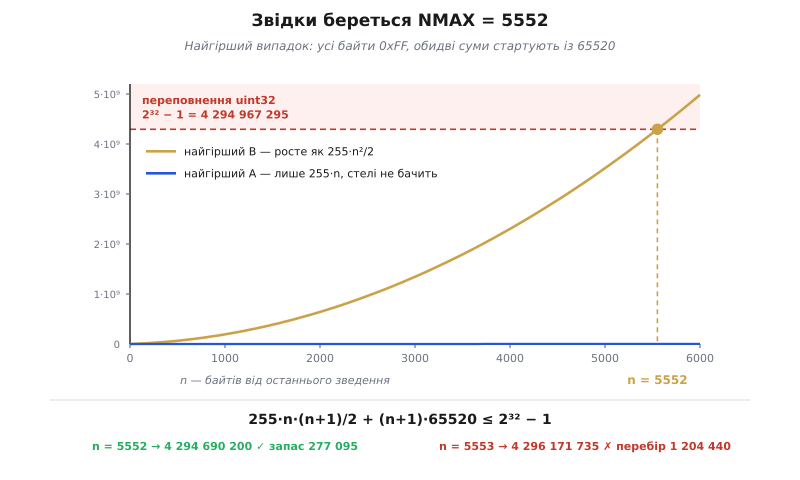
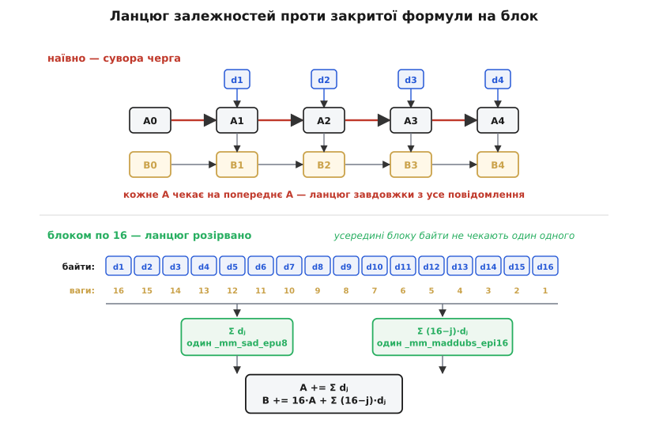

# ⚙️ Adler-32 у коді: наївний цикл, відкладений модуль і звідки взялося 5552

Наївна реалізація Adler-32 уміщається в шість рядків і працює правильно. Саме тому вона й лишається **еталоном**: усе, що ми зробимо з нею далі, мусить збігатися з нею біт у біт на будь-якому вході. Adler-32 — не внутрішня справа програми, а формат на дроті: ця сума лежить у хвості кожного zlib-потоку й усередині кожного PNG. «Швидше, але трохи інакше» тут не варте нічого — це просто інша сума, з якою не погодиться жоден читач ваших даних.

```c
uint32_t adler32_naive(const uint8_t *d, size_t n) {
    uint32_t a = 1, b = 0;
    for (size_t i = 0; i < n; i++) {
        a = (a + d[i]) % 65521;
        b = (b + a)    % 65521;
    }
    return (b << 16) | a;
}
```

Уся ціна цих шести рядків — у двох знаках `%`. Питання, з якого починається робота: скільки саме вони коштують і чому.

## Задача: чому наївний цикл повільний насправді

Перше, що спадає на думку: `%` — це ділення, а ділення коштує десятки тактів проти одного такту на додавання. Але це напівправда, і на ній варто спинитися, бо вона веде не туди.

Дільник тут **сталий**: 65521 відомий під час компіляції. Жоден пристойний компілятор не поставить сюди справжню машинну інструкцію ділення — він застосує давній трюк і замінить ділення на множення на обернене число зі зсувом. Замість одного дуже дорогого ділення виходить ланцюжок із трьох-чотирьох дешевих дій. Тобто справжня ціна `%` — не «десятки тактів», а «в кілька разів більше роботи, ніж додавання». Неприємно, але не катастрофа.

Катастрофа в іншому, і вона видніша, якщо дивитися не на **кількість** дій, а на їхню **чергу**. Погляньте на `a`. Щоб порахувати `a` на кроці *i*, треба знати `a` з кроку *i−1*. Значення `a` тягнеться крізь увесь цикл однією ниткою — це **ланцюг залежностей**. У такому циклі процесор майже безсилий: він уміє виконувати кілька інструкцій за такт і забігати вперед, але забігати нема куди — наступне додавання не має на що спертися, поки не дозріло попереднє. Швидкість упирається не в те, скільки в циклі інструкцій, а в **затримку найдовшої ланки**. І `%` сидить якраз усередині цієї ланки, розтягуючи її в кілька разів.

Отже, ворога названо: ланцюг залежностей. Далі — три способи його вкоротити, а тоді й розірвати.

> 🔧 **Навіщо це.** Ланцюг залежностей — та річ, через яку «оптимізований» код часто виявляється рівно такої самої швидкості, як неоптимізований. Ви прибрали половину інструкцій, а час не змінився: бо час диктувала не їхня кількість, а довжина нитки, крізь яку вони протягнуті. У Adler-32 ця нитка — `a`, і кожен наступний крок нижче б'є саме по ній: спершу викидає зведення з нитки, тоді рве нитку всередині блоку, а наприкінці міняє сам спосіб рахувати вікно.

## Ідея: зведення можна відкласти

Ключ — одна шкільна рівність:

```
(x mod m + y) mod m  =  (x + y) mod m
```

Зведення за модулем можна робити рано, а можна пізно — відповідь та сама. Ніщо не заважає додати сотню байтів поспіль і звести один раз наприкінці: результат не зміниться ні на біт, зміниться лише те, коли ми платимо.

Питання одне: **доки** можна відкладати? Поки ми не зводимо, `a` і `b` тільки ростуть, а живуть вони в 32-бітному регістрі. Щойно сума перевалить за 2³² − 1, регістр тихо обгорнеться — і відповідь стане не просто іншою, а неправильною, без жодного попередження.

Тут доречно спитати, чому ми взагалі за це зведення платимо. Якби модуль був степенем двійки — скажімо, 65536, — зведення було б безкоштовне: відкинути старші біти маскою `& 0xFFFF`, одна інструкція, і жодного відкладання не треба вигадувати. Adler-32 свідомо відмовилася від цієї халяви на користь простого 65521. Причина — в [арифметиці контрольної суми](topic:com-modulation/checksums/math-checksum-arithmetic.md): модуль-степінь-двійки лишає цілий клас невидимих помилок, бо різниці, кратні старшим степеням двійки, гинуть у молодших розрядах і не доходять до суми; непарний модуль той клас прибирає, але складене число (як-от 255 = 3·5·17) лишає збіги за спільними дільниками; і лише просте число тисне обидва класи, бо в лишках за простим модулем рівняння «різниця ≡ 0» має менше дешевих розв'язків. Просте 65521 — це і є та властивість, задля якої вся вправа з відкладанням і затівається: ми хочемо і рівномірне розсіяння, і ціну маски.

## Скільки саме можна відкласти

Рахуймо найгірший випадок — саме найгірший, бо контрольна сума мусить лишатися правильною й на тих даних, які хтось підібрав навмисне.

Нехай ми щойно звели обидві суми. Тоді на початку серії `0 ≤ a₀ ≤ 65520` і `0 ≤ b₀ ≤ 65520` — це найбільші лишки за модулем 65521. Найгірші дані — усі байти по 255, більшого байта не буває.

Після *i*-го байта серії:

```
aᵢ = a₀ + 255·i
```

`b` доливає поточне `a` на кожному кроці, тож після *n* байтів:

```
bₙ = b₀ + Σ aᵢ                     (i = 1…n)
   = b₀ + Σ (a₀ + 255·i)
   = b₀ + n·a₀ + 255·(1 + 2 + … + n)
   = b₀ + n·a₀ + 255·n·(n+1)/2
```

Підставмо найгірші старти `a₀ = b₀ = 65520`:

```
bₙ ≤ 65520 + n·65520 + 255·n·(n+1)/2
   = (n+1)·65520 + 255·n·(n+1)/2
```

Умова — не перелізти через стелю 32-бітного регістра:

```
255·n·(n+1)/2 + (n+1)·65520 ≤ 2³² − 1 = 4294967295
```

Лишилося знайти найбільше ціле *n*, яке цю нерівність задовольняє:

**Перевірка двох сусідніх кандидатів**

```
n = 5552:  255·5552·5553/2 = 3930857640
           5553·65520      =  363832560
           разом           = 4294690200 ≤ 4294967295   ✓ запас 277095

n = 5553:  255·5553·5554/2 = 3932273655
           5554·65520      =  363898080
           разом           = 4296171735 >  4294967295   ✗ перебір на 1204440
```

Ось і все: **NMAX = 5552**. Це не магічне число, не результат вимірювання й не чиясь уподоба — це найбільший цілий розв'язок однієї нерівності. У самому zlib над цим числом стоїть рівно той самий рядок:

```c
#define BASE 65521U     /* largest prime smaller than 65536 */
#define NMAX 5552
/* NMAX is the largest n such that 255n(n+1)/2 + (n+1)(BASE-1) <= 2^32-1 */
```

Дві дрібниці, які варто помітити.

**По-перше, `a` тут узагалі ні до чого.** У найгіршому разі після 5552 байтів `a` дійде до `65520 + 255·5552 = 1481280` — це 0.03 % від стелі. `a` не переповниться, скільки не відкладай: вона росте лінійно. Уся межа — про `b`, яка росте квадратично, бо накопичує не байти, а самі `a`. Квадрат і з'їдає регістр.


*Межа відкладання цілком визначена поведінкою `B`. Крива `B` — квадратична, вона й перетинає стелю 32-бітного регістра; крива `A` за той самий час ледве відривається від осі. Точка перетину і є NMAX = 5552, а запас під стелею — якихось 277 095, тобто шість тисячних відсотка.*

**По-друге, 5552 напрочуд зручно ділиться на 16:** `5552 = 16 · 347`. Нерівність про число 16 нічого не знала — це збіг, але zlib ним користується, розгортаючи внутрішній цикл на 16 кроків без жодного залишку:

```c
/* do length NMAX blocks -- requires just one modulo operation */
while (len >= NMAX) {
    len -= NMAX;
    n = NMAX / 16;          /* NMAX is divisible by 16 */
    do {
        DO16(buf);          /* 16 sums unrolled */
        buf += 16;
    } while (--n);
    MOD(adler);
    MOD(sum2);
}
```

## Робочий код: те, що насправді робить zlib

```c
#include <stdint.h>
#include <stddef.h>

#define BASE 65521U   /* найбільше просте, менше за 2¹⁶ */
#define NMAX 5552U    /* найдовша серія без зведення — виведення вище */

uint32_t adler32_fast(const uint8_t *d, size_t n) {
    uint32_t a = 1, b = 0;

    while (n) {
        size_t k = n < NMAX ? n : NMAX;   /* серія, що гарантовано не переповнить */
        n -= k;
        while (k--) {
            a += *d++;     /* у гарячому циклі — жодного зведення */
            b += a;
        }
        a %= BASE;         /* два зведення на всю серію, а не на кожен байт */
        b %= BASE;
    }
    return (b << 16) | a;
}
```

Подивімося, що змінилося в бухгалтерії. Було: два додавання й два зведення на кожен байт. Стало: два додавання на байт плюс два зведення на 5552 байти — тобто чотири десятитисячні зведення на байт. Ділення не прискорили й не оптимізували — його просто винесли з ланцюга, і воно зникло з рахунку. Ланка ланцюга тепер — одне додавання, найкоротше, що взагалі буває.

Далі zlib докручує ще, розгортаючи внутрішній цикл макросами:

```c
#define DO1(buf,i)  {adler += (buf)[i]; sum2 += adler;}
#define DO2(buf,i)  DO1(buf,i); DO1(buf,i+1);
#define DO4(buf,i)  DO2(buf,i); DO2(buf,i+2);
#define DO8(buf,i)  DO4(buf,i); DO4(buf,i+4);
#define DO16(buf)   DO8(buf,0); DO8(buf,8);
```

І тут варто бути чесним, бо розгортання люблять переоцінювати: воно **не** розриває ланцюг. `adler` як тяглася однією ниткою, так і тягнеться — `DO16` лише прибирає накладні витрати самого циклу (перевірку лічильника й перехід на кожному байті) і дає процесорові рівний потік інструкцій без розгалужень. Виграш відчутний, але скромний. Щоб розірвати ланцюг, коду замало — треба змінити математику.

## Векторизація: змінити не код, а математику

Питання, яке треба поставити: а чи справді `b` мусить чекати на кожне окреме `a`? Розпишімо, чим стануть `a` і `b` після цілого блоку з *k* байтів, не заглядаючи всередину блоку.

`a` після *j*-го байта блоку — це стартове `A` плюс усе, що встигло влитися:

```
aⱼ = A + d₁ + d₂ + … + dⱼ
```

`b` доливає кожне з них:

```
B' = B + a₁ + a₂ + … + a_k
   = B + k·A + (d₁) + (d₁+d₂) + … + (d₁+…+d_k)
```

Тепер порахуймо, скільки разів у цю суму входить кожен байт. `d₁` є в кожній із *k* дужок, `d₂` — у (k−1) дужках, останній `d_k` — лише в одній. Згортаємо:

```
A' = A + Σ dⱼ                        (j = 1…k)
B' = B + k·A + Σ (k − j + 1)·dⱼ      (j = 1…k)
```

Ось воно. Усередині блоку **ланцюга немає**: обидві суми — це дві звичайні згортки над *k* незалежними байтами. `Σ dⱼ` — проста сума. `Σ (k−j+1)·dⱼ` — зважена сума зі спадними вагами `k, k−1, …, 1`. Байти більше не чекають один одного; вони чекають лише на кінець блоку. Ми не переписали цикл швидше — ми переписали саму формулу так, що чекати стало нема на що.


*Нагорі — те, що робить наївний цикл: `A₁ → A₂ → A₃ …` тягнеться однією ниткою завдовжки з усе повідомлення, і жодне додавання не може початися раніше за попереднє. Унизу — та сама робота, переписана закритою формулою на блок із 16 байтів: усередині блоку байти незалежні, лишаються дві горизонтальні згортки — проста сума й зважена сума з вагами 16…1.*

А такі згортки — рідний хліб SIMD. Візьмімо `k = 16`, рівно один регістр XMM, і подивімося, у що лягає кожна з двох сум.

`Σ dⱼ` лягає в `_mm_sad_epu8` — суму модулів різниць. Проти нуля модуль різниці дорівнює самому значенню байта, тож `_mm_sad_epu8(v, 0)` дає дві часткові суми по вісім байтів кожна, у двох 64-бітних доріжках. Одна інструкція на всі 16 байтів.

`Σ (16−j)·dⱼ` лягає в `_mm_maddubs_epi16`: вона множить беззнакові байти на знакові байти-ваги й одразу додає сусідні пари в 16-бітні доріжки. Ваги `16, 15, …, 1` вільно влазять у знаковий байт. Лишається перевірити, що доріжки не переповняться: найбільше, що там може опинитися, — `255·16 + 255·15 = 7905`, а стеля знакового 16-бітного числа — 32767. Запас учетверо, насичення не станеться.

```c
#include <immintrin.h>   /* SSSE3 */

/* Доливає рівно 16 байтів у a і b — без жодного зведення за модулем. */
static inline void adler_block16(const uint8_t *d, uint32_t *a, uint32_t *b) {
    const __m128i zero = _mm_setzero_si128();
    const __m128i ones = _mm_set1_epi16(1);
    /* ваги 16,15,…,1 — саме в тому порядку, в якому байти лежать у пам'яті */
    const __m128i w = _mm_setr_epi8(16, 15, 14, 13, 12, 11, 10, 9,
                                     8,  7,  6,  5,  4,  3,  2, 1);

    __m128i v = _mm_loadu_si128((const __m128i *)d);

    *b += 16u * (*a);                              /* доданок k·A — на старому A! */

    __m128i s = _mm_sad_epu8(v, zero);             /* Σ dⱼ: дві часткові суми */
    s = _mm_add_epi32(s, _mm_srli_si128(s, 8));    /* склали половини */
    *a += (uint32_t)_mm_cvtsi128_si32(s);

    __m128i t = _mm_maddubs_epi16(v, w);           /* Σ (16−j)·dⱼ: 8 лічб по 16 біт */
    t = _mm_madd_epi16(t, ones);                   /* розширили до 4 лічб по 32 біти */
    t = _mm_add_epi32(t, _mm_srli_si128(t, 8));
    t = _mm_add_epi32(t, _mm_srli_si128(t, 4));
    *b += (uint32_t)_mm_cvtsi128_si32(t);
}
```

Порядок дій усередині має значення: `*b += 16u * (*a)` мусить статися **до** того, як `*a` оновиться, — у формулі стоїть старе `A`. Це той сорт помилки, який не видно оком і який ловиться першим же тестом.

Обгортка лишається такою самою, як і в скалярній версії:

```c
uint32_t adler32_simd(const uint8_t *d, size_t n) {
    uint32_t a = 1, b = 0;

    while (n) {
        size_t k = n < NMAX ? n : NMAX;   /* межа та сама: вона про кількість байтів,
                                             а не про спосіб їх лічити */
        n -= k;
        size_t j = 0;
        for (; j + 16 <= k; j += 16)
            adler_block16(d + j, &a, &b);
        for (; j < k; j++) { a += d[j]; b += a; }   /* хвіст — скалярно */
        d += k;
        a %= BASE;
        b %= BASE;
    }
    return (b << 16) | a;
}
```

Зверніть увагу, що NMAX лишився недоторканий. Виведення межі нічого не знало про те, як саме ми додаємо байти, — воно знало лише, скільки їх і які вони найгірші. Спосіб лічби межі не рухає.

Це ще не остання сходинка. Тут ми на кожні 16 байтів робимо горизонтальну згортку — зводимо доріжки в одне число, — а горизонтальні дії в SIMD найдорожчі. Справжні реалізації (наприклад, `adler32_simd.c` у складі zlib у Chromium) тримають накопичувачі **в доріжках** усю серію й згортають один раз наприкінці, а блок беруть 32-байтний, із двома векторами ваг:

```
tap1 = [32, 31, 30, 29, 28, 27, 26, 25, 24, 23, 22, 21, 20, 19, 18, 17]
tap2 = [16, 15, 14, 13, 12, 11, 10,  9,  8,  7,  6,  5,  4,  3,  2,  1]
```

У коментарі до того файла стоїть рівно наша формула — `B = B0 + 32.A0 + [D1 D2 D3 ... D32] x [32 31 30 ... 1]`. Приємне підтвердження, що ми вивели те саме, що й автори бібліотеки.

І ось тут стає видно, чому Adler-32 узагалі варта заходу. У [CRC у коді](topic:com-modulation/crc/proj-crc-implementation.md) гарячий цикл теж однонитковий, але його ланка — табличний пошук: наступний стан регістра дістають із таблиці за індексом, який щойно обчислили з поточного стану. Це залежність **за адресою**, а не за значенням: поки не знаєш індексу, не можеш почати читання, а читання навіть із найближчого кеша коштує кілька тактів. Розписати CRC закритою формулою на блок теж можна, але це вже алгебра многочленів над GF(2) і потребує множення без переносів — окремої апаратної інструкції `PCLMULQDQ`. Adler-32 обходиться тим, що вміє кожен процесор іще з часів SSE2, — бо її математика це просто додавання.

## Ковзний різновид: вікно, що біжить по файлу

Задача тут інакша. rsync шукає, які шматки файла на тому боці збіглися зі шматками на цьому, і мусить приміряти вікно завдовжки *n* на **кожному** зсуві. Рахувати суму заново на кожній позиції — це O(n) дій на зсув і O(n·m) на весь файл. Треба O(1) на зсув.

І тут виявляється, що дві прості суми мають рідкісну властивість: їх можна **відмотати назад**. Байт, який виходить із вікна, можна відняти рівно так само, як його колись додали.

Нехай вікно — байти `x_k … x_l`, довжина `n = l − k + 1`. Розпишімо обидві суми в закритому вигляді — та сама алгебра, що й для блоку:

```
A = 1 + Σ xᵢ                  (i = k…l)
B = n + Σ (l − i + 1)·xᵢ      (i = k…l)
```

Зсунемо вікно на байт праворуч: `x_k` виходить, `x_{l+1}` заходить. З `A` усе просто — це сума без ваг:

```
A' = A − x_k + x_{l+1}
```

З `B` цікавіше. У старій сумі `x_k` стояв із найбільшою вагою `n`, тож його треба відняти цілком — це `− n·x_k`. А кожен байт, що лишився у вікні, посунувся на крок ближче до початку вікна, і його вага **зросла** на одиницю. Додати кожному з них по одиниці ваги — це просто додати їхню суму ще раз. Разом із новим байтом `x_{l+1}`, який заходить із вагою 1, це дає суму байтів усього нового вікна, тобто `A' − 1`:

```
B' = B − n·x_k + (A' − 1)
```

Одне віднімання й одне додавання замість цілого проходу вікном:

```c
/* Ковзання вікна завдовжки n: x_out виходить ліворуч, x_in заходить праворуч. */
static inline void adler_roll(uint32_t *a, uint32_t *b, uint32_t n,
                              uint8_t x_out, uint8_t x_in) {
    uint32_t out_w = (n * (uint32_t)x_out) % BASE;   /* зводимо ДО віднімання */

    *a = (*a + BASE + x_in - x_out) % BASE;
    *b = (*b + BASE - out_w + *a + BASE - 1) % BASE;
}
```

Кожне `+ BASE` тут не прикраса. Арифметика беззнакова: якби ми написали просто `*a - x_out` і `x_out` виявився більшим за `*a`, різниця не стала б від'ємною — вона обгорнулася б у щось близьке до чотирьох мільярдів, і `% BASE` слухняно повернув би нісенітницю. Додавши `BASE` наперед, ми тримаємо вираз додатним, а модуль однаково зрізає зайве. З тієї самої причини `n·x_out` треба звести **до** віднімання: саме воно й буває більшим за `*b`.

Відкладати зведення тут уже не вийде: результат потрібен на **кожному** зсуві — його ж і порівнюють. Тож ланцюг короткий (одне ковзання — стала кількість дій), але `%` до нього повернувся.

І саме тому rsync **не** використовує Adler-32. Це варто сказати прямо, бо плутають часто. Ендрю Тріджелл у технічному звіті про rsync пише, що його сума «була натхнена контрольною сумою adler-32 Марка Адлера» — натхнена, не взята. Різниць дві, і обидві промовисті:

```
a(k,l) = ( Σ xᵢ )            mod M       ← без старту з 1
b(k,l) = ( Σ (l−i+1)·xᵢ )    mod M
s(k,l) = a(k,l) + 2¹⁶·b(k,l)
         де M = 2¹⁶
```

Старт не з одиниці — дрібниця (звідси й зникає `− 1` у формулі ковзання). А от `M = 2¹⁶` замість 65521 — це свідома відмова від головної окраси Adler-32. Просте число розсіює суми рівномірніше, але коштує зведення; степінь двійки не коштує нічого — маска замість ділення. Для суми, яку перераховують на кожному байті цілого файла, ця ціна вирішальна.

Здається, ніби Тріджелл проміняв надійність на швидкість. Але подивіться на **роль**. У rsync слабка сума нічого не гарантує — вона лише фільтр: кожен збіг за нею перевіряють сильною 128-бітною сумою MD4, і лише тоді визнають шматок однаковим. Хибне спрацювання слабкої суми коштує кількох марних тактів на перевірку MD4 — і все. У zlib же Adler-32 нікого не фільтрує: вона остання інстанція, її вердикт і є вердиктом про цілісність. Ось чому zlib платить за просте число, а rsync — ні. Та сама математика, різні ролі, різні компроміси.

## Складність і пастки

Складність усіх версій однакова: O(n) за часом, O(1) за пам'яттю — жодних таблиць, два регістри. Уся різниця — у сталій:

```
наївна      2 додавання + 2 зведення на кожен байт
відкладена  2 додавання на байт + 2 зведення на 5552 байти
SIMD        2 інструкції на 16 байтів + згортка на блок
```

А ковзна версія міняє не сталу, а порядок: O(1) на зсув вікна замість O(n), тобто O(m) на файл замість O(n·m).

**Знаковий `char`.** `char` у C — це не `signed char` і не `unsigned char`, а третій тип, знаковість якого лишили на відкуп реалізації; на x86 з gcc він знаковий. Візьміть буфер як `const char *` — і байт `0xE2` увійде в суму як −30. Найгірше в цій пастці те, що вона тиха: на латинському тексті всі байти менші за 128, сума збігається з еталоном, тести зелені. Ламається воно на першому ж кириличному рядку чи бінарних даних — сума байтів UTF-8-галочки «✓» (`E2 9C 93`) вийде −239 замість 529. Тому `uint8_t`, і тільки він.

**Старт із 1, а не з 0.** У zlib підпис функції — `adler32(prev, buf, len)`, і правильне зерно дає виклик `adler32(0L, Z_NULL, 0)`, який повертає рівно 1. Передасте туди літеральний 0 — дістанете суму, яка виглядає цілком пристойно й не збігається ні з чиєю.

**Порядок пакування.** `(b << 16) | a`: `B` — старші 16 бітів, `A` — молодші. Переставите місцями — знову ж таки дістанете бездоганне 32-бітне число, з яким не погодиться ніхто у світі.

**Порядок байтів у потоці.** RFC 1950 про формат zlib каже: «All multi-byte numbers in the format described here are stored with the MOST-significant byte first» — старшим байтом уперед, тобто big-endian. На little-endian машині `memcpy` 32-бітного числа просто в потік дасть перевернуту суму. Пікантність у тому, що всередині того самого zlib-потоку стиснені дані DEFLATE пакуються бітами навпаки — з молодшого кінця. Один формат, два порядки, і плутають їх регулярно.

**Переповнення накопичувача — і чому його не видно на тестах.** Це головна пастка відкладеного зведення, і підступна вона саме тим, що межу виводили для **найгіршого** випадку. Візьмімо навмисне завелике `NMAX = 8192` і прогонімо два входи по 20 000 байтів:

**Те саме NMAX, ті самі 20 000 байтів, різні дані**

```
NMAX = 8192, дані 'A'·20000    → збігається з еталоном
NMAX = 8192, дані 0xFF·20000   → 9CAED664 замість 9F51D664
```

На тексті з байтів `0x41` суми ростуть повільно, до стелі не дотягуються — і помилки просто немає. На байтах `0xFF` вона є. А що таке «дані з великими байтами» на практиці? Стиснений або зашифрований вміст — тобто рівно те, під що zlib і писали. Тест на ASCII такий код пропустить; поламається воно в бою, на реальному потоці.

Звідси й правило перевірки: **еталон плюс найгірший вхід**. Наївна версія — правда за визначенням; будь-яка швидка версія мусить збігтися з нею на кожному вході. А входи треба брати ті, які підказало саме виведення межі:

```python
import zlib, random

def check(fast):
    cases = [b"", b"\x00", b"abc", b"Wikipedia",
             b"\xff" * 5551, b"\xff" * 5552, b"\xff" * 5553,   # рівно на межі
             b"\xff" * 100000,                                  # багато серій поспіль
             bytes(random.randrange(256) for _ in range(5552 * 3 + 17))]
    for data in cases:
        assert fast(data) == zlib.adler32(data), data[:16]
```

Три довжини навколо 5552 — не примха: якщо межу порахували з похибкою на одиницю або переплутали `<` з `≤`, зламається саме там і більше ніде.

Насамкінець — про мову. Увесь код тут на C не з традиції, а тому, що інакше задача просто зникає: у Python цілі числа довільної точності, вони не переповнюються ніколи, і питання «доки можна відкладати зведення» там не має сенсу — 5552 існує рівно тому, що існує 32-бітний регістр. Тому Python лишився там, де він доречний, — у перевірці, де важить не швидкість, а те, що `zlib.adler32` уже лежить у стандартній бібліотеці й слугує безкоштовним еталоном.
