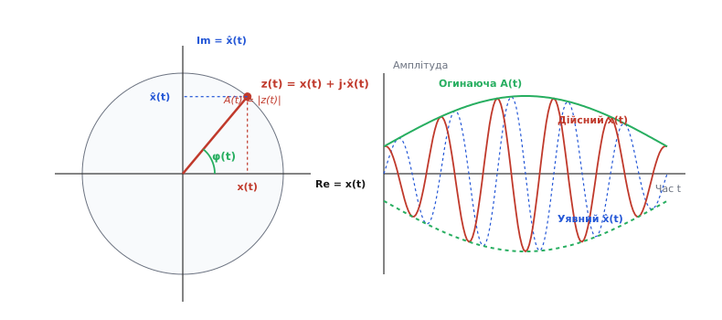
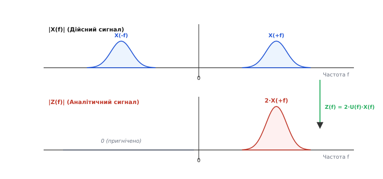
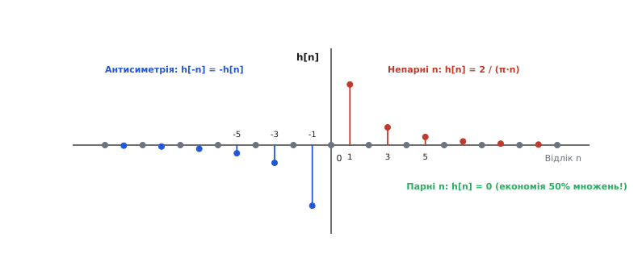

# Аналітичний сигнал і перетворення Гільберта

<preknowlist>
- [Комплексні числа](topic:math-analysis/complex-numbers) — дійсна й уявна частини, модуль, фаза та формула Ейлера.
- [Перетворення Фур'є](topic:math-analysis/fourier-idea) — розклад сигналу у частотній області на суму гармонічних складових.
- [Цифрова фільтрація](topic:com-signal/digital-filters) — КІХ-фільтри, імпульсна характеристика та згортка.
</preknowlist>

Усі вимірювальні прилади нашої фізичної реальності — від мікрофонів та антен до датчиків тиску й осцилографів — фіксують скалярні дійснозначні сигнали. Напруга на контактах чи акустичний тиск у повітрі в кожен момент часу описуються єдиним дійсним числом `x(t)`. Однак для розв'язання фундаментальних задач обробки сигналів — від демодуляції радіохвиль і визначення миттєвої частоти до аналізу вібрацій — одного дійсного числа недостатньо. Фізичні коливання одночасно характеризуються двома незалежними параметрами: скільки енергії містить коливання (амплітуда) і де саме в своєму циклі воно перебуває (фаза).

Спроба визначити миттєву амплітуду та фазу безпосередньо з дійснозначного сигналу `x(t)` стикається з математичною неоднозначністю: один і той самий сигнал `x(t) = 0` може відповідати як моменту проходження синусоїди через нуль (де амплітуда є максимальною, а фаза дорівнює `90°`), так і повністю відсутньому чи згаслому сигналу. Для усунення цієї неоднозначності у 1946 році британський фізик Деніс Ґабор запропонував доповнити дійснозначний сигнал штучною уявною частиною `x̂(t)`, зсунутою за фазою рівно на 90 градусів. Утворений комплексний сигнал `z(t) = x(t) + j·x̂(t)` дістав назву **аналітичного сигналу** (лат. *analytikos* / грец. *αναλυτικός* — розкладений на складові, розбірливий), а математична операція створення його уявної частини — **перетворення Гільберта** (на честь видатного німецького математика Давида Гільберта).

---

## 1. Проблема дійснозначного сигналу та квадратурна пара

Розглянемо найпростіший гармонічний сигнал `x(t) = A · cos(2π f₀ t + φ₀)`. Якщо ми спостерігаємо лише значення `x(t)` у точковий момент часу `t`, ми не можемо відокремити вплив амплітуди `A` від поточного значення фази `θ(t) = 2π f₀ t + φ₀`. Наприклад, якщо інструментальне вимірювання показує `x(t) = 0.5`, це може відповідати як сигналу з амплітудою `A = 1.0` у фазі `60°` (`cos(60°) = 0.5`), так і сигналу з амплітудою `A = 0.5` у фазі `0°` (`cos(0°) = 1.0`).

У традиційній аналоговій радіотехніці для виділення огинаючої застосовували амплітудний детектор — послідовно з'єднані діод та низькочастотний фільтр (ФНЧ). Діод зрізає від'ємну напівхвилю, а конденсатор фільтра згладжує високочастотні пульсації. Проте такий примітивний підхід працює виключно для вузькосмугових сигналів, у яких несуча частота `f₀` у десятки або сотні разів перевищує верхню частоту модулювального сигналу. Для широкосмугових сигналів, імпульсних завад або складних акустичних коливань діодний детектор створює невиправні нелінійні спотворення, не встигаючи за швидкими змінами амплітуди.

Математично строгий вихід полягає в побудові **квадратурної пари** (In-phase / Quadrature, I/Q). Якщо до дійсної складової `I(t) = x(t)` додати ортогональну уявну складову `Q(t) = x̂(t)`, що відстає за фазою на 90° (`π/2` радіан), то сигнал перетворюється на обертальний вектор на комплексній площині:

```
z(t) = I(t) + j · Q(t) = A(t) · exp(j · φ(t))
```

Вектор `z(t)` обертається проти годинникової стрілки навколо початку координат. Довжина цього вектора в кожен момент часу задає **миттєву амплітуду (огинаючу)**, а кут нахилу — **миттєву фазу**:

```
A(t) = |z(t)| = √( I(t)² + Q(t)² )
φ(t) = arg(z(t)) = atan2( Q(t), I(t) )
```


*Аналітичний сигнал z(t) як вектор у комплексній площині (ліворуч) та проекції дійсної x(t), уявної x̂(t) частин і огинаючої A(t) у часовій області (праворуч).*

Головна перевага квадратурного опису полягає в тому, що амплітуда `A(t)` обчислюється повністю інваріантно до поточного значення фази: навіть коли дійсна частина `x(t) = 0`, уявна частина досягає свого максимуму `x̂(t) = A`, тому сума квадратів `x(t)² + x̂(t)² = A²` залишається строго константною.

про деталі винайдення цього підходу та роль Деніса Ґабора і Джона Карсона читайте в [Історія аналітичного сигналу та перетворення Гільберта](topic:com-modulation/analytic-signal/hist-hilbert-transform.md).

---

## 2. Оператор Гільберта: математична суть та фазовертач 90°

Операція формування уявної компоненти `x̂(t)` з дійсної компоненти `x(t)` називається **перетворенням Гільберта**. У часовій області перетворення Гільберта визначається як згортка сигналу `x(t)` з невласним ядром `1 / (π t)` у сенсі головного значення Коші (Cauchy Principal Value):

```
x̂(t) = H{x(t)} = (1 / π) · p.v. ∫_{-∞}^{+∞} (x(τ) / (t - τ)) dτ
```

Сингулярність у точці `τ = t` означає, що значення `x̂(t)` у поточний момент часу залежить від усіх минулих та майбутніх значень сигналу `x(τ)`. Це робить ідеальне перетворення Гільберта непричинним (non-causal) оператором з нескінченною імпульсною характеристикою, який неможливо фізично реалізувати в аналогових ланцюгах без затримки.

Зрозуміти фізичний зміст перетворення Гільберта найпростіше у частотній області за допомогою перетворення Фур'є. Оскільки згортці двох функцій у часовій області відповідає множення їхніх спектрів у частотній області, спектральна характеристика оператора Гільберта `H(f)` є перетворенням Фур'є від ядра `1 / (π t)`:

```
H(f) = -j · sgn(f)
```

де `sgn(f)` — функція знака частоти:

```
         ┌ +1,  при f > 0
sgn(f) = ├  0,  при f = 0
         └ -1,  при f < 0
```

Комплексний множник `-j` можна подати в показниковій формі як `exp(-j · π/2)`. Таким чином, дія оператора Гільберта на спектральні компоненти сигналу зводиться до чотирьох простих правил:
1. **Для додатних частот (`f > 0`)**: фаза кожного гармонічного компонента зсувається строго на `-90°` (`-π/2` радіан). Наприклад, гармоніка `cos(ω t)` перетворюється на `sin(ω t)`.
2. **Для від'ємних частот (`f < 0`)**: фаза кожного гармонічного компонента зсувається строго на `+90°` (`+π/2` радіан). Наприклад, гармоніка `cos(-ω t)` перетворюється на `-sin(-ω t)`.
3. **Амплітудно-частотна характеристика**: `|H(f)| = |-j · sgn(f)| = 1` для всіх ненульових частот `f ≠ 0`. Перетворення Гільберта є **ідеальним всіпрохідним фільтром** (all-pass filter): воно взагалі не змінює амплітуди спектральних компонентів, а лише обертає їхні вектори фази.
4. **Постійна складова (`f = 0`)**: `H(0) = 0`. Постійний зсув (DC offset) повністю видаляється з уявної частини `x̂(t)`.

про строгі математичні доведення ортогональності, інволюції `H{H{x}} = -x` та теореми Парсеваля дивіться в [Математичні властивості перетворення Гільберта](topic:com-modulation/analytic-signal/math-hilbert-properties.md).

---

## 3. Спектр аналітичного сигналу: пригнічення від'ємних частот

Будь-який дійснозначний фізичний сигнал `x(t)` має симетричний амплітудний спектр Фур'є: `X(-f) = X*(f)`. Це означає, що від'ємна частина спектра не несе жодної нової інформації порівняно з додатною — вона є лише математичним дзеркальним відображенням, необхідним для того, щоб сума двох комплексних експонент `exp(j ω t) + exp(-j ω t)` утворювала дійснозначну величину `2 cos(ω t)`.

Конструюючи аналітичний сигнал `z(t) = x(t) + j · x̂(t)`, ми додаємо уявну частину зі спектром `X̂(f) = -j sgn(f) X(f)`. Знайдемо спектр утвореного комплексного сигналу `Z(f)`:

```
Z(f) = F{ z(t) } = F{ x(t) + j · x̂(t) }
= X(f) + j · [ -j · sgn(f) · X(f) ]     [підстановка F{x̂(t)} = H(f)X(f)]
= X(f) + sgn(f) · X(f)                  [оскільки j · (-j) = 1]
= X(f) · [ 1 + sgn(f) ]
```

Проаналізуємо значення коефіцієнта `[1 + sgn(f)]` за трьома частотними діапазонами:
- Якщо `f > 0`: `sgn(f) = +1`, отже `Z(f) = 2 · X(f)`.
- Якщо `f = 0`: `sgn(f) = 0`, отже `Z(0) = X(0)`.
- Якщо `f < 0`: `sgn(f) = -1`, отже `Z(f) = 0`.

У компактній операторній формі це записують через функцію Хевісайда `U(f)`:

```
Z(f) = 2 · U(f) · X(f)
```


*Трансформація спектра: дійсний сигнал X(f) має двосторонній симетричний спектр (згори), тоді як аналітичний сигнал Z(f) має строго односторонній спектр з пригніченими від'ємними частотами та подвоєною амплітудою додатних частот (знизу).*

Повне пригнічення від'ємних частот є головною фундаментальною властивістю аналітичного сигналу. Завдяки відсутності від'ємних частот спектр `Z(f)` стає одностороннім (односмуговим). Це дає змогу здійснювати понижувальний частотний зсув (downconversion) у цифрових приймачах SDR шляхом звичайного множення на комплексний гетеродин `exp(-j 2π f_c t)` без найменшого ризику накладання від'ємних дзеркальних частот на корисний спектр низької частоти (baseband).

---

## 4. Миттєва амплітуда, фаза та частота

Завдяки аналітичному сигналу `z(t) = x(t) + j · x̂(t)` довільний сигнал отримує однозначний часово-частотний опис:

```
z(t) = A(t) · exp(j · φ(t))
```

де три ключові характеристики обчислюються в кожен момент часу:

1. **Миттєва амплітуда (огинаюча, Envelope)**:
   ```
   A(t) = |z(t)| = √( x(t)² + x̂(t)² )
   ```
   Вона показує плавну зміну пікової потужності сигналу і не залежить від високочастотних коливань всередині заповнення.

2. **Миттєва фаза (Instantaneous Phase)**:
   ```
   φ(t) = arg(z(t)) = atan2( x̂(t), x(t) )
   ```
   Функція `atan2` повертає значення фази в інтервалі `[-π, +π]`. Для отримання неперервної гладкої фази застосовують операцію розгортання фази (phase unwrapping), яка усуває математичні стрибки на `2π`.

3. **Миттєва частота (Instantaneous Frequency)**:
   Миттєва частота визначається як швидкість зміни миттєвої фази за часом:
   ```
   f_inst(t) = (1 / 2π) · (dφ(t) / dt)
   ```
   У дискретному часі похідну замінюють різницею фаз між сусідніми відліками:
   ```
   f_inst[n] = (f_s / 2π) · arg( z[n] · z*[n - 1] )
   ```
   де `z*[n - 1]` — комплексно-спряжений відлік, а `f_s` — частота дискретизації.

### Обмеження миттєвої частоти та теорема Бедросіана

Поняття миттєвої частоти має чіткий фізичний зміст лише для **однокомпонентних мономодальних сигналів** (модульованих синусоїд). Якщо сигнал складається з двох або більше синусоїд близької амплітуди з різними частотами (наприклад, `x(t) = cos(ω₁ t) + cos(ω₂ t)`), то миттєва частота `f_inst(t)` починає здійснювати дикі осциляції і навіть може ставати від'ємною у моменти глибоких мінімумів огинаючої.

Математичне обмеження на коректність виділення огинаючої описується **теоремою Бедросіана**: перетворення Гільберта від добутку двох сигналів `f(t) · g(t)` дорівнює `f(t) · H{g(t)}` лише тоді, коли спектр повільно змінюваного сигналу `f(t)` повністю лежить нижче спектра високочастотного сигналу `g(t)`. Якщо цієї умови не дотримано, огинаюча `A(t)` міститиме високі частоти заповнення і втратить свій фізичний зміст.


*Структурна схема обробки сигналу: поділ на I/Q канали через фільтр Гільберта з наступним обчисленням огинаючої A(t), фази φ(t) та миттєвої частоти f_inst(t).*

---

## 5. Перетворення Гільберта — Хуанга (HHT) та аналіз нестаціонарних процесів

У реальному світі більшість фізичних сигналів — геосейсмічні коливання, біопотенціали серця та мозку (ЕКГ, ЕЕГ), звуки мовлення, вібрації конструкцій при зміні навантаження — є нелінійними та нестаціонарними. Класичне перетворення Фур'є розкладає такі сигнали на нескінченні гармоніки, розмиваючи інформацію про те, *коли саме* сталася та чи інша подія.

У 1998 році Норден Хуанг (Norden E. Huang) із NASA запропонував двоетапний метод **перетворення Гільберта — Хуанга** (Hilbert-Huang Transform, HHT):

1. **Емпірична модова декомпозиція (Empirical Mode Decomposition, EMD)**:
   Вхідний складний сигнал `x(t)` адаптивно розкладається на скінченну кількість **внутрішніх модових функцій** (Intrinsic Mode Functions, IMF). Кожна IMF задовольняє дві суворі умови:
   - Кількість екстремумів та кількість переходів через нуль відрізняються максимум на одиницю;
   - Середнє значення верхньої огинаючої (проведеної через локальні максимуми) та нижньої огинаючої (про проведеної через локальні мінімуми) у будь-якій точці дорівнює нулю.

2. **Обчислення аналітичного сигналу для кожної IMF**:
   Оскільки кожна IMF за визначенням є мономодальною та монокомпонентною, до неї застосовують перетворення Гільберта:
   ```
   z_k(t) = IMF_k(t) + j · H{ IMF_k(t) } = A_k(t) · exp(j · φ_k(t))
   ```

У результаті будується трьохвимірний **спектр Гільберта** `H(f, t)`, який показує розподіл амплітуди `A_k(t)` у неперервній часово-частотній площині з найвищою роздільною здатністю, не обмеженою співвідношенням невизначеності Гейзенберга — Габора, характерним для віконного Фур'є (STFT) або вайвлетів.

---

## 6. Практичні алгоритми обчислення: ШВФ та КІХ-фільтри

У цифровій обробці сигналів аналітичний сигнал обчислюють двома принципово різними способами залежно від вимог до системної затримки та архітектури обчислювача.

### Спосіб А: Спектральний метод Марпла (через ШВФ)

Для пакетної обробки блоків даних у пам'яті (наприклад, у SciPy, MATLAB або серверних алгоритмах) застосовують метод Марпла (S. L. Marple Jr.).

Алгоритм виконується за 4 кроки:
1. Для масиву відліків `x[n]` довжини `N` обчислюється пряме ДПФ: `X[k] = FFT{x[n]}`.
2. Спектр `X[k]` множиться на дискретну маску Гільберта `H[k]`:
   ```
          ┌ 1,        при k = 0 (постійна складова)
          │ 2,        при 1 ≤ k < N/2 (додатні частоти)
   H[k] = ├ 1,        при k = N/2 (частота Найквіста, якщо N парне)
          └ 0,        при N/2 < k < N (від'ємні частоти)
   ```
3. Обчислюється зворотне ДПФ: `z[n] = IFFT{ X[k] · H[k] }`.
4. Отриманий масив комплексних чисел `z[n]` є дискретним аналітичним сигналом, де `Re(z[n]) = x[n]`, а `Im(z[n]) = x̂[n]`.

### Спосіб Б: Часовий КІХ-фільтр Гільберта (FIR Filter)

У DSP-процесорах та мікроконтролерах реального часу, де дані надходять поодинці з АЦП, заповнення блоків для ШВФ створює недопустимо велику затримку. У таких системах застосовують непарний антисиметричний КІХ-фільтр Гільберта (Type III FIR filter).

Імпульсна характеристика ідеального КІХ-фільтра Гільберта довжини `M = 2L + 1` визначається формулою:

```
         ┌ (2 / (π · n)) · w[n],  для непарних n
h[n] =  ├ 
         └ 0,                     для парних n
```

де `n ∈ [-L, ..., L]`, а `w[n]` — віконна функція (наприклад, Кайзера або Хеммінга), яка згладжує розриви на краях фільтра.


*Імпульсна характеристика непарного КІХ-фільтра Гільберта: антисиметрія h[-n] = -h[n] та нульові значення для всіх парних відліків n, що економить 50% обчислень.*

Особливості КІХ-фільтра Гільберта:
- **Економія 50% множень**: оскільки кожен парний коефіцієнт `h[n] = 0`, половина тактів процесора економиться під час згортки.
- **Точна затримка**: КІХ-фільтр довжини `M` створює постійну групову затримку `τ = (M - 1) / 2` відліків. Щоб сформувати квадатурну пару `(I, Q)`, дійсну частину `x[n]` просто затримують у буфері на `τ` відліків: `I[n] = x[n - τ]`, а уявну частину отримують з виходу фільтра: `Q[n] = x̂[n]`.

про повний робочий код реалізації цих алгоритмів з автоматичними тестами дивіться в [Обчислення аналітичного сигналу в C та C++](topic:com-modulation/analytic-signal/proj-hilbert-transform.md).

---

## 7. Сфери застосування в інженерії та зв'язку

Аналітичний сигнал і перетворення Гільберта є базовим інструментарієм у багатьох галузях техніки:

> 🔧 **Навіщо це.**
> 1. **Односмугова модуляція (SSB / SSBM)**: у КВ-радіозв'язку та морській навігації перетворення Гільберта дає змогу сформувати сигнал SSB за схемою Гартлі чи Вівера. Модульований сигнал утворюється як `s(t) = m(t) cos(2π f_c t) ∓ m̂(t) sin(2π f_c t)`, що повністю знищує одну з бічних смуг без використання важких кварцових фільтрів.
> 2. **Програмно-визначене радіо (SDR)**: цифрові приймачі (USRP, RTL-SDR) перетворюють високочастотний сигнал радіоефіру на комплексний аналітичний сигнал baseband I/Q. Це дозволяє здійснювати програмну демодуляцію будь-яких видів модуляції (AM, FM, QPSK, QAM, OFDM) єдиною математичною алгоритмічною базою.
> 3. **Медична ультразвукова діагностика (УЗД)**: у сканерах УЗД відбитий від тканин акустичний відгук перетворюється на аналітичний сигнал. Його огинаюча `A(t)` формує контрасне B-mode зображення внутрішніх органів, а миттєва частота `f_inst(t)` використовується в допплерівських моніторах для вимірювання швидкості кровотоку у судинах.
> 4. **Віброакустична діагностика машин**: перетворення Гільберта є основою методів виявлення локальних дефектів у підшипниках та редукторах. Коли кулька підшипника котиться по тріщині обойми, виникає коротке ударне збудження. Обчислення огинаючої вібросигналу дає змогу виділити низькочастотний період ударів на тлі сильних завад.
> 5. **Сейсморозвідка та геофізика**: геофізики аналізують сейсмічні траси шляхом обчислення миттєвої фази та огинаючої. Миттєва фаза дозволяє відстежувати суцільність підземних геологічних пластів та розломів незалежно від згасання амплітуди, а раптове падіння миттєвої частоти свідчить про наявність пасток з природним газом у пористих породах.

---

## 8. Крайові ефекти та підводні камені

При практичній реалізації перетворення Гільберта інженери стикаються з трьома основними пастками:

### 1. Крайові ефекти FFT-методів (Ефект Гіббса)

Обчислення аналітичного сигналу через ШВФ передбачає, що масив даних `x[n]` є періодично продовженим на нескінченність. Якщо початковий та кінцевий відліки кадру `x[0]` та `x[N-1]` мають різні значення, на межах кадру виникає стрибок сигналу. При множенні на ступенчасту маску `H[k]` цей стрибок породжує сильні осциляції (явище Гіббса) на краях масиву.

*Як лікувати*: перед застосуванням ШВФ до кадру даних обов'язково застосовують гладку віконну функцію (Tukey window або Hann window), або відкидають по 5–10% відліків з кожного краю вихідного масиву.

### 2. Вплив постійної складової (DC offset)

Якщо дійснозначний сигнал містить постійний зсув `x(t) = C + x₀(t)`, то `H{C} = 0`. Однак при обчисленні миттєвої фази `φ(t) = atan2(x̂(t), C + x₀(t))` ненульова константа `C` зсуває центр обертання вектора з початку координат `(0,0)` у точку `(C,0)`. У результаті вектор перестає охоплювати початок координат, виділена фаза спотворюється, а огинаюча `A(t)` перестає відповідати амплітуді змінної складової.

*Як лікувати*: перед обчисленням аналітичного сигналу необхідно обов'язково видаляти постійну складову (віднімати середнє значення кадру `x[n] = x[n] - mean(x)` або пропускати сигнал через фільтр високих частот).

### 3. Широкосмугові сигнали та порушення причинності

Ідеальний фазовертач Гільберта має математичне ядро `1 / (π t)`, яке спадає дуже повільно (`1/t`). Мале усічення довжини КІХ-фільтра призводить до пульсацій АЧХ та недосконалого пригнічення від'ємних частот. Для широкосмугових сигналів (де відношення смуги до центральної частоти `Δf / f_c > 1`) КІХ-фільтр Гільберта повинен мати великий порядок (`M > 64`), що збільшує обчислювальну затримку системи.
