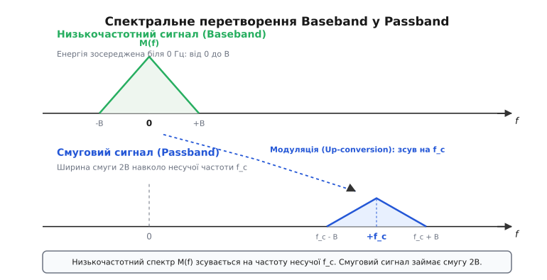
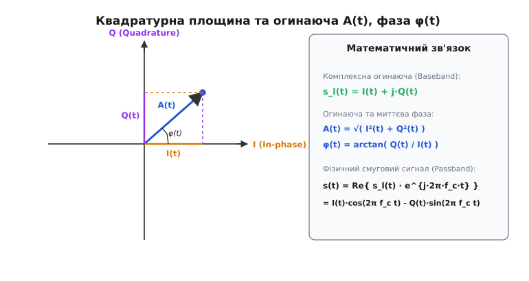
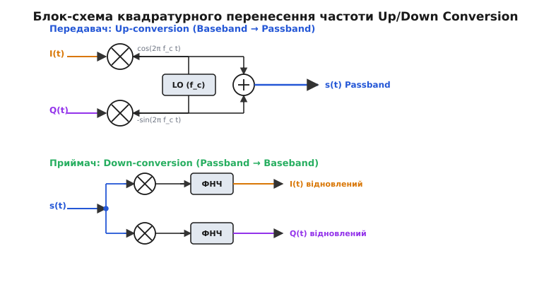

# Низькочастотний та смуговий сигнал

<preknowlist>
- [Синусоїда](topic:ph-waves/sine-wave) — опорна хвиля, яку повністю визначають три параметри: амплітуда, частота та фаза.
- [Навіщо модуляція](topic:com-modulation/why-modulation) — три фізичні причини перенесення інформації на несучу: розмір антени, спільний ефір та властивості середовища.
- [Ідея Фур'є](topic:math-analysis/fourier-idea) — розклад сигналу у частотній області на суму гармонічних складників.
</preknowlist>

Сигнал відео на виході камери чи звук із мікрофона живе від 0 Гц до кількох мегагерц. Але антенний фідер або ефір на цій частоті мовчать: довжина хвилі для 10 кГц сягає 30 кілометрів, а довільний ефірний канал вимагає переносу енергії у визначене вікно 2.4 ГГц чи 900 МГц. Будь-яка система зв'язку мусить розрізняти дві форми того самого повідомлення: **низькочастотний (базовий, baseband)** сигнал, який створює джерело інформації, і **смуговий (модульований, passband)** сигнал, який фізично лине через фізичне середовище.

Уся радіотехніка та цифрова обробка сигналів побудовані на математичному й фізичному містку між цими двома станами. Зрозуміти зв'язок низькочастотного й смугового сигналів — означає збагнути, як працює будь-який сучасний трансивер: від АМ-радіоприймача до Wi-Fi модема, супутникового термодекодера та мобільного чипа 5G.

### 1. Фізична потреба у двох формах сигналу

Чому джерело інформації не випромінює свої коливання одразу в навколишній простір? Причина полягає у фізиці середовищ передачі та пристроїв узгодження.

Первинне джерело інформації завжди формує коливання біля нуля Гц. Коли ми говоримо в мікрофон, акустична хвиля створює низькочастотні механічні коливання мембрани, які перетворюються на змінну напругу з частотами від 20 Гц до 20 кГц. Коли цифрова камера знімає зображення, матриця формує послідовність напруг пікселів, створюючи відеосигнал у смузі від 0 до кількох мегагерц. Нарешті, коли процесор передає біти пам'яті, на шині виникають прямокутні імпульси напруги, спектр яких теж починається від постійного струму (0 Гц).

Низькочастотний сигнал чудово рухається мідними провідниками на малі відстані (наприклад, звуковий кабель до навушників чи шина I2S між мікроконтролером і звуковим кодеком). Проте спроба випромінити низькочастотний сигнал у вільний ефір наражається на три фізичні бар'єри:

1. **Габарити антен:** Щоб антена ефективно випромінювала електромагнітні хвилі, її фізичний розмір `L` мусить бути порівнянним із довжиною хвилі `λ` (зазвичай `L ≈ λ/4`). Для звукової частоти 3 кГц довжина хвилі `λ = c / f` становить 100 кілометрів, що вимагає антени заввишки 25 кілометрів. Піднявши той самий сигнал на несучу частоту 1 ГГц, отримуємо `λ = 30 см` і антену розміром усього 7.5 см.
2. **Взаємні завади у спільному середовищі:** Усі людські голоси й аудіосигнали займають одну й ту саму смугу частот від 0 до 20 кГц. Якщо дві радіостанції випромінюватимуть низькочастотний звук напряму в повітря, їхні спектри повністю накладуться один на одного, утворюючи нероздільну кашу. Перенесення кожного сигналу на власну високочастотну несучу `f_c1, f_c2, f_c3` дозволяє розділити станції за частотними каналами (частотний поділ, FDM).
3. **Проходження середовища:** Ефір, коаксіальний кабель та оптоволокно мають неоднакове загасання на різних частотах. Звукові частоти взагалі не поширюються у вигляді радіохвилин крізь іоносферу чи стіни будівель, тоді як радіочастоти високих діапазонів (УКХ, СВЧ) легко долають кілометрові відстані або проходять крізь перешкоди.

Отже, радіосистема завжди працює з двома світами: внутрішнім світом **базової смуги (Baseband)**, де інформація створюється й обробляється, та зовнішнім світом **смугових сигналів (Passband)**, де інформація транспортується середовищем.

### 2. Низькочастотний сигнал (Baseband): математичний портрет

**Низькочастотний сигнал** (англ. *baseband signal*, або первинний модулюючий сигнал) — це електричне коливання, спектральна енергія якого зосереджена в області найнижчих частот, починаючи від 0 Гц (постійного струму або близьких складників) і закінчуючи деякою граничною частотою `B`.

Математично дійсний низькочастотний сигнал `m(t)` описується дійснозначною функцією часу. Його спектральна щільність `M(f)`, отримана за допомогою перетворення Фур'є, володіє ермітовою симетрією:

```
M(-f) = M*(f)
```

Це означає, що модуль спектра є парною функцією `|M(-f)| = |M(f)|`, а фаза — непарною. Спектр дійсного низькочастотного сигналу симетрично розташований відносно нульової частоти `f = 0` у межах від `-B` до `+B`.

```
     Спектр низькочастотного сигналу (Baseband)
  M(f) ▲
       │  ┌─────────┐
       │  │         │
       │  │         │
 ──────┴──┴─────────┴────────► f (Гц)
      -B  0        +B
```

Джерелами низькочастотних сигналів є:
- **Аналогові первинні сигнали:** Голос з мікрофона (300–3400 Гц), високоточний аудіосигнал (20 Гц – 20 кГц), аналогове відео CVBS (0–6 МГц).
- **Цифрові первинні сигнали:** Послідовності прямокутних імпульсів напруги (NRZ, Manchester, PAM), що виникають при зчитуванні бітів із пам'яті чи Ethernet-трансивера.

Для цифрових обчислювачів та процесорів цифрової обробки сигналів (ЦОС) низькочастотний сигнал є єдино зручною формою представлення. За теоремою Котельникова-Найквіста, дискретизація низькочастотного сигналу зі смугою `B` вимагає частоти вибірок `f_s ≥ 2B`. Якщо смуга мовного сигналу становить 4 кГц, достатньо здійснювати 8000 вибірок на секунду.

Для обробки низькочастотного сигналу не потрібні надвисокочастотні аналогово-цифрові перетворювачі. Саме в області Baseband виконуються всі складні операції цифрового зв'язку: фільтрація КІХ/ІІХ фільтрами, канальне кодування, виправлення помилок (коди Ріда-Соломона, LDPC), еквалізація та швидке перетворення Фур'є (FFT).

### 3. Смуговий сигнал (Passband): енергія у радіовікні

**Смуговий сигнал** (англ. *passband signal*, або модульований радіосигнал) утворюється тоді, коли низькочастотна інформація переноситься у високочастотну область навколо **несучої частоти** `f_c`.

Спектр смугового сигналу `S(f)` повністю вилучено з області нуля Гц. Він локалізований у вузькому частотному вікні шириною `2B` (або `B` при односмуговій модуляції SSB), розташованому навколо додатної частоти `+f_c` та симетричної від'ємної частоти `-f_c`.


*Низькочастотний спектр M(f) зосереджений біля нуля (Baseband). У результаті модуляції спектр зсувається на частоту несучої f_c, утворюючи смуговий сигнал (Passband) шириною 2B.*

Для будь-якого реального смугового сигналу у радіозв'язку виконується умова **вузькосмуговості** (*narrowband condition*): несуча частота `f_c` набагато більша за ширину смуги сигналу `B`:

```
f_c >> B
```

Наприклад, у каналі Wi-Fi 6 на частоті `f_c = 5.2 ГГц` ширина смуги становить `2B = 80 МГц`. Співвідношення `f_c / B` перевищує 130, що дозволяє вважати сигнал строго вузькосмуговим.

Фізично у лінії передачі або ефірі лине саме дійсний смуговий сигнал `s(t)`. Зміна амплітуди, частоти або фази високочастотного синусоїдального коливання в такт із низькочастотним повідомленням і є суттю модуляції. Проте прямокутний опис високочастотних синусоїд є обчислювально важким і незручним. Щоб пов'язати низькочастотний та смуговий сигнали математично, використовують квадратурний розклад.

### 4. Квадратурна геометрія: I та Q компоненти

Будь-який дійсний вузькосмуговий смуговий сигнал `s(t)` на несучій частоті `f_c` можна без втрат представити у вигляді суми двох ортогональних гармонічних коливань. Цей математичний результат називається **квадратурним представленням** (*quadrature representation*):

```
s(t) = I(t) · cos(2π · f_c · t) - Q(t) · sin(2π · f_c · t)
```

де:
- `I(t)` (*In-phase component*) — **синфазна низькочастотна компонента**;
- `Q(t)` (*Quadrature component*) — **квадратурна низькочастотна компонента** (зсунута на 90° або `π/2` відносно синфазної).

Найважливіше спостереження полягає в тому, що `I(t)` та `Q(t)` — це **два дійсні низькочастотні сигнали (Baseband)**, спектри яких обмежені найвищою частотою `B`.

Ортогональність двох несучих `cos(2π f_c t)` та `sin(2π f_c t)` підтверджується тим, що інтеграл їхнього добутку на періоді несучої `T_c = 1 / f_c` дорівнює точного нулю:

```
∫_{0}^{T_c} cos(2π · f_c · t) · sin(2π · f_c · t) dt = 0
```

Це дозволяє передавачеві одночасно передавати два незалежні низькочастотні канали `I(t)` та `Q(t)` на одній і тій самій несучій частоті `f_c` без жодних взаємних завад, подвоюючи спектральну ефективність зв'язку.


*Комплексна огинаюча s_l(t) = I(t) + j Q(t) утворює вектор на квадратурній площині I-Q. Довжина вектора задає амплітуду A(t), а кут — миттєву фазу φ(t).*

Використовуючи тригонометричну тотожність, смуговий сигнал можна записати через миттєву амплітуду (огинаючу) `A(t)` та миттєву фазу `φ(t)`:

```
s(t) = A(t) · cos( 2π · f_c · t + φ(t) )
```

Зв'язок між обома формами опису є взаємно однозначним:

```
A(t) = √( I²(t) + Q²(t) )

φ(t) = arctan( Q(t) / I(t) )

I(t) = A(t) · cos( φ(t) )

Q(t) = A(t) · sin( φ(t) )
```

Геометрично на квадратурній площині `I-Q` сигнал представлено у вигляді вектора, що обертається. Довжина вектора `A(t)` описує амплітудну модуляцію, а кут повороту `φ(t)` — фазову або частотну модуляцію. У цифрових системах зв'язку кінці цих векторів у моменти вибірки символів утворюють **модуляційне сузір'я** (Constellation Diagram).

Наприклад, у фазовій модуляції QPSK вектор `(I_n, Q_n)` приймає чотири значення `(±1, ±1)`, що відповідає чотирьом точкам у кутах квадрата на площині `I-Q`. У модуляції QAM-16 вектор бере значення з 16 можливих позицій сітки 4×4. При цьому евклідова відстань `d` між сусідніми точками сузір'я на низькочастотній площині `I-Q` прямо визначає завадостійкість радіосигналу:

```
d_min = √[ (I_a - I_b)² + (Q_a - Q_b)² ]
```

Що більша відстань `d_min`, то стійкішим є смуговий сигнал до аддитивного шуму ефіру.

У цифрових апаратних системах (наприклад, у ПЛІС FPGA чи спеціалізованих DSP) перетворення між декартовими координатами `(I, Q)` та полярними `(A, φ)` виконується за допомогою ітераційного алгоритму **CORDIC** (*Coordinate Rotation Digital Computer*). Алгоритм CORDIC виконує обертання вектора на квадратурній площині за допомогою лише зсувів регістрів та додавань, позбавляючи мікросхему від потреби обчислювати трудомісткі квадратні корені та арктангенси у плаваючій крапці.

### 5. Формування імпульсів та згладжування спектра (Pulse Shaping)

У цифрових системах зв'язку вхідні біти перетворюються на послідовність вибірок `I[n]` та `Q[n]`. Якщо подати прямокутні відліки бітів безпосередньо у квадратурний modulator, спектр смугового сигналу розростеться нескінченно широко з повільним загасанням бічних пелюсток видами `1/f` (через різкі розриви прямокутних імпульсів).

Для обмеження спектра у межах суворо відведеного частотного каналу `B` в області Baseband застосовують **фільтри формування імпульсів** (*pulse shaping filters*). Найпоширенішим є фільтр із характеристикою **коріння піднесеного косинуса** (Root-Raised Cosine, RRC).

Формування Baseband сигналу через RRC фільтр з імпульсною характеристикою `g_RRC(t)` виконується за формулою дискретної згортки:

```
I(t) = ∑_{k} I_k · g_RRC(t - k · T_symbol)

Q(t) = ∑_{k} Q_k · g_RRC(t - k · T_symbol)
```

де `T_symbol` — тривалість одного символу, `I_k, Q_k` — амплітуди точок сузір'я.

Оскільки RRC фільтр встановлюється як у передавачі, так і у приймачі, сумарна передавальна характеристика каналу стає фільтром піднесеного косинуса (Raised Cosine, RC). За першим критерієм Найквіста, такий фільтр забезпечує точне обнулення міжсимвольної інтерференції (Inter-Symbol Interference, ISI) у відлікові моменти часу `t = n · T_symbol`, повністю усуваючи взаємний вплив сусідніх символів.

### 6. Комплексна огинаюча (Complex Envelope): міст між DSP та RF

Якщо об'єднати синфазну `I(t)` та квадратурну `Q(t)` компоненти у комплексне число, ми отримаємо **комплексну огинаючу** (*complex envelope*) сигналу `s_l(t)`:

```
s_l(t) = I(t) + j · Q(t) = A(t) · e^{j · φ(t)}
```

Комплексна огинаюча є низькочастотним еквівалентом смугового сигналу. Фізичний смуговий сигнал `s(t)` пов'язаний із комплексною огинаючою через відновлення дійсної частини зсунутого за частотою комплексного коливання:

```
s(t) = Re{ s_l(t) · e^{j · 2π · f_c · t} }
```

Детальне математичне виведення спектральних властивостей комплексної огинаючої, її зв'язку з перетворенням Гільберта та доведення енергетичної еквівалентності винесено у вставку [комплексна огинаюча](topic:com-modulation/baseband-passband/math-complex-envelope.md).

Здатність описувати будь-який смуговий сигнал через комплексну низькочастотну огинаючу `s_l(t) = I(t) + j Q(t)` зробила революцію у цифровому радіозв'язку.

Уявімо супутниковий трансивер на частоті `f_c = 10 ГГц` із шириною інформаційної смуги `2B = 50 МГц`.
- Для безпосереднього цифрового оброблення фізичного смугового сигналу `s(t)` за теоремою Котельникова знадобився б АЦП із частотою дискретизації понад 20 ГГц і обчислювач, здатний обробляти десятки мільярдів відліків на секунду.
- Але оскільки вся інформація міститься в огинаючій `s_l(t)`, ми можемо опустити сигнал до нуля Гц і дискретизувати лише квадратурні компоненти `I(t)` та `Q(t)` із частотою вибірок `f_s = 60 МГц`.

Обчислювальне навантаження зменшується у сотні разів без жодної втрати даних.

Крім того, проходження сигналу через багатопроменевий радіоканал (з ефектом загасання та відбиття від пагорбів чи стін) описується низькочастотною згорткою комплексної огинаючої `s_l(t)` із комплексним коефіцієнтом передачі каналу `h_l(t)`:

```
y_l(t) = (1/2) · ∫_{-∞}^{+∞} s_l(τ) · h_l(t - τ) dτ
```

У термінах компонент `I/Q` замирання Релея та Райса описуються як двовимірний гаусів випадковий процес для `I(t)` та `Q(t)`, що дозволяє легко моделювати завадостійкість мобільних мереж у програмах ЦОС.

Також, якщо рухомий об'єкт (наприклад, автомобіль чи літак) рухається зі швидкістю `v` відносно приймача, виникає **Доплерівський зсув частоти** `Δf_D = f_c · (v / c) · cos(θ)`. У смуговому світі це викликає зсув усієї спектральної картини відносно `f_c`. Проте в області низькочастотної комплексної огинаючої Доплерівський ефект зводиться до простого повільного обертання вектора на квадратурній площині:

```
s_l,doppler(t) = s_l(t) · e^{j · 2π · Δf_D · t}
```

Це дозволяє цифровому еквалайзеру в базовій смугі легко компенсувати Доплерівський зсув за допомогою ззвичайного цифрового повороту фази `e^{-j 2π Δf_D t}`.

### 7. Пряме та зворотне перетворення: Up-conversion та Down-conversion

Перехід від низькочастотної базової смуги до радіочастотного смугового сигналу і навпаки здійснюється за допомогою квадратурних змішувачів та локального гетеродина (Local Oscillator, LO).


*Верхня частина: Передавач виконує Up-conversion низькочастотних компонент I(t) та Q(t) на несучу частоту f_c. Нижня частина: Приймач виконує Down-conversion і відсікає ФНЧ високочастотні складники 2f_c.*

#### Передавач (Up-conversion)
У передавачі цифрово-аналогові перетворювачі (ЦАП) формують два аналогові низькочастотні сигнали `I(t)` та `Q(t)`. Змішувачі множать `I(t)` на `cos(2π f_c t)`, а `Q(t)` на `-sin(2π f_c t)`. Після віднімання/додавання продуктів утворюється вихідний смуговий сигнал `s(t)`, який подається у підсилювач потужності та антену.

#### Приймач (Down-conversion)
У приймачі прийнятий з антени смуговий сигнал `s(t)` розділяється на два паралельних канали і множиться на квадратурні коливання приймального гетеродина:

```
I_raw(t) = 2 · s(t) · cos(2π · f_c · t)
         = 2 · [ I(t)·cos(2π f_c t) - Q(t)·sin(2π f_c t) ] · cos(2π f_c t)
         = I(t) · [ 1 + cos(4π f_c t) ] - Q(t) · sin(4π f_c t)
         = I(t)  +  [ I(t)·cos(4π f_c t) - Q(t)·sin(4π f_c t) ]
```

У результаті множення виникають дві спектральні області:
1. Бажана низькочастотна компонента `I(t)` біля нуля Гц.
2. Подвоєна високочастотна компонента біля частоти `2f_c`.

Пропустивши сигнал через низькочастотний фільтр (ФНЧ), високочастотний складник `2f_c` повністю відсікають, залишаючи чисту відтворену компоненту `I(t)`. Аналогічно у квадратурному плечі після ФНЧ виділяється `Q(t)`.

### 8. Неідеальності аналогових квадратурних трактів

У реальних радіочастотних трансиверах аналогова частина володіє фізичними обмеженнями, які створюють спотворення при перенесенні частот:

1. **Амплітудно-фазовий дисбаланс I/Q (IQ Imbalance):** Якщо коефіцієнти підсилення аналогових гілок `I` та `Q` не однакові (`g_I ≠ g_Q`) або зсув фази між квадратурними гетеродинами відхиляється від 90°, у відтвореному низькочастотному спектрі виникає дзеркальна завада. Величина пригнічення дзеркального каналу (Image Rejection Ratio, IRR) залежить від відношення коефіцієнтів `g = g_Q / g_I` та фазової помилки `ψ`:
```
IRR = 10 · log10( (1 + 2g cos(ψ) + g²) / (1 - 2g cos(ψ) + g²) )
```
Для ліквідації цього спотворення в сучасних Wi-Fi та LTE трансиверах застосовують цифрові матричні еквалайзери розбалансу.
2. **Просочування гетеродина (LO Leakage / DC Offset):** Через паразитичну ємність між портами змішувача частина високочастотного сигналу гетеродина потрапляє на вихід передавача навіть за відсутності корисного сигналу. На спектрі це виглядає як вузький пік на несучій частоті `f_c`. При Zero-IF демодуляції цей пік перетворюється на постійну напругу (DC offset) на частоті 0 Гц, яка може виводити АЦП із лінійного режиму.
3. **Фазовий шум гетеродина (Phase Noise):** Нестабільність частоти гетеродина викликає випадкові «дрижання» фази `Δφ(t)`, що розмиває точки модуляційного сузір'я на квадратурній площині й підвищує ймовірність бітових помилок (BER).
4. **Пік-фактор (PAPR) та нелінійні спотворення:** У смугових сигналах із багатопіднесними формами хвилі (OFDM) виникає високе відношення пікової до середньої потужності (PAPR). Високі піки сигналу змушують аналоговий підсилювач потужності (PA) працювати в кубічно нелінійному режимі, створюючи інтермодуляційні спотворення 3-го порядку (IMD3). На низькочастотному рівні `I/Q` це компенсують алгоритмами цифрової предиспорсії (Digital Pre-Distortion, DPD).

Історія створення перших схем гетеродинування та шлях від супергетеродинних приймачів до сучасного прямого квадратурного перетворення описані у вставці [супергетеродин Армстронга](topic:com-modulation/baseband-passband/hist-superheterodyne.md).

Практичну симуляцію дискретного модулятора й демодулятора з цифровою ФНЧ-фільтрацією наведено у вставці [моделювання модулятора](topic:com-modulation/baseband-passband/proj-iq-modulator-demodulator.md).

### 9. Програмна реалізація у драйверах та SDR

У сучасних операційних системах (зокрема у ядрі Linux) обробка низькочастотних I/Q компонент розмежована між програмним стеком та апаратним RF-чипом:

- **Підсистема Linux mac80211 / Industrial I/O (IIO):** Драйвер радіокарти (наприклад, `ath9k`, `iwlwifi` або драйвери SDR на базі `libiio`) керує реєстрами гетеродина через інтерфейси SPI/PCIe, встановлюючи несучу частоту `f_c` та ширину смуги `B`.
- **Цифрові конвертери DDC / DUC у ПЛІС:** У спеціалізованих мікросхемах радіотрансиверів (наприклад, Analog Devices AD9361 чи RFSoC Xilinx) перенесення частоти виконується в два етапи: спочатку цифрові конвертери DDC/DUC у ПЛІС здійснюють цифрове гетеродинування з високою частотою дискретизації, а аналогові змішувачі лише завершують Up-conversion на кінцеву радіочастоту.
- **Програмно-визначене радіо (SDR):** У фреймворках на зразок GNU Radio чи SDR# всі блоки модуляції, еквалізації та розкодування оперують потоком комплексних чисел `std::complex<float>`, де дійсна частина відповідає `I`, а уявна — `Q`. Сам пристрій SDR (HackRF, USRP, LimeSDR) виконує лише високошвидкісну передачу масивів `I/Q` через USB/Ethernet та квадратурне гетеродинування у мікросхемі трансивера.
- **Векторний аналіз у вимірювальній техніці:** Векторні аналізатори сигналів (VSA) оцифровують масиви `(I, Q)` і вибудовують спектрограми, модуляційні сузір'я та діаграми очі (Eye Diagram) суто на низькочастотних математичних масивах.

> 🔧 **Навіщо це.** Квадратурна концепція Baseband/Passband є основою програмно-визначеного радіо (Software Defined Radio, SDR). Усі сучасні стандарти зв'язку (Wi-Fi, Bluetooth, LTE, 5G, DVB-T2, GPS) формують цифрові відліки `I[n]` та `Q[n]` у внутрішній пам'яті процесора DSP. Для зміни виду модуляції (наприклад, переходу від [AM і FM](topic:com-modulation/am-fm) до [FSK і PSK](topic:com-modulation/fsk-psk) або OFDM) радіоапарат не змінює фізичні індуктивності чи конденсатори — він лише змінює формулу розрахунку масиву `I/Q` відліків у програмі. Радіочастотний тракт (RF) залишається універсальним «транспортом».

### Порівняльна характеристика Baseband та Passband

Для підсумування відмінностей між низькочастотною та смуговою формами подамо їхні фундаментальні властивості у порівняльній таблиці:

| Параметр | Низькочастотний сигнал (Baseband) | Смуговий сигнал (Passband) |
| :--- | :--- | :--- |
| **Частотний діапазон** | Біля 0 Гц (від 0 до `B`) | Навколо несучої `f_c` (від `f_c - B` до `f_c + B`) |
| **Математична форма** | Комплексна огинаюча `s_l(t) = I(t) + j Q(t)` | Дійсний сигнал `s(t) = Re{ s_l(t) e^{j 2π f_c t} }` |
| **Ширина спектра** | `B` (однобічна смуга) | `2B` (двобічна смуга навколо `f_c`) |
| **Опорна частота** | Відсутня (`f = 0`) | Відома несуча частота `f_c >> B` |
| **Область існування** | Усередині DSP, ЦАП/АЦП, низькочастотні кабелі | Фізичний ефір, радіохвилі, коаксіал, волокно |
| **Частота дискретизації** | Низька: `f_s ≥ 2B` | Дуже висока: `f_s ≥ 2(f_c + B)` |

Розуміння двоєдиної природи сигналів дозволяє розділити задачу побудови радіосистем на дві незалежні частини: створення інформативної комплексної огинаючої `I/Q` у низькочастотній області та ефективне перенесення цієї огинаючої у радіочастотний смуговий ефір.
