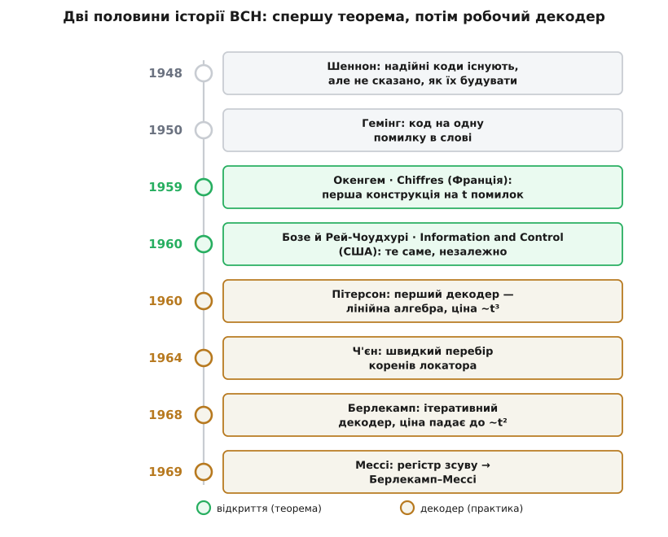
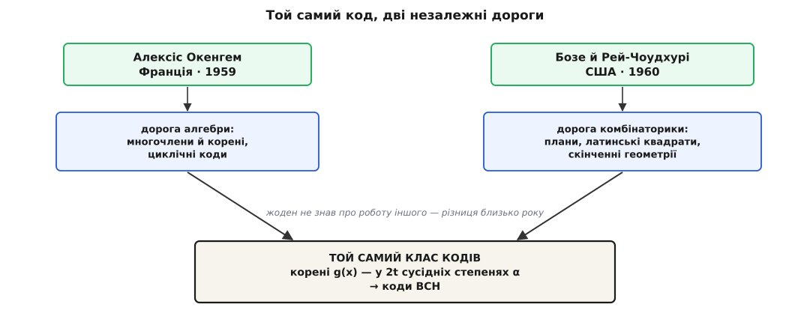

# 📜 Троє, що не змовлялися

Наприкінці 1950-х теорія кодування мала дивну, надламану форму. З одного боку — велична обіцянка: [Клод Шеннон](topic:math-information/shannon-capacity) ще 1948 року довів, що надійна передача крізь шумний канал можлива, що дані можна пропхати майже без втрат, аби лиш не перевищувати межу пропускної здатності. З іншого боку — обіцянка була **неконструктивна**. Шеннон показав, що добрий код десь існує, але не сказав, який він і як його зібрати. Це як почути, що в горі є золото, і не дістати ні карти, ні кайла.

І золото копали — по грудочці, наосліп. [Річард Гемінг](topic:com-modulation/hamming-code) 1950 року дав код, що виправляє рівно одну помилку на слово. [Маркус Голей](topic:com-modulation/golay-code) роком раніше — дивовижний код на три помилки, але єдиної, намертво заданої довжини. Кожен такий код був окремим витвором, знайденим власним осяянням: свій розмір, своя сила, свій характер. Захотів код, що виправляє дві помилки на блоці в сотню бітів? Не було рецепта — був чистий аркуш і твоя винахідливість.

Бракувало саме **машини** — способу сказати «дай код завдовжки стільки-то, що лагодить стільки-то помилок» і дістати його готовим, із гарантією. І ось за якихось дванадцять місяців, на двох континентах, троє людей із зовсім різних кімнат математики незалежно повернули той самий ключ. Жоден не знав, що поруч те саме роблять інші.


*Історія BCH має дві чіткі половини. Спершу — теорема: як побудувати код на t помилок (Окенгем, а тоді незалежно Бозе з Рей-Чоудхурі). Потім, майже ціле десятиліття, — інша боротьба: як цей код швидко декодувати (Пітерсон, Ч'єн, Берлекамп, Мессі). Код народився двічі, а «ожив» лише на другій половині шляху.*

## Француз, що вчив машини рахувати

Першим — хоча світ дізнався про це не одразу — був **Алексіс Окенгем** (*Alexis Hocquenghem*, 1908–1990), паризький математик. Постать колоритна навіть за французькими мірками: до Вищої нормальної школи (École normale supérieure) його прийняли 1925 року третім за конкурсом, у неповні сімнадцять, а агрегацію з математики — суворий державний конкурс на право викладати — він склав уже 1928-го. З 1951 року Окенгем обіймав у Національній консерваторії мистецтв і ремесел (Conservatoire national des arts et métiers) кафедру загальної математики для застосувань і саме він завів там викладання чисельного аналізу й обчислювальної техніки. Тобто працював рівно на межі, де абстрактна алгебра тулиться до живих машин, які рахують, — місце, з якого коди для тих машин було видно ясніше, ніж із чистої теорії.

Була в його житті й тиха драма, яка тепер більше відома, ніж самі коди: його син **Гі Окенгем** (*Guy Hocquenghem*, 1946–1988) став відомим письменником і помер незадовго до батька — велике горе для родини. Ім'я Окенгемів у культурі радше згадають через сина, ніж через батькову теорему.

1959 року, у вересні, Алексіс Окенгем опублікував статтю «Codes correcteurs d'erreurs» («Коди, що виправляють помилки») у французькому журналі *Chiffres* (том 2, с. 147–156). У ній він показав, як будувати коди, що виправляють **кілька** помилок, — узагальнив коди Гемінга, зіперши конструкцію на алгебру многочленів над скінченними полями. Це вже був той самий рецепт, який згодом дістав ім'я BCH: обрати корені породжувального многочлена так, щоб мінімальна відстань була гарантовано великою.

Проте стаття вийшла **французькою**, у французькому фаховому виданні, осторонь американського потоку, де тоді вирувала теорія інформації — з її семінарами в Массачусетському технологічному, звітами Bell Labs, англомовними журналами. Тому за океаном роботу Окенгема помітили не відразу. Ця затримка виявиться не дрібницею: вона лишить слід просто в назві коду.

## Двоє з Чапел-Гілл, що прийшли з іншого боку

Наступного, 1960 року, до того самого класу кодів дійшли — незалежно й нічого не знаючи про Окенгема — двоє математиків у США: **Радж Чандра Бозе** (*Raj Chandra Bose*, 1901–1987) і його аспірант **Двіджендра Кумар Рей-Чоудхурі** (*Dwijendra Kumar Ray-Chaudhuri*, нар. 1933).

Тут варто бути точним щодо того, ким вони були, бо їх часто безбарвно записують просто в «американці». Обидва — **індійські** математики бенгальського роду. Бозе народився 1901 року в Хошангабаді (тепер Нармадапурам, штат Мадх'я-Прадеш), навчався в Калькутті, роками працював в Індійському статистичному інституті та Калькуттському університеті, а 1949 року переїхав до США, до Університету Північної Кароліни в Чапел-Гілл. Рей-Чоудхурі народився 1933 року в Нараянґанджі (Бенгалія Британської Індії, нині Бангладеш), теж пройшов калькуттську школу, а докторат із комбінаторики захистив 1959 року в того самого Бозе в Чапел-Гілл. Це не двоє американців — це вчитель і учень, двоє індійців, що привезли до Північної Кароліни калькуттську математичну традицію.

І прийшли вони до кодів **з протилежного боку**, ніж Окенгем. Бозе був не зв'язківцем і не «кодувальником» — він був майстром **комбінаторики**: теорії планів експерименту, скінченних геометрій, латинських квадратів. (Саме Бозе разом зі Шрікганде й Паркером якраз тоді, наприкінці 1950-х, спростував багатовікову гіпотезу Ойлера про ортогональні латинські квадрати — гучний результат, за який трійцю прозвали «нищителями Ойлера».) Для такої людини коди виросли природно з комбінаторних конструкцій: як розкласти точки скінченної геометрії так, щоб дістати багато майже незалежних перевірок, які й ловитимуть помилки. Окенгем ішов від многочленів і їхніх коренів; Бозе з Рей-Чоудхурі — від комбінаторних схем і геометрій. Дві дороги, дві мови, а привели вони в одну й ту саму точку.

Їхня стаття — «On a Class of Error Correcting Binary Group Codes» («Про один клас двійкових групових кодів, що виправляють помилки») — вийшла 1960 року в журналі *Information and Control* (том 3, №1, с. 68–79). У ній вони явно виписали межу, яку сьогодні знає кожен інженер зв'язку: для довжини n = 2ᵐ−1 можна збудувати код, що виправляє t помилок, доплативши не більше ніж m·t перевірних символів. Той самий рецепт, до якого роком раніше вже дійшов француз.


*Один і той самий об'єкт народився двома незалежними дорогами. Окенгем прийшов від алгебри многочленів; Бозе з Рей-Чоудхурі — від комбінаторики й скінченних геометрій. Обидві дороги вперлися в ту саму умову — корені породжувального g(x) у 2t сусідніх степенях α, — бо саме ця конструкція неминуче виникає, коли шукаєш лінійний код із наперед заданою відстанню.*

## Чому та сама річ народилася двічі

Одночасне незалежне відкриття завжди звучить містично — та насправді воно радше закономірне, ніж дивовижне. Коли ґрунт готовий і питання загострене до вістря, той самий плід дозріває в кількох садах одразу. Так було з диференціальним численням у Ньютона й Лейбніца, з теорією еволюції в Дарвіна й Воллеса. BCH — маленький, чистий приклад того ж явища.

Ґрунт справді був підготовлений. Після Шеннона й Гемінга вся молода галузь дивилася в ту саму стіну — коди на **багато** помилок, — а математичний матеріал для них уже лежав під рукою і ставав спільним словником: скінченні поля, циклічні коди, многочлени з наперед призначеними коренями. Щойно ставиш питання «як гарантувати велику мінімальну відстань дешевими засобами?» — і скінченно-польова конструкція виникає майже примусово, куди б ти не заходив: з боку алгебри, як в Окенгема, чи з боку геометрії, як у Бозе. Різні входи ведуть до тих самих дверей, бо двері, по суті, одні.

Те, що відкриття були **незалежні**, — не легенда, а усталений в історії науки факт: Бозе з Рей-Чоудхурі працювали, не знаючи французької статті, а Окенгем — не знаючи про роботу в Чапел-Гілл. Саме тому ім'я коду згодом склали з усіх трьох прізвищ, а не приписали одному.

## «BC», а вже потім «BCH»

І ось тут починається невеличка історична несправедливість, зашита просто в назву. Абревіатуру склали з початкових літер прізвищ: **B**ose, **C**haudhuri, **H**ocquenghem — Бозе, Чоудхурі, Окенгем. Але придивіться до неї уважніше, і побачите дві дрібні кривди.

Перша: **де подівся Окенгем на початку?** У 1960 році, коли перший практичний внесок у ці коди зробив американець Веслі Пітерсон, він назвав свою статтю «Encoding and error-correction procedures for the **Bose-Chaudhuri** codes» — **без жодного H**. Тоді, за океаном, знали лише роботу з Чапел-Гілл; французька стаття Окенгема ще не спливла в англомовному обігу. Тож код деякий час був просто «BC» — «коди Бозе–Чоудхурі». Літеру H дописали пізніше, коли пріоритет Окенгема визнали, — і виявилося, що дописаний останнім насправді був **першим**: адже його публікація 1959 року випередила статтю 1960-го на цілий рік. Той, хто прийшов раніше за всіх, дістав у назві крайнє, наче почесно-запізніле, місце.

Друга кривда тонша й стосується середньої літери. Прізвище другого автора — **Рей-Чоудхурі** (Ray-Chaudhuri), складене, з двох частин. А в абревіатуру потрапила лише друга половина: «Ray-» тихо відпало, і «C» стоїть за усічене «Chaudhuri». Тобто строго за прізвищами код мав би зватися щось на кшталт «B-RC-H»; історія ж закріпила зручніше, але не зовсім точне «BCH». Дрібниця — а живе десятиліттями в кожному підручнику й кожному стандарті, де є ці три літери.

## Гарна теорема, з якою спершу нічого не вдієш

Тепер — про другу половину історії, без якої перша лишилася б красивою, але марною. Бо теорема Окенгема й Бозе казала дві речі: такі коди **існують** і їх можна **побудувати** (закодувати). Кодувати справді легко — помножив блок даних на породжувальний g(x), от і кодове слово. А от **декодувати** — знайти на приймачі, де саме канал перекинув біти, — теорема не вчила зовсім. І без цього код був як сейф із золотом без ключа: замкнути можеш, дістати — ні.

Кілька років BCH так і лишався прекрасним, але майже нерухомим. Синдроми — числа, які приймач знімає з прийнятого слова, — знали, **що** помилки є, і навіть таїли в собі, **де** вони. Але видобути з жмені синдромів позиції збоїв ніхто не вмів робити швидко.

Перший ключ виточив **Веслі Пітерсон** (*W. Wesley Peterson*) 1960 року — той самий, чия стаття ще звала коди «Bose-Chaudhuri». Його ідея була прямолінійна, як лом: скласти з синдромів систему лінійних рівнянь на коефіцієнти многочлена-локатора помилок і розв'язати її звичайною лінійною алгеброю. Спрацьовує. Але ціна кусається: розв'язати систему на t невідомих коштує близько **куба** числа помилок, порядку t³ дій.

```
синдроми  S₁ … S₂ₜ  →  система з t лінійних рівнянь  →  локатор σ(x)
                          ↑
                    розв'язок ~ t³ операцій — терпимо для t = 2, 3;
                    боляче, коли t росте до десятків
```

Для коду на дві-три помилки це дрібниця. Але щойно захочеш сильніший код, де t — десятки, кубічна ціна перетворює декодування на важку працю. (Невдовзі, 1961 року, Ґоренстайн і Ціерлер узагальнили метод Пітерсона на небінарні поля — і цим відчинили двері до [Рід–Соломона](topic:com-modulation/reed-solomon), небінарного родича BCH.) Код уже дихав — але ще не бігав.

> 🔧 **Навіщо це.** Розрив між «код існує» і «код можна швидко декодувати» — не дрібна технічна деталь, а великий урок усієї теорії кодування. Красива конструкція без швидкого декодера лежить мертвим вантажем: винаходиш не код, а лише **половину** коду. Найяскравіший доказ — [LDPC](topic:com-modulation/ldpc): Роберт Ґалагер описав ці коди ще 1962 року, вони майже торкалися шеннонівської межі — і на тридцять років лягли на полицю, бо тодішні машини не тягнули їхнього декодування. Їх «перевідкрили» аж у 1990-х, коли підросли обчислення. Історія BCH — та сама притча в мініатюрі: теорема 1959–1960 і швидкий декодер 1968–1969 — це **дві окремі перемоги**, розділені майже десятиліттям.

## Перегони за швидким декодером

Другу половину десятиліття зайняли перегони: як витягти позиції помилок із синдромів **дешево**. І тут з'явилися імена, що назавжди прописалися в кожному описі BCH-декодера.

**Роберт Ч'єн** (*Robert T. Chien*) 1964 року вирішив не найважчу, але дуже практичну частину. Коли многочлен-локатор σ(x) уже знайдено, лишається відшукати його **корені** — саме вони називають позиції битих бітів. Ч'єн запропонував систематичний перебір: по черзі підставляти в σ кожен елемент поля й дивитися, де він занулюється. Метод простий, регулярний, чудово лягає на «залізо» — і донині так і зветься **перебором Ч'єна** (стаття «Cyclic decoding procedures for the Bose–Chaudhuri–Hocquenghem codes», IEEE Transactions on Information Theory, том IT-10, 1964).

Справжній же прорив зробив **Елвін Берлекамп** (*Elwyn Berlekamp*) — у книжці «Algebraic Coding Theory» (1968) він дав **ітеративний** спосіб будувати локатор, який не потребує розв'язувати повну лінійну систему. Замість того, щоб щоразу перевертати матрицю, алгоритм нарощує локатор крок за кроком, підправляючи його на кожному новому синдромі. Ціна впала з кубічної до приблизно **квадратичної**, порядку t² — і саме це зробило довгі, потужні BCH- та Рід–Соломонові коди реально придатними для роботи.

А тоді **Джеймс Мессі** (*James L. Massey*) 1969 року побачив у Берлекамповому алгоритмі несподівану, гарну суть. У статті «Shift-register synthesis and BCH decoding» (IEEE Transactions on Information Theory, том IT-15, 1969) він показав, що ітерація Берлекампа — це насправді розв'язання зовсім іншої з вигляду задачі: **знайти найкоротший регістр зсуву зі зворотним зв'язком**, який породжує задану послідовність синдромів. Раптом декодування BCH і побудова простенької цифрової схеми виявилися однією й тією ж математикою. Це переформулювання зробило алгоритм прозорим і легким для реалізації в «залізі» — і відтоді він зветься [алгоритмом Берлекампа–Мессі](topic:sf-security/berlekamp-massey), поєднавши двоє прізвищ так само, як сам код поєднав троє.

```
Пітерсон 1960 → лінійна система, ~t³   (працює, та дорого)
Ч'єн     1964 → перебір коренів локатора  (просто, для «заліза»)
Берлекамп 1968 → ітеративний локатор, ~t²  (дешевше на порядок)
Мессі    1969 → той самий крок = синтез регістра зсуву  → Берлекамп–Мессі
```

## Що з цієї історії видно

Коли складаєш докупи всю картину, BCH виглядає не як спалах одного генія, а як **естафета**. Спершу троє незнайомців із двох континентів, не змовляючись, за рік винайшли ту саму теорему — бо ґрунт дозрів, і плід мусив упасти. Потім ще четверо впродовж десятиліття по черзі виточували до неї ключ, аж поки код перестав бути гарною формулою й став робочим інструментом — тим, що згодом чистив пам'ять, тримав супутникове мовлення й ловив рідкі збої там, де ціна помилки висока.

І назва — три сухі літери B-C-H — насправді ховає цілу драму пріоритету: француза, чиє «H» дописали останнім, хоч він був першим; індійця, від чийого складеного прізвища в абревіатурі лишилася половина; і ту просту, вперту істину теорії кодування, що винайти код і **навчитися його читати** — це дві різні, однаково важкі перемоги.

Статус усіх наведених дат, імен і місць — **усталений**: публікації Окенгема (1959), Бозе й Рей-Чоудхурі (1960), Пітерсона (1960), Ч'єна (1964), Берлекампа (1968) і Мессі (1969) звірені з першоджерелами й довідковою літературою; неточність із прізвищем Рей-Чоудхурі в абревіатурі відзначають і самі енциклопедичні джерела.
