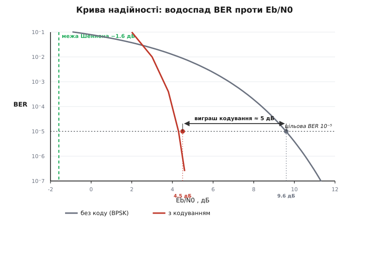
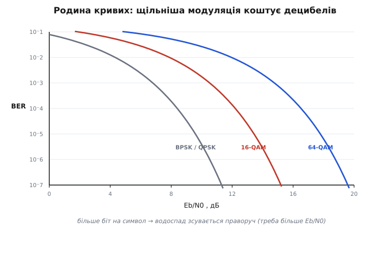

# BER і SNR: крива надійності каналу

<preknowlist>
- [Канал AWGN](topic:math-information/awgn-channel) — шум як гаусів процес зі спектральною густиною N₀; це середовище, у якому живе вся крива.
- [Потужність і децибели](topic:com-medium/power-decibels) — децибел як логарифм відношення потужностей; обидві осі надійності міряють у дБ.
- [FSK і PSK](topic:com-modulation/fsk-psk) — як біт перетворюється на символ (зокрема BPSK), щоб «помилка біта» взагалі мала сенс.
</preknowlist>

Інженер, що вмикає новий канал — байдуже, чи це радіолінк до дрона, чи читання комірки флеш-пам'яті, чи світло у волокні, — рано чи пізно ставить одне й те саме питання: **чи працюватиме воно?** І тут виявляється прикра річ: одним числом не відповісти. Потрібно два. Перше каже, **наскільки сигнал гучніший за шум**, друге — **скільки бітів через цей шум псується**. А по-справжньому корисна навіть не пара чисел, а **карта між ними**: коли шуму стільки — помилок буде стільки. Ця карта і є крива надійності каналу, і вона, мабуть, найчастіше малюваний графік у всій цифровій передачі.

Розберімо обидві осі поодинці, тоді складемо їх у криву — і побачимо, чому вона має форму водоспаду й чому саме ця форма найважливіша.

## BER — та частка бітів, що зламалися

Найчесніша міра якості каналу — просто **порахувати биті біти**. Передали мільйон, на прийомі кілька перекинулися з 0 на 1 чи навпаки — оце й є частота помилок на біт, **BER** (англ. *bit error rate*):

```
BER = (кількість хибних бітів) / (кількість переданих бітів)
```

Це не абстракція, а ймовірність, яку можна виміряти лічильником. Уявіть, що канал підкидає за кожен біт монету з крихітною ймовірністю «зіпсувати». BER — це і є та ймовірність. Число саме по собі німе, поки не переведеш його у щось відчутне на дотик, тож привчімо око до порядків:

- **10⁻³** — один хибний біт на тисячу. Для голосу ще стерпно, для файлу — катастрофа.
- **10⁻⁶** — один на мільйон. Пристойний радіоканал даних.
- **10⁻¹²** — один на трильйон. Оптоволокно й накопичувачі живуть отут.

Щоб побачити, чому голі порядки оманливі, помножмо BER на швидкість потоку — бо болить не частка, а **скільки помилок за секунду** доводиться латати.

**Гігабітний лінк із BER = 10⁻⁹.**

```
потік      = 1 Гбіт/с = 10⁹ біт/с
BER        = 10⁻⁹
помилки/с  = 10⁹ · 10⁻⁹ = 1 помилка щосекунди
```

Начебто «одна на мільярд» звучить бездоганно — а насправді щосекунди один біт летить. Той самий BER на повільному телеметричному потоці в 10 кбіт/с дав би одну помилку за 100 секунд. **BER без швидкості нічого не важить** — важить добуток.

> 🔧 **Навіщо це.** BER — це той рядок у специфікації, під яким підписується розробник каналу: «за таких умов — не гірше стількох помилок». Саме він вирішує, чи потрібен зверху [код виправлення помилок](topic:com-modulation/hamming-code), і який. А ще BER підступний у вимірюванні: щоб надійно побачити BER = 10⁻⁹, треба пропустити хоча б кілька разів по мільярду бітів (правило великого пальця — назбирати бодай сотню помилок), інакше «нуль помилок за хвилину» нічого не доводить.

## SNR — чи гучніший сигнал за шум

BER — це наслідок. Причина сидить у фізиці каналу, і міряють її **відношенням сигнал/шум**, SNR (англ. *signal-to-noise ratio*):

```
SNR = (потужність сигналу) / (потужність шуму)
```

Чому саме **відношення**, а не абсолютна потужність сигналу? Бо приймачеві байдуже, скільки у сигналі ват, — йому важить одне: чи вдасться **відрізнити** сигнал від шуму. Тихий шепіт у тиші розчуєш, крик у гуркоті цеху — ні. Значення має розрив між ними, а розрив — це відношення.

Відношення потужностей зручно міряти [в децибелах](topic:com-medium/power-decibels) — логарифмічній шкалі, де множення перетворюється на додавання:

```
SNR(дБ) = 10 · log₁₀ ( P_сигнал / P_шум )
```

Тут ховається одна пастка. «Потужність шуму» залежить від того, у якій **смузі частот** її поміряти: ширша смуга впускає більше шуму. Тому голе SNR двозначне — воно змішує в одне число і якість сигналу, і те, скільки спектра ви зайняли. Щоб порівнювати різні системи чесно, шкалу треба нормувати.

## Eb/N0 — чесна вісь на кожен біт

Нормована вісь, якою користуються всюди, — це **Eb/N0**: енергія на один біт, поділена на спектральну густину потужності шуму.

```
Eb  — енергія, витрачена на передачу одного біта (Дж)
N0  — потужність шуму на кожен герц смуги (Вт/Гц)
```

Чому так справедливіше за просте SNR? Бо один і той самий біт можна передати нашвидкуруч, а можна — повільно й вкладаючи в нього більше енергії; за однакового миттєвого SNR другий біт розчути легше. Ділення на N0 (яке [задає канал AWGN](topic:math-information/awgn-channel)) прибирає з рівняння смугу й швидкість, і на одній осі опиняються поруч телефонний модем і зонд біля Марса. SNR і Eb/N0 пов'язані через спектральну ефективність — скільки біт за секунду ви тиснете в кожен герц:

```
SNR = (Eb/N0) · (Rb / B)      Rb — бітова швидкість, B — смуга
```

Для BPSK, де смуга приблизно дорівнює бітовій швидкості, SNR і Eb/N0 майже збігаються — тому далі малюємо криву саме проти Eb/N0. (Звідки береться точна формула BER і як усі ці відношення переходять одне в одне — [розписано в математичній вкладці](topic:com-modulation/ber-snr-curve/math-q-function-ber.md).)

## Крива — водоспад

Тепер зшиваємо осі. Візьмемо найпростішу цифрову модуляцію — **BPSK**, де 0 і 1 — це та сама несуча з протилежною фазою, — і спитаємо: яка ймовірність переплутати біт за даного Eb/N0? Для [каналу з гаусовим шумом](topic:math-information/awgn-channel) відповідь має рівно один вигляд:

```
BER = Q( √(2 · Eb/N0) )
```

де **Q** — «хвіст» нормального розподілу: ймовірність, що гаусова випадкова величина зайде далі, ніж на стільки-то сигм від центру. Що більше Eb/N0, то далі забирається аргумент у хвіст, то менша ймовірність. Обчислити її в коді — один рядок, бо Q виражається через доповнювальну функцію похибки `erfc`:

```python
import math

def ber_bpsk(ebn0_db):
    ebn0 = 10 ** (ebn0_db / 10)          # з децибел у рази
    return 0.5 * math.erfc(math.sqrt(ebn0))   # = Q(√(2·Eb/N0))

for db in [0, 2, 4, 6, 8, 9.6, 10, 11]:
    print(f"{db:>4} дБ  ->  BER = {ber_bpsk(db):.1e}")
```

```
   0 дБ  ->  BER = 7.9e-02
   2 дБ  ->  BER = 3.8e-02
   4 дБ  ->  BER = 1.3e-02
   6 дБ  ->  BER = 2.4e-03
   8 дБ  ->  BER = 1.9e-04
 9.6 дБ  ->  BER = 1.0e-05
  10 дБ  ->  BER = 3.9e-06
  11 дБ  ->  BER = 2.6e-07
```

Вдивіться в правий стовпчик. На 0 дБ (сигнал дорівнює шумові) кожен дванадцятий біт хибний — канал майже марний. Але далі диво: **кожен доданий децибел на крутій ділянці збиває BER на цілий порядок**. Від 8 до 10 дБ — лише два децибели — а помилок меншає у півсотні разів. Намалюйте цей стовпчик, і вийде характерний обрив.



*Уся інженерія каналу — це рух по цій кривій: праворуч по осі коштує потужності й антени, ліворуч тягне кодування. Виграш кодування міряють горизонтально — на скільки децибелів крива зсунулась вліво за тієї самої цільової BER.*

Через цей обрив криву й називають **водоспадом** (англ. *waterfall*): угорі вода тече ліниво, потім зривається майже прямовисно. Практичний висновок безжальний: біля обриву **пара децибелів вирішує все**. Той самий пристрій за 8 дБ ледь дихає, за 11 дБ працює бездоганно — тому в радіозв'язку так б'ються за кожен децибель підсилення антени й запасу лінка.

## Чому так круто падає — дві гірки

Звідки береться прямовисність? Погляньмо, що насправді робить приймач. Символ «−1» приходить не точно як −1, а розмазаний шумом у дзвоник навколо −1; символ «+1» — такий самий дзвоник навколо +1. Приймач ставить поріг рішення посередині, в нулі: усе лівіше читає як −1, усе правіше — як +1. Помилка стається тільки тоді, коли шум зжбурнув символ **за поріг** — тобто коли хвіст одного дзвоника перетнув нуль і заліз на чужу половину.


*Помилка — це заштрихований хвіст, що перетнув поріг. Підняти Eb/N0 означає розсунути дзвоники; хвіст гаусіани спадає як e^(−x²/2), тож невелике розсування вбиває перекриття надпропорційно — звідси прямовисний обрив водоспаду.*

Ось і вся таємниця крутизни. Підняти Eb/N0 — це **розсунути дзвоники** (сигнал далі від нуля) або **звузити їх** (менше шуму). А хвіст гаусіани спадає не лінійно, а як `e^(−x²/2)` — шалено швидко. Відсунули центр на трохи далі за поріг — площа хвоста за порогом упала на порядок. Саме тому крива не сповзає полого, а провалюється: за лінійним рухом по осі (децибели) стоїть **експонента від квадрата** в ймовірності помилки.

## Виграш кодування — зсунути криву ліворуч

Досі ми брали Eb/N0 як дане й читали свою BER. Але є другий важіль. Якщо перед відправкою домішати до даних надлишок за правилами [коду виправлення помилок](topic:com-modulation/hamming-code), приймач зможе латати частину помилок сам — і та сама BER дістанеться за **меншого** Eb/N0. На графіку це виглядає як зсув усієї кривої **ліворуч**. Наскільки саме ліворуч — за фіксованої цільової BER (традиційно беруть 10⁻⁵) — і називають **виграшем кодування** (англ. *coding gain*), у децибелах.

**Скільки коштує кодування й що дає.**

```
без коду (BPSK):   BER = 10⁻⁵  за  Eb/N0 ≈ 9.6 дБ
з кодом (згортка ½): BER = 10⁻⁵ за  Eb/N0 ≈ 4.5 дБ
виграш = 9.6 − 4.5 ≈ 5.1 дБ
```

5 децибелів — це не косметика. У разах це 10^0.51 ≈ 3.2: та сама надійність за **втричі меншої** потужності передавача. Або, за фіксованої потужності, — приблизно вдвічі більша дальність (бо потужність на прийомі спадає з квадратом відстані). Заради цих децибелів і городять усе кодування:

- прості коди, як [Геммінга](topic:com-modulation/hamming-code), дають скромний виграш;
- згорткові коди — близько 5 дБ;
- [конкатенація](topic:com-modulation/concatenated-codes) зовнішнього [Ріда–Соломона](topic:com-modulation/reed-solomon) з внутрішнім згортковим (класика далекого космосу — так передавали «Вояджери») відсунула криву майже на 7 дБ, до району 2–3 дБ Eb/N0;
- сучасні [LDPC](topic:com-modulation/ldpc) і турбокоди підповзли впритул до фундаментальної стіни — на частки децибела.

Що це за стіна? Її ставить [теорема Шеннона про кодування каналу](topic:math-information/channel-coding-theorem): нижче певного Eb/N0 надійна передача **неможлива взагалі, за жодного коду**. У граничному випадку нескінченної смуги ця межа лежить на Eb/N0 = ln 2 ≈ **−1.59 дБ** — так, у від'ємних децибелах, тобто зв'язок можливий навіть тоді, коли шум потужніший за сигнал. Уся гонка кодування — це наближення водоспаду до цієї вертикалі. Задарма, звісно, не буває: надлишок або з'їдає частину корисної швидкості, або вимагає ширшої смуги — [виграш у надійності платиться пропускною здатністю](topic:math-information/bandwidth-capacity).

## Як читати криву на практиці

Крива перетворює туманне «канал добрий/поганий» на інженерний рецепт. Читають її так.

**Знизу вгору — від вимоги до бюджету.** Спершу застосунок диктує цільову BER: голосу вистачить 10⁻³, файлам треба 10⁻⁶, накопичувачам — 10⁻¹². Проводимо горизонталь на цьому рівні, впираємось у криву, опускаємось на вісь — оце **потрібний Eb/N0**. Далі перевіряємо, чи стільки в нас насправді є: реальне Eb/N0 дає [бюджет лінка](topic:com-medium/link-budget) (прийнята потужність мінус [шумовий поріг приймача](topic:hw-analog/noise-figure)). І між потрібним та наявним закладають **запас лінка** — кілька децибелів на завмирання й дощ, бо канал не стоїть на місці.

**Вибір модуляції — обмін швидкості на стійкість.** BPSK кладе на символ один біт. Можна пхати більше — [16-QAM](topic:com-modulation/qam) чотири біти на символ, 64-QAM шість, — і за ту саму смугу потік зростає в рази. Але сузір'я стає густішим, точки — ближчими, і щоб їх не переплутати, потрібне **вище Eb/N0**: крива вищого порядку сидить праворуч. Тобто щільніша модуляція — це рух угору по швидкості ціною руху праворуч по осі надійності.



*Щільніша модуляція везе більше біт на символ, але вимагає більшого Eb/N0 за тієї самої BER — її водоспад зсунуто праворуч. Звідси й адаптивні схеми: коли канал добрий, беруть праву щільну модуляцію заради швидкості; погіршав — відступають до лівої стійкої.*

Саме тому сучасні лінки не тримаються однієї точки, а ходять по цілій родині кривих: [адаптивна модуляція й кодування](topic:com-modulation/adaptive-modulation) в реальному часі стежить за поточним SNR і перемикає то щільнішу схему заради швидкості, то стійкішу заради надійності. Хочете **переконатися**, що ваш канал справді лягає на теоретичну криву, — його неважко [змоделювати методом Монте-Карло](topic:com-modulation/ber-snr-curve/proj-ber-monte-carlo.md): нагенерувати випадкових бітів, домішати шуму на потрібне Eb/N0, полічити помилки й накласти точки на теоретичну формулу.

Отак крива надійності стає контрактом каналу. Вона перетворює розпливчасте відчуття на точну обіцянку — «за стількох децибелів матимеш стільки помилок», — і кожен важіль розробника, чи то потужність, антена, код чи модуляція, виявляється просто ходом на цьому єдиному графіку.
