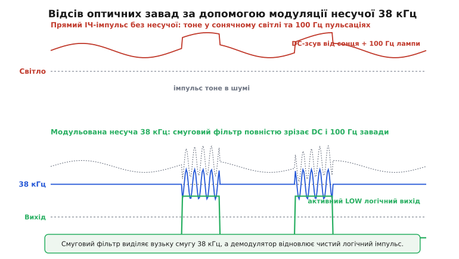
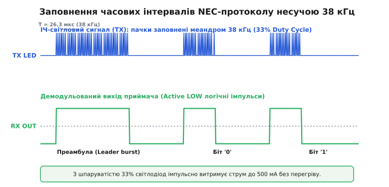
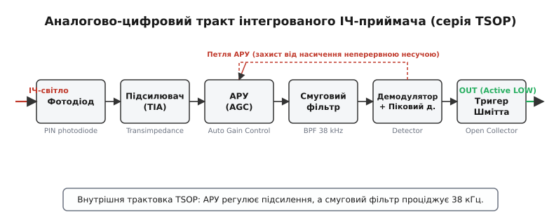
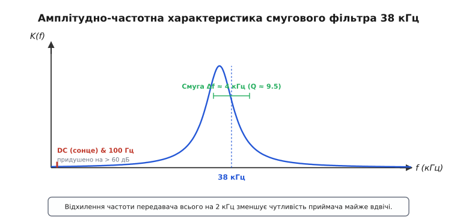

# Модуляція несучої для відсіву перешкод (38 кГц)

<preknowlist>
- [AM і FM](topic:com-modulation/am-fm) — концепція амплітудної модуляції та огинаючої.
- [База й смугова область](topic:com-modulation/baseband-passband) — перенесення спектра базової смуги на несучу частоту.
</preknowlist>

Оптичний бездротовий зв'язок у відкритому середовищі стикається з фундаментальною фізичною перешкодою: довкілля насичене колосальним фоновим оптичним випромінюванням. Сонячне світло у сонячний день створює на поверхні землі інфрачервоний потік потужністю понад 100 Вт/м² у діапазоні довжин хвиль від 800 до 1000 нм. Навіть усередині приміщення лампи розжарювання, галогенні світильники та світлодіодні панелі випромінюють потужні світлові потоки, що пульсують на частотах 100 Гц або десятків кілогерц. Якби передавач спробував надсилати звичайні прямокутні логічні імпульси струму прямо на інфрачервоний світлодіод без додаткового оброблення, фотодіод приймача негайно увібрав би увесь цей фоновий оптичний потік. У результаті входний аналоговий підсилювач миттєво перейшов би у глибоке насичення, а крихітний корисний сигнал повністю розчинився б у фоновому шумі.

Ефективним розв'язанням цієї задачі стала **двоступенева модуляція несучої**: корисний інформаційний сигнал передається не прямокутними пачками постійного струму, а короткочасними сплесками високочастотних коливань (найчастіше на частоті 38 кГц). Це дозволяє приймачеві застосувати вузькосмугову аналогову фільтрацію й повністю придушити фонові оптичні завади, виділивши корисну інформацію навіть тоді, коли фоновий потік світла в тисячі разів перевищує випромінювання пульта керування.

### Чому прямий ІЧ-імпульс тоне у фоновому світлі

Розглянемо детально фізичні процеси, що відбуваються на P-N переході кремнієвого фотодіода. Кожен фотон інфрачервоного діапазону з довжиною хвилі близько 940 нм, що влучає в напівпровідникову структуру, генерує електронно-діркову пару й створює пропорційний фотострум.

У реальному приміщенні пряме сонячне світло через вікно викликає у фотодіоді постійний фоновий фотострум `I_dc` величиною від кількох десятків мікроампер до кількох міліампер. До цього додається зміна складова `I_fl` від мережевого освітлення (100 Гц для люмінесцентних та традиційних ламп або 20–60 кГц для світлодіодних драйверів з імпульсною модуляцією). Сумарний струм фотодіода дорівнює алгебраїчній сумі всіх джерел випромінювання:

```
I_photodiode(t) = I_dc + I_fl(t) + I_signal(t)
```

Корисний сигнал `I_signal(t)` від світлодіода передавача на відстані кількох метрів створює у фотодіоді приймача струм амплітудою всього від 10 до 100 наноампер. Це у 10 000–100 000 разів менше за фоновий постійний струм сонячного засвічування!

Спроба підсилити такий сумарний струм за допомогою прямолінійного підсилювача з великим коефіцієнтом підсилення спричиняє негайне обмеження сигналу за напругою живлення (клипинг). Вихід підсилювача впирається в верхню шину живлення `VCC`, транзистори переходять у режим насичення, й будь-які дрібні зміни струму від випромінювача передавача безповоротно втрачаються.


*Прямий логічний імпульс без модуляції тоне у фотострумі сонячного світла та пульсаціях ламп. Натомість модульована несуча 38 кГц створює вузькосмуговий сплеск у спектрі, який легко відокремлюється від фону смуговим фільтром.*

Радикальний вихід із цієї ситуації полягає в перенесенні спектра корисного повідомлення з низькочастотної області (де зосереджена практично вся потужність сонячного світла та мережевих ламп) у «тихе» спектральне вікно навколо частоти 38 кГц. Подробиці історичного пошуку цього рішення — від перших світлових пістолетів 1955 року до ультразвуку та інфрачервоних світлодіодів — розкрито у 📜 [«Від ультразвуку до 38 кГц: історія винайдення ІЧ-пульта»](topic:com-modulation/carrier-ir-modulation/hist-ir-remote-birth.md).

> 🔧 **Навіщо це.** Ідея перенесення корисного сигналу на високочастотну піднесну для придушення низькочастотного шуму застосовується не лише в пультах побутової техніки. Цей самий принцип лежить в основі роботи підводних оптичних модернів, медичних пульсоксиметрів (де вимірюють мікроскопічну пульсацію крові в тканинах на тлі потужного засвічування), оптичних лідарів та датчиків наближення у сучасних смартфонах. Зрозумівши відсів завад на частоті 38 кГц, ви осягнете принцип дії синхронного детектування (lock-in amplification), який використовують у найчутливіших наукових приладах.

### Принцип двоступеневої модуляції (OOK + Протокольне кодування)

Передача даних в інфрачервоному каналі завжди будується як двоступеневий процес. Перший ступінь відповідає за **модуляцію несучої** (subcarrier modulation), а другий — за **протокольне кодування часових інтервалів** (baseband protocol encoding).

1. **Несуча частота (Subcarrier):** Світлодіод передавача не просто вмикається на тривалий час, а випромінює швидку послідовність прямокутних імпульсів з частотою 38 кГц (період `T = 26.315 мкс`). Стан, у якому світлодіод випромінює коливання 38 кГц, називають **пачкою** (*burst* або *mark*), а стан, у якому світлодіод мовчить, — **паузою** (*space*). З точки зору теорії сигналів це амплітудна маніпуляція типу «ввімкнено-вимкнено» (*On-Off Keying*, OOK).
2. **Протокольний рівень (Protocol timing):** Тривалість пачок та пауз задає значення логічних нулів й одиниць. Наприклад, у поширеному протоколі **NEC**:
   - Преамбула (Leader code) складається з тривалої пачки 38 кГц тривалістю 9000 мкс та паузи тривалістю 4500 мкс.
   - Логічний `0` передається пачкою 38 кГц тривалістю 562.5 мкс (21 цикл несучої) та паузою 562.5 мкс.
   - Логічна `1` передається пачкою 38 кГц тривалістю 562.5 мкс та тривалою паузою 1687.5 мкс (утричі довша за пачку).


*Сигнал передавача складається з пачок 38 кГц заданої тривалості. Інтегрований приймач демодулює ці пачки й видає чистий прямокутний логічний сигнал з активним низьким рівнем (Active LOW).*

Розділення задач між двома рівнями модуляції значно спрощує схемотехніку. Аналогова частина приймача відповідає лише за виявлення наявності 38 кГц несучої, а цифровий мікроконтролер виконує просте вимірювання тривалості логічних імпульсів за допомогою звичайного таймера.

### Огляд світових протоколів ІЧ-зв'язку

На основі модуляції несучої було створено кілька популярних протоколів, що відрізняються частотою несучої та методом кодування бітів:

- **NEC Protocol (38 кГц, Pulse-Distance):** Найпоширеніший протокол. Тривалість пачки стабільна (562.5 мкс), а значення біта визначається тривалістю наступної паузи (562.5 мкс для `0` та 1687.5 мкс для `1`). Містить перевірку цілісності (інверсні байти адреси та команди).
- **Philips RC-5 (36 кГц, Bi-Phase / Manchester):** Кожен біт має фіксовану тривалість 1.778 мс. Логічний `0` передається пачкою 36 кГц у першій половині біта та паузою в другій; логічна `1` — навпаки. Забезпечує самосинхронізацію та відсутність постійної складової.
- **Sony SIRC (40 кГц, Pulse-Width):** Значення біта визначається тривалістю пачки (1.2 мс для `1` та 0.6 мс для `0`), при фіксованій тривалості паузи між бітами 0.6 мс.

### Аналогово-цифровий тракт приймача

У сучасній електронній апаратурі аналогову обробку ІЧ-сигналу виконують спеціалізовані інтегровані приймачі (наприклад, серій TSOP38238, TSOP4838, HS0038). Усередині компактного трьохвивідного корпусу інтегровано фотодіод та повний аналогово-цифровий тракт обробки.


*Внутрішній тракт приймача містить трансімпедансний підсилювач, схему автоматичного регулювання підсилення (АРУ), вузькосмуговий фільтр 38 кГц, демодулятор та вихідний тригер з відкритим колектором.*

Розглянемо послідовне проходження сигналу через внутрішні блоки приймача:

1. **PIN-фотодіод з оптичним фільтром:** Перетворює вхідні інфрачервоні фотони на змінний фотострум. Корпус із темно-фіолетової епоксидної смоли працює як оптичний смуговий фільтр, який затримує видиме світло з довжиною хвилі менше 850 нм.
2. **Трансімпедансний підсилювач (TIA):** Має низький вхідний імпеданс і перетворює малий фотострум фотодіода в пропорційну напругу.
3. **Автоматичне регулювання підсилення (АРУ / AGC):** Вимірює середньоквадратичний рівень сигналу на виході й динамічно коригує коефіцієнт підсилення. За наявності сильного фонового засвічування АРУ зменшує підсилення, запобігаючи перевантаженню підсилювача.
4. **Смуговий фільтр (Bandpass Filter):** Активний резонансний фільтр, налаштований точно на центральну частоту 38 кГц. Він пропускає лише змінні коливання у вузькому діапазоні `38 ± 2 кГц`, повністю відсікаючи постійний струм від сонячного світла та 100 Гц пульсації від лампових мереж.
5. **Демодулятор та піковий детектор:** Випрямляє та згладжує високочастотні імпульси 38 кГц, виділяючи обвідну лінію (огинаючу) корисного імпульсу.
6. **Тригер Шмітта та вихідний каскад:** Формує круті фронти цифрового сигналу. Вихідний транзистор виконано за схемою з відкритим колектором (**Active LOW**): у стані спокою вихід підтягнутий до напруги живлення `VCC`, а під час прийому 38 кГц пачки транзистор відкривається й закорочує вихід на `GND`.

Докладний аналіз внутрішньої схемотехніки, призначення контактів та захисного RC-фільтра живлення наведено у 🔌 [«Інтегровані ІЧ-приймачі: устрій, АРУ та підключення»](topic:com-modulation/carrier-ir-modulation/comp-ir-receiver.md).

### Частотна селективність та вибір 38 кГц

Вибір центральної частоти **38 кГц** обумовлений тристороннім інженерним компромісом:

1. **Віддаленість від низькочастотних завад:** Частота 38 кГц у сотні разів перевищує частоту мережі (50/60 Гц) та її гармоніки (100/120 Гц).
2. **Швидкодія напівпровідників:** Період 26.3 мкс дозволяє застосовувати дешеві кремнієві фотодіоди з великою площею фоточутливого вікна й значною власною бар'єрною ємністю (`C_j ≈ 30..100 пФ`). Для вищих частот (мегагерцевий діапазон) така ємність шунтувала б корисний сигнал.
3. **Відлаштування від електронних баластів:** Перші електронні баласти люмінесцентних ламп працювали на частотах 20–30 кГц. Частота 38 кГц (а також 56 кГц у завадостійких системах) опинилася вище їхніх основних спектральних піків.


*Смуговий фільтр має високу добротність (`Q ≈ 9.5`). Відхилення частоти передавача всього на 2 кГц від номіналу 38 кГц призводить до втрати понад 50% амплітуди вихідного сигналу.*

Точні математичні розрахунки виграшу сигнально-шумового співвідношення за рахунок фільтрації та рівняння імпульсного теплового балансу подано у вставці 🧮 [«Виграш сигнально-шумового співвідношення та енергетика 38 кГц»](topic:com-modulation/carrier-ir-modulation/math-bandpass-snr.md).

### Економіка імпульсного живлення: шпаруватість 33%

Використання високочастотної несучої забезпечує колосальну **енергетичну перевагу**.

У безперервному режимі (DC) інфрачервоний світлодіод може витримувати постійний струм не більше `I_dc_max ≈ 50 мА`. Перевищення цього рівня викликає перегрів P-N переходу й кристала.

Протім при модуляції несучою випромінювання розбивається на швидкі мікросекундні імпульси. Якщо встановити **шпаруватість 33%** (у кожному циклі періодом `T = 26.3 мкс` світлодіод увімкнено лише `T_on = 8.7 мкс`, а решту `17.6 мкс` він вимкнений), середня розсіювана потужність визначається виразом:

```
P_avg = I_peak · V_forward · (T_on / T)
      = I_peak · V_forward · 0.33
```

Оскільки постійна часу нагріву напівпровідникового кристала становить кілька мілісекунд, для мікросекундних імпульсів кристал реагує лише на середню потужність `P_avg`. Це дає змогу подавати у світлодіод піковий струм `I_peak` до **150–500 мА** у коротких пачках без загрози теплового руйнування!

Оскільки інтенсивність світлового потоку прямо пропорційна інжектованому струму, підняття струму з 50 мА до 450 мА збільшує пікову оптичну потужність у 9 разів. За законом обернених квадратів, максимальна дальність зв'язку `r_max` зростає як квадратний корінь з оптичної потужності:

```
r_max ∝ √(потужність) ∝ √(9) = 3  (рази)
```

Завдяки імпульсній несучій 38 кГц зі шпаруватістю 33% звичайний кишеньковий пульт на двох батарейках AAA впевнено забезпечує зв'язок через усю кімнату на відстань 10–15 метрів.

### Практичні пастки та обмеження

Незважаючи на високу завадостійкість, при розробці пристроїв ІЧ-зв'язку слід враховувати важливі обмеження:

1. **Насичення АРУ неперервним сигналом:** Якщо передавач випромінює 38 кГц несучу **безперервно** (наприклад, у прохідних оптичних бар'єрах), схема АРУ усередині TSOP через 2 мс сприйме цей сигнал як заваду й **повністю вимкне вихід** (поверне `OUT` у стан HIGH). Для оптичних датчиків наближення необхідно передавати пачки (наприклад, 20 імпульсів 38 кГц) з обов'язковими паузами між ними.
2. **Точність частоти генерації:** Якщо мікроконтролер передавача згенерує частоту 35 кГц замість 38 кГц через неправильний розрахунок дільника таймера, смуговий фільтр приймача ослабить сигнал у 2–3 рази, зменшивши дальність зв'язку з 15 метрів до 3–4 метрів.
3. **Оптичне відбиття від стін:** Інфрачервоне випромінювання 940 нм чудово відбивається від білої штукатурки, шпалер та стелі. Це дозволяє пульту працювати навіть у протилежному від телевізора напрямку. Однак у високошвидкісних системах передачі даних багатопроменеве відбиття спричиняє розмивання імпульсів і обмежує граничну швидкість передачі до 2–4 кбіт/с.

Практичні приклади конфігурування таймерів мікроконтролера для генерації 38 кГц та реалізацію алгоритму декодування кадрів NEC на мовах C та C++ наведено у вставці ⚙️ [«Синтез 38 кГц несучої та декодування NEC-протоколу»](topic:com-modulation/carrier-ir-modulation/proj-ir-nec-modem.md).
