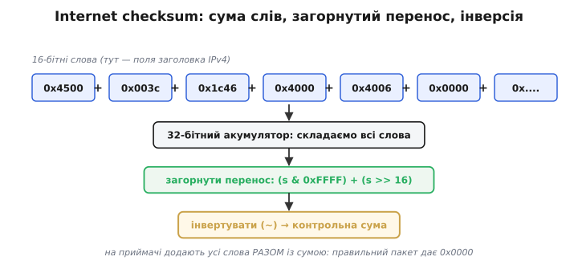
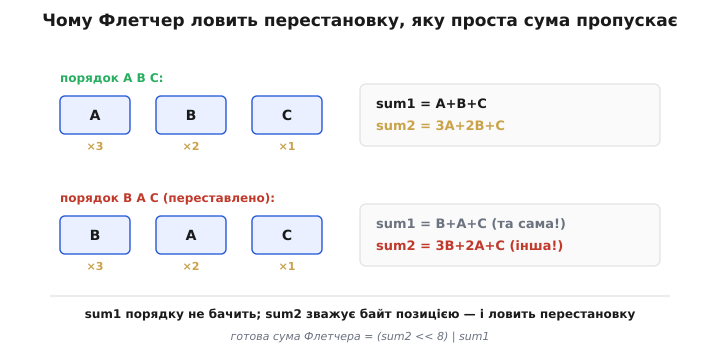
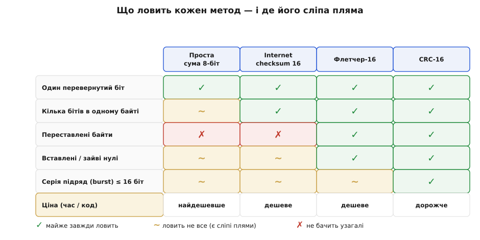

# Контрольні суми на практиці: Internet checksum і Флетчер у коді

Ідея контрольної суми проста на словах: скласти байти, надіслати суму поряд із даними, а на тому кінці перерахувати й звірити. Та щойно доходить до коду, постає вибір — **як саме** складати, щоб сторож ловив реальні поломки, а не марнував такти. Тут ми перетворимо цю ідею на робочі функції двох алгоритмів, що справді крутяться в мережах, — **Internet checksum** (нею захищені заголовки IP, TCP та UDP) і **контрольної суми Флетчера** (*Fletcher's checksum*). Заразом стане видно, чому гола сума — слабенький сторож і яким маленьким доважком Флетчер латає її головну діру. Усе спирається на просте додавання із [переносом](root:hw-digital/combinational-circuits) та кілька бітових зсувів — жодних таблиць чи ділень.

## Задача

Чого ми хочемо: дешевий спосіб помітити, що пакет приповз пошкодженим. Сформулюймо це як інженерне завдання з трьома жорсткими умовами. По-перше, **дешево**: контрольну суму рахують на кожному пакеті, часто на крихітному мікроконтролері, тож дозволені хіба що додавання й зсуви — без множень і ділень. По-друге, **за один прохід**: дані течуть потоком, і вертатися буфером назад не можна. По-третє, і це найголовніше, сторож має **ловити реальні поломки** каналу: поодинокий [перевернутий біт](root:sf-data/bit-flips), серію зіпсованих біт підряд, а ще — переставлені чи загублені байти. Сама собою проста сума байтів першу умову складає блискуче, а от на третій провалюється, і саме звідти росте потреба в чомусь розумнішому.

## Ідея

Почнімо з того, що **майже** працює, — з простого додавання, але зробленого акуратно. Якщо просто скласти 16-бітні слова у 16-бітний регістр, перенос за верхній край губиться, а з ним губиться й частина інформації про старші біти. Internet checksum лагодить це прийомом **загорнутого переносу** (*end-around carry*): те, що вилізло за межі 16 біт, не викидають, а додають назад знизу. Завдяки цьому додавання стає по-справжньому комутативним і асоціативним — сума не залежить від того, у якому порядку складати слова, тож її однаково легко рахувати хоч уперед буфером, хоч назад. Наприкінці суму **інвертують** (порозрядне NOT) — це й є контрольне число, яке кладуть у пакет.


*Кілька 16-бітних слів (тут — поля заголовка IPv4) складаються у 32-бітний акумулятор; його верхні біти (перенос) загортаються назад у нижні, а результат інвертується — це й є контрольна сума. Хитрість інверсії в тому, що на приймачі додають **усі** слова **разом із** контрольною сумою: правильний пакет дає рівно 0x0000, а будь-яке ненульове число означає поломку.*

Цей метод швидкий і чесно ловить поодинокі перевернуті біти, та має ваду, спільну для всіх простих сум: він **сліпий до порядку**. Переставте місцями два байти — сума не зміниться ні на йоту, і сторож нічого не помітить. А перестановки в реальних каналах трапляються: збій DMA, зрушений на байт буфер, плутанина в покажчиках. Тут і виходить на сцену **Флетчер**. Його думка геніально проста: вести **дві** біжучі суми. Перша, `sum1`, — це звичайна сума байтів. Друга, `sum2`, на кожному кроці додає до себе **поточне значення** `sum1`. Через це кожен байт входить у `sum2` зі **своєю вагою за позицією**: ранній байт устигає долити в `sum2` багато разів, пізній — мало. Порядок раптом починає важити, і перестановка, невидима для простої суми, миттєво зрушує `sum2`.


*Ті самі три байти у двох порядках. `sum1` (проста сума) однакова в обох — їй порядок байдужий. А `sum2` накопичує часткові суми, тож кожен байт зважений позицією (×3, ×2, ×1); варто переставити байти — і `sum2` стає іншою. Готова контрольна сума Флетчера — це два байти, склеєні в одне слово: `(sum2 << 8) | sum1`.*

## Код

Обидва алгоритми — це кілька рядків на чистому C, мовою, якою їх і пишуть у мережному стеку та на мікроконтролерах. Почнімо з Internet checksum над буфером даних; він читає їх як 16-бітні слова (старший байт перший — мережний порядок):

```c
#include <stdint.h>
#include <stddef.h>

uint16_t internet_checksum(const uint8_t *data, size_t len) {
    uint32_t sum = 0;

    // Складаємо дані по два байти — як 16-бітні слова.
    while (len > 1) {
        sum += ((uint32_t)data[0] << 8) | data[1];
        data += 2;
        len  -= 2;
    }
    if (len)                        // непарний «хвіст» доповнюємо нулем справа
        sum += (uint32_t)data[0] << 8;

    while (sum >> 16)               // загортаємо перенос, поки він є
        sum = (sum & 0xFFFF) + (sum >> 16);

    return (uint16_t)~sum;          // інверсія — і є контрольне число
}
```

Акумулятор навмисно 32-бітний: у нього спокійно вкладаються всі переноси навіть найбільшого пакета, тож загортати їх можна раз наприкінці, а не щокроку — результат той самий, бо додавання із загорнутим переносом не залежить від порядку. На приймачі викликають ту саму функцію над усім пакетом **разом із** полем суми: якщо все ціле, результат — рівно `0x0000`.

Тепер Флетчер-16: з потоку **байтів** він дає 16-бітну суму, склеєну з двох 8-бітних половин.

```c
uint16_t fletcher16(const uint8_t *data, size_t len) {
    uint16_t sum1 = 0, sum2 = 0;

    for (size_t i = 0; i < len; i++) {
        sum1 += data[i];
        if (sum1 >= 255) sum1 -= 255;   // sum1 за модулем 255 — без ділення
        sum2 += sum1;
        if (sum2 >= 255) sum2 -= 255;   // sum2 за модулем 255
    }
    return (uint16_t)((sum2 << 8) | sum1);
}
```

Обидві суми тримаємо за модулем **255**, а не за звичним для 8-бітного регістра 256: 256 — степінь двійки, і саме через це ціла родина двобайтових поломок взаємно гаситься й лишає суму незмінною, а непарне 255 = 2⁸−1 цю сліпу пляму прибирає. Зводити за модулем щокроку ділення не треба: жодна із сум ніколи не перескакує 509, тож одне умовне віднімання `if (s >= 255) s -= 255` завжди повертає її в діапазон 0…254. Це той самий за духом прийом, що й загорнутий перенос вище: переповнення завертається назад дешевим відніманням, а не дорогою на мікроконтролері операцією ділення `%`.

> 🔧 **Навіщо це.** Це не теорія, а щоденний інструмент вбудованика. Шлете телеметрію поверх UART чи свій кадр по радіоканалу — додайте в кінець кадру два байти Флетчера, і приймач відсіє більшість покручених пакетів за десяток зайвих інструкцій на байт. А коли заглядаєте у дамп IP- чи UDP-пакета, поле «checksum» — це рівно та сума 16-бітних слів із загорнутим переносом; знаючи алгоритм, ви перевірите його вручну й зрозумієте, чому аналізатор лається «bad checksum».

## 📜 Звідки взялися ці дві суми

За кожним із цих алгоритмів стоїть не безіменна формула, а конкретні люди й конкретна потреба. Internet checksum народився разом із самим стеком TCP/IP наприкінці 1970-х і був канонізований 1988 року в короткому документі **RFC 1071** «Computing the Internet Checksum» (автори — Боб Бреден, Девід Борман і Крейг Партрідж — *Bob Braden*, *David Borman*, *Craig Partridge*). Вибір був свідомим компромісом інженерів-практиків: їм потрібна була сума, яку **тогочасні** машини рахували б майже задарма, навіть програмно, тому й зупинилися на додаванні із загорнутим переносом замість дорожчого, хай і надійнішого, [ділення многочленів](root:com-modulation/crc). Слабкість до перестановок вони усвідомлювали й прийняли як ціну за швидкість — на той час канали й апаратура давали переважно поодинокі бітові помилки, проти яких простої суми вистачало.

Двома суми Флетчера завдячуємо **Джонові Флетчеру** (*John G. Fletcher*, 1934–2012) з Ліверморської національної лабораторії (*Lawrence Livermore*), який описав їх 1982 року в статті «An Arithmetic Checksum for Serial Transmissions» (*IEEE Transactions on Communications*). Його мета була прямою: дістати надійність, близьку до складніших кодів, але ціною, близькою до простого додавання, — і друга, накопичувальна сума цю мету влучно склала, бо коштує лише одне зайве додавання на байт. Тринадцятьма роками пізніше Марк Адлер (*Mark Adler*, співавтор zlib) узяв ту саму думку про дві суми й довів її до **Adler-32** (1995 рік; згодом закріплений у форматі zlib — RFC 1950), замінивши складене число-модуль Флетчера на справді **просте** число 65521 (найбільше просте, менше за 2¹⁶) — саме простота модуля прибирає той клас двобайтових поломок, який складене 255 ще пропускає. Тож «суми Флетчера» — то не примха одного інженера, а ціла родина рішень навколо однієї влучної ідеї: щоб сторож бачив порядок, навчіть його накопичувати власні часткові суми.

## Складність і пастки на МК

Обидва алгоритми коштують **O(n)** від довжини даних і **O(1)** пам'яті — один-два регістри, жодних таблиць. Уся хитрість, як завжди на мікроконтролері, у дрібницях, кожна з яких тихо компілюється, а потім дає неправильну суму:

- **Не той модуль у Флетчера.** Спокуса лишити суми у звичайному `uint8_t` і дати їм згортатися самі собою за модулем 256 — саме її треба уникнути: 256 як степінь двійки лишає цілий клас двобайтових поломок невидимим. Модуль мусить бути непарний **255**; зводьте до нього дешевим `if (s >= 255) s -= 255` (або згортанням `(s & 0xFF) + (s >> 8)`), а не діленням. (255 = 3·5·17 теж не ідеальне — найбільший справді простий модуль під 2¹⁶, 65521, узяв пізніше Adler-32, див. історію вище.)
- **Переповнення проміжної суми.** Якщо рахувати модуль не щокроку, а пачками заради швидкості, `sum2` росте швидко. Тримайте суми в `uint16_t` (чи ширше) і робіть згортання достатньо часто, інакше переповнення зіпсує результат. Для класичного Флетчера-16 безпечна пачка — близько 20 байтів між згортаннями.
- **Порядок байтів при склеюванні.** `(sum2 << 8) | sum1` кладе `sum2` у старший байт. Якщо приймач збере слово навпаки, суми не зійдуться навіть на цілих даних. Узгодьте [порядок байтів](root:sf-algorithms/bits-bytes-endianness) (*endianness*) обома кінцями й перевіряйте на спільному тестовому векторі.
- **Не плутати з простою сумою в безпеці.** Контрольна сума ловить **випадкові** поломки каналу, але не зловмисника: маючи дані, підробити суму тривіально. Це сторож від шуму, а не від атаки; для захисту від навмисних змін потрібні зовсім інші засоби.
- **«Нульовий» пакет.** Суцільні нулі дають нульову суму. Проста сума на самих нулях сліпа до вставлених чи загублених нулів (їх ще ловлять позиційні ваги Флетчера — змінилися довжина й позиції). А ось власна вада модуля 255: оскільки 255 ≡ 0, байти `0x00` і `0xFF` для нього **нерозрізненні**, тож Флетчер не побачить блоку з самих нулів, обернутого на блок із самих `0xFF`. Ще одна причина не покладатися на голу суму, коли формат пакета припускає довгі однорідні поля.

Три рівні захисту — гола сума, Internet checksum і Флетчер — та [CRC](root:com-modulation/crc) як орієнтир вкладаються в одну матрицю: який сторож що ловить і чим за це платить.


*Класи поломок проти трьох розглянутих методів (і CRC-16 як орієнтир). Видно закономірність: проста сума дешева, але сліпа до перестановок і слабка на серіях; Флетчер тим самим коштом ловить перестановки; а серії підряд по-справжньому бере вже CRC. «Ціна» в нижньому рядку зростає разом із надійністю — у цьому й полягає інженерний вибір.*

Матриця показує, де закінчується «дешево» і де починається «надійно». Але навіть найправіший стовпчик має спільну зі своїми сусідами межу, якої жодна сума не переступає: контрольна сума вміє лише **помітити** поломку, а не **виправити** її, і будь-яка з них здається перед досить довгою серією зіпсованих біт підряд. Щоб відновлювати дані, а не лише перезапитувати їх, потрібен надлишок іншого роду — [відстань Геммінга](root:com-modulation/hamming-distance) і [код Геммінга](root:com-modulation/hamming-code); щоб напевно ловити довгі пакетні помилки — [ділення многочленів CRC](root:com-modulation/crc).
