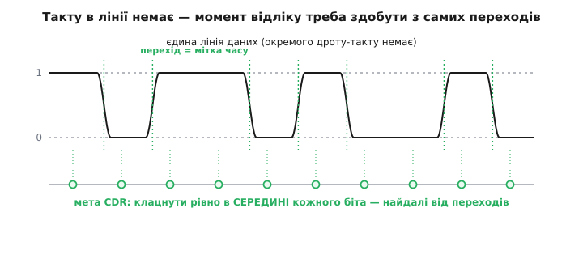
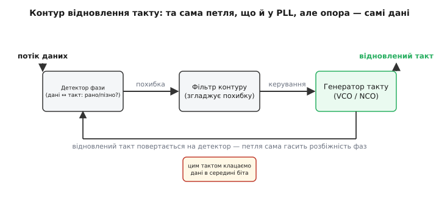
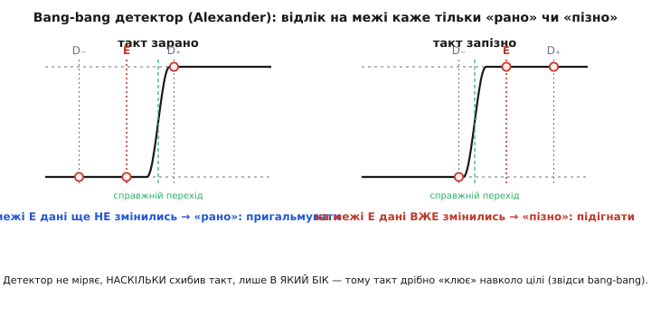
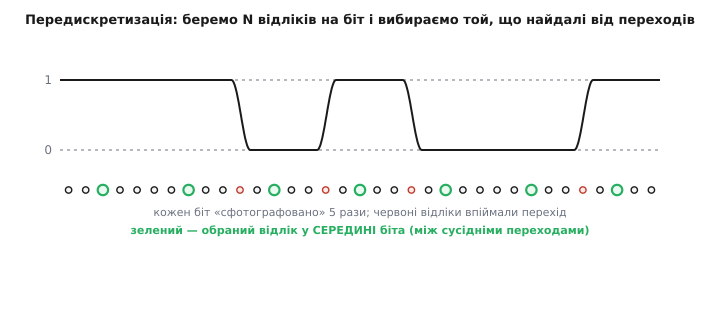
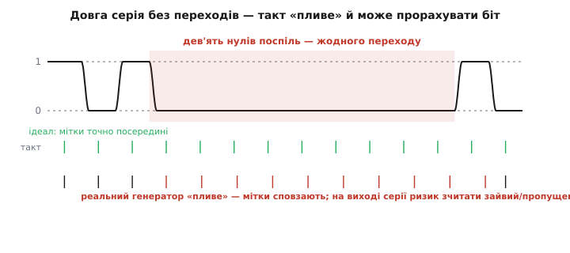

# Відновлення такту з даних (CDR): як приймач сам знаходить, коли читати

Уявіть, що вам простягнули єдиний дріт, по якому шаленою чергою летять біти — мільярд за секунду, нескінченна стрічка нулів і одиниць. І одразу постає незручне питання: а **коли** їх читати? Цифровий приймач робить, по суті, одну-єдину річ — у певну **мить** дивиться на напругу лінії й вирішує, 0 це чи 1. Але щоб рішення було правильним, ту мить треба поставити рівно в **середину** біта, де сигнал уже вклався й найчистіший. Промахнешся — і клацнеш на похилому фронті, де рівень непевний, або взагалі зловиш сусідній біт. Питання «коли читати» тут головніше за питання «що читати».

Найпростіша відповідь — «а нехай передавач пришле нам ще й такт окремим дротом» — на високих швидкостях **не працює**, і за мить стане ясно чому. Тож приймач змушений викрутитися інакше: **сам** здогадатися, де межі бітів, дивлячись **лише на самі дані** — на моменти, коли лінія перемикається з 0 на 1 і назад. Цей фокус зветься **відновленням такту з даних** *(англ. clock and data recovery, CDR — «відновлення такту й даних»)*. Розберімо, **чому** без нього не обійтися, **як** із голого потоку бітів народжується рівний такт і які пастки на цьому шляху підстерігають.

## Чому окремого такту немає

Почнімо з болю, бо без нього ідея CDR висить у повітрі. Здавалося б, найчесніше — вести поряд із даними другий дріт із тактом: смикнув його фронтом — приймач клацнув. Так десятиліттями й робили на повільних шинах. Але щойно піднімаєш частоту, вилазить халепа.

Даних дріт і такту дріт — **різні** фізичні лінії: трохи інша довжина, інша ємність, інше оточення. Сигнал по кожному біжить із трохи іншою затримкою, і між ними накопичується розбіжність у часі — **перекіс** *(англ. skew)*. Поки біт живе 100 нс, пара сотень пікосекунд перекосу — дрібниця. Але зроби біт завдовжки 200 пс — і той самий перекіс уже **ширший за сам біт**: у мить, коли такт каже «читай», дані ще не той біт показують. Ми не позбулися проблеми синхронізації, а лише переклали її з «коли клацнути» на «наскільки такт розійшовся з даними» — і на гігабітних швидкостях це така сама стіна.

Додайте практику: окремий такт — це зайвий вивід корпусу, зайва доріжка, зайвий контакт роз'єму, кожен з яких коштує площі кристала й грошей. Тому в справжніх швидких лініях — USB, SATA, PCI Express, гігабітному Ethernet — окремого такту **не передають узагалі**. І приймач опиняється сам на сам із потоком, у якому мусить якось намацати ритм.

> 🔧 **Навіщо це.** Саме тому майже всі швидкі інтерфейси навколо вас — послідовні, без окремого тактового дроту. Коли інженер каже «лінк не піднявся», перше, що він перевіряє, — чи схопився CDR: чи знайшов приймач ритм у даних. Не розуміючи цього блоку, неможливо ні спроєктувати швидкий канал, ні полагодити його, коли він «інколи сиплеться». Це серце будь-якого [SerDes](topic:com-modulation/serdes) — вузла, що жене цілу шину по одній ниточці.

## Переходи — це мітки часу

Тепер сама ідея, і вона напрочуд гарна. Погляньте на потік даних не як на значення, а як на **послідовність подій у часі**. Щоразу, коли лінія перемикається — з 0 на 1 чи з 1 на 0, — це стається в **точно визначену** мить: на межі між двома сусідніми бітами. Кожен перехід — це, по суті, **безкоштовна мітка часу**, яку передавач мимоволі поставив у сигнал. Він не збирався слати нам такт — але кожним своїм перемиканням він каже: «ось тут проходить межа біта».

А якщо ми знаємо, де межі, то знаємо й **середини** — вони рівно посередині між сусідніми межами. Ось і вся стратегія CDR: зачепитися за переходи, з них вирахувати, де межі бітів, і поставити мить відліку в **середину** кожного інтервалу — якнайдалі від країв, де сигнал перемикається й непевний.


*По єдиній лінії даних окремого такту немає. Кожен перехід сигналу (зелені риски) — це мітка часу: він стається точно на межі біта. Знаючи межі, приймач ставить мить відліку (зелені кружки) у середину кожного біта — найдалі від переходів, де сигнал найчистіший.*

Тут ховається перша тонкість, з якої виросте половина всіх складнощів. Переходи трапляються **не на кожній межі**: якщо йдуть два однакові біти поспіль (1→1 чи 0→0), лінія стоїть на місці й мітки в цю мить **немає**. Тобто мітки приходять нерегулярно, з випадковими прогалинами. Приймач не може просто «крокувати від переходу до переходу» — між рідкими мітками він мусить сам **вести ритм**, а мітками лише **звіряти й підправляти** його. І це вже не одноразова дія, а безперервна робота кола зі зворотним зв'язком.

## Петля, що ловить ритм

Як змусити власний генератор іти **в ногу** з чужими, нерегулярно розкиданими мітками? Тією самою елегантною петлею, на якій тримається [фазове автопідстроювання частоти (PLL)](topic:hw-analog/phase-locked-loop): три блоки, замкнені в кільце зворотного зв'язку. У CDR це кільце заточене під одну мету — щоб фронти власного такту влучали в середину бітів даних.

Ідея PLL коротко: **фазовий детектор** порівнює свій генератор з опорним сигналом і видає напругу похибки, тим більшу, чим далі вони розійшлися; **фільтр контуру** згладжує цю смикану похибку в плавну керівну напругу; **керований генератор** підкручує від неї свою частоту, аж поки не піде в ногу з опорою. Вихід генератора повертається на детектор — і петля сама гасить будь-яке розузгодження.

CDR — це PLL, у якого **опора — самі дані**. Різниця одна, але принципова: звичайний PLL порівнює свій генератор із чистим безперервним опорним сигналом, а детектор CDR мусить дивитися на **рвані переходи даних**, яких на багатьох межах просто немає. Тому фазовий детектор тут особливий: він спрацьовує **лише коли в даних є перехід**, а на однакових бітах мовчить і не смикає петлю. Між переходами генератор іде за інерцією на останній набраній частоті — тому фільтр роблять досить повільним, щоб коло не «забувало» ритм за час прогалини.


*Та сама петля, що й у PLL, але опора — потік даних. Детектор фази питає «мій такт відносно переходів даних — рано чи пізно?», фільтр згладжує похибку, генератор підправляє частоту. Відновлений такт повертається на детектор і водночас клацає дані в середині біта.*

Коли петля **зловила ритм** (кажуть — *захопилася*, англ. *locked*), фронти генератора стоять рівно в серединах бітів. Тепер той самий відновлений такт роблять робочим: ним клацають дані — і на виході маємо і **чистий такт**, і **правильно зчитані біти**. Звідси й повна назва: *clock and data recovery* — відновлюємо разом і те, і те.

> 🔧 **Навіщо це.** У довіднику будь-якого швидкого приймача є параметр «час захоплення CDR» — скільки треба, щоб петля зловила ритм після старту лінку. Поки не захопилась — дані читати не можна, вони підуть сміттям. Тому протоколи на початку передачі шлють спеціальну *преамбулу* — довгу серію переходів (наприклад, суцільні `0101…`), щоб дати CDR щонайгустіші мітки й дозволити швидко схопитися. Розуміння цього одразу пояснює, навіщо лінк «прогрівається» перед першими корисними даними.

## Рано чи пізно: як детектор судить фазу

Придивімося до серця петлі — **фазового детектора**. Йому треба на кожному переході даних вирішити: мій такт клацає **раніше** чи **пізніше**, ніж треба? Є два різні способи це зробити, і вони задають два великі класи CDR.

Найпростіший і найпоширеніший — **bang-bang** *(англ. «туди-сюди», за аналогією з релейним керуванням, що кидає систему то в один бік, то в інший)*. Ідея гранично економна: не мірятимемо, **наскільки** такт схибив, лише **в який бік**. Для цього беруть додатковий відлік на самій **межі** біта — там, де очікується перехід. Логіка проста до краси. Якщо в цю мить дані **ще не змінились** (на межі те саме значення, що й у щойно прочитаному біті), значить, справжній перехід іще попереду — наш такт **зарано**, треба пригальмувати. Якщо дані **вже змінились** — перехід уже проскочив, такт **запізно**, треба підігнати.


*Bang-bang (детектор Александера). Ліворуч: на межовому відліку E дані ще старі — справжній перехід попереду, отже, такт зарано, пригальмувати. Праворуч: на E дані вже нові — перехід проскочив, такт запізно, підігнати. Детектор каже лише напрям похибки, не її величину.*

Цей детектор — з трьома відліками на біт (два в серединах сусідніх бітів і один на межі) — придумав 1975 року інженер [Александер](topic:com-modulation/clock-data-recovery/hist-cdr-lineage.md), і його досі так і звуть **детектором Александера**. Через грубість «лише напрям» такий CDR ніколи не стоїть точно на цілі — він увесь час дрібно **клює** навколо неї: то трохи вперед, то трохи назад. Це залишкове тремтіння звуть *bang-bang джитером*; його роблять малим, щедро сповільнюючи петлю.

Другий спосіб — **лінійний** детектор: він видає похибку, **пропорційну** тому, наскільки такт схибив, — не просто «пізно», а «пізно ось настільки». Такий CDR може стати рівно на ціль, без вічного клювання, і дає чистіший такт. Платиться за це складнішою схемою, і працює вона поки сигнал іще досить чистий, щоб «наскільки» мало сенс. Класичний лінійний детектор для оптичних ліній запропонував [Хоґґ](topic:com-modulation/clock-data-recovery/hist-cdr-lineage.md) 1985 року. Груба, але невибаглива й швидка bang-bang проти точнішого, але вимогливого лінійного — це основний вибір у проєктуванні CDR.

## Цифровий шлях: передискретизація й вибір фази

Досі ми крутили частоту **аналогового** генератора напругою. Але той самий ритм можна впіймати геть інакше — **чистим обробленням** відліків, майже без аналогової петлі. Цей шлях особливо любить сучасна цифрова техніка й програмовані мікросхеми, бо він увесь складається з логіки, яку легко перенести з чипа на чип.

Ідея така. Замість підлаштовувати один генератор під дані, візьмімо **швидкий незалежний такт** — у кілька разів швидший за біти — і ним **багато разів «сфотографуймо»** кожен біт. Це **передискретизація** *(англ. oversampling — «надлишкова дискретизація»)*: скажімо, п'ять відліків на кожен біт замість одного. Тепер біт у нас не одне значення, а рядок із п'яти. І тут відбувається головне: **переходи видно по тому, де сусідні відліки різні**. Знайшовши, де сидять переходи, ми знаємо, де межі бітів, — а отже, який із п'яти відліків **найдальший від країв**, тобто в середині біта. Його й беремо за справжнє значення біта.


*Замість підстроювати генератор — беремо швидший такт і фотографуємо кожен біт кілька разів (тут 5). Червоні відліки впіймали перехід (сусіди різні), отже, там межа. Зелений — обраний відлік у середині біта, найдалі від переходів: його значення і є біт.*

Цей вибір «беру відлік, найдальший від переходів» звуть **вибором фази** *(англ. phase picking)*. Є й простіший родич — **голосування більшістю** *(англ. majority voting)*: узяти всі п'ять відліків біта й повірити тому значенню, за яке їх більше (три з п'яти). Голосування простіше, зате вибір фази стійкіший до тремтіння. Обидва — суто арифметика над відліками, без жодного крученого генератора.

Найкорисніше в цьому підході — що весь «мозок» CDR стає звичайним **алгоритмом**, який можна написати кодом. Ось ядро вибору фази для одного біта, знятого за `OS` відліків: знаходимо, де стрибає значення (це переходи), і беремо відлік якнайдалі від найближчого переходу.

:::tabs
```cpp
// Передискретизований біт: OS відліків рівня (0/1) у масиві s[0..OS-1].
// Повертаємо значення біта, взяте в найбезпечнішому відліку — найдалі від переходу.
#include <cstdint>
#include <array>

constexpr int OS = 5;

std::uint8_t recover_bit(const std::array<std::uint8_t, OS>& s)
{
    // Крок 1: знайти найближчий перехід (місце, де сусідні відліки різні).
    // Крок 2: обрати відлік, максимально віддалений від будь-якого переходу.
    int best_idx  = OS / 2;   // за замовчуванням — центр
    int best_dist = -1;

    for (int i = 0; i < OS; i++) {
        // відстань від i до найближчого переходу в цьому вікні
        int dist = OS;                       // якщо переходів нема — «нескінченно» далеко
        for (int j = 0; j + 1 < OS; j++) {
            if (s[j] != s[j + 1]) {          // між j та j+1 є перехід (межа ~ j+0.5)
                int d = (i <= j) ? (j - i) : (i - (j + 1));
                if (d < dist) dist = d;      // тримаємо найближчий перехід
            }
        }
        if (dist > best_dist) {              // цей відлік безпечніший — далі від країв
            best_dist = dist;
            best_idx  = i;
        }
    }
    return s[best_idx];                       // значення в середині біта
}
```
```python
# Передискретизований біт: OS відліків рівня (0/1) у списку s[0..OS-1].
# Повертаємо значення біта, взяте в найбезпечнішому відліку — найдалі від переходу.
OS = 5

def recover_bit(s):
    # Крок 1: знайти найближчий перехід (місце, де сусідні відліки різні).
    # Крок 2: обрати відлік, максимально віддалений від будь-якого переходу.
    best_idx  = OS // 2   # за замовчуванням — центр
    best_dist = -1

    for i in range(OS):
        # відстань від i до найближчого переходу в цьому вікні
        dist = OS                        # якщо переходів нема — «нескінченно» далеко
        for j in range(OS - 1):
            if s[j] != s[j + 1]:         # між j та j+1 є перехід (межа ~ j+0.5)
                d = (j - i) if i <= j else (i - (j + 1))
                if d < dist:
                    dist = d             # тримаємо найближчий перехід
        if dist > best_dist:             # цей відлік безпечніший — далі від країв
            best_dist = dist
            best_idx  = i

    return s[best_idx]                    # значення в середині біта
```
:::

Тут видно всю суть цифрового CDR без жодного осцилографа: переходи знаходять **порівнянням сусідніх відліків**, а біт беруть **там, де найспокійніше**. У справжньому швидкому чипі це роблять апаратно й на льоту, але логіка — рівно ця. І оскільки все зводиться до перебору відліків, такий CDR *захоплюється майже миттєво*: йому не треба чекати, поки петля «втягнеться», — він щомиті наново дивиться, де переходи.

## Довгі серії: коли зачепитися нема за що

Тепер найважча пастка, спільна для **всіх** видів CDR, хоч аналогових, хоч цифрових. Уся стратегія трималася на переходах — мітках часу. А що, як переходів **довго немає**?

Уявіть у потоці довгий ряд однакових бітів: сто нулів поспіль. Лінія стоїть колом, жодного перемикання — приймачеві нема за що зачепитися. Аналогова петля весь цей час іде за інерцією на останній частоті, а вона трохи неточна; цифровий вибір фази теж не бачить переходів і не може оновити оцінку. Генератор поволі **пливе** — його фаза сповзає вбік. І що довша німа ділянка, то далі сповзе: на якомусь біті мить відліку виїде на самий край, а там уже недалеко й до біди — зчитати зайвий нуль або пропустити справжній, зсунувши весь дальший потік.


*Поки в даних є переходи, такт тримається (ідеал — зелені мітки). Але на довгій серії нулів переходів немає: реальний генератор пливе, і мітки такту (червоні) поступово сповзають відносно бітів. На виході серії зсув такий, що приймач може зчитати зайвий або пропущений біт.*

Ось чому в реальних лініях дані **навмисне готують** так, щоб довгих німих ділянок не було. Найпоширеніший спосіб — [лінійне кодування](topic:com-modulation/line-coding): перед передачею байти перекодовують кодом (класика — 8b/10b від IBM), який **гарантує** переходи не рідше певної межі — скажімо, ніколи не більш ніж п'ять однакових бітів поспіль. Тоді CDR завжди має свіжу мітку часу, а генератор просто не встигає відпливти. Скільки саме однакових бітів поспіль лінія терпить, перш ніж такт відпливе за поріг помилки, — це і є **допуск до джитеру** *(англ. jitter tolerance)*, одна з ключових цифр у довіднику приймача.

**Скільки нулів поспіль витримає CDR?** Хай генератор приймача точний до 0.1 % (він на 0.001 швидший чи повільніший за передавач). За кожен біт його фаза відпливає на 0.001 UI. Приймач ще читає правильно, поки набіг фази менший за півбіта (0.5 UI). Скільки однакових бітів поспіль він переживе без переходу?

```
похибка частоти = 0.1 % = 0.001 (частка від номіналу)
набіг фази за біт = 0.001 UI
допустимий набіг  = 0.5 UI  (далі мить відліку виїде за середину)

N = 0.5 UI / 0.001 UI на біт = 500 бітів
```

Тобто навіть добрий генератор із похибкою 0.1 % «пливе» за півбіта вже після **500** однакових бітів без переходу. Тому й потрібне кодування, що не пускає серії довші за жменю бітів: воно тримає набіг фази мізерним, і 0.1 % похибки генератора стають нешкідливими. Зробіть генератор удесятеро точнішим (0.01 %) — витримає 5000 бітів; але покладатися на це замість густих переходів ніхто не стане, бо один довгий «мовчазний» пакет усе одно завалив би лінк.

## Зібравши докупи

Відновлення такту з даних виростає з єдиної незручної правди швидких ліній: окремий тактовий дріт на високій частоті страждає від перекосу не менше за самі дані, тож його **не ведуть** — і приймач мусить сам намацати ритм. Порятунок у тому, що кожен **перехід** сигналу — це безкоштовна мітка часу на межі біта; зачепившись за ці мітки, приймач вираховує середини бітів і читає їх у найчистіший момент.

Робить це петля зі зворотним зв'язком — той самий [PLL](topic:hw-analog/phase-locked-loop), лише з даними замість чистої опори: фазовий детектор судить на кожному переході, чи такт **рано** чи **пізно**, фільтр згладжує похибку, генератор підкручує частоту, аж поки фронти не стануть у середини бітів. Детектор буває грубий **bang-bang** (лише напрям похибки, вічно клює біля цілі) або точніший **лінійний** (величина похибки, стає рівно на ціль). А цілком **цифровий** шлях обходиться без крученого генератора: [передискретизує](topic:hw-analog/oversampling-decimation) біт у кілька відліків і чистим алгоритмом — вибором фази чи голосуванням — бере значення в середині біта.

Спільна ахіллесова п'ята всіх CDR — **довгі серії однакових бітів**: без переходів генератор пливе й зрештою прораховує біт. Тому дані наперед готують [лінійним кодуванням](topic:com-modulation/line-coding), що гарантує густі переходи. Здоров'я всієї цієї роботи інженер читає однією картинкою — [діаграмою ока](topic:hw-pcb/eye-diagram): широко розкрите око означає, що CDR має щедрий запас і за напругою, і за часом. Одна ниточка, що впевнено несе цілу шину без жодного окремого такту, тримається саме на цьому тихому фокусі — приймач сам знаходить, коли читати.

> 📜 **Звідки взялося.** Задача «відновити ритм із самого сигналу» старша за цифрову електроніку — вона постала ще з телеграфу й перших систем імпульсно-кодової модуляції, а строгі схемні розв'язки з'явилися з телефонними цифровими магістралями 1960-х. Ключові детектори фази для CDR — грубий bang-bang (Александер, 1975) і точний лінійний (Хоґґ, 1985) — оформилися вже під оптичні лінії. Хто і як пройшов цей шлях від телеграфних спотворень до гігабітних SerDes — в [історичній вставці](topic:com-modulation/clock-data-recovery/hist-cdr-lineage.md).
