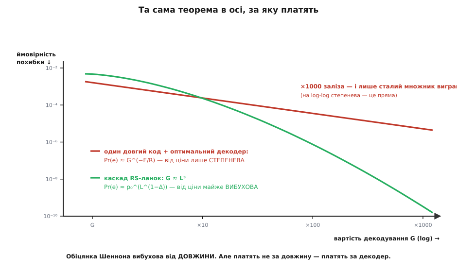
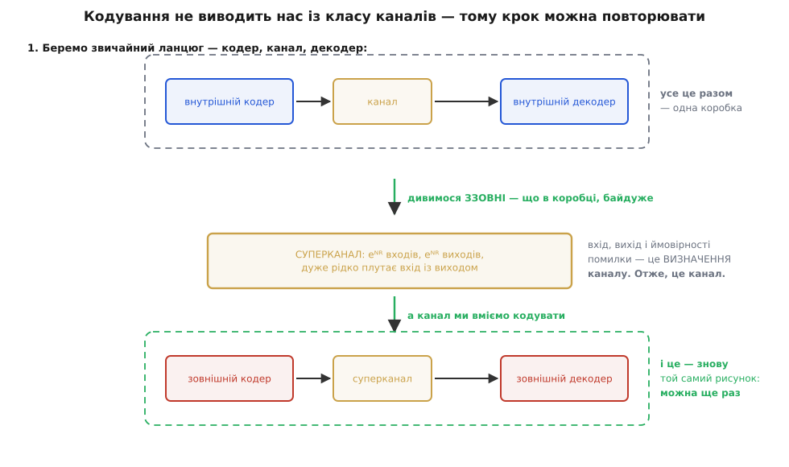

# 📜 Ціна замість довжини: як народилися конкатеновані коди

Дисертація, з якої пішли каскадні коди, починається зі скарги. Форні відкриває свій звіт зауваженням, що від оголошення теореми кодування минуло майже двадцять років; обіцянка була велика — похибка, вибухово мала з довжиною блока, на будь-якій швидкості нижче пропускної здатності, — а знайти спосіб утілити бодай **помірно** довгий код виявилося куди важче, ніж гадалося попервах.

Спиніться на слові «помірно». 1965 рік — це не «ми не дотягли до ідеалу». Це «ми не збудували навіть середнього».

Причину зазвичай називають одним рухом: довгий код нема як декодувати, перебирати 2ᵏ слів неможливо. Це правда — і це скарга, а не діагноз. Скарга не каже, що робити. Форні почав із того, що надав труднощі точної форми, і щойно форма проступила, з неї сам собою випав вихід.

## Пастка в тій осі, за яку платять

Теорема кодування пов'язує три величини: швидкість R, довжину N і ймовірність похибки. Форні зауважує просту річ: інженерові потрібна **не ця трійка**. Інженерові потрібні швидкість, похибка й **складність** — бо рахунок йому виставляють за декодер, а не за довжину. Довжина дістається задарма; коштує обробка.

Тож зробімо те, чого в теоремі не роблять: виключимо N.

```
теорема кодування:        Pr(e) ≤ e^(−N·E(R))        E(R) > 0 за будь-якої R < C

декодування за максимумом
вірогідності — перебір
всіх кодових слів:        G ≈ e^(N·R)                G — вартість декодування

виразимо довжину з ціни:  N = (ln G) / R

підставимо в теорему:     Pr(e) ≤ e^(−((ln G)/R)·E(R))
                                = G^(−E(R)/R)
```

Подивіться, що сталося з обіцянкою. Вибухова експонента Шеннона в осі ціни виявилася **степеневою**. Похибка спадає не як експонента від грошей, а як гроші у сталому від'ємному степені — а це геть інший курс обміну.

**Умова.** Порахуймо той курс на числах. Візьмімо для прикладу швидкість R = 0.5 і показник похибки E(R) = 0.1 (у натах) — величини цілком буденні.

```
Pr(e) ≤ G^(−E(R)/R) = G^(−0.1/0.5) = G^(−0.2)

подвоїли декодер, G → 2G:
  виграш = (2G)^(−0.2) / G^(−0.2) = 2^(−0.2) ≈ 0.87
  → похибка впала на 13 %. За вдвічі більше заліза.

збити похибку вдесятеро:
  (G′/G)^(−0.2) = 0.1  →  (G′/G)^(0.2) = 10
  G′/G = 10^(1/0.2) = 10⁵ = 100 000
```

**Висновок.** Один порядок надійності коштує **п'ять порядків** заліза. Ось чому сімнадцять років не дали довгого коду: обіцяна теоремою експонента, перерахована в рахунок за декодер, оберталася на курс, за яким надійності просто не докупишся.

Ось де насправді була пастка, і зовсім не там, де її звикли шукати. Річ не в тім, що декодувати «важко» — важко буває по-різному. Річ у тім, що теорема Шеннона вибухова у змінній, **за яку ніхто не платить**, і всього лише степенева в тій, за яку платять. Уся розкішна експонента з'їдалася на переході до осі, в якій живе інженер.


*Та сама теорема, перемальована в осі, за яку виставляють рахунок. Червона — один довгий код із оптимальним декодером: на log-log це пряма, тобто похибка від ціни лише степенева, і ×1000 заліза дають сталий множник. Зелена — каскад: на малому бюджеті він **гірший** за оптимальний декодер (він-бо свідомо неоптимальний), зате від ціни падає майже вибухово й переганяє його. Уся угода — саме в цьому перетині: віддати трохи якості там, де її однаково не купиш, щоб виграти порядки там, де платиш.*

> 🔧 **Навіщо це.** Хід Форні варто взяти на озброєння окремо від кодів: **коли задача роками не піддається, спершу перевір, чи не міряєш ти її не в тій змінній.** Він не знайшов кращого коду й не винайшов хитрішої алгебри — він переписав чужу теорему в координатах, за якими виставляють рахунок. І щойно це зроблено, питання «як знайти добрий код» перетворилося на цілком інше, з очевидною відповіддю: як зробити, щоб **ціна росла повільніше за довжину**? А для цього довгий код не можна декодувати як одну річ — його треба розібрати на ланки.

## Коридор, у якому це питали

Джордж Дейвід Форні-молодший (*G. David Forney, Jr.*, нар. 6 березня 1940) прийшов у Массачусетський технологічний інститут із Принстона, де 1961 року здобув бакалаврський ступінь; магістерський у МТІ — 1963-го. Дисертацію він подав на кафедру електротехніки **31 березня 1965 року**, рукопис звіту прийняли 2 квітня, а сам звіт — Technical Report 440 Дослідної лабораторії електроніки (RLE) — датований **1 грудня 1965 року**. Ступінь — доктор наук (*Doctor of Science*). Монографія вийшла в MIT Press 1966-го: дослідна монографія № 37.

Звідси дрібна поправка, варта того, щоб її зробити. У підручниках зазвичай стоїть «Форні, 1966», а подеколи й «задумав конкатеновані коди 1966 року». 1966-й — це рік **книжки**. Робота зроблена 1964–65-го, захищена навесні 1965-го, надрукована як звіт наприкінці 1965-го. Статус: **усталено за первинним джерелом** — і титул звіту, і рядок про подання дисертації стоять на третій сторінці самого TR 440.

Тепер про наукове керівництво, бо тут ходить помилка. Трапляється твердження, що дисертацію про конкатеновані коди Форні робив «під керівництвом Клода Шеннона». Первинне джерело каже інакше, і каже прямо. На сторінці подяки TR 440 Форні дякує середовищу групи Processing and Transmission of Information у RLE й далі називає: "particularly my advisers, Professor John M. Wozencraft and Professor Robert G. Gallager". Отже, керівники — **Джон (Джек) Возенкрафт** (*John M. Wozencraft*) і **Роберт Галлагер** (*Robert G. Gallager*); Роберта Кеннеді (*Robert S. Kennedy*) названо уважним читачем роботи.

Шеннон у тій подяці теж є — але в іншій ролі. За словами самого Форні, до теорії інформації для докторської роботи його повернув **провокативний семінар** Клода Шеннона, а найперший інтерес до цієї галузі збудив, найпевніше, захопливий курс термодинаміки Джона Арчибальда Вілера (*John A. Wheeler*) — фізика, що викладав у Принстоні, де Форні й здобув бакалаврський ступінь. Статус: **усталено** — це свідчення автора у власній роботі. Тобто Шеннон тут — той, хто заманив, а не той, хто керував.

Різниця не церемоніальна. Керівниками були двоє людей, чиї власні праці — послідовне декодування (Возенкрафт) і коди розрідженої перевірки паритету (Галлагер) — б'ють рівно в те саме питання ціни. Форні сидів у кімнаті, де про вартість декодування думали всі.

## Суперканал: чому «зчепити два коди» — не трюк

Наївний переказ конкатенації — «постав два коди один за одним» — правдивий і водночас пропускає все цікаве. З нього не видно ні чому це працює, ні чому цю дію можна повторювати. Справжній хід записано в §1.2 звіту, і він абстрактний.

Візьмімо кодер, канал і декодер. Погляньмо на цей ланцюг **ззовні**, не питаючи, що всередині. Що ми бачимо? На вході — eᴺᴿ можливих кодових слів. На виході — eᴺᴿ можливих здогадів декодера. Між ними — матриця ймовірностей переходу, в якій імовірність дістати вихід, що відповідає правильному входу, висока. Але вхід, вихід і матриця ймовірностей переходу — це і є **визначення каналу**. Отже, кодер разом із каналом і декодером — **це знову канал**. Форні назвав його **суперканалом** (*superchannel*). Ба більше: якщо початковий канал без пам'яті, а код не міняється від блока до блока, то й суперканал виходить без пам'яті — тобто не просто канал, а канал того самого зручного ґатунку.

А канал ми вміємо кодувати. Тож збудуймо код для суперканалу — завдовжки n, зі швидкістю r, з алфавітом на eᴺᴿ символів. І тепер відкиньмо риштування: жодного суперканалу немає, є вихідний канал, а ми щойно збудували для нього код завдовжки nN зі швидкістю rR.


*Абстракція, з якої все виросло. Беремо звичайний ланцюг «кодер — канал — декодер» і дивимося на нього ззовні як на одну коробку: вхід, вихід, ймовірності помилки — а це і є визначення каналу. Отже, коробка — канал; Форні назвав його суперканалом. Далі кодуємо вже його — і дістаємо той самий рисунок, тільки поверхом вище. Саме тому конкатенація не двоповерхова споруда, а крок, що відтворює власну передумову.*

Ось у чому глибина, якої не видно в переказі «два коди стосом». Кодування **не виводить нас із класу каналів**. Це операція, яка з каналу робить канал, — а отже, її можна застосувати ще раз. І ще. Конкатенація — не конструкція з двох поверхів, а **нерухома точка**: крок, після якого світ має той самий вигляд, що й до нього. Тому головна теорема Форні формулюється не про два коди, а про **довільну кількість** ланок; інакше її просто не було б.

Із суперканалу, до речі, само собою випадає й наймення, на якому всі плутаються. Код, що стоїть упритул до сирого каналу, — **внутрішній**: він усередині суперканалу. Код, що працює вже з суперканалом як із даністю, — **зовнішній**: він зовні. Плутанина зникає, щойно згадаєш, відносно **чого** «всередині».

## Що саме довів Форні — і чого не довів

Резюме звіту називає **два** результати, і їх варто розрізняти, бо підручникова формула зазвичай зливає їх в один.

**Перший.** Конкатенація **довільно великої кількості** кодів дає ймовірність похибки, що спадає вибухово з повною довжиною блока, тоді як складність декодування росте лише **алгебрично** (сьогодні сказали б «поліномно»).

**Другий.** Конкатенація **скінченної** кількості кодів дає показник похибки **гірший** за досяжний одним ступенем — але **ненульовий на всіх швидкостях нижче пропускної здатності**.

Тобто джекпот — вибухова похибка за поліномну ціну — потребує необмеженої кількості ланок. А практичний каскад із двох ланок, той самий, що стоїть на компакт-диску й на «Вояджері», купує здійсненність **ціною гіршого показника**, ніж мав би ідеальний одинак. Форні цього не ховав: він поставив це другим пунктом резюме й повторив першим абзацом розділу V.

Конкретніше. Зчепивши довільно багато ланок кодів Рід–Соломона з належно дібраними параметрами над каналом без пам'яті, Форні обмежує похибку так:

```
Pr(e) ≤ p₀^(L^(1−Δ))       Δ > 0 — як завгодно мале, але додатне
                           L ∝ повній довжині блока

вартість декодера однієї RS-ланки завдовжки n:   ∝ n^b,  причому b ≈ 3
вартість декодера всього каскаду:                ∝ L^b

і це — на ВСІХ швидкостях, нижчих за пропускну здатність.
```

Тепер поверніться до курсу обміну. Ціна G ∝ L³, тобто L ∝ G^(1/3); підставте це в показник — і побачите, що похибка спадає від **ціни** майже вибухово. Пастка розчепилася. Не тому, що знайшовся кращий код, а тому, що ціна перестала рости вкупі з довжиною.

І тут варто назвати передумову, яку Форні виклав відкрито, бо в ній уся інженерія. Він заявив прямо: ми, може, й не проти взяти код у десять–сто разів довший, ніж доводить достатнім теорема кодування, — якщо тільки в підсумку дістанемо код, який **можна збудувати**. А далі — вже кредо: ідея та сама, що в проєктуванні будь-якої великої системи — розбити її на підсистеми посильного розміру й з'єднати так, щоб вони робили роботу цілого; така система буде **гіршою** за спроєктовану одним шматком, але **доки неоптимальності не калічать**, саме сегментований підхід і є інженерним розв'язком.

Перечитайте це речення й зверніть увагу, що в ньому немає слова «код». 1965 року в дисертації з теорії інформації записано загальне правило будування систем — а конкатеновані коди є лише першим його застосуванням.

## Хто був поруч: Елаяс і Зів

Тепер про першість — тут потрібна чесна бухгалтерія, і найкращий свідок у ній сам Форні: обидва потрібні імені стоять у списку літератури TR 440.

**Пітер Елаяс** (*Peter Elias*), «Error-Free Coding», *IRE Transactions*, PGIT-4, с. 29, 1954 — позиція 36 у списку. Ідея будувати довгий код із коротких старша за Форні на одинадцять років: ітеруючи добуток кодів, Елаяс дістав як завгодно малу похибку на **ненульовій** швидкості. Форні віддає цьому належне точно й безжально: це єдина суто алгебрична схема, відома на той час, що досягає як завгодно низької похибки на скінченній швидкості, — **але швидкість ця низька**. Ось де щілина, в яку він зайшов: не «зробити довге з коротких» (це вміли), а зробити так, щоб воно працювало **на всіх швидкостях аж до пропускної здатності**.

**Джейкоб Зів** (*Jacob Ziv*; нар. 27 листопада 1931 у Тіверіаді — тоді підмандатна Палестина, нині Ізраїль; той самий Зів, чиє ім'я стоїть у стисканні Лемпеля–Зіва; доктор наук МТІ, 1962) — позиція 37, і виглядає вона так: «Private communication, 1964 (unpublished paper)». Приватне повідомлення. Неопублікована праця. А ось що Форні пише про неї в розділі V зі своїми головними результатами: Зів **показав**, що триступеневим конкатенованим кодом над каналом без пам'яті можна дістати обмежену ймовірність похибки за кількості обчислень, пропорційної Lᵃ, і його результат **чинний на всіх швидкостях, менших за пропускну здатність каналу** — щоправда, коли R прямує до C, показник a прямує до нескінченності.

Спиніться на цьому. Суть — конкатенація дає поліномну ціну на **всіх** швидкостях нижче пропускної здатності — була в Зіва **до** Форні. Неопублікована, на трьох ланках замість довільної кількості, з показником, що розвалюється біля межі, — але була. І знаємо ми про це рівно тому, що Форні надрукував це сам, у власній дисертації, поруч із власним результатом.

Тож чесний підсумок, із розрізненням ідеї, теорії та реалізації:

- **Ідея «довге з коротких»** — Елаяс, 1954, надруковано. Статус: усталено.
- **Перший результат «на всіх швидкостях нижче пропускної здатності»** — Зів, 1964, неопубліковано; засвідчено Форні в TR 440. Статус: усталено **як свідчення**; самої праці в друці немає.
- **Загальна теорія** — суперканал як абстракція, довільна кількість ланок, точна бухгалтерія «похибка проти ціни», уся машинерія Рід–Соломона до неї й обчислювальна перевірка на моделях — Форні, 1965. Статус: усталено.

Звична фраза «Форні винайшов конкатеновані коди» — це **стиснення**, а не міф. Вона правдива в тому, що конкатенація як теорія й як інженерний інструмент справді його робота; і хибна в тому, що жодна з двох її головних складових не впала з неба на порожнє місце. Сам Форні одноосібної першості й не заявляв — він просто послався на попередників, як належить.

## Що ще лежало в тій самій дисертації

Робота зробила більше, ніж обіцяє її назва.

**Вона витягла коди Рід–Соломона.** [Коди Рід–Соломона](topic:com-modulation/reed-solomon) — символьний код, що рахує не окремі біти, а цілі символи над скінченним полем, і тому природно бере пакети зіпсованих бітів, — з'явилися 1960 року й кілька років лежали радше цікавинкою. Форні взяв їх зовнішнім кодом із **прагматичних** міркувань: як він пише, це єдині загальні недвійкові коди, які на той час знали, і до того ж їх порівняно легко втілити. А далі присвятив їм два розділи: подав їхню будову наново (і вивів із неї властивості всіх кодів БЧХ), визначив розподіл ваг, **розширив** алгоритм Ґоренстейна–Ціерлера так, щоб той виправляв **і стирання, і помилки** водночас, спростив його останній крок і розібрав втілення в залізі. Можна доводити, що для самих кодів Рід–Соломона ця дисертація зробила не менше, ніж для конкатенації: вона дала їм і теоретичну причину існувати (на зручному суперканалі вони дотягують до того, що обіцяє теорема кодування), і робочий декодер.

**Вона внесла м'яке рішення в алгебру.** Побічним плодом стало **узагальнене декодування за мінімальною відстанню** (*generalized minimum-distance decoding*, GMD) — Форні надрукував його окремою статтею в *IEEE Transactions on Information Theory*, т. IT-12, № 2, с. 125–131, у квітні 1966 року. Суть — внести в суто алгебричне декодування за мінімальною відстанню відомості про **надійність** прийнятих символів, тобто те, що приймач знає, а тверде рішення викидає. Сам Форні описав це як цікавий гібрид декодування й виявлення; GMD вважають першим прикладом алгоритму з м'яким рішенням. Найкумедніше — в огляді роботи він чесно попереджає, що далі у звіті це узагальнення **не використовується**. Інструмент викували й відклали; він знадобився значно пізніше.

**Вона наперед описала схему «Вояджера».** У §1.5, на пів сторінки, Форні зауважує: принципи конкатенації стосуються будь-яких кодів, не лише блокових. Наприклад, простий згортковий код із пороговим декодуванням добре вигрібає розкидані випадкові помилки, але коли помилки в каналі збиваються надто щільно, декодер **збивається з ноги** й, доки не відновить синхронізм, наробить купу помилок підряд. А **ззовні** такий ланцюг має вигляд ідеального пакетного каналу — для пакетних же каналів відомі дуже добрі коди, і їх можна поставити зовнішніми. І одразу по тому: далі розглядаємо тільки блокові коди.

Це написано 1965 року. Рівно ця схема — згортковий код усередині, символьний зовнішній — стане стандартом NASA й полетить на «Вояджері» 1977-го. Форні описав її в одному абзаці, позначив як очевидне застосування й пішов далі. Там-таки, у §1.4, він завважує, що конкатенація успадковує стійкість до пакетів від перемежування (тодішнім словом — *interlacing*), і додає з обережністю вченого: через брак добрих моделей реальних каналів із пам'яттю аналізувати цю стійкість важко, але можна сподіватися, що в реальних застосуваннях вона стане в пригоді. Через два десятиліття на цій «надії» гратиме кожен компакт-диск у світі.

## Дірка, яку залатав Юстесен

Одна річ у теоремі лишалася незручною. Каскад Форні потребує **доброго внутрішнього коду** — а звідки його взяти? З вичерпного перебору коротких кодів: коротких кодів мало, перебрати можна, на практиці це не біда. Але конструкція від цього **не стає явною**: теорема каже, що добрий внутрішній код існує і його можна знайти пошуком, а не пред'являє його.

Дірку закрив данець **Йорн Юстесен** (*Jørn Justesen*) 1972 року статтею «A class of constructive asymptotically good algebraic codes» (*IEEE Trans. Inform. Theory*, т. 18, № 5, с. 652–656). Хід гарний: замість одного внутрішнього коду, який ще треба знайти, беремо цілий **ансамбль** внутрішніх кодів — і кодуємо кожен символ зовнішнього коду **своїм**. Тоді шукати нічого: досить, щоб добрих кодів в ансамблі була більшість. Так з'явилися перші **явні** асимптотично добрі коди.

І в цьому є доречна іронія: ансамбль, яким скористався Юстесен, — це **ансамбль Возенкрафта**. Того самого Джека Возенкрафта, що керував дисертацією Форні. Прогалину в теоремі учня залатали конструкцією його ж керівника.

## Дві відповіді з одного коридору

Відступімо на крок і подивімося на групу, в якій це відбувалося.

Дисертацію Галлагера про [LDPC](topic:com-modulation/ldpc) — коди розрідженої перевірки паритету, де кожна перевірка торкається лише кількох бітів, — керував Пітер Елаяс, і мотив, як згодом опишуть це Костелло й Форні, був **той самий**: знайти клас «схожих на випадкові» кодів, які можна декодувати біля пропускної здатності за посильну ціну. Дисертацією Форні керували Галлагер і Возенкрафт — і питання було те саме. Один коридор, одне питання, **дві відповіді**.

Відповідь Галлагера (1960; монографія MIT Press 1963) була, як тепер видно, ближчою до істини — і невчасною: на залізі 1960-х її ітеративний декодер не бігав. Вона проспала тридцять років. Відповідь Форні була свідомо **неоптимальною** — і будувалася на тодішньому залізі. Вона пішла в роботу негайно й тримала фах три десятиліття: «Вояджер», компакт-диск, супутникове мовлення.

Кінець цієї історії відомий і чудово римується. 1993 року турбокоди (Клод Берру, Ален Главйо й Пунья Тітімайшима) увірвалися з тим, що виявилося **паралельною** конкатенацією двох згорткових кодів, — і слово прижилося настільки, що первісний каскад Форні довелося заднім числом перейменувати на **послідовний**. Революція назвалася в його термінах. А тоді турбо-шок розбудив LDPC, і сучасні стандарти повернулися… до каскаду: у DVB-S2 усередині стоїть LDPC, а зовні — алгебричний код, що замітає рідкий залишок після нього. Повну гонитву до межі Шеннона — сорок п'ять років, воркшоп «кодування померло», Женеву-93 і перевідкриття Галлагера — розгортає [окрема історія](topic:math-information/channel-coding-theorem/hist-approaching-the-limit.md): там про те, як фах ішов до стелі, тоді як тут — про те, як він навчився за неї платити.

Сам Форні пішов із МТІ в Codex Corporation — фірму, засновану, щоб утілювати коди Галлагера й Мессі. 1995 року він дістав премію Шеннона; свою Шеннонівську лекцію назвав «Performance and Complexity» — тобто тим самим питанням, з якого починав тридцять років перед тим. 2016-го дістав Медаль пошани IEEE.

## Що лишилося від тієї дисертації

Конкатенація давно перестала бути найкращим способом підійти до межі Шеннона: турбокоди й LDPC підійшли ближче. Але з роботи 1965 року вціліло дещо міцніше за конкретну конструкцію.

Вціліла **переміна осі**. Сімнадцять років фах тримав у руках теорему, в якій похибка вибухово спадає з **довжиною**, і не міг зрушити — бо рахунок виставляють не за довжину. Щойно ту саму теорему переписали в осі ціни, розкішна експонента збіліла до степеневої, і питання «як знайти добрий код» обернулося на зовсім інше, з очевидною відповіддю: як зробити, щоб ціна росла повільніше за довжину?

І вціліло **розуміння, чим є конкатенація**. Це не код. Це спосіб **платити**: узяти надто дорогу задачу й розкласти її на ланки, кожна з яких по кишені, свідомо погодившись, що сума ланок буде гірша за ідеал, якого однаково не купити. Форні сформулював це загально ще у вступі — і його ж власна історія показала, наскільки правило довговічніше за приклад. Коди відтоді змінилися всі. Спосіб платити — ні.
