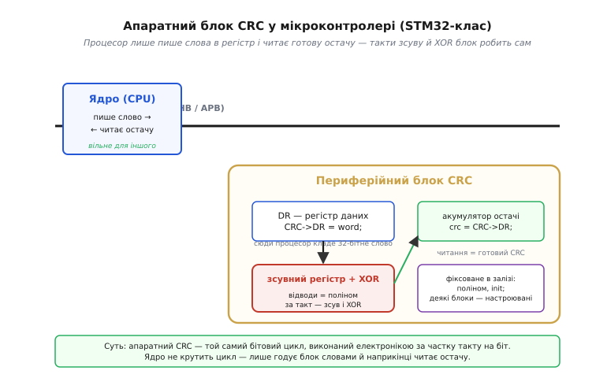
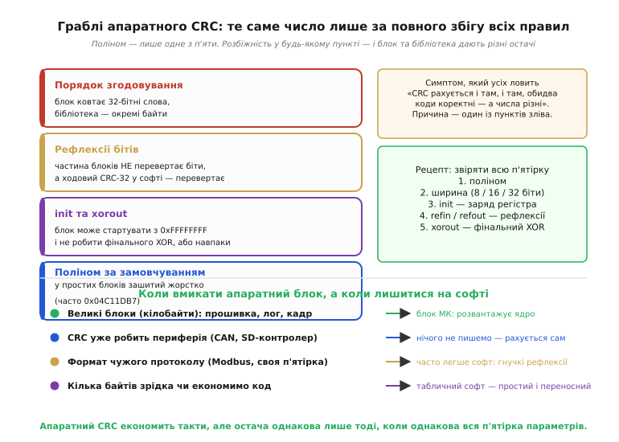
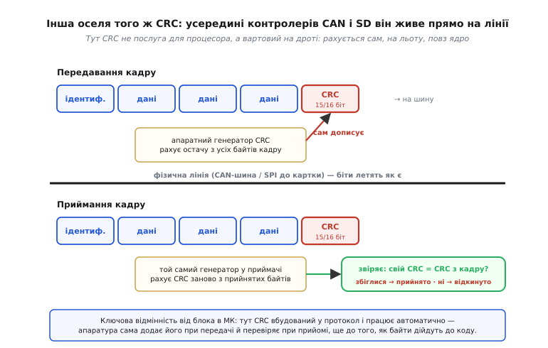

# 🔌 Апаратний CRC: блок у мікроконтролері й вартові всередині SD та CAN

> Це компонентна вставка про апаратний бік [CRC](topic:com-modulation/crc) — циклічного коду, де контрольне число є остачею від ділення повідомлення на многочлен. Сам цей короткий бітовий цикл легко зібрати програмно (як саме — у [реалізації CRC у коді](topic:com-modulation/crc/proj-crc-implementation.md)). Та коли блоки даних великі, а кадри летять тисячами на секунду, крутити цей цикл на процесорі стає шкода тактів. Тому той самий CRC дуже часто **зашитий у залізо** — і живе там у двох різних «оселях». Розберімо обидві.

### Дві оселі одного й того ж CRC

CRC у кремнії трапляється у двох ролях, і плутати їх — типова помилка. Перша — **окремий периферійний блок** у мікроконтролері, така собі «лічильна послуга»: процесор сам віддає йому дані й сам забирає готову остачу, коли захоче. Друга — **вартовий на дроті** всередині комунікаційного контролера (CAN, SD-картка, Ethernet): там CRC рахується автоматично, як частина протоколу, і ваш код про нього здебільшого навіть не згадує. Математика одна (те саме ділення [повідомлення на многочлен](topic:com-modulation/crc)), а от **хто й коли** її запускає — різне. Почнімо з першої оселі, бо вона ближча до коду.

### Перша оселя: периферійний блок CRC у мікроконтролері (STM32-клас)

У багатьох мікроконтролерів середнього класу — і насамперед у сімействі STM32 — є окремий **апаратний блок CRC** (*CRC calculation unit*). Це звичайна периферія: вона сидить на внутрішній шині й виглядає для процесора як **кілька регістрів** у [карті пам'яті](topic:hw-arch/memory-map) (регістри — це «вікна» в периферію). А всередині — той самий зсувний регістр зі зворотними зв'язками-відводами, що й у програмному CRC, тільки виконаний у залізі.

*Апаратний блок CRC сидить на шині МК як набір регістрів. Процесор кладе слово в регістр даних DR; усередині зсувний регістр із XOR-відводами (відводи задає поліном CRC) за кілька тактів проганяє його через ділення; остача накопичується й чекає на читання. Ядро не крутить бітовий цикл — воно лише годує блок і наприкінці читає результат.*

Працювати з ним напрочуд просто — вся робота зводиться до двох дій. Процесор **записує слова** (зазвичай 32-бітні, у деяких блоках — і байти) в регістр даних `DR`, одне за одним; після кожного запису блок сам проганяє слово через свій зсувний регістр. Коли всі слова заведено, процесор **читає той самий `DR`** — і дістає готову остачу. Жодного циклу по бітах у коді: усю чорну роботу [програмного циклу](topic:com-modulation/crc/proj-crc-implementation.md) тут зробила електроніка — ціле слово за лічені такти шини, і поки блок рахує, ядро вільне для іншого. На великих блоках (прошивка, довгий лог, кадр зображення) це відчутно швидше за софт.

### Граблі першої оселі: чому «правильний» CRC не сходиться з бібліотекою

І саме тут чекає найпідступніша пастка. Здавалося б, блок рахує CRC, бібліотека на іншому боці лінії рахує CRC — мали б вийти однакові числа. А вони не сходяться, хоча обидві сторони начебто роблять усе правильно. Причина в тому, що **поліном — лише один із [п'яти параметрів](topic:com-modulation/crc/proj-crc-implementation.md)**, що задають CRC, і апаратний блок фіксує решту чотири по-своєму.

*Те саме число виходить, лише коли збігається вся п'ятірка параметрів, а не сам поліном. Типові розбіжності: блок ковтає 32-бітні слова, а бібліотека — окремі байти; блок не перевертає біти, а ходовий CRC-32 у софті — перевертає; різні init та xorout; жорстко зашитий поліном за замовчуванням. Унизу — коли апаратний блок виправданий, а коли простіше лишитися на софті.*

Розбіжності, зібрані на рисунку, по суті чотири: блок ковтає дані **словами**, а бібліотека — окремими **байтами**; багато блоків **не перевертають** біти, тоді як ходовий програмний CRC-32 (той самий, що в ZIP і Ethernet) — перевертає; різняться **init** і фінальний **xorout**; а поліном за замовчуванням у простіших блоків зашитий жорстко (часто `0x04C11DB7`). Висновок простий: щоб два боки порозумілися, звіряти треба не поліном, а **всю п'ятірку** — поліном, ширину, init, рефлексії та xorout. Новіші блоки роблять частину цих параметрів настроюваними саме для того, щоб їх можна було підігнати під чужий формат.

### Друга оселя: CRC, вбудований у комунікаційний контролер

Тепер до другої ролі — і вона геть інша за духом. Якщо блок у мікроконтролері чекав, поки процесор сам віддасть дані, то всередині комунікаційного контролера CRC живе **прямо на лінії**. Найвиразніші приклади — контролери шини **CAN** і **SD-картки** (а також Ethernet). Тут CRC — не послуга, яку ви викликаєте, а **частина самого протоколу**, виконана апаратно.

*У контролерах CAN і SD генератор CRC стоїть на самій лінії. Передавач рахує остачу з усіх байтів кадру й сам дописує її в кінець. Приймач рахує CRC заново з прийнятих байтів і звіряє зі значенням, що прийшло в кадрі: збіглися — кадр приймається, ні — апаратура його відкидає. Усе це відбувається ще до того, як дані дійдуть до вашого коду.*

Передавач рахує остачу з усіх байтів кадру на льоту й **сам дописує** її в поле в кінці — програміст не робить нічого. Приймач дзеркально рахує CRC заново й **звіряє** зі значенням, що прийшло у CRC-полі: збіглися — кадр цілий, ні — контролер відкидає його сам (а в CAN ще й сигналізує про помилку на шину, щоб кадр переслали). Це і є «вартовий»: перевірка вшита в залізо протоколу й працює без участі процесора. Тут і криється головна відмінність від першої оселі. Блок у МК — це **обчислення на вимогу**: ви вирішуєте, що́ і коли прогнати. CRC у CAN- чи SD-контролері — **обов'язкова перевірка на дроті** з параметрами (поліном, ширина — у CAN це 15 біт), що намертво задані стандартом: змінити їх ви не можете, бо інакше вашу плату не зрозуміють інші учасники шини. Ці параметри — частина того, що робить CAN саме CAN, а SD саме SD.

> 🔧 **Навіщо це.** Розрізняти дві оселі важливо суто практично. Коли вам **самим** треба захистити блок даних — перевірити, що прошивка дійшла без спотворень, чи додати [контроль цілості](topic:com-modulation/crc) до власного пакета поверх UART, — ви свідомо вмикаєте **блок CRC у мікроконтролері** й самі звіряєте п'ятірку параметрів з іншим боком. Коли ж говорите по **CAN чи з SD-карткою**, CRC уже працює сам: дублювати його в коді безглуздо, лишається хіба читати лічильник CRC-помилок при діагностиці поганої шини чи зношеної картки. Перша оселя — ваш інструмент; друга — готовий вартовий. А для чужого формату з примхливою п'ятіркою (скажімо, Modbus) часто простіше лишитися на [програмній реалізації](topic:com-modulation/crc/proj-crc-implementation.md): там ви вільно задаєте будь-який поліном і рефлексії, а апаратний блок не завжди дасть саме потрібну комбінацію. Залізо економить такти — але остача збіжиться лише тоді, коли збіжиться вся п'ятірка, байдуже, рахує її кремній чи код.
