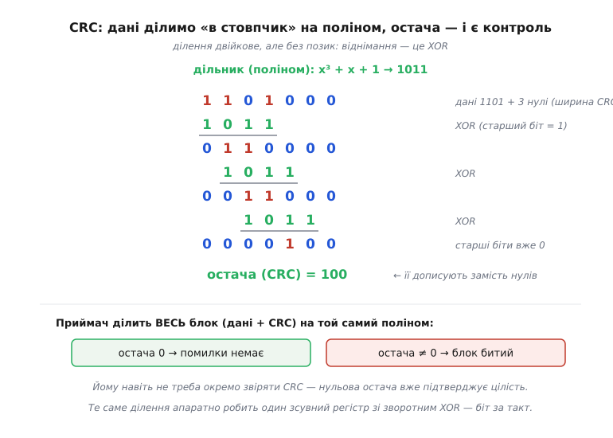
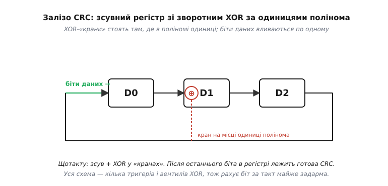
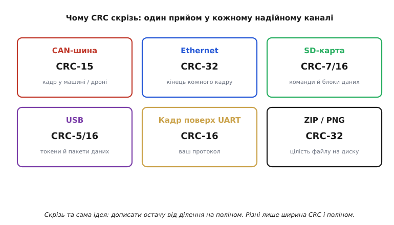

# CRC: чому він скрізь

[Контрольні суми](topic:com-modulation/checksums) показали межу підходу «складати числа»: хоч як його вдосконалюй, лишаються комбінації помилок, що дають ту саму суму. Щоб виявлення стало майже непробивним, потрібна операція, у якій помилка **майже завжди** лишає слід, — і такою операцією виявилося **ділення**. Код, побудований на діленні, називають **CRC** — *cyclic redundancy check*, циклічний надлишковий код, — і він заслужено став найпоширенішим кодом виявлення в усій цифровій техніці: від кадру в машині до пакета в інтернеті. Ідея його напрочуд проста (і чудово обходиться без зайвої алгебри), залізо під неї майже безкоштовне, а застосування — буквально всюди; розберімо все це по черзі.

### Дані як одне велике число, поділене на дільник

Серце CRC — несподіваний погляд на дані: уявімо весь блок як одне **дуже довге двійкове число**. Що, як поділити це число на якийсь наперед домовлений **дільник** і взяти **остачу**? Остача від ділення дуже чутлива до будь-якої зміни діленого: змініть один біт — і остача майже напевно стане іншою. Цю остачу й беруть за контрольний код. Дільник у теорії CRC прийнято називати **поліномом** (*polynomial*, бо біти числа зручно трактувати як коефіцієнти многочлена), а сам CRC — остачею від ділення на цей поліном.

Є лише одна тонкість, через яку CRC рахується інакше, ніж шкільне ділення: арифметику беруть **без переносів**. Віднімання на кожному кроці ділення замінюють на **XOR** — те саме [«виключне АБО»](topic:hw-digital/xor-comparison). Це робить ділення оборотним і чистим: жодних позик, жодних переносів, лише побітовий XOR там, де старший біт поточного залишку дорівнює 1. За цією дивиною стоїть струнка [математика многочленів над полем GF(2)](topic:com-modulation/crc/math-gf2-polynomials.md), де XOR водночас і додавання, і віднімання, — саме вона пояснює, чому ділення на поліном виявляє помилки так надійно, і дозволяє зрозуміти CRC «до дна».


*CRC — це ділення «в стовпчик», де віднімання замінено на XOR. Дані доповнюють нулями (стільки, скільки бітів у CRC) і ділять на поліном; на кожному кроці, де старший біт збігається, роблять XOR із поліномом і зсуваються далі. **Остача** коротша за поліном — це і є CRC, яку дописують до даних замість нулів. Приймач ділить увесь прийнятий блок (дані + CRC) на той самий поліном: остача 0 означає «помилки немає», остача ≠ 0 — «блок битий».*

Перевірка на приймачі влаштована красиво й симетрично. Передавач дописав остачу так, щоб **весь** блок (дані разом із CRC) націло ділився на поліном. Тому приймачеві досить поділити **весь прийнятий блок** на той самий поліном і глянути на остачу: якщо вона **нуль**, блок цілий; якщо **не нуль**, десь сталася помилка. Приймачеві навіть не треба окремо порівнювати CRC — сам факт нульової остачі підтверджує цілісність.

### Чому CRC такий дешевий у залізі

Якби CRC доводилося рахувати «довгим діленням» у програмі, він був би повільним. Та вся краса в тім, що це ділення ідеально лягає на **зсувний регістр зі зворотним зв'язком** (*linear-feedback shift register*, LFSR) — побратима звичайного [регістра](topic:hw-digital/register) з тригерів. Біти даних «вливаються» по одному, регістр на кожен такт зсувається, а в кількох точках стоять XOR-«крани» — рівно там, де в поліномі одиниці.


*Апаратний CRC — це зсувний регістр із XOR-«кранами» в позиціях, де поліном має одиниці. Біти даних вливаються по одному; щотакту регістр зсувається, а зворотний зв'язок із виходу через XOR-крани підмішується назад. Після останнього біта в регістрі лежить готова остача — CRC. Уся схема — кілька тригерів і кілька вентилів XOR, тож рахує один біт за такт майже задарма. Саме ця дешевизна й зробила CRC всюдисущим.*

Ось чому CRC не просто потужний, а ще й практично **безкоштовний** там, де його вбудували в залізо: жменя тригерів і вентилів обробляє потік на повній швидкості шини, не забираючи в процесора жодного такту. А там, де апаратного блоку нема, той самий алгоритм рахується програмно — або «в лоб» бітовим циклом, або швидко за наперед порахованою **таблицею**.

> ⚙️ Те саме ділення стає робочим кодом двома короткими циклами: повільним, але наочним бітовим і швидким табличним. Там же — як вибрати ширину й поліном (CRC-8/16/32) під свій канал, не винаходячи власного. Подробиці — у [реалізації CRC у коді](topic:com-modulation/crc/proj-crc-implementation.md).

> 🔌 У залізі цей самий рахунок робить готовий блок: окремий CRC-вузол у мікроконтролері (STM32-клас) і вартові всередині SD- та CAN-контролерів, що звіряють кадр без участі процесора. Як це влаштовано — в [апаратному CRC](topic:com-modulation/crc/comp-hardware-crc.md).

### Чому він буквально скрізь

Поєднання трьох якостей — сильне виявлення (надто пакетів), дешеве залізо й проста програмна реалізація — зробило CRC стандартом де тільки можна. Варто глянути, **де** саме він живе, щоб відчути масштаб.


*CRC скрізь, де треба надійне виявлення. CAN-шина в машині й дроні захищає кадр CRC-15; кожен кадр Ethernet несе CRC-32 у хвості; SD-карта боронить команди й блоки даних CRC-7/16; USB перевіряє токени й пакети; ваш власний кадр поверх UART зазвичай закривають CRC-16; навіть файли ZIP і PNG тримають CRC-32 для цілісності на диску. Скрізь та сама ідея — дописати остачу від ділення на поліном; різняться лише ширина CRC і сам поліном.*

Ця всюдисущість не випадкова — вона логічно випливає з того, **які** помилки трапляються в реальних каналах. Завади на дроті й у радіо часто приходять **пакетами** (короткий сплеск шуму перекидає кілька сусідніх бітів за раз), а CRC надзвичайно добрий саме проти пакетів: CRC-*n* гарантовано ловить будь-який пакет помилок завдовжки до *n* бітів і пропускає решту з мізерною ймовірністю близько 2⁻ⁿ. Для CRC-32 це приблизно один пропущений битий кадр на чотири мільярди — практично ніколи. Тому щоразу, коли інженерам потрібне було надійне «чи дійшов кадр цілим», відповідь майже завжди була одна: CRC.

**Приклад (мала CRC вручну).** Порахуймо 3-бітну CRC для даних `1101` з поліномом `1011` (тобто x³+x+1), щоб побачити механізм цілком.

```
дані 1101, дописуємо 3 нулі (ширина CRC): 1101 000

  1101000
⊕ 1011            (XOR, бо старший біт = 1)
  -------
  0110000
⊕  1011
  -------
  0011000
⊕   1011
  -------
  0000100  →  старші біти вже 0, лишилась остача в трьох молодших
остача (CRC) = 100

передаємо: 1101 100   (дані + CRC)
приймач ділить 1101100 на 1011 → остача 000 → блок цілий ✓
```
Остача 100 — це CRC; приймач ділить увесь блок на той самий поліном і за нульовою остачею впевнюється, що помилки немає.

### Не всякий поліном однаково добрий

Тут природно постає питання: якщо CRC — це ділення на поліном, то **який** поліном брати? Виявляється, від цього вибору залежить дуже багато, і саме тому в стандартах фігурують конкретні, освячені роками поліноми, а не перші-ліпші. Вдало дібраний поліном гарантує: код зловить **будь-яку** одиничну й подвійну помилку, будь-яке **непарне** їх число, будь-який **пакет** завдовжки до ширини CRC, а ще — переважну більшість довших пакетів. Невдалий поліном може мати прикрі сліпі плями, пропускаючи цілі класи типових помилок. Дослідники десятиліттями рахували й перевіряли поліноми на мільярдах випадків, і результат цієї праці — короткий список «золотих» поліномів (CRC-8, CRC-16-CCITT, CRC-32 та інші), які й стоять у стандартах. Звідси перше практичне правило: **не вигадуйте свій поліном** — візьміть перевірений під потрібну ширину.

А від чого залежить сама **ширина** — чому десь 8 бітів, а десь аж 32? Від двох речей: довжини блоку й ціни пропуску. Що довший кадр, то більше в ньому можливих помилок, і то більшої CRC треба, щоб тримати ймовірність пропуску низькою. І що дорожча помилка, то ширший код беруть про запас. Тому короткі команди SD-карти боронить CRC-7, кадр поверх UART зазвичай CRC-16, а великий кадр Ethernet — аж CRC-32: один пропущений битий кадр на чотири мільярди для нього прийнятний, а от CRC-8 на такому обсязі пропускав би забагато. Ширина CRC — це прямий обмін: більше бітів контролю означає менше пропусків, але й більше накладних витрат на кожен кадр.

Є й третя тонкість, об яку спотикається кожен, хто вперше звіряє свою CRC зі «стандартною» і дістає інше число. Реальні CRC, крім полінома, задають ще **початкове значення** регістра (часто не нуль, а всі одиниці), іноді **відбивають** (реверсують) порядок бітів на вході й виході, а наприкінці **інвертують** результат фінальним XOR. Усе це — не примха, а захист від конкретних слабкостей «голого» ділення (наприклад, нульовий старт не помічав би доданих на початку нулів). Практичний висновок простий: CRC задається **не лише поліномом**, а цілим набором параметрів, і щоб два кінці зійшлися, вони мусять збігтися в усьому. Тому беруть **іменований** стандарт цілком (скажімо, «CRC-16/CCITT-FALSE»), а не лише його поліном.

> 🔧 **Навіщо це.** Ці деталі рятують години налагодження. Перше: **не винаходьте власний CRC** — для будь-якої ширини є перевірені стандартні поліноми з відомими гарантіями; самопальний легко матиме сліпу пляму. Друге: **ширину** беріть під довжину кадру й ціну помилки — CRC-8 для короткого, CRC-16 для звичайного, CRC-32 для великого чи критичного. Третє, найчастіша пастка: якщо ваша порахована CRC не збігається з еталоном чи з іншим пристроєм — майже завжди річ у **параметрах** (початкове значення, відбиття бітів, фінальний XOR), а не в поліномі; звіряйте повний іменований профіль CRC, а не саму формулу ділення.

CRC дає виявлення, близьке до ідеального, і робить це дешево — недарма він став стандартом галузі. Та зверніть увагу: усе, що він уміє, — це сказати «**щось** зіпсовано», після чого кадр доводиться **перепитувати**. Це світ **виявлення**: помітити помилку й попросити повтор. Але повтор не завжди можливий — у пам'яті комп'ютера, на поверхні диска, у сигналі з далекого космосу перепитати ніде й нема в кого. Там потрібне дещо сильніше: не лише помітити помилку, а **виправити** її на місці. А це вже інша геометрія кодів, яку задає [відстань Геммінга](topic:com-modulation/hamming-distance).

---

Підсумок: **CRC** дивиться на дані як на одне велике число й бере **остачу від ділення** на домовлений поліном, причому віднімання в цьому діленні — це [**XOR**](topic:hw-digital/xor-comparison). Приймач ділить увесь блок (дані + CRC) на той самий поліном: нульова остача означає цілість. CRC дешевий у залізі (зсувний регістр із XOR-кранами рахує біт за такт) і простий у коді (бітовий цикл або таблиця), а головне — **чудово ловить пакетні помилки**: CRC-*n* бере будь-який пакет до *n* бітів і пропускає решту з імовірністю ~2⁻ⁿ. Тому він буквально всюди — CAN, Ethernet, SD, USB, кадри поверх UART, файли. Та CRC лише **виявляє**: далі кадр перепитують. Коли перепитати ніде (пам'ять, диск, космос), потрібне **виправлення**, що спирається на [відстань Геммінга](topic:com-modulation/hamming-distance).

---
