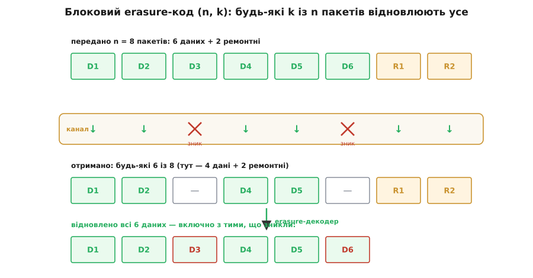
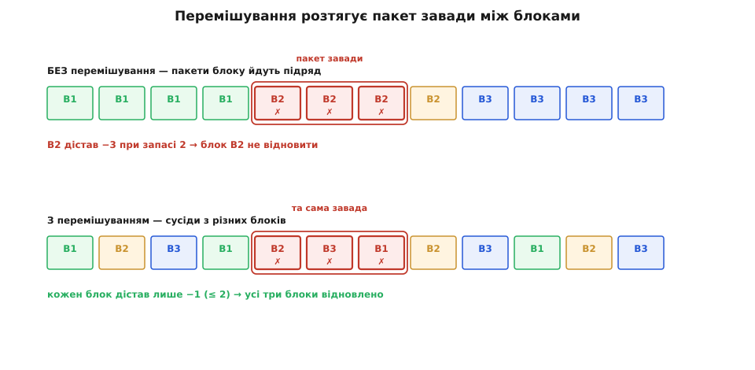
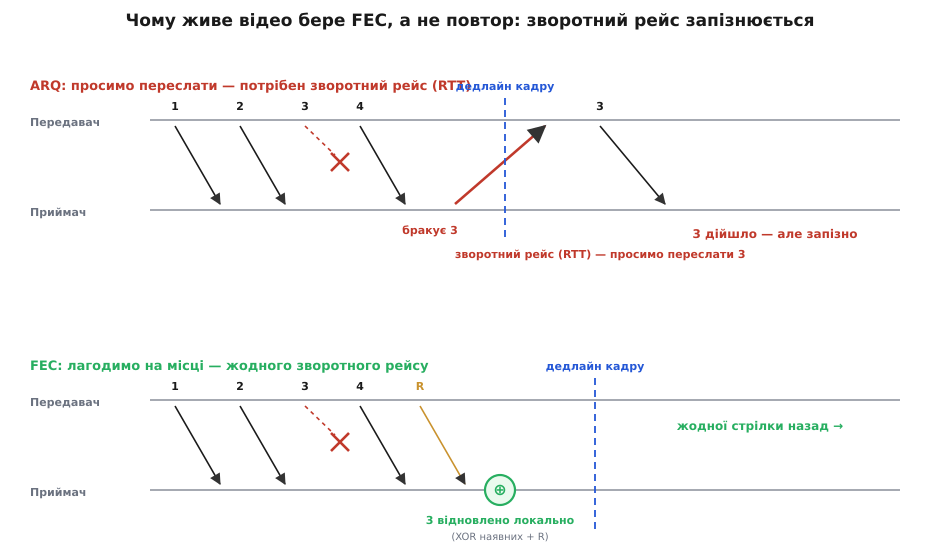
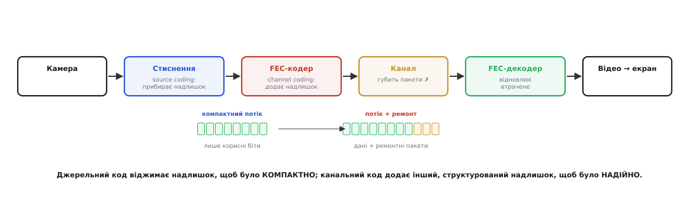

# FEC для потокового відео

<preknowlist>
- [Канал і пакет](root:com-transport/channel-band-packet) — дані в мережі йдуть окремими пакетами; «втрата» — це зниклий пакет, а не зіпсований біт.
- [Біт парності](root:com-modulation/parity-bit) — надлишковий біт як XOR інших; звідки взагалі береться здатність ловити й лагодити помилку.
- [Рід–Соломон](root:com-modulation/reed-solomon) — символьний код, що відновлює кілька втрачених символів; він же працює й на рівні пакетів.
- [Теорема Шеннона про кодування каналу](root:math-information/channel-coding-theorem) — надлишок дозволяє надійну передачу крізь шумний канал, і в цьому є чітка межа.
</preknowlist>

Уявіть, що ви керуєте дроном за камерою, спілкуєтеся у відеодзвінку чи дивитеся живу трансляцію. Зображення має йти *зараз* — кадр, який спізнився на пів секунди, вже нікому не потрібен, бо на екрані має бути наступний. І тут по дорозі губиться пакет: радіоканал завмер на мить, у Wi-Fi сталася колізія, мобільна мережа перевантажилася. Один [пакет](root:com-transport/channel-band-packet) просто не дійшов.

Найпростіша реакція — попросити переслати. Так робить надійна доставка файлів: приймач бачить діру в нумерації, шле назад «повтори пакет 7», передавач шле його знову. Для завантаження файлу це ідеально: витрачаємо трафік рівно на те, що загубилося, і ні на що більше. Але для живого відео цей підхід ламається об одну стіну — **час**. Запит на повтор мусить долетіти назад до передавача, а повторений пакет — знову до вас. Це повний оберт туди й назад (round-trip time, RTT). На супутниковому чи трансатлантичному лінку це сотні мілісекунд. Кадр, якого ви чекаєте, давно мав бути на екрані, а його копія ще тільки вирушає в дорогу.

Отже, просити *не можна*. А зниклий пакет якось відновити — треба. Єдиний вихід: надіслати ліки наперед, *разом* із даними, ще до того, як щось загубилося. Тоді приймач, побачивши діру, залатає її сам, зі свого боку, без жодного звернення назад. Саме це й означає скорочення **FEC** (Forward Error Correction — виправлення помилок наперед): «наперед» тут — про напрям. Ми виправляємо, рухаючись *уперед* потоком, не озираючись назад по нову копію.

## Найпростіший FEC, що працює: один пакет парності

Щоб відчути ідею, візьмемо чотири пакети даних і додамо до них п'ятий — контрольний, зроблений через побітове «виключне або» (XOR) усіх чотирьох. Це та сама думка, що й у звичайному [біті парності](root:com-modulation/parity-bit), тільки застосована не до бітів усередині байта, а до цілих пакетів, байт проти байта.

Хай пакети — одиничні байти (насправді їх тисячі, але арифметика та сама, побайтово):

```
d0 = 0xA3     R = d0 ⊕ d1 ⊕ d2 ⊕ d3
d1 = 0x5C       = A3 ⊕ 5C ⊕ F0 ⊕ 19
d2 = 0xF0       = FF ⊕ F0 ⊕ 19          (A3⊕5C = FF)
d3 = 0x19       = 0F ⊕ 19               (FF⊕F0 = 0F)
                = 0x16
```

Тепер у канал ідуть **п'ять** пакетів: `d0 d1 d2 d3 R`. Хай губиться `d2`. Приймач має `d0, d1, d3` і `R`, а `d2` — ні. Але XOR має чудову властивість: він сам собі обернений. Якщо `R = d0⊕d1⊕d2⊕d3`, то, «виксоривши» з `R` усе, що вціліло, дістанемо саме те, чого бракує:

```
d2 = R ⊕ d0 ⊕ d1 ⊕ d3
   = 16 ⊕ A3 ⊕ 5C ⊕ 19
   = B5 ⊕ 5C ⊕ 19        (16⊕A3 = B5)
   = E9 ⊕ 19             (B5⊕5C = E9)
   = 0xF0                ← точно вихідний d2
```

Найкрасивіше тут — що **відновлення робиться тією самою операцією, що й кодування**: просто XOR усіх наявних пакетів. Ось увесь кодек, справжнім C — бо ця арифметика крутиться в шлюзах і кодерах на кожному пакеті потоку, і рахується вона над сирими байтовими буферами:

```c
#include <stdint.h>
#include <stddef.h>

// Кодер: k пакетів даних по L байтів → один пакет парності = XOR усіх.
void fec_xor(const uint8_t *pkt[], int k, size_t L, uint8_t *parity) {
    for (size_t i = 0; i < L; i++) {
        uint8_t x = 0;
        for (int j = 0; j < k; j++)
            x ^= pkt[j][i];
        parity[i] = x;               // байт парності на позиції i
    }
}

// Відновлення зниклого пакета — та сама дія: XOR усіх, що вціліли.
// have[] = k пакетів, які реально дійшли (k−1 даних + пакет парності).
void fec_recover(const uint8_t *have[], int k, size_t L, uint8_t *lost) {
    fec_xor(have, k, L, lost);       // тому окрема функція й не потрібна
}
```

Одним пакетом парності ми купили право втратити будь-який *один* пакет із п'яти й не помітити цього. Але тільки один: якщо зникнуть двоє, одного рівняння XOR забракне, щоб знайти два невідомих.

## Узагальнення: блокові коди зі стиранням (n, k)

Звідси природний наступний крок. Хай у нас `k` пакетів даних, і ми хочемо пережити не одну, а кілька втрат. Побудуймо з `k` даних `n` пакетів усього, додавши `n − k` контрольних (ремонтних). Правильно збудований такий код — його ще звуть **кодом зі стиранням** (erasure code) — дає майже чарівну властивість: **приймач відновить усі `k` вихідних пакетів, отримавши будь-які `k` із надісланих `n`**. Байдуже, котрі саме `n − k` пакетів загубилися — аби долетіла хоч якась `k`-ка.



*Передано n = 8 (шість даних плюс два ремонтні); у каналі зникли двоє; з будь-яких шести вцілілих декодер піднімає всі шість даних — включно з тими, що пропали.*

Коди з такою межовою властивістю — «будь-яка `k`-ка досить» — звуть *максимально роздільними* (MDS), і класичний робочий приклад — [Рід–Соломон](root:com-modulation/reed-solomon), застосований не до байтів усередині повідомлення, а до цілих пакетів. Той єдиний пакет парності, з якого ми почали, — це просто окремий випадок `(n, k) = (k+1, k)`: один ремонтний символ, одна посильна втрата.

Тут з'являється головна ручка, якою крутить інженер, — **швидкість коду** (code rate) `R = k / n` і **надлишок** `(n − k) / k`. Код `(10, 8)` має швидкість 0.8: на кожні 8 корисних пакетів летить 2 ремонтні, тобто 25 % надлишку, і блок переживає до 2 втрат із 10. Код `(20, 16)` — та сама швидкість 0.8, але переживає вже до 4 втрат із 20. Більше надлишку — більша стійкість, але й більше трафіку, а врешті-решт і більша затримка.

## Стирання, а не помилки: чому пакетний канал добріший

Варто спинитися на одному слові. Ми весь час кажемо «втрата», «зник пакет», а не «зіпсувався біт». Це принципова різниця, і саме вона робить пакетний FEC таким дієвим.

Коли пакет дістається до приймача пошкодженим — кілька бітів перевернулися шумом, — його **контрольна сума** (CRC у кадрі каналу) цього не пропускає: сума не збігається, і транспорт мовчки викидає пакет. Тому до відеорівня зіпсовані пакети взагалі не доходять — доходять лише цілі, і зникають лише ті, що не пройшли перевірку або не дійшли фізично. А головне — завдяки нумерації пакетів приймач *знає, котрих саме бракує*. Це і є [канал зі стиранням](root:math-information/erasure-channel-and-packet-loss): помилка не «десь усередині, невідомо де», а на відомій позиції, з відомою адресою.

> 🔧 **Навіщо це.** Знати позицію втрати — величезна форá для декодера. Щоб *виправити* помилку невідомого місця, кодові потрібні дві одиниці відстані на кожну помилку (одна — щоб помітити, друга — щоб локалізувати). Щоб *залатати стирання* відомого місця, досить однієї: локалізувати вже не треба, лишається знайти значення. Тому той самий надлишок латає вдвічі більше стирань, ніж виправляє помилок, — і пакетний FEC витискає з кожного ремонтного пакета максимум.

## Скільки надлишку класти

Ремонт не безкоштовний: кожен ремонтний пакет — це трафік, витрачений на пакет, якого могло й не бракувати. Скільки його класти? Це рахується. Хай канал незалежно втрачає частку `p` пакетів; блок `(n, k)` не відновиться лише тоді, коли загубиться *більше* ніж `n − k` пакетів із `n`. Імовірність цього — хвіст біноміального розподілу.

**Візьмімо реалістичний лінк із втратою 5 % і код `(10, 8)`** (стійкий до 2 втрат із 10):

```
p = 0.05,  q = 0.95
блок гине ⟺ загублено ≥ 3 пакети з 10

P(0 втрат) = 0.95¹⁰               = 0.5987
P(1 втрата) = 10·0.05·0.95⁹       = 0.3151
P(2 втрати) = 45·0.05²·0.95⁸      = 0.0746
                              сума = 0.9884

P(блок гине) = 1 − 0.9884 = 0.0116 ≈ 1.2 %
```

Без FEC кожен двадцятий пакет (5 %) зникав би назавжди — і кожна така втрата це видима «цеглинка» чи ривок на відео. Наш код `(10, 8)` збиває цей ризик до ~1.2 % на блок. Уже краще, але не ідеально.

А тепер той самий надлишок 25 %, тільки довшим блоком — `(20, 16)`, стійким до 4 втрат із 20:

```
P(блок гине) = P(≥ 5 втрат із 20) ≈ 0.25 %
```

Та сама швидкість коду, той самий відсоток трафіку на ремонт — а залишковий ризик упав із 1.2 % до 0.25 %, майже вп'ятеро. Це не випадковість: на довшому блоці частка втрат тісніше тримається середнього значення (закон великих чисел), і рідше вискакує аномально великий сплеск, що пробиває запас. [Повне виведення й вибір параметрів під заданий канал](root:com-modulation/fec-channel-coding/math-fec-overhead.md) — окремо; тут важлива сама форма висновку.

Здавалося б — берімо блоки якнайдовші й тіштеся. Але довший блок ховає пастку, і знову це **час**. Щоб декодувати блок `(20, 16)`, приймач мусить дочекатися принаймні 16 з 20 пакетів — тобто *накопичити* їх, перш ніж почати латати. Що довший блок, то більше треба буферувати, то пізніше віддається перший кадр. Ось і повний компроміс FEC на долоні: **надлишок ↔ стійкість ↔ затримка**. Тягнеш за один кут — смикаються два інші.

## Пакетні втрати йдуть чергами: перемішування

Досі ми припускали, що втрати незалежні — кожен пакет гине сам собою. У реальному радіо це майже ніколи не так. Коли антену затінило, коли завмирання притисло сигнал, коли хтось увімкнув поруч потужний передавач — гине не один пакет, а ціла черга поспіль. Це [пакетна помилка](root:com-modulation/burst-error) (burst), і поведінку такого каналу описують [моделлю Гілберта–Елліота](root:com-modulation/gilbert-elliott-model): канал перемикається між станом «добре» і станом «погано», і в поганому валить пакети пачками.

Для блокового FEC це отрута. Наш код `(10, 8)` радо переживе 2 розкидані втрати, але якщо канал провалиться й проковтне 3 *сусідні* пакети, і всі троє належать одному блоку — блок мертвий, хоч би скільки ремонту ми в нього поклали. Уся стійкість була розрахована на розсіяні поодинокі втрати, а прийшла компактна діра.

Рятує напрочуд простий трюк — **перемішування** (interleaving). Замість слати пакети блоку один за одним, ми навмисне розтасовуємо їх у часі: спершу перший пакет кожного блоку, потім другий кожного, і так далі. Тоді пачка втрат, що впаде на кілька сусідніх *у часі* пакетів, розкладеться по *різних* блоках — і кожен блок недорахується лише одного-двох пакетів, а це він переживе.



*Той самий пакет завади в трьох сусідніх слотах. Ліворуч блоки лежать підряд — і вся пачка дістається B2. Праворуч пакети переплетено — і завада «розмазується» по всіх трьох блоках, кожен втрачає лише один.*

> 🔧 **Навіщо це.** Перемішування нічого не додає до трафіку — воно лише міняє *порядок* відправлення. Ціна за нього — знову затримка: щоб переплести пакети, треба спершу набрати їх у буфер, а на прийомі — зібрати назад. Тому глибину перемішування (наскільки далеко рознесені пакети одного блоку) підбирають під найдовшу очікувану пачку втрат каналу й під бюджет затримки. Це та сама валюта — час, — якою платиться за все у FEC.

## FEC, ARQ і що коли брати

Тепер видно всю картину протиставлення. Повтор за запитом — **ARQ** (Automatic Repeat reQuest, [автоматичний запит на повтор](root:com-transport/arq)) — ощадливий до трафіку: пересилає рівно втрачене й ні байта більше. Але платить зворотним рейсом: між виявленням втрати й прибуттям копії лежить цілий оберт каналу.

FEC — навпаки: платить трафіком *завжди* (ремонтні пакети летять, навіть коли нічого не згубилося), зате не платить часом зовсім — латка вже в руках приймача, ніякого рейсу назад.



*Угорі ARQ: втрату помічено, назад летить запит, копія повертається — але дедлайн кадру вже позаду. Унизу FEC: пакет 3 відновлено локально з ремонтного R, зворотного рейсу немає, кадр устигає.*

Звідси й правило вибору. Тягнеш файл, згоден чекати — бери ARQ, він ефективніший. Живе відео, ігровий стрім, керування дроном, де затримка — ворог номер один, — бери FEC. А є випадок, де ARQ взагалі неможливий: **мовлення** одного джерела на тисячі приймачів (супутникове ТБ, роздача оновлення на весь стадіон). Якби кожен приймач слав свій запит на повтор, передавач захлинувся б лавиною запитів — тож тут лишається чистий FEC.

Часто беруть і те, й те — **гібрид** (hybrid ARQ): спершу FEC латає, що може, миттєво; а якщо блок усе-таки не зібрався й час іще дозволяє — тоді, як остання інстанція, летить запит на повтор. FEC знімає більшість втрат без затримки, ARQ добирає рідкий залишок.

## Відео: стиснути, а тоді захистити

Лишилося з'єднати FEC із самим відео — і тут криється гарна симетрія, заради якої варто пройти всю тему.

Відеокодек (H.264, AV1) насамперед **стискає**. Це протилежна до FEC робота: стиснення *прибирає* з даних надлишок — повторювані ділянки, передбачувані пікселі, все, що можна не слати. У теорії межа стиснення — це [ентропія](root:math-information/shannon-entropy) джерела: коротше вже не буде без втрат. Таке компактне подання звуть **джерельним кодуванням** (source coding).

Але чим щільніше стиснуто, тим *крихкіший* результат: у стисненому потоці майже не лишилося зайвого, тож кожен біт незамінний. Втратите пакет із опорним кадром (I-frame, ключовий) — і попливе ціла група наступних кадрів, бо вони описані як різниця від нього. Стиснення викинуло природний захисний надлишок — і ми мусимо повернути надлишок назад, але *інший*, розумний, розрахований на відновлення. Це і є **канальне кодування** — той самий FEC.



*Дві протилежні операції поспіль: джерельний код віджимає надлишок заради компактності, канальний код додає інший, структурований надлишок заради надійності.*

Ці дві роботи — стиснути й захистити — можна проєктувати *окремо*, і, за теоремою Шеннона про розділення джерела й каналу, від цього не програєш в оптимальності (за ідеальних умов). Одна команда доводить кодек, інша — схему FEC, і вони стикуються через компактний бітовий потік посередині. Той самий Шеннон, що [дав межу надійної передачі каналом](root:math-information/channel-coding-theorem), дав і дозвіл розділяти ці дві задачі.

Симетрія підказує ще один хід. Якщо не всі дані однаково важливі — опорний кадр цінніший за проміжний, — то й захищати їх можна нерівно: класти більше ремонту на найважливіше й менше на дрібне. Це нерівний захист (unequal error protection), і у відео він природний, бо втрата опорного кадру коштує куди дорожче за втрату одного проміжного.

На практиці для потоку по IP давно є готові схеми. У WebRTC і відеодзвінках працює **FlexFEC** (RFC 8627) — систематичний код парності, що вміє й простий (проти розсіяних втрат), і перемішаний (проти пачок) режим, а ремонтні пакети йдуть окремим потоком поряд із даними. У мовленні на безліч приймачів беруть [фонтанні (безрейтові) коди](root:com-modulation/fountain-codes) — як-от RaptorQ (RFC 6330): кодер генерує *скільки завгодно* ремонтних символів на льоту, а приймач збирає файл, щойно набере досить будь-яких із них, незалежно від того, котрі саме дійшли. [Історія цього повороту — від блокових кодів до фонтана](root:com-modulation/fec-channel-coding/hist-fountain-codes.md) — окрема й повчальна. А [робочий пакетний FEC-кодек, від XOR до Рід–Соломона на пакетах](root:com-modulation/fec-channel-coding/proj-packet-fec.md), показує, як усе це збирається в код.

## Підсумок: ручка з трьох поділок

Уся тема тримається на одному компромісі. FEC купує надійність не часом, а *трафіком*: замість просити копію (і чекати цілий оберт каналу) ми возимо ремонт із собою наперед. За це платимо смугою — і, там де є перемішування чи довгі блоки, ще й затримкою буферизації. Крутячи три поділки — надлишок, стійкість, затримку, — інженер підганяє FEC під конкретний канал: скільки той губить, чи йдуть втрати пачками, скільки мілісекунд можна дозволити. Саме ця можливість залатати дірку, не озираючись назад, і робить живе відео крізь ненадійний ефір узагалі можливим.
