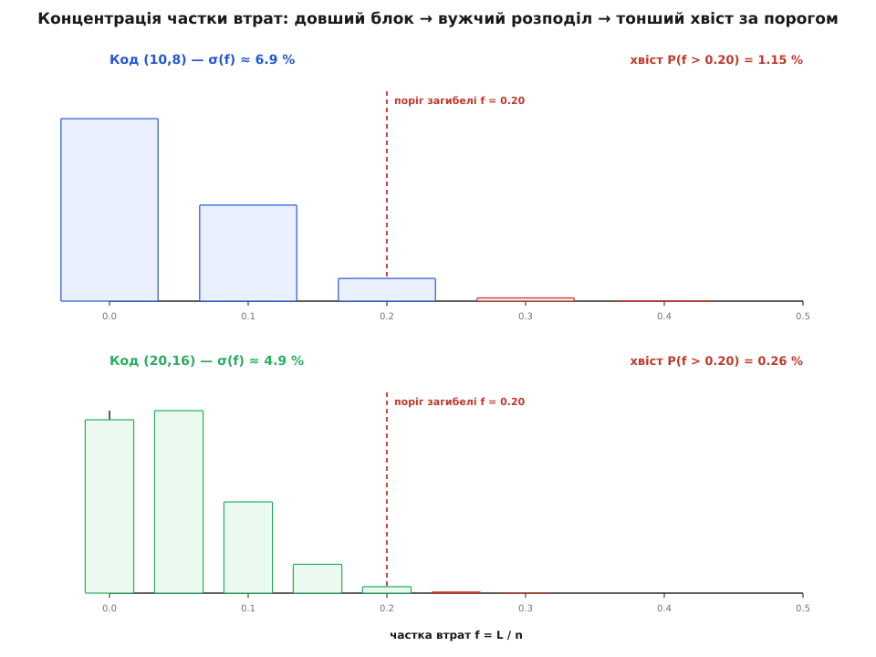
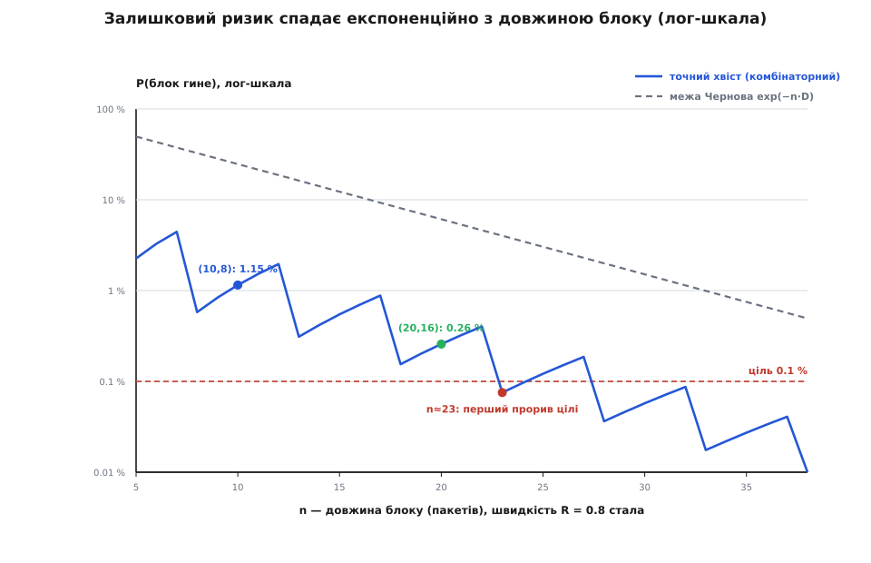

# 🧮 Скільки FEC класти: біноміальний хвіст і закон великих чисел

Ремонтний надлишок — це податок, який платиться *завжди*, а не лише коли щось загубилося. Ремонтні пакети летять у канал разом із даними навіть у ті хвилини, коли жоден пакет не зник. Тож питання «скільки надлишку класти» — це не смак і не запас про всяк випадок, а розрахунок: скільки треба, щоб імовірність не зібрати блок упала нижче за той поріг, який ви готові стерпіти. І цей розрахунок має напрочуд чисту форму — хвіст біноміального розподілу, — з якої випливає геть не очевидний висновок: за однакового податку довший блок надійніший. Проговорімо це від першопричини.

## Надлишок: проста алгебра, яку варто проговорити

Хай маємо `k` пакетів даних. Побудуймо з них `n` пакетів усього, додавши `e = n − k` ремонтних. Дві величини описують «скільки надлишку»:

```
швидкість коду     R = k / n           (частка корисного в потоці)
надлишок           ρ = (n − k) / k     (скільки ремонту на одиницю даних)
```

Вони — той самий факт із двох боків, і одне через одне виражається без нового знання:

```
ρ = (n − k)/k = n/k − 1 = 1/R − 1 = (1 − R)/R
n/k = 1/R                             ← у скільки разів роздувся потік
(n − k)/n = 1 − R                     ← частка ремонту в усьому переданому
```

Для коду `(10, 8)`: `R = 0.8`, `ρ = 2/8 = 0.25` — 25 % надлишку до даних, потік роздувся в `1/0.8 = 1.25` раза, а ремонт становить `1 − 0.8 = 0.20` усього переданого. Три способи назвати те саме — але плутати їх не можна: «25 % надлишку» і «20 % трафіку на ремонт» — це один і той самий код, просто відношення взяті до різного знаменника.

Головне тут — що цей податок незмінний. Хоч би скільки пакетів реально загубилося, ви щоразу шлете `e` ремонтних на кожні `k` даних. FEC купує надійність саме цією фіксованою переплатою наперед — на відміну від повтору за запитом, який платить рівно за втрачене, зате зворотним рейсом каналу. Тож питання звужується: за який `e` переплата вже досить велика, щоб блок майже завжди збирався?

## Коли блок не збереться: біноміальний хвіст

Візьмемо найпростішу модель каналу: кожен пакет незалежно від інших губиться з імовірністю `p`, доходить — з `q = 1 − p`. «Незалежно» — це ідеалізація (у реального радіо втрати йдуть чергами, і з тим борються перемішуванням), але саме вона дає чистий розрахунок, від якого відштовхуються всі поправки.

Скільки пакетів загубиться в блоці з `n`? Це випадкове число `L`. Воно не фіксоване — може бути 0, 1, 2, аж до `n`. Розподіл `L` — точно [біноміальний](root:math-probability/binomial-distribution): маємо `n` незалежних спроб, у кожній «невдача» (втрата) стається з імовірністю `p`, і ми рахуємо, скільки невдач вийшло. Імовірність рівно `j` втрат:

```
P(L = j) = C(n, j) · pʲ · qⁿ⁻ʲ
```

Кожен доданок читається як історія однієї конкретної картини втрат: `pʲ` — що оці `j` пакетів зникли, `qⁿ⁻ʲ` — що решта `n − j` дійшли, а біноміальний коефіцієнт `C(n, j) = n! / (j!·(n−j)!)` рахує, скількома способами можна вибрати, *котрі саме* `j` із `n` зникли, — бо всі ці способи дають однакове число втрат і їхні ймовірності треба додати.

Тепер згадаймо, що дає код зі стиранням: якщо він максимально роздільний (будь-яких `k` із `n` досить), то блок відновиться доти, доки втрат не більше за число ремонтних пакетів. Тобто:

```
блок збереться   ⟺   L ≤ e          (втрат не більше, ніж ремонту)
блок загине      ⟺   L > e   (тобто  L ≥ e + 1)
```

А отже, залишкова ймовірність втратити блок — це «хвіст» біноміального розподілу, сума ймовірностей усіх поганих результатів:

```
P(блок гине) = P(L > e) = Σ  C(n, j) · pʲ · qⁿ⁻ʲ
                         j = e+1 … n
```

Практично зручніше рахувати не сам хвіст, а те, що блок *виживе* (кілька доданків від `j = 0`), і відняти від одиниці — коли `e` мале, це кілька множень замість багатьох:

```
P(блок гине) = 1 − Σ  C(n, j) · pʲ · qⁿ⁻ʲ
                  j = 0 … e
```

## Порахуймо: (10, 8) на каналі з 5 % втрат

Хай `p = 0.05` (кожен двадцятий пакет зникає), код `(10, 8)`, `e = 2`. Блок живе, поки втрат не більше двох; гине від третьої. Порахуймо три «добрі» доданки й віднімемо:

```
p = 0.05,  q = 0.95,  n = 10,  e = 2

P(L=0) = q¹⁰            = 0.95¹⁰         = 0.598737
P(L=1) = C(10,1)·p·q⁹  = 10·0.05·0.95⁹  = 0.315125
P(L=2) = C(10,2)·p²·q⁸ = 45·0.0025·0.95⁸ = 0.074635
                                    сума = 0.988497

P(блок гине) = 1 − 0.988497 = 0.011503 ≈ 1.15 %
```

Ось наочна вартість надлишку. Без коду кожні 5 % пакетів зникали б назавжди — на відео це видимі ривки й «цеглинки». Код `(10, 8)` збиває ризик утрати цілого блоку до ~1.15 %: у сто разів менше видимих провалів за 25 % переплати трафіком.

## Той самий надлишок, удвічі довший блок: (20, 16)

А тепер код `(20, 16)`. Швидкість та сама — `16/20 = 0.8`, — той самий 25 % надлишку, той самий відсоток трафіку на ремонт. Але блок удвічі довший і терпить уже `e = 4` втрати з двадцяти. Гине від п'ятої:

```
p = 0.05,  q = 0.95,  n = 20,  e = 4

P(L=0) = 0.95²⁰               = 0.358486
P(L=1) = 20·0.05·0.95¹⁹       = 0.377354
P(L=2) = 190·0.0025·0.95¹⁸    = 0.188677
P(L=3) = 1140·0.05³·0.95¹⁷    = 0.059582
P(L=4) = 4845·0.05⁴·0.95¹⁶    = 0.013328
                        сума  = 0.997427

P(блок гине) = 1 − 0.997427 = 0.002573 ≈ 0.26 %
```

Той самий податок — а ризик упав із 1.15 % до 0.26 %, майже вп'ятеро. Гроші ті самі, надійність утричі-вп'ятеро краща. Це не бухгалтерська помилка й не випадковість: це закон, і його варто зрозуміти до кінця, бо саме він каже інженерові, куди крутити ручку.

## Чому виграє довжина: частка втрат тулиться до середнього

Дивімося на *частку* втрачених пакетів `f = L / n`, а не на їхнє число. Це правильна оптика, бо поріг загибелі теж природно виражається як частка:

```
середня частка втрат      E[f] = p               = 0.05   (в обох кодах)
поріг загибелі за часткою  e/n = (n − k)/n = 1 − R = 0.20   (в обох кодах)
запас                      (1 − R) − p           = 0.15   (в обох кодах!)
```

Ось у чому фокус. Обидва коди мають *однаковий* запас: блок гине, коли частка втрат перескочить із середніх 5 % аж за 20 %, тобто підстрибне на 0.15 над своїм звичним рівнем. Число податку однакове, поріг однаковий, запас однаковий. Різне — лише те, наскільки *широко розкидана* сама частка навколо свого середнього.

А розкид частки з довжиною блоку падає. Число втрат має [середнє й дисперсію](root:math-probability/mean-variance) біноміального:

```
E[L]   = n·p
Var(L) = n·p·q
```

Перейдімо до частки `f = L/n`. Ділення на сталу `n` не зсуває середнє, але дисперсію ділить на `n²`:

```
E[f]   = p
Var(f) = Var(L)/n² = p·q / n
σ(f)   = √(p·q / n)  = √(p·q) / √n
```

Стандартне відхилення частки спадає як `1/√n`. Порахуймо для наших двох кодів (`√(p·q) = √(0.05·0.95) = √0.0475 = 0.2179`):

```
n = 10:  σ(f) = 0.2179 / √10 = 0.06892   (≈ 6.9 %)
n = 20:  σ(f) = 0.2179 / √20 = 0.04873   (≈ 4.9 %)
```

Тепер зважмо запас 0.15 не в абсолюті, а в одиницях цього розкиду — на скільки стандартних відхилень поріг відсунутий від середнього:

```
n = 10:  0.15 / 0.06892 = 2.18 σ
n = 20:  0.15 / 0.04873 = 3.08 σ
```

Ось і вся розгадка. Запас у частках однаковий (0.15), але виміряний у власному розкиді — він більший на довшому блоці: 3.08 сигми проти 2.18. А хвіст за трьома сигмами куди тонший, ніж за двома з чвертю, — тому мас там менше, тому блок гине рідше. Загалом «скільки сигм запасу» зростає як `√n`:

```
z = запас / σ(f) = (1 − R − p) · √n / √(p·q)
```

Подвоїш `n` — і кількість сигм запасу зросте в `√2 ≈ 1.41` раза, задарма, за ту саму швидкість коду. Це і є [закон великих чисел](root:math-probability/law-of-large-numbers) у чистому вигляді: що більше незалежних спроб, то тісніше частка невдач тулиться до своєї середньої `p`, і то рідше вихоплюється аж за поріг. На дуже довгих блоках хвіль наближення частки до нормального (гаусового) — це вже [центральна гранична теорема](root:math-probability/central-limit), і вона дає швидку прикидку хвоста; але для коротких сильно скошених блоків рахувати треба точний біном, а гаусова картинка лишається інтуїцією тренду, а не числом.



*Частка втрат `f = L/n` для двох кодів однакової швидкості. Середнє (5 %) і поріг загибелі (20 %) — спільні, тож запас 0.15 однаковий. Але розкид частки в `(20,16)` вужчий (той самий запас — це вже 3.08 σ проти 2.18 σ), тому червоний хвіст за порогом тонший, і блок гине рідше.*

> 🔧 **Навіщо це.** Оце і є ручка, за яку насправді тягне інженер. Хочете надійніше за ту саму ціну трафіку — беріть довший блок: швидкість коду не змінилася, податок той самий, а запас у сигмах підріс, бо частка втрат сконцентрувалася. Задарма нічого не буває — за довжину заплатите затримкою, — але в межах бюджету затримки довжина блоку це безкоштовна надійність.

## Експоненційний закон і стіна ємності

Наскільки швидко ризик падає з довжиною? Тут допомагає межа концентрації — оцінка хвоста згори (нерівність Чернова / Гефдінга через відносну ентропію). Для біноміального хвоста вона дає:

```
P(L ≥ a·n) ≤ exp( −n · D(a ‖ p) ),   де  a = e/n = 1 − R,
D(a ‖ p) = a·ln(a/p) + (1−a)·ln((1−a)/(1−p))    (дивергенція Кульбака–Лейблера)
```

Порахуймо показник для нашого випадку `a = 0.20`, `p = 0.05`:

```
D(0.2 ‖ 0.05) = 0.2·ln(0.2/0.05) + 0.8·ln(0.8/0.95)
              = 0.2·ln 4 + 0.8·ln 0.8421
              = 0.2·1.3863 + 0.8·(−0.1719)
              = 0.27726 − 0.13748 = 0.13978  (нат/пакет)
```

Показник лінійний за `n`. А отже, **за фіксованої швидкості коду залишковий ризик падає з довжиною блоку експоненційно**: `P(гине) ≲ exp(−0.13978·n)`. На логарифмічній шкалі це пряма вниз — кожен доданий пакет множить ризик на сталу `exp(−D) ≈ 0.87 < 1`. Межа Чернова груба (для `(10,8)` вона дає ≤ 0.247 проти справжніх 0.0115 — завищує в рази), бо ковтає поліноміальний передмножник, — але нахил, тобто саму швидкість спадання, вона ловить правильно, і саме нахил тут головний.



*Та сама швидкість `R = 0.8`, канал `p = 0.05`. Точний хвіст (суцільна) спадає майже прямою на лог-шкалі — це і є експоненційний закон; межа Чернова (штрихова) йде паралельно згори. Горизонтальна ціль 0.1 % перетинається коло `n ≈ 23`.*

Але в цій експоненті сховано й обмеження, симетричне до виграшу. Показник `D(a ‖ p)` додатний лише поки `a > p`, тобто поки `1 − R > p`, тобто:

```
R < 1 − p       ← необхідна умова, щоб довжина взагалі допомагала
```

Що станеться, якщо взяти швидкість зависоку, `R > 1 − p`? Тоді поріг за часткою `a = 1 − R` виявиться *нижчим* за середню втрату `p`. Ремонту в середньому не вистачає, щоб покрити навіть звичайні втрати, — і той самий закон великих чисел тепер працює *проти* вас: частка втрат надійно тулиться до `p`, а `p` вже за порогом, тож на довгому блоці ризик прямує не до нуля, а до одиниці. Довший блок робить тільки *гірше*.

Межа `R = 1 − p` — не випадкова. Це рівно ємність каналу зі стиранням: для пакетного каналу, де кожен пакет зникає з імовірністю `p`, пропускна здатність дорівнює `C = 1 − p` (у пакетах на пакет). Нижче ємності (`R < 1 − p`) надійна передача можлива й довший блок жене ризик до нуля; вище — ні, за жодної довжини. Це не інженерна оцінка, а строгий результат: [теорема Шеннона про кодування каналу](root:math-information/channel-coding-theorem) саме про цю межу, а канал зі стиранням із його простою ємністю `1 − p` увів Пітер Еліас 1955 року, спираючись на Шеннонову теорему 1948-го (усталений факт). Тож вибираючи швидкість коду, ви насамперед мусите сісти *під* ємністю власного каналу — інакше жоден блок вас не врятує.

## Ціна довгого блоку — затримка буферизації

Чому ж тоді не брати блоки завдовжки з тисячу й тішитися майже нульовим ризиком? Бо за довжину платиться часом. Щоб зібрати ремонтні пакети, кодер мусить спершу мати всі `k` пакетів даних (ремонт — це функція від усіх `k`), а декодер, щоб залатати ранню втрату, мусить дочекатися ремонтних, які йдуть у хвості блоку, — тобто прийняти майже весь блок із `n` пакетів. Затримка відновлення тому росте з довжиною блоку.

Прикинемо на числах (ілюстративно): потік 2 Мбіт/с, пакети по 1200 байтів. Один пакет займає в каналі:

```
1200 байтів · 8 біт / 2·10⁶ біт/с = 4.8 мс на пакет

блок (10, 8):  ≈ 10 · 4.8 = 48 мс на весь блок
блок (20, 16): ≈ 20 · 4.8 = 96 мс на весь блок
```

Ось і повний рахунок. Перехід `(10,8) → (20,16)` купив уп'ятеро менший ризик утрати блоку — але подвоїв затримку буферизації FEC, з ~48 до ~96 мс. Для завантаження файлу це байдуже; для відеодзвінка чи керування дроном 96 мс головотяжкої затримки вже відчутні. Ось і повний компроміс на долоні: **надлишок ↔ стійкість ↔ затримка**. Швидкість коду `R` задає надлишок; довжина блоку `n` перемелює стійкість на затримку за сталого надлишку. Тягнеш за один кут — смикаються два інші.

## Рецепт: вибрати (n, k) під заданий ризик

Складімо все в порядок дій. Дано: виміряна частка втрат каналу `p`, цільовий залишковий ризик `P*` (скажімо, 0.1 % на блок) і бюджет затримки, що обмежує `n` згори.

1. **Сісти під ємність.** Виберіть швидкість `R < 1 − p` із запасом. Це найважливіше: якщо `R ≥ 1 − p`, ціль недосяжна за будь-якої довжини. Для `p = 0.05` ємність `0.95`; беремо, скажімо, `R = 0.8` (поріг за часткою `0.20`, вчетверо вищий за середні втрати — здоровий запас).

2. **Оцінити довжину зверху** через показник концентрації: щоб `exp(−n·D(1−R ‖ p)) ≤ P*`, треба

   ```
   n ≥ ln(1/P*) / D(1 − R ‖ p)
   ```

   Для `P* = 0.001`, `D = 0.13978`: `n ≥ ln(1000)/0.13978 = 6.908/0.13978 ≈ 49`. Це *безпечна* оцінка — межа Чернова груба, тож насправді вистачить менше.

3. **Уточнити точним хвостом.** Порахуйте справжній біноміальний хвіст і знайдіть найменше `n`, за якого він уже ≤ `P*`. Для `R = 0.8`, `p = 0.05`, `P* = 0.001` це `n = 23`, `k = 18`, `e = 5` (точний ризик `7.5·10⁻⁴`) — удвічі коротше за оцінку з кроку 2.

4. **Перевірити бюджет затримки.** Блок `n = 23` — це ~`23·4.8 = 110` мс буфера на нашому потоці. Влазить у бюджет — добре; ні — доведеться прийняти вищий ризик, домогтися меншого `p` (кращий канал) або перейти на гібрид із повтором за запитом. Підняти `R` тут не поможе — це *зменшує* запас.

Уся арифметика — кілька множень; ось вона офлайновим розрахунком (це планування схеми, не гарячий шлях пакета, тож ясність важливіша за швидкодію — Python лягає найкраще):

```python
from math import comb, log

def p_fail(n: int, k: int, p: float) -> float:
    """Залишкова ймовірність загибелі блока (n, k) за частки втрат p:
    хвіст біномного розподілу P(L > n - k)."""
    e, q = n - k, 1.0 - p
    survive = sum(comb(n, j) * p**j * q**(n - j) for j in range(e + 1))
    return 1.0 - survive

def choose_block(p: float, rate: float, target: float, n_max: int) -> tuple | None:
    """Найкоротший блок швидкості ~rate, що дає ризик ≤ target.
    Повертає (n, k, e, ризик) або None, якщо в межу n_max не влізли."""
    if rate >= 1 - p:                       # над ємністю — марно за будь-якого n
        raise ValueError(f"R={rate} ≥ ємність 1−p={1-p}: ціль недосяжна")
    for n in range(2, n_max + 1):
        k = round(rate * n)
        if 0 < k < n and p_fail(n, k, p) <= target:
            return n, k, n - k, p_fail(n, k, p)
    return None

print(choose_block(p=0.05, rate=0.8, target=1e-3, n_max=200))
# → (23, 18, 5, 0.0007540…)   ← найкоротший блок під ціль 0.1 %
```

Той самий `p_fail` можна ганяти й наживо на шлюзі, підстроюючи `(n, k)` під виміряну зараз частку втрат, — але сам вибір параметрів це офлайнове планування, і робити його варто саме так: з точним хвостом, а не з грубою межею.

## Підсумок

Скільки FEC класти — це не запас про всяк випадок, а хвіст біноміального розподілу, прирівняний до ризику, який ви терпите. Три числа сходяться в одну ручку. Швидкість коду `R = k/n` задає незмінний податок трафіком і мусить сидіти під ємністю каналу `1 − p`, інакше жодна довжина не порятує. Довжина блоку `n` за фіксованого податку перемелює стійкість на затримку: частка втрат тулиться до середнього тим тісніше, чим довший блок (`σ` частки спадає як `1/√n`), тож той самий запас важить більше сигм, і ризик тане експоненційно — але буфер росте лінійно з `n`. Вибрати `(n, k)` означає посадити швидкість під ємність із запасом, а тоді нарощувати довжину рівно до того `n`, де точний хвіст пробиває ваш поріг ризику й затримка ще влазить у бюджет. Усе інше — наслідок цих трьох чисел.
