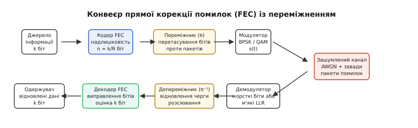
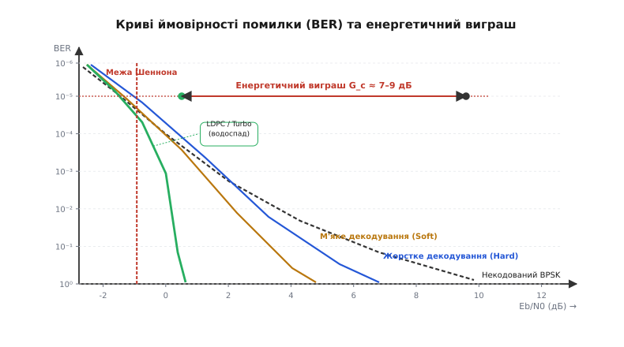
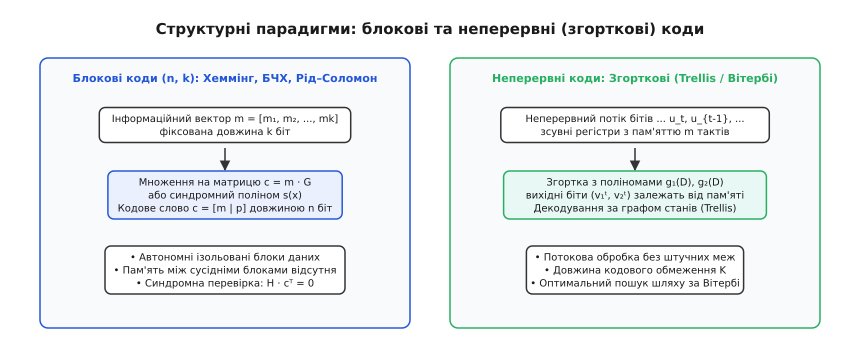
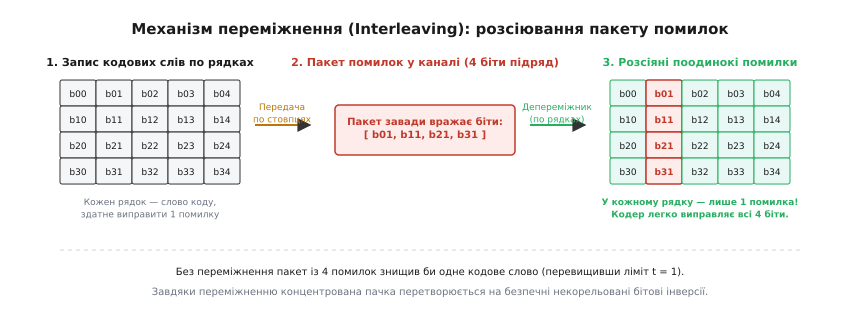
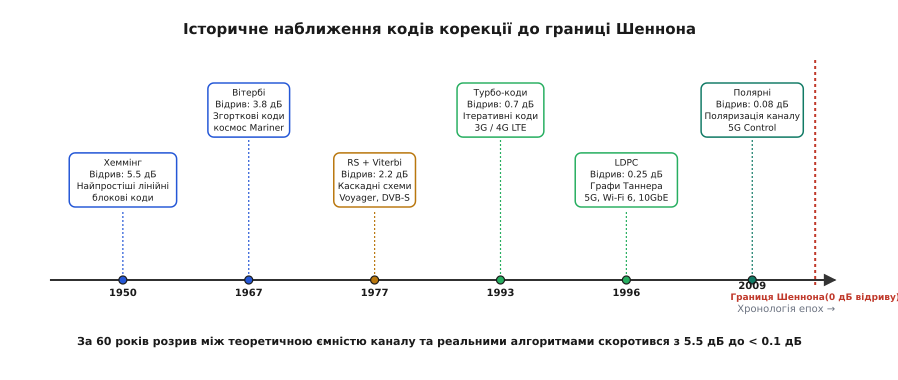

# Коди виправлення помилок (FEC)

<preknowlist>
- [Теорема Шеннона про кодування](topic:math-information/channel-coding-theorem) — межа пропускної здатності зашумленого каналу та існування кодів безпомилкової передачі.
- [Канал з АБГШ](topic:math-information/awgn-channel) — модель адитивного білого гаусового шуму в середовищі поширення.
- [Відстань Хеммінга](topic:com-modulation/hamming-distance) — число відмінних бітових позицій між двома кодовими словами як міра виправної здатності.
- [Крива BER-SNR](topic:com-modulation/ber-snr-curve) — залежність імовірності бітової помилки від енергетичного відношення Eb/N0.
</preknowlist>

Радіосигнал космічного апарата на відстані кількох мільярдів кілометрів досягає земної антени з потужністю, що вимірюється частками піковата, потопаючи в космічному реліктовому шумі. Затримка поширення радіохвилі в один бік становить кілька годин. Якщо передавати зображення або наукову телеметрію без спеціального математичного захисту, кожен сотий біт буде спотворено тепловим рухом електронів у приймачі. Застосувати класичний протокольний перезапит пошкоджених пакетів (ARQ) неможливо: відповідь із підтвердженням прийде лише через пів доби, а зворотний радіоканал на борт апарата має ще меншу пропускну здатність. Єдиний спосіб врятувати дані — закласти в сам потік повідомлення таку надлишкову математичну структуру, яка дозволить приймачеві самостійно обчислити точні позиції спотворених символів та відновити оригінальні біти без жодного звернення до передавача.

Цей підхід називається прямою корекцією помилок (англ. *Forward Error Correction*, FEC). Він лежить в основі всіх сучасних високошвидкісних мереж: від гігабітних радіоінтерфейсів 5G і супутникового інтернету Starlink до магістрального оптичного волокна 400G Ethernet та комірок енергонезалежної пам'яті NVMe SSD.


*Повний тракт передачі інформації з прямою корекцією: кодер формує надлишкові кодові слова, переміжник захищає потік від пакетних завад, а декодер на основі м'яких оцінок каналу реконструює вихідне повідомлення.*

## Чому виявлення помилок не замінює корекцію

У комп'ютерних мережах із локальними дротовими з'єднаннями традиційно домінує механізм виявлення помилок за допомогою контрольних сум або циклічних надлишкових кодів (CRC). Якщо кабель Ethernet або сегмент Wi-Fi зазнає завади, контрольна сума кадру не збігається, приймач відкидає пошкоджений кадр, а протокол транспортного рівня (наприклад, TCP) надсилає запит на повторну передачу (Automatic Repeat reQuest, ARQ).

Проте в реальних каналах зв'язку механізм ARQ стикається з трьома нездоланними бар'єрами:

1. **Односторонні або симплексні канали (Simplex & Broadcast):** При цифровому телевізійному мовленні (DVB-T2, DVB-S2), передачі сигналів супутникової навігації GPS/Galileo або трансляції потокового відео мільйонам абонентів зворотний канал від приймача до передавача фізично відсутній. Передавач не знає, хто саме приймає сигнал, і не може повторювати пакети персонально для кожного клієнта.
2. **Чутливість до затримок у реальному часі (Ultra-Low Latency & Real-Time):** У голосовому зв'язку (VoIP), відеоконференціях, керуванні безпілотними апаратами та промислових мережах 5G URLLC будь-який перезапит кадру додає кругову затримку (Round-Trip Time, RTT). Навіть затримка у 20–50 мс робить передачу відеопотоку непридатною для керування в реальному часі, а в оптичних трансокеанських магістралях повторний запит через океан забирає сотні мілісекунд.
3. **Експоненційний колапс пропускної здатності на зашумлених лініях:** Якщо ймовірність помилки кадру перевищує 10–20%, система на основі ARQ впадає в режим лавинного повторення: лінія забивається копіями тих самих пакетів, а чиста швидкість передачі корисної інформації падає практично до нуля.

Пряма корекція помилок усуває залежність від зворотного каналу. Замість того щоб лише сигналізувати про наявність браку, передавач додає до корисних даних математично узгоджені перевірочні символи. Це перетворює простір дозволених повідомлень на розріджену багатовимірну ґратку, де кожне дозволене кодове слово віддалене від сусідніх на гарантовану відстань.

В інженерній практиці FEC та ARQ не обов'язково конкурують — вони часто об'єднуються в гібридні протоколи HARQ (Hybrid Automatic Repeat reQuest), де FEC виправляє переважну більшість дрібних випадкових спотворень, а ARQ підключається лише в рідкісних випадках катастрофічних глибоких завмирань.

## Фундаментальні параметри: кодова швидкість, відстань Хеммінга та ціна захисту

Будь-яка система прямої корекції помилок характеризується співвідношенням між обсягом корисних даних та обсягом службової інформації.

Вхідне повідомлення розбивається на інформаційні блоки довжиною `k` бітів (або символів). Кодер перетворює кожен такий блок на кодове слово довжиною `n` бітів, де `n > k`. Різниця `r = n - k` становить кількість надлишкових (перевірочних) бітів парності (лат. *redundantia* — надлишок).

Кодова швидкість (Code Rate) `R` показує частку корисної інформації в переданому потоці:

```
R = k / n
```

Якщо кодер видає 4 інформаційні біти на кожні 7 переданих бітів (як у класичному коді Хеммінга), кодова швидкість становить `R = 4/7 ≈ 0.571`. Якщо передається 223 корисних байти в блоці з 255 байтів (як у коді Ріда–Соломона `RS(255, 223)`), швидкість дорівнює `R = 223/255 ≈ 0.875`.

Виправна здатність коду повністю визначається його геометричною структурою в дискретному просторі. Мінімальна [відстань Хеммінга](topic:com-modulation/hamming-distance) `d_min` — це найменша кількість бітових позицій, у яких відрізняються будь-які два дозволені кодові слова даного коду.

Якщо передане кодове слово зазнає `e` бітових інверсій у каналі зв'язку, воно зміщується у векторному просторі на відстань `e`. Якщо зміщене слово не збігається з жодним іншим дозволеним словом, помилка гарантовано *виявляється*. Якщо ж зміщене слово залишається ближчим до оригінального кодового слова, ніж до будь-якого іншого дозволеного вектора в усьому кодовому просторі, помилка однозначно *виправляється* за правилом найближчого сусіда (Maximum Likelihood Decoding).

Звідси випливають фундаментальні співвідношення для виправлення `t` помилок та виявлення `e_det` помилок:

```
t = ⌊(d_min - 1) / 2⌋
e_det = d_min - 1
```

```
d_min = 3  →  виправляє t = 1 помилку  (виявляє до 2 помилок)
d_min = 5  →  виправляє t = 2 помилки  (виявляє до 4 помилок)
d_min = 7  →  виправляє t = 3 помилки  (виявляє до 6 помилок)
```

Захист інформації ніколи не буває безкоштовним. Введення надлишковості `r = n - k` тягне за собою дві неминучі фізичні плати:
1. **Розширення частотної смуги (Bandwidth Expansion):** Щоб передати ту саму швидкість корисних даних `R_b` (біт/с) при кодовій швидкості `R`, передавач змушений випромінювати в ефір або кабель модульовані символи з підвищеною канальною тактовою частотою `R_s = R_b / R`. Для коду зі швидкістю `R = 1/2` смуга частот каналу подвоюється.
2. **Зниження енергії на канальний символ:** Загальна потужність передавача розподіляється між усіма `n` бітами. Тому енергія, що припадає на один канальний символ `E_s`, зменшується пропорційно швидкості: `E_s = R · E_b`. Канальний демодулятор працює в умовах меншого відношення сигнал/шум на кожному окремому біті, ніж у некодованій системі.

Детальний аналітичний розрахунок геометрії багатовимірних сфер Хеммінга та меж надлишковості винесено у математичну вставку [Виведення енергетичного виграшу та меж надлишковості](topic:com-modulation/fec-codes/math-coding-gain.md).

## Енергетичний виграш від кодування (Coding Gain)

Чому ж введення надлишковості, яка знижує енергію символу `E_s`, зрештою виявляється енергетично вигідним?

Відповідь полягає в крутизні кривих імовірності бітової помилки (Bit Error Rate, BER) залежно від відношення енергії на інформаційний біт до спектральної густини шуму `E_b / N_0`.


*Криві ймовірності бітової помилки (BER) для різних систем: некодований сигнал повільно спадає з ростом відношення сигнал/шум, тоді як сучасні коди формують надкрутий «водоспад» поблизу межі Шеннона, забезпечуючи колосальний енергетичний виграш.*

Для некодованого сигналу BPSK у каналі з [адитивним білим гаусовим шумом](topic:math-information/awgn-channel) крива `BER` спадає повільно, підпорядковуючись інтегралу ймовірностей:

```
BER_uncoded = Q(√(2 · E_b / N_0))
```

Щоб досягти надійного зв'язку з рівнем помилок `BER = 10⁻⁵`, некодований передавач вимагає відношення `E_b / N_0 = 9.6 дБ`.

У кодованому потоці кожна помилка декодування виникає лише тоді, коли шум спотворює відразу `t + 1` або більше бітів усередині одного блоку. Імовірність одночасного виникнення групи незалежних помилок спадає експоненційно швидше як `(p)^(t+1)`. Крива кодованого сигналу має набагато крутіший нахил.

Енергетичний виграш від кодування (Coding Gain, `G_c`) визначається як різниця рівнів `E_b / N_0` (у децибелах), необхідних для досягнення цільової якості зв'язку `BER` у кодованій та некодованій системах:

```
G_c [дБ] = (E_b / N_0)_uncoded [дБ] - (E_b / N_0)_coded [дБ]
```

На рівні `BER = 10⁻⁵`:
- Простий код Хеммінга `(7, 4)` забезпечує виграш `G_c ≈ 1.2 дБ`.
- Згортковий код з алгоритмом Вітербі дає виграш `G_c ≈ 4.5–5.5 дБ`.
- Сучасні коди LDPC та Turbo забезпечують феноменальний виграш `G_c ≈ 7.5–9.0 дБ`.

Виграш у `8 дБ` означає, що передавач може випромінювати в **6.3 раза меншу потужність** (або працювати на антену в рази меншого діаметра та живитися від крихітної батареї), зберігаючи ту саму швидкість і надійність передачі.

## Жорстке проти м'якого декодування: детермінізм проти ймовірностей

Приймальний тракт цифрового зв'язку перетворює аналогову напругу з антени чи кабелю на двійкові дані. Залежно від того, на якому етапі аналоговий сигнал дискретизується до нулів та одиниць, декодери FEC поділяються на два принципово різні класи:

### Жорстке декодування (Hard-Decision Decoding)

Демодулятор ухвалює миттєве категоричне рішення щодо кожного отриманого символу: якщо напруга вища за поріг 0 В, на вихід видається логічна `1`, якщо нижча — логічний `0`.

Декодер отримує послідовність жорстких двійкових бітів. Вся інформація про те, наскільки сигнал був близьким до порогу шуму (наприклад, чи це була впевнена напруга +1.2 В, чи сумнівні +0.02 В під впливом сплеску шуму), безповоротно втрачається. Декодер працює виключно в дискретній метриці Хеммінга, підраховуючи кількість незбіжних бітових позицій.

### М'яке декодування (Soft-Decision Decoding)

Демодулятор не відсікає напругу до двійкового значення, а квантує амплітуду з високою роздільною здатністю (зазвичай 4–8 бітів на відлік) або обчислює неперервну ймовірнісну оцінку — [логарифмічне відношення правдоподібностей](topic:math-information/log-likelihood-ratio) (Log-Likelihood Ratio, LLR):

```
LLR(y) = ln( P(y | x = +1) / P(y | x = -1) )
```

Знак LLR вказує на найбільш імовірне значення біта (додатний — `1`, від'ємний — `0`), а абсолютна величина показує рівень достовірності (впевненості) каналу в цьому рішенні: значення `+8.5` свідчить про ідеально чистий сигнал, тоді як `+0.1` вказує на те, що біт перебуває на межі поглинання шумом.

Декодер м'яких рішень враховує достовірність кожного символу. Якщо кодове слово містить дві сумнівні позиції з малим LLR, декодер перевірить саме їх, не чіпаючи символи з високим рівнем довіри.

Фізична перевага м'якого декодування є колосальною: за абсолютно однакової структури коду **м'яке декодування забезпечує додатковий енергетичний виграш у 2–3 дБ** у гаусовому каналі порівняно з жорстким квантуванням. Це еквівалентно подвоєнню ефективної потужності передавача виключно за рахунок збереження аналогової інформації про надійність відліків.

## Дві структурні парадигми: блокові та згорткові коди

Усі класичні алгоритми прямої корекції діляться за способом організації потоку на блокові та неперервні (згорткові) структури.


*Порівняння структурних моделей: блокові коди працюють з автономними фіксованими векторами через матричні перетворення, тоді як згорткові коди неперервно генерують символи за допомогою зсувних регістрів з пам'яттю станів.*

### 1. Лінійні блокові коди (Linear Block Codes)

У блоковому коді `(n, k)` вхідний потік ділиться на ізольовані кадри довжиною `k`. Кодування полягає в множенні інформаційного вектора-рядка `m = [m₁, m₂, ..., m_k]` на породжувальну матрицю (Generator Matrix) `G` розміром `k × n`:

```
c = m · G
```

У систематичній формі перші `k` символів кодового слова точно повторюють вхідні інформаційні біти, а решта `n - k` позицій містять перевірочні біти: `c = [m | p]`.

Перевірка правильності прийнятого вектора `r = c ⊕ e` (де `e` — вектор помилок каналу) здійснюється за допомогою перевірочної матриці на парність (Parity-Check Matrix) `H` розміром `(n - k) × n`, яка за побудовою ортогональна до матриці `G`:

```
G · Hᵀ = 0
```

Приймач множить прийнятий вектор `r` на транспоновану матрицю `Hᵀ`, отримуючи вектор синдрому (грец. *σύνδρομον*, syndromon — збіг, ознака) `s` довжиною `n - k`:

```
s = r · Hᵀ = (c ⊕ e) · Hᵀ = c · Hᵀ ⊕ e · Hᵀ = 0 ⊕ e · Hᵀ = e · Hᵀ
```

Властивості синдрому:
- Якщо помилок у каналі не виникло (`e = 0`), синдром дорівнює строгому нульовому вектору: `s = 0`.
- Синдром залежить **виключно від конфігурації помилок каналу `e`** і взагалі не залежить від того, яке саме повідомлення `m` передавалося.
- За значенням синдрому декодер за таблицею або алгебраїчним рівнянням однозначно обчислює вектор помилок `e`, після чого відновлює істинне кодове слово: `c = r ⊕ e`.

До найвідоміших родин блокових кодів належать:
- [Код Хеммінга](topic:com-modulation/hamming-code): найпростіший код з `d_min = 3`, що виправляє 1 бітову помилку в блоці.
- [Коди БЧХ](topic:com-modulation/bch-codes): потужні циклічні коди, що дозволяють аналітично конструювати блоки з наперед заданою кількістю виправних бітів `t`.
- [Коди Ріда–Соломона](topic:com-modulation/reed-solomon): небінарні коди над байтами або символами скінченного поля `GF(2^m)`, які є кодами з максимальною відстанню (MDS) і забезпечують граничну виправну здатність проти пакетних спотворень.

### 2. Неперервні згорткові коди (Convolutional Codes)

У [згорткових кодах](topic:com-modulation/convolutional-codes) потік бітів не ділиться на окремі автономні блоки. Кодер являє собою лінійний автомат на основі зсувного регістра з пам'яттю `m` комірок і кількох суматорів за модулем 2.

Параметри згорткового коду записуються як `(n, k, K)`:
- `k` — кількість інформаційних бітів, що надходять на вхід за один такт (зазвичай `k = 1`).
- `n` — кількість кодованих бітів, які формуються на виході за один такт (наприклад, `n = 2` для коду зі швидкістю `R = 1/2`).
- `K = m + 1` — довжина кодового обмеження (Constraint Length), що визначає, скільки попередніх тактів інформаційного потоку впливають на поточні вихідні символи.

Функціонування згорткового кодера описується імпульсними характеристиками суматорів або генераторними поліномами зв'язку. Наприклад, для стандартного коду NASA `(2, 1, 7)` поліноми записуються у вісімковій формі як `g₁ = 171₈ = 1111001₂` та `g₂ = 133₈ = 1011011₂`.

Декодування згорткових кодів виконується за алгоритмом Вітербі. Алгоритм розгортає роботу кодера в часі у вигляді решітчастого графа станів (Trellis) і знаходить наскрізний шлях через решітку, який має мінімальну накопичену метрику невідповідності (відстань Хеммінга для жорстких рішень або квадратичну евклідову відстань для м'яких відліків).

## Перфорація та узгодження швидкостей (Puncturing & Rate Matching)

На практиці інженерним системам потрібні не лише базові швидкості кодування на зразок `R = 1/2` чи `R = 1/3`, але й гнучкий набір проміжних швидкостей: `R = 2/3, 3/4, 5/6, 7/8`.

Створювати окремий складний апаратний кодер і декодер для кожної потрібної швидкості надто дорого. Замість цього застосовують технологію **перфорації (Puncturing)**:
1. Базовий материнський кодер (Mother Code) завжди генерує надлишковий потік із низькою швидкістю (наприклад, `R = 1/2`).
2. Блок перфорації передавача вибірково відкидає частину перевірочних бітів за детермінованою періодичною бітовою маскою (Puncturing Matrix), не відправляючи їх в ефір. Швидкість потоку зростає до `R = 3/4` або `5/6`.
3. На приймачі блок деперфорації (Depuncturing) вставляє на місця пропущених бітів нейтральні «стерті» відліки з нульовою достовірністю (`LLR = 0`).
4. Стандартний декодер (Вітербі або LDPC) декодує отриманий потік за незмінним базовим алгоритмом, сприймаючи відкинуті біти як випадкові стирання каналу.

Це дозволяє будувати уніфіковані мікросхеми модемів, які миттєво змінюють ступінь захисту кадру без переналаштування обчислювального ядра.

## Захист від пакетів помилок: переміжнення (Interleaving) та каскадні схеми

Більшість класичних кодів корекції (Хеммінга, БЧХ, згорткові коди) створювалися в припущенні, що помилки в каналі є статистично незалежними. Проте в реальних мережах завади завжди мають корельований пакетний характер (Burst Errors):
- Грозові розряди та індустріальні електромагнітні імпульси вибивають десятки мікросекунд неперервного сигналу.
- Швидкі релеєвські завмирання в мобільному радіоканалі спричиняють глибокі провали амплітуди на час проїзду тіньової зони.
- Механічні подряпини на поверхні оптичного диска або дефекти кремнієвого шару flash-пам'яті пошкоджують сотні суміжних бітів.

Якщо в канал із кодом Хеммінга `(7, 4)`, здатним виправляти лише `t = 1` помилку, прийде короткий сплеск завади довжиною всього 3 біти підряд, він гарантовано знищить кодове слово.

Щоб подолати цю проблему, застосовують операцію **переміжнення (Interleaving)**.


*Принцип роботи матричного переміжника: кодові слова записуються в буфер по рядках, а в канал вичитуються по стовпцях. Коли концентрований пакет завади руйнує 4 біти поспіль у каналі, депереміжник на приймачі розкидає ці помилки рівно по одній у 4 різні кодові слова, дозволяючи кодеру легко їх виправити.*

Переміжник переставляє біти вихідного потоку за детермінованим алгоритмом перед відправкою в канал. На приймачі зворотний блок — депереміжник (De-interleaver) — повертає біти на їхні законні вихідні позиції.

Коли неперервний пакет із `L` помилок проходить крізь депереміжник, він виявляється «розмазаним» по довгому інтервалу часу: концентрована пачка перетворюється на серію поодиноких рідкісних помилок, розділених тисячами чистих символів. Для кожного окремого кодового слова ці помилки виглядають як некорельований білий шум і бездоганно виправляються декодером.

Повний розбір математичних властивостей моделі каналу з пам'яттю дивіться у темі [Пакети помилок](topic:com-modulation/burst-error) та [Переміжнення](topic:com-modulation/interleaving).

### Каскадні коди (Concatenated Codes)

Поєднання різних типів кодів через переміжник привело до створення класичних [каскадних схем](topic:com-modulation/concatenated-codes) (схема Форні):
- **Зовнішній код (Outer Code):** Потужний небінарний блоковий код Ріда–Соломона `RS(255, 223)`.
- **Проміжний переміжник:** Розсіює будь-які групові залишки помилок.
- **Внутрішній код (Inner Code):** Згортковий код зі швидкістю `R = 1/2` або `3/4` та м'яким декодуванням за Вітербі.

Внутрішній згортковий код ефективно «зчищає» основну масу гаусового шуму низького рівня, піднімаючи якість каналу. Якщо ж виникає сплеск, з яким алгоритм Вітербі не справляється (генеруючи на виході короткий спалах помилок), переміжник розсіює його, а зовнішній код Ріда–Соломона остаточно ліквідує всі залишки, гарантуючи рівень помилок `BER < 10⁻¹²`. Ця каскадна архітектура була стандартом космічного зв'язку NASA в місіях Voyager та Galileo і лягла в основу першого стандарту супутникового телебачення DVB-S.

## Сучасна епоха: наближення до межі Шеннона (Turbo, LDPC, Polar)

Протягом 45 років після публікації Шеннона найкращі каскадні коди зупинялися на відстані близько 2.0–2.5 дБ від теоретичної межі пропускної здатності. Прорив стався у 1990–2000-х роках із відкриттям ітеративних графів та поляризації каналів.


*Історичний поступ: від перших лінійних кодів Хеммінга з відривом у 5.5 дБ до сучасних полярних кодів та LDPC, які досягають фізичної границі Шеннона з точністю до десятих часток децибела.*

### 1. Турбо-коди (Turbo Codes)

Створені у 1993 році французькими дослідниками Клодом Берру, Аленом Главьє та Пунья Тітімаджимою, [турбо-коди](topic:com-modulation/turbo-codes) побудовані на паралельному об'єднанні двох рекурсивних згорткових кодерів через випадковий переміжник.

Декодування виконується не за один прохід, а ітеративно (лат. *iteratio* — повторення): два компоненти алгоритму BCJR (Maximum A Posteriori, MAP) обмінюються між собою зовнішньою ймовірнісною інформацією (Extrinsic LLR) протягом 4–8 циклів, поступово уточнюючи достовірність кожного біта за принципом зворотного зв'язку. Турбо-коди вперше в історії підійшли до межі Шеннона на відстань **0.5–0.7 дБ** і стали основою мобільних стандартів 3G UMTS та 4G LTE.

### 2. Коди з малою щільністю перевірок на парність (LDPC)

Винайдені Робертом Галлагером у 1962 році та заново відкриті у 1996 році, коди [LDPC](topic:com-modulation/ldpc) базуються на гігантських розріджених перевірочних матрицях `H`, що задаються двочастковими графами Таннера.

Декодування виконується методом паралельної передачі повідомлень (Belief Propagation / Sum-Product): вузли графа одночасно перераховують і передають ребрами оцінки ймовірностей. Завдяки тому, що граф Таннера може бути фізично реалізований на кристалі ASIC у вигляді тисяч паралельно працюючих мікропроцесорних вузлів, коди LDPC забезпечують екстремальну пропускну здатність (понад 100 Гбіт/с) при відстані до межі Шеннона всього **0.15–0.3 дБ**. Вони стандартизовані в Wi-Fi 6/7 (802.11ax/be), 10G/400G Ethernet, DVB-S2X та каналах даних eMBB мобільного зв'язку 5G NR.

### 3. Полярні коди (Polar Codes)

Відкриті у 2008 році професором Ердалом Аріканом, [полярні коди](topic:com-modulation/polar-codes) стали першим у світовій науці класом кодів, для яких **математично строго доведено досягнення ємності Шеннона** для довільного симетричного дискретного каналу без пам'яті при детермінованій поліноміальній складності обчислень `O(N log N)`.

Принцип поляризації полягає в рекурсивному лінійному об'єднанні `N` однакових фізичних каналів зв'язку у віртуальні синтетичні підканали. При збільшенні розміру блоку підканали зазнають фазового розшарування: частина з них прямує до ідеального стану без шуму (ємність дорівнює 1), а решта — до повністю непридатного стану (ємність дорівнює 0). Інформаційні біти передаються виключно через надійні канали, а ненадійні канали заповнюються відомими фіксованими нулями («заморожені біти», Frozen Bits). Завдяки відсутності явища порогу помилок (Error Floor) на малих блоках полярні коди зі списковим декодуванням (SCL-CRC) стали стандартом 5G NR для каналів сигналізації та керування (PDCCH/PUCCH).

Повну історію наукової боротьби та наукових відкриттів від перших ідей Шеннона до полярних кодів читайте у вставці [Еволюція від ідеї Шеннона до полярних кодів](topic:com-modulation/fec-codes/hist-shannon-to-polar.md).

## Інженерний вибір та порівняння родин FEC

Під час проектування мережевих протоколів та радіомодемів вибір алгоритму кодування визначається технічними вимогами кінцевої системи:

1. **Короткі кадри керування та висока надійність (5G Control, IoT, супутникові команди):** Застосовують **Полярні коди** або укорочені **коди БЧХ**. На довжинах блоків 64–512 бітів вони перевершують турбо-коди та LDPC, забезпечуючи високу швидкість сходження без виникнення залишкового фону помилок.
2. **Ультрависокі швидкості потоку даних (5G eMBB, Wi-Fi 7, 400G Ethernet):** Застосовують **LDPC**. Тільки паралельна решітка обчислювачів графа Таннера здатна перекачувати десятки гігабітів за секунду при мінімальному енергоспоживанні на біт.
3. **Енергонезалежні носії та оптичні інтерфейси (NAND Flash, OTN G.709, HDD):** Застосовують каскади **Reed-Solomon + BCH** або квазіциклічні **QC-LDPC**. Вони гарантують стійкість до зношення комірок пам'яті та детермінований час обробки без затримок ітеративного сходження.
4. **Потокове відео та прості мікроконтролерні радіолінки (GSM, LoRa, безпілотна телеметрія):** Застосовують **Згорткові коди** з м'яким декодером Вітербі або прості каскадні схеми. Вони мають мінімальну апаратну складність і не потребують ресурсомістких матричних обчислень.

Детальне матричне порівняння параметрів, обчислювальної складності та апаратних витрат усіх родин кодування наведено в інженерному огляді [Порівняння родин FEC у сучасних стандартах](topic:com-modulation/fec-codes/comp-fec-families.md).

Практичний приклад побудови повноцінного програмного тракту з кодером Хеммінга, матричним переміжником та симуляцією пошкодження каналу мовами C та C++ подано у вставці [Програмна реалізація конвеєра FEC з переміжником](topic:com-modulation/fec-codes/proj-fec-pipeline.md).

> 🔧 **Навіщо це в реальній розробці.**
> У сучасних бездротових мережах (LTE, 5G NR, Wi-Fi 6) параметри FEC не є статичними: вони динамічно змінюються щомілісекунди в рамках механізму адаптивної модуляції та кодування (Adaptive Modulation and Coding, AMC).
> Базова станція вимірює якість каналу за зворотними звітами абонента (Channel Quality Indicator, CQI) і за спеціальною таблицею MCS (Modulation and Coding Scheme) миттєво перемикає кодову швидкість:
> - Якщо абонент перебуває поруч із вишкою (високий SNR), призначається модуляція 256-QAM та висока кодова швидкість `R = 0.92` (мінімальний захист, максимальний бітрейт).
> - Коли абонент заходить у підвал або віддаляється на край стільника (низький SNR), базова станція миттєво знижує модуляцію до QPSK і вмикає агресивне кодування зі швидкістю `R = 0.15` (до 85% канального ресурсу віддається під надлишкові біти корекції). Завдяки цьому зв'язок не обривається навіть тоді, коли корисний сигнал повністю потопає в шумах ефіру.
