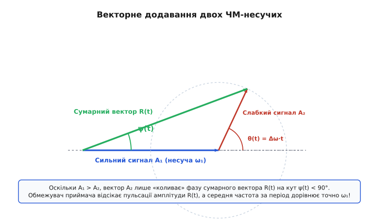
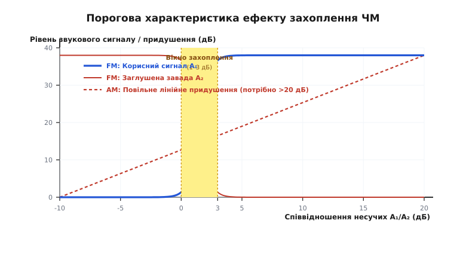
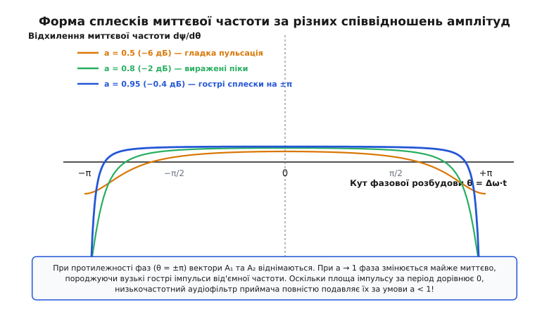

# Ефект захоплення FM

<preknowlist>
- [AM і FM](root:com-modulation/am-fm) — відмінності між амплітудною та частотною модуляцією, принцип роботи ЧМ-детектора.
- [Сума та модуляція сигналів](root:com-modulation/fsk-psk) — векторний аналіз фазорів та додавання синусоїд.
</preknowlist>

Якщо дві радіостанції виходять в ефір на однаковій частоті в амплітудній модуляції (AM), слухач чує обидва голоси одночасно, накладені один на одного з дратівливим високочастотним свистом биття. Але якщо ті самі дві станції увімкнути на одній частоті в частотній модуляції (FM), приймач поводиться принципово інакше: він повністю пригнічує слабшу станцію й відтворює лише чистий звук сильнішої. Слабший сигнал не створює тріску, не звучить на задньому плані й вилазить лише тоді, коли співвідношення їхніх амплітуд стає майже однаковим. Це явище порогового вибіркового придушення називають **ефектом захоплення** (від лат. *captura* — «захоплення»; англ. *FM capture effect*).

Ефект захоплення є не стихійною властивістю ефіру, а прямим наслідком нелінійної обробки сигналу в тракті ЧМ-приймача. Поєднання жорсткого амплітудного обмежувача та частотного дискримінатора створює математичний механізм, який перетворює відносну фазову заваду на вузькі високочастотні сплески, що легко відсікаються аудіофільтром.

### 1. Два сигнали на одній частоті: чому FM поводиться не так, як AM

У радіозв'язку ситуація, коли два передавачі випромінюють радіохвилі на одній несучій частоті, називається **одноканальною завадою** або **коканальною перешкодою** (*co-channel interference*). Поведінка приймача при цьому повністю визначається способом модуляції.

При амплітудній модуляції огинаюча сумарного сигналу дорівнює прямій алгебраїчній сумі огинаючих обох сигналів. Якщо корисний сигнал `s₁(t)` має амплітуду `A₁`, а завада `s₂(t)` має амплітуду `A₂`, то лінійний детектор огинаючої (звичайний діод із конденсатором) випрямляє й відтворює обох учасників ефіру:

```
s_demod_AM(t) = A₁ · m₁(t) + A₂ · m₂(t) + A₁·A₂ · cos(Δω·t)
```

де `m₁(t)` та `m₂(t)` — аудіосигнали обох станцій, а `Δω = ω₂ − ω₁` — різниця їхніх несучих частот. Звідси випливають дві фундаментальні проблеми AM:
1. **Змішування звуку:** Якщо `A₁` лише вдвічі більше за `A₂` (різниця рівнів 6 дБ), завада `m₂(t)` чутна на задньому плані з гучністю 50% від корисного звуку. Щоб придушити заваду до непомітного рівня, потрібне співвідношення потужностей несучих понад 20–30 дБ (у 100–1000 разів за потужністю).
2. **Свист биття (гетеродинне биття):** Різниця несучих частот `Δω` утворює звуковий тон (наприклад, 1 кГц), який безперервно пищить у динаміку.

У частотній модуляції інформація закладена не в амплітуді, а в миттєвій частоті хвилі. Приймач ЧМ містить **амплітудний обмежувач** (*limiter*), який зрізає всі коливання амплітуди, перетворюючи хвилю на сигнал зі сталою висотою. Коли два ЧМ-сигнали додаються векторно, слабший вектор `A₂` лише злегка гойдає фазу сильнішого вектора `A₁`. Оскільки `A₁ > A₂`, фазове відхилення не може вийти за межі `±90°`, і середня частота за період биття дорівнює точно частоті сильнішого сигналу. Приймач мовби «зачіпляється» за сильніший сигнал і придушує слабший.

> 🔧 **Навіщо це.** Вражаюча якість і чистий звук цивільного FM-радіомовлення (88–108 МГц) завдячують саме ефекту захоплення: дві міські FM-станції в сусідніх областях можуть працювати на одній частоті, бо на межі покриття приймач у машині чітко обирає ту станцію, чий сигнал бодай на 2 дБ сильніший. Проте у **цивільній авіації** (діапазон VHF 118–137 МГц) свідомо використовують «застарілу» AM! Причина полягає саме у безпеці: якщо два пілоти одночасно почнуть говорити з диспетчером на одній частоті в FM, диспетчер почує лише одного (сильнішого) і навіть не дізнається, що другий пілот передав критичне повідомлення. У AM диспетчер почує обох пілотів, накладених разом із характерним писком биття, зрозуміє, що сталася накладка («накладення ефіру»), і накаже повторити виклик.

### 2. Фізичний механізм: від фазорної суми до амплітудного обмежувача

Щоб зрозуміти глибоку математичну природу захоплення, роздивимося векторну (фазорну) діаграму додавання двох гармонічних коливань.

Нехай на вхід приймача надходять два коливання:

```
s₁(t) = A₁ · cos(ω₁·t + φ₁(t))
s₂(t) = A₂ · cos(ω₂·t + φ₂(t))
```

де `A₁ > A₂`. Зобразимо перший сигнал у вигляді вектора `A₁`, що обертається з частотою `ω₁`, а другий — як вектор `A₂`, приєднаний до кінця вектора `A₁`, який обертається відносно нього з відносною кутовою швидкістю биття `θ(t) = Δω·t + (φ₂ − φ₁)`.


*Складний сигнал R(t) утворюється векторним додаванням сильного вектора A₁ та слабкого A₂. Оскільки A₁ > A₂, вектор A₂ лише описує коло навколо вершини A₁, коливаючи сумарну фазу на обмежений кут ψ(t). Обмежувач приймача зрізає зміни довжини R(t), залишаючи лише кут ψ(t).*

Сумарне коливання дорівнює:

```
s(t) = R(t) · cos( ω₁·t + φ₁(t) + ψ(t) )
```

де амплітуда огинаючої `R(t)` та кут фазового відхилення `ψ(t)` обчислюються з прямокутного трикутника:

```
R(t) = √[ A₁² + A₂² + 2·A₁·A₂ · cos θ(t) ]

tan ψ(t) = (A₂ · sin θ(t)) / (A₁ + A₂ · cos θ(t)) = (a · sin θ(t)) / (1 + a · cos θ(t))
```

де `a = A₂ / A₁ < 1` — відношення амплітуд.

Тепер простежимо шлях сигналу крізь блоки приймача:

1. **Амплітудний обмежувач:** Вхідний сигнал `s(t)` проходить крізь підсилювач-обмежувач зі зрізанням верхівок. Ампітуда `R(t)` повністю знищується і стає сталою `E₀`. На виході обмежувача лишається чиста хвиля `E₀ · cos(ω₁·t + φ₁(t) + ψ(t))`.
2. **Частотний дискримінатор (демодулятор):** Демодулятор вимірює миттєву частоту, тобто повну похідну фази по часу:

```
ω_inst(t) = d/dt [ ω₁·t + φ₁(t) + ψ(t) ]
          = ω₁ + dφ₁/dt + dψ/dt
```

Похідна фазового зсуву `dψ/dt` є завадою, яку створює слабкий сигнал `A₂`. За допомогою диференціювання тригонометричного арктангенса отримуємо точний вираз для миттєвої розбудови частоти:

```
dψ/dt = (dθ/dt) · [ (a² + a·cos θ) / (1 + a² + 2a·cos θ) ]
```

Аналіз цього виразу відкриває ключовий факт: функція `dψ/dt` є періодичною по `θ` з періодом `2π`. Якщо обчислити **середнє значення** цієї завади за один повний період биття `θ ∈ [−π, π]`, то для будь-якого `a < 1` інтеграл дорівнює **точно нулю**!

```
⟨ dψ/dt ⟩ = 0   при a < 1  (A₁ > A₂)
```

Детальне алгебраїчне та комплексно-аналітичне виведення цього інтеграла наведено у вставці [Математичний аналіз і виведення миттєвої частоти завади](root:com-modulation/fm-capture-effect/math-capture-derivation.md).

Це означає, що завада `dψ/dt` не змінює середню частоту хвилі. Вона є високочастотною пульсацією, енергія якої зосереджена на частотах биття `Δω`. Після того як демодульований сигнал проходить через аудіофільтр низьких частот (ФНЧ) з межею ~15 кГц, ці високочастотні пульсації повністю згладжуються, і на динамік подається виключно корисний аудіосигнал `dφ₁/dt` першої станції!

### 3. Коефіцієнт захоплення (Capture Ratio) та поріг розділення

Здатність ЧМ-приймача відокремлювати сильніший сигнал від слабшого характеризують технічним параметром, який називається **коефіцієнтом захоплення** (*capture ratio*).

> **Коефіцієнт захоплення (Capture Ratio)** — це мінімальне співвідношення потужностей (або напруг у дБ) двох сигналів на одній частоті на вході приймача, за якого приймач придушує слабший сигнал на виході щонайменше на 30 дБ.

Чим менше значення коефіцієнта захоплення у децибелах, тим досконалішим є приймач.


*Порівняння порогових характеристик AM та FM. У той час як в AM придушення завади зростає повільно й лінійно (потрібно понад 20 дБ для чистого звуку), у FM спостерігається стрімкий пороговий стрибок: при перетині вікна захоплення (1–3 дБ) слабший сигнал пригнічується понад 30 дБ.*

Типові значення коефіцієнта захоплення для різних класів апаратури:
- **Високоякісні побутові FM-тюнери та SDR-приймачі:** `1.0` – `1.5` дБ.
- **Стандартні автомобільні радіоприймачі:** `2.0` – `3.0` дБ.
- **Портативні мильниці та дешеві рації:** `4.0` – `6.0` дБ.
- **Приймачі AM (для порівняння):** `20` – `30` дБ.

Що відбувається у вузькій зоні, коли `A₁` майже дорівнює `A₂` (тобто `a ≈ 1` або відношення близько `0` дБ)?

При `a = 1.0` вектори `A₁` та `A₂` стають рівними. У момент, коли вони опиняються у протифазі (`θ = ±π`), їхня сума `R(t) = A₁ + A₂·cos(π) = 0` опускається до абсолютного нуля! Амплітуда сигналу зникає, а фаза сумарного вектора змінюється **стрибком на 180°**.

Похідна фази `dψ/dt` у цей момент перетворюється на вузькі від'ємні імпульси нескінченної амплітуди (дельта-функції). Приймач утрачає орієнтир: середня частота на мить стає невизначеною, і в динаміку лунає різкий сухий тріск або хрип. Якщо амплітуда `A₂` стане бодай на 0.1 дБ більшою за `A₁` (`a > 1`), середня похідна `⟨ dψ/dt ⟩` миттєво стрибає від `0` до `1`. Приймач миттєво перемикається і починає відтворювати аудіосигнал другого передавача `dφ₂/dt`, повністю пригнічуючи перший!

Цю різку порогову зміну режиму розробив і вперше продемонстрував винахідник частотної модуляції, про що детально описано в історичному нарисі [Історія відкриття Едвіном Армстронгом](root:com-modulation/fm-capture-effect/hist-armstrong-capture.md).

### 4. Схематотехніка та параметри приймача, що визначають коефіцієнт захоплення

Коефіцієнт захоплення FM-приймача не є фіксованою константою лише самої модуляції — він суттєво залежить від якості та схемотехніки побудови радіочастотного тракту:

1. **Динамічний діапазон і швидкість обмежувача:** Якщо амплітудний обмежувач не встигає відпрацьовувати глибокі пульсації огинаючої `R(t)`, що відбуваються з частотою биття `Δω` (яка може сягати сотень кілогерц при девіації ±75 кГц), залишки амплітудної модуляції проникають у дискримінатор. Це явище називають **перетворенням AM в ЧМ** (*AM-to-PM conversion*). Досконалий обмежувач повинен мати коефіцієнт амплітудного придушення не менше 40–50 дБ у всій смузі ПЧ.
2. **Смуга пропускання тракту проміжної частоти (ПЧ):** Коли вектори опиняються у протифазі (`a ≈ 1`), миттєва частота робить глибокий сплеск вниз. Якщо смуга фільтра ПЧ занадто вузька, вона зрізає ці спектральні гармоніки сплеску, що призводить до викривлення симетрії пульсацій та погіршення придушення завади.
3. **Лінійність частотного дискримінатора:** Дискримінатор повинен зберігати суворо лінійну характеристику в межах значно ширшої смуги, ніж номінальна девіація сигналу, щоб розмах фазових сплесків не викликав нелінійного обмеження та зсуву нульового рівня.
4. **Тип частотного демодулятора:**
   - **Фазовий дискримінатор Фостера-Сілі (*Foster-Seeley discriminator*):** Вимагає перед собою ідеального зовнішнього обмежувача. При якісному обмежувачі забезпечує коефіцієнт захоплення `1.5–2.5` дБ.
   - **Дробний детектор (*Ratio detector*):** Завдяки власному згладжувальному конденсатору самостійно пригнічує амплітудні пульсації, але має ширше вікно захоплення `3–5` дБ.
   - **Цифровий квадратурний IQ-демодулятор (*Digital Quadrature Demodulator*):** Виконує обчислення у математично ідеальному середовищі з нормуванням вектора `S / |S|`, забезпечуючи межевий коефіцієнт захоплення до `1.0–1.2` дБ.

### 5. Різниця між широкосмуговою (WFM) та вузькосмуговою (NFM) ЧМ

Ширина смуги модуляції має вирішальне значення для прояву ефекту захоплення. 

У **широкосмуговій ЧМ** (*Wideband FM*, WFM), яка використовується у радіомовленні на 88–108 МГц:
- Девіація частоти становить `±75` кГц, а повна смуга каналу — близько `200` кГц.
- Індекс модуляції `β = ΔF_dev / f_audio = 75 / 15 = 5 ≫ 1`.
- Оскільки енергія сигналу розмазана по широкому спектру, фазові сплески завади мають високу частоту повторення й відносно малу питому енергію у звуковому діапазоні. Приймач придушує слабший сигнал вже при відношенні `1.5–2.0` дБ.

У **вузькосмуговій ЧМ** (*Narrowband FM*, NFM), яка використовується у професійних раціях, раціях охоронців, служб порятунку та раціях ралійних авто:
- Девіація частоти становить всього `±2.5` кГц або `±5.0` кГц, а смуга каналу — `12.5` кГц або `25` кГц.
- Індекс модуляції `β = 2.5 / 3.0 ≈ 0.83 < 1`.
- У вузькосмуговій ЧМ ефект захоплення виражений суттєво слабше: коефіцієнт захоплення погіршується до `4–7` дБ. При слабких рівнях сигналу завада проявляється у вигляді характерного гудіння або клацань, а не повного беззвучного зникнення.

### 6. Ефект захоплення у цифрових модуляціях (FSK, MSK, Bluetooth, LoRa)

Хоча ефект захоплення вивчають на аналоговому ЧМ-радіомовленні, той самий фізичний механізм відіграє вирішальну роль у цифрових радіоканалах з частотною або фазовою маніпуляцією:

1. **FSK і GFSK (Bluetooth, рації телеметрії AX.25):** У протоколі Bluetooth (який використовує GFSK-модуляцію) ефект захоплення дозволяє приймачу декодувати пакет від ближчого пакета-джерела без помилок, навіть якщо водночас інший пристрій транслює на тій самій частоті, якщо відношення потужностей перевищує 2–4 дБ.
2. **LoRa (Chirp Spread Spectrum, CSS):** У зв'язку LoRa використовують модульовані чирпи (лінійну зміну частоти). Завдяки спектральному обмежувачу та когерентній кореляції приймач LoRa володіє коефіцієнтом захоплення близько `1–2` дБ: при накладанні двох пакетів LoRa на однаковому розширювальному коефіцієнті (SF) сильніший пакет декодується зі 100% успіхом.

### 7. Темний бік захоплення: багатопроменеве замирання та сплески завад

Хоча ефект захоплення чудово захищає від сторонніх радіостанцій, у нього є зворота затінена сторона — **багатопроменеве спотворення** (*multipath distortion*).

Коли автомобіль із FM-приймачем їде містом із високою забудовою або гірською місцевістю, антена отримує не лише прямий промінь від радіовежі `s₁(t)`, але й відбитий від хмарочосів чи скель промінь `s₂(t)`. Відбитий промінь є точною копією прямого, але затриманий у часі на `τ` та ослаблений.


*Форма відхилення миттєвої частоти dψ/dθ протягом періоду биття. При a = 0.5 завада є м'якою синусоїдою. При наближенні a → 0.95 завада трансформується у гострі від'ємні піки при θ = ±π. Ці сплески викликають характерний тріск при багатопроменевому прийомі.*

Залежно від співвідношення амплітуд `a = A_відб / A_прям`:

1. **Якщо прямий промінь значно сильніший (`a < 0.7`):** Ефект захоплення працює на користь слухача. Приймач захоплює прямий промінь і повністю ігнорує відбитий. Звук ідеально чистий.
2. **Якщо відбитий промінь майже зрівнявся з прямим (`a ≈ 0.8` – `0.98`):** Приймач потрапляє в критичну зону биття. При протифазі прямого й відбитого променів миттєва частота утворює гострі глибокі від'ємні сплески. Хоча їхнє середнє значення дорівнює нулю, частина енергії цих імпульсів потрапляє у звуковий діапазон і викликає дратівливий хрипкий тріск, який водії називають «дерев'яним парканом» (*picket fencing*) — звук нагадує шурхіт палиці по штахетинах під час руху автомобіля.
3. **Якщо відбитий промінь на мить стає сильнішим (`a > 1.0`):** Приймач миттєво «захоплює» відбитий сигнал. Оскільки відбитий сигнал затриманий у часі, фазова модуляція рветься, викликаючи сильні нелінійні спотворення звуку.

### 8. Вплив у цифровому DSP та SDR-приймачах

У сучасних цифрових радіосистемах та програмно-визначеному радіо (SDR) демодуляція ЧМ здійснюється не аналоговими контурами, а цифровими процесорами сигналів (DSP).

Стандартний цифровий квадратурний демодулятор отримує відліки комплексного сигналу `I[k] + j·Q[k]` і обчислює різницю фаз сусідніх відліків:

```
Δφ[k] = arg( S[k] · S*[k-1] )
```

де `S*[k-1]` — комплексно-спряжений попередній відлік.

У цифровому середовищі ефект захоплення виникає математично точно так само, як і в аналоговому схемотехнічному обмежувачі:
- **Нормування вектору:** Операція `S[k] / |S[k]|` виконує роль ідеального амплітудного обмежувача.
- **Цифрова фільтрація сплесків:** Оскільки фазові імпульси при `a → 1` мають ширину в кілька відліків дискретизації `F_s`, цифровий ФНЧ-фільтр (КІХ або БІХ) на виході демодулятора зрізає високочастотні компоненти сплесків.

Більше того, у сучасних SDR-системах розробляють спеціальні алгоритми **придушення ефекту захоплення** (*capture effect mitigation*) або **розділення одноканальних сигналів** (*co-channel signal separation*). Якщо приймач має достатню обчислювальну потужність, він може виміряти амплітудні пульсації огинаючої `R[k]` *до* обмежувача, обчислити параметри слабшого сигналу `A₂` та `ω₂`, адаптивно відніняти його вектор у цифровому вигляді й дістати навіть той слабкий сигнал, який звичайний FM-приймач безжалісно знищив би.

Практичну програмну реалізацію моделювання взаємодії двох сигналів, роботи обмежувача та демодулятора мовами Python та C++ наведено у вставці [Симуляція ефекту захоплення в ДСП](root:com-modulation/fm-capture-effect/proj-capture-simulation.md).
