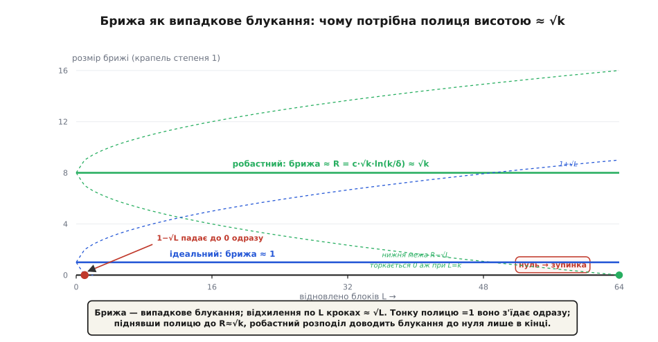
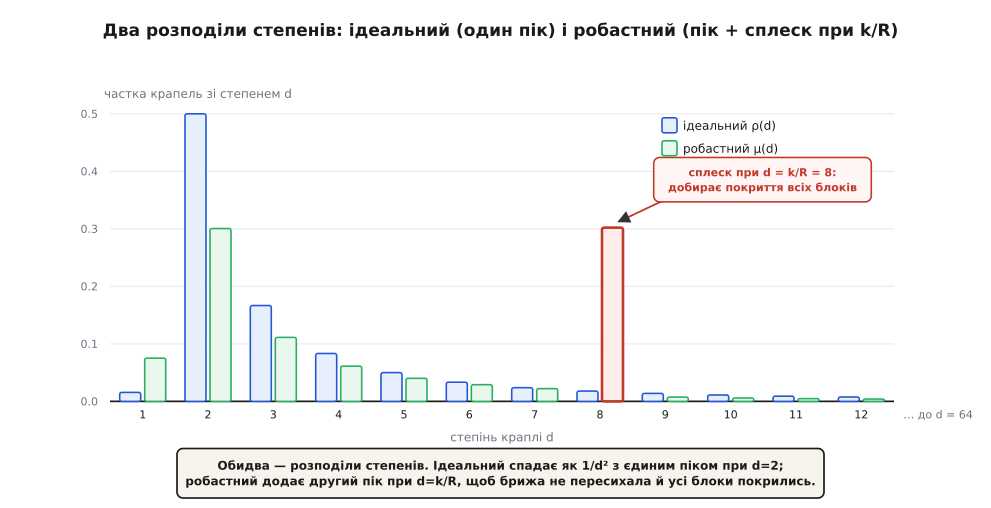

# 🧮 Математика солітонного розподілу

Увесь фонтан тримається на одному числі для кожного степеня — на розподілі степенів крапель, і тут ми виводимо обидві його версії точно й показуємо, чому форма не могла бути іншою. Ідеальний розподіл народжується з єдиної вимоги «вливати рівно одну краплю за крок», а робастний — з вимоги «вижити попри випадковість».

Домовмося про сцену, на якій усе відбувається. Декодер відновлює блоки по одному; на кожному кроці він бере одну краплю степеня 1 (вона дорівнює рівно одному ще невідомому блоку), відновлює цей блок і викидає краплю. Аби процес не спинявся, замість спожитої краплі має щокроку звільнятися приблизно одна нова: коли якийсь блок стає відомим, його вирізають XOR-ом з інших крапель, і деякі з них падають зі степеня 2 до степеня 1. Множину готових крапель степеня 1 звуть брижею (англ. ripple). Питання одне: який розподіл степенів тримає брижу живою?

## Ідеальний розподіл: вимога сталого припливу

Опишімо випадковість чесно. Хай крапель усього n, степінь кожної тягнеться з розподілу ρ, а її d сусідів — рівномірно випадкова d-підмножина з k блоків. Блоки відновлюються у випадковому порядку; перенумеруймо кроки часткою вже відновленого p — від 0 до 1.

Кожен із d сусідів краплі відкривається у свій момент pᵢ ∈ [0, 1], і всі ці моменти незалежні та рівномірні. Крапля вливається в брижу тієї миті, коли відкрився її **передостанній** сусід: доти вона мала двох невідомих сусідів, тепер лишився один — степінь став 1. Передостанній із d рівномірних моментів — це (d−1)-ша порядкова статистика, і її щільність відома точно:

```
щільність вливання однієї краплі степеня d (у частці p):

    g_d(p) = d·(d−1)·p^(d−2)·(1−p)

    d·(d−1) — вибір, який сусід останній і який передостанній;
    p^(d−2) — решта d−2 сусідів уже відкриті;
    (1−p)   — останній сусід ще закритий.
```

Складімо приплив від усіх n крапель і зажадаймо від нього сталості. Один відновлений блок посуває частку на Δp = 1/k; вимога «рівно одна крапля на крок» дає рівняння на сумарну щільність:

```
сумарна щільність вливання:

    G(p) = n·(1−p)·∑_{d≥2} ρ(d)·d·(d−1)·p^(d−2)

вимога «одна крапля на крок»:  G(p)·(1/k) = 1   →   G(p) = k   для БУДЬ-ЯКОГО p
```

Ось звідки береться форма розподілу. Щоб G(p) не залежало від p, множник (1−p) мусить із чимось скоротитися, а скоротити його може лише ряд, що дорівнює 1/(1−p):

```
∑_{d≥2} ρ(d)·d·(d−1)·p^(d−2)  =  const/(1−p)  =  const·∑_{m≥0} p^m

порівняймо коефіцієнти при p^(d−2):

    ρ(d)·d·(d−1) = const     для КОЖНОГО d
    →   ρ(d) = const / (d·(d−1))
```

Форма 1/(d(d−1)) — не здогад, а єдиний розв'язок вимоги сталого припливу. Сталу const закріпить нормування, і воно розкриває красиво — телескопом:

```
∑_{d=2}^{k} 1/(d(d−1)) = ∑_{d=2}^{k} (1/(d−1) − 1/d) = 1 − 1/k

сумі до одиниці бракує рівно 1/k — і це якраз крапля степеня 1:

    ρ(1) = 1/k,     ρ(d) = 1/(d(d−1))  для d = 2..k        (тобто const = 1)
```

Крапля степеня 1 тут не випадкова прикраса, а необхідний засів. На старті (p = 0) щільність g_d(0) = 0 для всіх d ≥ 2 — жодна крапля вищого степеня не вливається сама собою. Брижу мусить хтось запалити, і це роблять саме одиниці: очікувано n·ρ(1) = k·(1/k) = 1 крапля напоготові вже на нульовому кроці. А вимога G(p) = k при const = 1 дає ще й точну кількість крапель: n = k. Ідеальний розподіл коштує рівно k крапель, надлишок нульовий — тому він і «ідеальний».

Скільки блоків у середньому злито в одну краплю — теж рахується одразу:

```
E[D] = 1/k + ∑_{d=2}^{k} d/(d(d−1)) = 1/k + ∑_{d=2}^{k} 1/(d−1) = 1/k + H_{k−1} ≈ ln k

    (k = 64:  E[D] = 4.74,   ln 64 = 4.16)
```

Середній степінь ≈ ln k. Це визначає ціну: закодувати й розкодувати k блоків коштує приблизно k·ln k XOR-операцій — кожна з ~k крапель зачіпає ~ln k блоків.

## Чому ідеал крихкий: брижа як блукання

Пастка ховається у словах «в середньому». Приплив крапель за крок — величина випадкова: це сума майже незалежних рідкісних подій, тобто приблизно Пуассон із середнім 1. Відтік — рівно 1 (одну краплю спожили). Отже, зміна розміру брижі за один крок має:

```
середнє  = приплив − відтік ≈ 1 − 1 = 0
дисперсія ≈ 1     (від пуассонівського припливу)
```

Розмір брижі — це [випадкове блукання](root:math-probability/random-walk) без знесення: рівно стільки ж шансів піднятися, скільки опуститися. А блукання без знесення, що стартує з висоти 1, майже напевно торкнеться нуля, і то швидко. Причина — у [дисперсії](root:math-probability/mean-variance): за L кроків сума кроків із нульовим середнім відходить від старту на ≈ √L (стандартне відхилення суми росте як корінь). Проти цього коливання висота 1 беззахисна: щойно √L перевищить 1 (а це вже на другому кроці), нижня межа блукання провалюється під нуль.


*Брижа — випадкове блукання; за L кроків воно відходить на ≈ √L. Тонку полицю висотою 1 це коливання з'їдає одразу — брижа гине, обчищення стоїть. Уся хитрість робастного розподілу в тому, щоб підняти полицю так, аби блукання доводилося до нуля лише наприкінці.*

Кількісно: імовірність, що блукання з висоти 1 протримається L кроків, не торкнувшись нуля, спадає як ≈ 1/√L. За всі k кроків шанс дожити до кінця ≈ 1/√k — і той тане зі зростанням k. Ідеальний розподіл, вивірений точно під середнє, гине від власної дисперсії: брижа пересихає задовго до останнього блоку, і жменя блоків лишається замкненою назавжди.

## Робастний розподіл: підняти полицю

Ліки очевидні з картини блукання. Не цільмося брижею в 1 — цільмося в полицю висотою R > 1, таку, щоб коливання √L не дотяглося до нуля раніше кінця. За k кроків блукання відходить на ≈ √k; щоб утримати його над нулем з імовірністю принаймні 1 − δ, полиця мусить перевищити √k, і то із запасом на логарифмічний хвіст найбільшого відхилення:

```
    R = c·√k·ln(k/δ)

    √k         — типовий розмах блукання за k кроків;
    ln(k/δ)    — запас, що заганяє хвіст «сягнути 0» під імовірність δ;
    c          — стала порядку одиниці.
```

Тепер збудуймо розподіл, що тримає таку полицю. Візьмімо ідеальний ρ, додаймо до нього додатну добавку τ і перенормуймо. Добавка τ має дві окремі роботи:

```
τ(i) = R/(i·k)            для i = 1 .. k/R − 1      (пандус: піднімає полицю до R)
τ(k/R) = R·ln(R/δ)/k                                (сплеск: докриває всі блоки)
τ(i) = 0                  для i > k/R
```

**Пандус** τ(i) = R/(ik) — це зайві краплі малого степеня. Вони вливаються в брижу найшвидше (мала кратність — рано відкривається передостанній сусід), і саме їх приплив піднімає рівновагу брижі з 1 до R. Форма ∝ 1/i підібрана так, щоб додати до G(p) майже сталу висоту вздовж усього декодування.

**Сплеск** τ(k/R) — одна-єдина точка високого степеня, і в неї інша мета: покриття. З самих лише крапель малого степеня частина блоків не потрапить у жодну краплю й лишиться сиротою — бо число крапель, що накривають даний блок, розподілене приблизно за Пуассоном, і при малому середньому чимало блоків мають нуль накриттів. Щоб очікуване число сиріт k·e^(−m) впало нижче δ, середнє накриття m мусить дорости до ≈ ln(k/δ) — це поріг [збирача купонів](root:math-probability/coupon-collector): аби зібрати всі k різних блоків, потрібно ~k·ln k накриттів, а не ~k. Сплеск при степені k/R і вкидає ті високостепеневі краплі, що ковдрою накривають останні блоки.

Лишилося перенормувати. Сума ρ + τ уже не дорівнює одиниці, тож ділимо на неї:

```
    β = ∑_i (ρ(i) + τ(i)),        μ(i) = (ρ(i) + τ(i)) / β
```

Оскільки брижу тепер живлять у β разів рясніше, приймач мусить зловити не k, а K = k·β крапель; надлишок ε = β − 1 — це і є ціна робастності. Порахуймо його:

```
∑τ = (R/k)·∑_{i=1}^{k/R−1} 1/i + R·ln(R/δ)/k
   ≈ (R/k)·ln(k/R) + (R/k)·ln(R/δ)
   = (R/k)·ln(k/δ)

підставмо R = c·√k·ln(k/δ):

    ∑τ ≈ c·ln²(k/δ) / √k

    β = 1 + ∑τ = 1 + O( ln²(k/δ)/√k )
    надлишок ε = β − 1  →  0  зі зростанням k
    крапель треба:   K = k + O( √k·ln²(k/δ) )
```

Це і є обіцяна оцінка: з k(1 + ε) крапель, де ε = O(ln²(k/δ)/√k), робастний фонтан майже напевно (з імовірністю ≥ 1 − δ) збереться. Середній степінь при цьому лишається O(ln(k/δ)), а вся ціна декодування — O(k·ln(k/δ)) операцій.

> 🔧 **Навіщо це.** Формула R = c·√k·ln(k/δ) — це прямо виражена ціна гарантії. Хочеш надійніше (менше δ) — плати вищою полицею R, а отже, більшим надлишком ε ∝ ln²(k/δ): зайві краплі купують запас, який не дає бризі згаснути. Хочеш більший файл (більше k) — надлишок сам тане як 1/√k, бо коливання √k росте повільніше за саму брижу, яку можна тримати. Тому фонтан вигідний саме на великих k: там ε — кілька відсотків, а на крихітних повідомленнях — десятки відсотків.


*Ідеальний розподіл — один пік при d=2 і хвіст 1/d². Робастний додає пандус на малих степенях і другий пік — сплеск при d=k/R, що добирає покриття останніх блоків. Саме ці дві добавки перетворюють крихкий ідеал на робочий код.*

## Числовий приклад: k = 64

Візьмімо маленький файл, щоб усе полічити руками. Хай k = 64, δ = 0.1, і оберімо R = 8 — тоді сплеск сяде рівно на цілий степінь k/R = 8 (стала при цьому c = R/(√k·ln(k/δ)) = 8/(8·6.46) ≈ 0.155).

```
ρ(d) = 1/(d(d−1)),  ρ(1)=1/k:

    ρ(1)=0.0156  ρ(2)=0.5000  ρ(3)=0.1667  ρ(4)=0.0833
    ρ(5)=0.0500  ρ(6)=0.0333  ρ(7)=0.0238  ρ(8)=0.0179    (далі ~1/d²)

τ(i) = 0.125/i   (бо R/k = 8/64 = 0.125),  i = 1..7:

    τ(1)=0.1250  τ(2)=0.0625  τ(3)=0.0417  τ(4)=0.0312
    τ(5)=0.0250  τ(6)=0.0208  τ(7)=0.0179

сплеск:  τ(8) = R·ln(R/δ)/k = 8·ln(80)/64 = 0.5478

нормування:
    ∑ρ = 1.000        ∑τ = 0.872
    β = 1.872
    K = k·β = 64·1.872 ≈ 120 крапель       надлишок ε ≈ 0.87

робастний розподіл μ(i) = (ρ+τ)/β:
    μ(2) = 0.5625/1.872 = 0.300     ← пік «двійок»
    μ(8) = 0.5657/1.872 = 0.302     ← сплеск при k/R
```

Два майже рівні піки — при d = 2 і при d = 8 — і є та форма з рисунка: ідеальний хвіст плюс наведений на √k = 8 сплеск.

Надлишок ε ≈ 0.87 тут велетенський — приймачу треба ~120 крапель на 64 блоки. Це не хиба, а прямий наслідок крихітного k: корінь √k = 8 ще замалий проти логарифма, і знаменник у ε = O(ln²(k/δ)/√k) не встиг спрацювати. Варто відпустити k — і надлишок тане:

```
той самий c, той самий δ:

    k = 64       →   ε ≈ 0.87     (√k = 8 ще малий)
    k = 10⁶      →   ε ≈ 0.04     (√k = 1000 придавив логарифм)
```

Саме ця повільна, як 1/√k, здача надлишку відрізняє чистий LT-фонтан від пізніших раптор-кодів: там легкий передкод бере на себе покриття, полицю брижі можна опустити ближче до ідеалу, і ε падає до одиниць відсотків уже за помірних k.
