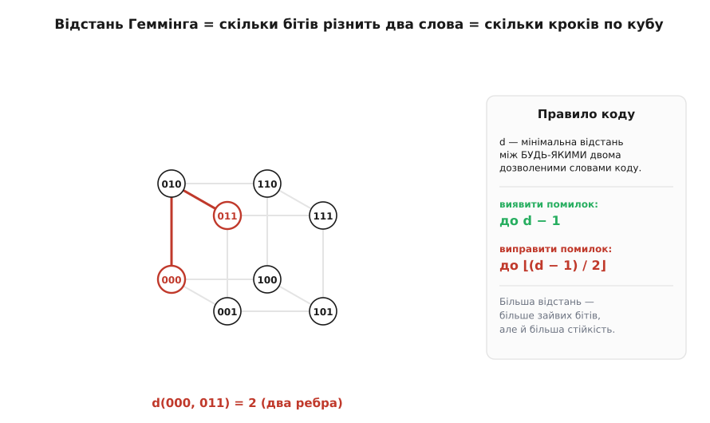
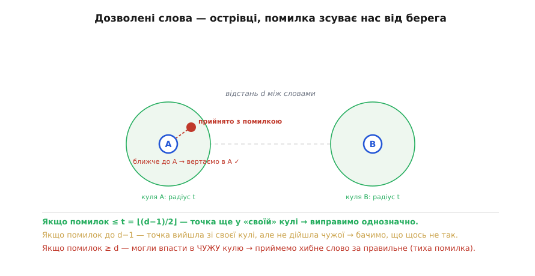

# Відстань Геммінга: скільки помилок видно, а скільки виправно

Сильні методи [виявлення помилок](root:com-modulation/crc) доводять виявлення майже до досконалості, але впираються в стіну: помітивши помилку, приймач може лише попросити повтор, а повтор доступний не завжди. Як же **виправити** помилку, не перепитуючи, — маючи на руках самі лише (можливо, зіпсовані) біти? Відповідь на це питання — не трюк, а **геометрія**. Виявлення й виправлення стають наочними, щойно з'являється спосіб міряти, наскільки два бітові слова «далеко» одне від одного. Ця міра зветься **відстанню Геммінга** (*Hamming distance*) — на честь Річарда Геммінга, що ввів її в основоположній праці 1950 року, — і вона є фундаментом усього завадостійкого кодування.

> 📜 Річард Геммінг (Richard W. Hamming, 1915–1998) — американський математик з Bell Labs; роздратований тим, що релейна обчислювальна машина просто зупинялася на кожній помилці, він шукав код, який сам **виправляв** би збій. Його стаття «Error Detecting and Error Correcting Codes» (1950) заклала цілу галузь і дала нам терміни «відстань Геммінга» та «код Геммінга». Деталі — у вставці [Як народилося виправлення помилок](root:com-modulation/hamming-distance/hist-hamming-1950.md).

### Відстань як кількість різних бітів

Означення Геммінгової відстані гранично просте: це **кількість позицій, у яких два слова однакової довжини різняться**. Слова `1011` і `1001` різняться в одній позиції — відстань 1. Слова `1011` і `0010` різняться у двох — відстань 2. Щоб порахувати її, досить узяти XOR двох слів і полічити одиниці в результаті: кожна одиниця — це позиція розбіжності.

Варто помітити одну спільну рису простих кодів — вона прояснить, що означає «дозволене слово». [Біт парності](root:com-modulation/parity-bit), [контрольна сума](root:com-modulation/checksums) і [CRC](root:com-modulation/crc) влаштовані однаково: вони лишають дані **недоторканими** й **дописують** до них контрольні біти (один біт парності, байт суми, остачу CRC). Такі коди звуть **систематичними** (*systematic*): корисні дані видно в кодовому слові без розшифрування, а надлишок просто додано поруч. «Дозволене слово» в систематичному коді — це будь-які дані разом із **правильно** порахованим для них контролем; «заборонене» — це коли контроль не відповідає даним. [Код Геммінга](root:com-modulation/hamming-code), щоправда, перемішує дані й парності місцями, але суть та сама: серед усіх можливих бітових слів дозволені — лише ті, де надлишок узгоджений із даними, а помилка цю узгодженість руйнує. Питання виправлення зводиться тоді до геометрії узгоджених слів: **наскільки далеко** одне від одного вони сидять серед усіх можливих.

Найкраще відстань відчути **геометрично**. Уявімо всі можливі слова заданої довжини як вершини багатовимірного куба: для трьох бітів це звичайний куб, де кожна з восьми вершин — одне зі слів від `000` до `111`, а ребро з'єднує слова, що різняться рівно одним бітом.


*Усі 3-бітні слова — вершини куба; ребро з'єднує слова, що різняться одним бітом. Відстань Геммінга між двома словами — це найменша кількість ребер, якими треба пройти від одного до іншого: d(000, 011) = 2 (два кроки). Помилка в одному біті — це крок по одному ребру. Праворуч — головне правило коду: за **мінімальною** відстанню d між дозволеними словами визначається, скільки помилок код **виявить** (до d−1) і скільки **виправить** (до ⌊(d−1)/2⌋).*

У цій картині перевернутий біт — це просто **крок по ребру**: помилка зсуває нас із поточної вершини в сусідню. Дві помилки — два кроки, і так далі. Тому «скільки помилок сталося» — це буквально «на яку Геммінгову відстань нас віднесло від правильного слова». Уся теорія виправлення тепер зводиться до питання: як розкласти **дозволені** слова коду по цьому кубі так, щоб помилка не змогла непомітно перекинути одне дозволене слово в інше.

### Найпростіший виправний код: потрійне повторення

Найгрубіший можливий виправний код перетворює цю абстракцію на щось відчутне — це **потрійне повторення** (*triple repetition*): кожен біт даних передаємо **тричі**. Біт 0 стає словом `000`, біт 1 — словом `111`. Дозволених слів лише два — `000` і `111`, — і вони сидять у **протилежних** кутах куба, на відстані d = 3 одне від одного. Усі інші шість вершин — заборонені.

Ось як ця відстань перетворюється на виправлення. Хай передали `111`, а в каналі перевернувся один біт — приймач отримав, скажімо, `101`. Це слово заборонене, тож помилку **видно**. Але можна й більше: `101` відрізняється від `111` на один біт, а від `000` — на два, тобто воно **ближче** до `111`. За правилом «обираємо найближче дозволене слово» приймач відновлює `111` — і **виправляє** помилку, навіть не перепитуючи. Голосування «більшістю з трьох» — це той самий пошук найближчого кодового слова, лише сказаний простими словами: який біт трапився двічі, той і вважаємо правдою.

**Приклад (потрійне повторення виправляє один біт).** Простежмо передачу одного біта даних = 1.

```
дані = 1   →   передаємо кодове слово 111

канал перевернув середній біт:  приймач отримав 1 0 1

відстані до дозволених слів:
  d(101, 111) = 1   (різниться 1 біт)
  d(101, 000) = 2   (різниться 2 біти)
найближче → 111   →   відновлене дане = 1  ✓ (помилку виправлено)

а якби перевернулися ДВА біти: 1→ 0 0 1
  d(001, 000) = 1,  d(001, 111) = 2  → найближче 000 → дане «0»  ✗
  (два збої в трьох бітах код уже не подужав — це його межа)
```
Один збій повторення виправляється голосуванням більшості; два — переголосовують правду, і код помиляється. Саме це й означає d = 3: виправити можна ⌊(3−1)/2⌋ = 1 помилку.

Цей код наочний, але страшенно **марнотратний**: на один корисний біт припадає два зайвих — надлишок 200%, корисна частка лише третина. Тримати d = 3 можна **набагато** дешевше, ніж потроюючи кожен біт, — і саме це робить [код Геммінга](root:com-modulation/hamming-code), дістаючи ту саму здатність виправити один біт лише за три біти парності на чотири біти даних. Повторення ж лишається корисним як **гранична інтуїція**: воно показує зв'язок «відстань → голосування → виправлення» у найчистішому вигляді.

### Мінімальна відстань коду вирішує все

За потрійним повторенням стоїть загальний принцип, який варто сформулювати точно. Код — це набір **дозволених** слів (їх звуть **кодовими словами**, *codewords*), розкиданих серед усіх можливих комбінацій; решта слів заборонені, і, побачивши заборонене, приймач знає про помилку. У повторенні дозволених слів було лише два, на відстані d = 3, — і саме ця відстань дала виправлення. Узагальнімо: силу будь-якого коду визначає одна-єдина величина — **мінімальна відстань** *d*, найменша Геммінгова відстань між будь-якими двома кодовими словами. Що більша *d*, то «далі» розсаджені дозволені слова й то важче помилці перекинути одне в інше.

Із цього прямо випливають дві формули, які варто запам'ятати раз і назавжди. Щоб **виявити** помилку, достатньо, аби зіпсоване слово не співпало з іншим дозволеним; це гарантовано, поки помилок не більше за **d − 1**. Щоб **виправити** помилку, треба, щоб зіпсоване слово лишилося ближчим до свого правильного, ніж до будь-якого чужого; це досягається, поки помилок не більше за **⌊(d − 1) / 2⌋**. Виправлення вимагає вдвічі більшої відстані, ніж виявлення, — бо виправити означає не лише помітити зсув, а й упевнено вказати, **звідки** він стався.


*Геометрія виявлення й виправлення. Навколо кожного кодового слова уявімо «кулю» радіуса t = ⌊(d−1)/2⌋ — усі слова, що відрізняються не більш як на t бітів. Якщо помилок ≤ t, прийняте слово лишається у **своїй** кулі → виправляємо однозначно, повертаючи в центр. Якщо помилок аж до d−1, слово вийшло зі своєї кулі, але не дійшло чужої → бачимо, що щось не так (виявлення без виправлення). Якщо помилок ≥ d, можемо потрапити в **чужу** кулю → приймемо хибне слово за правильне (тиха помилка). Тому більша d коштує зайвих бітів, але дає більшу стійкість.*

Ця картина «куль навколо острівців» — суть усього виправлення помилок. Виправити помилку означає: побачивши прийняте (можливо, зіпсоване) слово, **знайти найближче** до нього дозволене кодове слово й оголосити його істинним. Поки помилок мало, прийняте слово лишається в кулі свого справжнього сусіда — і ми вгадуємо правильно. Щойно помилок забагато, ми можемо опинитися ближче до чужого острівця — і впевнено «виправити» дані на хибні, навіть не здогадуючись про це. Тому в кодів є чесна **межа**: вони не всемогутні, а гарантують виправлення лише до свого t — і це фундаментальна властивість, а не недоробка. Якщо [означити ці кулі строго](root:math-information/hamming-bounds), стає видно й звідки беруться межі на кількість кодових слів (межа Геммінга), і яка справжня ціна надлишковості — скільки зайвих бітів доводиться доплачувати за кожен додатковий виправлений біт помилки.

> 🔧 **Навіщо це.** Відстань Геммінга — це лінза, крізь яку інженер дивиться на **будь-який** код. Перше практичне: коли в даташиті чи стандарті пишуть «код виправляє t помилок і виявляє d−1», за цим стоїть рівно ця геометрія — мінімальна відстань між кодовими словами. Друге: вона пояснює неминучий **компроміс** — більша стійкість (більша d) завжди означає більше зайвих бітів, тобто нижчу корисну швидкість; безкоштовної надійності не буває, і відстань Геммінга показує точний обмінний курс. Третє, найважливіше для проєктування: код треба підбирати під **очікувану кількість і характер помилок** у вашому каналі — слабкий код пропустить забагато, а надмірно сильний з'їсть пропускну здатність даремно. Саме цей розрахунок і зводить докупи [інженерний вибір надійності каналу](root:embedded/data-reliability).

Ця геометрія — кодові слова як острівці, помилки як кроки, виправлення як пошук найближчого острівця — і є каркасом, на якому будують **конкретні** коди, що справді виправляють. Найпростіший і найнаочніший із них — той, з якого почалася ціла галузь: [код Геммінга (7,4)](root:com-modulation/hamming-code), де три біти парності розставлені так хитро, що самі вказують на номер зіпсованого біта.
