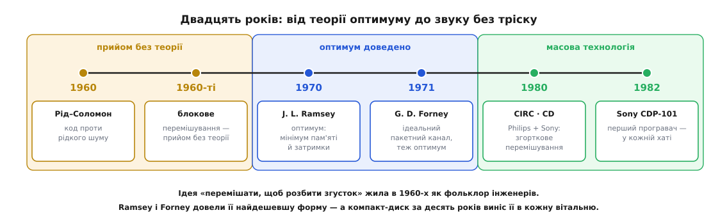

# 📜 Як подряпину на диску перестало бути чути: народження перемішування

У 1960-х теорія кодування жила з тихою неприємністю. Шеннон уже пообіцяв, що нижче пропускної здатності похибку можна збити як завгодно низько, а інженери вже мали коди, які цю обіцянку помалу вибирали: [коди Рід–Соломона](root:com-modulation/reed-solomon) 1960 року рахували цілі символи над скінченним полем, [коди розрідженої перевірки паритету](root:com-modulation/ldpc) Галлагера початку 1960-х тяглися до самої межі. Усі вони вміли одне й те саме добре: **вигрібати рідкий шум** — поодинокі похибки, розкидані по потоку так, що на кожне слово припадає їх мало.

Але справжні канали шуму рідко сипали рівно. Телефонна лінія клацала, магнітна стрічка мала випадини, радіо в русі провалювалося у [завмирання](root:com-medium/multipath-fading) — і помилки йшли **згустками**. Код, налаштований на рівний шум, натикався на такий згусток і гинув: сотня похибок, що впала в одне слово, — це далеко за будь-яким його запасом, хоч решта кадру чиста. Цю невідповідність — чудові коди проти рідкого шуму й **пакетний** характер реального каналу — Дейвід Форні згодом назве **класичним пакетним каналом** (*classic bursty channel*), і саме з неї народилося перемішування. Не як код. Як спосіб обдурити згусток.

## Прийом, що випередив теорію

Хитрість напрошувалася сама, і до всякої теорії її вже пускали в діло. Якщо код не терпить згустку — розсій згусток перед тим, як він дійде до коду: відправ символи в канал у переплутаному порядку, а на прийомі розклади назад. Тоді пакет, який у природному порядку впав би в одне слово, розсиплеться по багатьох, по крихті на кожне. У 1960-х цей прийом уже стояв у супутникових і далекокосмічних лінках; сам інстинкт «перемішай, щоб розбити згусток» витав у повітрі — навіть Галлагерів LDPC переставляв стовпці своєї перевірної матриці, теж розкидаючи сусідів. Найпростіша його форма — **блокова матриця**: слова пишуть рядками, віддають у канал стовпцями.

Це працювало — і водночас лишалося фольклором. Ти будував матрицю, писав рядками, читав стовпцями, згусток розсипався, і на тому інженер зупинявся. Ніхто не ставив **гострого** питання: якщо мені потрібно рознести сусідів на задану відстань, який переставляч зробить це **найдешевше** — з найменшою пам'яттю й найменшою затримкою? Блокова матриця під цим кутом марнотратна: поки заповнюється нова, стара вже віддана, і половина буфера лежить без діла. Ідея перемішування вже жила; **дно її ціни** ще ніхто не намацав. Різниця тут та сама, що між «ми вміємо це зробити» і «ми довели, що дешевше не буває», — і саме її на зламі десятиліть закрили двоє.

## Двоє намацали дно ціни

Першим у друці був **J. L. Ramsey**. Його стаття «Realization of Optimum Interleavers» вийшла в *IEEE Transactions on Information Theory*, том IT-16, номер 3, за **травень 1970 року**, сторінки 338–345. Ремзі поставив задачу з хірургічною точністю: переставити потік так, щоб жодні n₂ символів поспіль на виході не містили пари, що на вході стояли ближче ніж за n₁ один від одного. І показав **чотири** конкретні реалізації (їх і досі звуть перемішувачами Ремзі — типів I, II, III, IV), які для взаємно простих n₁ і n₂ **одночасно** досягають і найменшої можливої затримки кодування, і найменшої сумарної пам'яті переставляча та зворотного до нього. Не просто добрий переставляч — **доведено найкращий**: дешевше не буває, і це вже не смак, а теорема. Статус: **усталено** (звірено з бібліографічним записом статті, DOI 10.1109/TIT.1970.1054443).

Роком пізніше з іншого боку до того самого дна дійшов **Джордж Дейвід Форні-молодший** (*G. David Forney, Jr.*, нар. 6 березня 1940) — американський інженер, який ще докторською в МТІ 1965 року заклав [конкатеновані коди](root:com-modulation/concatenated-codes), а тоді працював у Codex Corporation над реальними модемами й космічними лінками. Його стаття «Burst-Correcting Codes for the Classic Bursty Channel» вийшла в *IEEE Transactions on Communication Technology*, том 19, номер 5, за **жовтень 1971 року**, сторінки 772–781. Форні йшов не від переставляча, а від каналу: він **ідеалізував** брудний реальний канал у той самий «класичний пакетний канал», вивів межу того, що на ньому взагалі досяжно, і пред'явив класи схем, які асимптотично цю межу вибирають, — а серцем цих схем було перемішування. Статус: **усталено** (звірено з бібліографічним записом; том 19, с. 772–781, жовтень 1971).

Чому двоє незалежно дійшли того самого майже водночас? Бо задача дозріла. Пакетний канал був **найгострішою** практичною мукою тих років; будівельні цеглинки — зсувні регістри й лінії затримки — стояли на кожному столі; а щойно ти ставив питання «найдешевший переставляч», відповідь — набір **сходинкових ліній затримки** замість цілої матриці — майже сама випадала з рук. Це класичне збіжне відкриття: не крадіжка й не суперечка про першість, а двоє людей, що прийшли з різних коридорів до тих самих дверей. У літературі їх обох і називають засновниками оптимального (згорткового) перемішування — Ремзі 1970-го, Форні 1971-го. Статус цієї спільної атрибуції: **усталено в фаховому переказі**.

Тут доречно зробити чесну примітку про пам'ять фаху. Форні задокументований до дрібниць: рік і місце народження, Принстон і МТІ, наукові керівники, премія Шеннона 1995 року, Медаль пошани IEEE 2016-го. Про **Ремзі** ж поза цією статтею не лишилося майже нічого — навіть повне ім'я за ініціалами «J. L.» у доступних джерелах твердо не розкривається. Фах запам'ятав теорему й забув людину; це не рідкість, і варто називати такі прогалини вголос, а не домальовувати біографію здогадом.

*Дуга, якою йшло перемішування. Ліворуч — прийом без теорії: у 1960-х символи вже перемішували блоковою матрицею в супутникових лінках, але дна ціни ніхто не намацав. Посередині — двоє незалежно доводять найдешевшу форму: Ремзі 1970-го (чотири оптимальні реалізації, мінімум пам'яті й затримки), Форні 1971-го (ідеальний «пакетний канал» і схеми, що вибирають його межу). Праворуч — компакт-диск близько 1980-го виносить ту саму згорткову схему в кожну вітальню.*

## Чому не матриця, а лінії затримки

Те дно, яке намацали обидва, — не інтуїтивна блокова матриця. Оптимальний переставляч виходить **згортковим**: потік пропускають крізь набір ліній затримки різної довжини, кожна наступна затримує символ трохи довше за попередню. Символи течуть неперервно, без пауз на заповнення блоку, — і саме тому за ту саму стійкість до пакетів згорткова схема бере приблизно **вдвічі менше пам'яті й дає вдвічі меншу затримку**, ніж матриця. Оце «вдвічі» Ремзі й Форні й закріпили як межу: не просто «буває дешевше», а «ось на скільки дешевше, і нижче — вже ніяк».

Варто завважити, що навіть **назва** тоді ще не встоялася. У своїй докторській 1965 року Форні писав не *interleaving*, а *interlacing* — перемежування; слово плавало разом із поняттям. Українське «перемішування» тут відповідає тому змістові, який до кінця 1970-х усталився за англійським *interleaving*.

## Компакт-диск виносить його в кожну хату

Доведений оптимум міг би так і лишитися здобутком вузького цеху — інструментом для космічних лінків і телеметрії, про який пересічна людина ніколи не почує. Виніс його в побут компакт-диск.

Наприкінці 1970-х **Philips** (Нідерланди) і **Sony** (Японія) звели спільну робочу групу, щоб домовитися про єдиний цифровий звуковий диск; вели її з двох боків **Кес Схаухамер Іммінк** (*Kees Schouhamer Immink*, нідерландський інженер, Philips) і **Тошітада Дої** (*Toshitada Doi*, японський інженер, Sony). Поділ праці був такий: Philips дав канальну модуляцію EFM, стійку до подряпин і відбитків пальців, а Sony — **систему виправлення помилок CIRC** (*Cross-Interleaved Reed–Solomon Code*, перехресно-перемішаний код Рід–Соломона). Як завжди з великими системами, це праця колективу, а не одинака: серед винахідників у патенті CIRC (заявка від 21 травня 1980 року) стоять Одака, Сако, Івамото й Дої з боку Sony та Л. Б. Фріс (*L. B. Vries*) із боку Philips, а Іммінк доклав руку і до EFM, і до остаточної форми CIRC. Статус: **усталено** (звірено з описом стандарту й патентною атрибуцією).

Найцікавіше — що саме сидить усередині CIRC. Це два вкорочені коди Рід–Соломона, а **поміж них** — глибоке згорткове перехресне перемішування на лініях затримки, що розтягує символи одного слова більш ніж на сотню кадрів доріжки. Тобто рівно той переставляч, чиє дно ціни намацали Ремзі й Форні десятиліттям раніше, тепер працює в кожному програвачі. Плід цього перемішування точний і відчутний на слух: CIRC виправляє суцільний пакет **до 4000 бітів** (це близько **2.5 мм** сліду на доріжці) і приховує інтерполяцією ще довші сліди — **до 12 000 бітів** (близько **7.5 мм**). Без перемішування та сама подряпина вбила б кілька слів підряд і дала б чутний тріск; із ним — диск грає чисто. Статус чисел: **усталено** (звірено з описом CIRC).

Стандарт «Red Book» узгодили 1980 року, перший серійний програвач — Sony CDP-101 — вийшов 1982-го. З того моменту доведена 1970-го теорема про переставляч із мінімальною пам'яттю крутилася, ніким не помічена, у кожній вітальні — мільярди разів на день. Перемішування перестало бути статтею й стало побутовим рефлексом, якого ніхто не завважує, — а це рівно та мить, коли технологія остаточно перемогла.

## Що з цього лишилося

Дугу видно чисто, і в ній варто розрізняти три різні речі, які побутовий переказ зазвичай зливає в одну. **Ідея** перемішати потік, щоб розбити згусток, — фольклор інженерів 1960-х, без автора й без доказу оптимальності. **Доведений оптимум** — найдешевша, згорткова форма цієї ідеї — робота Ремзі (1970) і Форні (1971), незалежно, з двох боків. **Масова система** — компакт-диск близько 1980-го, що зробив прийом повсюдним. Ідея, теорія й система — три поверхи, і чесна історія називає кожен своїм ім'ям.

Ідея виявилася настільки плідною, що переросла свою першу роль: у [турбокодах](root:com-modulation/turbo-codes) 1993 року той самий переставляч із простого захисника від пакетів став **серцем самого коду**. Але то вже інша розповідь. Тут важить простіше: найдешевша монета в усій інженерії надійності — переставити символи, не додавши жодного біта, — пройшла шлях від теореми до музики без тріску всього за двадцять років.
