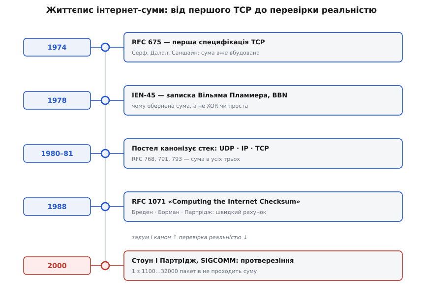

# 📜 Як народилася інтернет-сума: ставка на дешевизну

Уявіть інженера середини 1970-х, який має захистити пакет даних у дорозі. Не в одному приладі, а в дорозі крізь мережу, якої ще толком немає: жменька несумісних машин різних виробників, різних розрядностей, різного порядку байтів, з'єднаних повільними й галасливими лініями. Кожен пакет пройде через кілька таких машин, і на кожній його треба буде перевірити. Питання, яке стояло перед ним, звучало не «як зловити якнайбільше помилок» — на це давно знали відповідь. Питання було жорсткіше: **як зловити помилки так дешево, щоб перевірка не з'їла всю обчислювальну потугу тодішніх комп'ютерів**. Уся своєрідність інтернет-суми — обернений код, загорнутий перенос, інверсія наприкінці — виросла з цієї єдиної, дуже практичної тривоги. Це історія свідомого компромісу: інженери знали про сильніші способи й **навмисно** обрали слабший, бо він коштував майже нічого.

## Ровесниця першого TCP (1974)

Контрольну суму не додали до протоколів згодом, як латку. Вона була там **із самого початку**. Найперша детальна специфікація майбутнього TCP — документ **RFC 675 «Specification of Internet Transmission Control Program»** (грудень 1974 року; автори Вінтон Серф, Йоген Далал і Карл Саншайн — *Vinton Cerf, Yogen Dalal, Carl Sunshine*) — уже несла в собі поле контрольної суми (усталений факт: це видно в самому тексті RFC).

Чому вона мусила бути саме там, а не тільки в апаратурі каналу? Бо задум TCP був **наскрізним** — від кінцевої програми до кінцевої програми, через будь-яку кількість проміжних вузлів невідомої надійності. Кожна ділянка дроту могла мати свій контроль, але жоден із них не бачив пакета цілком від відправника до отримувача: на кожному вузлі пакет розбирали, зберігали в пам'яті, збирали знову. Помилка, що заповзла між ділянками — у пам'яті проміжної машини, — була б невидима для будь-якого канального сторожа. Тож розробникам був потрібен один сторож, який їде **разом із пакетом** через усю дорогу й перевіряється на самому кінці. Ця думка — наскрізна цілість — була в TCP з першого дня, і контрольна сума була її втіленням.

## Чому не XOR і не проста сума: записка Пламмера (1978)

Найцікавіше — не те, що суму взяли, а **чому взяли саме таку**. Це не було випадкове рішення; його старанно обґрунтували. Ключовий документ — **IEN-45 «TCP Checksum Function Design»** (Internet Experiment Note 45; Вільям Пламмер — *William W. Plummer* — з фірми Bolt Beranek and Newman, 5 червня 1978 року; усталено). Пламмер перебрав кілька правдоподібних схем контролю й чесно зважив кожну.

Найдешевший варіант — **порозрядне XOR** усіх слів. Він рахується за лічені інструкції, але Пламмер прямо назвав його поганою контрольною сумою: XOR сліпий до забагатьох поширених спотворень (парне число однакових перевернутих бітів у тому самому розряді безслідно гаситься). Складніші схеми на кшталт «добуткових кодів» він теж розглянув, але вони були задорогі для машин тієї доби. Лишалася звичайна арифметична сума слів — і тут постало тонке питання, яке саме додавання брати.

І ось справжня причина оберненого коду, яку варто знати, бо її часто плутають. Пламмерів головний аргумент був **не** про порядок байтів (це прийшло згодом), а про **рівномірну чутливість до помилок у всіх розрядах**. Якщо складати у звичайному [доповняльному коді](root:math-number-theory/twos-complement-algebra) процесора, перенос, що виникає на **старшому** біті, просто вилітає за край і зникає. Через це старший розряд стає **сліпою плямою**: певні зміни там (парне число одиниць, набутих чи втрачених у верхньому бітовому каналі) не міняють суми взагалі — і помилка проходить непоміченою. Обернений код (англ. *one's complement*) цю пляму закриває: перенос зі старшого біта не викидають, а **завертають назад** у молодші розряди (той самий *end-around carry*). Тоді верхній біт захищений так само, як усі інші, — сума однаково чутлива до збою в будь-якій позиції. Ось чому взяли обернену суму, а не доповняльну.

> 🔧 **Навіщо це.** Ця дрібниця — гарний урок про те, що «майже те саме» в арифметиці не означає «те саме» для надійності. Дві операції, доповняльне й обернене додавання, різняться лише долею одного переносу, — але ця доля робить різницю між сторожем із дірою у верхньому розряді й сторожем без діри. Коли проєктуєш власну контрольну суму, питання «а що стається з переносом, який випав за край?» — не педантизм, а те, від чого залежить, які помилки ти не побачиш.

До цього Пламмер додав ще дві практичні переваги, які й закріпили вибір: обернена сума **не залежить від порядку байтів** апаратури (машини з різним укладанням байтів рахують сумісно) і **дешево лягає на 16-бітні машини** штибу PDP-11, під які тоді все й писали. Дешевизна, незалежність від архітектури, відсутність сліпих плям — три галочки, яких не набирала жодна проста альтернатива. Рішення було зважене, а не взяте зі стелі.

## Постел вбудовує суму в стек (1980–1981)

Коли з експериментів TCP/IP почав вимальовуватися сталий стек протоколів, ту саму обернену суму просто вклали в кожен його рівень. Зробив це переважно один спокійний, дуже акуратний редактор — **Джон Постел** (*Jonathan Bruce Postel*, 1943–1998) з Інституту інформаційних наук Університету Південної Каліфорнії (ISI). Постел був хранителем ранніх стандартів інтернету: через його руки проходили RFC, він вів реєстри номерів, і саме його редакції протоколів стали канонічними.

Хронологія канонізації така (усталено, за самими RFC): **RFC 768** — протокол UDP — вийшов у серпні 1980 року; **RFC 791** (протокол IP) і **RFC 793** (протокол TCP) — у вересні 1981-го. У всіх трьох сидить та сама 16-бітна обернена сума. Різниця лише в тому, що вона накриває: сума IP береже свій заголовок, а суми TCP і UDP домішують до захисту ще й псевдозаголовок з IP-полів. Механізм — один; це не три різні винаходи, а одна ідея, розкладена по трьох рівнях. Дивовижа в тому, що ці рядки специфікацій 1980–1981 років працюють досі: пакет, який щойно долетів до вас, перевіряється рівно тим самим правилом, що його Постел зафіксував понад чотири десятиліття тому.

## RFC 1071: як це порахувати швидко (1988)

До кінця 1980-х сума жила в стандартах уже майже десять років, і накопичилося ремесло — купа хитрощів, як рахувати її швидко на різних машинах. Ці хитрощі зібрали докупи в окремому документі — **RFC 1071 «Computing the Internet Checksum»** (вересень 1988 року; автори Роберт Бреден з ISI, Девід Борман із Cray Research і Крейг Партрідж із BBN — *Robert Braden, David Borman, Craig Partridge*; усталено). Це не новий стандарт, а **пам'ятка реалізатора**: як складати слова паралельно, як відкладати завертання переносу до кінця, як користатися ширшим регістром акумулятора. Разом із рецептами RFC 1071 переказав і давнє обґрунтування Пламмера — чому обернена сума комутативна й асоціативна (складати можна в будь-якому порядку й будь-якими групами), чому не залежить від порядку байтів і чому її можна **оновлювати точково**, не перечитуючи весь пакет.

Саме тут компроміс проговорено найвиразніше. Автори чудово знали про [CRC](root:com-modulation/crc) — циклічний надлишковий код, який ловить майже всі помилки й на порядки сильніший за суму. Але CRC коштує дорожче: він вимагає більше роботи на байт, а на маршрутизаторі, де заголовок оновлюють на **кожному** вузлі, ця різниця в ціні множилася на весь трафік інтернету. Тож інженери свідомо лишили слабший, але майже безкоштовний інструмент — і зробили **ставку**: тодішні лінії псують дані **поодинокими, випадковими** бітами, а з такими дрібними негараздами 16-бітна сума впорається досить добре. Для світу повільних, зашумлених, але простих каналів кінця 1970-х ця ставка була розумна.

Компроміс мав і побічні складнощі, які довелося доганяти згодом. Точкове оновлення суми на маршрутизаторі, наприклад, стандартизували не з першого разу: рання формула (RFC 1141, 1990) містила тонку ману через двоїстий нуль оберненого коду, і її виправили лише RFC 1624 (1994). А коли комусь треба було міцніше, з'явилися й спроби прикрутити до TCP сильніші контрольні суми як необов'язкову опцію (RFC 1146, 1990) — але вони так і не прижилися, бо ламали ту саму дешевизну, заради якої все затівалося. Стандартна обернена сума пережила всі альтернативи саме тому, що була найдешевша.

## Протверезіння: коли CRC і сума TCP не сходяться (2000)

Ставку 1970-х перевірила реальність — і перевірка вийшла тверезлива. На конференції **SIGCOMM 2000** з'явилася праця Джонатана Стоуна й Крейга Партріджа **«When the CRC and TCP Checksum Disagree»** («Коли CRC і контрольна сума TCP не сходяться»; усталений, багато цитований результат). Автори зробили те, чого доти майже ніхто не робив ретельно: зібрали **справжній** інтернет-трафік за два роки — близько **півмільйона** пакетів, що не пройшли контрольну суму TCP, UDP чи IP, — і подивилися, як часто й **чому** сума кричить про помилку.

Числа вразили. Суму TCP не проходив від **одного пакета на 1 100 до одного на 32 000** — а в один особливо кепський годину спостережень аж один на 400. Це страшенно багато, і ось чому. Канальний рівень тих ліній мав власний, значно сильніший [CRC](root:com-modulation/crc), який мав би пропускати щонайбільше **один зіпсований пакет на 4 мільярди**. Якби всі помилки народжувалися **в дроті**, канальний CRC ловив би майже все, і до перевірки TCP доходили б лічені одиниці браку. А доходили тисячі. Отже, розгадка була одна: **чимало пошкоджень народжується не в дроті**.

Де ж тоді? Розподіл помилок був виразно **невипадковий** — не схожий на рівномірний шум лінії, — і це вказувало на джерела в самих машинах: биті комірки пам'яті маршрутизаторів і кінцевих вузлів, збої під час DMA-переносів, помилки в програмах, що спотворювали дані вже після канальної перевірки й перед наступною. Саме ці пошкодження канальний CRC у принципі побачити не може, бо його рахують **заново на кожній ділянці**: між ділянками, всередині пристроїв, він пакета не боронить. Наскрізна сума TCP/UDP лишалася єдиним сторожем, який те бачив.

І тут — найнеприємніший висновок, який робить цю працю такою важливою. Раз пошкоджень набагато більше, ніж гадали, то навіть слабенька 16-бітна сума, що пропускає приблизно одне спотворення на 65 536, час від часу **пропускає брак до самої програми** — тихо, без жодного сигналу про помилку. Ставка 1970-х справдилася лише наполовину: лінії справді стали чистіші, зате джерелом помилок зробилися **самі вузли**, яких тодішні проєктувальники до уваги майже не брали. Звідси й практична порада авторів, чинна досі: критичним даним не досить наскрізної суми — застосунок має класти **власну** контрольну суму чи хеш поверх усього.

## Що з цього лишилося

Історія інтернет-суми — не про геніальний алгоритм, а про **зрілу інженерну чесність**. Сторожа спроєктували навмисно слабким, обґрунтувавши кожну дрібницю (Пламмер, 1978), акуратно вклали в стек (Постел, 1980–1981), зібрали ремесло швидкого рахунку (RFC 1071, 1988) — а через десятиліття так само тверезо **виміряли його межу** (Стоун і Партрідж, 2000) й розповіли, чого він не ловить. Цінність тут не в тому, що сума ідеальна, а в тому, що всі точно знають, **що саме** вона купує за свою майже нульову ціну і де по-справжньому потрібен сильніший захист. Дешевий, слабкий, наскрізний і чесно виміряний сторож — саме таким він і був задуманий, і саме таким досі їде на кожному пакеті інтернету.

*Життєпис інтернет-суми. Від поля в першій специфікації TCP через обґрунтування вибору оберненого коду й канонізацію в стеку до пам'ятки швидкого рахунку — і, нарешті, до вимірювання, яке показало реальну частоту відмов і межу дешевого сторожа.*
