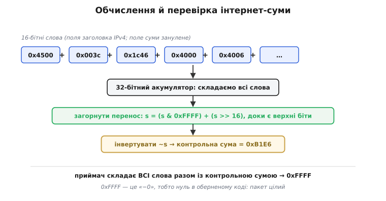
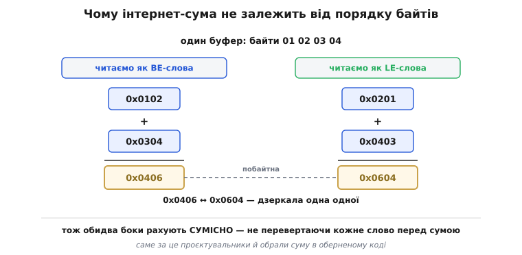
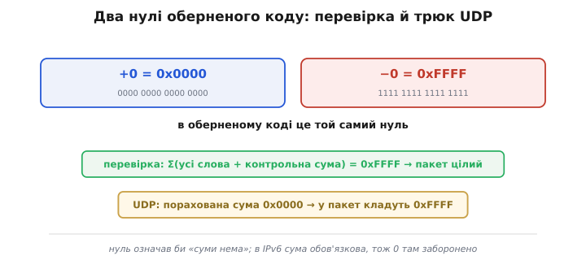
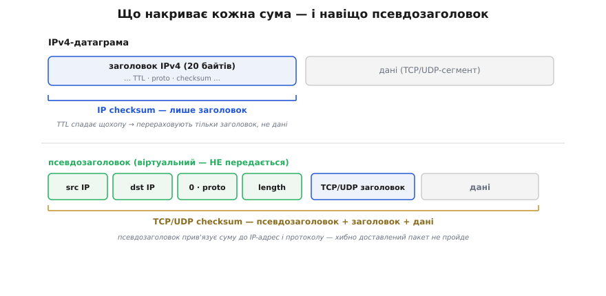

# Інтернет-контрольна сума (IP/TCP/UDP)

<preknowlist>
- [Контрольні суми](topic:com-modulation/checksums) — контрольна сума згортає блок даних в одне число-«підпис»; найпростіша сума байтів сліпа до перестановки, бо додавання не залежить від порядку.
- [Обернений код](topic:math-number-theory/ones-complement) — подання чисел, де від'ємне дістають інверсією всіх бітів; звідси загорнутий перенос і два нулі: +0 = 0x0000 та −0 = 0xFFFF.
- [Біти й порядок байтів](topic:sf-algorithms/bits-bytes-endianness) — як число розкладається в байти і що означає big-endian та little-endian.
- [TCP проти UDP](topic:com-transport/tcp-vs-udp) — IP переносить пакети між вузлами, а TCP і UDP — транспортні протоколи, що їдуть усередині IP.
</preknowlist>

Кожен пакет, що біжить інтернетом, несе на собі маленьке число — контрольну суму. Її рахують на боці відправника, перевіряють на боці отримувача, а частину, що захищає заголовок IP, перераховують ще й на **кожному** маршрутизаторі дорогою. Помножте це на незліченну кількість пакетів, що летять мережею щосекунди, — і стане ясно, який тиск ліг на цей алгоритм. Головна вимога до нього була не «зловити якнайбільше помилок»: із цим краще впорається [CRC](topic:com-modulation/crc). Вимога була інша — **коштувати майже нічого**, рахуватися за кілька процесорних інструкцій на будь-якій машині, хоч на восьмибітному контролері, хоч на суперкомп'ютері. Усе своєрідне, що є в інтернет-сумі, виростає саме з цієї однієї вимоги дешевизни.

## Сума шістнадцятибітних слів із загорнутим переносом

Тіло пакета — це потік байтів. Інтернет-сума дивиться на нього не побайтно, а **словами по 16 біт**: два сусідні байти — одне слово. Усі ці слова просто складають. Уся хитрість — у двох дрібницях довкола цього додавання, і кожна з них щось та й важить.

Перша дрібниця — куди подіти **перенос**. Якщо складати 16-бітні слова у 16-бітний регістр, то щойно сума перевалить за 0xFFFF, старший біт «вилетить» за верхній край і пропаде. А з ним пропаде й частина інформації: у [доповняльному коді](topic:math-number-theory/twos-complement-algebra) звичайного процесора перенос за межу просто відкидають. Інтернет-сума так не робить. Вона рахує в **оберненому коді** (англ. *one's complement* — «доповнення до одиниць»), а там перенос не викидають, а **завертають назад** — додають до молодших розрядів. Це і є *загорнутий перенос* (*end-around carry*). Практично його роблять так: суму накопичують у ширшому, 32-бітному регістрі, а тоді верхню половину додають до нижньої, доки верхня не обнулиться:

```
s = (s & 0xFFFF) + (s >> 16)     // доки s >> 16 не стане нулем
```

Чому це важливо? Бо тепер **жоден біт не марнується**: перенос, що виник під час додавання, повертається в гру, а не зникає. Завдяки цьому додавання в оберненому коді стає по-справжньому комутативним і асоціативним — сума не залежить ні від порядку слів, ні від того, як їх групувати. Слова можна складати хоч уперед буфером, хоч назад, хоч по чотири паралельно, а тоді звести докупи — результат буде той самий. Для швидкого коду це подарунок.

Друга дрібниця — що робити з готовою сумою. Її **інвертують**: беруть порозрядне NOT. Це число і кладуть у пакет як контрольну суму. Навіщо інверсія — стає видно з боку отримувача. Він складає **всі** слова пакета тим самим способом, але тепер разом із самою контрольною сумою. Оскільки в пакет поклали інверсію суми, то сума-плюс-її-інверсія дає число з самих одиниць — 0xFFFF. А 0xFFFF в оберненому коді — це «−0», тобто **нуль**. Отже, перевірка зводиться до одного питання: «чи вийшли всі одиниці?» — і не треба ані порівнювати з чимось, ані окремо зберігати еталон. Ціла машинерія перевірки — це той самий цикл додавання й погляд на результат.


*Три кроки обчислення: скласти всі 16-бітні слова у широкий акумулятор, загорнути перенос у молодші розряди, інвертувати результат. Отримана інверсія — контрольна сума. Хитрість інверсії в тому, що на приймачі додають усі слова разом із нею — і правильний пакет дає 0xFFFF, тобто «−0», нуль в оберненому коді.*

**Приклад: контрольна сума заголовка IPv4.** Візьмімо справжній заголовок — під час обчислення саме поле суми занулюють:

```
слова (поле checksum занулене):
  4500 003c 1c46 4000 4006 0000 ac10 0a63 ac10 0a0c

сума 16-бітних слів      = 0x24E17
загорнути перенос:  0x4E17 + 0x2   = 0x4E19
інвертувати:        ~0x4E19        = 0xB1E6      ← контрольна сума

на приймачі додаємо все РАЗОМ із 0xB1E6:
  0x24E17 + 0xB1E6 = 0x2FFFD
  загорнути:  0xFFFD + 0x2 = 0xFFFF              ← самі одиниці → пакет цілий
```

Той самий цикл рахує і суму, і перевірку; різниця лише в тому, що на приймачі поле суми вже не занулене, а містить 0xB1E6, тож результат добігає до 0xFFFF. У коді це кілька рядків. Обчислення над масивом уже готових 16-бітних слів виглядає так:

:::tabs
```c
#include <stdint.h>
#include <stddef.h>

uint16_t inet_checksum(const uint16_t *words, size_t n) {
    uint32_t sum = 0;
    for (size_t i = 0; i < n; i++)
        sum += words[i];                   // складаємо у 32-бітний акумулятор
    while (sum >> 16)                       // завертаємо перенос, доки він є
        sum = (sum & 0xFFFF) + (sum >> 16);
    return (uint16_t)~sum;                  // інверсія — і це вже контрольна сума
}
```
```python
def inet_checksum(words: list[int]) -> int:
    s = sum(words)                          # усі 16-бітні слова
    while s >> 16:                          # завертаємо перенос
        s = (s & 0xFFFF) + (s >> 16)
    return ~s & 0xFFFF                       # інверсія
```
:::

Тут навмисне лишилося поза кадром складніше: як зібрати ті слова з реального пакета (а раптом байтів непарна кількість?), як домалювати псевдозаголовок для TCP та UDP і як обійти особливий випадок нульової суми в UDP. Усе це — окрема, суто інженерна робота: *[повне обчислення для IP/TCP/UDP у коді](topic:com-modulation/internet-checksum/proj-tcp-udp-checksum.md)* збирає докупи псевдозаголовок, доповнення непарного хвоста нульовим байтом, трюк 0x0000 → 0xFFFF для UDP та типові граблі на кшталт «забули занулити поле суми перед обчисленням».

## Чому саме обернений код: незалежність від порядку байтів

Тепер про найтоншу причину, чому взяли саме обернену суму, а не якесь простіше додавання. Уявіть дві машини різної архітектури: одна зберігає слова старшим байтом уперед (big-endian), інша — молодшим (little-endian). Якби сума залежала від того, як саме байти складаються у слова, кожна машина мусила б **перевертати кожне слово** перед додаванням, щоб порахувати сумісно з іншою. На кожен пакет — зайва робота.

Обернена сума цього не потребує, і це не випадковість, а доведена властивість. Прочитайте той самий буфер байтів двома способами — як big-endian-слова й як little-endian-слова — порахуйте обидві суми, і вони виявляться **побайтними дзеркалами** одна одної. Тобто результат один і той самий, просто з переставленими місцями байтами. А оскільки готову контрольну суму записують назад у тому ж порядку байтів, у якому рахували, обидва боки сходяться без жодного перевертання.


*Ті самі чотири байти 01 02 03 04, прочитані двома способами. Як big-endian-слова вони дають 0x0102 і 0x0304 із сумою 0x0406; як little-endian-слова — 0x0201 і 0x0403 із сумою 0x0604. Суми — побайтні дзеркала: 0x0406 ↔ 0x0604. Тож машини з різним порядком байтів рахують сумісно, не перевертаючи кожне слово.*

Саме цю властивість документ **RFC 1071** «Computing the Internet Checksum» (Роберт Бреден, Девід Борман, Крейг Партрідж, вересень 1988 року — *Robert Braden, David Borman, Craig Partridge*) виводить як одну з головних причин обрати обернену суму: її можна рахувати однаково, «незалежно від порядку байтів апаратури» (це усталений факт, зафіксований у самому RFC). Наприкінці 1970-х, коли стек TCP/IP лише складався з машин найрізноманітніших архітектур, така байдужість до порядку байтів була неабиякою перевагою.

> 🔧 **Навіщо це.** Незалежність від порядку байтів — це не абстрактна елегантність, а те, що дає змогу писати обчислення суми **без жодного `htons`/`ntohs`** усередині гарячого циклу. Драйвер мережевої карти чи легкий стек на контролері може складати слова прямо в тому вигляді, як вони лежать у пам'яті, і не думати про архітектуру — а перевертання зробити лише один раз, над готовим 16-бітним результатом. Ці зекономлені інструкції на кожному слові кожного пакета й були тим, заради чого все затівалося.

## Два нулі та особливий випадок UDP

В оберненому коді є цікава властивість, яку ми вже мовчки використали: там **два** способи записати нуль. Усі нулі, 0x0000 (це «+0»), і всі одиниці, 0xFFFF (це «−0»). Обидва означають те саме число — нуль, — просто записані по-різному. Саме тому перевірка й видає 0xFFFF замість 0x0000: обидва — «нуль», і жоден не «правильніший».

Ця двоїстість дає ще один наслідок — у протоколі UDP. Там контрольна сума в IPv4 **необов'язкова**: значення 0 у полі суми означає «я її не рахував, не перевіряй». Але що, як реальна порахована сума випадково вийшла рівно нуль? Записати 0x0000 не можна — це прочитають як «суми нема». Рятує саме двоїстість нуля: у такому разі в пакет кладуть **0xFFFF** — другий, рівнозначний нуль. Він перевіряється так само правильно, але не сплутається з «суми нема».


*Обернений код має два нулі: +0 = 0x0000 і −0 = 0xFFFF. Звідси і зручна перевірка (сума всього разом із контрольною має дати 0xFFFF), і трюк UDP: якщо порахована сума вийшла 0x0000, у пакет кладуть 0xFFFF, бо саме число 0 зарезервоване під «суми нема». В IPv6 сума обов'язкова, тож нуль там заборонено.*

В IPv6 усе суворіше: там сума UDP **обов'язкова**. Причина проста й важлива — в IPv6 заголовок **не має власної контрольної суми взагалі** (від неї відмовилися, щоб не перераховувати щохопу), тож сума транспортного рівня лишається єдиним рятівним колом цілісності. Викидати його не можна, і нуль як «суми нема» там заборонений.

## Що саме накриває кожна сума: псевдозаголовок

Досі ми казали «сума пакета», ніби вона накриває все. Насправді різні суми накривають різне, і в цьому — окрема інженерна думка.

Сума заголовка **IP** захищає **лише заголовок**, а не дані. Причина в тому, що поле TTL (*time to live* — «час життя», лічильник, який спадає на одиницю на кожному [маршрутизаторі](topic:com-transport/ip-routing)) змінюється щохопу, а отже, щохопу треба переробляти й суму. Якби сума IP накривала ще й корисне навантаження, кожен маршрутизатор мусив би перечитувати весь пакет — божевільна ціна. Тож IP береже тільки свій заголовок, а за цілість даних відповідає транспорт.

Сума **TCP** і **UDP** натомість накриває свій заголовок і дані — та ще дещо несподіване. У неї домішують **псевдозаголовок** (від грец. *pseûdos* — оманливий, несправжній): кілька полів, узятих із рівня IP, — адресу відправника, адресу отримувача, номер протоколу й довжину сегмента. Цей псевдозаголовок **ніколи не передається** дротом; його складають однаково на обох кінцях лише для того, щоб згодувати в суму.


*Угорі: сума IP береже тільки заголовок, бо TTL спадає щохопу і заголовок і так перераховують на кожному маршрутизаторі. Унизу: сума TCP/UDP береже свій заголовок, дані та віртуальний псевдозаголовок — адреси IP, протокол і довжину. Псевдозаголовок не передається, але прив'язує суму до того, куди й чим пакет мав дійти.*

Навіщо ця дивина, що ламає чистий поділ на рівні? Псевдозаголовок — навмисна, корисна «протіканина» між рівнями. Він дає отримувачеві змогу впевнитися, що сегмент дійшов **саме на ту IP-адресу і саме тим протоколом**, які призначав відправник. Без нього транспорт бачив би лише свій шматок і прийняв би пакет, який через збій маршрутизації чи підміну [адрес](topic:com-transport/mac-ip-arp) заповз не туди, — адже його власна сума збіглася б. Домішавши адреси IP у суму, ми прив'язуємо цілість вантажу до цілості доставки: хибно доставлений пакет майже напевно не пройде перевірки.

> 🔧 **Навіщо це.** Псевдозаголовок — класичне джерело головного болю, коли пишеш чи налагоджуєш мережевий код. Порахуєш суму UDP без нього — і пакети мовчки відкидатимуться на тому кінці, а Wireshark писатиме «checksum incorrect». Тому, збираючи сегмент вручну (сирі сокети, свій стек, генератор трафіку), треба спершу викласти в буфер псевдозаголовок з IP-адрес, протоколу й довжини, порахувати суму над усім цим — і лише потім прибрати псевдозаголовок, бо в дріт він не йде.

## Оновлення суми на маршрутизаторі

Повернімося до маршрутизатора, що зменшує TTL. Заголовок змінився на одне поле — отже, і його сума мусить змінитися. Перераховувати всю суму щохопу було б марнотратно, а на магістральному обладнанні — просто неприпустимо. На щастя, сума **лінійна**: вона просто складає слова. Тож її можна поправити **точково** — відняти від суми старе значення поля й додати нове, не чіпаючи решти. Одне-два додавання замість повного проходу.

Тут криється повчальна пастка, знову ж таки через два нулі оберненого коду. Перша спроба стандартизувати цей прийом (RFC 1141, 1990 рік) містила тонку помилку: за певних значень формула давала «−0» (0xFFFF) там, де мала б дати «+0» (0x0000), бо мовчки припускала властивість, якої в оберненому коді немає. Виправив це RFC 1624 (1994 рік), давши коректну формулу. Ця історія — гарна ілюстрація того, що двоїстість нуля не лише зручна, а й підступна. Хто хоче докладно: *[оновлення суми й помилка ±0](topic:com-modulation/internet-checksum/math-incremental-update.md)* виводить формулу точкового оновлення від першопринципів і показує, чому саме недбале поводження з двома нулями робило раннє правило хибним.

## Де вона сильна, де слабка і де стоїть

Настав час чесно окреслити межу. Інтернет-сума — **свідомо слабкий** сторож: у неї ті самі фундаментальні сліпі плями, що й у будь-якої суми. Оскільки додавання не залежить від порядку, вона не бачить **перестановки цілих 16-бітних слів**; так само її обходять помилки, що взаємно гасяться в сумі. Проти випадкового рівномірного шуму вона пропускає приблизно один зіпсований пакет із 65 536 (це стеля будь-якої 16-бітної суми) — для спокійного каналу цього досить, але реальні поломки не рівномірні.

Наскільки це важить на практиці, показало відоме дослідження Джонатана Стоуна й Крейга Партріджа «When the CRC and TCP Checksum Disagree» (SIGCOMM, 2000 рік — усталений, багато цитований результат). Вони проаналізували реальний інтернет-трафік і побачили, що суму TCP не проходить від одного пакета на 1 100 до одного на 32 000 — **набагато** частіше, ніж мали б, якби помилки ловив лише канальний [CRC](topic:com-modulation/crc) (той пропускає хіба один збій на 4 мільярди). Розгадка в тому, що чимало пошкоджень народжується **не в дроті**, а далі: у пам'яті маршрутизаторів, у DMA, у програмних вадах, — там, де канальний CRC уже нічого не боронить, бо його рахують заново на кожній ділянці. Наскрізна сума TCP/UDP — це якраз той останній сторож, що бачить пошкодження, невидимі для канальних кодів. Але сторож слабкий, тож по-справжньому критичні дані потребують сильнішого захисту вже на рівні застосунку.

Звідси й місце інтернет-суми в загальній обороні. Канальний рівень (наприклад, кадр [Ethernet](topic:com-transport/ethernet-frame)) несе власний, значно сильніший CRC-32, що ловить майже всі помилки на одній ділянці дроту. Інтернет-сума працює **наскрізно**, від кінця до кінця через усі проміжні вузли, і бере на себе рівно те, чого канальні коди взяти не можуть, — пошкодження, що сталися між ділянками, у самих пристроях. Дешева, слабенька, але непомітно потрібна: кожен рівень ловить своє, і разом вони дають ту надійність, до якої ми звикли. Як і чому інтернет-сума народилася саме такою — компроміс заради швидкості, ставка на поодинокі помилки тодішніх каналів і пізніше протверезіння від реальних вимірювань — розказано в *[історії інтернет-суми](topic:com-modulation/internet-checksum/hist-internet-checksum.md)*.

> 🔧 **Навіщо це.** Практичний висновок для розробника: інтернет-сума — це сторож від **випадкового шуму**, а не від зловмисника (підробити її, маючи дані, тривіально) і не від серйозного пошкодження. Якщо ваш формат чи канал ризиковані — не покладайтеся на неї саму: додайте власний [CRC](topic:com-modulation/crc) у кадр або підпис/хеш на рівні застосунку. А коли просто читаєте дамп IP- чи UDP-пакета і бачите поле «checksum» — тепер ви знаєте, що це рівно та сума 16-бітних слів із загорнутим переносом, і можете перевірити її вручну, зрозумівши, чому аналізатор лається «bad checksum».

---

Підсумок. **Інтернет-контрольна сума** протоколів IP, TCP і UDP — це сума 16-бітних слів в **оберненому коді**: слова складають у широкий акумулятор, **завертають перенос** у молодші розряди (нічого не марнуючи) і **інвертують** результат. Завдяки інверсії перевірка зводиться до одного питання — «чи вийшли всі одиниці (0xFFFF)?». Обернений код обрали передусім за **незалежність від порядку байтів**: різні архітектури рахують сумісно без перевертання кожного слова. Його двоїстий нуль (0x0000 і 0xFFFF) дає і зручну перевірку, і трюк UDP «нуль шлемо як 0xFFFF». Сума IP береже лише заголовок (через щохопний TTL), а сума TCP/UDP домішує **псевдозаголовок** з IP-адрес і протоколу, прив'язуючи цілість вантажу до правильної доставки. Сума лінійна, тож маршрутизатор оновлює її точково. І головне про межу: це навмисно **слабкий**, зате майже безкоштовний наскрізний сторож — він ловить те, чого не бачать сильніші канальні [CRC](topic:com-modulation/crc), але для критичних даних його самого замало.
