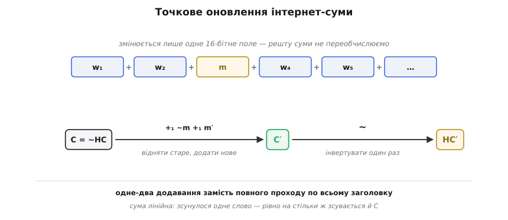
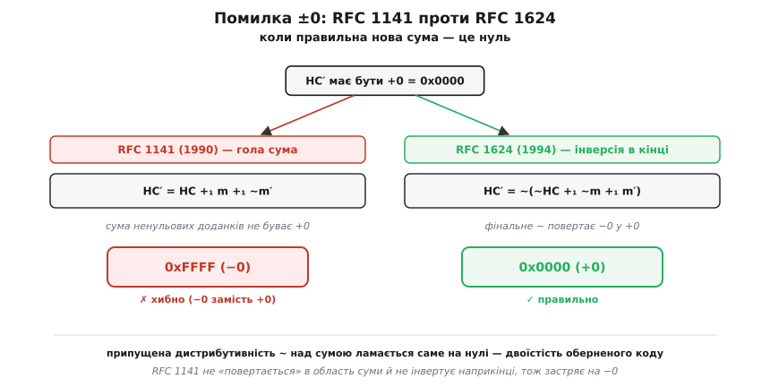

# 🧮 Точкове оновлення контрольної суми та помилка ±0

Маршрутизатор, що пересилає пакет, змінює в заголовку одне-єдине поле — лічильник TTL, який спадає на одиницю на кожному переході ([маршрутизація](root:com-transport/ip-routing) веде пакет через ланцюг вузлів, і кожен зменшує цей лічильник, щоб убити пакети, які заблукали в петлі). Заголовок змінився — отже, і його контрольна сума мусить змінитися. Але перераховувати всю суму щохопу, на кожному пакеті, на магістральному обладнанні — розкіш, якої ніхто не може собі дозволити. Постає суто математичне питання: якщо в блоці даних змінилося рівно одне 16-бітне поле, чи можна **полагодити** контрольну суму локально, не перечитуючи решту? Відповідь — так, і те, *чому* так, і те, де сховалася підступна пастка, — це маленька, але повчальна алгебра оберненого коду.

## Сума як лінійна функція полів

Спершу домовимося про позначення. Інтернет-сума живе в **оберненому коді** — поданні чисел, де від'ємне дістають інверсією всіх бітів, а перенос за верхній край не викидають, а завертають назад у молодші розряди. Через це в оберненому коді є два записи нуля: `0x0000` («+0») і `0xFFFF` («−0»), — і саме ця двоїстість зараз усе вирішить.

> 🔧 **Навіщо це.** Уся ця історія — не про арифметику взагалі, а про **обернений код** зокрема. У звичному [доповняльному коді](root:math-number-theory/twos-complement-algebra) нуль один, і жодної пастки нема. Тільки-но перенос завертають назад і з'являється другий нуль, локальне оновлення суми стає тонкою операцією, у якій легко схибити на один-єдиний біт — що й сталося зі стандартом 1990 року.

Що варто мати перед очима про обернений код: [обернений код](root:math-number-theory/ones-complement) — це подання, де заперечення числа — то просто порозрядна інверсія (`−x = ~x`), а додавання завертає перенос назад; звідси й два нулі — `0x0000` та `0xFFFF` — обидва означають те саме число нуль.

```
Позначення (усі числа — 16-бітні):
  C    — сума всіх 16-бітних слів заголовка в оберненому коді
  HC   — контрольна сума, що лежить у пакеті,  HC = ~C
  m    — старе значення поля, яке змінюється (напр., слово з TTL)
  m′   — нове значення того самого поля
  +₁   — додавання В ОБЕРНЕНОМУ КОДІ (із загорнутим переносом)
  ~x   — порозрядна інверсія;  в оберненому коді це і є −x

Дві тотожності, на яких усе тримається:
  −m      = ~m                  заперечення — то інверсія бітів
  x +₁ ~x = 0xFFFF = −0         для БУДЬ-ЯКОГО x
```

Тепер сама суть. Контрольна сума — це `HC = ~C`, де `C` — сума всіх 16-бітних слів заголовка. Слово «сума» тут ключове: `C` не якась хитра функція, а буквально `w₀ +₁ w₁ +₁ … +₁ wₙ₋₁`. А сума — **лінійна** за кожним доданком: якщо один доданок `wₖ` змінюється з `m` на `m′`, то весь результат зсувається рівно на різницю цих двох, і жодного іншого доданка чіпати не треба. Це та сама лінійність, що дає змогу поправити один рядок у касовому чеку, не переска­новуючи весь кошик: скасуй стару ціну, пробий нову — підсумок сам зсунеться на різницю.

Записавши це в оберненому коді, дістаємо оновлення суми:

```
прибрати старе поле  →  додати його обернене:   +₁ ~m
додати нове поле:                                +₁ m′

    C′ = C +₁ ~m +₁ m′            (RFC 1071, [Eqn. 1])
```

Саме цю формулу для суми вивів документ **RFC 1071** «Computing the Internet Checksum» (Роберт Бреден, Девід Борман, Крейг Партрідж, вересень 1988 року — усталений першоджерельний факт). «Відняти старе, додати нове» — і все, решта суми лишається недоторканою. Одне-два додавання замість повного проходу по заголовку.


*Лінійність у дії: із усіх слів заголовка змінюється тільки одне (m → m′), тож нову суму не рахують заново, а зсувають готову — `C′ = C +₁ ~m +₁ m′` — і лише наприкінці один раз інвертують у контрольну суму `HC′ = ~C′`. Той єдиний фінальний `~` виявиться геть не дрібницею.*

## Від суми до контрольної суми: чесний рецепт

Досі йшлося про суму `C`. Але в пакеті лежить не `C`, а її інверсія `HC = ~C`. Тож повний, чесний рецепт оновлення такий: **повернутися** із контрольної суми в область суми, полагодити суму, інвертувати назад.

```
    C  = ~HC                        відновлюємо суму з контрольної суми
    C′ = C +₁ ~m +₁ m′              зсуваємо на різницю полів
    HC′ = ~C′

а разом:

    HC′ = ~( ~HC +₁ ~m +₁ m′ )      (RFC 1624, [Eqn. 3])
```

Це і є коректна формула, яку дав документ **RFC 1624** «Computation of the Internet Checksum via Incremental Update» (Аніл Рійзінґані, компанія Digital Equipment Corporation, травень 1994 року — веб-звірено з тексту RFC). Розберімо її по кісточках, бо кожен `~` тут на своєму місці не випадково. Внутрішнє `~HC` повертає нас до суми `C`. Далі `+₁ ~m +₁ m′` зсуває суму на різницю полів. А зовнішній, **єдиний фінальний** `~` перетворює готову нову суму назад у контрольну. Один вхід у область суми, один вихід із неї. Запам'ятаймо цю фінальну інверсію: вона — головна дійова особа всієї драми.

## Спокуса скоротити — і пастка RFC 1141

Формула `HC′ = ~(~HC +₁ ~m +₁ m′)` має два зайві `~` порівняно з голою сумою: одне на вході (`~HC`) і одне на виході. Спокуса очевидна: а чи не можна їх поскорочувати й лишити саме додавання? Адже алгебраїчно `~HC = C`, тож розкриймо дужки та згорнімо все в один вираз без інверсій:

```
    HC′ = HC +₁ m +₁ ~m′            (RFC 1141, [Eqn. 2])
```

Саме цю формулу запропонував **RFC 1141** «Incremental Updating of the Internet Checksum» (Трейсі Меллорі та А. Кульберг, січень 1990 року — веб-звірено). За значенням вона правильна: `HC +₁ m +₁ ~m′` — це те саме число, що й `HC + m − m′`, бо `~m′ = −m′`. Здається, ідеально: жодних інверсій, чисте додавання, на дві інструкції дешевше.

Пастка в тому, що результат тепер — **гола сума**. А в оберненому коді гола сума ненульових доданків має одну прикру ваду: вона **не вміє бути +0**. Погляньмо, чому. Візьмімо будь-яке `x` і додаймо його обернене:

```
    x + ~x = 0xFFFF                 (звичайне додавання: ~x = 0xFFFF − x)
    отже  x +₁ ~x = 0xFFFF = −0     переносу нема, завертати нічого
```

Результат — `0xFFFF`, тобто «−0», а не «+0». І це не окремий випадок, а закономірність: коли сума ненульових чисел мала б дати нуль, обернене додавання **завжди** віддає `0xFFFF`, ніколи `0x0000`. Причина проста: `0x0000` як результат виникає лише тоді, коли доданки й самі нульові; тільки-но серед них є ненульові, будь-яке справжнє обнулення проходить через завернутий перенос і осідає на `0xFFFF`. Єдиний нуль, до якого дотягується додавання ненульових доданків, — це «−0».

Ось де ломить формула RFC 1141. Вона виражає `HC′` **голою сумою**. Тож коли правильна нова контрольна сума мала б бути `+0 = 0x0000`, формула незворушно віддає `−0 = 0xFFFF`. Один зайвий біт з усіх шістнадцяти — але неправильний. RFC 1624 діагностує це точно: формула «припускала, що обернений код має дистрибутивну властивість, якої немає, коли результат — нуль» (цитата з RFC 1624). Дистрибутивність тут — це мовчазне сподівання, що `~` можна проносити крізь суму й розкладати дужки будь-коли; насправді це проходить скрізь, **окрім** нуля, де воно плутає два нулі місцями.

А чому ж коректна формула не спотикається? Через ту саму фінальну інверсію. RFC 1624 не лишає результат голою сумою: він рахує суму `C′` (яка, коли треба, чесно виходить `−0 = 0xFFFF`), а тоді **один раз інвертує** — і `~(−0) = ~0xFFFF = 0x0000 = +0`. Той єдиний фінальний `~` бере «−0», що його неминуче народжує додавання, і повертає в правильний «+0». Ось навіщо було повертатися в область суми й інвертувати наприкінці: без цього виходу через інверсію застрягаєш на хибному нулі.


*Розвилка на нулі. Обидві формули за значенням однакові, та коли правильна відповідь — «+0», гола сума RFC 1141 (`HC +₁ m +₁ ~m′`) застряє на «−0» = `0xFFFF`, бо додавання ненульових доданків не дотягується до `0x0000`. RFC 1624 (`~(~HC +₁ ~m +₁ m′)`) рахує суму й **інвертує один раз** — і `~(−0)` повертає правильний «+0» = `0x0000`.*

Є ще й ощадливий варіант тієї самої правильної відповіді. RFC 1624 зауважує, що дві зайві інструкції можна прибрати, якщо віднімати не через «додай обернене», а справжнім відніманням із **позикою** (borrow):

```
    HC′ = HC −₁ ~m −₁ m′            (RFC 1624, [Eqn. 4])
```

Тонкість тут гідна окремої уваги. За значенням `HC −₁ ~m −₁ m′` — це той самий вираз `HC + m − m′`, що й у RFC 1141. Різниця **лише** в тому, якою машинною дією його зібрати: RFC 1141 будує його **додаваннями** (перенос → «−0»), а `[Eqn. 4]` — **відніманнями** (позика → «+0»). Віднімання з позикою, на відміну від додавання з переносом, спокійно дає `0x0000`, коли операнди рівні. Одна й та сама алгебра, а нулі різні — усе залежить від того, перенос чи позика заведе тебе до нуля.

## Числовий приклад: маршрутизатор зменшує TTL

Візьмімо справжній заголовок IPv4 і проведімо оновлення руками. Хай у пакеті лежить заголовок (поле контрольної суми вже заповнене):

```
  4500 003c 1c46 4000 4006 B1E6 ac10 0a63 ac10 0a0c
                      ↑    ↑
                    TTL,   контрольна сума HC = 0xB1E6
                    proto
```

Слово `0x4006` — це TTL (старший байт `0x40` = 64) і номер протоколу (молодший байт `0x06` = TCP). Контрольна сума `HC = 0xB1E6`; відповідна сума полів `C = ~HC = 0x4E19`. Маршрутизатор зменшує TTL на одиницю: `64 → 63`, тобто слово `m = 0x4006` стає `m′ = 0x3F06` (змінився лише старший байт, різниця `−0x0100`).

**Оновлюємо за RFC 1624 `[Eqn. 3]`:** `HC′ = ~(~HC +₁ ~m +₁ m′)`.

```
  ~HC = ~0xB1E6 = 0x4E19          ( = C, повернулися в область суми )
  ~m  = ~0x4006 = 0xBFF9

  0x4E19 +₁ 0xBFF9:
     0x4E19 + 0xBFF9 = 0x10E12    → завернути: 0x0E12 + 0x1 = 0x0E13
  0x0E13 +₁ 0x3F06 = 0x4D19       ( = C′ )

  HC′ = ~0x4D19 = 0xB2E6          ← нова контрольна сума
```

**Звірка повним перерахунком.** Нова сума полів = стара сума `−0x0100`: `0x24E17 − 0x0100 = 0x24D17`, завертаємо перенос `0x4D17 + 0x2 = 0x4D19`, інвертуємо: `~0x4D19 = 0xB2E6`. Збіглося: точкове оновлення дало рівно те саме, що й повний прохід, — але коштувало кількох додавань замість перечитування всього заголовка.

Тут, у звичайному випадку, і формула RFC 1141 дала б **те саме** `0xB2E6` (`0xB1E6 +₁ 0x4006 +₁ 0xC0F9 = 0xB2E6`) — бо результат не нуль, і пастки нема. Помилка ±0 спить доти, доки нова сума випадково не виявиться нулем. Ось як це виглядає в коді (обернене додавання — у широкому акумуляторі, перенос завертаємо в кінці):

:::tabs
```c
#include <stdint.h>

// RFC 1624 [Eqn. 3]:  HC' = ~(~HC + ~m + m'),  де + — обернене додавання.
// hc — стара контрольна сума з пакета; old/new — старе й нове 16-бітні поля.
uint16_t csum_patch(uint16_t hc, uint16_t old_field, uint16_t new_field) {
    uint32_t sum = (uint16_t)~hc;           // ~HC = C: повертаємось в область суми
    sum += (uint16_t)~old_field;            // + ~m  — прибрати старе поле
    sum += new_field;                       // + m'  — додати нове поле
    while (sum >> 16)                        // загорнути перенос, доки він є
        sum = (sum & 0xFFFF) + (sum >> 16);
    return (uint16_t)~sum;                   // ЄДИНА фінальна інверсія: −0 → +0
}
```
```python
def csum_patch(hc: int, old_field: int, new_field: int) -> int:
    # RFC 1624 [Eqn. 3]:  HC' = ~(~HC + ~m + m')
    s = (~hc & 0xFFFF) + (~old_field & 0xFFFF) + new_field
    while s >> 16:                           # загорнути перенос
        s = (s & 0xFFFF) + (s >> 16)
    return ~s & 0xFFFF                        # єдина фінальна інверсія: −0 → +0
```
:::

## Коли пастка справді спрацьовує

Щоб побачити помилку на власні очі, візьмімо той приклад, яким її демонструє сам RFC 1624 (числа веб-звірено з тексту документа). Хай сума всіх **інших** октетів заголовка (крім поля, що змінюється) дорівнює `0xCD7A`, а поле міняється з `m = 0x5555` на `m′ = 0x3285`. Стара контрольна сума:

```
  HC = ~(0xCD7A +₁ 0x5555) = ~0x22D0 = 0xDD2F
```

Тепер порахуймо нову суму трьома шляхами й порівняймо:

```
ПОВНИЙ ПЕРЕРАХУНОК (еталон):
  HC′ = ~(0xCD7A +₁ 0x3285) = ~0xFFFF = 0x0000        ← правильно (+0)

RFC 1141 [Eqn. 2]  (гола сума):
  HC′ = 0xDD2F +₁ 0x5555 +₁ ~0x3285
      = 0xDD2F +₁ 0x5555 +₁ 0xCD7A = 0xFFFF           ← ХИБНО (−0 замість +0)

RFC 1624 [Eqn. 3]  (інверсія в кінці):
  HC′ = ~(0x22D0 +₁ 0xAAAA +₁ 0x3285)
      = ~0xFFFF = 0x0000                               ← правильно (+0)
```

Різниця в один біт — `0xFFFF` замість `0x0000` — і вона народжується рівно там, де внутрішня сума виходить `0xFFFF` (−0): RFC 1624 інвертує її наостанок у `0x0000`, а RFC 1141, не маючи фінальної інверсії, лишає `0xFFFF`.

Чи «впаде» через це пакет? У випадку заголовка IP — на диво, ні: перевірка на приймачі складає всі слова разом із полем суми й чекає `0xFFFF`, а обидва нулі, `0x0000` і `0xFFFF`, цю перевірку проходять однаково (бо в оберненому коді це той самий нуль). Але контрольна сума, порахована точково, **зобов'язана** дорівнювати тій, що дав би повний перерахунок, — інакше це вже не та функція. І там, де різницю між двома нулями видно неозброєним оком, вона стає болючою: та сама формула оновлення працює й для сум TCP та UDP, коли пристрій **NAT** переписує адреси й порти на льоту. А в UDP значення `0x0000` у полі суми зарезервоване й означає «суми нема, не перевіряй» — тож переплутати там `0x0000` з `0xFFFF` уже не косметика, а зміна змісту. Саме тому стандарт мусив мати **одну** правильну відповідь, а не дві «майже однакові».

> 🔧 **Навіщо це.** Пишете маршрутизатор, NAT, фаєрвол чи будь-що, що править поля в заголовках на льоту, — беріть формулу RFC 1624 (`[Eqn. 3]` або ощадливу `[Eqn. 4]`), а не стару RFC 1141. Уся різниця між правильним і хибним кодом — це та **єдина фінальна інверсія** (чи віднімання з позикою замість додавання з переносом). Вона майже нічого не коштує, а без неї ваш пристрій раз на багато мільйонів пакетів виставить `0xFFFF` там, де мало бути `0x0000`, — і десь далі по дорозі, у контексті UDP, це вилізе непроханою «відсутньою сумою». Дешевий урок про те, що коли нулів два, кожну алгебру треба перевіряти саме на нулі.

---

Підсумок. Контрольну суму можна оновлювати **точково** тому, що вона — інверсія звичайної **суми**, а сума лінійна за кожним полем: змінилося одне 16-бітне слово `m → m′` — і достатньо зсунути суму на різницю (`C′ = C +₁ ~m +₁ m′`), не чіпаючи решти. Коректна формула — RFC 1624 `HC′ = ~(~HC +₁ ~m +₁ m′)`: повернутися в область суми, зсунути, **один раз** інвертувати. Рання спроба RFC 1141 `HC′ = HC +₁ m +₁ ~m′` скоротила цю фінальну інверсію й лишила голу суму — а гола сума ненульових доданків в оберненому коді ніколи не дає `+0 = 0x0000`, лише `−0 = 0xFFFF`. Тому, коли правильна відповідь — нуль, RFC 1141 віддає `0xFFFF` замість `0x0000`. Ціна помилки — один біт; причина — два нулі оберненого коду й припущена дистрибутивність, що ламається саме на нулі; ліки — та сама фінальна інверсія, яку не можна скорочувати.
