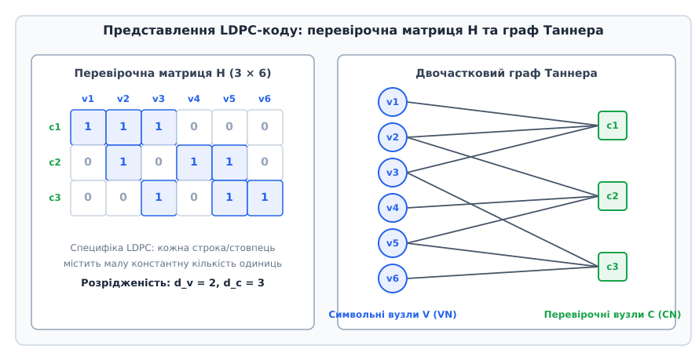
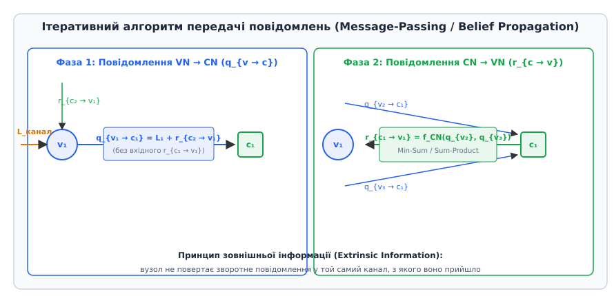
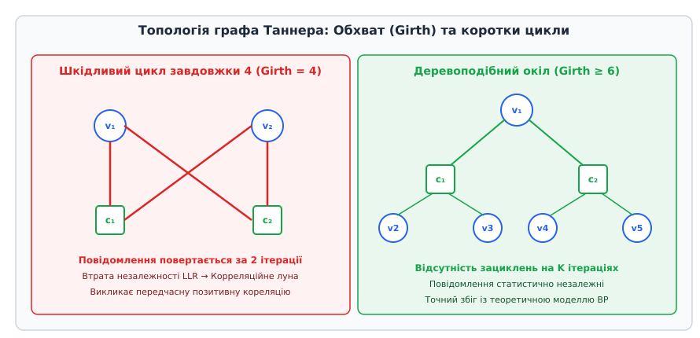
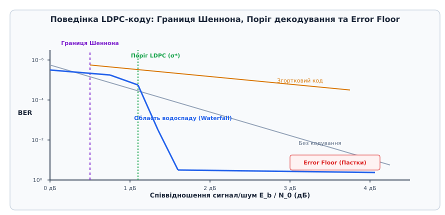

# Коди з низькою щільністю перевірок на парність (LDPC)

<preknowlist>
- [Двочастковий граф](topic:sf-algorithms/bipartite-graph) — структура графа з двома незалежними множинами вершин (символьні та перевірочні вузли).
- [Матриця суміжності](topic:sf-algorithms/adjacency-matrix) — двовимірне представлення зв'язків між вузлами в графі.
- [Скінченні поля](topic:math-algebra/finite-field-arithmetic) — алгебраїчні структури GF(2) для арифметики за модулем 2.
- [Графи-розширювачі](topic:math-combinatorics/expander-graphs) — розширення структурних властивостей графів Таннера для гарантії кодової відстані.
</preknowlist>

Коди з низькою щільністю перевірок на парність (Low-Density Parity-Check, LDPC) є класичним прикладом того, як кардинальна зміна фундаментальної парадигми дозволяє розв'язати проблему, яка десятиліттями вважалася обчислювально нездійсненною. У теорії інформації та алгоритмах корекції помилок LDPC-коди посідають унікальне місце: вони поєднують математичну здатність наближатися до межі Шеннона на відстань у частки відсотка із суворо лінійною часовою складністю декодування `O(n)`.

Сучасні системи бездротового зв'язку 5G NR, стандарти Wi-Fi 6/7, супутникове мовлення DVB-S2X та високошвидкісні накопичувачі NVMe SSD спираються саме на LDPC-коди для надійної передачі даних крізь екстремально зашумлені фізичні канали.

## Проблема завадостійкого кодування та межа Шеннона

Будь-який фізичний канал передачі даних — чи то радіоефір між базовою станцією та смартфоном, чи то магнітна поверхня жорсткого диска або вита пара Ethernet — зазнає впливу шуму. Шум спотворює передані електричні або радіочастотні сигнали, перетворюючи логічні нулі на одиниці й навпаки. Завдання теорії завадостійкого кодування полягає у введенні контрольованої надмірності (Redundancy) в інформаційне повідомлення, що дозволяє приймачу виявляти та виправляти помилки, які виникли під час транспортування через зашумлене середовище.

У 1948 році Клод Шеннон опублікував свою фундаментальну працю, яка поклала початок теорії інформації. Шеннон довів математичну теорему про кодування для зашумленого каналу. Вона стверджує, що для кожного фізичного каналу існує суворо визначена межа — пропускна здатність (Channel Capacity `C`). Якщо швидкість передачі інформації `R` (вимірювана в бітах на один символ каналу) є меншою за пропускну здатність `R < C`, то існують такі коди, які дозволяють досягти довільно малої ймовірності помилки декодування `P_e -> 0`. Для класичного каналу з адитивним білим гаусовим шумом (AWGN) при BPSK-модуляції фундаментальна границя Шеннона визначає абсолютний мінімум співвідношення сигнал/шум `E_b / N_0 = -1.59 дБ`, нижче якого безпомилкова передача інформації зі швидкістю `R -> 0` є фізично неможливою.

Однак доведення Шеннона було існувальним і неконструктивним: воно спиралося на випадкові кодові ансамблі величезної довжини `n`. Щоб декодувати такий випадковий бінарний код методом максимальної правдоподібності (Maximum Likelihood, ML), приймач повинен виміряти відстань від отриманого з каналу вектора до кожного з `2^k` можливих кодових слів (де `k` — кількість інформаційних бітів у блоці). Для практичних систем, де довжина кодового блоку становить тисячі бітів (наприклад, `k = 1000`), перебір `2^1000` варіантів є обчислювально неможливим, оскільки це число перевищує кількість елементарних частинок у спостережуваному Всесвіті.

Протягом кількох десятиліть після праці Шеннона дослідники намагалися подолати цей обчислювальний бар'єр шляхом конструювання кодів із суворою алгебраїчною структурою. Було створено коди Геммінга, коди Боуза-Чоудхурі-Хоквінгема (BCH) та коди Ріда-Соломона (Reed-Solomon). Ці коди мали елегантні симетрії та мали аналітичні алгоритми декодування (наприклад, алгоритм Берлекампа-Мессі або алгоритм Евкліда), що дозволяли шукати локатор помилок через корені поліномів над скінченними полями Галуа `GF(2^m)`.

Проте алгебраїчні коди мали два фундаментальні обмеження. По-перше, їхня виправна спроможність зростала повільніше, ніж довжина коду, а при спробах наблизитися до межі Шеннона складність точного алгебраїчного декодування зростала експоненціально. По-друге, вони працювали переважно з «жорсткими рішеннями» (Hard Decisions, бінарними 0 та 1), втрачаючи цінну аналогову інформацію про рівень впевненості приймача (Soft Information).

З погляду теорії обчислювальної складності, загальна задача декодування довільного лінійного коду за допомогою перевірочної матриці `H` у зашумленому каналі належить до класу NP-повних задач (теорема Берлекампа, Мак-Еліса та ван Тілборга, 1978 рік). Задача пошуку найближчого кодового слова (Nearest Codeword Problem) тотожно зводиться до задачі виповнюваності 3-SAT. Це означає, що точний глобальний оптимум для довільної матриці у загальному випадку вимагає експоненціальних обчислювальних витрат. Щоб зробити декодування практично реалізованим за лінійний час `O(n)`, необхідно було кардинально змінити сам підхід до структури коду — відмовитися від пошуку точного глобального алгебраїчного оптимуму на користь локального ітеративного обміну повідомленнями.

## Ідея Галлагера: Розрідженість як ключ до лінійного часу

У 1960 році аспірант Массачусетського технологічного інституту (MIT) Роберт Галлагер (Robert Gallager) запропонував відмовитися від пошуку складних алгебраїчних симетрій і повністю перевернути уявлення про побудову завадостійких кодів. Замість того щоб визначати код через щільну генераторну матрицю `G` (розміром `k x n`), Галлагер запропонував будувати код через вибір надзвичайно розрідженої перевірочної матриці `H` (Parity-Check Matrix) розміром `m x n` over `GF(2)`, де `m = n - k` є кількістю перевірочних рівнянь на парність.

Детальніше про драматичну історію створення, забуття на тридцять п'ять років та подальше перевідкриття кодів Галлагера дивіться в [📜 Історія відкриття та забуття кодів Галлагера](topic:com-modulation/ldpc-codes/hist-gallager-ldpc.md).

Матриця `H` називається матрицею з низькою щільністю перевірок на парність (LDPC), якщо кількість ненульових елементів (одиниць) у ній є мізерно малою часткою від загального розміру матриці `m x n`.

Розрізняють два основні класи LDPC-кодів:
1. **Регулярні LDPC-коди `(n, d_v, d_c)`:** Кожен стовпець матриці `H` містить однакову малу кількість одиниць `d_v` (ступінь символьного вузла), а кожен рядок містить однакову кількість одиниць `d_c` (ступінь перевірочного вузла), причому `d_v << m` та `d_c << n`. Галлагер вивчав саме регулярні ансамблі, де матриця `H` розбивалася на `d_v` горизонтальних блоків, кожен з яких містив випадкові перестановки одиниць.
2. **Нерегулярні LDPC-коди:** Степені стовпців та рядків не є константами, а розподілені відповідно до спеціальних поліномів розподілу ступенів `λ(x) = ∑ λ_i · x^{i-1}` (для символьних вузлів) та `ρ(x) = ∑ ρ_i · x^{i-1}` (для перевірочних вузлів). Нерегулярна структура дозволяє вузлам із високим ступенем швидко збігатися до правильних значень і спрямовувати декодування решти вузлів.

Загальна кількість одиниць у регулярній перевірочній матриці `H` складає `|E| = n · d_v = m · d_c`. Оскільки `d_v` та `d_c` є малими константами (наприклад, `d_v = 3`, `d_c = 6`), щільність ненульових елементів у матриці дорівнює:

```
щільність = (n · d_v) / (m · n) = d_v / m
```

При зростанні довжини кодового слова `n -> ∞` (і відповідно `m -> ∞`) щільність ненульових елементів прямує до нуля: `d_v / m -> 0`. Наприклад, для кодового блоку довжиною `n = 10000` бітів із `d_v = 3` та `m = 5000` щільність становить лише `3 / 5000 = 0.0006` (тобто `99.94%` елементів матриці `H` є нулями).

Саме ця розрідженість перетворює важку системну задачу декодування на множину локальних обчислень. Замість вирішення глобальної системи з `m` рівнянь із `n` невідомими, декодер працює з локальними рівняннями, кожне з яких включає лише `d_c` бітів. Завдяки цьому обчислювальна складність однієї ітерації декодування є строго лінійною від довжини коду: `O(n)`.

## Двочастковий граф Таннера

У 1981 році Майкл Таннер (Michael Tanner) запропонував графове представлення розріджених перевірочних матриць. Граф Таннера `G = (V_v ∪ V_c, E)` робить наочним обмін інформацією під час ітеративного декодування.

Вершини графа Таннера розділені на дві незалежні множини (двочастковий граф):
- **Символьні вузли (Variable Nodes, VN):** Множина `V_v = {v_1, v_2, ..., v_n}`, яка відповідає `n` бітам кодового слова.
- **Перевірочні вузли (Check Nodes, CN):** Множина `V_c = {c_1, c_2, ..., c_m}`, яка відповідає `m` рівнянням перевірки на парність.

Ребро `(v_j, c_i) ∈ E` існує у графі тоді й лише тоді, коли відповідний елемент перевірочної матриці `H_{i,j} = 1`.


*Двочастковий граф Таннера (праворуч) та еквівалентна перевірочна матриця H (ліворуч). Кожен символьний вузол v_j з'єднаний лише з тими перевірочними вузлами c_i, у яких відповідний елемент H_{i,j} дорівнює 1.*

Рівняння перевірки парності для кожного перевірочного вузла `c_i` у графі Таннера має вигляд:

```
∑_{j: H_{i,j} = 1} v_j = 0 (mod 2)
```

Це означає, що сума всіх бітів кодового слова, приєднаних до вузла `c_i`, повинна бути парною (дорівнювати 0 в арифметиці `GF(2)`). Якщо для приймального вектора хоча б один перевірочний вузол дає суму 1, це свідчить про наявність помилок у приєднаних бітах.

Конструктивна швидкість коду (Design Rate `R_design`) визначається алгебраїчним відношенням кількості інформаційних бітів до загальної довжини блоку:

```
R_design = (n - m) / n = 1 - m / n = 1 - d_v / d_c
```

Для регулярного коду з `d_v = 3` та `d_c = 6` швидкість коду становить `R = 1 - 3/6 = 0.5` (кодування зі подвоєнням обсягу даних). Для коду з `d_v = 3` та `d_c = 9` швидкість дорівнює `R = 1 - 3/9 = 2/3`.

## Обчислювальний розрив: Кодування vs Декодування

У кодах LDPC виникає виражена асиметрія між обчислювальною складністю кодування (на стороні передавача) та декодування (на стороні приймача):

1. **Складність кодування:** Якщо будувати кодер на основі прямого множення інформаційного вектора `u` (довжиною `k`) на генераторну матрицю `G` (`k x n`), виникає обчислювальна проблема. Навіть якщо перевірочна матриця `H` є дуже розрідженою, відповідна генераторна матриця `G` (отримана через зведення `H` до систематичного вигляду `H = [A | I_m] => G = [I_k | A^T]`) майже завжди виявляється щільною (`O(n^2)` одиниць). Пряме множення `u · G` вимагає `O(n^2)` операцій. Для високих швидкостей передачі (наприклад, 10 Гбіт/с у мережах 5G або 10G Ethernet) квадратна складність `O(n^2)` є неприйнятною, оскільки вона вимагає занадто великої площі кремнію та високого енергоспоживання кодера.
2. **Складність декодування:** Завдяки розрідженості матриці `H` ітеративне декодування на графі Таннера виконується за строго лінійний час `O(n)` на одну ітерацію.

Щоб ліквідувати цей обчислювальний розрив і зробити кодування також лінійним `O(n)`, у сучасних практичних системах використовують спеціально структуровані коди LDPC:
- **Квазіциклічні коди (QC-LDPC):** Перевірочна матриця `H` будується з квадратних блоків-матриць зсуву (Circulant Shift Matrices) розміру `Z x Z`. Така матриця задається лише підматрицею зсувів, що дозволяє реалізувати кодер на основі простих регістрів зсуву з зворотним зв'язком (LFSR) або паралельних векторних множників за лінійний час `O(n)`. саме QC-LDPC коди обрані для 5G NR та Wi-Fi 6.
- **Нижньотрикутні коди (Метод Річардсона-Урбанке):** Перевірочна матриця `H` шляхом перестановки рядків і стовпців зводиться до майже нижньотрикутної форми (Approximate Lower Triangular Form, ALT). Це дозволяє обчислювати паритетні біти методом зворотної підстановки за `O(n + g^2)` операцій, де `g` — малий параметр розриву (Gap), який на практиці не перевищує кількох одиниць.

## Механізм ітеративного декодування (Belief Propagation)

Серцем ефективності LDPC-кодів є ітеративний алгоритм передачі повідомлень (Message-Passing Algorithm), також відомий як алгоритм розповсюдження довіри (Belief Propagation, BP) або Sum-Product Algorithm.

Детальний математичний вивід імовірнісних співвідношень та спрощень розібрано в [🧮 Математика алгоритму Belief Propagation та матриць Таннера](topic:com-modulation/ldpc-codes/math-belief-propagation.md).

Замість прийняття жорстких рішений (0 або 1) на кожному кроці, декодер працює з безперервними величинами — логарифмічними відношеннями правдоподібності (Log-Likelihood Ratio, LLR). Для біта `x_j` канальне значення LLR визначається як логарифм відношення умовних ймовірностей:

```
L_j = ln( P(x_j = 0 | y_j) / P(x_j = 1 | y_j) )
```

При модуляції BPSK (`0 -> +1`, `1 -> -1`) у каналі AWGN із дисперсією шуму `σ²` канальне LLR обчислюється за простою формулою: `L_j = (2 · y_j) / σ²`. Якщо `L_j > 0`, біт швидше за все дорівнює 0; якщо `L_j < 0`, біт швидше за все дорівнює 1. Модуль `|L_j|` визначає ступінь впевненості приймача.

Декодування відбувається ітеративно шляхом обміну повідомленнями вздовж ребер графа Таннера. Кожна ітерація складається з двох послідовних фаз.


*Двофазний цикл ітерації Belief Propagation. Зліва: символьний вузол v_1 агрегує канальне LLR та повідомлення від інших перевірочних вузлів. Справа: перевірочний вузол c_1 обчислює умовну парність для v_1.*

### Фаза 1: Передача повідомлень від Символьних до Перевірочних вузлів (VN -> CN)

Символьний вузол `v` надсилає перевірочному вузлу `c` повідомлення `q_{v → c}`, яке є оцінкою LLR біта `v`, базованою на початковому канальному значенні та інформації, отриманій від усіх *інших* сусідніх перевірочних вузлів:

```
q_{v → c} = L_v + ∑_{c' ∈ N(v) \ {c}} r_{c' → v}
```

Ключовим принципом тут є **принцип зовнішньої інформації (Extrinsic Information)**: вузол `v` не включає у повідомлення до `c` те повідомлення `r_{c → v}`, яке щойно прийшло від цього ж вузла `c`. Це запобігає зацикленню та передчасному позитивному зворотному зв'язку.

### Фаза 2: Передача повідомлень від Перевірочних до Символьних вузлів (CN -> VN)

Перевірочний вузол `c` обчислює повідомлення `r_{c → v}` для символьного вузла `v`. Це повідомлення виражає LLR того, що біт `v` дорівнює 0 або 1, виходячи з умови, що сума всіх інших приєднаних бітів має бути парною.

У точній версії алгоритму (Sum-Product) оновлення виконується за допомогою гіперболічних тригонометричних функцій:

```
r_{c → v} = ( ∏_{v' ∈ N(c) \ {c}} sign(q_{v' → c}) ) · 2 · arctanh( ∏_{v' ∈ N(c) \ {c}} tanh( |q_{v' → c}| / 2 ) )
```

На практиці обчислення `tanh` та `arctanh` замінюють набагато простішим обчислювальним наближенням — **алгоритмом Min-Sum**:

```
r_{c → v} ≈ ( ∏_{v' ∈ N(c) \ {c}} sign(q_{v' → c}) ) · min_{v' ∈ N(c) \ {c}} |q_{v' → c}|
```

В алгоритмі Min-Sum перевірочний вузол просто бере мінімальний модуль вхідних LLR серед усіх своїх сусідів (найслабшу ланку впевненості) та визначає підсумковий знак як добуток знаків усіх сусідніх повідомлень.

Для виправлення систематичної переоцінки правдоподібності в Min-Sum застосовують нормалізований Min-Sum (Normalized Min-Sum) із множником `γ ∈ (0.7, 0.9)`:

```
r_{c → v}^{norm} = γ · r_{c → v}^{Min-Sum}
```

### Прийняття рішення та перевірка синдрому

Наприкінці кожної ітерації для кожного символьного вузла обчислюється підсумкове апостеріорне LLR:

```
L_total(v) = L_v + ∑_{c ∈ N(v)} r_{c → v}
```

Формується вектор твердого рішення `ĉ`: `ĉ_v = 0`, якщо `L_total(v) ≥ 0`, і `ĉ_v = 1`, якщо `L_total(v) < 0`.

Декодер обчислює синдром `s = H · ĉ^T (mod 2)`. Якщо `s = 0`, кодове слово повністю відновлено без помилок, і ітерації припиняються раніше ліміту. Оскільки більшість блоків при нормальному рівні шуму декодуються за 3–6 ітерацій, рання зупинка синдрому знижує енергоспоживання приймача на `70–80%`.

Повну реалізацію декодера Min-Sum на мовах C та C++ з поясненням структур даних дивіться в [⚙️ Реалізація декодера Min-Sum на C та C++](topic:com-modulation/ldpc-codes/proj-ldpc-decoder.md), а опис виробничого API кодека — в [📋 Інтерфейс бібліотеки LDPC-кодека](topic:com-modulation/ldpc-codes/api-ldpc-codec.md).

## Топологія графа Таннера: Обхват (Girth) та пастки (Trapping Sets)

Математична коректність імовірнісного алгоритму Belief Propagation спирається на припущення локальної деревидності (Tree-like local structure): протягом перших `K` ітерацій окіл кожного вузла у графі Таннера має бути деревом без зациклень. За цієї умови повідомлення, що надходять від різних гілок графа, є статистично незалежними.

Однак будь-який скінченний граф містить цикли. **Обхват графа (Girth `g`)** визначається як довжина найкоротшого циклу у графі Таннера. Оскільки граф Таннера є двочастковим, усі цикли мають парну довжину (`g = 4, 6, 8, 10, ...`).


*Порівняння топології графа Таннера. Ліворуч: шкідливий цикл завдовжки 4 (Girth = 4), який призводить до циркуляції корельованого шуму. Праворуч: локальне дерево з Girth ≥ 6, що забезпечує незалежність повідомлень.*

Вплив топології графа на збіжність алгоритму:
1. **Цикли завдовжки 4 (Girth = 4):** Це найгірша топологічна вада. У 4-циклі два символьні вузли з'єднані з двома однаковими перевірочними вузлами. Повідомлення повертається до свого відправника вже на 2-й ітерації. Це створює ефект «кореляційного луни» (Positive Correlation Feedback): вузол починає підсилювати власну хибну впевненість, що призводить до фатального заклинювання декодера. Під час конструювання перевірочних матриць `H` цикли 4 категорично усуваються спеціальними графовими алгоритмами (наприклад, Progressive Edge Growth, PEG).
2. **Цикли завдовжки 6 та 8:** При `Girth ≥ 6` повідомлення залишаються статистично незалежними протягом кількох початкових ітерацій, що дозволяє декодеру успішно виправляти більшість помилок.

### Пастки (Trapping Sets) та поріг помилок (Error Floor)

Навіть якщо граф не містить коротких циклів 4, при високих співвідношеннях сигнал/шум (SNR) спостерігається специфічний ефект — **Error Floor (поріг помилок)**. На кривій ймовірності помилки (BER) стрімке падіння раптово сповільнюється, утворюючи пологе плато.

Причиною є існування **пасток (Trapping Sets `(a, b)`)**. Пастка — це мала множина з `a` символьних вузлів, які разом з'єднані з `b` неоціненими (непарними) перевірочними вузлами. Якщо декілька бітів всередині пастки спотворені шумом каналу, вони утворюють замкнену конфігурацію, у якій внутрішні перевірки підтверджують неправильні значення бітів, і ітеративний декодер Min-Sum не здатний вирватися з цього локального мінімуму.

Для боротьби з пастками в сучасних системах використовують додаткові методи:
- Додавання легкого зовнішнього коду (наприклад, короткого коду BCH).
- Модифіковані алгоритми декодування (Post-Processing), які виявляють зациклені біти та примусово змінюють їхній знак.
- Динамічне насичення (LLR Clipping) для запобігання надмірному зростанню впевненості.

## Асимптотична поведінка та еволюція щільності

Для аналізу граничних можливостей LDPC-кодів при довжині блоку `n -> ∞` Том Річардсон та Рюдігер Урбанке у 2001 році розробили потужний аналітичний апарат — **Еволюцію щільності (Density Evolution)**.

Метод еволюції щільності відстежує, як змінюється функція щільності ймовірності `p_k(x)` LLR-повідомлень від ітерації `k` до ітерації `k+1`. Оскільки при `n -> ∞` граф Таннера є локально дереподібним, розподіл повідомлень на фазі VN -> CN та CN -> VN обчислюється через свертку (Convolution) відповідних щільностей ймовірності.

Завдяки еволюції щільності було доведено існування суворого **порогу декодування (`σ*` або `SNR*`)**:
- Якщо рівень шуму каналу `σ < σ*` (або `SNR > SNR*`), то при `n -> ∞` ймовірність помилки декодування прямує до нуля: `lim_{k->∞} P_e^{(k)} = 0`.
- Якщо рівень шуму `σ > σ*`, ймовірність помилки лишається обмеженою знизу константою, і декодування зазнає невдачі.


*Характеристика ймовірності помилки (BER) залежно від SNR. Показано область стрімкого падіння (Waterfall region) після досягнення порогу декодування σ* та вихід на плато Error Floor через наявність пасток.*

Графік залежності BER від SNR демонструє характерну область — **«Waterfall Region» (область водоспаду)**. Щойно співвідношення сигнал/шум перевищує поріг `σ*`, ймовірність помилки падає на 5–7 порядків при збільшенні потужності сигналу лише на соті частки децибела.

Завдяки оптимізації нерегулярних поліномів степенів `λ(x)` та `ρ(x)` за допомогою еволюції щільності та диференціальної еволюції, у 2001 році Сонгйонг Чун, Том Річардсон та Рюдігер Урбанке сконструювали нерегулярний LDPC-код із порогом декодування, який відстояв від абсолютної шеннівської межі лише на `0.0045 дБ` — відстань, що відповідає часткам відсотка від граничного фізичного ліміту.

## Апаратна реалізація та архітектура кремнієвих декодерів

При практичній реалізації декодерів LDPC в мікросхемах ASIC та FPGA виникає низка важливих інженерних компромісів:

1. **Квантування даних (Fixed-Point Quantization):** Дійсні значення LLR типу `float` вимагають великої площі кремнію та високого енергоспоживання. На практиці LLR квантують у фіксовану кому: для канального LLR використовують 4–6 бітів цілочисельного представлення, а для повідомлень `r_{c → v}` — 3–5 бітів. Квантування Min-Sum майже не втрачає у виправній спроможності (менше `0.1 дБ`), але зменшує площу декодера у 10 разів.
2. **Маршрутизація та розведення ребер (Routing Congestion):** У випадковому графі Таннера великої довжини `n = 10000` з'єднання між символьними та перевірочними вузлами утворюють складне «павутиння». При прямому малюванні на кристалі ASIC трасування мільйонів металевих провідників призводить до катастрофічного перевантаження топології. саме квазіциклічні коди (QC-LDPC) вирішують цю проблему, дозволяючи згрупувати дрібні вузли у блоки розміром `Z x Z` та використовувати регулярні шини зсуву.
3. **Паралельні та конвеєрні архітектури:** Залежно від вимог до пропускної здатності використовують три типи апаратної архітектури:
   - *Повнопаралельні (Fully Parallel):* Кожен вузол графа реалізується окремим обчислювальним блоком. Забезпечують швидкості понад 100 Гбіт/с, але вимагають мільйонів вентилів.
   - *Послідовні (Serial / Sub-block Parallel):* Один або кілька обчислювачів обробляють вузли по черзі. Вона є оптимальною для компактних мікроконтролерів.
   - *Накладені (Layered Decoding / Shuffle Decoding):* Перевірочні вузли оновлюються послідовно шар за шаром. Оновлені значення LLR від одного шару негайно використовуються на наступному шарі в межах тієї ж ітерації. Це прискорює збіжність алгоритму у 2 рази, скорочуючи необхідну кількість ітерацій від 30 до 15.

## Зв'язок із теорією складності та графами-розширювачами

Коди LDPC представляють фундаментальний інтерес не лише для інженерів зв'язку, а й для теорії обчислювальної складності, дискретної математики та теоретичної інформатики.

### Коди Таннера-Сіпсера-Спільмана на графах-розширювачах

У 1996 році Деніел Шпільман та Майкл Сіпсер (Michael Sipser, Daniel Spielman) об'єднали коди LDPC із теорією **графів-розширювачів (Expander Graphs)**. Вони довели епохальну теорему:

> Якщо двочастковий граф Таннера є `(d_v, d_c, γ, α)`-розширювачем, у якому будь-яка підмножина символьних вузлів розміром `S ≤ αn` має принаймні `γ · d_v · |S|` унікальних сусідніх перевірочних вузлів (при `γ > 1/2`), то найпростіший алгоритм декодування **Flip (перегортання бітів)** гарантовано виправляє до `(αn / 2)` помилок за **детермінований лінійний час `O(n)`**.

Алгоритм Flip працює наступним чином: на кожному кроці він підраховує кількість невиконаних перевірочних рівнянь для кожного символьного вузла і перегортає той біт, який порушує більше ніж `d_v / 2` перевірок. Це був перший у історії теорії інформації випадок конструктивної побудови коду з лінійною кодовою відстаню `d = Ω(n)` та детермінованим лінійним алгоритмом декодування.

### Зв'язок із проблемами SAT та фізикою спінового скла

З погляду математичної логіки, матриця перевірок LDPC є системою кон'юнктивних нормальних форм (CNF) над полем `GF(2)` (XOR-SAT). Декодування за допомогою Belief Propagation є варіацією алгоритму обміну повідомленнями на факторгафах (Factor Graphs).

Фізики виявили дивовижний ізоморфізм між ітеративним декодуванням LDPC-кодів та поведінкою неупорядкованих магнітних систем — **спінового скла (Spin Glasses)**. Мінімізація кількості невиконаних перевірок на парність відповідає пошуку основного стану (Ground State) у моделі Ізінга з випадковими зв'язками, а алгоритм Sum-Product є точним еквівалентом розрахунку вільної енергії Бете (Bethe Free Energy) у статистичній физиці.

## Порівняльний аналіз кодів 5G: LDPC vs Turbo vs Polar

При розробці стандарту мобільного зв'язку п'ятого покоління (5G NR) консорціум 3GPP провів масштабне порівняння трьох провідних родин завадостійких кодів:

| Характеристика | LDPC Коди | Turbo Коди | Polar Коди |
| :--- | :--- | :--- | :--- |
| **Складність декодування** | `O(n)` на ітерацію (паралельне) | `O(n)` на ітерацію (послідовне) | `O(n log n)` (SCL декодер) |
| **Пропускна здатність** | Надвисока (> 20 Гбіт/с) | Середня (< 1 Гбіт/с) | Помірна |
| **Латентність декодера** | Мінімальна (паралельні шари) | Висока (через інтерлівер) | Середня |
| **Поведінка при малих `n`** | Посередня (потрібні паддінги) | Хороша | Ідеальна (короткі кадри) |
| **Error Floor** | Дуже низький | Відносно високий | Відсутній |

За результатами випробувань консорціум 3GPP затвердив QC-LDPC коди для всіх каналів передачі даних 5G NR (через високу швидкість та низьку латентність), а Polar коди — для контрольних каналів сигналізації (де кодові блоки є дуже короткими).

## Практичні застосування та сучасні стандарти

Сьогодні LDPC-коди є панівним стандартом завадостійкого кодування у світі цифрових технологій:

1. **Мобільні мережі 5G NR (3GPP TS 38.212):** Консорціум 3GPP ухвалив QC-LDPC коди для всіх каналів передачі даних (Data Channels) eMBB та URLLC у мережах п'ятого покоління. Використовуються дві базові граф-матриці (Base Graphs BG1 та BG2), які підтримують гнучке масштабування довжини блоку від кількох десятків бітів до `n = 8448` бітів зі швидкостями від `1/5` до `9/10`.
2. **Бездротові мережі Wi-Fi (IEEE 802.11n/ac/ax/be):** Починаючи з Wi-Fi 4 і закінчуючи Wi-Fi 7, LDPC є ключовим кодом для досягнення швидкостей у кілька гігабіт на секунду.
3. **Супутниковий зв'язок (DVB-S2 / DVB-S2X):** Застосовуються каскадні коди LDPC + BCH з довжиною кадру `64800` бітів, що дозволяє передавати Ultra HD відеопотоки при SNR близько `0 дБ`.
4. **Твердотільні накопичувачі NVMe SSD:** Сучасні контролери флеш-пам'яті TLC/QLC NAND інтегрують багатоканальні апаратні LDPC-декодери на кристалі. Вони динамічно змінюють параметри LLR залежно від рівня зносу осередків пам'яті, продовжуючи термін служби SSD у 3–5 разів.

> 🔧 **Навіщо це.**
> Розуміння архітектури LDPC та алгоритму Belief Propagation є необхідним для розробників телекомунікаційних систем, DSP-інженерів, творців драйверів бездротових адаптерів та розробників контролерів систем збереження даних. Знання механіки Min-Sum та LLR дозволяє правильно налаштовувати квантування аналого-цифрових перетворювачів (ADC), оптимізувати обсяг пам'яті під граф Таннера у FPGA/ASIC реалізаціях та ефективно діагностувати проблеми втрати пакетів у радіоканалах з високим рівнем завад.

Розріджена структура матриць Галлагера та графове декодування Таннера перетворили абстрактне теоретичне поняття межі Шеннона на повсякденну інженерну реальність цифрової цивілізації.
