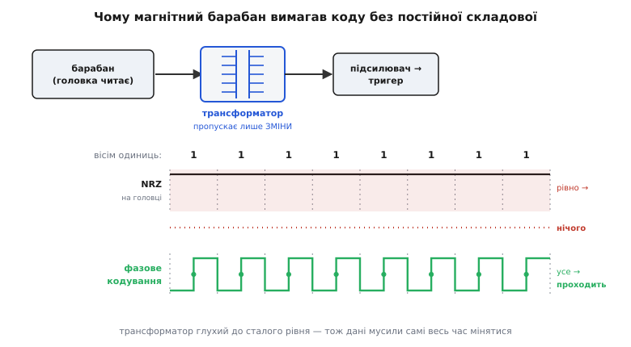
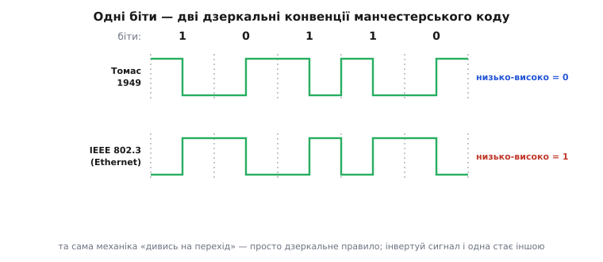

# 📜 Як манчестерський код народився з магнітного барабана

Більшість кодів народжуються з бажання зробити краще. Манчестерський код народився з **безвиході**: у Манчестерському університеті 1948–1949 років стояла машина, якій дані **фізично не було як прочитати назад**, поки їх не переписати в особливу форму. Не «незручно було», не «шумно виходило» — саме що читальна голова видавала на довгих однакових бітах рівну, мертву поличку, а те, що стояло далі по дроту, таку поличку **не бачило взагалі**. Код тут — не оздоба задля елегантності, а латка на пробоїну в залізі. І варто пройти весь цей сюжет крок за кроком, бо в ньому, як у зернятку, лежить те, чому самотактовість і нульова постійна складова — не два різні дари коду, а один; і чому найзнайоміший спосіб класти біти в лінію носить ім'я англійського міста.

Статус усього нижченаписаного — **усталено**: дати, імена й ролі звірені з ETHW, IEEE Spectrum та Вікіпедією; де сучасні джерела дещо розходяться в дрібницях, я це називаю прямо.

## Машина, яка не мала де тримати числа

Щоб зрозуміти біду, треба спершу побачити, у якій машині вона завелася. У 1948 році в Манчестерському університеті запрацював **Manchester Baby** — крихітна дослідна машина, яка увійшла в історію одним-єдиним, але вирішальним фактом: вона стала першим у світі комп'ютером, що **тримав власну програму у своїй же пам'яті** й міг ту програму на ходу міняти. До того «програма» була дротами на комутаційній панелі чи стрічкою; тут вона вперше стала числами, які машина читає й переписує нарівні з даними. Це і є та сама ідея «збереженої програми», на якій стоїть уся сьогоднішня обчислювальна техніка.

Але пам'ять «Малюка» була крихітна й дуже дивна. Її роль грала звичайна електронно-променева трубка — так звана **трубка Вільямса** (Williams tube): біти зберігалися як заряджені й розряджені цятки просто на люмінофорі екрана, а машина «читала» їх, дивлячись на екран власним електронним променем. Одна трубка тримала всього кілька десятків слів. Для доведення ідеї — досить; для справжніх обчислень — ні.

> 🔧 **Навіщо це.** Тримайте в голові цей контраст двох пам'ятей, бо саме з нього виросте вся дальша історія. Трубка Вільямса — швидка, але мізерна й летка: вимкнув живлення — заряд стік, чисел нема. Потрібна була **друга** пам'ять — велика й така, щоб числа лежали в ній стійко, поки їх не візьмуть. І ось коли інженери потяглися по цю велику стійку пам'ять, вони й наштовхнулися на біду, заради якої довелося винаходити код.

Розвивав «Малюка» у повноцінну машину — **Manchester Mark 1** — колектив під орудою **Фредерика Калланда Вільямса** (Frederic Calland Williams, 1911–1977), англійського інженера, у роки війни одного з творців британського радара, а з 1946-го — завідувача кафедри електротехніки в Манчестері. Поруч працювали **Том Кілбурн** (Tom Kilburn) і **Джефф Тутілл** (Geoff Tootill). До 1949 року машина мала вже й арифметику, і індексні регістри — і гострий брак місця, куди складати проміжні числа. Це місце мав дати **магнітний барабан**.

## Барабан: багато пам'яті, але через трансформатор

Магнітний барабан (magnetic drum) — це обертовий металевий циліндр, укритий тонким шаром, що тримає намагніченість. Над ним, майже впритул, нерухомо висять **головки** — маленькі електромагніти. Щоб **записати** біт, крізь головку пускають імпульс струму: він на мить намагнічує клаптик поверхні, що саме пробігає під головкою. Щоб **прочитати**, роблять навпаки: намагнічений клаптик, пролітаючи повз головку, наводить у її котушці слабенький сплеск напруги. Барабан крутиться, доріжка біжить під головкою — і машина ллє на неї або зчитує з неї потік бітів. Одна така штука тримала тисячі слів проти кількох десятків у трубці. Саме те, чого бракувало.

Але між головкою й рештою схеми стояла деталь, яка все й вирішила, — **трансформатор**. Слабенький сплеск від читальної головки не можна вести прямо на вхід підсилювача: різні шматки машини сидять на різних опорних рівнях, і зв'язати їх напряму означало б потягти одні перешкоди на інші, замкнути небажані [земляні петлі](topic:hw-analog/ground-loop), нав'язати входу постійний зсув головки. Тому сигнал заводили в підсилювач **через трансформатор** — дві котушки на спільному осерді, зв'язані лише магнітним полем, без жодного дроту між боками. Трансформатор чудово розв'язує схеми: він передає сигнал, але **гальванічно** розриває коло, тож постійні зсуви й повільні наводки одного боку на другий бік не проходять.

І тут ховається пастка, суть якої треба вловити точно, бо на ній стоїть уся історія. Трансформатор працює **тільки на змінах**. Його вторинна котушка видає напругу не тоді, коли крізь первинну тече струм, а тоді, коли той струм **міняється**: наводить лише магнітний потік, що ворушиться. Пустіть крізь трансформатор рівний, незмінний рівень — і на тім боці **нуль**, хоч на вході стій хоч яка велика стала напруга. Іншими словами, трансформатор [постійну складову не пропускає](topic:hw-analog/ac-coupling) — він глухий до всього сталого й чує лише те, що ворушиться.

> 🔧 **Навіщо це.** Ось де замикається капкан. Пам'ять, у якій багато місця (барабан), фізично під'єднана до машини через деталь, яка бачить лише зміни (трансформатор). А тепер спитайте: що станеться, коли на доріжці барабана лежить сто однакових бітів поспіль? Головка пробіжить над рівно намагніченою ділянкою — і струм у ній не зміниться. А раз не зміниться струм — трансформатор на тім боці видасть **рівний нуль**. Дані є на барабані, вони чесно записані — а прочитати їх машина **не може**, бо ланка між барабаном і нею німа до всього незмінного. Барабан і трансформатор кожен окремо працюють бездоганно; разом вони роблять цілий клас даних невидимим.

*Чому барабан вимагав особливого коду. Читальна головка з'єднана з підсилювачем через трансформатор, а той передає лише зміни струму. Вісім однакових одиниць у наївному NRZ дають на головці рівну поличку — і на виході трансформатора майже нічого, читати нема чого. Фазове кодування кладе перехід у центр кожного біта, тож струм головки весь час ворушиться — і трансформатор чесно пропускає кожен біт.*

## Прийом Вільямса: сховати кожен біт у власний перехід

Вихід із капкану знайшов сам Вільямс, і думка його була простою до краси. Якщо ланка між барабаном і машиною чує лише **зміни**, то давайте зробимо так, щоб **зміна була в кожному біті, завжди**, хоч би які дані йшли. Тоді трансформаторові не буде на що скаржитися: скільки б однакових бітів не лежало поспіль, у лінії щобіта коїться перехід — і кожен цей перехід трансформатор чесно передає далі.

Конкретно: кодуймо біт не тим, **високо чи низько** намагнічена ділянка, а тим, **у який бік** посеред неї міняється намагніченість. Кожен такт ділиться навпіл, і рівно на середині завжди стрибок — угору чи вниз. Куди саме стрибнуло — те й несе значення біта. Дані більше не в рівні, а в **напрямку переходу в центрі такту**.

Наслідок точно такий, як хотіли. Хоч мільйон одиниць поспіль, хоч мільйон нулів — намагніченість усе одно стрибає в кожному біті, струм головки весь час ворушиться, трансформатор усе пропускає. Рівної німої полички більше не буває **в принципі**: код улаштовано так, що вона неможлива. А заразом — і це Вільямс теж бачив — сигнал сам собою став **без постійної складової**: кожен біт наполовину «вгорі», наполовину «внизу» (перехід ділить такт рівно), тож середнє сидить точно посередині завжди, незалежно від даних. Саме та властивість, якої вимагав трансформатор, — щоб не було нічого сталого, що осіло б і засліпило вхід, — вийшла з коду **безкоштовно**, як побічний дар того самого правила.

Вільямс назвав свій прийом **фазовим кодуванням** (phase encoding) — і назва точна: значення біта сидить не в амплітуді сигналу, а у **фазі** його переходу, у тому, в яку половину такту припадає стрибок. Пізніше, коли код розповзеться світом, за ним закріпиться інша назва — **манчестерський**, за містом, де він народився, — але в перших манчестерських паперах і в патенті це саме «фазова модуляція», «фазове кодування».

> 🔧 **Навіщо це.** Тут лежить думка, задля якої взагалі варто знати цю історію. Самотактовість (перехід у кожному біті) і нульова постійна складова (баланс кожного біта) в манчестерському коді — **не два окремі здобутки**, які хтось докладав по черзі. Це **один прийом, побачений з двох боків**. Вільямс не «додавав баланс» — він гнав із лінії сталість, бо її не терпів трансформатор; а нульова постійна складова й самотактовість — це просто дві тіні тієї самої відсутності сталого. Ось чому маленький bit-bang-декодер у самій темі про [лінійне кодування](topic:com-modulation/line-coding) читає не рівень, а `(second > first)` — напрямок переходу: він робить рівно те, що робив трансформатор Вільямса, тільки в програмі. Хто зрозумів цю історію, той більше ніколи не питатиме, «як манчестерський код заразом дає і ритм, і баланс».

## Томас, який це збудував і записав перше правило

Ідея — це одне; працьовитий барабан, що справді возить числа туди-сюди для реальної машини, — інше. Цю другу, «руками», частину зробив аспірант Вільямса — **Джефрі Е. «Томмі» Томас** (G. E. «Tommy» Thomas), студент фізики й електронної інженерії. Улітку 1949 року він доводив прототип барабанної пам'яті як тему своєї магістерської роботи — і саме реалізація Томаса стала **першим працюючим** манчестерським кодом у складі справжнього комп'ютера. До червня 1949-го барабан уже був частиною дійової машини Mark 1, а до жовтня їх працювало два.

Роль Томаса варто назвати точно, бо її легко або применшити, або перебільшити. Він **не вигадав** самого принципу — фазове кодування належить Вільямсові, і патент оформлять на одне Вільямсове ім'я. Але Томас зробив дві речі, без яких принцип лишився б ідеєю на папері: він **побудував робочу схему**, що надійно писала й читала барабан у складі великої машини, і він **записав першу конкретну конвенцію** — тобто домовленість, який саме напрямок переходу означає нуль, а який одиницю. Ідея, реалізація й конвенція — три різні кроки, і чесно тримати їх нарізно: задум Вільямса, залізо й правило Томаса.

І ось те правило, у томасівській конвенції 1949 року: **перехід знизу вгору посеред біта означає нуль, згори вниз — одиницю**. Запам'ятаймо цей бік, бо далі буде цікаво.

## Дві дзеркальні конвенції: чому «низько-високо» — то раз нуль, то одиниця

Тепер найтонше місце всієї теми, на якому спотикаються, мабуть, найчастіше. Через десятиліття, коли манчестерський код поклали в основу першого Ethernet і закріпили в стандарті **IEEE 802.3**, конвенцію взяли **протилежну** до томасівської: там **перехід знизу вгору означає одиницю, згори вниз — нуль**. Рівно навпаки.

Це не помилка й не суперечка про те, «хто правий». Обидві конвенції однаково законні, бо вибір, який напрямок назвати нулем, а який одиницею, — чиста домовленість, як вибір, з якого боку дороги їздити. Головна механіка — «дивись не на рівень, а на напрямок переходу в центрі біта» — в обох та сама до останньої дрібниці. Різниця лише в підписі: одні й ті самі два напрямки марковані протилежно. Інвертуйте манчестерський сигнал (поміняйте «високо» й «низько» місцями) — і томасівська конвенція стане конвенцією 802.3, і навпаки.

*Одні й ті самі біти — дві дзеркальні конвенції. Угорі томасівське правило 1949 року: перехід знизу вгору = 0, згори вниз = 1. Унизу правило IEEE 802.3, ужите в Ethernet: той самий перехід знизу вгору = 1. Хвилі виходять дзеркальні одна до одної, а механіка «дивись на перехід» — та сама; інвертуй сигнал — і одна конвенція стає іншою.*

> 🔧 **Навіщо це.** Ця пастка коштує реальних годин на лабораторному столі. Ви беруте манчестерський приймач, дивитеся на осцилограф — переходи є, ритм ловиться, — а байти виходять інвертовані, суцільна нісенітниця. Перша думка: «зламався декодер». Насправді часто просто **зійшлися дві конвенції**: передавач говорить по-томасівськи, приймач слухає по-802.3 (чи навпаки), і кожен біт читається протилежно. Тому у будь-якій специфікації манчестерського каналу першим ділом шукайте не «манчестер так, манчестер ні», а **яка саме конвенція**: низько-високо — це у них нуль чи одиниця. Двозначність тут — не дрібниця, а джерело цілого класу «нез'ясовних» помилок.

## Патент, авторство й точні дати

Тепер звіримо тверду фактуру, бо в історії винаходів диявол саме в тому, хто, коли й на чиє ім'я.

**Авторство винаходу.** Фазове кодування придумав **Ф. К. Вільямс**; його аспірант **Дж. Е. Томас** зробив першу робочу реалізацію й опублікував першу конвенцію. Це усталено й повторюється в усіх серйозних джерелах узгоджено — тут немає ні спірності, ні імперського «поглинання»: обидва — англійські дослідники Манчестерського університету, і кожному належить своя, чітко окреслена частина. Плутанина буває лише в тому, кому приписати «винахід» цілком; правильна відповідь — **розрізняти кроки**: ідея й патент Вільямса, реалізація й перша конвенція Томаса.

**Патент.** Заявку подали **в березні 1949 року** на **саме ім'я Вільямса** (не Томаса) — британський патент, що згодом вийшов під номером **GB 707634**, опублікований **у квітні 1954-го**. Те, що патент на одного Вільямса, узгоджується з розподілом ролей: патентують **винахід** (принцип), а принцип — Вільямсів; Томасова частина — реалізація й конвенція, які патентом окремо не покривають. (Дрібне застереження: різні вторинні джерела наводять трохи різні номери-супутники цієї родини патентів; сам факт заявки березня 1949-го на Вільямсове ім'я й публікації 1954-го — усталений.)

**Дати машини.** «Малюк» ожив у **1948-му**; барабан із фазовим кодуванням був частиною дійової Mark 1 до **червня 1949-го**, два барабани — до жовтня. Отже, канонічне датування самого коду — **1948–1949**: задум і перша робоча реалізація вклалися саме в ці два роки.

## Друге, довше життя коду

Народившись латкою на трансформаторній пробоїні одного барабана, манчестерський код мав би тихо піти на пенсію разом із тим барабаном. Сталося навпаки: **прийом пережив машину** — і то на десятиліття, — бо та сама пара властивостей, заради якої його придумали, виявилася потрібною скрізь, де сигнал іде крізь щось, глухе до сталості, або де немає окремого дроту під такт.

**Магнітний запис** підхопив його першим і найприродніше — адже й головка стрічки чи дискети, як головка барабана, чує лише зміни намагніченості. Фазове кодування (та його близькі родичі) десятиліттями лягало на комп'ютерні **стрічки** й ранні **дискети**: ті самі причини, той самий код, тільки носій інший.

**Ранній Ethernet** — найгучніший спадкоємець. Перше покоління **10 Мбіт/с** несло біти по коаксіалу саме манчестерським кодом: у товстому дроті між станціями немає окремої тактової жили, тож приймач мусив витягати ритм із самого потоку — рівно те, для чого код і створений. Роберт Меткалф (Robert Metcalfe), один із творців Ethernet, згадував це просто: манчестерський код розв'язав їм головну біду — час, бо «кожен біт ніс власний такт». (Пізніші, швидші покоління Ethernet від манчестерського відмовилися — його подвоєна смуга на гігабітах задорога, — але саме він віз перші десять мегабітів.)

**Радіочастотні мітки (RFID)** і **інфрачервоні пульти** живуть на ньому й досі, і там він вигідний рівно своєю простотою: у пасивній мітці чи в дешевому пульті нема місця під складний кодер, а самотактовий манчестер дозволяє приймачеві впіймати ритм і читати дані без окремого генератора. Знайомий побутовий приклад — протокол **RC-5** для пультів, що його фірма Philips пустила в діло на початку 1980-х: команди в промені летять саме манчестерським кодом.

**Борт «Вояджерів».** І, мабуть, найдальша точка, куди дійшов цей код, — команди, які із Землі шлють двом апаратам **«Вояджер»** (Voyager 1 і 2), запущеним 1977 року й нині вже за межами Сонячної системи. Канал крізь мільярди кілометрів вимагає, щоб приймач на борту надійно виловив ритм зі слабкого, зашумленого сигналу без жодної окремої тактової лінії, — і самотактовість манчестерського коду тут працює так само, як колись працювала на трансформаторі барабана 1949 року.

> 🔧 **Навіщо це.** Простежте одну нитку крізь усі ці приклади — барабан, стрічка, дискета, коаксіал Ethernet, промінь пульта, канал до «Вояджера», — і побачите, що це щоразу **та сама біда в новій масці**: сигнал іде крізь ланку, глуху до сталого рівня (трансформатор, магнітна головка, ефір), або без окремого дроту під такт. І щоразу відповідь одна: примусь кожен біт мати власний перехід — і ланка його побачить, а приймач із того переходу дістане й дані, і ритм. Знаючи походження коду, ви впізнаєте цю біду з першого погляду й уже знаєте, яким класом кодів її лікують.

## Визнання: IEEE Milestone

У квітні 2026 року — а точніше, урочистістю **13 квітня 2026-го** в Манчестерському університеті — інститут IEEE відкрив пам'ятну дошку **IEEE Milestone** на честь манчестерського коду 1948–1949 років. «Мілстоуни» IEEE — це офіційне вшанування техніки, що змінила світ; дошку ставлять там, де річ народилася. Формулювання відзнаки називає рівно те, що ми пройшли: код винайшли для **надійного запису цифрових даних на магнітний барабан Manchester Mark 1**, і згодом він став основою для магнітних стрічок і дискет, для цифрового зв'язку — від «Вояджерів» до раннього Ethernet.

Символізм тут не порожній. Прийом, що народився з відчаю — «як прочитати назад те, що записали, коли між пам'яттю й машиною стоїть глуха до сталості деталь», — через сімдесят сім років дістав бронзову дошку на стіні того самого університету. Не за красу теорії, а за те, що виявився **правильним**: одна проста думка — «клади зміну в кожен біт» — розв'язала стільки різних версій тієї самої біди, що пережила і барабан, і машину, і саму епоху, з якої вийшла.

Озирнімося на весь шлях однією ниткою. Спершу була **машина без місця для чисел** — «Малюк» 1948 року з леткою трубкою Вільямса замість пам'яті. По велику стійку пам'ять потяглися до **магнітного барабана** — і наштовхнулися на капкан: барабан під'єднано через **трансформатор**, а той глухий до всього сталого, тож рівна поличка однакових бітів для нього — ніщо. Капкан розімкнув **Вільямс** своїм фазовим кодуванням: клади зміну в кожен біт — і ланка завжди її побачить, а сигнал заразом вийде без постійної складової. **Томас** це збудував і записав перше правило (низько-високо = 0), яке пізніший **IEEE 802.3** оберне дзеркально (низько-високо = 1). А далі код пішов у світ — стрічки, дискети, Ethernet, RFID, пульти, «Вояджери» — і врешті дістав **дошку IEEE Milestone** там, де починав. Уся ця дорога тримається на одній думці, яку варто забрати з собою: **самотактовість і нульова постійна складова — це не два дари, а один прийом, побачений з двох боків**. Хто зрозумів, чому трансформатор барабана вимагав саме такого коду, той зрозумів манчестерський код до кінця.
