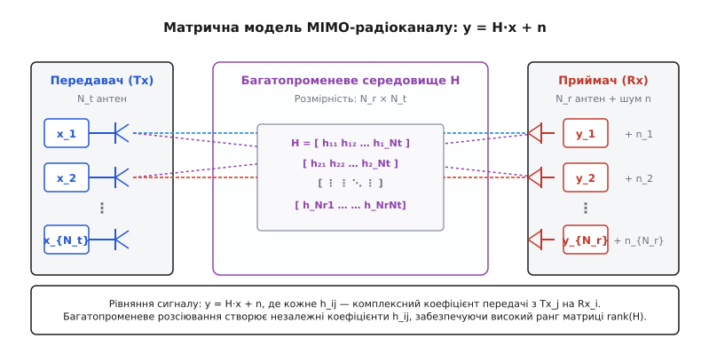
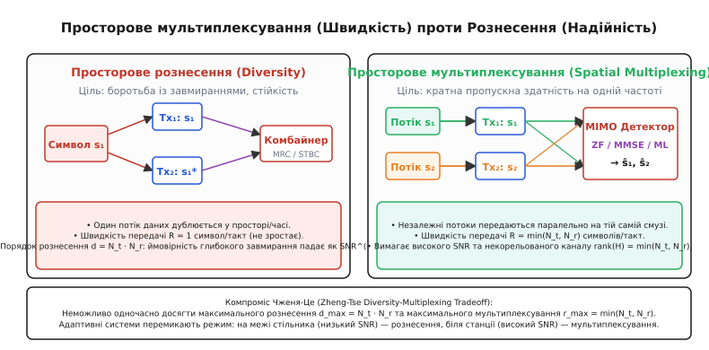
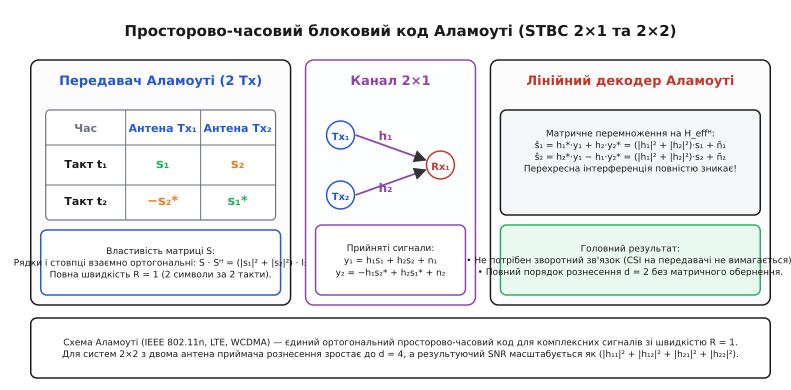
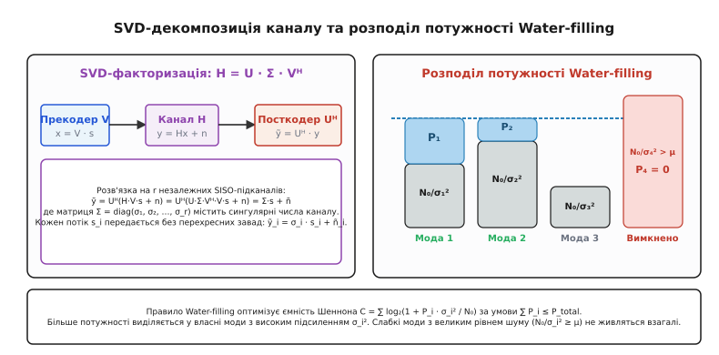
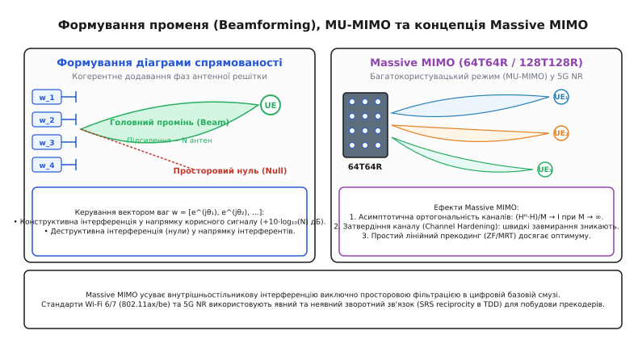

# MIMO

<preknowlist>
- [Канал AWGN](topic:math-information/awgn-channel) — модель шуму та розрахунок відношення сигнал/шум (SNR).
- [Статистика завмирань](topic:com-medium/fading-statistics) — багатопроменеве поширення радіохвиль та релеївські провали сигналу.
- [Смуга і межа Шеннона](topic:math-information/bandwidth-capacity) — теоретична межа пропускної здатності каналу зв'язку.
- [Сингулярний розклад (SVD)](topic:math-algebra/svd) — розклад матриці на ортогональні базиси та сингулярні числа.
- [OFDM](topic:com-modulation/ofdm) — розбиття частотно-селективного каналу на паралельні ортогональні піднесучі.
</preknowlist>

Коли радіопередавач із єдиною антеною випромінює електромагнітну хвилю в щільній міській забудові, сигнал у точці прийому є результатом накладання сотень відбитих, заломлених і розсіяних променів. Різниця в довжинах просторових траєкторій спричиняє випадкові фазові зсуви: у точках деструктивної інтерференції амплітуда коливань падає на 20–30 дБ, створюючи глибокі релеївські завмирання. Традиційні методи зв'язку намагалися подолати цей ефект нарощуванням випромінюваної потужності або розширенням смуги частот. Проте теорема Шеннона встановлює сувору логарифмічну межу: для лінійного подвоєння бітрейту за незмінної смуги частот необхідно піднімати відношення сигнал/шум у квадратичній залежності. Багатоантенні системи MIMO (Multiple-Input Multiple-Output — багато входів, багато виходів) кардинально змінили цей підхід: замість того, щоб боротися з випадковим розсіюванням радіохвиль, вони використовують просторову неоднорідність середовища як додатковий фізичний вимір для паралельної передачі незалежних потоків інформації.


*Матрична модель поширення радіохвиль між масивами передавальних і приймальних антен: кожен елемент канальної матриці описує амплітудно-фазовий зв'язок окремої просторової траєкторії.*

### 1. Матрична модель просторового радіоканалу

Розглянемо радіолінію, де передавач обладнано масивом із `N_t` передавальних антен, а приймач — масивом із `N_r` приймальних антен. У кожен дискретний такт часу передавач формує вектор комплексних символів `x = [x₁, x₂, …, x_{N_t}]ᵀ`, де `x_j` — сигнал, що випромінюється `j`-ю антеною.

Електромагнітна хвиля від кожної передавальної антени поширюється у просторі через набір випадкових траєкторій до кожної з `N_r` приймальних антен. Якщо смуга сигналу менша за смугу когерентності каналу (частотно-плоский канал, що типово забезпечується використанням OFDM), поширення між `j`-ю передавальною та `i`-ю приймальною антенами описується єдиним комплексним коефіцієнтом:

```
h_ij = |h_ij| · e^(jθ_ij)
```

де `|h_ij|` задає затухання амплітуди, а `θ_ij` — фазовий набіг уздовж променя.

Сумарний сигнал `y_i`, зафіксований `i`-ю антеною приймача, є суперпозицією сигналів від усіх `N_t` передавачів разом із власним адитивним шумом приймального тракту `n_i`:

```
y_i = ∑_{j=1}^{N_t} h_ij · x_j + n_i
```

Об'єднавши відліки всіх антен у вектори `y = [y₁, y₂, …, y_{N_r}]ᵀ` та `n = [n₁, n₂, …, n_{N_r}]ᵀ`, отримуємо фундаментальне матричне рівняння системи MIMO:

```
y = H·x + n
```

Матриця каналу `H` має розмірність `N_r × N_t`:

```
H = [ h₁₁    h₁₂   …   h₁_{N_t} ]
    [ h₂₁    h₂₂   …   h₂_{N_t} ]
    [  ⋮      ⋮    ⋱      ⋮     ]
    [ h_{N_r}1 …   …   h_{N_r}{N_t} ]
```

Вектор шуму `n` моделюється як просторово-білий комплексний гаусовий процес із нульовим середнім та діагональною коваріаційною матрицею `R_nn = E[n·nᴴ] = N₀·I_{N_r}`, де `I_{N_r}` — одинична матриця, а `(·)ᴴ` позначає ермітове (ермітівське) спряження (транспонування з комплексним спряженням).

#### Ранг каналу та просторові ступені вільності
Ключовою характеристикою матриці `H` є її ранг `rank(H)` — кількість лінійно незалежних рядків або стовпців. Ранг визначає максимальну кількість просторових ступенів вільності (Spatial Degrees of Freedom), які можна використати для паралельної передачі незалежних інформаційних потоків:

```
rank(H) ≤ min(N_t, N_r)
```

Щоб матриця `H` мала максимальний ранг (була повноранговою), необхідно, щоб коефіцієнти `h_ij` були статистично некорельованими. Для цього відстань між сусідніми антенами в решітці зазвичай обирають щонайменше `d ≥ λ / 2` (де `λ` — довжина хвилі несучої), а в навколишньому просторі має бути присутня достатня кількість випадкових розсіювачів.

#### Просторова кореляція та модель Кронекера
У реальних радіоканалах кутовий розкид променів (Angular Spread of Arrival / Departure) є скінченним, через що сигнали на сусідніх антенах частково корелюють. Для аналітичного опису кореляції застосовують модель Кронекера (Kronecker Model):

```
H = R_rx^(1/2) · H_w · (R_tx^(1/2))ᵀ
```

де `H_w` — матриця з незалежних стандартних комплексних гаусових величин `CN(0, 1)`, а `R_tx` (`N_t × N_t`) та `R_rx` (`N_r × N_r`) — просторові кореляційні матриці передавального та приймального масивів відповідно. Просторова кореляція стягує власні значення матриці каналу до нуля, зменшуючи ефективний ранг і знижуючи пропускну здатність у режимі мультиплексування.

#### Поляризаційне рознесення (Dual-Polarized Arrays)
Для подолання проблеми великих фізичних габаритів антенних решіток інженери застосовують крос-поляризовані елементи (Dual-Polarized Elements з нахилом `±45°`). Завдяки ортогональності вертикальної та горизонтальної векторних площин поляризації дві просторові антени розташовуються в одній фізичній точці простору. Це дозволяє вдвічі скоротити розміри антенної панелі базової станції та забезпечити некорельовані коефіцієнти передачі навіть за малого просторового розсіювання.

#### Парадокс «замкової щілини» (Keyhole / Pinhole Channel)
Існує особливий фізичний сценарій, коли антени на передавачі та приймачі розташовані далеко одна від одної та мають ідеально одиничні кореляційні матриці (`R_tx = I_{N_t}`, `R_rx = I_{N_r}`), проте ранг матриці `H` падає до одиниці:
```
H = h_rx · h_txᵀ   ⇒   rank(H) = 1
```
Такий ефект виникає, коли між двома багатими на розсіювачі приміщеннями радіохвилі можуть пройти лише крізь єдиний вузький тунель або отвір у металевій перешкоді. Усі просторові моди вироджуються в єдиний хвилевідний промінь, що блокує можливість просторового мультиплексування.

Історію відкриття багатоантенних систем та подолання цих фізичних обмежень висвітлено у вставці [Еволюція MIMO: від подолання завмирань до масивних антенних решіток](topic:com-modulation/mimo/hist-mimo-evolution.md).


*Два фундаментальні режими роботи багатоантенних систем: просторове рознесення підвищує надійність прийому шляхом надлишкового кодування, а мультиплексування паралельно передає незалежні потоки даних на тій самій смузі частот.*

### 2. Просторове рознесення проти просторового мультиплексування

Багатоантенна система може використовувати свої просторові ступені вільності для досягнення двох діаметрально протилежних інженерних цілей: максимізації надійності зв'язку або максимізації швидкості передачі даних.

#### Просторове рознесення (Spatial Diversity)

Ціль рознесення — побороти релеївські завмирання. Якщо один і той самий інформаційний символ `s₁` передається через кілька просторово рознесених антен (або приймається на кілька приймальних антен), імовірність того, що всі траєкторії одночасно потраплять у глибокий провал сигналу, експоненційно спадає.

Порядок рознесення (Diversity Order) `d` визначає нахил кривої ймовірності бітової помилки (Bit Error Rate, BER) в логарифмічному масштабі при високому відношенні сигнал/шум:

```
P_b ∝ SNR^(−d)
```

Для системи з `N_t` передавальними та `N_r` приймальними антенами максимальний теоретичний порядок рознесення дорівнює добутку кількості антен:

```
d_max = N_t · N_r
```

При `d = 1` (звичайний SISO-канал) для зниження ймовірності помилки з `10⁻²` до `10⁻³` потрібно збільшити SNR на 10 дБ. При `d = 4` (наприклад, система 2×2 з рознесенням) те саме зниження ймовірності помилки досягається зміною SNR лише на 2.5 дБ. Швидкість передачі при цьому не перевищує 1 символ за такт (`R ≤ 1`).

#### Просторове мультиплексування (Spatial Multiplexing)

Ціль мультиплексування — багаторазове збільшення швидкості передачі без розширення смуги частот і без збільшення потужності передавача. Вхідний високошвидкісний потік бітів демультиплексується на `N_s` незалежних субпотоків (`x₁, x₂, …, x_{N_s}`), які випромінюються одночасно через різні передавальні антени в одній і тій самій смузі частот.

Коефіцієнт мультиплексування (Multiplexing Gain) `r` визначає, у скільки разів швидкість передачі перевищує ємність базового каналу:

```
r = lim_{SNR → ∞} ( R(SNR) / log₂(SNR) ) = min(N_t, N_r)
```

#### Компроміс Чженя–Це (Diversity-Multiplexing Tradeoff)

Лі Чжен (Lizhong Zheng) та Девід Це (David Tse) у 2003 році довели, що рознесення та мультиплексування є двома крайніми точками єдиного неперервного компромісу. Для будь-якої заданої швидкості просторового мультиплексування `r` (де `0 ≤ r ≤ min(N_t, N_r)`) максимально досяжний порядок рознесення `d(r)` становить:

```
d(r) = (N_t − r) · (N_r − r)
```

Система не може одночасно досягти максимального рознесення `N_t · N_r` та максимального мультиплексування `min(N_t, N_r)`. Сучасні стандарти радіозв'язку динамічно змінюють режим: на межі зони покриття, де SNR низький, трансивер перемикається в режим рознесення, а в зоні сильного сигналу — в режим просторового мультиплексування.

Детальний аналіз та класифікацію всіх режимів роботи багатоантенних систем наведено у вставці [Порівняння режимів та архітектур MIMO](topic:com-modulation/mimo/comp-mimo-modes.md).


*Просторово-часове блокове кодування Аламоуті: ортогональна структура матриці передачі дозволяє повністю розв'язати перехресні завади на приймачі за допомогою простих лінійних операцій без знання каналу на передавачі.*

### 3. Просторово-часове блокове кодування (STBC) та схема Аламоуті

Схема Аламоуті (1998 рік) — це елегантний метод досягнення повного передавального рознесення `d = 2` у системі з двома передавальними антенами та однією приймальною антеною (MISO 2×1) без потреби передавати інформацію про стан каналу назад на передавач (Open-Loop Diversity).

Передавач транслює пару комплексних символів `s₁` та `s₂` упродовж двох послідовних часових тактів `t₁` та `t₂` за правилом матриці `S`:

```
S = [  s₁    s₂ ]     [рядок 1: такт t₁, випромінюють Tx₁=s₁, Tx₂=s₂]
    [ −s₂*   s₁*]     [рядок 2: такт t₂, випромінюють Tx₁=−s₂*, Tx₂=s₁*]
```

Приймач за два такти фіксує відліки:

```
y₁ = h₁·s₁ + h₂·s₂ + n₁
y₂ = −h₁·s₂* + h₂·s₁* + n₂
```

Якщо взяти комплексне спряження другого відліку `y₂* = h₂*·s₁ − h₁*·s₂ + n₂*`, систему рівнянь можна записати через еквівалентну матрицю `H_eff`:

```
[ y₁  ] = [ h₁    h₂  ] · [ s₁ ] + [ n₁  ]
[ y₂* ]   [ h₂*  −h₁* ]   [ s₂ ]   [ n₂* ]
```

Головна алгебраїчна властивість матриці `H_eff` полягає в тому, що її стовпці взаємно ортогональні в комплексному евклідовому просторі:

```
H_effᴴ · H_eff = (|h₁|² + |h₂|²) · I₂
```

Приймач фільтрує прийнятий вектор множенням на `H_effᴴ`:

```
[ z₁ ] = H_effᴴ · [ y₁  ] = (|h₁|² + |h₂|²) · [ s₁ ] + [ ñ₁ ]
[ z₂ ]            [ y₂* ]                     [ s₂ ]   [ ñ₂ ]
```

Недіагональні елементи, що створюють взаємну інтерференцію між символами `s₁` та `s₂`, тотожно обнуляються:

```
h₁*·h₂ − h₁*·h₂ = 0
```

У результаті складне матричне рівняння розпадається на два незалежні скалярні канали:

```
z₁ = (|h₁|² + |h₂|²) · s₁ + ñ₁
z₂ = (|h₁|² + |h₂|²) · s₂ + ñ₂
```

Кожен символ детектується звичайним пороговим компаратором. При цьому коефіцієнт підсилення сигналу дорівнює сумі потужностей двох незалежних каналів `(|h₁|² + |h₂|²)`, забезпечуючи повний порядок рознесення `d = 2`.

Повний аналітичний розрахунок для конфігурацій 2×1 та 2×2 з доведенням ортогональності наведено у вставці [Математичне виведення схеми Аламоуті](topic:com-modulation/mimo/math-alamouti-2x2.md).

### 4. Алгоритми просторової детекції (ZF, MMSE, ML)

У режимі просторового мультиплексування передавач транслює вектор незалежних символів `x`. На стороні приймача вектор `y = H·x + n` є сумішшю всіх сигналів. Для відновлення початкових символів використовуються три основні класи алгоритмів просторового розділення.

```
+-------------------------------------------------------------------------+
|                  ПОРІВНЯННЯ АЛГОРИТМІВ MIMO-ДЕТЕКЦІЇ                    |
+---------------------+-------------------+-------------------------------+
| Алгоритм детекції   | Складність        | Характеристика завадостійкості|
+---------------------+-------------------+-------------------------------+
| Zero-Forcing (ZF)   | Низька O(N³)      | Посилює шум при cond(H) >> 1  |
| Linear MMSE         | Середня O(N³)     | Оптимальний лінійний баланс   |
| Max-Likelihood (ML) | Експоненційна O(|Q|^N) | Абсолютний оптимум (повний d) |
+---------------------+-------------------+-------------------------------+
```

#### 1. Детектор Zero-Forcing (ZF)

Алгоритм Zero-Forcing спрямований на повне придушення просторової інтерференції між потоками. Приймач обчислює матрицю просторового фільтра за допомогою лівої псевдооберненої матриці Мура–Пенроуза:

```
W_ZF = (Hᴴ · H)⁻¹ · Hᴴ
```

Застосовуючи фільтр до прийнятого вектора `y`:

```
x̂_ZF
= W_ZF · y                             [фільтрація псевдооберненою матрицею W_ZF]
= (Hᴴ·H)⁻¹ · Hᴴ · (H·x + n)            [підстановка моделі спостереження y = Hx + n]
= (Hᴴ·H)⁻¹ · (Hᴴ·H) · x + (Hᴴ·H)⁻¹ · Hᴴ · n   [розкриття дужок та групування граміана HᴴH]
= x + (Hᴴ·H)⁻¹ · Hᴴ · n                [скорочення (HᴴH)⁻¹(HᴴH) = I]
= x + n_ZF                             [відокремлення некорельованого шуму детектора]
```

Міжпотокова інтерференція зникає, проте дисперсія шуму в `i`-му відновленому потоці становить:

```
Var(n_{ZF,i}) = N₀ · [(Hᴴ·H)⁻¹]_{ii}
```

Якщо матриця каналу погано обумовлена (вектори стовпців `H` близькі до лінійної залежності, число обумовленості `cond(H) = σ_max / σ_min ≫ 1`), діагональні елементи `(Hᴴ·H)⁻¹` різко зростають. Детектор ZF драматично посилює шум (noise enhancement), що призводить до високої частоти помилок за низьких і середніх SNR.

#### 2. Лінійний детектор MMSE (Minimum Mean Square Error)

Детектор MMSE оптимізує матрицю фільтрації `W_MMSE` так, щоб мінімізувати повну середньоквадратичну похибку між переданим вектором та його оцінкою:

```
min_W  E[ ||W·y − x||² ]
```

Розв'язок цієї оптимізаційної задачі дає регуляризовану матрицю:

```
W_MMSE = (Hᴴ · H + (N₀ / E_s) · I_{N_t})⁻¹ · Hᴴ
```

де `E_s` — середня енергія випромінюваного символу.

Діагональна добавка `(N₀ / E_s) · I_{N_t}` обмежує знизу власні значення матриці, запобігаючи неконтрольованому посиленню шуму на погано обумовлених каналах. При високому SNR (`N₀ → 0`) MMSE асимптотично переходить у ZF, а при низькому SNR поводиться як узгоджений просторовий фільтр (Matched Filter).

#### 3. Детектор максимальної правдоподібності (Maximum Likelihood, ML)

Детектор ML знаходить вектор символів `ŝ_ML` із дискретного сузір'я модуляції `Q^{N_t}`, який мінімізує евклідову відстань до прийнятого вектора в сигнальному просторі:

```
ŝ_ML = arg min_{s ∈ Q^{N_t}}  ||y − H·s||²
```

ML є оптимальним детектором за критерієм мінімуму ймовірності помилки на кадр і забезпечує повний порядок рознесення `d = N_r`. Проте його обчислювальна складність зростає експоненційно з кількістю антен `N_t` та порядком модуляції `|Q|`. Для практичних систем використовують сфера-декодери (Sphere Decoders), які обмежують простір пошуку багатовимірною сферою радіуса `R` довкола початкової точки ZF/MMSE.

Практичну реалізацію алгоритмів ZF, MMSE та ML мовами Python та C++ з аналізом кривих бітових помилок наведено у вставці [Програмна реалізація MIMO-детекторів](topic:com-modulation/mimo/proj-mimo-detector.md).


*Сингулярний розклад каналу трансформує зв'язану MIMO-систему в набір ортогональних паралельних підканалів, потужність між якими розподіляється за алгоритмом заповнення водою (Water-filling).*

### 5. Пропускна здатність Шеннона–Телатара та SVD-прекодування

У 1999 році Емре Телатар вивів фундаментальну формулу пропускної здатності каналу MIMO за відсутності інформації про стан каналу на передавачі (Open-Loop):

```
C = W · log₂ det( I_{N_r} + (SNR / N_t) · H · Hᴴ )   [біт/с]
```

де `W` — ширина смуги частот каналу в герцах.

#### Сингулярний розклад (SVD) та власні моди каналу

Якщо передавач володіє точною інформацією про стан каналу (Closed-Loop CSI), матрицю `H` факторизують через сингулярний розклад:

```
H = U · Σ · Vᴴ
```

де `U` (`N_r × N_r`) та `V` (`N_t × N_t`) — унітарні матриці лівих і правих сингулярних векторів, а `Σ` містить невід'ємні сингулярні числа `σ₁ ≥ σ₂ ≥ … ≥ σ_r > 0` (`r = rank(H)`).

Передавач застосовує матрицю прекодування `V` до інформаційного вектора `s`: `x = V · s`. Приймач фільтрує сигнал матрицею посткодування `Uᴴ`:

```
ỹ = Uᴴ · y = Uᴴ · (U·Σ·Vᴴ · V·s + n) = Σ · s + ñ
```

Зв'язана MIMO-система розпадається на `r` повністю незалежних, паралельних скалярних підканалів (власних мод каналу):

```
ỹ_i = σ_i · s_i + ñ_i,      i = 1, 2, …, r
```

Кожен `i`-й потік передається без будь-яких перехресних завад від інших потоків із коефіцієнтом підсилення потужності `σ_i²`.

#### Алгоритм розподілу потужності Water-filling

Сумарна пропускна здатність є сумою ємностей паралельних підканалів:

```
C = ∑_{i=1}^r log₂( 1 + (P_i · σ_i²) / N₀ )
```

Для максимізації ємності за обмеження на сумарну випромінювану потужність `∑_{i=1}^r P_i ≤ P_total` застосовують метод невизначених множників Лагранжа, що приводить до класичного алгоритму заповнення водою (Water-filling):

```
P_i = max(0,  μ_level − N₀ / σ_i²)
```

де константа `μ_level` задає єдиний рівень «поверхні води».

Підканали з великим підсиленням `σ_i²` мають низький еквівалентний рівень дна `N₀ / σ_i²` і отримують найбільшу частку потужності `P_i`. Слабкі підканали, дно яких лежить вище рівня води (`N₀ / σ_i² ≥ μ_level`), повністю відключаються (`P_i = 0`), оскільки витрачати енергію на зашумлені просторові напрямки неефективно.

Суворе математичне виведення формули Шеннона–Телатара та алгоритму Water-filling наведено у вставці [Виведення ємності Шеннона-Телатара та алгоритму Water-filling](topic:com-modulation/mimo/math-mimo-capacity.md).


*Еволюція формування діаграми спрямованості: від фазування вузького променя на одного абонента до масивних решіток Massive MIMO 5G NR, де ефект затвердіння каналу усуває швидкі завмирання.*

### 6. Формування променя (Beamforming) та Multi-User MIMO (MU-MIMO)

Формування діаграми спрямованості (Beamforming) полягає в узгодженому керуванні амплітудами й фазами сигналів, що подаються на окремі елементи антенної решітки, з метою концентрації випромінюваної енергії у вузькому просторовому секторі.

#### Принцип фазованої решітки

Нехай лінійна антенна решітка складається з `N` випромінювачів із кроком `d = λ / 2`. Якщо сигнал на `k`-й антені зсунуто за фазою на `θ_k = −k · (2π / λ) · d · sin(φ)`, електромагнітні хвилі когерентно додаються в напрямку кута `φ`, формуючи вузьку головну пелюстку з підсиленням потужності:

```
G_array = 10 · log₁₀(N)   [дБ]
```

В інших просторових напрямках хвилі інтерферують деструктивно, створюючи просторові нулі (Nulls). Це дозволяє спрямувати максимум енергії на корисного абонента й одночасно придушити випромінювання в бік джерела завади.

#### Архітектури Beamforming

1. **Аналоговий Beamforming:** один радіочастотний тракт (RF chain) живить антенну решітку через апаратні фазообертачі. Схема енергоефективна, проте здатна сформувати лише один промінь у кожен момент часу.
2. **Цифровий Beamforming:** кожна антена підключена до власного АЦП/ЦАП та RF-тракту. Зважування векторів виконується в цифровій базовій смузі (Baseband), що дозволяє одночасно формувати десятки незалежних просторових променів на різних піднесучих частотах.
3. **Гібридний Beamforming:** компромісна архітектура для міліметрового діапазону (5G mmWave, 28–39 ГГц), де кількість RF-трактів (наприклад, 8–16) значно менша за кількість антенних елементів (128–256). Цифровий прекодер розділяє багатокористувацькі потоки, а аналогові субмасиви фокусують вузькі високочастотні промені.

#### Багатокористувацький режим (Multi-User MIMO, MU-MIMO)

У класичному Single-User MIMO (SU-MIMO) всі просторові потоки призначені одному пристрою з кількома антенами. У режимі Multi-User MIMO (MU-MIMO) базова станція з `N_t` антенами одночасно передає незалежні дані `K` просторово рознесеним абонентам (`UE₁, UE₂, …, UE_K`), кожен із яких може мати лише одну приймальну антену.

Для усунення міжкористувацької інтерференції (Inter-User Interference, IUI) у низхідному каналі базова станція застосовує лінійний прекодинг Zero-Forcing Beamforming (ZFBF):

```
W_ZFBF = H_jointᴴ · (H_joint · H_jointᴴ)⁻¹
```

де `H_joint = [h₁ᵀ; h₂ᵀ; …; h_Kᵀ]` — спільна матриця каналу всіх абонентів.

ZFBF розраховує вектори випромінювання так, що сигнал для користувача `UE_k` потрапляє в просторовий нуль діаграми спрямованості для всіх інших користувачів `UE_{j ≠ k}`. У результаті кожен абонент приймає свій потік без сторонніх завад, використовуючи найпростіший одноантенний приймач.

#### Нелінійний прекодинг: DPC та прекодинг Томлінсона–Харашіми (THP)
Теорема Кости про кодування на брудному папері (Dirty Paper Coding, DPC, 1983 рік) доводить, що якщо інтерференція відома на передавачі заздалегідь, пропускна здатність низхідного каналу дорівнює ємності каналу взагалі без інтерференції. Оскільки точна реалізація DPC вимагає нескінченновимірних ґраткових кодів, на практиці застосовують прекодинг Томлінсона–Харашіми (THP). THP здійснює послідовне віднімання інтерференції на передавачі з операцією взяття за модулем (`modulo`), що обмежує пікову потужність випромінювача та усуває шум інверсії, властивий лінійному ZFBF.

### 7. Концепція Massive MIMO у 5G NR

Технологія Massive MIMO масштабує ідею багатоантенних систем до масивів із сотень приймально-передавальних елементів (64T64R, 128T128R) на базових станціях 5G NR (New Radio).

Коли кількість антен базової станції `M` прямує до нескінченності (`M → ∞`), радіоканал набуває унікальних асимптотичних властивостей:

#### 1. Асимптотична ортогональність (Favorable Propagation)

Канальні вектори різних абонентів стають попарно ортогональними за законом великих чисел:

```
lim_{M → ∞}  (h_kᴴ · h_j) / M = 0,      для всіх k ≠ j
lim_{M → ∞}  (H_jointᴴ · H_joint) / M = I_K
```

У результаті міжкористувацька інтерференція зникає природним шляхом. Складне матричне обернення стає непотрібним: найпростіший лінійний прекодер максимального відношення (Maximum Ratio Transmission, MRT `W = H_jointᴴ`) стає асимптотично оптимальним.

#### 2. Затвердіння каналу (Channel Hardening)

Швидкі релеївські завмирання повністю зникають:

```
lim_{M → ∞}  ||h_k||² / E[||h_k||²] = 1
```

Еквівалентний коефіцієнт передачі каналу перестає бути випадковою величиною і стає детермінованим числом. Абонентському терміналу більше не потрібно відстежувати миттєві флуктуації каналу в часі та частоті — достатньо знати лише довготривалі середні параметри затухання.

#### 3. Набуття інформації про стан каналу (CSI) через TDD-взаємність

Головною проблемою традиційного MIMO при збільшенні кількості антен є накладні витрати на передачу зворотного зв'язку CSI: у системі з 64 антенами обсяг пілотних сигналів та звітів заблокував би весь висхідний канал.

Massive MIMO вирішує цю проблему завдяки використанню дуплексу з часовим поділом (Time Division Duplex, TDD) та принципу електродинамічної взаємності (Channel Reciprocity):

```
H_downlink = (H_uplink)ᵀ
```

Абонентські термінали періодично передають короткі зондувальні пілотні сигнали (Sounding Reference Signal, SRS) у висхідному каналі. Базова станція вимірює матрицю `H_uplink` і миттєво отримує матрицю `H_downlink` без будь-якої передачі зворотного зв'язку від абонентів.

#### 4. Кодові книги CSI у режимі FDD (Type I та Type II Codebooks)
У стільникових мережах із частотним дуплексом (FDD), де прямий і зворотний канали працюють на різних несучих частотах і принцип взаємності не діє, базова станція застосовує квантований зворотний зв'язок:
- **Type I Codebook:** термінал вибирає індекс найкращого просторового вектора прекодування (Precoding Matrix Indicator, PMI) з попередньо визначеної кодової книги, заснованої на дискретному перетворенні Фур'є (DFT).
- **Type II Codebook:** високої роздільної здатності, де термінал квантує амплітуди й фази лінійної комбінації декількох просторових DFT-базисів у частотній області, забезпечуючи високу точність формування променя ціною більшого обсягу службового трафіку.

#### 5. Процедури Beam Management у 5G NR FR2 (mmWave)
У міліметровому діапазоні для підтримання зв'язку через рухомі голкоподібні промені стандарт 5G NR визначає багаторівневу процедуру Beam Management:
1. **Процедура P1 (Початковий пошук):** базова станція здійснює циклічне просторове сканування (Beam Sweeping) блоками синхронізації SSB, а термінал вибирає найкращий широкий промінь.
2. **Процедура P2/P3 (Уточнення):** за допомогою вузьких періодичних сигналів CSI-RS базова станція звужує випромінюваний промінь (P2), а термінал налаштовує діаграму приймальної решітки (P3).
3. **Відновлення після зриву (Beam Failure Recovery, BFR):** якщо відношення сигнал/шум падає нижче критичного порогу через раптове затінення рукою або тілом людини, термінал ініціює швидку позачергову процедуру перемикання променя через виділені преамбули PRACH.

#### 6. Безстільниковий режим (Cell-Free Massive MIMO)
Наступним еволюційним кроком є відмова від класичної стільникової структури. У концепції Cell-Free Massive MIMO сотні простих точок доступу (Access Points, AP) географічно розподіляються по всій зоні обслуговування та з'єднуються оптичним транзитом із центральним процесором (CPU). Замість того, щоб абонент перемикався між стільниками (handover), усі навколишні точки доступу когерентно обслуговують його одночасно, усуваючи проблему слабкого зв'язку на межі базових станцій і створюючи рівномірне покриття з високим SINR по всій території мережі.

### 8. Еволюція MIMO у стандартах бездротового зв'язку

```
+-------------------------------------------------------------------------+
|                  ХРОНОЛОГІЯ ЕВОЛЮЦІЇ СТАНДАРТІВ MIMO                    |
+-------------------+----------------+------------------------------------+
| Стандарт          | Конфігурація   | Ключові нововведення               |
+-------------------+----------------+------------------------------------+
| IEEE 802.11n      | До 4×4 SU-MIMO | Просторово-часовий код Аламоуті,   |
| (Wi-Fi 4, 2009)   |                | швидкість до 600 Мбіт/с            |
|                   |                |                                    |
| IEEE 802.11ac     | До 8×8 MU-MIMO | Низхідний DL MU-MIMO до 4 пристроїв|
| (Wi-Fi 5, 2013)   |                | Явний зворотний зв'язок (VHT Sound)|
|                   |                |                                    |
| IEEE 802.11ax     | До 8×8 MU-MIMO | Висхідний UL/DL MU-MIMO,           |
| (Wi-Fi 6, 2019)   | + OFDMA        | комбінація OFDMA з просторовим кодом|
|                   |                |                                    |
| IEEE 802.11be     | До 16×16       | Координоване мульти-AP MIMO,       |
| (Wi-Fi 7, 2024)   | MU-MIMO        | смуга 320 МГц, 4096-QAM            |
|                   |                |                                    |
| 3GPP LTE-Advanced | До 8×8 SU/MU   | Transmission Modes TM1–TM10,       |
| (Release 10–14)   |                | неортогональний CoMP прекодинг     |
|                   |                |                                    |
| 3GPP 5G NR        | 64T64R /       | Massive MIMO, 3D Beamforming,      |
| (Release 15–18)   | 128T128R       | SRS Reciprocity, Type II Codebook  |
+-------------------+----------------+------------------------------------+
```

У стандарті Wi-Fi 6 (802.11ax) та Wi-Fi 7 (802.11be) технологія MU-MIMO інтегрована з багатостанційним доступом з ортогональним частотним поділом (OFDMA): кожна ресурсна одиниця (Resource Unit, RU) на піднесучих частотах може одночасно транслювати кілька просторових потоків різним користувачам.

У стільникових мережах 5G NR комерційні масивні антенні панелі 64T64R у смузі 100 МГц (діапазон 3.5 ГГц n78) забезпечують одночасну передачу 16 незалежних просторових шарів із піковою пропускною здатністю сектора стільника понад 5–7 Гбіт/с.

### 9. Інженерні обмеження та апаратна реалізація

Реалізація систем MIMO у фізичних пристроях пов'язана з низкою жорстких інженерних компромісів:

1. **Просторова кореляція та взаємний зв'язок антен (Mutual Coupling):** Якщо антени розміщені ближче ніж `λ / 2`, електромагнітне поле однієї антени наводить струми в сусідній. Це зменшує коефіцієнт корисної дії випромінювачів та створює високу кореляцію між стовпцями матриці `H`, знижуючи ранг каналу. Для компактних пристроїв (смартфонів) застосовують крос-поляризаційні антени, де два ортогональні канали створюються в одній точці за рахунок вертикальної та горизонтальної поляризації.
2. **Пік-фактор потужності (PAPR) у MIMO-OFDM:** Накладання великої кількості піднесучих створює високе відношення пікової потужності до середньої (PAPR). Підсилювачі потужності (Power Amplifiers) змушені працювати з відкатом по потужності (Back-off), що суттєво знижує енергоефективність передавача.
3. **Енергоспоживання аналого-цифрових перетворювачів (АЦП):** У повністю цифровій архітектурі Massive MIMO на 64 антени потрібно 128 високошвидкісних АЦП (для синфазної I та квадратурної Q складових). Сумарне енергоспоживання блоку конвертації може досягати десятків ват, що стимулює розробку низькорозрядних (1–4 біти) АЦП зі спеціалізованими нелінійними алгоритмами відновлення сигналу.
4. **Обчислювальна складність матричного обернення:** Алгоритми ZF та MMSE вимагають обчислення `(Hᴴ·H)⁻¹` для кожної піднесучої OFDM. При смузі 100 МГц (3300 піднесучих) і частоті оновлення каналу 1 мс обчислювач базової станції повинен виконувати мільйони матричних інверсій за секунду, що вимагає застосування систолічних масивів та апаратних прискорювачів на базі FPGA чи ASIC.
5. **Пілотне забруднення (Pilot Contamination):** У багатостільникових мережах Massive MIMO із повторним використанням частот термінали сусідніх стільників передають однакові неортогональні пілотні послідовності. Базова станція неминуче змішує канальні оцінки власного абонента з чужим, створюючи міжстільникову інтерференцію, яка не зникає навіть при `M → ∞`.

### Підсумок

Технологія MIMO здійснила фундаментальну революцію в бездротовому зв'язку, перетворивши просторове розсіювання електромагнітних хвиль із джерела фатальних завад на головний ресурс підвищення спектральної та енергетичної ефективності. Поєднуючи кодування у просторово-часовій області (STBC), паралельне мультиплексування потоків (SVD/BLAST), формування променів (Beamforming) та масивні фазовані решітки Massive MIMO, сучасні системи радіозв'язку досягли теоретичних меж пропускної здатності Шеннона, забезпечивши гігабітні швидкості передачі у стандартах Wi-Fi 6/7 та мобільних мережах 5G NR.
