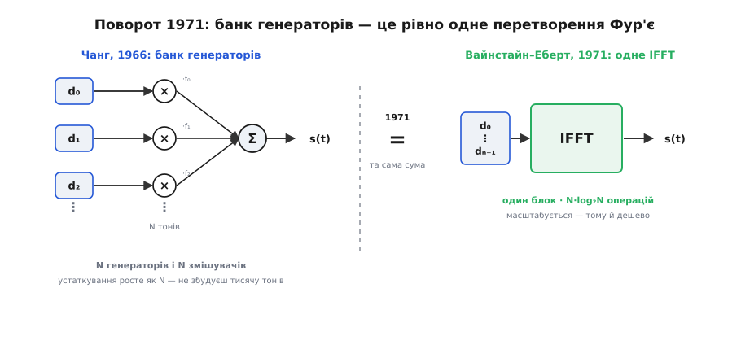
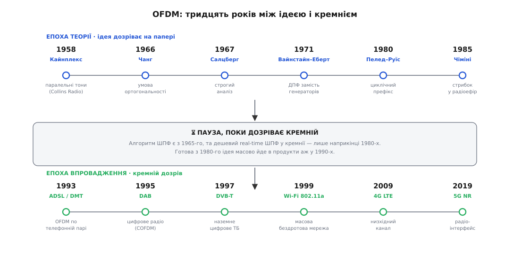

# 📜 Народження OFDM: тридцять років між ідеєю і кремнієм

Рідко трапляється, щоб технологію продумали до кінця за десятиліття до того, як світ зміг нею скористатися. OFDM — саме такий випадок: усі істотні ідеї склалися ще до 1980-го, а в масові пристрої вони пішли аж у 1990-х. Затримку спричинила не математика — математика була готова, — а те, що арифметика, на якій вона тримається, надто довго лишалася задорогою. Ця історія — про те, як думка йшла від військових короткохвильових модемів до Wi-Fi і 5G, і чому мусила стільки чекати.

Ворог, проти якого зродилася вся ідея, один — [багатопроменевість](topic:com-medium/multipath-fading): сигнал доходить до приймача кількома шляхами з різними затримками, і копії накладаються, змазуючи одна одну. Що швидший потік, то коротший символ і то гірше його калічать луни. Відповідь, яку інженери винаходили наново раз за разом, теж одна: не гнати один швидкий потік, а розсіяти дані по багатьох повільних тонах, кожен на своїй частоті. На повільному тоні символ довгий — і та сама затримка луни для нього вже дрібниця.

## Кайнплекс: паралельні тони проти завмирань ефіру (Collins Radio, 1957–58)

Першими в цю стіну вперлися військові радисти. Короткі хвилі відбиваються від іоносфери й приходять на приймач жмутом затриманих копій — багатопроменевість у найлютішій формі, з розкидом затримок у мілісекунди. Один швидкий потік по такому каналу розсипається на кашу.

Компанія Collins Radio відповіла системою **Кайнплекс** (англ. *Kineplex*): її оголосили в 1957-му, а докладно описали інженери Річард Мозаєр і Р. Ґ. Клабо (Richard R. Mosier, R. G. Clabaugh) у роботі 1958 року «Kineplex, a bandwidth-efficient binary transmission system». Ідея вже впізнавана: у їхній конфігурації 16 паралельних тонів у голосовій смузі, кожен несе диференційну 4-фазну маніпуляцію (символ кодують не абсолютною фазою, а її зсувом від попереднього — тоді приймачеві не треба знати опорну фазу каналу) на низькій швидкості — разом близько 1.4 кбіт/с по короткохвильовому каналу. Довгі символи на кожному тоні переживали іоносферні завмирання там, де один швидкий потік гинув.

Але до OFDM тут ще далеко. Кайнплекс розсовував тони з запасом і відділяв їх часовими воротами та фільтрами (звідси й назва — від «кінематичних» фільтрів детектора); на кожен тон припадав свій генератор. Спектр витрачався щедро, а устаткування росло разом із числом тонів. Зерно посіяно — багато повільних тонів б'ють один швидкий потік на багатопроменевому каналі, — та воно ще чекало на дві речі: як **упакувати** тони щільно, не даючи їм заважати, і як породити їх **без** банку генераторів.

## Роберт Чанг і умова ортогональності (Bell Labs, 1966)

Перше зерно проросло в Bell Labs. Роберт Чанг (Robert W. Chang) поставив питання руба: наскільки близько можна присунути тони, щоб приймач усе ще розділяв їх начисто? Відповідь виявилася красивою — тони можна пустити так, щоб їхні спектри **перекривалися**, і все одно розчепити їх ідеально, якщо крок між ними взяти рівно оберненим до тривалості символу:

```
Δf = 1 / T
```

За такого кроку в кожен символ укладається ціле число періодів кожного тону, а будь-які два різні тони стають **ортогональними** — їхній добуток за час символу усереднюється точно в нуль. Захисні проміжки більше не потрібні; пакування — найщільніше можливе. Чанг виклав це в статті 1966 року «Synthesis of Band-Limited Orthogonal Signals for Multichannel Data Transmission» у *Bell System Technical Journal* і закріпив патентом (заявка — листопад 1966-го, видано US 3,488,445 у січні 1970-го). Наступного, 1967 року Бертон Салцберг (Burton R. Saltzberg) з тієї ж лабораторії довів це до строгого аналізу продуктивності, показавши, що така схема тримається впритул до межі Найквіста і мало чутлива до спотворень каналу.

Математика готова, тони впаковані ідеально. Та практичного модема з цього ще не збудуєш: у голові Чанга й Салцберга система лишалася банком генераторів і змішувачів — для N тонів треба N генераторів, N синусоїд, N перемножень. Для восьми тонів — терпимо; для тисячі — гора аналогового заліза. Ортогональність вирішила питання спектра, але не питання вартості.

## Вайнстайн, Еберт і поворот до Фур'є (Bell Labs, 1971)

Найважливіший поворот усієї історії стався тоді, коли хтось помітив: банк генераторів не треба будувати взагалі. Зважена сума рівномірно рознесених гармонік із заданими амплітудами — це рівно **[дискретне перетворення Фур'є](topic:com-signal/dft)** тих амплітуд. Отже, щоб породити N ортогональних тонів, не потрібні N генераторів — потрібне одне зворотне перетворення; щоб розділити їх на прийомі — одне пряме.


*Те, що Чанг мислив як гору аналогового заліза, Вайнстайн і Еберт упізнали як одне перетворення Фур'є: та сама сума тонів рахується одним блоком.*

Це побачили Стівен Вайнстайн і Пол Еберт (Stephen B. Weinstein, Paul M. Ebert) у роботі 1971 року «Data Transmission by Frequency-Division Multiplexing Using the Discrete Fourier Transform». Весь банк аналогових генераторів і когерентних демодуляторів згорнувся в пару цифрових перетворень. Заразом вони додали проти багатопроменевості **захисний інтервал** — паузу між символами, щоб залишкові луни одного символу встигли згаснути, поки почнеться наступний.

Концептуально це вже майже сучасний OFDM. Але зверни увагу на пастку, яка й затримає все на роки: перекласти модуляцію на перетворення Фур'є — означає, що вартість модема тепер визначає вартість цього перетворення. А порахувати перетворення Фур'є в реальному часі на кремнії 1971 року було зовсім не дешево.

## Пелед, Руїс і циклічний префікс (1980)

Лишалася одна тріщина. Захисний інтервал Вайнстайна й Еберта був **порожнім** — просто мовчання між символами. Воно рятувало від луни, але канал усередині символу все одно розмазував відліки звичайною згорткою, а не тією кільцевою, яку перетворення Фур'є обертає начисто, — тож на краях символу ортогональність трохи кришилася.

Авраам Пелед і Антоніо Руїс (Abraham Peled, Antonio Ruiz) закрили тріщину елегантно у 1980-му (доповідь на ICASSP): не лишати проміжок порожнім, а заповнити його **копією хвоста символу** — це і є **циклічний префікс**. Тоді для приймача, що відкидає цей префікс, канал діє рівно як [кільцева згортка](topic:com-signal/circular-convolution), а кільцеву згортку перетворення Фур'є перетворює на просте множення — одне комплексне число на кожен тон. Ортогональність стала бездоганною, а вирівнювання каналу звелося до однієї поправки на піднесну.

На цьому теоретична частина історії, по суті, завершилася. Станом на 1980 рік OFDM існував на папері в тому вигляді, у якому працює й сьогодні: ортогональні перекривні тони (Чанг), породжені перетворенням Фур'є (Вайнстайн і Еберт), захищені циклічним префіксом (Пелед і Руїс). Не вистачало лише одного — заліза, яке потягне цю арифметику дешево.

## Чому ідея пролежала на полиці: аритметика була задорога

Ось найдивніше в усій розповіді. Швидке перетворення Фур'є — той самий алгоритм, що робить OFDM дешевим, — [опублікували Кулі й Тьюкі 1965 року](topic:com-signal/fft), на рік **раніше** за статтю Чанга. Тобто і задум, і швидкий спосіб його порахувати були на руках уже наприкінці 1960-х. Чому ж перші продукти з'явилися лише за чверть століття?

Бо швидкий алгоритм — це половина справи. Друга половина — досить дешеве залізо, щоб той алгоритм крутити в реальному часі, тисячі разів за секунду. А саме її бракувало.

**Скільки коштує тисяча піднесних.**
```
пряма сума (як у Чанга):  N²         = 1024²   ≈ 1 050 000 множень на символ
через ШПФ (Кулі–Тьюкі):   N·log₂N    = 1024·10 ≈    10 240 множень на символ
виграш ШПФ:               N / log₂N  ≈ 100 разів
```

ШПФ збиває вартість у сто разів — і все ж навіть ці десять тисяч множень на **кожен** символ, з тисячами символів за секунду, для цифрових мікросхем 1970-х були непідйомним тягарем: тоді й перетворення на 32 точки вважали серйозним навантаженням. OFDM — рідкісний випадок технології, чия вартість майже цілком зводиться до одного перетворення Фур'є, тож її доля була жорстко прив'язана до ціни цієї арифметики. А ціна ця падала за законом Мура, і перетнула поріг придатності лише наприкінці 1980-х, коли дешевий цифровий сигнальний процесор (DSP) і зріла НВІС-технологія зробили ШПФ на сотні й тисячі точок буденною операцією. Не нова ідея запустила OFDM у світ, а подешевіла арифметика.


*Ідея дозріла до 1980-го; хвиля продуктів накотила аж у 1990-х — між ними лежить пауза, поки ШПФ у кремнії не подешевшав.*

## Ліонард Чіміні і стрибок у радіоефір (1985)

Поки кремній наздоганяв, знайшовся той, хто зазирнув наперед. Ліонард Чіміні (Leonard J. Cimini Jr.) з Bell Labs у роботі 1985 року вперше приклав OFDM до **мобільного радіоканалу** — до того схему бачили як спосіб для дротів і фіксованих ліній, а він показав у моделюванні, що з піднесними-пілотами вона приборкує релеївські завмирання рухомого зв'язку. Робота випередила час на цілу епоху: заліза, щоб утілити її в кишеньковому пристрої, ще не було, і статтю на роки поклали під сукно. Чіміні мітив у стільниковий зв'язок другого покоління — а OFDM дочекався аж четвертого.

## Повінь: коли кремній дозрів (1990-і → 5G)

Щойно дешевий DSP став реальністю, тридцятирічна ідея вихлюпнулася назовні майже одночасно з усіх боків.

- **ADSL/DMT (1993).** Першою повагом пішла телефонна пара. Комітет ANSI T1E1.4 у 1993-му обрав для ADSL лінійний код **DMT** (англ. *Discrete Multitone* — дискретна багатотоновість) — той самий OFDM, тільки по мідному дроту: сотні піднесних, кожна підлаштована під те, як канал глушить свою частоту.
- **DAB (стандарт 1995).** Для цифрового радіо Мішель Алар (Michel Alard) ще в середині 1980-х додав до OFDM завадостійке кодування й перемежування — **COFDM** (кодований OFDM), щоб пережити завмирання ефіру; європейський стандарт DAB закріпили 1995 року.
- **DVB-T (1997).** Наземне цифрове телебачення стало на той самий COFDM — стандарт ухвалили 1997-го.
- **Wi-Fi 802.11a (1999).** У 1999-му OFDM уперше пішов у масову бездротову мережу: швидкісний режим [Wi-Fi](topic:com-transport/wifi) 802.11a збудували саме на ортогональних піднесних.
- **4G LTE і 5G.** Далі OFDM став типовим повітряним інтерфейсом мобільного зв'язку: низхідний канал LTE (перші мережі — 2009) і радіоінтерфейс 5G (з 2019) — усе на піднесних, що народилися в Bell Labs 1960-х.

Історія OFDM ламає звичну картину, за якою винахід — це спалах ідеї. Тут ідея була готова десятиліттями й терпляче чекала, поки подешевшає множення. Алгоритм — лише половина винаходу; друга половина — це рік, коли арифметика стає досить дешевою, щоб його нарешті ввімкнути.
