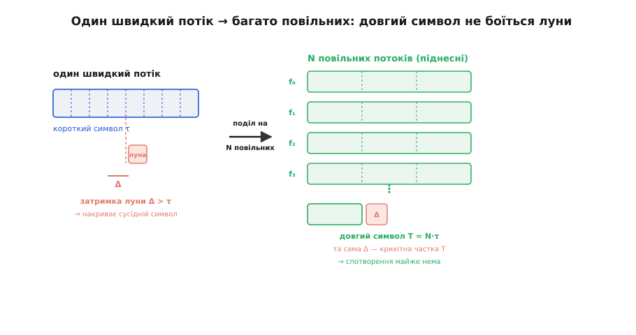
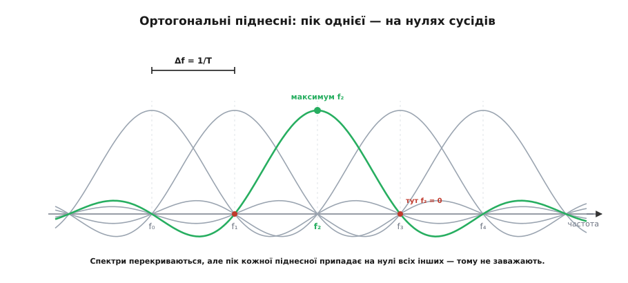
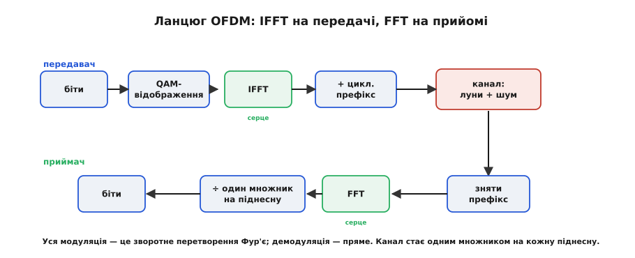

# OFDM: мультиплексування з ортогональними піднесними

<preknowlist>
- [Багатопроменевість](topic:com-medium/multipath-fading) — сигнал доходить до приймача не раз, а кількома шляхами з різними затримками; саме ці луни OFDM і приборкує.
- [Квадратурна амплітудна модуляція (QAM)](topic:com-modulation/qam) — символ як точка на площині амплітуда-фаза; кожна піднесна OFDM несе саме такий символ.
- [ДПФ](topic:com-signal/dft) — розклад сигналу на суму гармонік і зворотна до нього операція; на них тримається вся практична реалізація OFDM.
</preknowlist>

Ефір — не чиста труба. Той самий сигнал доходить до приймача кількома шляхами: прямим і ще десятком, що відбилися від стін, будинків, землі. Кожен шлях довший за прямий на свою дещицю, тому копії приходять із різними затримками — це [багатопроменевість](topic:com-medium/multipath-fading). І ось тут криється пастка, яка обмежує швидкість.

Хочеш передати більше даних — коротшаєш символ, щоб їх умістилося більше за секунду. Але коли символ стає коротшим за розкид затримок луни, копія одного символу накриває вже *наступний*: приймач бачить кашу з накладених одна на одну відповідей. Це міжсимвольне спотворення. Побороти його можна вирівнювачем (англ. *equalizer* — вирівнювач каналу), та чим ширша смуга, тим по-різному канал глушить різні частоти всередині неї, і тим важчий той вирівнювач. Наївний шлях «одна несуча, дедалі швидше» впирається в стіну.

### Поділ, який усе змінює

А що, як замість одного швидкого потоку пустити багато повільних поряд — кожен на своїй частоті? Розкладімо потік на N підпотоків, кожен на власній **піднесній** (під + несуча — несуча нижчого рангу всередині каналу). На кожну піднесну припадає лише 1/N швидкості, тож її символ стає в N разів *довшим*. І ось диво: та сама затримка луни, що губила короткий символ, для довгого — крихітна частка. Спотворення майже зникає.


*Ліворуч — короткий символ, який луна накриває цілком; праворуч — той самий обсяг даних розкладено на N довгих символів, і та сама затримка Δ стає дрібницею.*

Виграш глибший за захист від луни. Широку смугу, де канал глушить частоти нерівномірно, ми порізали на N вузьких скибок. А на скибці, вузькій до краю, канал уже майже рівний — це просто одне комплексне число підсилення. Замість одного важкого вирівнювача на всю смугу — N тривіальних поправок, по одному множенню на піднесну. Одна складна задача розпалася на N простих.

> 🔧 **Навіщо це.** Сигнал від роутера до ноутбука б'ється об стіни й меблі, приходить відлунням — класична багатопроменевість у кімнаті. Саме OFDM дає змогу каналу 20 МГц у [Wi-Fi](topic:com-transport/wifi) нести сотні Мбіт/с попри ці луни: він перетворює одне важке вирівнювання широкої смуги на десятки простих поправок на вузьких піднесних.

### Чому «ортогональні»

Багато піднесних поряд — чи не доведеться лишати між ними захисні проміжки, марнуючи спектр? Ось найелегантніший хід. Виберімо крок між піднесними рівно **Δf = 1/T**, де T — тривалість символу. Тоді за час одного символу в кожну піднесну вкладається ціле число періодів, і будь-які дві різні піднесні стають **ортогональними** (лат. *orthogonalis*, від гр. *orthos* — прямий + *gōnia* — кут): їхній добуток за період усереднюється рівно в нуль. У спектрі кожна піднесна — це крива-*sinc*, чий пік припадає точно на нулі всіх сусідніх.


*Крок Δf = 1/T підібрано так, що максимум кожної піднесної збігається з нулями решти. Спектри щільно перекриваються — і все ж на своїй частоті кожна читається чисто.*

Вони густо перекриваються — і попри це не заважають одна одній: на частоті своєї піднесної приймач бачить лише її, бо там усі інші — в нулі. Захисні проміжки не потрібні, пакування — найщільніше можливе. Це і є «ортогональне» в назві OFDM (англ. *Orthogonal Frequency-Division Multiplexing* — ортогональне частотне мультиплексування, лат. *multiplex* — багатоскладовий).

### Серце — це перетворення Фур'є

Породити N піднесних і скласти їх — це ж, здавалося б, N генераторів, дорого. Але зважена сума рівномірно рознесених гармонік із заданими амплітудами — це рівно **зворотне [дискретне перетворення Фур'є](topic:com-signal/dft)** тих даних-символів. Тобто передавач — це один зворотний Фур'є: взяв N символів, прогнав через IFFT — на виході часовий сигнал. Приймач робить пряме перетворення (FFT) і дістає символи назад.


*Уся модуляція звелася до пари перетворень Фур'є; між ними канал діє як один множник на кожну піднесну.*

Саме тому OFDM — ідея аж 1960-х (Роберт Чанг, Bell Labs, 1966) — пішла в маси лише тоді, коли [швидке перетворення Фур'є](topic:com-signal/fft) стало дешевим у кремнії: складання тисячі піднесних коштує один виклик FFT замість тисячі генераторів. Як ідея дозріла від паралельних тонових модемів до Wi-Fi і 5G — окрема [історія народження OFDM](topic:com-modulation/ofdm/hist-ofdm-birth.md), а чому сума піднесних *точно* збігається зі зворотним ДПФ і чому вони ортогональні — [виводиться математично](topic:com-modulation/ofdm/math-orthogonality-ifft.md).

### Циклічний префікс: остання ланка

Лишається дрібний недогляд. Навіть довгі символи трохи протікають один в одного найдовшими лунами, а канал змішує відліки звичайною згорткою — не тією *кільцевою*, яку FFT обертає начисто. Лік простий: скопіювати хвіст символу й приклеїти його спереду — це **циклічний префікс** (лат. *praefixus* — прикріплений спереду). Поки розкид затримок коротший за префікс, усі залишкові луни падають цілком усередину цього префікса-жертви; приймач його відкидає — і в тому, що лишилось, канал стає рівно [кільцевою згорткою](topic:com-signal/circular-convolution), тобто одним комплексним множником на піднесну. Ціна — префікс не несе нових даних; його довжину беруть за розкидом затримок каналу ([delay spread](topic:com-medium/delay-spread)).

**Наприклад: піднесні Wi-Fi (канал 20 МГц).**
```
смуга каналу        = 20 МГц
розмір FFT          = 64 точки
крок піднесних Δf   = 20 МГц / 64  = 312.5 кГц
тривалість символу  = 1 / Δf       = 3.2 мкс
циклічний префікс   = 0.8 мкс
повний символ       = 3.2 + 0.8    = 4.0 мкс
надлишок префікса   = 0.8 / 4.0    = 20%
```
Із 64 піднесних близько 52 несуть корисне, кожна — свій QAM-символ; захист від луни коштує п'ятої частини часу.

Підсумок вартий тих зусиль: лютий багатопроменевий канал приборкано жменею поправок замість страшного вирівнювача, і все — за найщільнішого пакування спектра. Тому на OFDM стоять Wi-Fi, низхідні канали 4G LTE і 5G, цифрове ТБ (DVB-T), цифрове радіо (DAB) і DSL по телефонній парі; а коли піднесні роздають різним абонентам, це вже [OFDMA](topic:com-modulation/ofdma). Платня за розкіш — два відомі болі: сума багатьох піднесних раз у раз дає високий сплеск (напружує підсилювач), і вся ортогональність тримається на точності — зрушив частоту з кроку 1/T, і піднесні почнуть заважати. Як зібрати робочий OFDM-модем на кількадесят рядків — від IFFT до зняття префікса — показано в [прикладі-проєкті](topic:com-modulation/ofdm/proj-ofdm-modem.md).
