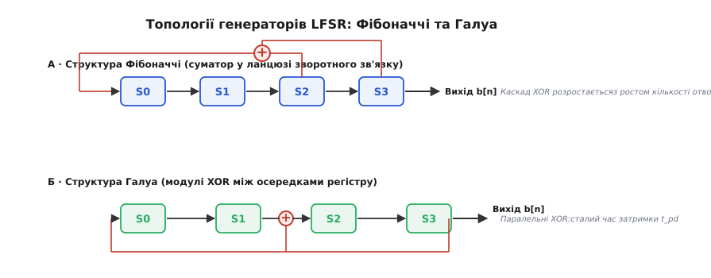
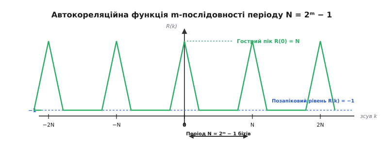
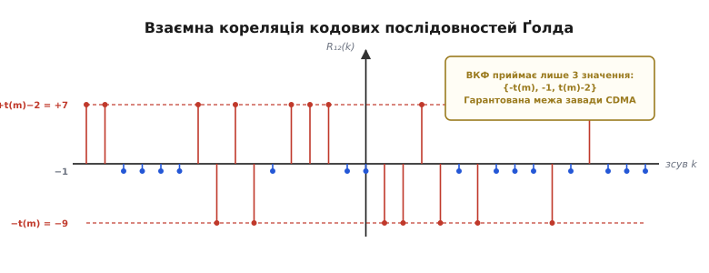
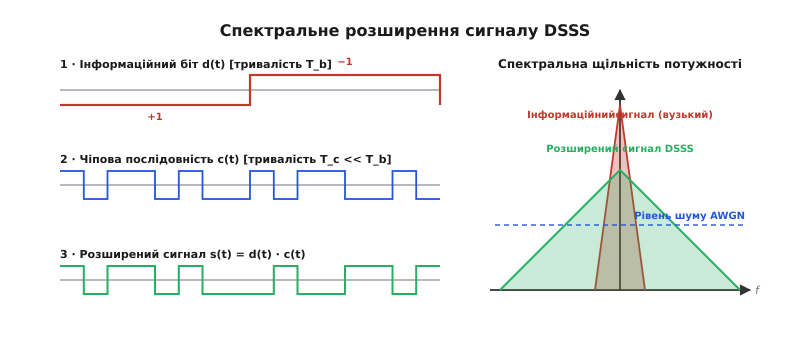

# PN-послідовності

<preknowlist>
- [Найквіст і аліасинг](root:com-signal/nyquist-aliasing) — дискретизація сигналів та спектральні межі.
- [Розширений спектр](root:com-modulation/spread-spectrum) — мета розширення смуги для підвищення завадостійкості та прихованості.
- [Відстань Геммінга](root:com-modulation/hamming-distance) — підрахунок розбіжностей між двійковими векторами.
</preknowlist>

GPS-приймач у смартфоні дістає з орбіти радіосигнал супутника, випромінений з потужністю всього 50 Вт із відстані 20 000 кілометрів. На поверхні Землі цей сигнал провалюється на 16 децибелів нижче від рівня природного теплового шуму атмосфери та підсилювача. Звичайний аналоговий демодулятор чи пороговий детектив виявив би в антені лише хаотичні білі шуми. Проте приймач не лише миттєво вирізняє сигнал конкретного супутника з-поміж тридцяти інших, що випромінюють на тій самій частоті 1575.42 МГц, а й вимірює час прольоту хвилі з точністю до кількох наносекунд. Ця можливість повністю спирається на детерміновані двійкові структури — псевдовипадкові послідовності (Pseudorandom Noise, PN-послідовності).

## Від випадкового шуму до детермінованого коду

Справжній фізичний шум (наприклад, тепловий шум регістра або дробовий шум p-n переходу) є абсолютно непередбачуваним. Спектральна щільність його потужності рівномірно розподілена по всій смузі частот, а значення відліків у часі не пов'язані між собою. Для задач зв'язку білий шум має дві ідеальні властивості: він виглядає як випадкове коливання без гострих спектральних піків і має ортогональність до будь-яких зсунутих у часі копій самого себе. Однак справжній шум неможливо використати для виявлення кодованого сигналу — приймач не має змоги заздалегідь знати, які саме хаотичні відліки випромінив передавач тисячну частку секунди тому.

PN-послідовність розв'язує цю суперечність: вона є суворо детермінованим періодичним цифровим сигналом, який обчислюється за математичним алгоритмом, але у межах одного періоду демонструє статистичні властивості витіснистого випадкового шуму. Для стороннього спостерігача, який не знає генераторного правила, така послідовність не відрізняється від випадкової двійкової жили. Проте приймач, оснащений точно таким самим генератором та алгоритмом синхронізації, відновлює вихідну послідовність і виконує узгоджену фільтрацію.

Фізично PN-послідовність формується у вигляді безперервного потоку двійкових символів — чіпів (chips). Термін «чіп» уведено спеціально для того, щоб не плутати елементарний імпульс розширювальної послідовності з інформаційним бітом даних, тривалість якого може бути у сотні чи тисячі разів більшою. Наприклад, у стандарті GPS тривалість одного чіпа становить 977.5 наносекунд, тоді як інформаційний біт навігаційного повідомлення триває 20 мілісекунд (один біт даних містить рівно 20 повних повторень PN-коду).

Генерація PN-послідовностей базується на арифметиці скінченних полів Галуа `GF(2)`, де єдиними допустимими значеннями елементів є 0 та 1, а операціями є додавання за модулем 2 (логічний XOR) та множення (логічний І).

Історія розробки таких послідовностей сягає 1950-х років, коли лабораторії космічних досліджень шукали способи точного вимірювання дальності до перших міжпланетних апаратів. Докладніше про створення перших систем та математичний внесок засновників цифрового зв'язку розповідає [історія виникнення m-послідовностей та теорії Ґоломба](root:com-modulation/pn-sequences/hist-golomb-m-sequences.md).

## Схема LFSR: регістри зсуву зі зворотним зв'язком

Основним апаратним та програмним інструментом побудови PN-послідовностей є лінійний регістр зсуву зі зворотним зв'язком (Linear Feedback Shift Register, LFSR). Він складається з каскаду `m` послідовно з'єднаних тригерів (осенищ пам'яті) та схем зворотного зв'язку, виконаних на елементах XOR.

На кожному такті синхросигналу вміст кожного тригера пересувається у сусідній розряд праворуч. Значення, що вноситься у найперший розряд регістру, обчислюється як лінійна комбінація (сума за модулем 2) поточних станів визначених комірок. Ці комірки називаються отводами (taps), а їхнє розташування задається характеристичним поліномом генератора:

```
P(x) = c[m]·xᵐ + c[m-1]·xᵐ⁻¹ + ... + c[1]·x¹ + 1
```

де коефіцієнт `c[i] = 1`, якщо відвід від `i`-ї комірки підключений до схеми зворотного зв'язку, і `c[i] = 0` у протилежному випадку.


*Дві топології побудови LFSR: у формі Фібоначчі зворотний зв'язок обчислюється каскадом XOR, тоді як у формі Галуа сигнал зворотного зв'язку вноситься безпосередньо між секціями регістру.*

Існують дві математично еквівалентні, але схемотехнічно різні топології побудови LFSR:

1. **Топологія Фібоначчі:** значення з кількох визначених комірок регістру підсумовуються у довгому каскаді елементів XOR, і результувальний єдиний біт подається на вхід найпершої комірки `S0`. Головний недолік цієї схеми у високоефективному залізі — послідовна затримка поширення сигналу `t_pd` через багаторівневе дерево XOR. Якщо отводів багато, критичний шлях тактування подовжується, що обмежує максимальну частоту генератора.
2. **Топологія Галуа:** вихідний біт із останньої комірки `S[m-1]` подається паралельно на один із входів окремих елементів XOR, розташованих безпосередньо між внутрішніми осередками регістру. У цій схемі між сусідніми тригерами стоїть не більше ніж один логічний вентиль XOR. Кількість отводів більше не збільшує затримку критичного шляху, тому генератор Галуа може працювати на граничних частотах кремнієвого кристала (до кількох ґіґагерців у сучасних ПЛІС та ASIC).

Сукупність усіх `m` бітів регістру утворює вектор стану. Оскільки регістр має `m` тригерів, усього існує `2ᵐ` можливих двійкових комбінацій. Проте стан із усіма нулями `[0, 0, ..., 0]` є поглинальним: якщо регістр опиниться у нульовому стані, сума XOR усіх отводів дасть 0, і регістр назавжди застрягне в цьому стані. Тому максимальний можливий період послідовності для `m`-бітного LFSR становить рівно `N = 2ᵐ - 1` бітів.

## Послідовності максимальної довжини (m-послідовності)

LFSR генератор сягає теоретичного межового періоду `N = 2ᵐ - 1` тоді й лише тоді, коли його коефіцієнтний поліном `P(x)` є **примітивним поліномом** над полем `GF(2)`. Згенеровані такими генераторами коди називають m-послідовностями.

Якщо обрати незвідний, але не примітивний поліном, регістр розіб'є простір `2ᵐ - 1` станів на кілька замкнених коротших циклів. Якщо ж обрати звідний (складений) поліном, довжина циклу залежить від початкового стану і буде значно меншою за максимум.

m-послідовності володіють трьома фундаментальними властивостями псевдовипадковості, які довів Соломон Ґоломб:

### 1. Властивість збалансованості (Balance Property)
У кожному повному періоді довжиною `N = 2ᵐ - 1` кількість одиниць дорівнює `2ᵐ⁻¹`, а кількість нулів дорівнює `2ᵐ⁻¹ - 1`. Одиниць завжди рівно на одну більше, ніж нулів. Наприклад, для 5-бітного регістру (`N = 31`) період містить 16 одиниць та 15 нулів. Завдяки цьому постійна складова (DC offset) біполярного сигналу є практично нульовою (`-1/N`), що критично важливо для проходження сигналу через розв'язувальні конденсатори та трансформатори радіотракту.

### 2. Властивість серій (Run Property)
Серією називається послідовність одинакових символів (підряд ідучих нулів або одиниць), обмежена з обох боків протилежними символами. У кожному періоді m-послідовності загальна кількість серій дорівнює `2ᵐ⁻¹`. При цьому:
- Половина всіх серій має довжину 1 чіп.
- Чверть серій має довжину 2 чіпи.
- Одна восьма серій має довжину 3 чіпи, і так далі.

Крім того, для кожної довжини кількість серій з одиниць та нулів є однаковою (за винятком однієї єдиної серії нулів довжиною `m - 1` та однієї серії одиниць довжиною `m`). Це забезпечує спектральну гладкість сигналу, аналогічну до випадкового процесу.

### 3. Властивість зсуву та додавання (Shift-and-Add Property)
Поелементне додавання за модулем 2 (XOR) будь-якої m-послідовності з її власним циклічним зсувом на `k` позицій (`k ≠ 0 mod N`) дає **ту саму m-послідовність**, лише циклічно зсунуту на деякий третій інтервал `r(k)`.

Строге математичне обґрунтування властивостей кінцевих полів та детальний аналіз алгебри поліномів розбирає [математичний апарат LFSR та примітивних поліномів](root:com-modulation/pn-sequences/math-lfsr-polynomials.md).

## Автокореляція: ідеальний дворівневий профіль

Найважливішою для практики обробки сигналів є періодична автокореляційна функція (АКФ) m-послідовності. Для аналізу кореляції двійкову послідовність `a[n] ∈ {0, 1}` переводять у біполярний формат `s[n] ∈ {+1, -1}` за співвідношенням `s[n] = 1 - 2·a[n]`.

Періодична автокореляційна функція `R(k)` для часового зсуву `k` визначається як сума добутків елементів:

```
R(k) = ∑_{n=0}^{N-1} s[n] · s[n+k]
```

Завдяки властивості зсуву та додавання, для будь-якого ненульового зсуву `k ≠ 0 (mod N)` добуток `s[n] · s[n+k]` перетворюється на елементи тієї самої m-послідовності. Оскільки в періоді одиниць на одну більше, ніж нулів, підсумкова сума для будь-яких ненульових зсувів є суворо сталою:

```
R(k) = N   при k = 0, ±N, ±2N, ...  (повний збіг за фазою)
R(k) = -1  при k ≠ 0 (mod N)        (розсинхронізований стан)
```

При нормуванні на довжину періоду `N` значення автокореляції поза піком дорівнює `-1/N`. Для довгих послідовностей (наприклад, `m = 10`, `N = 1023`) це значення становить `-1/1023 ≈ -0.000977`, що практично дорівнює нулю.


*Дворівнева автокореляція m-послідовності: одиничний гострий пік за нульового зсуву та рівномірне значення -1 за будь-якого розсинхронізування.*

Такий дельта-подібний автокореляційний профіль означає, що приймач, обчислюючи кореляцію вхідного зашумленого сигналу з локальною копією m-послідовності, отримує потужний гострий пік **лише у мить точного збігу чіпів**. Найменший зсув навіть на 1 чіп скидає кореляційний відгук до рівня шумового фону.

Ця властивість лежить в основі роботи узгоджених фільтрів (matched filters) та кореляційних приймачів: вони здатні витягувати сигнал з-під шумів, накопичуючи енергію вздовж усього періоду `N`.

## Ансамблі послідовностей: коди Ґолда та Касамі

Якщо у системі зв'язку працює лише один передавач (наприклад, один радіолокатор чи вимірювач дальності), одна m-послідовність працює ідеально. Але у багатокористувацьких системах із кодовим поділом каналів (CDMA) або супутникових мережах, де на одній частоті одночасно випромінюють десятки або сотні пристроїв, виникає потреба в **ансамблі** послідовностей.

Необхідно, щоб кожні два пристрої мали власну унікальну послідовність. При цьому послідовність кожного користувача повинна мати ідеальну автокореляцію (для власних синхронізації та демодуляції), а взаємна кореляція (ВКФ) між послідовностями *різних* користувачів має бути мінімальною на будь-яких часових зсувах.

Тут m-послідовності виявляють свій головний недолік: хоча кожна окрема m-послідовність має ідеальну АКФ, взаємна кореляція між випадково обраними парами m-послідовностей однаковою довжини часто містить високі паразитні піки. Ці піки викликають взаємні завади (Cross-Talk) та призводять до ефекту «близький-далекий» (Near-Far problem), коли потужний сигнал ближнього передавача повністю забиває слабкий сигнал віддаленого абонента.

Для подолання цієї проблеми використовують спеціально сконструйовані ансамблі послідовностей з обмеженим рівнем ВКФ.

### Коди Ґолда (Gold Codes)
Рой Ґолд довів, що якщо вибрати спеціальну пара примітивних поліномів однаковою ступені `m` (так звану переважну пару, preferred pair), то поелементне додавання по модулю 2 першої m-послідовності з різними циклічними зсувами другої m-послідовності утворює сімейство з `N + 2 = 2ᵐ + 1` послідовностей.

Взаємна кореляція між будь-якими двома послідовностями з цього сімейства приймає лише три фіксовані значення:

```
R_{Gold}(k) ∈ { -t(m),  -1,  t(m) - 2 }
```

де `t(m) = 1 + 2^((m+1)/2)` для непарних `m`, і `t(m) = 1 + 2^((m+2)/2)` для парних `m`.


*Розподіл взаємної кореляції між кодами Ґолда: обмежені трирівневі піки дозволяють розділяти багатьох користувачів на одній частоті без взаємних завад.*

Наприклад, для `m = 10` (`N = 1023`, як у GPS L1 C/A коді) параметр `t(10) = 1 + 2⁶ = 65`. Значення взаємної кореляції можуть дорівнювати лише `-65`, `-1` або `+63`. Відношення пікового значення ВКФ до корисного піку АКФ дорівнює `65 / 1023 ≈ 0.0635` (-23.9 дБ). Це забезпечує надійну ізоляцію супутників GPS один від одного на єдиній частоті.

### Коди Касамі (Kasami Codes)
Тецуо Касамі розробив ансамблі послідовностей для парних значень `m`. Малий set Касамі утворюється шляхом децимації m-послідовності `a[n]` із кроком `q = 2^(m/2) + 1`.

Ансамбль Касамі містить `2^(m/2)` послідовностей довжиною `N = 2ᵐ - 1`, а його максимальна взаємна кореляція не перевищує `s(m) = 1 + 2^(m/2)`. Для `m = 10` довжина дорівнює 1023, ансамбль налічує 32 послідовності, а пік взаємної кореляції становить всього 33 (проти 65 у кодів Ґолда). Коди Касамі досягають нижньої математичної межі Сідельникова для взаємної кореляції, проте їхня кількість у сімействі є меншою.

## Практичне застосування у сучасних системах

PN-послідовності є фундаментальною цеглиною радіоелектроніки, комп'ютерних шин та систем обробки сигналів.

```
                  +-----------------------------------+
                  |     Застосування PN-послідовностей |
                  +-----------------+-----------------+
                                    |
     +-----------------+------------+------------+-----------------+
     |                 |                         |                 |
     v                 v                         v                 v
[DSSS / CDMA]    [Супутникова навігація]   [Скремблювання PHY]   [Оцінка каналу]
- Wi-Fi 802.11b  - GPS L1 C/A (1023 чіпи)  - PCIe, SATA, USB3    - Зондування CIR
- 3G WCDMA       - Galileo, GLONASS        - Ethernet 1000BASE-T - Калібрування АЦП
```

### 1. Розширення спектра прямою послідовністю (DSSS)
У системах DSSS (Direct Sequence Spread Spectrum) кожен інформаційний біт перед випромінюванням у простір перемножується на повний період PN-послідовності. Оскільки частота чіпів `f_c` у `N` разів перевищує інформаційну швидкість бітів `f_b`, спектр результуючого сигналу розширюється у `N` разів, а його спектральна щільність потужності пропорційно падає нижче рівня радіозавад та теплових шумів.


*Часова та спектральна трансформація в DSSS: низькошвидкісний інформаційний біт розмножується високою чіповою частотою, розмазуючи спектр сигналу нижче рівня шумів.*

Приймач виконує перемноження вхідного сигналу на таку саму локальну PN-послідовність. Оскільки `s[n] · s[n] = (+1)² = 1`, інформаційний сигнал згортається назад у вузьку смугу, відновлюючи свою амплітуду. Натомість будь-яка вузькосмугова завада в ефірі при перемноженні на PN-код, навпаки, розмазується по широкій смузі, додаючи лише мізерну частку шуму. Виграш від обробки (Processing Gain) становить:

```
G_p = 10 · log10(f_c / f_b) = 10 · log10(N)   [дБ]
```

Приклад: у Wi-Fi стандарту 802.11b використовується 11-чипова послідовність Баркера `[+1, -1, +1, +1, -1, +1, +1, +1, -1, -1, -1]`. Оскільки `N = 11`, виграш від обробки становить `10 · log10(11) ≈ 10.4` дБ, що забезпечує стійку передачу 1 Мбіт/с даних при чіповій частоті 11 Мчип/с у зашумленому ISM-діапазоні 2.4 ГГц.

### 2. Скремблювання у фізичному рівні (PHY Scrambling)
У швидкісних послідовних шинах (PCIe, SATA, USB 3.0, DisplayPort) та мережевих фізичних інтерфейсах (Ethernet 1000BASE-T, Wi-Fi 802.11a/g/n/ac) довгі серії однакових нулів або одиниць у даних викличуть дві проблеми: зміщення постійного рівня (DC drift) та виникнення вузьких піків електромагнітного випромінювання (EMI), які заважають іншій електроніці та не проходять сертифікацію FCC/CE.

Для розв'язання цієї проблеми потік даних перед передачею піддається скремблюванню — додаванню по модулю 2 із виходом LFSR-генератора. Оскільки PN-послідовність має збалансований спектр білого шуму, розмазаний спектр випромінювання провалюється на 10–20 дБ, усуваючи гармонійні піки. На приймачі потік даних пропускається через такий самий дескремблер, відновлюючи первинний вміст.

Наприклад, у шині PCI Express Gen 3 та Gen 4 використовується 23-бітний LFSR із поліномом `P(x) = x²³ + x²¹ + x²⁰ + x¹⁷ + 1`. Скремблер обробляє 128b/130b кадри даних на частотах до 16 ГГц, запобігаючи паразитному випромінюванню на материнській платі.

### 3. Оцінка імпульсної характеристики каналу (Channel Estimation)
У складних міських умовах із багатопроменевим поширенням хвиль сигнал доходить до антени багатьма шляхами з різними затримками та згасаннями. Щоб налаштувати адаптивний еквалайзер приймача, у початок кадру (преамбулу) вставляють відому PN-послідовність (Chirp або PN Training Sequence).

Обчислюючи взаємну кореляцію прийнятого сигналу з еталонною PN-послідовністю, приймач отримує точний графік імпульсної характеристики каналу (Channel Impulse Response, CIR), де кожен промінь відбиття відображається окремим сплеском кореляції.

Для практичного ознайомлення з алгоритмами розробки генераторів та їх оптимізацією створено [проєкт реалізації генераторів PN-послідовностей на C та C++](root:com-modulation/pn-sequences/proj-pn-generator.md).

> 🔧 **Навіщо це.** PN-послідовності — це універсальний інструмент інженера зв'язку. Вони перетворюють некогерентний шум на впорядковане середовище передачі. Якщо твоя система повинна працювати у жорстких умовах радіозавад, мати прихований сигнал нижче рівня шумів або точно вимірювати відстань за затримкою сигналу — DSSS на базі кодів Ґолда є базовим стандартним рішенням.

## Інженерні пастки, криптографічні обмеження та обчислювальна вартість

Попри потужні характеристики, практична реалізація PN-генераторів вимагає врахування кількох технічних обмежень:

### 1. Криптографічна незахищеність LFSR
Оскільки LFSR є строго лінійною системою, послідовність, згенерована `m`-бітним LFSR, повністю розкривається алгоритмом Берлекампа-Мессі (Berlekamp-Massey Algorithm). Спостерігачеві достатньо перехопити всього `2m` послідовних бітів виходу, щоб скласти систему лінійних рівнянь і повністю обчислити як поточний стан регістру, так і його характеристичний поліном.

Тому **LFSR категорично заборонено використовувати у криптографії** для шифрування даних чи створення сеансових ключів. Для криптографічного захисту застосовують нелінійні комбінатори станів або криптостійкі генератори (наприклад, AES у режимі CTR, ChaCha20 чи спеціалізовані потокові шиفري Trivium та Grain).

### 2. Складність пошуку та синхронізації (Code Acquisition)
Приймач не може почати демодуляцію даних, поки локальний генератор PN-коду не співпаде за фазою із вхідним сигналом із точністю до частки чіпа. Процес пошуку (Acquisition) полягає у послідовному зсуві фази локального генератора та обчисленні кореляції.

Для довгих послідовностей послідовний перебір усіх `N` зсувів забирає значний час. Крім того, ефект Доплера при русі супутників або мобільних терміналів викликає зсув частоти несучої, тому шукати доводиться у двовимірній сітці «затримка — частота Доплера». У сучасних GPS-приймачах для прискорення синхронізації використовують паралельний кореляційний пошук на базі швидкого перетворення Фур'є (FFT-based matched filtering) або масиви з тисяч паралельних апаратних кореляторів у системній ПЛІС.

```
       +-------------------------------------------------------+
       |   Спектр задач: вибір топології та алгоритму PN        |
       +-------------------------------------------------------+
                                   |
         +-------------------------+-------------------------+
         |                                                   |
         v                                                   v
[Швидкісний передавач / PHY]                     [Багатокористувацький CDMA]
- Топологія Галуа (паралельний XOR)              - Коди Ґолда або Касамі
- Фіксований час t_pd                             - Обмеження ВКФ {-t(m), -1, t(m)-2}
- Низькі ЕМІ через скремблювання                 - Боротьба з ефектом «близький-далекий»
```

### 3. Джитер тактування та міжсимвольна інтерференція (ISI)
Оскільки спектр DSSS-сигналу є дуже широким, будь-які фазові тремтіння (джитер) опорного генератора тактової частоти `f_c` або нелінійність амплітудно-частотної характеристики (АЧХ) прийомно-передавального тракту розмивають гострий пік автокореляції. Це призводить до розширення кореляційного трикутника та виникнення міжсимвольної інтерференції між сусідніми чіпами. Для звуження спектра чіпів без спалахів міжсимвольної інтерференції застосовують фільтри піднятого косинуса (Root-Raised Cosine, RRC).

У результаті збалансованість, ортогональність та ідеальна автокореляція PN-послідовностей забезпечують фундаментальну основу для сучасної бездротової навігації, завадостійких радіоліній та високошвидкісних цифрових інтерфейсів.
