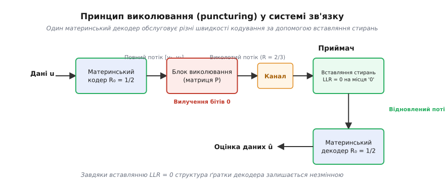
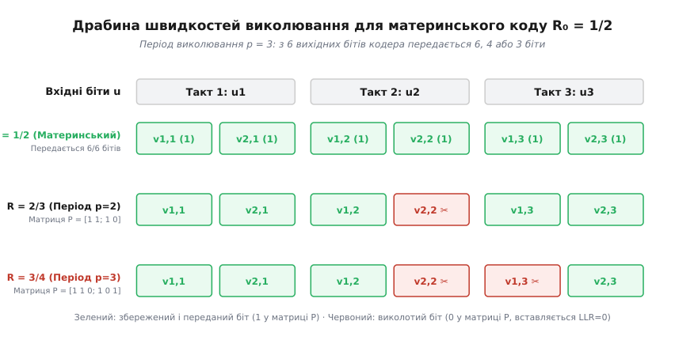
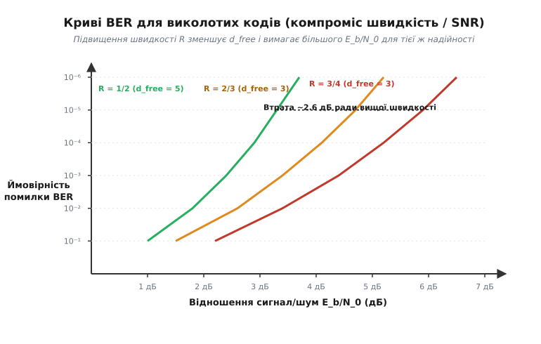
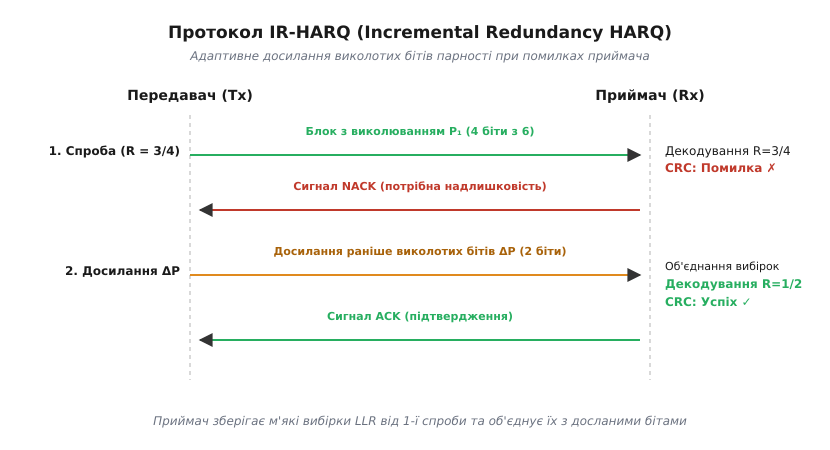

# Виколоті коди (puncturing)

<preknowlist>
- [Згорткові коди](topic:com-modulation/convolutional-codes) — принцип роботи зсувного регістра, швидкість коду 1/2 та концепція пам'яті кодера.
- [Декодер Вітербі](topic:com-modulation/viterbi-decoder) — обчислення метрик шляху в ґратці, м'які рішення (soft decision) та LLR.
- [Відстань Геммінга](topic:com-modulation/hamming-distance) — кодова відстань d_min та вільна відстань d_free як міра завадостійкості.
- [Пряме виправлення помилок (FEC)](topic:com-modulation/fec-channel-coding) — баланс між надлишковістю, пропускною здатністю та ймовірністю бітової помилки (BER).
</preknowlist>

У бездротових каналах зв'язку відношення сигнал/шум (SNR) постійно коливається: мобільний телефон наближається до базової станції, супутник виходить із зони хмарності або Wi-Fi роутер переходить у сусідню кімнату. Коли канал чистий і шум низький, передача даних з низькою швидкістю кодування (наприклад, `R = 1/2`, де половина бітів є надлишковою парністю) марнотратно займає спектр. Канал здатний пропустити набагато більше корисних бітів. Проте впровадження окремого кодера та декодера під кожну потрібну швидкість (`R = 2/3`, `3/4`, `5/6`, `7/8`) вимагало б розмноження залізобетонних схем на чіпі, збільшуючи площу кристала та споживання енергії.

Виколювання (puncturing) вирішує цю суперечність із винятковою інженерною витонченістю. Замість проектування нових складних кодів передавач бере один базовий низькошвидкісний **материнський код** (mother code, найчастіше `R = 1/2` або `1/3`) і вибірково **вилучає (виколює)** частину вихідних бітів парності за строго визначеним періодичним візерунком. Приймач при цьому не змінює свій залізобетонний декодер: на місця вилучених бітів він просто вставляє значення «не знаю» (стирання з нульовою впевненістю, `LLR = 0`). У результаті один материнський декодер обслуговує цілий набір швидкостей кодування, підлаштовуючи пропускну здатність каналу на льоту.

## Механізм виколювання: материнський код і маска P

Схема виколювання будується на двох поняттях: материнському коді `C₀` із початковою швидкістю `R₀ = k₀ / n₀` та двовимірній бінарній **матриці виколювання** `P` (puncturing matrix) з періодом `p`.

Розгляньмо стандартний материнський згортковий код зі швидкістю `R₀ = 1/2`. На кожен вхідний інформаційний біт `u[k]` кодер видає два вихідних біти: `v1[k]` та `v2[k]`. За період з `p` тактів кодер генерує `2p` бітів. Матриця виколювання `P` має розмірність `2 × p` і складається з нулів та одиниць:
- Одиниця (`1`) означає, що відповідний вихідний біт зберігається й передається в ефір;
- Нуль (`0`) означає, що біт виколюється (стирається) і не передається у канал.


*Один материнський декодер обслуговує різні швидкості кодування завдяки вставлянню нейтральних стирань LLR = 0 на місця виколотих бітів.*

Завдяки вилученню нульових позицій кількість реально переданих у канал бітів за період `p` зменшується від `2p` до числа одиниць у матриці `N_kept`. У результаті підсумкова кодова швидкість виростає до значення:

```
R_punc = p / N_kept
```

Побудуймо для наочності дві найпоширеніші швидкості кодування, що використовуються у стандартах Wi-Fi 802.11a/g та супутниковому мовленні DVB:

1. **Отримання швидкості R = 2/3 (період p = 2):**
   Матриця виколювання має вигляд `P = [1 1; 1 0]`.
   За 2 такти материнський кодер видає 4 біти: `[v1,1; v2,1; v1,2; v2,2]`.
   Застосовуючи маску `P`, вилучаємо біт `v2,2` (де стоїть нуль). У канал ідуть лише 3 біти: `[v1,1; v2,1; v1,2]`. На 2 інформаційні біти передано 3 фізичні біти — швидкість `R = 2/3`.

2. **Отримання швидкості R = 3/4 (період p = 3):**
   Матриця виколювання має вигляд `P = [1 1 0; 1 0 1]`.
   За 3 такти материнський кодер видає 6 бітів: `[v1,1; v2,1; v1,2; v2,2; v1,3; v2,3]`.
   Маска вилучає 2 біти (`v2,2` та `v1,3`). У канал відправляються лише 4 біти: `[v1,1; v2,1; v1,2; v2,3]`. На 3 інформаційні біти передано 4 фізичні біти — швидкість `R = 3/4`.

Простежмо роботу кодера (7, 5) з довжиною обмеження `K = 3` для вхідної послідовності бітів `1 0 1 1 0 0`. Материнський кодер видає 12 бітів (6 пар):

```
Крок (такт)  Вхід u[k]  Материнський вихід (v1, v2)   Вихід R=2/3 (P_2/3)   Вихід R=3/4 (P_3/4)
    1           1                  1  1                    1  1                1  1
    2           0                  1  0                    1  - (1)            1  - (1)
    3           1                  0  0                    0  0                -  0 (0)
    4           1                  0  1                    0  - (0)            0  1
    5           0                  0  1                    0  1                0  - (0)
    6           0                  1  1                    1  - (1)            -  1 (1)
```

Зверніть увагу: у режимі `R = 2/3` з кожних 4 материнських бітів вилучається 1 біт (передається 9 бітів замість 12). У режимі `R = 3/4` з кожних 6 бітів вилучається 2 біти (передається 8 бітів замість 12).

## Драбина швидкостей та збереження ґратки

Головна перевага виколювання полягає у тому, що воно не змінює базову алгебру коду та структуру його автоматних станів. Приймач оперує однією й тією ж ґраткою материнського коду незалежно від обраного режиму швидкості.


*Зміна візерунка виколювання за періоду p = 3 дозволяє отримувати драбину швидкостей від R = 1/2 до R = 3/4 без зміни архітектури кодера.*

Коли виколотий потік проходить через завадовий канал, приймач отримує лише збережені біти. Перед подачею сигналу на [декодер Вітербі](topic:com-modulation/viterbi-decoder) блок девіколювання (depuncturer) відновлює початковий ритм потоку `R₀ = 1/2`, підставляючи у виколоті позиції **стирання** (erasure).

У системі з м'яким декодуванням (soft decision), де канал повертає логарифмічне співвідношення правдоподібності ([Log-Likelihood Ratio, LLR](topic:math-information/log-likelihood-ratio)):

```
LLR = ln( P(y | x = 0) / P(y | x = 1) )
```

стирання означає повну відсутність інформації про біт: `P(y | 0) = P(y | 1) ⇒ LLR = 0`.

Коли декодер Вітербі обчислює метрику гілки `μ` для чергового переходу в ґратці, доданок від виколотого біта дорівнює `(-1)^v̄ · 0 = 0`. Це означає, що виколотий біт дає однакову (нульову) заваду для обох можливих гілок переходу. Накопичена метрика шляху росте виключно за рахунок тих бітів, які реально пройшли через ефір.

Для ілюстрації розглянемо обчислення метрики переходу у декодері Вітербі. Нехай прийнято м'які LLR відліки каналу `Y = [+2.4, +1.8, -0.2, +2.1]`. За маскою `R = 3/4` девіколювач відновлює 6 відліків для трьох тактів ґратки:

```
Такт 1: LLR_1 = +2.4,  LLR_2 = +1.8    (передано обидва біти)
Такт 2: LLR_1 = -0.2,  LLR_2 =  0.0    (виколото v2 -> вставлено 0.0)
Такт 3: LLR_1 =  0.0,  LLR_2 = +2.1    (виколото v1 -> вставлено 0.0)
```

Під час виконання операції «додати-порівняти-вибрати» (Add-Compare-Select, ACS) на такті 2 метрики обох ребер, що виходять зі стану, додають до поточного значення лише `(-1)^v̄₁ · (-0.2) + 0.0`. Процесорні метелики ACS працюють із незмінною швидкістю, не маючи жодного спеціального розгалуження під виколоті біти.

Детальне виведення обчислення LLR та перетворень ґратки подано у [математичному описі вільної відстані виколотих кодів](topic:com-modulation/punctured-codes/math-punctured-distance.md).

## Компроміс завадостійкості: деградація вільної відстані d_free

Безкоштовного підвищення швидкості не існує: вилучення бітів парності зменшує надлишковість і, як наслідок, знижує завадостійкість коду. Мірою захищеності згорткового коду є його [вільна відстань](topic:com-modulation/hamming-distance) `d_free` — найменша відстань Геммінга між будь-якими двома шляхами в ґратці, що розходяться й знову сходяться.

Кожен виколотий біт парності потенційно зменшує вагу некоректних шляхів у ґратці. Якщо для материнського коду `R₀ = 1/2` (наприклад, стандартного коду NASA з `K = 7`, `d_free = 10`) вільна відстань дорівнювала 10, то при виколюванні до швидкості `R = 3/4` вільна відстань падає до `d_free = 5`, а при `R = 7/8` — до `d_free = 3`.


*Підвищення кодової швидкості зміщує криву BER праворуч: для досягнення тієї ж ймовірності помилки виколотий код вимагає більшого відношення сигнал/шум.*

На графіку залежності ймовірності бітової помилки (BER) від енергії біта `E_b/N_0` це виражається у зміщенні «водоспадної» зони праворуч:
- Материнський код `R = 1/2` забезпечує рівень помилок `10⁻⁵` при відношенні сигнал/шум `E_b/N_0 ≈ 2.7 дБ`.
- Виколотий код `R = 3/4` для досягнення того ж рівня `10⁻⁵` вимагає `E_b/N_0 ≈ 5.3 дБ` (енергетичний штраф становить близько `2.6 дБ`).

Проте у чистому каналі з високим SNR цей енергетичний штраф є цілком прийнятним, адже натомість система отримує `50%` приросту швидкості передачі корисних даних.

### Пастка катастрофічного виколювання (Catastrophic Puncturing)

Не будь-яка матриця `P` з однаковою кількістю одиниць є придатною для використання. Необережно обрана маска може створити так зване **катастрофічне виколювання** (catastrophic puncturing).

Катастрофічне виколювання виникає тоді, коли маска вилучає біти парності таким чином, що у ґратці утворюється некорисний замкнений цикл із нульовою вагою Геммінга для некоректної вхідної послідовності. Наприклад, якщо маска виколює всі біти парності другого генератора протягом кількох тактів поспіль, декодер втрачає здатність розрізняти стани, що відрізняються лише цими бітами. У результаті одна-єдина помилка каналу викликає нескінченний ланцюг помилок на виході декодера (помилкове плато, error floor, де `BER → 0.5`).

Щоб уникнути катастрофічного виколювання, матриці `P` розраховуються за допомогою комп'ютерного перебору за правилами Кейна-Гагенауера:
1. Жодна з вихідних гілок кодера не повинна виколюватися повністю протягом двох тактів поспіль.
2. Сумарна вільна відстань `d_free` виколотого коду повинна бути максимально можливою для даного періоду `p`.

## Адаптивне кодування та протокол IR-HARQ

Найважливішим застосуванням виколювання є протоколи адаптивної кодово-модуляційної трансформації (Adaptive Coding and Modulation, ACM) та гібридного автоматичного запиту повторення з накрементальною надлишковістю (Incremental Redundancy HARQ, або IR-HARQ).

У традиційних системах при виявленні помилки приймач надсилає повторний запит (NACK), і передавач знову надсилає весь кадри даних. У протоколі IR-HARQ на основі вкладених матриць виколювання (Rate-Compatible Punctured Codes, RCPC):

1. **Перша спроба:** Передавач застосовує агресивну маску виколювання `P₁`, надсилаючи блок із високою швидкістю (наприклад, `R = 3/4`).
2. **Аналіз на приймачі:** Приймач підставляє `LLR = 0` у виколоті позиції й запускає декодер. Якщо контрольна сума [CRC](topic:com-modulation/crc) свідчить про помилку, приймач збереже всі прийняті м'які відліки LLR у буферній пам'яті й відправляє сигнал NACK.
3. **Повторна передача (досилання ΔP):** Передавач **не надсилає повторно весь кадри**. Він відправляв лише ті біти парності `ΔP`, які були виколоті у першій спробі.
4. **Об'єднання (Combining):** Приймач вставляє свіжоотримані LLR на відповідні місця у свій буфер, замінюючи попередні нулі (`LLR = 0`) на реальні вибірки каналу. Сумарна ефективна швидкість коду падає до `R = 1/2`, і декодер повторно декодує об'єднаний блок з набагато вищою ймовірністю успіху.


*При помилці декодування передавач досилає лише раніше виколоті біти парності, зменшуючи кодову швидкість і підвищуючи завадостійкість без повторного відправлення всього кадру.*

У сучасних 4G LTE та 5G NR мережах виколювання організоване через **кільцевий буфер узгодження швидкостей** (Circular Buffer Rate Matching, CBRM). Вихідні систематичні біти та біти парності розпаралелюються по трьох підбуферах, перемішуються та вкладаються у єдине кільцеве коло пам'яті. Виколювання зводиться до того, що зчитувальна головка зчитує лише потрібний безперервний шматок бітів з кільця. При повторній передачі (HARQ Redundancy Version, RV0, RV1, RV2, RV3) зчитувальна головка просто зсувається на новий початковий offset, надсилаючи іншу порцію виколотих бітів.

Алгоритм адаптивного вибору маски виколювання в базових станціях (eNodeB / gNodeB) спирається на зовнішній контур керування швидкістю (Outer Loop Rate Control, OLRC). Контролер відстежує цільову ймовірність помилки блоків (Target BLER ≈ 10%). Якщо після першої передачі кількість NACK перевищує 10%, алгоритм автоматично перемикає MCS на нижчий індекс з менш агресивною маскою виколювання.

У багатьох MIMO-системах (багатоантенна передача) маска виколювання обчислюється окремо для кожного просторового потоку (Spatial Stream / Layer), дозволяючи базовій станції передавати потік з чистої антени зі швидкістю `R = 5/6`, а потік із затіненої антени — зі швидкістю `R = 1/2`.

Деталі виникнення сумісних за швидкістю RCPC-кодів та історію їх розробки описано в [історичному нарисі про праці Кейна та Гагенауера](topic:com-modulation/punctured-codes/hist-rcpc-cain-hagenauer.md).

## Практична конфігурація у бездротових стандартах (MCS)

У реальних стеках бездротового зв'язку (наприклад, Wi-Fi 802.11a/g/n та 4G/5G NR) рівень MAC (Media Access Control) керує рівнем PHY (Physical Layer), вибираючи індекс модуляції та кодування (Modulation and Coding Scheme, MCS).

Нижче наведено фрагмент класичної таблиці MCS для стандарту IEEE 802.11a/g, що працює з материнським згортковим кодом `K = 7` (генератори `171₈` та `133₈`):

```
Індекс MCS   Модуляція   Материнська швидкість   Маска виколювання P       Ефективна швидкість R   Пропускна здатність (20 МГц)
  MCS 0        BPSK              1/2                 [1; 1]                      1/2                       6 Мбіт/с
  MCS 1        QPSK              1/2                 [1; 1]                      1/2                       9 Мбіт/с
  MCS 2        QPSK              1/2              [1 1 0; 1 0 1]                 3/4                      12 Мбіт/с
  MCS 3       16-QAM             1/2                 [1; 1]                      1/2                      18 Мбіт/с
  MCS 4       16-QAM             1/2              [1 1 0; 1 0 1]                 3/4                      24 Мбіт/с
  MCS 5       64-QAM             1/2                [1 1; 1 0]                   2/3                      36 Мбіт/с
  MCS 6       64-QAM             1/2              [1 1 0; 1 0 1]                 3/4                      48 Мбіт/с
  MCS 7       64-QAM             1/2             [1 1 1 1 1 1 1; 1 0 0 0 0 0 0]  7/8                      54 Мбіт/с
```

Зверніть увагу: одна й та сама чипсетна реалізація кодера та декодера Вітербі `K = 7` забезпечує швидкості від 6 Мбіт/с до 54 Мбіт/с, змінюючи лише тип сузір'я модуляції та маску виколювання у цифровому контролері!

У вихідному коді ядра Linux (підсистема `net/wireless/` та драйвери `ath9k`, `iwlwifi`) таблиця MCS задається у вигляді структури параметрів каналу, де маска виколювання визначається прапорцями кодової швидкості (`NL80211_BAND_ATTR_HT_CAPC`). Драйвер вимірює рівень зворотних ACK-пакетів та індикатор RSSI, динамічно перемикаючи індекси MCS кілька сотень разів на секунду.

## Виколювання у сучасних кодах: від турбокодів до Polar та LDPC

Хоча виколювання початково створювалося для згорткових кодів, сьогодні цей принцип застосовується майже в усіх класичних і сучасних родинах завадостійкого кодування:

- **Турбокоди (Turbo Codes):** Стандартний паралельний турбокодер складається з двох рекурсивних систематичних згорткових кодерів (RSC), що дає базову швидкість `R₀ = 1/3` (1 інформаційний біт і 2 біти парності). Виколюванням парності від першого та другого кодерів через один біт отримують стандартну швидкість `R = 1/2`, а подальшим виколюванням — швидкості `2/3` та `3/4` у стільникових мережах 3G UMTS та 4G LTE.
- **LDPC-коди (Low-Density Parity-Check):** У 5G NR для каналів даних використовуються матриці перевірки парності LDPC із вбудованим узгодженням швидкостей (rate matching). Виколювання бітів парності у поєднанні з вкороченням (shortening) дозволяє плавно змінювати довжину й швидкість блоку з кроком в один біт.
- **Полярні коди (Polar Codes):** У 5G NR для захисту каналів керування (PBCH, PDCCH) застосовуються полярні коди. Оскільки базовий полярний код будується лише для довжин блоку `N = 2ⁿ` (Power-of-Two), для отримання довільних довжин пакетів використовується заморожування бітів (shortening) та виколювання (puncturing).

### Порівняння трьох методів узгодження швидкості (Rate Matching)

Для адаптації розмірів і швидкостей коду в сучасних цифрових системах застосовують три взаємодоповнюючі методи:

```
Метод          Що вилучається / вставляється      Зміна швидкості R   Вставляння на приймачі (LLR)
Виколювання    Вилучення бітів ПАРНОСТІ           Зростає (R > R₀)    LLR = 0 (стирання, невідомо)
Вкорочення     Фіксація ІНФОРМАЦІЙНИХ бітів в 0   Зменшується         LLR = +∞ (абсолютна нульова впевненість)
Розширення     Повторення переданих бітів         Зменшується         LLR_1 + LLR_2 (когерентне додавання)
```

1. **Виколювання (Puncturing):** Вилучення **бітів парності** на виході кодера. Довжина блоку `n` зменшується, кількість інформаційних бітів `k` залишається незмінною ⇒ швидкість `R = k / (n - p)` **зростає**. Приймач вставляє `LLR = 0`.
2. **Вкорочення (Shortening):** Фіксація частини **інформаційних бітів** у значення 0. Ці нулі не передаються в канал. Кількість інформаційних бітів зменшується до `k - s`, довжина блоку зменшується до `n - s` ⇒ швидкість `R = (k - s) / (n - s)` **зменшується**. Приймач вставляє `LLR = +∞` (абсолютна впевненість у нулі).
3. **Розширення (Repetition / Extension):** Повторне відправлення вже переданих бітів. Швидкість зменшується, а приймач накопичує LLR, додаючи їх значення.

> 🔧 **Навіщо це.** Виколювання є базовим механізмом узгодження швидкості (rate matching) у кожному сучасному фізичному рівні (PHY) бездротового зв'язку. У Wi-Fi 802.11a/g/n/ac/ax/be, стільникових мережах 4G/5G, супутникових терміналах Starlink та DVB-S2X чіпсет не перемикає аппаратні декодери при зміні умов ефіру. Він змінює лише таблицю маски виколювання у контролері й годує той самий материнський декодер розширеним потоком LLR із вставленими нулями. Це економить мільйони транзисторів на кремнієвому кристалі й забезпечує плавну адаптацію швидкості від кількох кілобіт до гігабітів на секунду.

Практичну реалізацію алгоритму виколювання та вставляння стирань на мовах C та C++ викладено у [програмному проекті реалізації виколювача](topic:com-modulation/punctured-codes/proj-punctured-viterbi.md).
