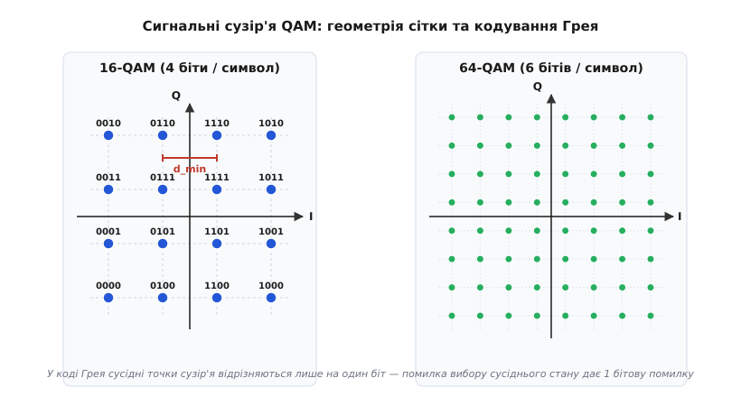
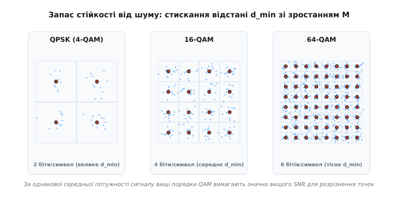
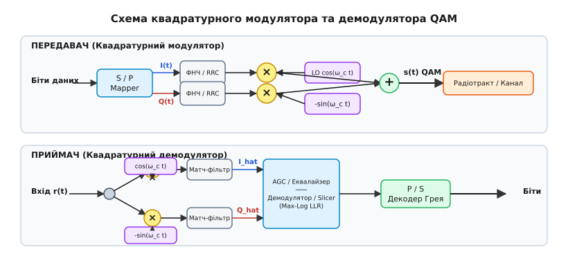
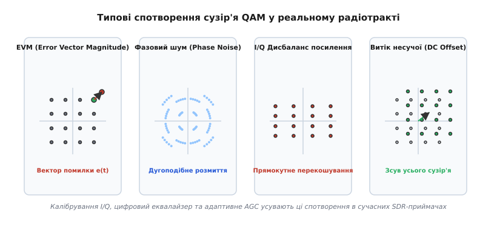

# Квадратурна амплітудна модуляція (QAM)

<preknowlist>
- [Цифрова модуляція: FSK, PSK](root:com-modulation/fsk-psk) — поняття символу, фазового сузір'я, розрізнення I/Q.
- [Комплексна обвідна та I/Q-подання](root:com-modulation/iq-representation) — квадрантний розклад сигналу на синфазну (I) та квадратурну (Q) складові.
- [BER і SNR: крива надійності каналу](root:com-modulation/ber-snr-curve) — шумові хмари, ймовірність бітової помилки та енергія біта.
</preknowlist>

Коли радіоканал чи кабельна лінія мають жорстко обмежену смугу частот, спроба передавати більше бітів за секунду просто за рахунок прискорення перемикання символів впирається в стіну міжсимвольної інтерференції. Просте нарощування кількості станів у фазовій модуляції (PSK) вишиковує всі точки сузір'я в єдине коло, де при переході від QPSK (4 стани) до 16-PSK (16 станів) кутова відстань між сусідніми фазами стискається з 90° до мізерних 22.5°. Достатньо невеликого фазового шуму в гетеродині, щоб прийнятий вектор перестрибнув у сусідній сектор і викликав бітову помилку. Замість того щоб тіснити стани вздовж одного одновимірного кола, квадратурна амплітудна модуляція (**QAM**, від англ. *Quadrature Amplitude Modulation*) задіює другу вісь свободи: вона одночасно міняє і амплітуду, і фазу несучої, рівномірно заповнюючи весь двовимірний простір сигнальної площини сіткою дискретних станів.

### Синтез сигналу: дві ортогональні несучі у кожному символі

Фізична ідея QAM базується на тому факті, що дві синусоїдальні хвилі однакової частоти `ω_c`, які зсунуті одна відносно одної на фазовий кут 90° (тобто `cos(ω_c t)` та `-sin(ω_c t)`), є повністю **ортогональними**. На будь-якому цілому числі періодів або при фільтрації узгодженим фільтром інтеграл їхнього добутку дорівнює тотожному нулю:

```
∫_{0}^{T_s} cos(ω_c t) · sin(ω_c t) dt = (1 / 2) · ∫_{0}^{T_s} sin(2 ω_c t) dt = 0
```

Це математичне співвідношення гарантує, що при демодуляції в приймачі синфазний канал не створює жодних завад для квадратурного каналу і навпаки. Приймач здатний розділити їх назад на два незалежні інформаційні потоки за допомогою двох фазових детекторів, що живляться синусоїдним та косинусним гетеродинами.

У кожен символьний інтервал тривалістю `T_s` передавач обирає два незалежні амплітудні коефіцієнти: `a_i` для синфазного каналу **I** (*In-phase*) та `b_i` для квадратурного каналу **Q** (*Quadrature*). Загальний випромінюваний радіосигнал `s(t)` описується фундаментальним рівнянням квадратурного синтезу:

```
s(t) = a_i · g(t) · cos(ω_c t) - b_i · g(t) · sin(ω_c t)
```

де `g(t)` — огинаюча форми імпульсу (зокрема фільтр із характеристикою коріння з піднятого косинуса, RRC). Використовуючи тригонометричну тотожність `A · cos(x) + B · sin(x) = C · cos(x - φ)`, той самий сигнал `s(t)` виражається через миттєву амплітуду `A_i` та миттєву фазу `φ_i`:

```
A_i = √(a_i² + b_i²)
φ_i = arctan(b_i / a_i)
s(t) = A_i · g(t) · cos(ω_c t + φ_i)
```

Це рівняння робить прозорим подвійну природу QAM: приймач бачить хвилю, у якої від символу до символу стрибкоподібно змінюється як амплітуда `A_i`, так і фаза `φ_i`. Проте замість прямого керування амплітудою та фазою (що вимагало б складних нелінійних обчислень `arctan` та `√` у передавачі), апаратура передавача й приймача працює з лінійними амплітудами `a_i` та `b_i` по двох паралельних квадратурних вісях.

Про те, як ця ідея еволюціонувала від перших досліджень у Bell Labs до сучасних стандартів, розписано в [історичному екскурсі QAM](root:com-modulation/qam/hist-qam-evolution.md).

### Геометрія сузір'я: квадратні, хрестоподібні та зірчасті сітки

Графічне подання всіх можливих станів сигналу на I/Q площині називається **сигнальним сузір'ям** (*constellation diagram*). Кількість точок у сузір'ї позначають літерою `M`, а кількість бітів, які переносить один символ, дорівнює `k = log₂ M`.


*Сигнальні сузір'я QAM. Ліворуч: 16-QAM (сітка 4×4, 4 біти на символ), де кожна точка позначається чотиризначним кодом Грея. Праворуч: 64-QAM (сітка 8×8, 6 бітів на символ). Зі зростанням M точки стають щільнішими, а зазор d_min зменшується.*

Найпоширенішим класом є **квадратні сузір'я** (*Square M-QAM*), у яких кількість точок `M` є парним степенем двійки: `M = 2²ᵏ` (16-QAM, 64-QAM, 256-QAM, 1024-QAM, 4096-QAM). У таких сузір'ях обидві координати `I` та `Q` набувають незалежних значень із дискретного алфавіту `√M` рівнів:

```
a_i, b_i ∈ { ±1, ±3, ±5, ..., ±(√M - 1) }
```

Квадратна геометрія має дві ключові технологічні переваги:
1. **Незалежна демодуляція осей:** розклад двовимірного прийняття рішень на два повністю незалежні одновимірні порівняння по осях `I` та `Q` спрощує апаратні обчислювачі демодулятора.
2. **Проста декартова адресація бітів:** кожні `k` бітів символу рівно навпіл діляться між осями: `k / 2` бітів задають рівень `I`, а `k / 2` бітів — рівень `Q`.

Якщо ж кількість бітів на символ є непарним числом (наприклад, `k = 5` бітів для 32-QAM або `k = 7` бітів для 128-QAM), квадратна сітка недоступна (`√32` не є цілим числом). У таких випадках застосовують **хрестоподібні сузір'я** (*Cross QAM*). 32-QAM будується шляхом вилучення чотирьох крайніх кутових точок із квадратної сітки 6×6 (36 точок minus 4 кути = 32 точки). Відсікання кутів дає вагомий фізичний ефект: крайні кутові точки квадратних сузір'їв мають максимальну відстань від початку координат `A_max² = (a_max² + b_max²)`, що вимагає високої пікової потужності підсилювача. Вилучення кутів зменшує пік-фактор (PAPR) на 0.6–1.0 дБ та робить сузір'я більш округлим і енергоефективним.

Для спеціалізованих каналів із сильними амплітудними спотвореннями (наприклад, у супутникових транспондерних підсилювачах надвисоких частот, які працюють у глибокому нелінійному насиченні) використовують **кругові або зірчасті сузір'я** (*Star QAM*), де точки лежать на кількох концентричних колах із фіксованими радіусами.

### Кодування Грея: захист від поодиноких помилок

Коли через шум приймач плутає прийнятий символ і обирає сусідню точку сузір'я, виникає символьна помилка. Проте системному декодеру важлива не символьна, а **бітова ймовірність помилки (BER)**. Якщо призначити бітові комбінації точкам сузір'я хаотично, помилка в одному символі може призвести до спотворення одразу всіх 4 або 6 бітів.

Щоб мінімізувати кількість бітових помилок, розміщення бітів на I/Q площині виконується строго за **кодом Грея**. Головне правило кодування Грея таке: **будь-які дві сусідні точки сузір'я, які розділені мінімальною відстанню `d_min`, повинні відрізнятися лише в одному бітовому розряді**.

У квадратних QAM кодування Грея будується як двовимірний декартів добуток двох одновимірних 1D кодів Грея для осях `I` та `Q`. Наприклад, для 16-QAM (4 біти `b₀ b₁ b₂ b₃`):
- Перші два біти `b₀ b₁` визначають координату `I` за шкалою: `00` (-3), `01` (-1), `11` (+1), `10` (+3).
- Другі два біти `b₂ b₃` визначають координату `Q` за аналогічною шкалою.

Завдяки цьому, коли шумовий поштовх вибиває вектор `y` за межу прийняття рішень у сусідню комірку, приймач помиляється лише в одному біті з чотирьох. За високого відношення сигнал/шум (SNR) це зменшує підсумкову ймовірність бітової помилки майже в `k` разів:

```
BER ≈ SER / log₂ M
```

### Шумовий запас, евклідова відстань та ціна ущільнення

Чому ми не можумо пакувати мільйони точок у сузір'я QAM і отримувати нескінченну швидкість? Відповідь полягає в обмеженні середовища передачі — аддитивному гаусовому шумі (AWGN).


*Запас стійкості від шуму. За одинакової середньої потужності сигналу зі зростанням M точки сузір'я стають ближчими. Шумові хмари навколо точок 64-QAM починають перекривати сусідні пороги за рівнів шуму, які були цілком безпечними для QPSK.*

Кожен прийнятий символ є сумою переданого вектора `s_i` та випадкового вектора шуму `n = n_I + j·n_Q`. На екрані осцилографа це перетворює ідеальну точку сузір'я на розмиту «хмаринку» розкиду. Приймач приймає правильне рішення доти, доки прийнятий вектор не перетинає **межу прийняття рішень** — лінію, розташовану посередині між сусідніми точками на відстані `d_min / 2`.

За фіксованої середньої потужності переданого сигналу `E_avg` підвищення порядку модуляції `M` змушує стискати мінімальну евклідову відстань `d_min`:

```
d_min = √[ 6 · E_avg / (M - 1) ]
```

Детальний математичний вивід енергетичних співвідношень та точних функцій ймовірності помилок `Q(x)` наведено у [математичній вставці про сузір'я QAM](root:com-modulation/qam/math-qam-constellation.md).

Ця формула описує сувору закономірність: при переході від 16-QAM до 64-QAM відстань `d_min` зменшується в `√(63 / 15) ≈ 2.05` рази (що вимагає додаткових ~6 дБ потужності сигналу). Перехід до 256-QAM вимагає ще близько 6 дБ. Якщо відношення сигнал/шум у каналі падає нижче критичного порогу, шумові хмарки сусідніх точок починають перекриватися, ймовірність помилок стрімко прямує до 100%, і зв'язок розривається.

Саме тому сучасні системи зв'язку задіюють [адаптивну модуляцію та кодування (AMC)](root:com-modulation/adaptive-modulation): коли смартфон перебуває поруч із базовою станцією 5G і SNR > 30 дБ, система вмикає 256-QAM чи 1024-QAM; коли ж абонент відходить у зону слабкого прийому, система гнучко відкочується до 16-QAM або QPSK.

### Структурна схема тракту QAM: від бітів до радіочастоти

Передача й прийом сигналу QAM вимагає чіткої синхронізації цифрових та аналогових вузлів.


*Структурна схема квадратурного тракту QAM. Передавач (згори) розбиває потік бітів на I та Q гілки, фільтрує їх RRC-фільтрами та змішує з двома квадратурними несучими. Приймач (знизу) здійснює зворотне змішування, матч-фільтрацію, авторегулювання посилення (AGC) та демодуляцію.*

#### Передавач (Модулятор)
1. **Послідовно-паралельний перетворювач (S/P) та мапер:** приймає вхідний потік бітів, формує блоки по `k` бітів і за таблицею коду Грея генерує дискретні відліки `a_k` та `b_k`.
2. **Фільтри формування імпульсів (Pulse Shaping):** цифровий фільтр із характеристикою коріння з піднятого косинуса (RRC) згладжує прямокутні кроки амплітуд. Це обмежує спектр сигналу суворо в межах відведеної смуги [Найквіста](root:math-information/bandwidth-capacity), запобігаючи міжсимвольній інтерференції (ISI).
3. **Квадратурний змішувач:** амплітуда `I(t)` перемножується з опорним гетеродином `cos(ω_c t)`, а амплітуда `Q(t)` — зі зсунутим на 90° гетеродином `-sin(ω_c t)`.
4. **Суматор:** обидва аналогові сигнали додаються у вихідний аналоговий сигнал `s(t)`, який підсилюється підсилювачем потужності (PA) і випромінюється в антену.

#### Приймач та синхронізація
Прийом QAM-сигналу вимагає складної цифрової обробки:
1. **Квадратурне понижувальне перетворення:** прийнятий сигнал `r(t)` розгалужується на дві гілки і перемножується з гетеродином `cos(ω_c t)` та `-sin(ω_c t)`.
2. **Узгоджена фільтрація (Matched Filter):** ФНЧ із характеристикою RRC видаляє подвійну частоту несучої `2ω_c` і завершує формування імпульсу Найквіста.
3. **Синхронізація несучої та фази:** петля фазового автопідстроювання (Costas Loop або Decision-Directed PLL) усуває залишковий частотний зсув та фазове обертання гетеродина.
4. **Адаптивна еквалізація:** цифровий адаптивний фільтр (наприклад, алгоритм постійного модуля CMA або LMS) компенсує амплітудно-частотні спотворення та багатопроменеві відлуння каналу.
5. **Автоматичне регулювання посилення (AGC):** нормує амплітуду прийнятого сузір'я до стандартного масштабу, усуваючи згасання в каналі.
6. **Демодулятор (Slicer / LLR Demapper):**
   - У режимі **Hard Decision** слайсер порівнює відліки з амплітудними порогами `0, ±2d, ±4d` і відновлює біти `b_k`.
   - У режимі **Soft Decision** розраховуються м'які логарифми відношення правдоподібностей (LLR) для кожного біта, які передаються на декодер [LDPC](root:com-modulation/ldpc) або [Вітербі](root:com-modulation/viterbi-algorithm).

Алгоритми обчислення Max-Log LLR та повний робочий код симулятора QAM наведено у [практичному проекті реалізації QAM-модему](root:com-modulation/qam/proj-qam-demodulator.md).

### Спотворення реального радіотракту: EVM, нелінійності та дисбаланси

У реальній апаратурі сигнальне сузір'я QAM піддається викривленням через недосконалість аналогових компонентів.


*Чотири класи спотворень сузір'я QAM у реальному радіотракті. a) Вектор помилки EVM. b) Фазовий шум розмиває точки дугами. c) I/Q дисбаланс деформує квадрат у прямокутник чи паралелограм. d) Постійний зсув DC зміщує центр сузір'я.*

1. **Амплітуда вектора помилки (EVM — Error Vector Magnitude):**
   EVM є головним показником якості радіотракту. Він описує середньоквадратичне відхилення прийнятих точок `Z_meas` від ідеальних опорних значень `Z_ideal`:
   ```
   EVM_RMS = √[ (1 / N) · ∑ |Z_meas,k - Z_ideal,k|² ] / Z_max · 100%
   ```
   Що вищий порядок QAM, то суворіші вимоги висуваються до EVM обладнання: якщо для QPSK припустимий EVM до 17.5% (-15.1 дБ), то для 256-QAM він не повинен перевищувати 3.5% (-29.1 дБ), а для 4096-QAM — менше 0.4% (-48 дБ).

2. **Фазовий шум (Phase Noise):**
   Викликаний флуктуаціями фази в генераторах несучої частоти (LO). Він повертає точки сузір'я по колу навколо початку координат, перетворюючи точки на дуги. Оскільки крайні кутові точки 256-QAM мають найбільший радіус, вони зазнають найбільшого абсолютного зміщення від дугового повертання.

3. **I/Q Дисбаланс посилення та квадратури (Gain & Phase Imbalance):**
   Виникає, коли підсилювачі гілок `I` та `Q` мають різний коефіцієнт посилення або коли фазообертач гетеродина дає зсув, відмінний від точних 90°. Дисбаланс посилення деформує квадратне сузір'я у прямокутник, а квадратурний зсув перетворює сітку на паралелограм.

4. **Витік несучої (DC Offset / Carrier Leakage):**
   Постійна напруга на входах змішувачів призводить до того, що центр усього сузір'я зсувається відносно точки `(0,0)`. У спектрі сигналу це проявляється як паразитна пікувата несуча по центру каналу.

5. **Нелінійні спотворення підсилювача (PA Non-linearity):**
   Оскільки QAM має високий пік-фактор (PAPR досягає 4–6 дБ для вищих порядків), кутові точки з найбільшою амплітудою потрапляють у зону нелінійного насичення підсилювача. Точки стискаються до центру (амплітудне стискання, AM/AM) та повертаються за фазою (AM/PM спотворення).

> 🔧 **Навіщо це.** У розробці програмно-визначених радіосистем (SDR) та мобільних трансиверів калібрування I/Q тракту є обов'язковим етапом ініціалізації. Спеціальні тестові преамбули дозволяють цифровій матриці еквалайзера виміряти постійний зсув DC, дисбаланс посилення та квадратурну похибку фази, після чого цифрові компенсатори у зворотному порядку розпрямляють деформовану сітку QAM назад у точний квадрат до того, як відліки потраплять на демодулятор.

### Застосування QAM у сучасних технологіях

Завдяки гнучкості та високій спектральній ефективності модуляція QAM є основою майже всіх високошвидкісних брендів цифрового зв'язку:

- **Кабельні мережі (DOCSIS 3.1 / 4.0, DVB-C):** передача цифрового телебачення та інтернету по коаксіальних мережах на модуляціях 256-QAM, 1024-QAM та 4096-QAM.
- **Бездротові мережі Wi-Fi:** еволюція від 64-QAM у 802.11n до 256-QAM у Wi-Fi 5 (802.11ac), 1024-QAM у Wi-Fi 6 (802.11ax) та 4096-QAM у стандарту Wi-Fi 7 (802.11be), де швидкість фізичного рівня на одного просторового потоку сягає гігабітних значень.
- **Сотовий зв'язок (4G LTE / 5G NR):** використання 64-QAM, 256-QAM та 1024-QAM на піднесникових OFDM для досягнення пікових швидкостей у кілька гігабіт на секунду.
- **Магістральні радіорелейні лінії:** цифрові мікрохвильові прольоти (18–80 ГГц) з адаптивними модуляціями аж до 4096-QAM для з'єднання веж мобільного зв'язку.
- **Когерентна оптика:** передача даних на швидкостях 400G/800G по волоконно-оптичних лініях із модуляцією DP-16QAM та DP-64QAM у двох поляризаціях світлового променя.

Квадратурна амплітудна модуляція залишається головним містком між математичною межею Шеннона та реальним ефіром, дозволяючи пакувати дедалі більше цифрової інформації в кожен герц радіочастотного спектра.
