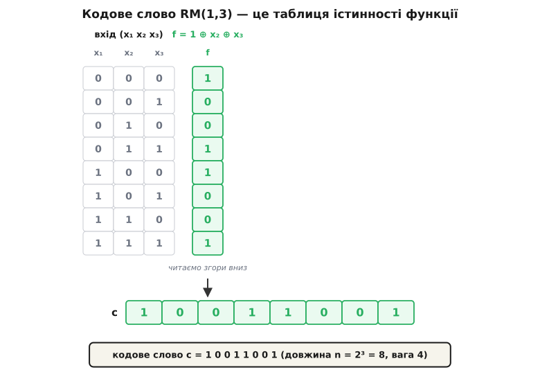
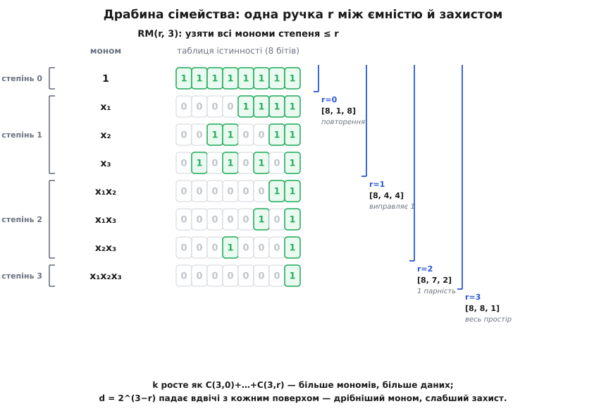
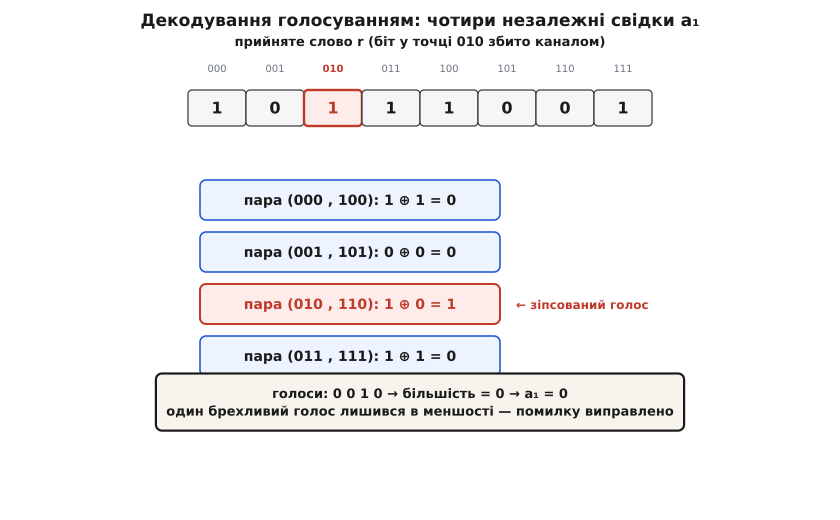

# Коди Ріда–Маллера

<preknowlist>
- [Лінійні блокові коди](topic:com-modulation/generator-and-parity-check-matrices) — блоковий код як лінійний підпростір дозволених слів, утворених додаванням рядків твірної матриці.
- [Відстань Геммінга](topic:com-modulation/hamming-distance) — мінімальна кількість відмінних бітів між дозволеними словами; визначає виправну здатність коду.
- [Булева алгебра](topic:math-logic/boolean-algebra) — додавання за модулем 2 (XOR, ⊕) і логічне множення (AND, ·) над двійковими змінними.
- [Поліном Жегалкіна](topic:math-logic/zhegalkin-polynomial) — вираз булевої функції через суму добутків змінних за модулем 2; степінь найдовшого добутку є алгебричним степенем функції.
- [Комбінації і біноміальний коефіцієнт](topic:math-combinatorics/combinations) — число способів вибрати k елементів із n, позначуване C(n, k); рахує кількість мономів заданого степеня.
</preknowlist>

Більшість блокових кодів будують за схемою дописування перевірочних розрядів до інформаційних бітів. Але коли рівень завад у каналі постійно змінюється, жорсткий компроміс між швидкістю та захистом стає неефективним: за сильного шуму слабкий код руйнується, а на чистих ділянках надлишок марнує смугу пропускання. Потрібне сімейство двійкових кодів однакової довжини, де єдиний параметр плавно перемикає режим від швидкісного до бронебійного, а декодер працює на простій логіці без складних алгебричних обчислень.

Коди Ріда–Маллера розв'язують це завдання завдяки іншому погляду на кодове слово: замість ланцюжка «дані плюс перевірка» слово розглядають як **повну таблицю значень булевої функції**.

## Повна таблиця значень як кодове слово

Візьмемо `m` двійкових змінних `x₁, x₂, …, x_m`. Кожна змінна дорівнює 0 або 1, тому разом вони утворюють `2ᵐ` різних комбінацій — точок двійкового простору. Якщо обчислити значення булевої функції `f(x₁, …, x_m)` у кожній із цих `2ᵐ` точок, вийде послідовність із `2ᵐ` бітів. Цей двійковий вектор довжини `n = 2ᵐ` і оголошують кодовим словом.

Якщо дозволити таблиці абсолютно будь-яких булевих функцій, дозволеними стануть усі можливі вектори довжини `2ᵐ`. У такому коді немає надлишку: будь-яка одинична помилка перетворить вектор на таблицю іншої функції, і спотворення не вдасться навіть виявити.

Захист з'являється тоді, коли множину функцій звужують, залишаючи лише функції обмеженої складності. Мірою складності служить **алгебричний степінь** [полінома Жегалкіна](topic:math-logic/zhegalkin-polynomial) — найвищий степінь добутку змінних у виразі функції через додавання за модулем 2 (⊕) і множення (·). Стала функція має степінь 0. Функція, що містить лише суму окремих змінних виду `1 ⊕ x₁ ⊕ x₃`, має степінь 1 (афінна функція). Щойно з'являється добуток двох змінних `x₁·x₂`, степінь стає рівним 2.

> **Код Ріда–Маллера RM(r, m)** — це множина таблиць значень усіх булевих функцій від `m` змінних, алгебричний степінь яких не перевищує **r**.

Параметри коду визначаються двома числами:
- Число `m` задає довжину блоку `n = 2ᵐ` (кількість точок простору).
- Число `r` слугує регулятором ємності та надійності: що менший степінь `r`, то менше дозволених функцій і то більша відстань між їхніми таблицями.
- Повідомлення складається з коефіцієнтів перед дозволеними мономами (одночленами). Кодування зводиться до обчислення значень функції в усіх точках.
- Кількість інформаційних бітів `k` дорівнює числу мономів степеня від 0 до `r`:

```
k = C(m, 0) + C(m, 1) + C(m, 2) + … + C(m, r)
```

Розглянемо код **RM(1, 3)**. Тут `m = 3` змінні, тому довжина становить `n = 2³ = 8` бітів. Степінь `r = 1` дозволяє лише сталу 1 та самі змінні `x₁, x₂, x₃`. Кількість коефіцієнтів дорівнює `k = C(3, 0) + C(3, 1) = 1 + 3 = 4`. Це код [8, 4]: чотири біти повідомлення `(a₀, a₁, a₂, a₃)` задають функцію `f = a₀ ⊕ a₁x₁ ⊕ a₂x₂ ⊕ a₃x₃`.


*Кодування через таблицю значень функції. Чотири інформаційні біти слугують коефіцієнтами полінома f = 1 ⊕ x₂ ⊕ x₃. Обчислення значень у восьми точках двійкового куба формує вихідне кодове слово 10011001.*

## Твірна матриця та регулювання параметрів

Код Ріда–Маллера є [лінійним блоковим кодом](topic:com-modulation/generator-and-parity-check-matrices): додавання таблиць значень за модулем 2 еквівалентне додаванню кодових слів. Рядки його твірної матриці `G` — це таблиці значень базових мономів.

Для RM(1, 3) матриця містить чотири рядки для мономів `1`, `x₁`, `x₂`, `x₃`:

```
         точка: 000 001 010 011 100 101 110 111
рядок 1      →   1   1   1   1   1   1   1   1
рядок x₁     →   0   0   0   0   1   1   1   1
рядок x₂     →   0   0   1   1   0   0   1   1
рядок x₃     →   0   1   0   1   0   1   0   1
```

Кожен рядок для `x_j` дослівно повторює `j`-й розряд двійкового номера точки. Кодування повідомлення `(a₀, a₁, a₂, a₃) = (1, 0, 1, 1)` полягає в XOR рядків 1, `x₂` та `x₃`, що дає кодовий вектор `10011001`.

Здатність виправляти помилки визначається [мінімальною відстанню Геммінга](topic:com-modulation/hamming-distance) `d`, яка в лінійному коді дорівнює мінімальній вазі (кількості одиниць) ненульового слова. Скільки одиниць має найпростіша ненульова функція степеня `r`? Найменшу вагу дає один моном найвищого степеня `x₁·x₂·…·x_r`. Цей добуток дорівнює 1 лише тоді, коли всі `r` змінних одночасно рівні 1, тоді як інші `m − r` змінних можуть бути будь-якими. Отже, такий моном набуває одиниці рівно у `2^(m−r)` точках.

Параметри коду **RM(r, m)** складають чітку трійку:
- Довжина блоку: `n = 2ᵐ`.
- Розмірність (кількість даних): `k = C(m, 0) + C(m, 1) + … + C(m, r)`.
- Мінімальна відстань: `d = 2^(m−r)`.

Код гарантовано виправляє `t = ⌊(d − 1) / 2⌋ = ⌊(2^(m−r) − 1) / 2⌋` помилок.

Змінюючи параметр `r` за фіксованої довжини `n = 2ᵐ`, отримують повний спектр режимів:
- При `r = 0` виникає [код із повторенням](topic:com-modulation/generator-and-parity-check-matrices) **RM(0, m)** з параметрами `[2ᵐ, 1, 2ᵐ]`: передається один біт із максимально можливим захистом.
- При `r = m − 1` отримуємо код із [перевіркою парності](topic:com-modulation/parity-bit) **RM(m−1, m)** з параметрами `[2ᵐ, 2ᵐ − 1, 2]`: надлишок мінімальний (один біт), захист лише виявляє одну помилку.
- Проміжні `r` дають робочі компроміси. Зокрема, RM(1, 3) дає код `[8, 4, 4]`, що виправляє одну помилку й еквівалентний розширеному [коду Геммінга](topic:com-modulation/hamming-code).


*Драбина сімейства кодів Ріда–Маллера для довжини n = 8. Додавання мономів вищих степенів збільшує обсяг даних k, але зменшує відстань d = 2^(m−r).*

Коди сімейства зі спільним `m` є вкладеними: `RM(r−1, m) ⊂ RM(r, m)`. Будь-яке слово розпадається на половини `(u, u ⊕ v)`, де `u` належить коду меншої довжини тієї ж стелі степеня, а `v` — коду меншого степеня. Цю властивість та строге виведення кодової відстані розкрито в [математичній вставці про рекурсію Плоткіна](topic:com-modulation/reed-muller-code/math-plotkin-recursion.md).

## Декодування голосуванням більшості

Практична сила кодів Ріда–Маллера зосереджена в алгоритмі мажоритарного декодування, запропонованому Ірвінгом Рідом (*Irving S. Reed*). Замість розв'язання нелінійних систем над скінченними полями тут використовують незалежне голосування більшості (*majority logic decoding*).

Кожен коефіцієнт полінома можна визначити додаванням значень функції за модулем 2 у парах сусідніх точок. Для коду RM(1, 3) коефіцієнт `a₁` при змінній `x₁` обчислюється через будь-яку пару точок, що різняться лише першим розрядом:

```
f(x₁, x₂, x₃) ⊕ f(x₁ ⊕ 1, x₂, x₃) = a₁
```

У восьмиточковому кубі існують чотири такі неперетинні пари, і кожна дає незалежну перевірку значення `a₁`.

Якщо передано вектор `c = 10011001`, а через заваду в позиції `010` отримано `r = 10111001`, перевіряємо `a₁` за чотирма парами:
- Пара `(000, 100)`: `1 ⊕ 1 = 0`.
- Пара `(001, 101)`: `0 ⊕ 0 = 0`.
- Пара `(010, 110)`: `1 ⊕ 0 = 1` (голос спотворено помилкою).
- Пара `(011, 111)`: `1 ⊕ 1 = 0`.

Три голоси дають 0 і лише один — 1. Більшість голосів (3 проти 1) повертає правильне значення `a₁ = 0`.


*Відновлення коефіцієнта голосуванням більшості. Чотири неперетинні пари точок утворюють незалежні голоси. Поодинока помилка псує лише один голос із чотирьох, тож більшість 3:1 повертає правильний біт a₁ = 0.*

Так само голосуванням за іншими парами знаходять `a₂ = 1` та `a₃ = 1`. Знайдену лінійну частину віднімають (додають за модулем 2) із прийнятого слова, після чого вільний член `a₀` визначають більшістю серед восьми залишків.

У загальному коді RM(r, m) декодування виконують пошарово від старших степенів до молодших, використовуючи на кожному кроці `2^(m−i)` незалежних голосів. Робочий алгоритм та швидке декодування на базі матриць Адамара розібрано у [вставці про мажоритарний декодер](topic:com-modulation/reed-muller-code/proj-majority-decoder.md).

> 🔧 **Навіщо це.** Мажоритарний декодер будується на базових вентилях XOR та лічильниках одиниць. Усі голоси для кожного коефіцієнта обчислюються паралельно. Це дозволяє створювати надшвидкі апаратні декодери на простих мікросхемах або FPGA без залучення мікропроцесорів.

## Застосування та спадщина

Простота обчислень зробила коди Ріда–Маллера першим вибором для далекого космічного зв'язку. У 1971 році апарат NASA «Марінер-9» застосував код **RM(1, 5)** з параметрами `[32, 6, 16]` для передачі перших знімків Марса. Шість бітів яскравості кожного пікселя кодувалися 32-бітним словом, що давало змогу надійно виправляти до семи помилок на слово при слабкому сигналі 20-ватного передавача. Історію цього відкриття розкрито в [історичній вставці про місію «Марінер-9»](topic:com-modulation/reed-muller-code/hist-mars-mariner.md).

Конструкція Ріда–Маллера стала основою для сучасних [полярних кодів](topic:com-modulation/polar-codes) Арікана. Полярні коди спираються на ту саму рекурсивну матричну структуру, але відбирають рядки відповідно до надійності синтетичних підканалів. Сьогодні полярні коди стандартизовано в мережах 5G для передачі сигналів керування.

Коди Ріда–Маллера поєднали елегантність булевих функцій із граничною простотою апаратної логіки, проклавши шлях від перших фотографій Марса до новітніх стандартів мобільного зв'язку.

