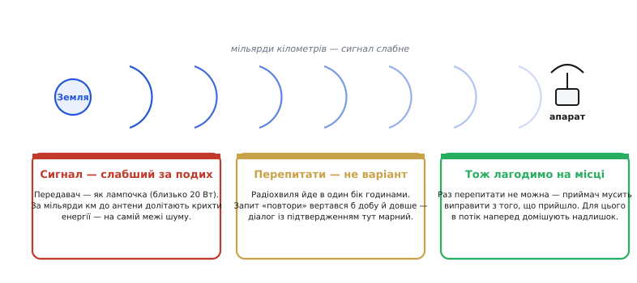
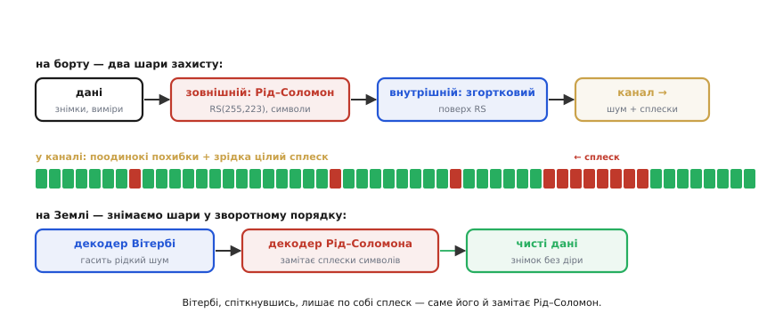
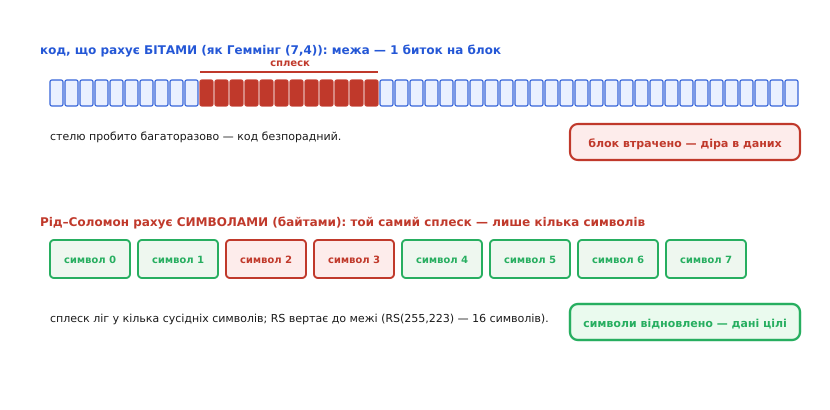
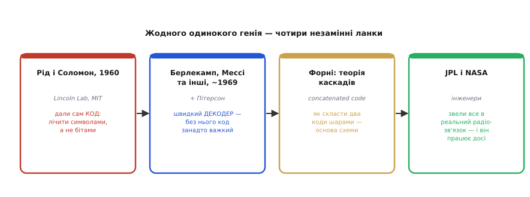

# 📜 Вояджери дзвонять додому: каскадні коди в далекому космосі

[Код Рід–Соломона](topic:com-modulation/reed-solomon) (*Reed–Solomon*) рахує не окремими бітами, як [код Геммінга](topic:com-modulation/hamming-code), а цілими **символами** — групами бітів. І саме через це він спокійно переживає те, від чого побітові коди безпорадні: суцільний **сплеск** помилок, коли псується не один біт, а ціла смуга підряд. На побутових прикладах це видно одразу — подряпаний CD, що все одно грає, заляпаний QR-код, що все одно читається. Але є приклад набагато величніший, де ця сама ідея працює на самій межі можливого: два апарати, що вже сорок років летять геть із Сонячної системи й **досі дзвонять додому**. Їхній сигнал, коли долітає до Землі, слабший за подих, перепитати їх неможливо — і все ж картинки з-за Нептуна доходять без жодної діри. Як? За цим стоїть не один код, а **каскад** двох кодів, де Рід–Соломон грає роль зовнішнього щита. Ця історія показує, **навіщо** взагалі знадобився символьний код і чому саме він став голосом далекого космосу.

Почнімо з питання, яке легко лишити за дужками. Зрозуміти, **що** таке символьний код і чому сплеск його не лякає, — це одне. Та чому інженери взагалі вперлися в потребу такого коду — адже на Землі десятиліттями чудово обходилися [перевіркою на парність](topic:com-modulation/parity-bit) і контрольними сумами? Щоб відчути, навіщо знадобилася **така** стійкість, треба уявити канал зв'язку, гірший за будь-який земний дріт настільки, що поряд із ним губиться сама інтуїція. Саме такий канал — між Землею і апаратом за мільярди кілометрів — і змусив довести корекцію помилок до краю. З нього й почнімо.

*Три суворі факти далекого зв'язку, з яких випливає все інше. Передавач апарата — потужністю з лампочку, і за мільярди кілометрів до антени долітають лічені крихти енергії: у сигналі її менше, ніж у батарейці наручного годинника. Перепитати неможливо — радіохвиля долає шлях годинами в один бік, тож запит «повтори» вертався б добу й довше. Залишається єдиний вихід: приймач мусить сам виправити помилку з того, що прийшло, — а для цього в потік навмисне домішують надлишок, корекційний код.*

## Канал, гірший за будь-який дріт: чому надійності з Землі тут замало

Згадати інші засоби корекції варто заради контрасту. [Парність](topic:com-modulation/parity-bit) уміє лише **помітити** одну помилку, контрольні суми й [CRC](topic:com-modulation/crc) — упевнено помітити навіть сплеск, а [код Геммінга](topic:com-modulation/hamming-code) уже й **виправляє** один перевернутий біт сам. Кожен наступний інструмент сильніший, але всі вони народилися для земних умов: дроту, шини, мікросхеми пам'яті, де помилки рідкісні, а коли щось геть зламалося — пакет завжди можна **перепитати**. Саме на цьому «перепитай» тихо тримається майже весь земний зв'язок: помітив зіпсоване — попросив повторити, і за мілісекунди прийшла чиста копія.

Далекий космос забирає цю опору повністю, і це міняє все. Подивімося на числа. Передавач апарата має потужність порядку двох десятків ватів — як невелика лампочка. Поки сигнал долетить за мільярди кілометрів, він розпорошиться так, що до земної антени дійде енергії менше, ніж зберігає батарейка наручного годинника. Приймач ловить уже не впевнений сигнал, а ледь чутний шепіт на самій межі шуму — і за такого шепоту перевернуті біти не рідкість, а норма потоку. Перший земний рятунок — «канал чистий, помилки нечасті» — тут просто неправда.

Другий рятунок забирає сама відстань. Радіохвиля долає шлях до далекого апарата **годинами** — в один бік. Це означає, що звичний діалог «я отримав пакет із помилкою — будь ласка, надішли ще раз» стає неможливим: запит ішов би туди, відповідь — назад, і весь обмін однією повторною копією розтягнувся б на добу й довше. Перепитати ніколи. А раз не можна ні розраховувати на чистий канал, ні попросити копію, лишається єдиний вихід, і він радикальний: **усе потрібне для лагодження треба надіслати наперед**, разом із самими даними. Приймач мусить виправити помилку з того, що вже в нього на руках, — більше нічого не буде.

> 🔧 **Навіщо це.** Ця логіка ширша за космос, і її варто запам'ятати на майбутнє. Скрізь, де **перепитати дорого або неможливо** — далекий зв'язок, запис на носій, що потім читатимуть роками, мовлення на тисячі приймачів одразу, — стратегія та сама: не сподіватися на повтор, а закласти надлишок наперед, щоб приймач лагодив усе сам. Це називають **прямою корекцією помилок** (*Forward Error Correction*, FEC): «forward» — бо виправляємо рухаючись уперед, не озираючись на джерело. Космос — лише найяскравіший випадок принципу, який ви ще не раз зустрінете.

Отже, потрібен код, що **виправляє сам**, до того ж багато і навіть сплесками. Здавалося б, відповідь уже є — візьмімо [код Геммінга](topic:com-modulation/hamming-code), він же вміє виправляти. Та щойно ми спробуємо покластися на нього, виявиться його межа — і саме об цю межу розіб'ється проста надія обійтися одним кодом.

## Чому одного коду не досить: рідкий шум проти суцільного сплеску

Уявімо, що ми відправили в космос лише код Геммінга. Він справді виправляє помилку сам — але **одну** на блок, така вже [його межа](topic:com-modulation/hamming-code). Поки перешкоди — це рідкі поодинокі біти, цього досить. Та реальний канал так не поводиться: перешкода часто приходить **сплеском** — щільною смугою зіпсованих бітів підряд, від спалаху завад чи збою в самому приймачі. А смуга з десятка перевернутих бітів миттєво пробиває стелю «один біт на блок» — і код Геммінга не просто не виправить, а може ще й «виправити» хибно, погіршивши справу. Один код тут програє не тому, що слабкий, а тому, що **не на те розрахований**.

Тут і визріває думка, що веде прямо до [Рід–Соломона](topic:com-modulation/reed-solomon). А що, як узяти **два** коди — і доручити їм різну роботу? Хай один прибирає дрібний рідкий шум, а другий, інакше влаштований, підчищає за ним саме **сплески**. Не змагання двох кодів, а поділ праці: кожен робить те, що вміє найкраще, і прикриває слабке місце напарника. Така конструкція з двох кодів, вкладених один в одного, зветься **каскадним кодом** (*concatenated code*) — і саме вона полетіла на далеких апаратах.

*Як насправді влаштовано зв'язок далеких апаратів. На борту дані спершу загортають у зовнішній код — Рід–Соломон RS(255,223), що рахує символами, — а тоді поверх нього у внутрішній, згортковий код. У каналі до сигналу домішуються і поодинокі похибки, і зрідка цілі сплески. На Землі шари знімають у зворотному порядку: спершу декодер Вітербі (Viterbi) гасить рідкий шум, а тоді декодер Рід–Соломона замітає сплески, які Вітербі лишає по собі. Поодинці кожен код мав би слабке місце; разом вони дають глибокий захист.*

Розберімо цей каскад шар за шаром, бо в порядку шарів — уся хитрість. Внутрішнім (*inner*) кодом тут служить так званий **згортковий код** (*convolutional code*); його тонка будова — то окрема довга тема, нам зараз важлива лише його поведінка на виході. Декодують його методом, який інженери звуть **алгоритмом Вітербі** (*Viterbi*, на честь Ендрю Вітербі — *Andrew Viterbi*), і цей декодер чудово витирає **поодинокі** похибки, домішані рідким шумом. Та є в нього характерна вада: коли він таки помиляється, то зривається **серією** — лишає по собі не один зіпсований біт, а щільний сплеск підряд. Внутрішній код перетворює рідкий шум каналу на рідкі, але **компактні сплески** на своєму виході.

І ось тут на сцену виходить **зовнішній** (*outer*) код — той самий [Рід–Соломон](topic:com-modulation/reed-solomon). Його головна риса в тім, що він рахує не біти, а **символи**, цілі байти. Сплеск підряд, навіть якщо він перевертає купу бітів, лягає лише в кілька **сусідніх символів** — а скільки в кожному з них покалічено бітів, Рід–Соломону байдуже: зіпсований символ є зіпсований символ, і він його виправляє цілком. Те, що для побітового коду — нездоланна суцільна діра, для символьного — лише кілька зіпсованих клітинок, які він спокійно відновлює до своєї межі. Зовнішній код **точно** підібраний під слабке місце внутрішнього: один лишає сплески — другий саме сплески й замітає.

Власне числа цього коду варто назвати, бо вони класичні й часто трапляються в довідках. Запис **RS(255, 223)** означає: код працює символами по 8 бітів (байтами), бере блок із 223 байтів корисних даних, додає 32 байти надлишку — і виходить кодове слово в 255 байтів. Така надбавка дозволяє виправити до **16 зіпсованих символів** у блоці — і знову ж, байдуже, лежать вони купкою чи врозсип. Шістнадцять байтів — це чималий сплеск; разом із роботою внутрішнього коду цього вистачає, щоб знімок із-за межі планет дійшов чистим.

> 🔧 **Навіщо це.** Ідея каскаду — «склади два різні коди, хай кожен робить своє» — куди ширша за космос, і її корисно тримати в голові. Той самий принцип працює в оптичному диску, у цифровому телебаченні, у штрих-кодах: всередині — код, що тримає дрібний шум, зовні — символьний Рід–Соломон, що переживає подряпину чи пляму. Коли наступного разу подряпаний диск дограє до кінця, згадайте: це не везіння, а робота **зовнішнього** коду, точно так само влаштованого, як на Вояджерах. Глибокий захист майже завжди будують **шарами**, а не одним всесильним кодом.

Отже, видно, **як** каскад розподіляє роботу. Та чому ж саме символьний рахунок дає Рід–Соломону цю особливу стійкість до сплесків — настільки, що той самий ушкоджений потік один код валить, а інший спокійно читає? Придивімося до сплеску впритул, очима обох кодів одразу.

## Один сплеск — двома очима: чому символ переживає те, від чого падає біт

Найкраще видно різницю, коли накласти **той самий** сплеск помилок на два коди й подивитися, що кожен «бачить». Уявімо однакову подряпину — смугу зіпсованих елементів підряд — і прогляньмо її спершу кодом, що рахує бітами, а тоді символьним кодом Рід–Соломона.

*Та сама смуга ушкодження — і два геть різні присуди. Угорі код, що рахує бітами (як Геммінг (7,4)): сплеск перевертає багато бітів поспіль, його стеля «один біт на блок» давно пройдена — блок втрачено, у даних діра. Унизу Рід–Соломон, що рахує символами: та сама смуга лягає лише в кілька сусідніх символів, а їх код виправляє до своєї межі (для RS(255,223) — аж 16 символів на блок), однаково — чи розкидані вони, чи злиплися в подряпину. Ось і вся таємниця живучості CD та QR: сплеск псує багато бітів, але мало символів.*

Для побітового коду (верхня панель рисунка) сплеск — найгірший із можливих ворогів. Такий код рахує саме перевернуті біти й має на них тверду межу: [код Геммінга](topic:com-modulation/hamming-code) виправляє один на блок. А сплеск перевертає їх десяток поспіль — стеля пробита багаторазово, код безпорадний, блок втрачено. Парадокс у тім, що проти **рідких** поодиноких помилок цей код добрий, а проти тісно злитого сплеску — найслабший, бо вся його сила розрахована на те, що помилки розкидані поодинці.

Символьний код (нижня панель) дивиться на ту саму смугу інакше — і в цьому весь фокус. Він рахує не біти, а **символи**: ушкодження вимірюється не «скільки бітів перевернулось», а «скільки символів зачеплено». А компактний сплеск, хай і довгий у бітах, лягає лише в **кілька сусідніх символів**. Скільки бітів покалічено всередині кожного — байдуже: символ або цілий, або ні, а зіпсований символ Рід–Соломон відновлює повністю. Більше того, йому однаково, **де** лежать зіпсовані символи — злиплися вони в подряпину чи розсипані по блоку: код виправить будь-які, доки їх не більше за межу (для RS(255,223) — шістнадцять). Те, що побітовий код бачить як нездоланну діру, символьний бачить як кілька клітинок до заміни.

Тепер прозоро видно й те, чому код Рід–Соломона рятує побутові носії. Подряпина на CD чи пляма на QR-коді — це фізичний **сплеск**: суцільна смуга, де покалічено багато бітів, але мало символів. Символьний код Рід–Соломона саме на сплески й розрахований — тому носій терпить ушкодження й читається далі. Видно не лише **що** відбувається, а й **чому**: символьний рахунок перетворює страшний для бітів сплеск на дрібницю для символів. І та сама властивість, що рятує подряпаний диск у вас на столі, рятує сигнал апарата за межами Нептуна — масштаби різні, механізм один.

Лишилося питання, без якого історія була б неповна: **звідки** взявся цей дивовижний код, що рахує символами, і чому він не полетів у космос одразу, щойно його придумали? Відповідь, як майже завжди в техніці, виявляється колективною — і повчальною.

## Звідки взявся код, що рахує символами: і чому одного винаходу було замало

Народився Рід–Соломон не в космічному відомстві й не задля космосу зовсім. Усе почалося зі скромної на вигляд статті 1960 року — лише **п'ять сторінок** — із сухою назвою «Polynomial Codes over Certain Finite Fields» («Поліноміальні коди над певними скінченними полями»). Написали її двоє математиків, **Ірвінг Рід** (*Irving S. Reed*) і **Густав Соломон** (*Gustave Solomon*), співробітники Лінкольнівської лабораторії Массачусетського технологічного інституту (*MIT Lincoln Laboratory*); початковий звіт вони завершили ще наприкінці 1950-х, а 1960 року дещо доопрацьована версія вийшла друком. Саме звідти й пішла назва коду — просто за прізвищами авторів. У тій статті народилася сама ідея, що стоїть за [кодом Рід–Соломона](topic:com-modulation/reed-solomon): будувати код не на окремих бітах, а на символах із скінченного поля — і так дістати стійкість, недосяжну для побітових схем.

Та ось перша повчальна заминка, і вона важлива. **Сам по собі цей код був майже марний на практиці** — попри всю свою красу. Рід і Соломон довели, що такий код **існує** і скільки помилок він у принципі здатен виправити, але не дали способу **швидко його декодувати**. А код, який неможливо ефективно декодувати, — це гарна теорема, а не інструмент: знати, що помилку **можна** виправити, і вміти зробити це за прийнятний час — речі геть різні. Роками Рід–Соломон лишався радше математичною перлиною, ніж робочою технологією, бо обчислення, потрібні для виправлення, були надто важкі.

*Точна атрибуція, по ланках. Рід і Соломон (1960, Lincoln Lab) дали сам код — ідею лічити символами, а не бітами. Берлекамп, Мессі та інші наприкінці 1960-х придумали швидкий декодер: без нього код був надто важким, щоб рахувати його на практиці. Теорія каскадних кодів (тут згадують і працю Девіда Форні — David Forney) показала, як скласти два коди шарами. І лише інженери JPL та NASA звели код, декодер і каскад у реальний радіозв'язок далеких апаратів. Жодного одинокого генія — чотири ланки, кожна без якої політ не відбувся б.*

Розв'язали цю заминку інші люди — і це **друга** ланка історії, без якої перша лишилася б на папері. Наприкінці 1960-х з'явилися швидкі алгоритми декодування; найвідоміший пов'язують з іменами **Елвіна Берлекампа** (*Elwyn Berlekamp*) і **Джеймса Мессі** (*James Massey*), а раніше до цього доклався й **Деніел Пітерсон** (*Daniel Peterson*). Їхні методи навчили **швидко** знаходити, які саме символи зіпсовані й як їх полагодити, — і аж тоді Рід–Соломон із теоретичної перлини став робочим інструментом, який можна порахувати в розумний час, ба навіть на скромному залізі. Тут варта окремої уваги загальна мораль: винайти **код** і винайти його придатний **декодер** — це два різні відкриття, і часто друге не менш важливе за перше. Без декодера код Рід–Соломона міг би лишитися виноскою в підручнику.

Була й **третя** ланка — ідея самого каскаду, того поділу праці між зовнішнім і внутрішнім кодом. Думку, що з простіших кодів можна шарами скласти набагато потужніший, розвивала теорія **каскадних кодів** (її пов'язують, зокрема, з працею **Девіда Форні** — *David Forney*). Саме ця ідея підказала схему «Рід–Соломон зовні, згортковий код усередині», яка й полетіла в космос. Жоден із цих внесків поодинці не дав би далекого зв'язку: код без декодера не порахувати, декодер без ідеї каскаду не витримав би сплесків, а каскад без обох не з чого було б скласти.

І нарешті — **четверта** ланка, інженерна: звести код, декодер і каскад у реальну, безвідмовну радіосистему, що працює за мільярди кілометрів від ремонту, мусили інженери Лабораторії реактивного руху (*Jet Propulsion Laboratory*, JPL) і команди NASA. Це окрема велика робота — не математика, а сувора інженерія межі можливого: те, що бездоганно на папері, ще треба змусити працювати в залізі, яке летить геть і якого вже ніколи не торкнешся. Тож на питання «хто дав космосу код Рід–Соломона» чесна відповідь — **багато хто**: математики, які придумали код; ті, хто навчив його швидко декодувати; ті, хто винайшов каскад; та інженери, які все це втілили в політ. Класична для техніки картина: за великим інструментом стоїть не одне ім'я, а ланцюжок внесків, де кожна ланка незамінна.

## Сорок років на зв'язку: код, що пережив власну місію

Лишилося звести нитку до самих апаратів — і подивитися, що з усього цього вийшло насправді. А вийшло щось майже неймовірне. Два далекі апарати були запущені 1977 року, щоб роздивитися Юпітер і Сатурн, — і відтоді не змовкають уже близько **пів століття**, передавши спершу великі планети, а тоді й далі, з-за Урана й Нептуна, картини, яких людство не бачило ніколи. Їхній зв'язок усе ще тримається на тому самому каскаді кодів, що ми розібрали: зовнішній Рід–Соломон поверх внутрішнього згорткового. Код пережив усі початкові плани місії й працює досі, коли апарати вже за межею Сонячної системи.

Одну деталь варто подати **чесно**, без зайвого приладнання до красивої розповіді. Точний послужний список того, **коли саме** який код вмикали на цих апаратах, у джерелах подають по-різному: десь пишуть, що Рід–Соломон стояв у схемі від самого запуску 1977-го, десь наголошують, що повноцінно його залучили (а керівні програми оновили дистанційно) вже до зустрічей із далекими планетами в середині 1980-х; згадують і простіший код **Голея** (*Golay*), що його застосовували для стиснених зображень на ранніх етапах. Це **спірна деталь хронології**, яку джерела подають неоднаково; важлива тут не точна дата перемикання, а сам факт: у вирішальні роки далекого польоту голос апаратів захищав **каскад із Рід–Соломоном зовні**, і саме завдяки символьному [кодові Рід–Соломона](topic:com-modulation/reed-solomon) знімки доходили без діри. Розповідь не варта того, щоб задля гладкості видавати спірну деталь за тверду.

Зведімо нитку докупи. Усе почалося з питання: **навіщо** взагалі знадобився код, що рахує символами, а не бітами? Виявилося, що його породив канал, гірший за будь-який земний, — далекий космос, де сигнал слабший за подих, а перепитати неможливо. Один код там не рятує: внутрішній згортковий гасить дрібний шум, але лишає сплески, і саме символьний Рід–Соломон ці сплески замітає, бо суцільна смуга псує багато бітів, та мало символів. Народився цей код як п'ятисторінкова стаття двох математиків, ожив завдяки чужому винаходу швидкого декодера, став потужним завдяки ідеї каскаду — і полетів у космос руками інженерів. Та сама властивість, що рятує подряпаний диск у вас на столі, тримає на зв'язку два апарати за мільярди кілометрів.

І головне, що варто винести з цієї історії. Коли кажуть, що Рід–Соломон «рахує символами», за цією короткою фразою стоїть і канал на межі чутності, і поділ праці двох кодів, і чотири ланки винахідників, і сорок років польоту. Тримаймо цей образ: символьний код — не абстрактна вигадка з підручника, а реальний голос далекого космосу, що довів свою силу там, де помилку нікому виправити, крім самого приймача. Подряпаний CD на столі й апарат за Нептуном користуються однією й тією самою ідеєю — і це, мабуть, найкраще, що можна сказати про вдалий інженерний винахід.
