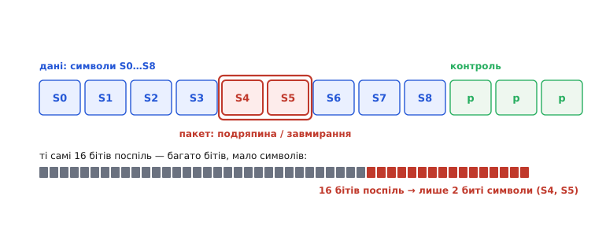

# Рід–Соломон

Класичні коректувальні коди рахують **окремими бітами**: парність дивиться на одиниці, [код Геммінга](topic:com-modulation/hamming-code) виправляє один перевернутий біт, SECDED — теж один на слово. Це чудово, поки помилки **розкидані поодинці**. Але реальний світ часто завдає удару інакше — **пакетом**: подряпина на компакт-диску стирає тисячі сусідніх бітів поспіль, завмирання радіосигналу гасить цілий шматок кадру, бруд закриває куток QR-коду. Бітовий код тут безсилий: сотня помилок поспіль — це далеко за межею будь-якого [Геммінга](topic:com-modulation/hamming-code). Потрібен принципово інший погляд, і його дає **код Рід–Соломона** (*Reed–Solomon*, RS — за прізвищами авторів): рахувати не бітами, а цілими **символами** — групами бітів. Ця одна зміна перетворює пакетну помилку з катастрофи на дрібницю, і саме завдяки їй грає подряпаний диск і читається брудний QR.

### Один символ — група бітів

Суть Рід–Соломона можна вхопити без жодної алгебри, якщо правильно змінити одиницю обліку. RS працює не з бітами, а з **символами** — наприклад, з байтами (групами по 8 бітів). Дані ділять на символи, додають кілька **контрольних символів** (обчислених за хитрою, але цілком конкретною математикою над скінченним полем GF(2ᵐ)), і код виправляє помилки на рівні **цілих символів**. Найважливіше: для RS байдуже, **скільки бітів** усередині символу зіпсовано — один чи всі вісім; зіпсований символ він рахує **за один** і однаково його виправляє.


*Рід–Соломон рахує символами (групами бітів). Подряпина чи завмирання б'ють багато сусідніх бітів поспіль — але це лише кілька символів, хай навіть усі біти всередині них спотворені. Шістнадцять перевернутих бітів поспіль лягають щонайбільше у два-три сусідні байти, тож RS бачить тут лише два-три биті символи й вертає їх. Бітовий код захлинувся б: для нього це шістнадцять окремих помилок, далеко за його межею.*

Ось чому RS такий могутній проти пакетів. Уявімо пакет із 16 спотворених бітів поспіль. Для **бітового** коду це 16 помилок — нездоланна стіна. А для RS, де символ = 8 бітів, цей самий пакет накриває щонайбільше **три** символи (бо 16 бітів, навіть зміщені відносно меж байтів, зачіпають не більш як три сусідні байти) — а виправити три символи RS може легко, додавши всього кілька контрольних. Те, що бітовому коду здавалося катастрофою, для символьного — буденна задача. Грубо кажучи, RS міряє лихо в «зіпсованих байтах», і пакетна завада, хоч би яка щільна всередині, псує лише жменьку байтів.

> 📜 **Поряд — історія:** [Вояджери дзвонять додому](topic:com-modulation/reed-solomon/hist-voyager-codes.md) — як **каскад** із зовнішнього Рід–Соломона й внутрішнього згорткового коду дозволив апаратам «Вояджер» передавати знімки планет із відстані в мільярди кілометрів, де сигнал слабший за шепіт; і чому без цих кодів далекий космос лишався б німим.

### Чому подряпаний CD грає, а брудний QR читається

Найкраще силу RS видно на двох речах, звичних кожному. Компакт-диск зберігає музику як біти на доріжці; подряпина чи пилинка стирає суцільний шматок цих бітів — класичний пакет помилок. Саме RS (із додатковим **перемішуванням** даних по поверхні, щоб одна подряпина розкидалася на багато дрібних пошкоджень) дозволяє програвачеві відновити звук **без жодного чутного дефекту**: код вертає биті символи, і подряпини на слух не чути. Та сама ідея — у QR-коді: він несе чималий запас контрольних символів RS, тож читається, навіть коли частина квадрата забруднена, затерта чи закрита логотипом. Бруд знищує цілий куток — а RS відновлює дані з решти.

В обох випадках працює та сама логіка: **пакетна** помилка, страшна для бітового коду, для символьного — лише кілька битих символів, які RS спокійно виправляє. Ось чому Рід–Соломон оселився всюди, де помилки приходять згустками, а не поодинці: оптичні носії (CD, DVD), штрих- і QR-коди, цифрове телебачення (DVB, ATSC), супутниковий і глибококосмічний зв'язок. Скрізь, де канал чи носій схильний до пакетних збоїв, відповіддю майже завжди стає RS.

### Скільки символів він вертає: помилки й стирання

Тепер про точну межу — скільки саме символів RS здатен полагодити. Запис **RS(n, k)** означає: код бере блок із **k** символів даних і доповнює його до кодового слова в **n** символів; різниця **n − k** — це й є кількість доданих **контрольних** символів. Уся сила коду схована в цій надбавці, і витрачається вона по-різному залежно від того, що саме ми знаємо про пошкодження.

Розрізняють два випадки. **Помилка** (*error* — «хиба») — це коли символ зіпсовано, але невідомо, котрий саме: код мусить сам і **знайти** биту позицію, і **виправити** її значення — дві невідомі на кожен збій. **Стирання** (*erasure* — «витирання») — це коли позиція битого символу **відома** наперед (інший шар коду вже позначив цей шматок як підозрілий, або носій фізично «провалився» в цьому місці): тоді лишається одна невідома — саме значення. Дві невідомі коштують удвічі дорожче за одну, і звідси точна межа:

```
контрольних символів:        n − k
виправляє помилок:           t = (n − k) / 2     (позиція невідома)
виправляє стирань:           n − k = 2t          (позиція відома)
```

Тобто на кожні два контрольні символи RS виправляє **одну** помилку невідомого розташування — але **два** стирання, позиції яких відомі. Знати, **де** сталося лихо, удвічі дешевше, ніж шукати його наосліп.

> 🔧 **Навіщо це.** Звідси випливає глибока думка всієї надійності: **«відомо зіпсоване» набагато краще за «можливо зіпсоване»**. Якщо канал чи сусідній код уміє хоча б **показати пальцем** на ушкоджене місце, не виправляючи його, він уже вдвічі полегшує роботу RS. Саме так і влаштовані каскади на кшталт того, що на «Вояджерах»: внутрішній код не лише чистить дрібні помилки, а й, спіткнувшись, **позначає** свій блок як ненадійний — і зовнішній Рід–Соломон обробляє ці позначені блоки як стирання, виправляючи їх удвічі щедріше. Перетворити «десь тут помилка» на «ось тут стирання» — один із найдієвіших прийомів інженерії надійних даних.

### Перемішування: як розбити пакет на безпечні крихти

Лишається ще одна деталь, без якої магія подряпаного диска була б неповною, — **перемішування** (*interleaving* — «прокладання впереміш»). RS чудово бере кілька битих символів, але один **дуже довгий** пакет може зіпсувати стільки сусідніх символів **одного** кодового слова, що навіть RS не впорається. Рятунок — розкласти символи на носії **не підряд**, а вроздріб: символи одного кодового слова розкидають по поверхні так, щоб фізично сусідні біти належали **різним** словам. Тоді суцільна подряпина, накривши велику смугу, забирає лише **по одному-два** символи з кожного кодового слова — а стільки кожне з них легко відновлює.

Перемішування — це, по суті, перетворення **одного страшного пакета** на **багато дрібних, нестрашних** помилок, розподілених між кодовими словами. Воно нічого не виправляє саме — лише **переставляє** дані так, щоб з ними впорався RS. Цю пару — символьний код плюс перемішування — і застосовують на CD, у штрихкодах, у цифровому мовленні: разом вони роблять пакетну помилку керованою, хоч би якою довгою вона була.

**Приклад (чому символьність б'є пакети).** Порівняймо, як бітовий і символьний коди бачать один і той самий пакет із 12 спотворених бітів поспіль.

```
канал спотворив 12 бітів поспіль (типове завмирання / подряпина)

бітовий код (напр. Геммінг (7,4), виправляє 1 биток на слово):
  12 помилок поспіль = багато битих слів, у кожному >1 помилки
  → код НЕ впорається (його межа — 1 биток на 7)

Рід–Соломон, символ = 8 бітів:
  12 бітів поспіль, навіть зміщені, накривають щонайбільше 3 символи (байти)
  → візьмемо RS(255, 223): n − k = 32 контрольні символи
     виправляє t = 32 / 2 = 16 битих символів
  → 3 биті символи << 16 → дані відновлено повністю ✓
```
Та сама пакетна помилка для бітового коду — нездоланна, а для RS — лише три биті символи, що губляться на тлі його межі у шістнадцять.

Рід–Соломон закриває велику прогалину — **пакетні** помилки, перед якими пасують бітові коди. Разом із простими детекторами на кшталт парності та виправлячами на кшталт Геммінга він складає повну палітру: від одного біта парності до символьного RS, від простого виявлення до повноцінного виправлення пакетів. Інженерне мистецтво — **вибрати** з цієї палітри під конкретну задачу: коли досить дешевого детектора, а коли потрібне дороге виправлення; цьому [вибору надійного кодування](root:embedded/data-reliability) присвячена окрема розмова.

### Звідки взялася назва й сам код

Код назвали за двома його авторами — математиками **Ірвінгом Рідом** (*Irving S. Reed*) і **Густавом Соломоном** (*Gustave Solomon*), співробітниками Лінкольнівської лабораторії Массачусетського технологічного інституту. Звіт вони завершили наприкінці 1950-х, а 1960 року доопрацьована версія вийшла друком — стаття «Polynomial Codes over Certain Finite Fields» («Поліноміальні коди над певними скінченними полями») у журналі SIAM. Саме там народилася ідея, що стоїть за кодом: будувати захист не на окремих бітах, а на символах зі скінченного поля. Та сам собою код був майже непридатний на практиці, доки наприкінці 1960-х не з'явився **швидкий декодер** (його пов'язують насамперед з іменами Елвіна Берлекампа та Джеймса Мессі) — і аж тоді Рід–Соломон із гарної теореми став робочим інструментом. Повну історію — від п'ятисторінкової статті до голосу далекого космосу — розгортає вставка [Вояджери дзвонять додому](topic:com-modulation/reed-solomon/hist-voyager-codes.md).
