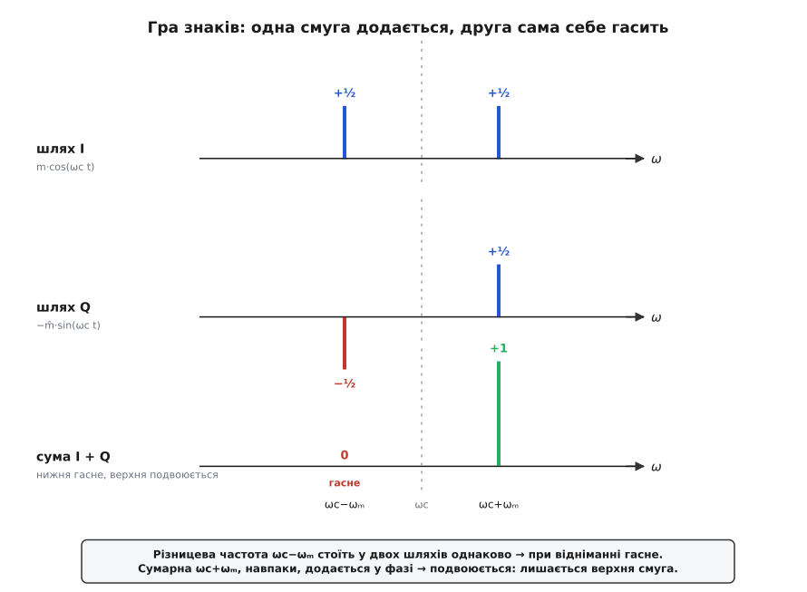
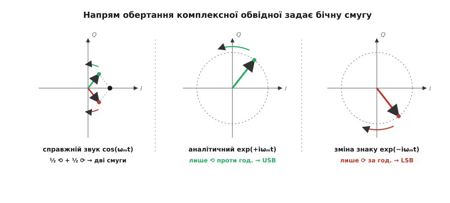
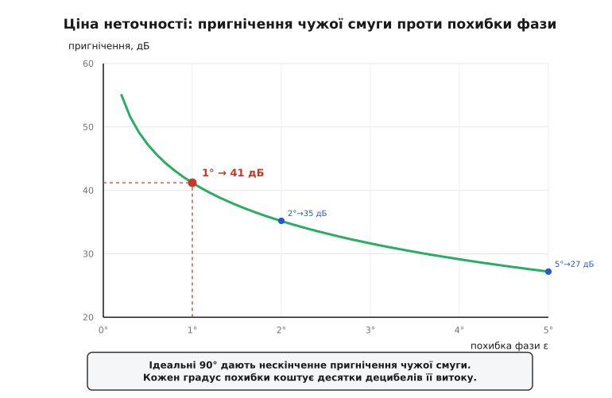

# 🧮 Гра знаків: чому фазовий метод лишає рівно одну смугу

Фазовий (Гартлі) генератор SSB не відрізає зайву бічну смугу фільтром — він **гасить її додаванням**. Щоб побачити, чому одна смуга при цьому подвоюється, а друга зникає без сліду, вистачить елементарної тригонометрії: два добутки, розкладені в суми косинусів, збігаються в одній своїй частині й точно віднімаються в іншій. Уся хитрість — у знаках.

## Два шляхи й одна формула

Візьмімо найпростіше повідомлення — чистий тон:

```
m(t) = cos(ωₘt)
```

Модулятор веде його двома шляхами. Перший — прямий: помножити на несучу. Другий — зсунути фазу звуку на −90° (це робота [перетворення Гільберта](root:com-modulation/analytic-signal)) і помножити на несучу, теж зсунуту на −90°. А зсув косинуса на −90° дає синус: cos(x − 90°) = sin(x). Тому обидва шляхи виходять такі:

```
шлях I:   m(t)·cos(ωc t)  =  cos(ωₘt)·cos(ωc t)
шлях Q:   m̂(t)·sin(ωc t)  =  sin(ωₘt)·sin(ωc t)
```

де m̂(t) = sin(ωₘt) — Гільбертів образ звуку. Модулятор складає ці два шляхи, але з вибором знака між ними:

```
s(t) = I(t) ∓ Q(t) = cos(ωₘt)·cos(ωc t)  ∓  sin(ωₘt)·sin(ωc t)
```

Саме цей знак ∓ і вирішить усе. Але спершу розкладімо кожен добуток.

## Розкласти добуток у суму

Добуток двох косинусів — і так само двох синусів — це завжди сума двох косинусів: різницевої й сумарної частоти. Формули додавання дають:

```
cos(ωₘt)·cos(ωc t) = ½·cos((ωc−ωₘ)t) + ½·cos((ωc+ωₘ)t)
sin(ωₘt)·sin(ωc t) = ½·cos((ωc−ωₘ)t) − ½·cos((ωc+ωₘ)t)
```

Ось воно, ядро всього. Придивімося до знаків. **Різницева частота** (ωc−ωₘ) — нижня бічна смуга — стоїть у **обох** рядках з тим самим плюсом. А **сумарна** (ωc+ωₘ) — верхня смуга — у першому рядку з плюсом, у другому ж із **мінусом**. Один і той самий доданок в одному місці однаковий, в іншому — протилежний. Це і є важіль, яким перемикають смугу.

## Одна смуга гине

Складімо два шляхи — спершу з мінусом:

```
s(t) = I − Q
     = [½cos((ωc−ωₘ)t) + ½cos((ωc+ωₘ)t)] − [½cos((ωc−ωₘ)t) − ½cos((ωc+ωₘ)t)]
     = ½cos((ωc−ωₘ)t) − ½cos((ωc−ωₘ)t)  +  ½cos((ωc+ωₘ)t) + ½cos((ωc+ωₘ)t)
     =              0                     +          cos((ωc+ωₘ)t)
     = cos((ωc+ωₘ)t)
```

Нижня смуга самознищилася: два її однакові доданки при відніманні дали нуль. Верхня, навпаки, подвоїлася — два її доданки з протилежними знаками при відніманні склалися. Лишилася **тільки верхня бічна смуга** (USB): одна чиста лінія на частоті ωc+ωₘ, без несучої й без двійника.

Тепер той самий вираз, але зі знаком плюс:

```
s(t) = I + Q
     = ½cos((ωc−ωₘ)t) + ½cos((ωc+ωₘ)t) + ½cos((ωc−ωₘ)t) − ½cos((ωc+ωₘ)t)  [підстановка I та Q]
     = [½cos((ωc−ωₘ)t) + ½cos((ωc−ωₘ)t)] + [½cos((ωc+ωₘ)t) − ½cos((ωc+ωₘ)t)]  [перегрупування доданків]
     = cos((ωc−ωₘ)t)                                                           [скорочення протифазних]
```

Дзеркально: тепер гине верхня, а лишається **нижня** (LSB). Один-єдиний знак між двома шляхами перекидає генератор із верхньої смуги на нижню — без жодного фільтра, без перебудови кіл.


*Різницева частота ωc−ωₘ стоїть у двох шляхів однаково — при відніманні вона гасне. Сумарна ωc+ωₘ стоїть протифазно — при відніманні складається й подвоюється. Лишається сама верхня смуга.*

## Чому саме так: комплексний погляд

Тригонометрія показала, ЩО стається, та глибша причина видна лише в комплексній формі. Дійсний косинус — це насправді дві частоти, додатна й від'ємна:

```
cos(ωₘt) = ½·e^(+iωₘt) + ½·e^(−iωₘt)
```

Ось звідки взагалі береться двійник: реальний звук уже містить власне «дзеркало» на −ωₘ, і після множення на несучу воно й дає другу смугу. Гільбертів зсув потрібен рівно для того, щоб це дзеркало прибрати. Складімо звук із його Гільбертовим образом, помноженим на i:

```
m(t) + i·m̂(t) = cos(ωₘt) + i·sin(ωₘt) = e^(+iωₘt)
```

За формулою Ейлера лишилася **одна** частота, +ωₘ; від'ємна зникла — доданки на −ωₘ у cos і в i·sin точно погасили один одного. Це [аналітичний сигнал](root:com-modulation/analytic-signal): сигнал із однобічним спектром. Перенесімо його вгору, помноживши на комплексну несучу e^(+iωc t):

```
e^(+iωₘt) · e^(+iωc t) = e^(+i(ωc+ωₘ)t)
```

Одна частота була — одна й лишилась, тільки піднята до ωc+ωₘ. Візьмемо дійсну частину — і маємо cos((ωc+ωₘ)t), ту саму верхню смугу. Уся фазова схема стисло — це:

```
s_USB(t) = Re{ [m(t) + i·m̂(t)] · e^(+iωc t) }
         = m(t)·cos(ωc t) − m̂(t)·sin(ωc t)
```

Розкрийте дужки за Ейлером — і дістанете рівно ту формулу з мінусом, з якої ми почали. Фазовий метод не «гасить» смугу постфактум; він від початку будує сигнал, у якого зайвої смуги просто нема, бо нема від'ємної частоти, з якої вона б виросла. Заміна e^(+iωc t) на спряжену e^(−iωc t) (тобто плюс замість мінуса) дає нижню смугу.

## Геометрія на IQ-площині

Ту саму думку можна побачити очима. Пара (I, Q) = (m, m̂) — це комплексна обвідна, точка на [IQ-площині](root:com-modulation/iq-representation). Для нашого тону вона дорівнює e^(+iωₘt) — одиничний вектор, що **рівномірно обертається** проти годинникової стрілки з частотою ωₘ.


*Справжній звук cos(ωₘt) — це дві протилежні обертанки по пів-амплітуди, і разом вони дають дві смуги. Гільбертова гілка гасить одну з обертанок: лишається однобічне обертання, а отже, одна смуга. Напрям обертання й задає, верхня вона чи нижня.*

Тут і схована вся суть. Напрям обертання — це знак частоти:

- **Проти годинникової** (додатна частота) → після переносу вгору дає верхню смугу.
- **За годинниковою** (від'ємна частота) → дає нижню смугу.

Дійсний звук без Гільберта — це вектор, замкнений на осі I: він лише хитається туди-сюди по прямій. А коливання вздовж прямої — це сума двох обертань у протилежні боки, по половині кожне (звідси й ½ у розкладі косинуса). Дві протилежні обертанки → дві смуги. Гільбертів зсув доточує рівно ту складову вздовж осі Q, якої бракує, щоб хитання по прямій обернути на **однобічний** оберт. Один напрям обертання — одна смуга. Обернути Гільбертову гілку в інший бік (змінити знак) — і смуга переходить із верхньої на нижню.

## Перевіримо числом

Скасування — не наближене, а точне: воно тримається для будь-якої миті t. Візьмімо навмання ωₘt = 40° і ωc t = 200°:

```
I = cos40°·cos200° = 0.76604 · (−0.93969) = −0.71985
Q = sin40°·sin200° = 0.64279 · (−0.34202) = −0.21985

s_USB = I − Q = −0.71985 − (−0.21985) = −0.50000
   звірка:  cos((ωc+ωₘ)t) = cos240° = −0.50000   ✓

s_LSB = I + Q = −0.71985 + (−0.21985) = −0.93969
   звірка:  cos((ωc−ωₘ)t) = cos160° = −0.93969   ✓
```

Відняли два шляхи — дістали чисту верхню смугу; склали — чисту нижню. Жодного залишку іншої смуги: числа сходяться до останнього знака.

## Скільки коштує неточність 90°

Скасування точне — але лише поки зсув **рівно** 90°, а обидва шляхи однакові за амплітудою. Звідки ця вимога й чого варта похибка, видно з тих самих фазорів. У небажану смугу дві гілки дають два внески, у ідеалі рівні й протифазні (умовно +1 і −1) — і гасять один одного вщент. Похибка фази ε (замість 90° вийшло 90° + ε) повертає другий внесок на кут ε, і замість нуля лишається різниця |1 − e^(iε)|. А в бажану смугу ті самі внески йдуть синфазно (+1 і +1), тож там стоїть сума |1 + e^(iε)|. Відношення однієї до другої й міряє, наскільки чисто пригнічено чужу смугу:

```
|1 − e^(iε)| = 2·sin(ε/2)
|1 + e^(iε)| = 2·cos(ε/2)
──────────────────────────────
залишок / сигнал = tan(ε/2)
```

А в децибелах пригнічення чужої смуги:

```
S(ε) = −20·log₁₀( tan(ε/2) )
```

Підставмо реальні числа:

```
ε = 1°   →  tan(0.5°) = 0.008727  →  S = 41.2 дБ
ε = 2°   →  tan(1.0°) = 0.017455  →  S = 35.2 дБ
ε = 5°   →  tan(2.5°) = 0.043661  →  S = 27.2 дБ
```


*При нульовій похибці пригнічення нескінченне; далі воно падає різко. Один градус лишає чужу смугу на 41 дБ нижче, п'ять градусів — уже лише на 27 дБ.*

Один-єдиний градус похибки лишає чужу смугу на 41 дБ нижче — це добра, та не ідеальна ізоляція. Розбаланс амплітуд б'є так само: 1 % різниці підсилення між шляхами дає близько 46 дБ, 2 % — уже 40 дБ. Обидві похибки складаються, тож на практиці фазовий метод дає десь 35–45 дБ пригнічення, і кожен зайвий децибел коштує щораз точнішого фазозсувного кола.

> 🔧 **Навіщо це.** Саме крута ціна похибки й пояснює, чому фазовий метод такий вимогливий до широкосмугового −90°-кола. Один тон погасити легко — вистачить одного конденсатора на потрібній частоті. Але звук — це смуга від 300 Гц до 3 кГц, і рівно 90° треба тримати **на кожній** її частоті одразу, у діапазоні в десять разів по частоті. Таке коло — це вже кілька прецизійних всепропускних ланок; варто зсуву «попливти» на пару градусів десь скраю смуги — і там чужа смуга полізе назад на рівні −30 дБ. Тому фільтровий метод, попри свій дорогий кварц, довго вигравав: тримати одну круту стінку легше, ніж рівні 90° по всій звуковій смузі.

## Від тону до всього голосу

Один тон — то лише зразок. Реальний звук — сума багатьох тонів, і Гільбертів зсув діє на кожен окремо:

```
m(t)  = Σ Aₖ·cos(ωₖt + φₖ)
m̂(t) = Σ Aₖ·sin(ωₖt + φₖ)      (кожна складова зсунута на −90°)
```

Оскільки і множення на несучу, і додавання — операції лінійні, увесь доказ проходить для кожного доданка нарізно, а результати просто складаються:

```
s_USB(t) = Σ Aₖ·cos((ωc+ωₖ)t + φₖ)
```

Кожен тон голосу став своєю верхньою смугою — і жодного дзеркала. Увесь спектр звуку просто піднявся вгору, до несучої, зі збереженими амплітудами й фазами. Але звідси ж видно й ціну: щоб дзеркало зникло для **всіх** ωₖ, Гільбертів зсув мусить давати точні −90° на кожній частоті смуги. Уся складність фазового методу зведена в цю одну вимогу — не гострий фільтр, а бездоганні 90° від краю до краю звукової смуги.

## Третій шлях: математика методу Уівера

Широкосмуговий фазообертач звуку на −90° складний у реалізації. Дональд Уівер (англ. *Donald K. Weaver*) у 1956 році запропонував математичний трюк, який обходить потребу в Гільбертовому зсуві звуку. Метод використовує **два етапи квадратурної модуляції** та звичайні низькочастотні фільтри (ФНЧ).

Обирають піднесучу звукову частоту ωᵥ точно по центру звукового діапазону:

```
fᵥ = ½·(f_min + f_max) = ½·(300 + 3000) Гц = 1650 Гц
```

На першому етапі тон звуку m(t) = cos(ωₘt) перемножують із квадратурною піднесучою:

```
I₁(t) = cos(ωₘt)·cos(ωᵥt) = ½·cos((ωₘ−ωᵥ)t) + ½·cos((ωₘ+ωᵥ)t)  [розклад добутку косинусів]
Q₁(t) = cos(ωₘt)·sin(ωᵥt) = −½·sin((ωₘ−ωᵥ)t) + ½·sin((ωₘ+ωᵥ)t) [розклад добутку косинуса й синуса]
```

Обидва сигнали пропускають крізь ідентичні ФНЧ з частотою зрізу f_cut = ½·(f_max − f_min) = 1350 Гц. Фільтри відрізають високі сумарні частоти (ωₘ+ωᵥ), залишаючи лише відфільтровані складові:

```
I₂(t) = ½·cos((ωₘ−ωᵥ)t)
Q₂(t) = −½·sin((ωₘ−ωᵥ)t)
```

Зверніть увагу: Q₂(t) за своєю структурою вже є Гільбертовим образом для I₂(t), але отриманим **без широкосмугового фазообертача**, а виключно через перемноження на одну точну частоту ωᵥ та звичайний ФНЧ!

На другому етапі квадратурні сигнали перемножуються на радіочастотну несучу ω₀:

```
I₂(t)·cos(ω₀t) = ¼·cos((ω₀ + ωₘ − ωᵥ)t) + ¼·cos((ω₀ − ωₘ + ωᵥ)t)  [розклад добутку косинусів]
Q₂(t)·sin(ω₀t) = −¼·cos((ω₀ + ωₘ − ωᵥ)t) + ¼·cos((ω₀ − ωₘ + ωᵥ)t) [розклад добутку синусів]
```

При відніманні двох каналів складова (ω₀ − ωₘ + ωᵥ) взаємно знищується:

```
s_Weaver(t) = I₂·cos(ω₀t) − Q₂·sin(ω₀t)
            = ½·cos((ω₀ − ωᵥ + ωₘ)t)                              [віднімання каналів і скорочення]
```

Отриманий сигнал є чистою односмуговою модуляцією на центральній радіочастоті (ω₀ − ωᵥ). Метод Уівера показує, що геометричне розщеплення частот можна виконати не лише через зміщення фази вихідного звуку, а й через складання двох квадратурних переносів із проміжною фільтрацією ФНЧ.

## Вплив амплітудного розбалансу каналів

Окрім фазового відхилення ε, у реальних квадратурних схемах виникає нерівність коефіцієнтів підсилення в каналах I та Q. Якщо підсилення каналу I дорівнює 1, а каналу Q дорівнює (1 + δ), де δ — відносний розбаланс амплітуд, вихідний сигнал USB набуває вигляду:

```
s_real(t) = cos(ωₘt)·cos(ωc t) − (1+δ)·sin(ωₘt)·sin(ωc t)        [розбаланс підсилення Q-каналу]
          = cos((ωc+ωₘ)t) − ½·δ·cos((ωc−ωₘ)t) + ½·δ·cos((ωc+ωₘ)t) [розклад та утворення дзеркала]
```

Виникає небажана нижня бічна смуга (дзеркальний канал) з амплітудою ½·δ. Відношення пригнічення дзеркальної смуги через амплітудну нерівність становить:

```
S_amp(δ) = −20·log₁₀( ½·δ )
```

Наприклад, розбаланс підсилення у 1% (δ = 0.01) обмежує пригнічення чужої смуги рівнем 46 дБ, а розбаланс у 2% (δ = 0.02) знижує пригнічення до 40 дБ. Якщо одночасно присутні і фазова похибка ε, і амплітудний розбаланс δ, результуюче пригнічення виражається сумарним векторним витоком:

```
S_total(ε, δ) = −10·log₁₀( ¼·(δ² + ε²) )                           [малі кути ε в радіанах]
```

Це рівняння чітко показує інженерний компроміс: для забезпечення пригнічення дзеркальної смуги краще ніж 40 дБ необхідно одночасно утримувати фазовий зсув у межах ±1° та амплітудну симетрію каналів у межах ±1%.


