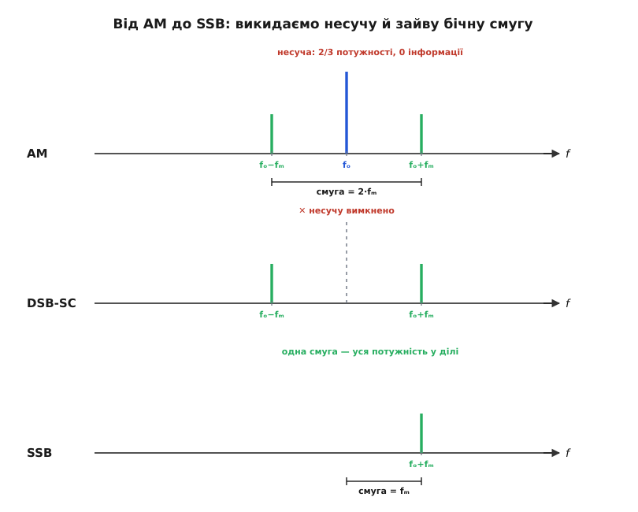
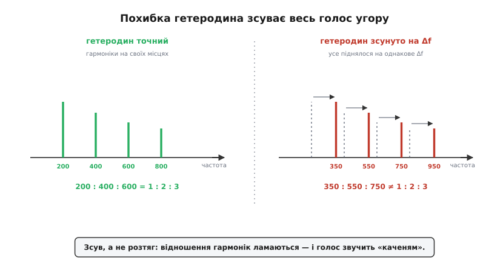
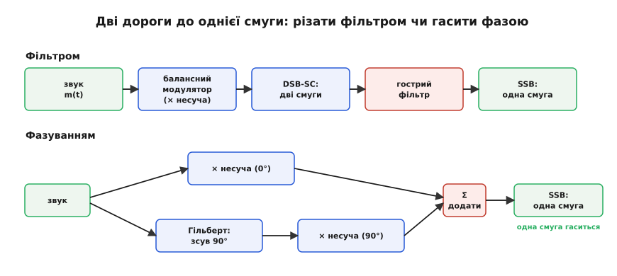

# Односмугова модуляція (SSB)

<preknowlist>
- [AM і FM](topic:com-modulation/am-fm) — як амплітудна модуляція накладає звук на амплітуду несучої; що її спектр містить несучу та дві бічні смуги.
- [Двосмугова модуляція без несучої (DSB-SC)](topic:com-modulation/dsb-sc) — як балансний модулятор пригнічує частоту несучої та залишає дві дзеркальні бічні смуги.
- [Аналітичний сигнал і перетворення Гільберта](topic:com-modulation/analytic-signal) — як утворення комплексного сигналу прибирає від'ємну частину частотного спектра.
- [Представлення сигналів на IQ-площині](topic:com-modulation/iq-representation) — як квадратурні компоненти I та Q формують вектор комплексної обвідної.
</preknowlist>

Стандартний радіомовний AM-передавач випромінювальною потужністю 10 кВт витрачає 6.67 кВт на неперервне генерування чистого тону несучої частоти, який не змінюється в такт із голосом і не містить жодного біта інформації. З решти 3.33 кВт потужності 1.67 кВт іде на верхню бічну смугу, а 1.67 кВт — на нижню бічну смугу, яка повністю дублює той самий звуковий сигнал. Передача мовного каналу з шириною 3 кГц вимагає 6 кГц смуги радіоефіру, причому 5/6 усієї випроміненої енергії (8.33 кВт) є безпосередніми втратами на нагрівання ефіру та дзеркальне дублювання.

Односмугова модуляція (англ. *single-sideband*, SSB) усуває це марнування, вилучаючи з переданого спектра як мертву несучу частоту, так і одну з двох однакових бічних смуг. У результаті весь випромінюваний потік енергії концентрується в єдиній корисній бічній смузі, а необхідна ширина радіоканалу скорочується вдвічі. Завдяки цьому радіопередавач передає звукову інформацію з максимальним коефіцієнтом корисної дії ефіру.

## Спектральне марнування та геометрія зрізу

При класичній амплітудній модуляції часовий сигнал утворюється множенням суми сталого зсуву `A` та інформаційного повідомлення `m(t)` на високочастотну несучу `cos(ωc t)`:

```
s_AM(t) = [A + m(t)]·cos(ωc t) = A·cos(ωc t) + m(t)·cos(ωc t)
```

Перший доданок `A·cos(ωc t)` створює потужний пик на центральній частоті `ωc`. Цей синусоїдний тон необхідний лише для того, щоб простий амплітудний детектор на основі одного напівпровідникового діода та RC-фільтра міг виділяти огинаючу коливань. Інформаційне навантаження зосереджене в другому доданку `m(t)·cos(ωc t)`. Якщо розкласти гармонічний тон мови `m(t) = cos(ωₘt)` за формулами тригонометрії, цей доданок перетворюється на суму двох частотних ліній:

```
cos(ωₘt)·cos(ωc t) = ½·cos((ωc − ωₘ)t) + ½·cos((ωc + ωₘ)t)
```

Частота `ωc + ωₘ` формує **верхню бічну смугу** (англ. *Upper Sideband*, USB), а частота `ωc − ωₘ` — **нижню бічну смугу** (англ. *Lower Sideband*, LSB). Обидві смуги розташовані симетрично відносно несучої `ωc`. Вони містять абсолютно однакову інформацію про амплітуду й фазу вихідного звукового сигналу: верхня смуга є прямим переносом звукового спектра вгору, а нижня — його інвертованим дзеркальним відображенням.


*AM несе високу несучу (2/3 потужності, нуль інформації) і дві дзеркальні бічні смуги. Балансний модулятор гасить несучу — лишається DSB-SC. Відрізана одна смуга — і маємо SSB: половина ширини, уся потужність у ділі.*

Процес формування SSB складається з двох послідовних етапів. На першому етапі сигнал `m(t)` подається на балансний модулятор, який виконує чисте перемноження сигналу на несучу без сталого додавання `A`. Несуча частота на виході пригнічується, утворюючи [двосмуговий сигнал із придушеною несучою (DSB-SC)](topic:com-modulation/dsb-sc). На другому етапі одна з двох бічних смуг вилучається за допомогою смугового фільтра або фазокомпенсаційної схеми.

Користь від видалення двох зайвих елементів виражається в арифметиці ширини смуги та випромінюваної потужності:

```
Смуга AM  : B_AM  = 2·fₘ_max
Смуга SSB : B_SSB = fₘ_max − fₘ_min ≈ fₘ_max
```

Для стандартного голосового каналу з діапазоном частот від `f_min = 300 Гц` до `f_max = 3000 Гц` ширина смуги AM-сигналу становить `2 × 3000 Гц = 6000 Гц`. Для SSB-сигналу ширина смуги дорівнює `3000 − 300 = 2700 Гц ≈ 3 кГц`. У радіочастотному інтервалі шириною 1 МГц може одночасно розміститися 333 SSB-розмови проти 166 AM-розмов. При цьому передавач не витрачає підсилювальну потужність на генерування несучої: усі 100% підсиленої високочастотної енергії сидять у єдиній смузі, яка передає звук.

## Синхронне відновлення несучої та ефект «каченяти Дональда»

Видалення несучої позбавляє приймач природного опорного сигналу. Ззвичайний діодний детектор огинаючої реагує на модуль амплітудної обвідної сигналу. Для SSB-сигналу верхньої смуги з мовним тоном `cos(ωₘt)` випромінена хвиля має вигляд `s(t) = cos((ωc + ωₘ)t)`. Модуль цього коливання є константою `|s(t)| = 1`. Простий детектор бачить постійний рівень без жодних звукових коливань, а при передачі кількох тонів видає суміш нелінійних перехресних спотворень.

Щоб дістати вихідне повідомлення `m(t)`, несучу частоту необхідно відновити безпосередньо в приймачі. Для цього прийнятий сигнал подається на синхронний демодулятор (змішувач), де він перемножується на коливання внутрішнього опорного генератора — [гетеродина](topic:hw-analog/local-oscillator) (англ. *Beat Frequency Oscillator*, BFO):

```
s_demod(t) = cos((ωc + ωₘ)t) · cos(ωc t)
           = ½·cos(ωₘt) + ½·cos((2ωc + ωₘ)t)
```

Після проходження крізь ФНЧ зсунутий високочастотний доданок `(2ωc + ωₘ)` відфільтровується, і на виході залишається точна копія вихідного звукового тону `½·cos(ωₘt)`.

Головна технічна складність SSB-детектування полягає у вимозі до абсолютної точності частоти гетеродина. Якщо частота приймального гетеродина відхиляється від початкової несучої передавача на величину `Δf = Δω / (2π)`, перемноження дає:

```
s_demod(t) = cos((ωc + ωₘ)t) · cos((ωc + Δω)t)
           = ½·cos((ωₘ − Δω)t) + ½·cos((2ωc + ωₘ + Δω)t)
```

Після фільтрації ФНЧ відновлена звукова частота дорівнює не `ωₘ`, а `ωₘ − Δω`. Для багатонального мовного сигналу, який складається з основного тону `f₀` та його гармонік `2f₀, 3f₀, 4f₀`, кожна складова спектра зсувається на одну й ту саму **абсолютну** величину `Δf`:

```
Вхідний спектр голосу : f₀,  2·f₀,  3·f₀  (співвідношення 1 : 2 : 3)
Вихідний спектр SSB   : f₀+Δf, 2·f₀+Δf, 3·f₀+Δf (співвідношення зламано)
```

При частотній модуляції або зсуві доплера частоти множаться на коефіцієнт, зберігаючи музичні інтервали. При розбудові гетеродина SSB відбувається додавання константи `Δf`, що повністю руйнує гармонійне співвідношення між нотами.


*Точний гетеродин повертає гармоніки голосу на свої місця — співвідношення частот збережене. Гетеродин зі зсувом Δf піднімає геть усі частоти на однакове Δf: інтервали між гармоніками зберігаються, але їхні відношення ламаються, і голос звучить «каченям».*

Людський слух надзвичайно чутливий до такого викривлення. Якщо частота `f₀ = 150 Гц` і її гармоніка `2f₀ = 300 Гц` після зсуву на `Δf = 50 Гц` перетворюються на 200 Гц і 350 Гц, кратість 2:1 зникає. Голос втрачає природний тембр і набуває характерного «металевого» звучання, яке радіоінженери називають «ефектом каченяти Дональда» (англ. *Donald Duck effect*). Зсув на 10–20 Гц робить мову неприродною, а зсув понад 100 Гц призводить до повної втрати розбірливості. Це вимагає від гетеродина приймача стабільності частоти на рівні `10⁻⁶ ... 10⁻⁷`, що досягається застосуванням прецизійних кварцових автогенераторів та цифрових синтезаторів частоти (PLL/DDS).

## Три класичні методи формування SSB

Отримати односмуговий сигнал фізично можна трьома принципово різними шляхами: фільтровим відрізанням, фазовим скасуванням або двоступеневим квадратурним формуванням Уівера.


*Два способи лишити одну смугу. Фільтровий: погасити несучу, тоді гострим фільтром відрізати зайву смугу. Фазовий: розвести сигнал на два шляхи зі зсувом 90°, скласти — одна смуга додається, друга гаситься сама собою.*

### 1. Фільтровий метод (Filter Method)

Фільтровий метод є найдавнішим і найпоширенішим в аналоговій апаратурі. Мовний сигнал `m(t)` надходить на балансний модулятор, де перемножується з проміжною несучою частотою (англ. *Intermediate Frequency*, IF), утворюючи DSB-SC сигнал. Після модулятора стоїть смуговий фільтр із надзвичайно крутими схилами.

Складність полягає в тому, що відстань між нижньою та верхньою бічними смугами біля несучої дорівнює подвійній мінімальній частоті мовного спектра:

```
Δf_gap = 2·fₘ_min = 2 × 300 Гц = 600 Гц
```

Якщо проміжна частота дорівнює 5 МГц, фільтр повинен повністю пропустити смугу від 5000.3 кГц до 5003.0 кГц (USB) і заглушити смугу від 4997.0 кГц до 4999.7 кГц (LSB) щонайменше на 50 дБ. Схил фільтра повинен забезпечувати загасання на 50 дБ у проміжку всього 600 Гц. Це відповідає коефіцієнту прямокутності (скарт-фактору) менше 1.2.

Прямокутне LC-коло з ззвичайними котушками індуктивності та конденсаторами не здатне забезпечити таку добротність. Тому в фільтровому методі застосовують прецизійні **кварцові фільтри** (збудовані на декількох резонансних пластинах кварцу за схемою «сходинки» або «мосту») чи **електромеханічні фільтри** (EMF, де електричний сигнал перетворюється на механічні коливання високодобротних сталевих дисків). Кожен додатковий кварцовий резонатор збільшує порядок фільтра й робить стінку схилу крутішою. Оскільки виготовити гострий кварцовий фільтр на високі частоти (десятки або сотні мегагерц) технологічно неможливо через мікроскопічну товщину пластин, формування SSB завжди здійснюють на фіксованій низькій проміжній частоті (наприклад, 500 кГц, 8.86 МГц або 10.7 МГц), після чого отриману смугу переносять на потрібну робочу радіочастоту (RF) додатковим змішувачем.

У цифрових модуляторах аналогом такого фільтра є цифровий КІХ-фільтр (FIR) високого порядку, обчислений за алгоритмом Паркса-Макклеллана або з вікном Геммінга. На відміну від аналогового кварцю, цифровий фільтр має суворо лінійну фазочастотну характеристику (ФЧХ) і не вносить фазових спотворень у звуковий сигнал.

### 2. Фазокомпенсаційний метод (Phasing Method / Hartley Modulator)

Фазовий метод Гартлі не відрізає зайву смугу фільтром, а гасить її за допомогою від'ємної інтерференції. Сигнал розділяється на два паралельні канали:
- **Канал I (In-phase)**: вихідний звук `m(t)` множиться на несучу `cos(ωc t)`.
- **Канал Q (Quadrature)**: звук зсувається за фазою на `-90°` по всьому частотному діапазону (операція [перетворення Гільберта](topic:com-modulation/analytic-signal), утворюючи `m̂(t)`) і множиться на несучу, зсунуту на `-90°`, тобто на `sin(ωc t)`.

Формула вихідного сигналу при додаванні або відніманні двох каналів виглядає так:

```
s_SSB(t) = m(t)·cos(ωc t) ∓ m̂(t)·sin(ωc t)
```

Знак мінус виділяє чисту верхню бічну смугу (USB), а знак плюс — нижню бічну смугу (LSB). Детальні тригонометричні розклади та комплексна геометрія скасування виведені у вставці [чому фазовий метод лишає рівно одну смугу](topic:com-modulation/ssb-modulation/math-phasing-cancellation.md).

Головний плюс фазового методу — відсутність дорогих кварцових фільтрів і можливість формувати SSB безпосередньо на робочій частоті передавача. Однак метод висуває жорсткі вимоги до точності елементів:
1. Фазовий зсув `-90°` для звуку має утримуватися **на кожній частоті** мовної смуги від 300 Гц до 3000 Гц (діапазон у 10 разів по частоті).
2. Амплітудне підсилення в каналах I та Q має бути суворо однаковим.


*При нульовій похибці пригнічення нескінченне; далі воно падає різко. Один градус лишає чужу смугу на 41 дБ нижче, п'ять градусів — уже лише на 27 дБ.*

Похибка фазового зсуву всього в `1°` або амплітудна несиметрія в 1% призводять до того, що пригнічення неробочої смуги погіршується до 40 дБ. В аналогових схемах зсув фази реалізують на складних багатоланкових RC-мережах (пасивних всепропускних фільтрах), але досягти пригнічення кращого за 35–40 дБ у широкому діапазоні температур украй важко.

### 3. Третій метод (Метод Уівера / Weaver Modulator)

У 1956 році Дональд Уівер запропонував метод, який обходить потребу в широкосмуговому фазообертачі `-90°` для звукових частот. Схема Уівера використовує два послідовні квадратурні етапи:
1. Звук `m(t)` множиться на квадратурну звукову піднесучу `f_v`, яка вибирається точно по центру звукового діапазону: `f_v = ½·(f_min + f_max) = ½·(300 + 3000) = 1650 Гц`.
2. Отримані сигнали пропускаються крізь два однакові прості низькочастотні фільтри (ФНЧ) з частотою зрізу `f_cut = ½·(f_max − f_min) = 1350 Гц`. Ці ФНЧ відрізають усі сумарні частотні компоненти.
3. Відфільтровані квадратурні сигнали повторно множаться на радіочастотну несучу `f_c` і складаються.

Оскільки замість широкосмугового фазообертача використовуються звичайні ФНЧ з фіксованою частотою зрізу, метод Уівера позбавлений аналогових неточностей Гартлі. Він є ідеальним математичним алгоритмом для реалізації в цифрових процесорах обробки сигналів (DSP) та програмно-визначеному радіо (SDR).

## Часова форма, двотоновий тест та лінійність підсилювача

На відміну від AM та FM сигналів, де огинаюча є або прямою пропорцією звуку, або сталою амплітудою, огинаюча SSB варіюється складним чином залежно від частотного складу повідомлення.

Для однотонового звуку `m(t) = A·cos(ωₘt)` випромінюваний USB-сигнал `s(t) = A·cos((ωc + ωₘ)t)` є синусоїдою постійної амплітуди `A`. Огинаюча такого сигналу є гладкою прямою лінією. Усі нелінійні властивості тракту виявляються при подачі **двох тонів** однакової амплітуди `f₁` та `f₂` (англ. *two-tone test*).

При двотоновому тесті SSB-сигнал дорівнює:

```
s_2tone(t) = A·cos((ωc + ω₁)t) + A·cos((ωc + ω₂)t)
           = 2A·cos( ½(ω₁ − ω₂)t ) · cos( (ωc + ½(ω₁ + ω₂))t )
```

У часовій області огинаюча двотонового SSB-сигналу виглядає як послідовність напівсинусоїдних пульсацій, що опускаються до нульового рівня з частотою биття `|f₁ − f₂|`.

```
       ▲  _         _         _
       │ / \       / \       / \     <- пікова потужність PEP (розмах 2A)
Ампл.  │/   \     /   \     /   \
───────┼─────\───/─────\───/─────\───> t
       │      \_/       \_/       \_/
```

Коли огинаюча проходить крізь нуль і піднімається до пікового значення `2A`, підсилювач потужності передавача (PA) повинен зберігати сувору лінійність. Будь-яка нелінійність вольт-амперної характеристики транзисторів створює продукти інтермодуляційних спотворень (IMD3 — *Third-Order Intermodulation Distortion*) на частотах `2f₁ − f₂` та `2f₂ − f₁`. Ці паразитичні гармоніки падають у сусідні радіоканали, викликаючи «позасмугове випромінювання» (англ. *splatter*) та завади сусіднім станціям.

Для контролю рівня спотворень у сучасних передавачах вимірюють коефіцієнт пригнічення складових третього порядку IMD3, який повинен бути не гіршим за −30...−35 дБ відносно рівня одного з тонів. Для покращення лінійності в цифрових трансиверах застосовують цифрову передупереджувальну корекцію спотворень (DPD — *Digital Pre-Distortion*), яка компенсує нелінійність вихідного транзистора в реальному часі.

Тому підсилювачі SSB завжди працюють у лінійних режимах класу A або AB, поступаючись за коефіцієнтом корисної дії (ККД ~40–55%) високоефективним нелінійним підсилювачам класу C або E (ККД >80%), які застосовуються для FM та CW.

## Автоматичне регулювання підсилення (АРУ) та спектральна специфіка приймача

У традиційних AM-приймачах система автоматичного регулювання підсилення (АРУ / AGC) вимірює постійний рівень випрямленої несучої частоти. Оскільки несуча в AM не змінюється від гучності звуку, напруга АРУ є гладкою й відображає лише рівень згасання радіосигналу в ефірі.

В SSB-приймачі несучої немає зовсім. У паузах розмови амплітуда випромінюваної хвилі падає до нуля. Якщо застосувати звичайне АРУ з швидкою інтегруючою ланцюжком, то під час мовної паузи система сприйме відсутність сигналу як глибоке завмирання і максимально підніме коефіцієнт підсилення приймача. У динаміку пролунає гучний сплеск ефірного шуму.

Для обходу цього дефекту в SSB-приймачах застосовують спеціальні системи **АРУ за огинаючою мови** (англ. *audio-derived AGC* або *IF-peaked AGC*) з двома часовими константами:
- **Швидке спрацьовування (Fast Attack)**: час наростання АРУ становить 1–5 мс, щоб перший склад голосу не викликав перевантаження та клацання у навушниках.
- **Повільне відновлення (Slow Decay)**: час розряду АРУ становить 1–3 секунди. Під час коротких пауз між словами підсилення утримується на досягнутому рівні, запобігаючи зростанню шуму.

Окрім чистих варіантів USB та LSB, на практиці застосовують їхні розширені модифікації:
- **Незалежні бічні смуги (Independent Sideband, ISB)**: передавач одночасно випромінює верхню смугу USB з одним мовним каналом і нижню смугу LSB з іншим мовним каналом. Загальна смуга становить 6 кГц, але передається дві абсолютно різні телефонні розмови на єдиній віртуальній несучій.
- **Частково придушена бічна смуга (Vestigial Sideband, VSB)**: застосовується у класичному аналоговому кольоровому телебаченні (NTSC/PAL/SECAM). Відеосигнал містить надшироку смугу від 0 Гц до 6 МГц. Повне придушення LSB фільтром біля 0 Гц призвело б до недопустимих фазових спотворень низькочастотних деталей зображення. Тому у VSB повністю передається верхня смуга (USB, 6 МГц) і залишається невеликий залишок (огарок, англ. *vestige*) нижньої смуги шириною 0.75–1.25 МГц біля несучої зображення.

## Енергетика та пікова потужність (PEP)

У радіозв'язку порівняння потужності AM та SSB передавачів проводять за параметром **пікової потужності огинаючої** (англ. *Peak Envelope Power*, PEP). PEP — це середня потужність, яка віддається в навантаження протягом одного високочастотного періоду при піковому розмаху амплітуди модулювального сигналу.

Розглянемо енергетичний баланс при передачі мови:

```
AM-передавач (100% модуляція):
- Потужність несучої       : P_c = 100 Вт  (постійна, не залежить від звуку)
- Потужність двох бічних   : P_lsb + P_usb = 25 Вт + 25 Вт = 50 Вт
- Сумарна середня потужність: P_avg = 150 Вт
- Пікова потужність PEP     : P_PEP = (√P_c + √P_side)² = (10 + 10)² = 400 Вт
```

Для випромінювання корисної потужності 25 Вт в одну бічну смугу AM-передавач змушений розраховуватися на пікову потужність каскадів у 400 Вт і середнє енергоспоживання 150 Вт.

```
SSB-передавач (одна бічна смуга):
- Потужність несучої       : P_c = 0 Вт
- Потужність неробочої смуги: P_lsb = 0 Вт
- Корисна потужність (USB)  : P_usb = 100 Вт
- Сумарна середня потужність: P_avg = 100 Вт
- Пікова потужність PEP     : P_PEP = 100 Вт
```

SSB-передавач з каскадом підсилення, розрахованим на пікову потужність PEP = 100 Вт, віддає в ефір усі 100 Вт у корисний інформаційний канал. Щоб отримати аналогічну потужність 100 Вт в одній бічній смузі при AM модуляції, знадобився б AM-передавач з потужністю несучої 400 Вт і піковою потужністю PEP = 1600 Вт.

Додаткова перевага SSB реалізується в приймачі. Вхідний смуговий фільтр SSB-приймача має ширину 3 кГц, тоді як фільтр AM-приймача — 6 кГц. Оскільки потужність білого шуму в ефірі пропорційна ширині смуги пропускання `P_noise = N₀·B`, зменшення смуги вдвічі знижує рівень шуму на вході демодулятора на 3 дБ (у 2 рази):

```
Виграш за рахунок відсутності несучої й 2-ї смуги : +6 дБ по потужності сигналу
Виграш за рахунок вужчої смуги шуму приймача     : +3 дБ по відношенню сигнал/шум
─────────────────────────────────────────────────────────────────────────────
Загальний енергетичний виграш SSB порівняно з AM : +9 дБ (у 8 разів по енергоефективності)
```

Передавач SSB потужністю 12.5 Вт забезпечує таку ж дальність і якість прийому мови, як і 100-ватний AM-передавач. На коротких хвилях, де поширення радіохвиль обмежене згасанням та іоносферними завадами, виграш у 9 дБ є вирішальним фактором для встановлення зв'язку.

## Цифрова реалізація SSB у програмно-визначеному радіо (SDR)

У сучасних SDR-трансиверах та цифрових модуляторах формування SSB здійснюється в цифровому вигляді за фазокомпенсаційним методом Гартлі або методом Уівера за допомогою дискретного перетворення Гільберта.

Комплексний аналітичний сигнал утворюється шляхом пропускання відліків аудіосигналу крізь КІХ-фільтр (FIR) Гільберта, який зберігає амплітуди всіх частот, але повертає їхні фази рівно на `-90°`.

Нижче наведено практичну реалізацію цифрового SSB-модулятора, який приймає масив дискретних відліків звуку й формує квадратурні відліки I та Q для передачі в ЦАП або радіочастотний змішувач.

:::tabs
```c
#include <math.h>
#include <stddef.h>
#include <stdlib.h>

#define M_PI_F 3.14159265358979323846f
#define HILBERT_TAPS 31

/* Коефіцієнти КІХ-фільтра Гільберта (-90 градусів) */
static float hilbert_coeffs[HILBERT_TAPS];

void init_hilbert_filter(void) {
    int center = HILBERT_TAPS / 2;
    for (int i = 0; i < HILBERT_TAPS; i++) {
        int n = i - center;
        if (n % 2 != 0) {
            /* Непарні коефіцієнти КІХ-фільтра Гільберта */
            float w = 0.54f - 0.46f * cosf(2.0f * M_PI_F * i / (HILBERT_TAPS - 1)); /* Вікно Геммінга */
            hilbert_coeffs[i] = (2.0f / (M_PI_F * (float)n)) * w;
        } else {
            hilbert_coeffs[i] = 0.0f;
        }
    }
}

/* Структура цифрового SSB модулятора */
typedef struct {
    float audio_buffer[HILBERT_TAPS];
    size_t buf_idx;
    float phase_acc;
    float phase_inc; /* 2 * PI * f_carrier / f_sample */
} ssb_modulator_t;

void ssb_modulator_init(ssb_modulator_t *mod, float f_carrier, float f_sample) {
    for (size_t i = 0; i < HILBERT_TAPS; i++) {
        mod->audio_buffer[i] = 0.0f;
    }
    mod->buf_idx = 0;
    mod->phase_acc = 0.0f;
    mod->phase_inc = 2.0f * M_PI_F * f_carrier / f_sample;
}

/* Обробка одного відліку звуку: повертає значення SSB сигналу (USB або LSB) */
float ssb_modulate_sample(ssb_modulator_t *mod, float audio_sample, int is_usb) {
    /* Запис у кільцевий буфер */
    mod->audio_buffer[mod->buf_idx] = audio_sample;
    
    /* Сгортка для отримання Гільбертового образа (канал Q) */
    float q_audio = 0.0f;
    for (size_t i = 0; i < HILBERT_TAPS; i++) {
        size_t idx = (mod->buf_idx + HILBERT_TAPS - i) % HILBERT_TAPS;
        q_audio += mod->audio_buffer[idx] * hilbert_coeffs[i];
    }
    
    /* Затримка каналу I для компенсації групової затримки КІХ-фільтра */
    size_t delay_idx = (mod->buf_idx + HILBERT_TAPS - (HILBERT_TAPS / 2)) % HILBERT_TAPS;
    float i_audio = mod->audio_buffer[delay_idx];
    
    mod->buf_idx = (mod->buf_idx + 1) % HILBERT_TAPS;
    
    /* Квадратурний перенос на радіочастоту */
    float cos_c = cosf(mod->phase_acc);
    float sin_c = sinf(mod->phase_acc);
    
    mod->phase_acc += mod->phase_inc;
    if (mod->phase_acc >= 2.0f * M_PI_F) {
        mod->phase_acc -= 2.0f * M_PI_F;
    }
    
    /* Формування SSB: USB = I*cos - Q*sin, LSB = I*cos + Q*sin */
    if (is_usb) {
        return i_audio * cos_c - q_audio * sin_c;
    } else {
        return i_audio * cos_c + q_audio * sin_c;
    }
}
```
```cpp
#include <cmath>
#include <vector>
#include <numbers>
#include <span>

class SsbModulator {
public:
    static constexpr std::size_t filter_taps = 31;

    SsbModulator(float f_carrier, float f_sample)
        : buffer_(filter_taps, 0.0f),
          hilbert_coeffs_(filter_taps, 0.0f),
          phase_inc_(2.0f * std::numbers::pi_v<float> * f_carrier / f_sample) 
    {
        init_filter();
    }

    /* Обробка блоку відліків аудиосигналу з поверненням векторного SSB виходу */
    [[nodiscard]] std::vector<float> process_block(std::span<const float> audio_in, bool is_usb) {
        std::vector<float> ssb_out;
        ssb_out.reserve(audio_in.size());

        for (float sample : audio_in) {
            ssb_out.push_back(process_sample(sample, is_usb));
        }
        return ssb_out;
    }

private:
    std::vector<float> buffer_;
    std::vector<float> hilbert_coeffs_;
    std::size_t buf_idx_{0};
    float phase_acc_{0.0f};
    float phase_inc_{0.0f};

    void init_filter() {
        constexpr int center = filter_taps / 2;
        for (int i = 0; i < static_cast<int>(filter_taps); ++i) {
            int n = i - center;
            if (n % 2 != 0) {
                float w = 0.54f - 0.46f * std::cos(2.0f * std::numbers::pi_v<float> * i / (filter_taps - 1));
                hilbert_coeffs_[i] = (2.0f / (std::numbers::pi_v<float> * static_cast<float>(n))) * w;
            }
        }
    }

    float process_sample(float audio_sample, bool is_usb) {
        buffer_[buf_idx_] = audio_sample;

        float q_audio = 0.0f;
        for (std::size_t i = 0; i < filter_taps; ++i) {
            std::size_t idx = (buf_idx_ + filter_taps - i) % filter_taps;
            q_audio += buffer_[idx] * hilbert_coeffs_[i];
        }

        std::size_t delay_idx = (buf_idx_ + filter_taps - (filter_taps / 2)) % filter_taps;
        float i_audio = buffer_[delay_idx];

        buf_idx_ = (buf_idx_ + 1) % filter_taps;

        float cos_c = std::cos(phase_acc_);
        float sin_c = std::sin(phase_acc_);

        phase_acc_ += phase_inc_;
        if (phase_acc_ >= 2.0f * std::numbers::pi_v<float>) {
            phase_acc_ -= 2.0f * std::numbers::pi_v<float>;
        }

        return is_usb ? (i_audio * cos_c - q_audio * sin_c)
                      : (i_audio * cos_c + q_audio * sin_c);
    }
};
```
:::

У C++ версії замість сирих покажчиків і глобальних масивів застосовано інкапсуляцію в клас `SsbModulator`, безпечний доступ до пам'яті через `std::span` та `std::vector`, а математичні константи взято з C++20 `std::numbers::pi_v`.

> 🔧 **Навіщо це.** Завдяки максимальній смуговій та енергетичній ефективності односмугова модуляція є панівним стандартом для короткохвильового радіозв'язку (HF, 3–30 МГц). Вона використовується в даній авіаційній голосовій зв'язку over-ocean (HF ACARS та voice), морській радіослужбі, військових системах зв'язку тактичної ланки та в радіоаматорстві. Окрім ефіру, саме на SSB будувалися міжміські аналогові лінії проводового телефонного ущільнення (FDM): 12 голосових SSB-каналів об'єднувалися в первинну групу 60–108 кГц і передавалися по єдиному коаксіальному кабелю. [Історія створення методу Карсоном та Гартлі](topic:com-modulation/ssb-modulation/hist-ssb-birth.md) показує, як прагнення зекономити вартість мідного дроту дало світові радіотехнічний інструмент високої дальності.

Односмугова модуляція залишається фундаментальним прикладом того, як глибоке розуміння математичної структури спектра дозволяє вилучити 83% випромінюваного баласту AM-сигналу, зберегши 100% корисної інформації в половині початкової смуги частот.
