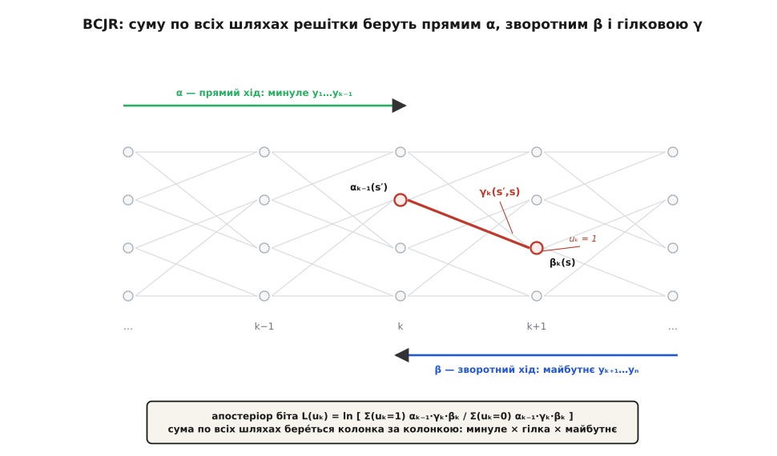
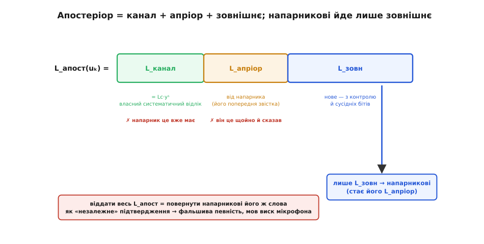
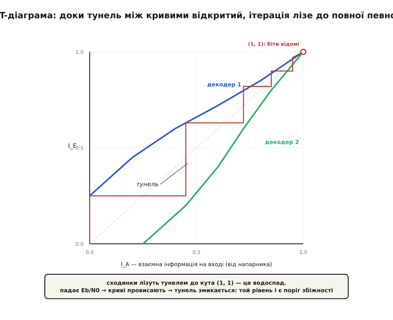

# 🧮 Математика ітеративного декодування

Ітеративний декодер ганяє по колу «м'які» числа, і вся його сила ховається в тому, **що** це за числа й **за яким законом** їх перераховують. Розберімо машину до гвинтика. Виявиться, що потрібна лише одна величина — логарифм відношення правдоподібностей — як єдина правильна валюта, і один прийом — прямий та зворотний хід по решітці — щоб порахувати з неї все інше. З цих двох речей виростає і рецепт, **яку саме частку** оцінки віддавати напарникові, і чому без цього правила вся конструкція зривається у виск.

## LLR — і чому саме логарифм відношення

М'яка оцінка біта — це не «нуль чи одиниця», а міра схильності разом із її силою. Формально беруть **логарифм відношення правдоподібностей** (log-likelihood ratio, LLR):

```
L(u) = ln [ P(u = 1) / P(u = 0) ]
```

Знак каже, куди схиляється біт: L > 0 — радше 1, L < 0 — радше 0, L = 0 — цілковита невизначеність (шанси рівні). Модуль |L| каже, **наскільки** віримо: що більший, то ближче ймовірність до одиниці. Обернути легко — це логістична крива: P(u=1) = e^L / (1 + e^L). Отже одне число L несе і рішення, і впевненість.

Але чому саме **логарифм** саме **відношення**, а не, скажімо, гола ймовірність P(u=1)? Причина одна, і вона визначає геть усе подальше. Уявімо, що той самий біт ми спостерегли двічі незалежно — дістали y₁ і y₂. За [правилом Байєса](root:math-probability/bayesian-estimation) — апостеріор пропорційний добуткові правдоподібності на апріор — шанси (odds) на біт **перемножуються**:

```
odds(u | y₁, y₂) = odds(u) · Λ(y₁) · Λ(y₂)       де Λ(y) = p(y|1) / p(y|0)
```

> 🔧 **Навіщо це.** Незалежні свідчення про ту саму річ у світі ймовірностей **множаться** — а множити на кожному кроці незручно й нестійко (числа то тонуть у нулі, то злітають). Логарифм перетворює добуток на **суму**. Візьмімо ln від обох боків:

```
L(u | y₁, y₂) = L_апріор(u) + L(y₁) + L(y₂)
```

Незалежні порції свідчень у LLR-домені просто **додаються**. Ось чому LLR — правильна валюта м'якого декодування: об'єднати дві незалежні думки про біт означає скласти їхні LLR. Уся ітеративна машина — це апарат для акуратного додавання таких порцій; складність у тому, щоб порції лишалися **незалежними**, інакше додавання бреше. До цього ми ще повернемося — саме тут ховається головне правило.

Одна порція нам дана прямо з ефіру. У [каналі AWGN](root:math-information/awgn-channel) — де до сигналу додається незалежний гаусів шум сталої потужності — LLR каналу виводиться в один рядок. Нехай біти лягають на несучу як BPSK, а прийнятий відлік дорівнює посланому плюс шум:

```
BPSK:  біт 1 → x = +1 ,   біт 0 → x = −1
канал: y = x + n ,   n — гаусів, дисперсія σ² = N₀/2

L_канал(y) = ln [ p(y|+1) / p(y|−1) ]
           = [ −(y−1)² + (y+1)² ] / (2σ²)      (лишаються тільки показники гаусіан)
           = 4y / (2σ²)
           = (2/σ²) · y
```

Тобто канал перетворює сирий відлік y на LLR простим множенням на **надійність каналу** Lᴄ = 2/σ². Чистіший канал (менша σ²) — більший множник — сильніша довіра до кожного відліку.

**Умова.** Кволий канал: σ² = 1, прийнято y = +0.2.

```
L_канал = (2/1) · 0.2 = +0.4
```

**Висновок.** Знак «+» ⇒ біт радше 1; але |0.4| — це майже нічого, вгадувати з цього самотою ризиковано. Саме такі кволі відліки код і рятує — доклавши до них свідчення, зібрані з **інших** бітів.

## Що саме має порахувати декодер

Тут криється тонка, але вирішальна різниця. Можна питати двома різними способами. Перший: «яка **послідовність** бітів найімовірніша ціла?» — на це відповідає декодер Вітербі, що шукає найправдоподібніший шлях. Другий: «для **кожного окремого** біта — яка ймовірність, що він 1, з огляду на **весь** прийнятий блок?» Це різні задачі, і для ітеративного декодування потрібна саме друга: напарникові ми передаємо м'яку оцінку кожного біта, а не одну тверду послідовність.

> Найправдоподібніший цілий шлях (як шукає [декодер Вітербі](root:com-modulation/viterbi-decoder) — динамічним програмуванням по решітці, лишаючи в кожному стані один вцілілий шлях) мінімізує ймовірність помилитися в **усьому слові**. Апостеріорна ймовірність кожного біта окремо мінімізує помилку **на біт** — і дає те м'яке число, яким живиться ітерація.

Отже мета — **апостеріорний LLR кожного біта**:

```
L(uₖ) = ln [ P(uₖ = 1 | y) / P(uₖ = 0 | y) ] ,   y — увесь прийнятий блок
```

Рішення про біт — знак цього числа; його модуль — готова м'яка оцінка. Лишається порахувати, і тут у гру входить решітка коду.

[Згортковий код](root:com-modulation/convolutional-codes) — це скінченний автомат: біти течуть крізь регістр зсуву, стан sₖ — це його вміст, а кожен вхідний біт uₖ жене автомат із стану sₖ₋₁ у sₖ і викидає назовні кілька вихідних (систематичний біт плюс контрольні). Розгорнутий у часі, автомат стає **решіткою**: колонки станів, а переходи-гілки між сусідніми колонками. Будь-яке кодове слово — це один суцільний **шлях** крізь цю решітку. Тоді ймовірність, що біт uₖ дорівнює 1, — це сумарна ймовірність **усіх шляхів**, чия k-та гілка несе одиницю:

```
P(uₖ = 1 | y) = Σ  P( перехід sₖ₋₁→sₖ | y )
              (по всіх гілках k-го кроку, де uₖ = 1)
```

Проблема одна: шляхів експоненційно багато. Прямий перебір нездійсненний. Уся суть алгоритму, який це рахує, — розкласти цю велетенську суму так, щоб її брати колонка за колонкою.

## BCJR: розкласти суму на минуле, гілку й майбутнє

Спосіб узяти суму по всіх шляхах не в лоб знайшли ще 1974 року четверо дослідників IBM — Бал, Кок, Джелінек і Равів; за їхніми іменами його й звуть **BCJR**. Їхня стаття «Optimal Decoding of Linear Codes for Minimizing Symbol Error Rate» вийшла за двадцять років до турбокодів і чекала свого зоряного часу — бо саме вона рахує той м'який апостеріор, якого потребує ітерація.

Ключ — марковість решітки: майбутнє залежить від минулого **лише через теперішній стан**. Тому ймовірність будь-якого шляху, що проходить гілкою sₖ₋₁→sₖ, розпадається на три незалежні множники — усе минуле до стану sₖ₋₁, сама гілка, усе майбутнє від стану sₖ:

```
P(sₖ₋₁ = s′, sₖ = s, y) = αₖ₋₁(s′) · γₖ(s′, s) · βₖ(s)
                            └ минуле ┘  └ гілка ┘  └ майбутнє ┘
```

Кожен множник має ясний зміст:

```
αₖ₋₁(s′) = P( дійти у стан s′,  спостерігши весь минулий шлях y₁…yₖ₋₁ )
βₖ(s)    = P( увесь майбутній шлях yₖ₊₁…y_N | вийшли зі стану s )
γₖ(s′,s) = P(uₖ) · p( yₖ | вихід автомата на гілці s′→s )
```

Гілкова метрика γ — це місцеве свідчення на k-му кроці: **апріор** P(uₖ) (те, що підказав напарник) помножений на **правдоподібність каналу** для того, що автомат на цій гілці випускає назовні. А величезні α і β беруться не перебором, а короткою рекурсією — саме тому все й здійсненне. Прямий хід накопичує минуле зліва направо, зворотний накопичує майбутнє справа наліво:

```
αₖ(s)    = Σ_{s′} αₖ₋₁(s′) · γₖ(s′, s)       (прямий хід →)
βₖ₋₁(s′) = Σ_{s}  βₖ(s)    · γₖ(s′, s)       (зворотний хід ←)
```

Це та сама пара «forward–backward», якою рахують приховані марковські ланцюги: один прохід уперед, один назад, і в кожному вузлі решітки лежить готова накопичена ймовірність. Знаючи α, γ, β, апостеріорний LLR збирають однією формулою — відношенням суми по «одиничних» гілках до суми по «нульових»:

```
             Σ (s′,s): uₖ=1   αₖ₋₁(s′) · γₖ(s′,s) · βₖ(s)
L(uₖ) = ln  ───────────────────────────────────────────────
             Σ (s′,s): uₖ=0   αₖ₋₁(s′) · γₖ(s′,s) · βₖ(s)
```


*Як BCJR бере суму по всіх шляхах. Прямий хід α несе накопичене минуле зліва направо, зворотний хід β несе майбутнє справа наліво, а гілкова метрика γ на кожному переході — місцеве свідчення (апріор × канал). Добуток αₖ₋₁(s′)·γₖ(s′,s)·βₖ(s) — це ймовірність цілого шляху крізь дану гілку разом з усім прийнятим блоком. Апостеріор біта — відношення суми таких добутків по гілках із uₖ=1 до суми по гілках із uₖ=0.*

## Три складники — і чому напарникові віддають лише зовнішнє

Тепер — серце всієї конструкції. Розкладімо гілкову метрику γ на множники. Апріор і систематичний відлік залежать **тільки** від значення біта uₖ, а не від того, якою саме гілкою йде шлях. Записавши апріор і канал в експоненційній формі, дістаємо:

```
γₖ(s′,s) ∝ exp( uₖ · (L_апріор + L_канал·yₖˢ) ) · [ множник парності гілки ]
                └── залежить лише від uₖ, СПІЛЬНИЙ для всіх таких гілок ──┘
```

Спільний множник виноситься з-під суми — однаковий у чисельнику для кожної одиничної гілки, — і апостеріор розпадається на три доданки, що просто складаються:

```
L(uₖ) = L_канал·yₖˢ  +  L_апріор(uₖ)  +  L_зовн(uₖ)
          (систематика)    (від напарника)   (нове — з парності й сусідів)
```

Кожен доданок має чітке походження. **L_канал·yₖˢ** — прямий погляд на власний систематичний відлік цього біта. **L_апріор** — те, що напарник сказав про цей біт минулого разу. А **L_зовн** — «зовнішня» частка — рахується тим самим дробом, але з гілкової метрики викинуто винесений множник exp(uₖ(L_апріор + L_канал·yₖˢ)). Це означає: про біт k зовнішня частка судить **лише з контрольних бітів і з сусідніх бітів** (їх приносять α та β крізь решітку), а власного систематичного відліку yₖˢ і підказки напарника L_апріор вона **не чіпає**. Саме тому вона — справді нове свідчення про біт, здобуте з решти блоку.


*Розклад апостеріорного LLR на три частки й правило обміну. Систематичний відлік yₖˢ напарник бачить сам (той самий біт входить в обидва декодери), а L_апріор — це те, що напарник щойно сам і сказав. Обидві частки для нього не нові. Незалежне — лише L_зовн, здобуте з контролю та сусідніх бітів; тільки його й передають далі. Віддати весь L_апост означало б повернути напарникові його ж слова як «незалежне» підтвердження.*

Тепер видно, **чому** віддавати можна лише зовнішнє. Уся правочинність додавання LLR стояла на одному: доданки **незалежні**. Якби декодер віддав напарникові повний L_апост, той дістав би назад дві частки, які вже має: систематичний відлік yₖˢ (той самий фізичний біт входить в обидва декодери) і власний L_апріор (те, що напарник сам щойно надіслав). Додати їх удруге — порахувати те саме свідчення двічі; незалежність зруйновано, і закон додавання починає брехати. Наслідок жорсткий: корельоване додавання роздуває |L| без жодного нового доказу — декодер стає фальшиво впевненим і **замикає** помилку так твердо, що пізніші оберти вже не переконають. Це те саме самозбудження, що й мікрофон, піднесений до власного гучномовця (аналогія точна в тому, що обидва — контур позитивного зворотного зв'язку без затримки; ламається вона в тому, що тут не акустичний резонанс, а статистичне подвійне рахування). Правило «віддавай лише L_зовн» тримає повідомлення, якими декодери обмінюються, настільки незалежними, наскільки код дозволяє. У турбоциклі це замикається просто: зовнішня частка одного декодера стає апріорною часткою другого на наступному півоберті, і навпаки.

## log-MAP проти max-log-MAP: точний максимум і його дешевий двійник

На папері формули чисті, але множити маленькі ймовірності на довгій решітці — це швидко тонути в машинному нулі. Тому все переносять у логарифмічний домен: беруть A = ln α, B = ln β, Γ = ln γ. Добутки в рекурсіях стають сумами — гарно, — але суми перетворюються на неприємність. Рекурсія αₖ(s) = Σ αₖ₋₁(s′)·γ у логарифмі дає:

```
Aₖ(s) = ln Σ_{s′} exp( Aₖ₋₁(s′) + Γₖ(s′,s) )
```

Оце «логарифм суми експонент» і є вузьке місце. Його беруть точно через оператор **max‑star** — тотожність, що зводить log‑sum‑exp до максимуму з поправкою:

```
max*(a, b) = ln( eᵃ + eᵇ ) = max(a, b) + ln( 1 + e^(−|a−b|) )
                                          └──── поправка ≤ ln2 = 0.693 ────┘
```

Тотожність точна: у ній жодного наближення. Поправочний член ln(1 + e^(−|a−b|)) залежить лише від різниці |a−b|, найбільший (ln2 ≈ 0.693) коли a = b, і швидко тане, коли аргументи розходяться. Його беруть із крихітної таблиці — і дістають **log‑MAP**: точний BCJR у логарифмі, чисельно стійкий.

А тепер дешевий двійник. Відкиньмо поправку зовсім:

```
log-MAP:      Aₖ(s) = max*_{s′} ( Aₖ₋₁(s′) + Γₖ(s′,s) )        (точно)
max-log-MAP:  Aₖ(s) ≈ max_{s′}  ( Aₖ₋₁(s′) + Γₖ(s′,s) )        (без поправки)
```

Це **max‑log‑MAP**. Тепер прямий і зворотний ходи — самі лиш «додай–порівняй–вибери», рівно та динамічна метрика, що й у декодері Вітербі, тільки прогнана і вперед, і назад. Зникають exp і ln; ба більше — результат стає **байдужим до масштабу**: спільний множник Lᴄ = 2/σ² однаково розтягує всі метрики й скорочується у відношенні, тож max‑log‑MAP навіть **не потребує знати дисперсію шуму** σ², тоді як точний log‑MAP через нелінійну поправку її потребує. Плата за спрощення — приблизно 0.3–0.5 дБ гіршої чутливості.

**Умова.** Дві конкурентні метрики шляхів: a = 3.0, b = 2.0.

```
max*(3.0, 2.0) = max(3.0, 2.0) + ln( 1 + e^(−|3.0−2.0|) )
               = 3.0 + ln( 1 + e^(−1.0) )
               = 3.0 + ln( 1.3679 )
               = 3.0 + 0.313
               = 3.313
```

**Висновок.** max‑log‑MAP узяв би голі 3.0 — недобір 0.313. Що ближче метрики сходяться (менша різниця), то більший недобір; коли шлях явно домінує, поправка мізерна й наближення майже безкоштовне. Ця пара — точний «сум» проти голого «максимуму» — дослівно та сама, що [сум‑добуток проти мін‑суму в декодуванні LDPC](root:com-modulation/ldpc/math-belief-propagation.md): там на графі перевірок вузли теж шлють одне одному м'які LLR, а дешевий мін‑сум — це точнісінько заміна точного log‑sum‑exp на голий максимум. Не збіг: обидва — той самий обмін довірою по колу, і той самий компроміс «точність проти дешевизни» вилазить в обох.

## Чи збіжеться? EXIT-діаграма

Лишається питання, від якого залежить усе: а чи наростатиме впевненість оберт за обертом — чи застрягне? Відповідь дає красивий інструмент, що з'явився наприкінці 1990‑х: **EXIT‑діаграма** (extrinsic information transfer chart), яку впровадив Стефан тен Брінк.

Ідея — поглянути на кожен складовий декодер як на чорну скриньку, що перетворює **якість входу на якість виходу**. Якість м'яких оцінок міряють однією величиною — [взаємною інформацією](root:math-information/mutual-information) між істинним бітом і LLR: скільки біт про справжнє значення несе цей LLR, число від 0 (LLR не каже нічого) до 1 (LLR виказує біт цілком). Позначмо I_A — взаємну інформацію апріорних оцінок на **вході** декодера (те, що приніс напарник), I_E — взаємну інформацію зовнішніх оцінок на **виході**. Декодер задає передавальну функцію I_E = T(I_A) при фіксованому Eb/N0, і вона монотонно зростає: кращі підказки на вході — кращі зовнішні оцінки на виході.

У турбокоді таких скриньок дві, і вихід однієї живить вхід другої. Тому криву першого декодера малюють звично (I_A по горизонталі → I_E по вертикалі), а криву другого — з **переставленими** осями (дзеркально через діагональ), бо для нього роль входу й виходу міняється місцями. Ітерація стає **сходами** між двома кривими: зовнішня інформація одного стає апріорною іншого, крок горизонтально до однієї кривої, крок вертикально до другої.


*Збіжність очима EXIT-діаграми. Осі — взаємна інформація на вході (I_A) і виході (I_E) складового декодера. Крива другого декодера відбита через діагональ, бо вхід і вихід міняються ролями. Поки між кривими лишається відкритий «тунель», траєкторія-сходинки лізе ним від початкової оцінки (яку дав самий канал) аж до кута (1, 1) — повна взаємна інформація, біти відомі, декодування вдалося. Це і є водоспад. Коли Eb/N0 падає, криві провисають; той рівень, на якому тунель змикається, і є поріг збіжності.*

Уся доля декодування — у формі цього коридору. Якщо криві **не сходяться** до самого кута, між ними лишається відкритий тунель; сходинки лізуть ним крок за кроком від початкової оцінки (її задає самий канал ще до всякого обміну) аж до кута (1, 1) — а це повна взаємна інформація, тобто біти відомі напевно, декодування вдалося. Ці сходинки вгору коридором — і є той крутий водоспад на кривій надійності. А тепер зменшуймо Eb/N0: обидві криві провисають, тунель вужчає, і при якомусь рівні вони **дотикаються** — тунель змикається. Сходинки впираються в защемлення, ітерація глухне, декодування зривається. Той Eb/N0, на якому тунель щойно закрився, — **поріг збіжності**, і він передбачає розташування водоспаду з точністю до частки децибела, порахований із самих лиш прогонів одного декодера, **без** моделювання цілого турбоциклу й підрахунку рідкісних бітових помилок. Ось чому EXIT‑діаграма стала головним інструментом конструктора: підбираєш код і перемішувач так, щоб тунель відкривався якомога нижче — і водоспад присувається до межі Шеннона.

## Що з цього складається

Придивімося до цілого. Кожна величина тут — місцева й на один біт: LLR каналу з одного відліку, гілкова метрика з апріора й каналу, α і β двома проходами по короткій решітці, апостеріор одним відношенням, з нього — зовнішня частка, і тільки її по колу. Уся ітеративна машина — це той самий кістяк, повторений на кожен біт і прокручений півтора десятка разів: **м'які LLR, місцеве оновлення на графі коду, обмін лише незалежною зовнішньою часткою**. Той самий кістяк рухає декодер LDPC; те саме спрощення точного максимуму до голого дає його дешевий різновид. І та сама пильність — не відлунювати напарникові його ж слова — рятує обидва від фальшивої певності. Ця арифметика довіри, що додається в логарифмі й обертається по колу, і є причина, чому купка слабких кодів, декодованих разом, дотягується на частку децибела до тієї межі, яку сорок років вважали недосяжною.
