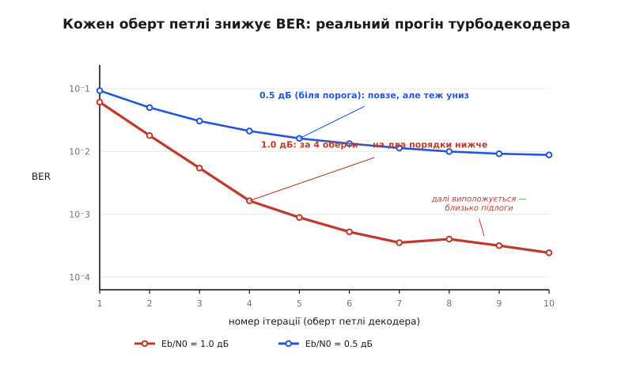

# ⚙️ Турбокодек, що працює: кодер, перемішувач і SISO-петля на решітці

**Задача.** Зібрати турбокод швидкості 1/3 від початку до кінця — і не на словах, а кодом, який запускається. Треба три частини. Кодер: рекурсивний згортковий складник, простий перемішувач, паралельне з'єднання двох таких кодерів (систематичні дані плюс два потоки контролю). Канал: BPSK через AWGN — біти стають символами ±1, шум псує їх, приймач бачить не біти, а м'які числа. І декодер — серце всього: два SISO-блоки (soft-in, soft-out) на решітці за алгоритмом log-MAP, що передають один одному зовнішні оцінки крізь перемішувач і назад, оберт за обертом. Мета — запустити прогін і **на власні очі** побачити, як частка помилок падає з кожним обертом петлі: водоспад, тільки не по потужності, а по ітераціях.

**Ідея.** Кодер тут — дрібниця: зсувний регістр із зворотним зв'язком, три рядки. Уся робота — у декодері, і вся вона зводиться до одного повторюваного кроку. Кожен SISO бере м'які оцінки на вході (що сказав канал плюс що нашептав напарник) і повертає **кращі** м'які оцінки. Тонкість, без якої все розсиплеться: напарникові він віддає не всю свою оцінку, а лише **зовнішню частку** — те нове, що видобув із перевірок власного коду, за вирахуванням того, що йому й так було відомо. Це віднімання — один рядок у коді, але саме воно не дає двом декодерам накрутити одне одного до фальшивої впевненості. Обгорнемо цей крок у цикл, проженемо кадр за кадром — і надійність почне рости сама з себе.

Скрізь далі код — робочий Python на самій стандартній бібліотеці: жодних залежностей, копіюй і запускай. Мова обрана свідомо. Це алгоритм рівня обробки сигналів, де ясність важить більше за такт процесора; решітку на 4 стани Python крутить із головою. А один-єдиний по-справжньому гарячий шматок — операцію, яку викликають мільйони разів на кадр, — наприкінці покажемо ще й мовою заліза, де їй саме місце.

---

## Складник: рекурсивний кодер на чотири стани

Турбокод будують із **рекурсивних систематичних згорткових** кодерів (RSC). «Систематичний» — бо сирі біти йдуть у канал незмінними; «рекурсивний» — бо кодер має зворотний зв'язок, і його вихід залежить не лише від кількох останніх входів, а від усієї передісторії. Візьмімо найменший показовий: два біти пам'яті, тож [решітка](topic:com-modulation/convolutional-codes) на 2² = 4 стани. Відводи ті самі, що в класичного коду (7, 5) — зворотний многочлен 1 + D + D² (у вісімковій 7), прямий 1 + D² (5), — але замкнені в петлю зворотного зв'язку.

Опишімо кодер один раз таблицею переходів: для кожної пари (стан, вхідний біт) — куди перейдемо і який контрольний біт видамо.

```python
import math, random

NS = 4                              # 2² стани: два біти пам'яті
def rsc_step(state, u):
    m1, m2 = (state >> 1) & 1, state & 1
    a  = u ^ m1 ^ m2                # зворотний зв'язок 1+D+D² (7₈)
    p  = a ^ m2                     # прямий відвід    1+D² (5₈)
    ns = ((a << 1) | m1) & 3
    return ns, p                    # систематичний вихід = u; контроль = p

TRELLIS = [[rsc_step(s, u) for u in (0, 1)] for s in range(NS)]

def rsc_encode(bits):
    s, par = 0, []
    for u in bits:
        s, p = TRELLIS[s][u]
        par.append(p)
    return par
```

Уся суть — у рядку `a = u ^ m1 ^ m2`. Це і є зворотний зв'язок: замість того щоб просто засунути вхідний біт у регістр, кодер спершу підмішує до нього обидва біти пам'яті. Через це навіть одна-однісінька одиниця на вході запускає **нескінченну** відповідь: раз попавши в петлю, вона гуляє регістром і псує контроль ще довго. Саме ця «злопам'ятність» рекурсивного кодера й потрібна турбокоду — вона робить погані вхідні візерунки рідкісними, а перемішувачу є що розтягувати. Контрольний біт `p = a ^ m2` знімає прямий відвід 1 + D², а зсув `(a << 1) | m1` вкидає свіже `a` у пам'ять і виштовхує найстаріший біт.

> 🔧 **Навіщо це.** Таблиця переходів — це і є весь кодер, звужений до чотирьох рядків стану. Той самий прийом «опиши автомат раз, далі лише читай таблицю» лежить в основі кожного згорткового кодера й декодера: решітка стала — робота на такт стала — весь код лінійний за довжиною. Реальні системи беруть решітку більшу (у LTE обидва складники — 8-станові, з поліномами (13, 15)₈), але механіка та сама до останнього XOR-а; більше станів — лише сильніший код і важча решітка.

## Перемішувач і повний кодувальник

Тепер паралельна конкатенація. Перший кодер працює з бітами як є; другий — з тими самими бітами, але переставленими [перемішувачем](topic:com-modulation/interleaving). Найпростіший робочий перемішувач — випадкова перестановка з фіксованим зерном (щоб і кодер, і декодер знали ту саму розкладку). Разом із нею одразу порахуємо й **зворотну**: вона знадобиться декодеру, щоб розставляти оцінки назад.

```python
def make_interleaver(N, rng):
    perm = list(range(N))
    rng.shuffle(perm)
    inv = [0]*N
    for i, pi in enumerate(perm):
        inv[pi] = i                # inv розставляє perm назад
    return perm, inv

def turbo_encode(u, perm):
    p1 = rsc_encode(u)                        # контроль 1 — прямий порядок
    up = [u[perm[i]] for i in range(len(u))]  # ті самі біти, переставлені
    p2 = rsc_encode(up)                       # контроль 2 — на переставлених
    return u, p1, p2                          # систематичні + два контролі → 1/3
```

На кожен інформаційний біт у канал іде три: сам біт, контроль першого кодера й контроль другого. Ось звідки швидкість 1/3. Зверніть увагу, чого тут **немає**: ми не заводимо кодери назад у нульовий стан (не термінуємо решітку). У справжніх стандартах решітку термінують кількома хвостовими бітами, щоб декодер точно знав, де вона кінчається; ми обійдемося без цього й розплатимося дрібницею на краю кадру — до цього повернемось у пастках.

## Канал: BPSK, шум і канальний LLR

Модуляція найпростіша: біт 0 стає символом −1, біт 1 — символом +1. [Канал AWGN](topic:math-information/awgn-channel) додає до кожного символу гауссів шум. Приймач не округлює назад до біта — він рахує **канальний LLR**, м'яку оцінку: наскільки і в який бік схиляється кожен символ.

Скільки саме важить прийнятий символ, каже один множник. Для BPSK через AWGN логарифм відношення правдоподібності прийнятого відліку `y` дорівнює `Lc · y`, де

```
Lc = 2 / σ²           надійність каналу
σ² = 1 / (2·R·Eb/N0)  дисперсія шуму, R = 1/3
⇒ Lc = 4 · R · Eb/N0
```

Що чистіший канал (більше Eb/N0), то більший `Lc` — то дужче приймач довіряє кожному відліку. Знак `Lc·y` додатний — символ схиляється до 1, від'ємний — до 0.

```python
def bpsk_awgn(bits, sigma, Lc, rng):
    out = []
    for b in bits:
        x = 1.0 if b else -1.0     # 0 → −1,  1 → +1
        y = x + rng.gauss(0.0, sigma)
        out.append(Lc * y)         # канальний LLR: додатний → схиляється до 1
    return out
```

Далі декодер працює **тільки** з цими LLR — сирих символів більше ніде не видно. Уся арифметика — про те, як склеїти три струмки м'яких оцінок (систематичний і два контрольні) у чимраз певніше рішення.

## Серце: SISO-декодер на решітці (log-MAP)

Ось де живе винахід. Кожен складниковий декодер має видати для кожного біта м'яку оцінку — і зробити це **оптимально за символом**. Це вміє алгоритм BCJR (за іменами Bahl, Cocke, Jelinek, Raviv, що описали його 1974 року в праці «Optimal Decoding of Linear Codes for Minimizing Symbol Error Rate»). На відміну від Вітербі, що шукає один найкращий шлях і мінімізує помилку **послідовності**, BCJR зважує **всі** шляхи й мінімізує помилку **кожного біта** окремо — саме те, що треба, коли на виході потрібне не «нуль/одиниця», а міра впевненості. Двадцять років його вважали надто дорогим; турбокоди дали йому друге життя.

Чому Вітербі мало, а BCJR у самий раз, видно з одного питання. Щоб оцінити ймовірність біта в момент `k`, треба зважити всі гілки решітки, де цей біт = 1, проти всіх, де він = 0. Вага гілки з часу `k` — це добуток трьох речей: наскільки ймовірно **дійти** до її початкового стану з минулого, наскільки ймовірна сама гілка, і наскільки ймовірно з її кінцевого стану **дотягнути** до кінця. Перше знає прохід уперед, третє — прохід назад. Тому SISO робить **два** проходи решіткою — вперед і назад, — а Вітербі одним survivor-ом обходиться. Це [динамічне програмування](topic:sf-algorithms/dynamic-programming) у обидва боки.

У логарифмі добутки стають сумами, а «зважити всі шляхи» — це логарифм суми експонент. Його не рахують у лоб: є точна тотожність, якобіанів логарифм, що зводить усе до максимуму плюс маленька поправка з таблиці:

```
ln(eᵃ + eᵇ) = max(a, b) + ln(1 + e^−|a−b|)
              └── max* ──┘
```

Це і є `max*` — операція, на якій тримається весь log-MAP.

```python
def maxstar(a, b):                 # якобіанів логарифм — точний log-MAP
    m = a if a > b else b
    return m + math.log1p(math.exp(-abs(a - b)))
```

Тепер сам SISO. Гілкова метрика `gamma` збирає докази на гілці: систематичний біт `u` підпирають і апріорна звістка `La`, і канальний `Ls`, а контрольний біт `p` — канальний `Lp`. Прохід уперед накопичує `alpha` («як імовірно дійти сюди»), назад — `beta` («як імовірно звідси дотягти»), а тоді для кожного біта беремо різницю двох `max*`-сум: усі гілки з `u = 1` проти всіх із `u = 0`.

```python
NEG = -1e30

def siso(Ls, Lp, La):
    N = len(Ls)

    def gamma(k, s, u):                 # логарифм гілкової метрики + куди веде
        ns, p = TRELLIS[s][u]
        us = 1.0 if u else -1.0
        ps = 1.0 if p else -1.0
        return 0.5 * (us * (La[k] + Ls[k]) + ps * Lp[k]), ns

    # ── уперед: alpha[k][s] — логарифм імовірності дійти до стану s у час k ──
    alpha = [[NEG]*NS for _ in range(N+1)]
    alpha[0][0] = 0.0                   # старт відомий: стан 0
    for k in range(N):
        for s in range(NS):
            if alpha[k][s] <= NEG: continue
            for u in (0, 1):
                g, ns = gamma(k, s, u)
                alpha[k+1][ns] = maxstar(alpha[k+1][ns], alpha[k][s] + g)
        mx = max(alpha[k+1])            # нормуємо — інакше числа попливуть
        for s in range(NS):
            if alpha[k+1][s] > NEG: alpha[k+1][s] -= mx

    # ── назад: beta[k][s] — логарифм імовірності з s дотягти до кінця ──
    beta = [[NEG]*NS for _ in range(N+1)]
    for s in range(NS): beta[N][s] = 0.0   # кінець невідомий → всі стани рівно
    for k in range(N-1, -1, -1):
        for s in range(NS):
            for u in (0, 1):
                g, ns = gamma(k, s, u)
                beta[k][s] = maxstar(beta[k][s], beta[k+1][ns] + g)
        mx = max(beta[k])
        for s in range(NS):
            if beta[k][s] > NEG: beta[k][s] -= mx

    # ── повний LLR і зовнішня частка ──
    Le = [0.0]*N
    for k in range(N):
        num = den = NEG                 # логсуми гілок з u=1 / u=0
        for s in range(NS):
            if alpha[k][s] <= NEG: continue
            for u in (0, 1):
                g, ns = gamma(k, s, u)
                v = alpha[k][s] + g + beta[k+1][ns]
                if u: num = maxstar(num, v)
                else: den = maxstar(den, v)
        Le[k] = (num - den) - Ls[k] - La[k]   # прибрати канал і апріорі
    return Le
```

Останній рядок — та сама тонкість, що дала турбокодам ім'я. Повний LLR біта `num − den` містить **усе**: і те, що сказав канал (`Ls`), і те, що нашептав напарник минулого оберту (`La`), і те нове, що видобув цей декодер із перевірок свого коду. Напарникові годиться віддати **лише останнє** — тож віднімаємо перші два. Те, що лишилось, `Le`, і є **зовнішня інформація**: чистий здобуток саме цього коду, без відлуння чужих слів.

> 🔧 **Навіщо це.** Якби `siso` вертав повний LLR, а не `Le`, напарник почув би у звістці власну підказку з минулого кола, прийняв би її за незалежне підтвердження — і два декодери за кілька обертів накрутили б себе до впевненого +∞ навіть на хибному біті. Виск самозбудження, як мікрофон біля гучномовця. Одне віднімання `− Ls − La` розриває це коло. Той самий закон — «віддавай лише свій здобуток, чужого не відлунюй» — тримає й [декодер LDPC](topic:com-modulation/ldpc) з його правилом «усім сусідам, крім того, від кого прийшло». Це не збіг, а одна ідея: у будь-якому обміні довірою по колу свідчення можна враховувати лише **раз**.

## Петля: два декодери крутять оцінки по колу

Тепер з'єднаймо два SISO в турбіну. Перший працює на прямому контролі, другий — на переставленому; між ними перемішувач розкладає й зкладає оцінки. Систематичний потік другому декодеру теж потрібен переставленим — тому наперед готуємо `Lsp`. На старті апріорі немає, тож `La1` — нулі. Після кожного повного оберту знімаємо тверде рішення з повного LLR першого декодера.

```python
def turbo_decode(Ls, Lp1, Lp2, perm, inv, niters):
    N = len(Ls)
    Lsp = [Ls[perm[i]] for i in range(N)]     # систематичні у переставленому порядку
    La1 = [0.0]*N                             # спершу апріорі немає
    hist = []
    for _ in range(niters):
        Le1 = siso(Ls,  Lp1, La1)             # декодер 1 — прямий контроль
        La2 = [Le1[perm[i]] for i in range(N)]      # → переставити для декодера 2
        Le2 = siso(Lsp, Lp2, La2)             # декодер 2 — переставлений контроль
        La1 = [Le2[inv[i]] for i in range(N)]       # ← розставити назад
        bits = [1 if Ls[k] + La1[k] + Le1[k] > 0 else 0 for k in range(N)]
        hist.append(bits)                     # рішення після цього оберту
    return hist
```

Ось і весь турбопринцип у восьми рядках. `Le1 → perm → La2`: перший декодер шепоче другому, але в його, переставленому порядку. `Le2 → inv → La1`: другий відповідає, розставлене назад у прямий порядок. Оцінки біжать по колу, а `hist` зберігає рішення після кожного оберту — щоб ми могли поміряти, як помилок меншає від ітерації до ітерації.

## Прогін — і водоспад по обертах

Лишилось обгорнути все в експеримент: нагенерувати кадри, прогнати крізь кодер, канал і декодер, порахувати помилки після кожного оберту.

```python
def experiment(N, EbN0dB, nframes, niters, seed=11):
    rng = random.Random(seed)
    R = 1.0/3.0
    EbN0 = 10**(EbN0dB/10.0)
    sigma = math.sqrt(1.0/(2.0*R*EbN0))
    Lc = 2.0/(sigma*sigma)
    perm, inv = make_interleaver(N, rng)
    errs = [0]*niters
    for _ in range(nframes):
        u = [rng.randint(0, 1) for _ in range(N)]
        sysb, p1, p2 = turbo_encode(u, perm)
        Ls  = bpsk_awgn(sysb, sigma, Lc, rng)
        Lp1 = bpsk_awgn(p1,   sigma, Lc, rng)
        Lp2 = bpsk_awgn(p2,   sigma, Lc, rng)
        hist = turbo_decode(Ls, Lp1, Lp2, perm, inv, niters)
        for it, bits in enumerate(hist):
            errs[it] += sum(1 for k in range(N) if bits[k] != u[k])
    return [e/(nframes*N) for e in errs]

for snr in (0.5, 1.0):
    ber = experiment(N=1024, EbN0dB=snr, nframes=80, niters=10)
    print("%.1f дБ:" % snr, " ".join("%.2e" % b for b in ber))
```

І ось що друкує цей прогін (1024 біти на кадр, 80 кадрів, log-MAP):

```
                оберт:    1        2        3        4        5        6      … 10
0.5 дБ:  9.2·10⁻²  5.0·10⁻²  3.0·10⁻²  2.1·10⁻²  1.6·10⁻²  1.3·10⁻²  … 8.8·10⁻³
1.0 дБ:  6.1·10⁻²  1.8·10⁻²  5.4·10⁻³  1.6·10⁻³  8.9·10⁻⁴  5.2·10⁻⁴  … 2.4·10⁻⁴
```

Придивіться до рядка 1.0 дБ. Перший оберт — 6 %, майже як без коду. Другий — уже 1.8 %. Третій — 0.5 %. Четвертий — 0.16 %. За чотири оберти частка помилок упала **на два порядки**, і жоден із двох кволих складників поодинці й близько такого не дав би. Далі крива виположується: доробок кожного наступного оберту меншає, декодер підходить до підлоги свого коду. А рядок 0.5 дБ, під самим порогом, повзе куди повільніше — там сигналу ледь вистачає, щоб петля взагалі зачепилась, і десяти обертів мало.


*Водоспад не по потужності, а по обертах. За Eb/N0 = 1.0 дБ (червона) частка помилок за чотири ітерації падає на два порядки, тоді виположується біля підлоги коду. За 0.5 дБ (синя), під самим порогом, петля лише повзе вниз. Це той самий приріст спільної впевненості — тільки поміряний у частках помилок цілого кадру.*

Приріст видно й на **одному** біті. Візьмімо з реального прогону (1.0 дБ) біт, який канал переплутав: справжнє значення — 1, а канальний LLR вийшов `−1.89` — упевнене, але **хибне** «нуль». Ось як мандрував його повний LLR по обертах:

```
справжній біт = 1,   канал сказав −1.89  (упевнено, але НЕ той бік)

оберт:   1      2      3      4      5      6      7      8
LLR:   −0.82  −1.50  +3.36  +2.60  +4.34  +7.74  +8.90  +9.19
знак:    −      −      +      +      +      +      +      +
                     ↑ тут петля перекинула біт на правильний бік
```

Перші два оберти декодер ще вагається — навіть просідає до `−1.50`. Але на третьому голоси сусідів, зібрані через контроль обох кодерів, **пересилюють** хибний, хай і впевнений, відлік каналу: LLR перекидається на `+3.36`, і далі впевненість лише росте, аж до твердого `+9.19`. Жодного нового виміру з каналу не надійшло — біт врятувала сама **структура** коду, розтягнута перемішувачем так, що помилку стало видно збоку. І зверніть увагу на реалізм: справжня траєкторія не гладенька гірка, а боротьба з просіданнями, що врешті замикається на правильному рішенні.

## Гарячий шлях: той самий max* мовою заліза

Профіль цього декодера пласкіший нікуди: майже весь час з'їдає `maxstar`. Її кличуть на кожній гілці кожного стану в трьох проходах на кожен SISO, двічі за оберт, десяток обертів — на кадр у мільйони викликів. Це і є гарячий baseband-шлях, і тут Python поступається залізу. У кремнієвому декодері `max*` не рахують `exp` і `log` — поправку `ln(1 + e^−x)` беруть із коротенької таблиці (вона майже нуль уже за `x > 8`), а то й кидають зовсім, лишаючи голий `max`. Ось та сама операція двома мовами: ліворуч — прозорий еталон, праворуч — те, що справді крутиться в модемі.

:::tabs
```python
# Еталон: точний log-MAP, ясність понад усе.
def maxstar(a, b):
    m = a if a > b else b
    return m + math.log1p(math.exp(-abs(a - b)))
```
```c
// Гарячий шлях модема: поправку беремо з таблиці, без exp/log.
// Точність log-MAP за ціну, близьку до голого max.
static float CORR[65];                 // ln(1+e^−x) для x ∈ [0,8), крок 1/8

void maxstar_init(void) {
    for (int i = 0; i < 65; i++)
        CORR[i] = logf(1.0f + expf(-i / 8.0f));
}

static inline float maxstar(float a, float b) {
    float d = a - b;
    float m = (d > 0.0f) ? a : b;
    float x = (d > 0.0f) ? d : -d;     // |a − b|
    if (x >= 8.0f) return m;           // поправка вже ≈ 0
    return m + CORR[(int)(x * 8.0f)];  // один доступ до таблиці
}
```
:::

Логіка та сама — максимум плюс поправка, — але C-версія міняє два трансцендентні виклики на одне порівняння й одне читання таблиці. На мільйонах викликів це різниця між «крутиться в реальному часі на кожному кадрі LTE» і «ні». Решту декодера — накопичення `alpha`/`beta` — так само розкладають на цілочисельну арифметику й розгортають під конкретну решітку; але серце оптимізації саме тут, у `max*`.

## Складність і пастки

**Скільки це коштує.** Робота лінійна за всім: `O(niters · N · S · 2)`, де `S` — число станів. Подвоїш ітерації, подвоїш кадр, подвоїш складники — рівно стільки ж додасться роботи; за станами, щоправда, зростання не лінійне, бо `S = 2^(пам'ять)`. Звідси й головний компроміс турбокоду: більша решітка й довший кадр дають сильніший код, але кожен біт коштує дорожче, а декодер повільніший. Десяток обертів — типова стеля; далі приріст не вартий заходу.

**Числа пливуть — нормуй.** `alpha` і `beta` — накопичені логарифми ймовірностей; без догляду вони сповзають у велике мінус-нескінченне й переповнюють арифметику. Ліки — по одному рядку на прохід: після кожного кроку відняти від усіх станів максимум. На LLR це не впливає (він — різниця), а числа тримаються біля нуля. Пропустиш нормування — на довгому кадрі отримаєш `nan` замість декодера.

**max-log-MAP: дешевше, але не безкоштовно.** Викинь поправку з `max*`, лишивши голий `max`, — і матимеш max-log-MAP: швидше, простіше в залізі, і геть не потребує знати надійність каналу. Але за це платять точністю. У тому самому прогоні (1.0 дБ, оберт 10) log-MAP дав BER 2.4·10⁻⁴, а max-log — 8.2·10⁻⁴, утричі з гаком гірше. Здебільшого цю дірку майже повністю затуляють, множачи зовнішню оцінку `Le` на сталий коефіцієнт близько 0.7: max-log схильний **перебільшувати** впевненість, а легке приглушення повертає його до тями. Дешевий трюк, що коштує один множник.

**Пастка відлуння.** Найпідступніша помилка — забути `− Ls − La` в останньому рядку `siso` й вернути напарникові повний LLR. Код запуститься, перші оберти навіть покращуватимуть — а тоді BER раптом застигне або поповзе **вгору**: декодери годують один одного власним відлунням, впевненість дметься на порожньому місці. Симптом характерний: LLR ростуть до величезних значень, а помилки не зникають. Якщо турбодекодер «застряг упевнено неправильним» — перше, куди дивитись, це чи справді назовні йде лише зовнішня частка.

**Край кадру.** Ми не термінували решітку, тож `beta` на кінці стартувала рівною по всіх станах — декодер не знав, де решітка обірвалась, і біти під самим хвостом кадру захищені трохи гірше. На довгому кадрі це губиться в статистиці; на короткому — помітно псує підлогу. Стандарти (UMTS, LTE) тому доганяють кодери хвостовими бітами в нуль — кількох бітів на кадр досить, щоб `beta` знала точку старту.

**Перемішувач вирішує підлогу.** Наш випадковий перемішувач годиться для демонстрації, але саме він визначає, як низько ляже підлога помилок. Випадкова перестановка інколи лишає два сусідні біти сусідами й після тасування — а це заготовка для слова малої ваги, якого потужністю не здолати. Спеціальні схеми (S-random, де жодні два сусіди не лягають ближче за задану відстань і після перемішування) прибирають такі збіги й опускають підлогу на порядки. Хочеш глибшу підлогу — не чіпай потужність, перероби перемішувач.

Зберіть усі фрагменти докупи — `rsc_step`, `rsc_encode`, `make_interleaver`, `turbo_encode`, `bpsk_awgn`, `maxstar`, `siso`, `turbo_decode`, `experiment` — і матимете турбокодек, що на кількастах рядках стандартного Python відтворює те, що приголомшило залу в Женеві: два кволі коди, які, шепочучи один одному лише свій чесний здобуток, разом сягають туди, куди поодинці не дотягли б ніколи.
