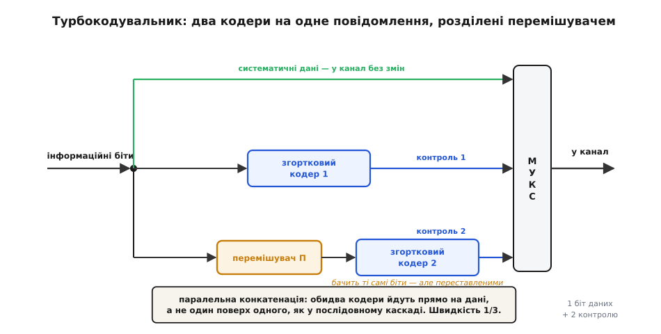
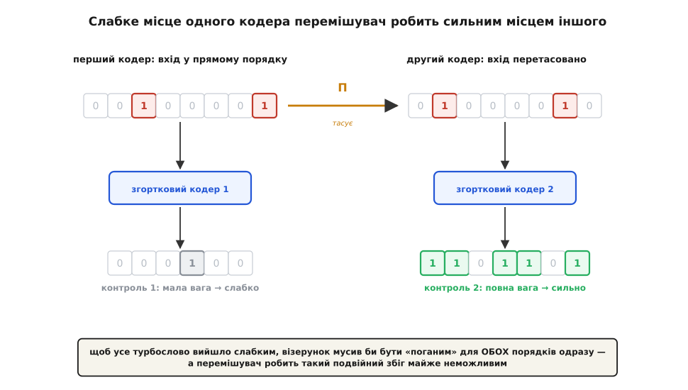
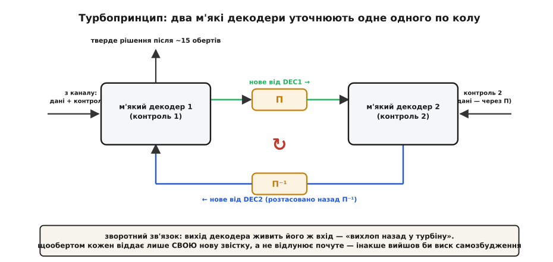
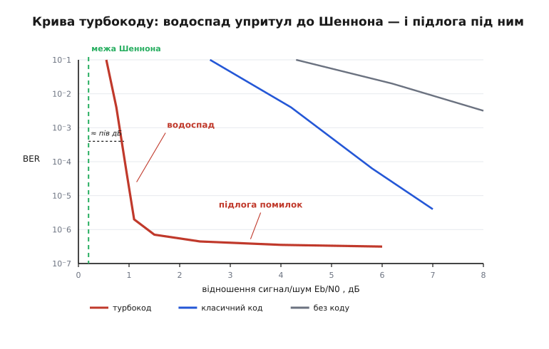

# Турбокоди

<preknowlist>
- [Згорткові коди](topic:com-modulation/convolutional-codes) — код без блоків: біти течуть крізь регістр зсуву, кожен вихідний біт залежить від кількох попередніх; декодують по решітці.
- [Перемішування](topic:com-modulation/interleaving) — навмисна перестановка бітів, що розкидає сусідів далеко один від одного.
- [Конкатеновані коди](topic:com-modulation/concatenated-codes) — як складають два коди в один сильніший; послідовний каскад «зовнішній над внутрішнім».
- [Теорема Шеннона про кодування каналу](topic:math-information/channel-coding-theorem) — надійна передача можлива аж до пропускної здатності каналу; це та стеля, до якої код лише наближається.
</preknowlist>

1948 року [Клод Шеннон довів](topic:math-information/channel-coding-theorem), що в будь-якому зашумленому каналі є швидкість, нижче якої дані йдуть майже без помилок, — і що коди, здатні сягнути цієї [межі](topic:math-information/bandwidth-capacity), існують. А далі сталося прикре: сорок з гаком років найкращі практичні коди — [Геммінга](topic:com-modulation/hamming-code), BCH, [Рід–Соломона](topic:com-modulation/reed-solomon) — уперто застрягали за **три з половиною децибели** від межі. Прірва не зачинялася. Інженери вже звикли думати, що останні кілька децибелів — принципово недосяжна розкіш.

І тут, у травні 1993-го, на конференції IEEE зі зв'язку в Женеві троє нікому не відомих інженерів із Бретані виходять і кажуть: ми підійшли до межі Шеннона на **пів децибела**. Не на три з половиною — на пів. Зала не повірила. Ветерани галузі вирішили, що французи просто десь наплутали в розрахунках; дехто навіть не став читати доповідь — надто вже безглуздо звучало. А розрахунки були правильні. [Клод Берру, Ален Ґлав'є та Пунья Тітімайшима](topic:com-modulation/turbo-codes/hist-turbo-birth.md) винайшли **турбокоди** — і одним ударом закрили прірву, що трималася від часів самого Шеннона.

Найдивовижніше в цьому винаході — що зроблено його з дуже посередніх деталей. Турбокод не використовує якогось нового надпотужного коду. Він бере два **слабенькі** [згорткові коди](topic:com-modulation/convolutional-codes) — такі, що поодинці ледь щось лагодять, — і складає їх у хитрий спосіб, від якого пара раптом починає працювати як один майже ідеальний код. Уся сила ховається не в деталях, а в тому, **як** їх з'єднано і **як** їх декодують.

## Дві машини на одне повідомлення

Почнімо з кодувальника — з того, що робить передавач. Ідея проста, мов дитяча гра. Візьмімо потік інформаційних бітів і пустімо його одразу трьома дорогами.

Перша дорога — найкоротша: біти йдуть у канал **як є**, без жодних змін. Це так звана систематична частина (від гр. *sýstēma* — «складене разом») — сирі дані, які приймач побачить прямо, без розшифровки. Друга дорога веде біти крізь перший згортковий кодувальник, і той виробляє свій потік **контрольних** бітів (parity) — жменю перевірок, вирахуваних із даних. А третя дорога — найцікавіша: перш ніж пустити ті самі біти в **другий** згортковий кодувальник, їх проганяють крізь [перемішувач](topic:com-modulation/interleaving) (interleaver) — пристрій, що просто **перетасовує їхній порядок**. Другий кодувальник бачить те саме повідомлення, але викладене зовсім іншою чергою, і виробляє свою, окрему жменю контрольних бітів.

На виході складають усі три потоки: систематичні дані плюс дві порції контрольних бітів. На кожен інформаційний біт у канал іде три — один даних і два перевірок, — тож швидкість такого коду дорівнює 1/3.


*Будова турбокодувальника. Той самий потік бітів роздвоюється: угорі йде прямо (систематичні дані) і в перший кодер (контроль 1), унизу — крізь перемішувач Π у другий такий самий кодер (контроль 2). Два кодери однакові; уся різниця в тому, що другий бачить біти переставленими. Три потоки зливаються в один — на кожен біт даних два біти перевірки, швидкість 1/3.*

Це так звана **паралельна** конкатенація: два коди накладають не один поверх одного, як у класичному [каскаді Форні](topic:com-modulation/concatenated-codes) (там дані проходять зовнішній код, потім внутрішній — послідовно), а **обидва прямо на дані**, пліч-о-пліч. Обидва кодери працюють з тим самим повідомленням; єдине, що їх різнить, — перемішувач між ними. І саме в цьому непоказному перемішувачі криється весь фокус.

## Навіщо тасувати біти

Чому проста перестановка робить пару слабких кодів сильною? Щоб це відчути, треба знати одну ваду згорткових кодів. У кожного коду є **погані вхідні візерунки** — такі рідкісні комбінації бітів, що дають на виході майже порожній, кволий контроль. Коли на вхід трапляється такий візерунок, код виробляє **кодове слово малої ваги** (мало одиниць, майже самі нулі) — а слова малої ваги легко сплутати між собою в шумі. Це і є слабкі місця коду: жменя нещасливих візерунків, на яких він майже сліпне.

Тепер головна думка. Нехай на вхід прийшов саме такий поганий візерунок. Перший кодер на ньому спіткнеться — видасть кволий контроль 1. Але той самий візерунок іде у другий кодер **перетасованим**, а після тасування він майже напевно вже **не** поганий: перемішувач розкидав його біти врозтіч, і для другого кодера це звичайний, «здоровий» візерунок, на якому той видає повновагий, сильний контроль 2. Слабке місце першого кодера перемішувач перетворює на сильне місце другого.


*Чому перемішувач робить пару сильною. Той самий вхідний візерунок для першого кодера «поганий» — дає кволий контроль 1 (кодове слово малої ваги, легко сплутати). Перемішувач Π розтасовує його біти, і для другого кодера це вже звичайна комбінація, з якої той видає повновагий контроль 2. Щоб усе турбослово вийшло слабким, візерунок мусив би бути поганим одночасно для обох порядків — а перемішувач робить такий збіг майже неможливим.*

Щоб усе турбослово вийшло по-справжньому слабким, вхідний візерунок мусив би виявитися поганим **одночасно** — і в прямому порядку для першого кодера, і в перетасованому для другого. Хороший перемішувач робить такий подвійний збіг напрочуд рідкісним. Тож слів малої ваги в турбокоді лишається мізерно мало — набагато менше, ніж у кожного зі згорткових кодів окремо. Цей ефект називають **проріджуванням спектра** (spectral thinning) або виграшем від перемішування (interleaver gain): що довший перемішувач, то рідші небезпечні слова й то далі коди «прикривають» слабкості одне одного. Ось звідки береться сила турбокоду — не з потужних складників, а з того, що два прості коди дивляться на дані **під різними кутами** й кожен латає діри іншого.

> 🔧 **Навіщо це.** Головний прийом тут ширший за коди: **два дешеві механізми, що дивляться на ту саму річ по-різному, разом надійніші за один дорогий.** Перемішувач нічого не рахує й не додає надлишку — він лише міняє порядок, а виграш дає величезний. Той самий хід працює скрізь, де є ризик «спільної сліпоти»: два незалежні датчики під різними кутами, дві перевірки на різних представленнях даних, дублювання, у якому копії навмисно **не однакові**. Коли не можеш зробити один ідеальний сторож — постав двох недосконалих так, щоб їхні сліпі плями не збігалися.

## Турбіна в декодері

Кодування — тільки половина історії, і не та, що дала кодові назву. «Турбо» — це про **декодування**. Тут і ховається справжній винахід.

Спершу треба відмовитися від звички думати бітами «нуль/одиниця». Турбодекодер працює не з голими бітами, а з **м'якими** оцінками — з мірою впевненості. Для кожного біта приймач тримає число: наскільки він схиляється до одиниці чи до нуля і **як сильно**. Зручна форма такого числа — логарифм відношення правдоподібностей (log-likelihood ratio, LLR): великий додатний — «майже напевно 1», великий від'ємний — «майже напевно 0», близький до нуля — «гадки не маю». Знак каже, який біт; величина каже, наскільки віримо.

Тепер сам механізм. У турбодекодера теж два декодери — по одному на кожен згортковий код. Кожен з них уміє важливу річ: узяти м'які оцінки на вході й видати **покращені** м'які оцінки на виході (такий блок звуть SISO — soft-in, soft-out, «м'яке всередину, м'яке назовні»). Перший декодер бере те, що надійшло з каналу — систематичні дані плюс контроль 1, — і, спираючись на перевірки першого коду, уточнює впевненість у кожному біті. Потім він передає своє уточнення **другому** декодеру. Той бере ту саму систематичну частину плюс контроль 2, додає підказку від напарника — і уточнює оцінки ще краще, вже спираючись на **другий** код. А тоді віддає своє покращення назад **першому**. І перший починає новий круг — уже маючи те, що надумав другий.

Оцінки ходять по колу: перший декодер → другий → знову перший → знову другий, кругом і кругом. З кожним обертом упевненість у правильних бітах наростає, аж поки картина не устоїться — зазвичай за півтора десятка проходів. **Ось воно.** Декодер живиться власним виходом, щоб поліпшити власний вхід, — рівно як турбонагнітач (від лат. *turbō* — «вихор») живить двигун його ж вихлопом, женучи назад відпрацьовані гази, щоб додати тязі. Берру, коли шукав назву, дивився автоперегони — і побачив у своєму декодері ту саму турбіну зі зворотним зв'язком. Звідси й «турбокод».


*Турбопринцип у декодері. Перший м'який декодер спирається на контроль 1, другий — на контроль 2; між ними той самий перемішувач Π, що й у кодері (і зворотний Π⁻¹ на шляху назад). Кожен передає напарникові лише **додаткову** звістку — те нове, що сам довідався. Оцінки крутяться по колу, впевненість наростає з кожним обертом. Цей зворотний зв'язок — «вихлоп назад у турбіну» — і дав кодам назву.*

Є одна тонкість, без якої вся конструкція вибухнула б, — і вона так само повчальна, як сам винахід. Передаючи звістку напарникові, декодер мусить віддати **лише те нове, що він сам довідався** з перевірок свого коду, — і **ні краплі з того, що йому щойно сказав цей-таки напарник**. Цю чисту частку звуть **зовнішньою інформацією** (extrinsic information). Якби декодер вертав назад і чужу підказку теж, то напарник почув би власне відлуння, прийняв би його за незалежне підтвердження — і два декодери накрутили б одне одного до фальшивої стопроцентної впевненості, як мікрофон, піднесений до власного гучномовця, зривається у виск. Правило «віддавай лише своє, чужого не відлунюй» — те саме, що рятує від самозбудження [ітеративний декодер LDPC](topic:com-modulation/ldpc) з його «усім, крім адресата». Це не збіг: турбокоди й [LDPC](topic:com-modulation/ldpc) — близька рідня, обидва суть обмін довірою по колу, і формально їх декодують майже однаково. Як саме рахують ці м'які оцінки — через MAP-декодер по решітці (алгоритм BCJR) і як точно виділяють зовнішню частку — розгортає [математика ітеративного декодування](topic:com-modulation/turbo-codes/math-iterative-decoding.md).

## Як упевненість наростає по колу

**Умова.** Простежмо один інформаційний біт, чиє справжнє значення — 1, але канал його ледь розрізнив. Числа — логарифми правдоподібності (LLR): знак дає біт, величина — впевненість. Повна оцінка біта на кожному кроці — сума трьох внесків:

```
L_повна = L_канал + L_e1 + L_e2
          (канал)  (від DEC1) (від DEC2)

канал дав кволе:   L_канал = +0.4   (ледь схиляється до 1)

── оберт 1 ─────────────────────────────────
DEC1 глянув на контроль 1, додав своє:  L_e1 = +0.7
   поточна оцінка → 0.4 + 0.7        = +1.1
DEC2 глянув на контроль 2 + підказку,   L_e2 = +0.9
   поточна оцінка → 0.4 + 0.7 + 0.9  = +2.0

── оберт 2 ─────────────────────────────────
DEC1 уточнив (уже знаючи здогад DEC2): L_e1 = +1.3
DEC2 уточнив:                          L_e2 = +1.5
   L_повна → 0.4 + 1.3 + 1.5          = +3.2

рішення: знак «+» → біт = 1,  |3.2| велике → впевнено
```

**Висновок.** Канал сам дав майже нічого — кволі +0.4, з яких вгадувати біт було б ризиковано. Але два декодери, передаючи один одному лише **свіжу** звістку (L_e1, L_e2) і уточнюючи її щообертом, наростили спільну впевненість аж до твердого +3.2. Жоден із двох слабких кодів поодинці цього біта не врятував би; пара, що крутить оцінки по колу, — врятувала. (Числа тут ілюструють механізм; справжній прогін на решітці — у [робочому декодері](topic:com-modulation/turbo-codes/proj-turbo-decoder.md).)

## Водоспад — і підлога під ним

Якщо накреслити надійність турбокоду — [частку помилок проти сили сигналу](topic:com-modulation/ber-snr-curve), — вийде крива з двох дуже різних частин, і обидві варто розуміти.

Спершу, тільки-но сигнал переростає поріг, крива летить сторч униз — **водоспад** (waterfall): додаси якісь пів децибела потужності, а помилок меншає в тисячі разів. Цей обрив стоїть упритул до [межі Шеннона](topic:math-information/bandwidth-capacity) — саме він і приголомшив залу в Женеві. Та якщо гнати сигнал ще дужче, водоспад раптом виположується в майже горизонтальну **підлогу помилок** (error floor): частка помилок майже перестає спадати, хоч скільки додавай потужності. Це зворотний бік турбокоду. Ту жменю кодових слів малої ваги, які перемішувач так і не зумів прибрати, годі здолати самою потужністю — і саме вони тримають підлогу.


*Дві частини кривої турбокоду. Ліворуч, одразу за межею Шеннона, — крутий «водоспад»: мале збільшення сигналу різко валить частку помилок. Далі крива виположується в «підлогу» — залишкові слова малої ваги, які потужністю не здолати. Класичні коди (і сигнал без коду) тримаються далеко праворуч, куди турбокод дотягується малою часткою їхньої потужності. Висота підлоги — плата за близькість водоспаду до межі.*

Проти підлоги б'ються не потужністю, а **конструкцією перемішувача**. Якщо тасувати біти не абияк, а за спеціальними схемами (наприклад, S-random — де жодні два сусіди не лягають ближче за задану відстань), небезпечних подвійних збігів стає ще менше, і підлога опускається. Тому серце турбокоду — саме перемішувач: він і дає силу у водоспаді, і визначає висоту підлоги.

За все це є й окрема ціна — **затримка**. Щоб перемішувач мав що тасувати, треба спершу набрати цілий великий блок бітів; чим він довший (а довгий дає кращий код), тим більше чекати. Плюс декодер робить не один прохід, а півтора десятка. Для довгих потоків даних це дрібниця, але для коротких керівних повідомлень, де кожна мілісекунда на рахунку, турбокод занадто повільний — там виграють інші коди.

## Де вони живуть

Турбокоди майже миттєво перекочували з женевської доповіді в кремній, бо давали те, за що операторам платять, — більше надійних бітів на кожен ват і герц. Уся третя генерація мобільного зв'язку виросла на них: UMTS і HSPA, американський CDMA2000/EV-DO — усюди канал даних ніс турбокод. Далі — **LTE** (4G), де турбокод захищав користувацький трафік мільярдів телефонів. Супутники теж узяли їх на озброєння: стандарт зворотного каналу DVB-RCS, безпровідний WiMAX. А найдалі вони залетіли буквально — у [далекий космос](topic:com-modulation/reed-solomon/hist-voyager-codes.md): консорціум космічних агенцій CCSDS зробив турбокоди стандартом, і на них передають знімки марсіанські орбітальні апарати, зокрема Mars Reconnaissance Orbiter.

Цікаво, що на вершині — у **5G** — турбокоди поступилися місцем. Канал даних там віддали [LDPC](topic:com-modulation/ldpc), а канал керування — [полярним кодам](topic:com-modulation/polar-codes). Причин кілька: підлога помилок, чималі затримка й складність декодера, а ще той факт, що LDPC на той час був вільний від патентів, тоді як турбокоди — ні. Але це не поразка, а зміна варти: обидва наступники — ітеративні коди, що виросли з тієї самої революції, яку турбокоди й розпочали. Ідея «склади прості коди й уточнюй їх один одним по колу» нікуди не поділася — вона стала загальним місцем сучасного зв'язку.

## Що вони змінили

Значення турбокодів більше за них самих. До 1993-го галузь тихо змирилася, що останні децибели до Шеннона недосяжні; після — виявилося, що досяжні, і то дешевими деталями. Це струснуло всіх настільки, що інженери кинулися перебирати старі ідеї — і [викопали з 1960-х забуті коди Галлагера](topic:com-modulation/ldpc/hist-gallager.md), ті самі LDPC, які виявилися ще одним втіленням того ж таки ітеративного принципу. Уся сучасна теорія кодування — до межі Шеннона й упритул — виросла з тієї женевської доповіді, у яку половина зали не повірила. Як троє інженерів із Бретані дійшли до цього і чому їм спершу не вірили — розгортає [історія народження турбокодів](topic:com-modulation/turbo-codes/hist-turbo-birth.md); там же — про Пунью Тітімайшиму, чиє ім'я в переказах цієї історії найчастіше несправедливо загублюють.
