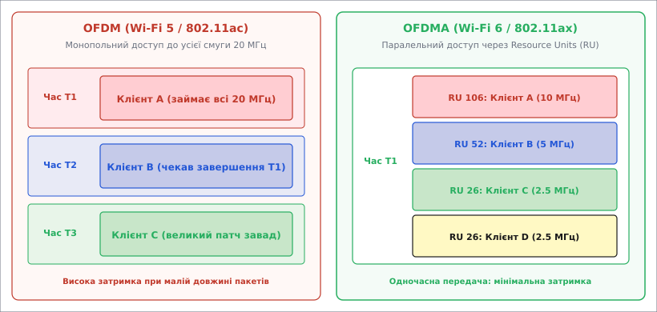
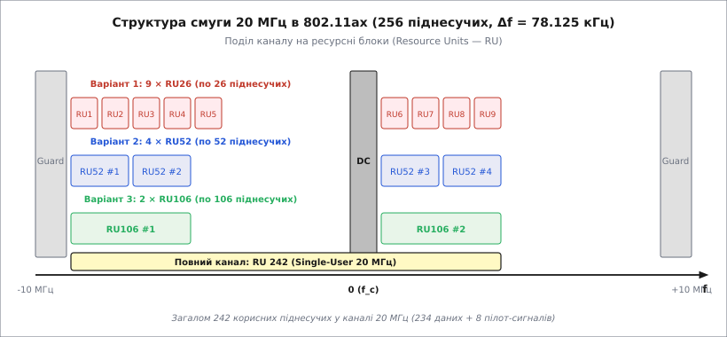
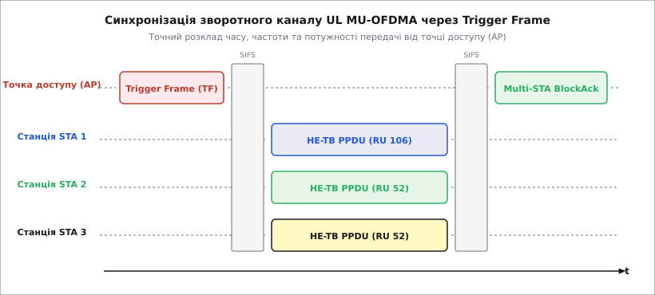
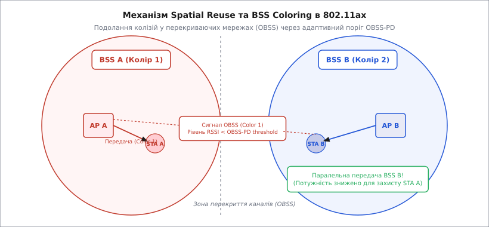

# Основи Wi-Fi 6 (IEEE 802.11ax): Фізичний рівень, OFDMA та радіочастотні механізми High Efficiency

<preknowlist>
- [Радіочастотний модуль](topic:sys-notary/rf-module) — прийомо-передавальний тракт, підсилювачі LNA/PA, гетеродин та змішувач.
- [OFDM (Мультиплексування з ортогональним частотним поділом)](topic:com-modulation/ofdm) — піднесучі, FFT/IFFT, захисний інтервал GI та ортогональність.
- [Затримка поширення та багатопроменевість](topic:com-medium/delay-spread) — затримка сигналу в просторі, міжсимвольна інтерференція (ISI).
- [Кодування з виправленням помилок (FEC)](topic:com-modulation/fec-channel-coding) — завадостійке кодування LDPC, сузір'я QAM та відношення сигнал/шум.
</preknowlist>

Одночасна присутність 100 активних смартфонів у залі очікування аеропорту або багатоквартирному будинку знижує реальну швидкість передачі даних традиційної мережі Wi-Fi 5 (802.11ac) практично до нуля. Навіть якщо точка доступу підтримує теоретичну швидкість `1.3 Гбіт/с`, кожен пристрій змушений вигравати монопольний доступ до всього радіоканалу шириною 20, 40 або 80 МГц задля відправки короткого пакета в пару сотень байт. Захисні паузи, слухання ефіру, преамбули та колізії повторних спроб займають понад `80%` дорогоцінного радіочасу, перетворюючи високошвидкісний радіоканал на нескінченну чергу змушеного очікування.

Для подолання цієї кризи стандартизаційний комітет IEEE розробив стандарт **IEEE 802.11ax**, який отримав комерційну назву **Wi-Fi 6**. Вперше в історії бездротових локальних мереж фокус розробників змістився від збільшення пікової швидкості окремого пристрою в ідеальних лабораторних умовах до забезпечення максимальної сумарної ефективності мережі (High Efficiency Wireless — HEW) та мінімізації затримок у надщільному радіосередовищі.

Детальний аналіз історичної еволюції стандарту та кризи монопольного доступу наведено у вставці [📜 Історія еволюції Wi-Fi: від CSMA/CA 802.11b до High Efficiency 802.11ax](topic:com-modulation/wifi-6-basics/hist-wifi6-evolution.md).

## 1. Фундаментальний зсув парадигми: від OFDM до OFDMA

Головним технологічним досягненням Wi-Fi 6 є перехід від монопольного мультиплексування з ортогональним частотним поділом (OFDM) до мультиплексування з ортогональним частотно-просторовим поділом доступу — **OFDMA (Orthogonal Frequency Division Multiple Access)**.


*Принцип розподілу радіоресурсу: у Wi-Fi 5 (OFDM, зліва) увесь канал 20 МГц віддається одному пристрою на весь час символу T1; у Wi-Fi 6 (OFDMA, справа) канал ділиться за частотою на декілька ресурсних блоків RU, дозволяючи одночасно передавати дані 4 клієнтам у той самий момент часу T1.*

### Фізична природа розділення каналу та криза CSMA/CA

У застарілому режимі OFDM (Wi-Fi 4 та Wi-Fi 5) весь радіочастотний канал шириною 20, 40 або 80 МГц розглядається як неподільний квант ресурсу. Доступ до цього ресурсу регулюється алгоритмом випадкового конкурентного доступу **CSMA/CA (Carrier Sense Multiple Access with Collision Avoidance)**. Згідно з цим протоколом, перш ніж надіслати кадр, пристрій зобов'язаний вислухати радіоефір протягом паузи DIFS/AIFS, а потім вичекати випадкову кількість часових слотів (Backoff Window).

Додатково пристрій перевіряє два види зайнятості середовища:
1. **Physical Carrier Sense (Фізичне слухання):** Оцінка енергії в каналі за допомогою порогу CCA-ED (Clear Channel Assessment Energy Detection, `-62 дБм`) та порогу виявлення преамбули CCA-Preamble (`-82 дБм`).
2. **Virtual Carrier Sensing (Віртуальне слухання):** Відліковий таймер NAV (Network Allocation Vector), який оновлюється з поля Duration заголовока будь-якого чутого кадру.

Якщо в мережі присутні 50 або 100 активних пристроїв, імовірність одночасного завершення паузи двома або більше вузлами наближається до одиниці. Виникає колізія: кадри накладаються в ефірі і спотворюються. Пристрої не отримують підтвердження ACK і змушені подвоювати своє конкурентне вікно (експоненційне збільшення `Contention Window` від `CW_min = 15` до `CW_max = 1023`). У результаті 80-90% радіочасу витрачається не на передачу корисного навантаження, а на мовчазне очікування паузи Backoff та відправку службових преамбул.

Ситуація ускладнюється при передачі коротких пакетів (голосові дані VoIP, підтвердження TCP ACK, ігрові пакети, телеметрія IoT). Передача 40 байт даних вимагає відправки фізичної преамбули тривалістю `20 мкс`, кадру підтвердження BlockAck та дотримання інтервалів SIFS/DIFS. Ефективність використання спектра при цьому падає нижче `10%`.

У режимі OFDMA точка доступу ділить частотний канал на дрібні ортогональні суб-канали — **ресурсні блоки (Resource Units, RU)**. Завдяки цьому точка доступу передає (або приймає) дані від десятків різних пристроїв паралельно в один і той самий момент часу, повністю усуваючи часові простої та колізійне очікування.

### Чотираразове збільшення FFT та тривалість символу

Щоб забезпечити гнучке розбиття каналу на дрібні ресурсні блоки без втрати спектральної ефективності, у 802.11ax було застосовано чотириразове збільшення розміру швидкості перетворення Фур'є (FFT).

Якщо у 802.11ac для каналу 20 МГц використовувалося 64-точкове FFT, то в 802.11ax застосовується **256-точкове FFT**. Це привело до фундаментальних змін часових та частотних параметрів сигналу:
1. **Зменшення відстані між піднесучими:** Відстань `Δf` зменшилася в 4 рази — з `312.5 кГц` до **`78.125 кГц`**.
2. **Збільшення корисної тривалості символу:** Згідно з властивостями перетворення Фур'є, корисний час символу `T_DFT = 1 / Δf` зріс у 4 рази — з `3.2 мкс` до **`12.8 мкс`**.

```
T_DFT = 1 / 78.125 кГц = 12.8 мкс
```

Вибір саме `78.125 кГц` був результат ретельного компромісу: подальше зменшення `Δf` підвищило б чутливість сигналу до фазового шуму гетеродина та Доплерівського зсуву частоти при русі пристроїв, тоді як ширша відстань не дозволила б сформувати компактні ресурсні блоки RU26.

Збільшення корисної тривалості символу до `12.8 мкс` дало вирішальну перевагу при роботі у відкритому просторі (Outdoor) та в приміщеннях із довгими перевідбиттями сигналу. При часовому розкиді затримок багатопроменевого поширення `τ_rms ≈ 500 нс` застарілий захисний інтервал `0.4 мкс` виявлявся недостатнім, що спричиняло міжсимвольну інтерференцію (ISI).

У 802.11ax захисний інтервал (Guard Interval, GI) тривалістю `0.8 мкс`, `1.6 мкс` або `3.2 мкс` додається до тривалого символу `12.8 мкс`. Відсоток накладних витрат на захисний інтервал при цьому становить лише `5.88%` (для GI 0.8 мкс), що майже втричі ефективніше порівняно з застарілими системами.

## 2. Геометрія та розклад Resource Units (RU)

Канал шириною `20 МГц` у 802.11ax містить 256 піднесучих. Після віднімання крайніх захисних піднесучих (Guard Subcarriers, по 5-6 з кожного краю) та центральних несучих постійної складової (DC Subcarriers, 3 піднесучі) залишається **242 корисних піднесучих**.


*Схема розбиття 242 корисних піднесучих у каналі 20 МГц: верхній шар показує максимальну щільність із 9 блоків RU26; середня секція — 4 блоки RU52; нижній шар — 2 блоки RU106 або 1 повний блок RU242 для монопольного доступу.*

### Стандартні розмірності ресурсних блоків

Залежно від потреб пристроїв та ширини каналу, точка доступу може комбінувати наступні типи ресурсних блоків:
- **RU 26 (26 піднесучих, ~2 МГц):** Містить 24 піднесучі даних та 2 пілот-сигнали для відстеження фазового зсуву та канальної оцінки. У каналі 20 МГц розміщується до **9 блоків RU26**, що дозволяє одночасно обслуговувати 9 клієнтів. Ідеально підходить для IoT, голосу (VoIP) та коротких керуючих пакетів.
- **RU 52 (52 піднесучі, ~4 МГц):** 48 даних + 4 пілоти. До **4 клієнтів** у каналі 20 МГц.
- **RU 106 (106 піднесучих, ~8 МГц):** 102 даних + 4 пілоти. До **2 клієнтів** у каналі 20 МГц.
- **RU 242 (242 піднесучі, 20 МГц):** 234 даних + 8 пілотів. Повна смуга 20 МГц для одного клієнта (Single-User або 1-Client MU).
- **RU 484 (484 піднесучі, 40 МГц):** Для каналів 40 МГц (до 2 клієнтів по 20 МГц або 1 клієнт на 40 МГц).
- **RU 996 (996 піднесучих, 80 МГц):** Для каналів 80 МГц (980 піднесучих даних + 16 пілотів).
- **RU 2×996 (1992 піднесучі, 160 МГц):** Для каналів 160 МГц (1960 даних + 32 пілоти).

Математичні рівняння спектральної ефективності, розклад піднесучих та покроковий розрахунок швидкостей наведено у вставці [🧮 Математика OFDMA: розкладання піднесучих, тривалість символу та спектральна ефективність](topic:com-modulation/wifi-6-basics/math-ofdma-ru-timing.md).

## 3. Синхронізований зворотний канал (UL MU-OFDMA) та Trigger Frame

Передача даних у напрямку від точки доступу до клієнтів (Downlink, DL) відносно проста: точка доступу самостійно формує загальний символ OFDMA, розкладаючи дані різних пристроїв по відповідних RU у власному передавачі.

Проте зворотна передача даних від багатьох клієнтів до точки доступу (**Uplink MU-OFDMA**) є складнішою радіоінженерною задачею. Щоб точка доступу змогла успішно прийняти та декодувати кадри від 9 різних смартфонів, передані одночасно на різних RU, ці 9 передавачів повинні бути винятково точно синхронізовані за трьома параметрами:
1. **Синхронізація у часі (Time Alignment):** Сигнали від усіх пристроїв повинні прийти на антени точки доступу в межах вузького захисного інтервалу. Помилка часу прибуття (Time of Arrival, ToA) не повинна перевищувати `±0.4 мкс`, інакше циклічний префікс не зможе компенсувати розсинхронізацію кадрів.
2. **Синхронізація за частотою (Frequency Alignment):** Відхилення несучої частоти генераторів клієнтів (Center Frequency Offset, CFO) не повинно перевищувати **`35 Гц`**. Навіть дрібне відхилення частоти кварцового резонатора смартфона зруйнує ортогональність між сусідніми RU26, викликаючи міжканальне перехресне випромінювання (Inter-Carrier Interference, ICI). Станції підлаштовують свої цифрові синтезатори частоти (PLL) за преамбулою Trigger Frame точки доступу.
3. **Контроль потужності (Power Control):** Потужність сигналу від близьких і далеких клієнтів на вхідному LNA точки доступу повинна бути приблизно однаковою (Target RSSI). Якщо один смартфон знаходиться в 2 метрах від роутера, а інший — за трьома стінами, потужний сигнал близького пристрою засліпить аналогово-цифровий перетворювач (АЦП) приймача, викликавши інтермодуляційні спотворення та перекривши слабкий сигнал віддаленого вузла.


*Часова послідовність UL MU-OFDMA: AP відправляє управляючий кадр Trigger Frame (TF), задаючи точний розклад RU, MCS та потужності. Через інтервал SIFS (16 мкс) станції STA1-STA3 одночасно надсилають свої кадри HE-TB PPDU, після чого AP відповідає єдиним кадром Multi-STA BlockAck.*

Цю синхронізацію виконує спеціальний кадр управління — **Trigger Frame (TF)**. Точка доступу бере на себе роль центрального детермінованого контролера: вона відправляє Trigger Frame, у якому вказує асоційовані ідентифікатори пристроїв (AID), призначені їм індекси RU, дозволені рівні MCS та необхідну випромінювану потужність (Target TX Power). Через строго фіксований інтервал `SIFS = 16 мкс` пристрої синхронно відповідають кадрами у форматі **HE-TB PPDU (Trigger-Based)**.

Після прийому кадру HE-TB PPDU точка доступу підтверджує успішний прийом даних від усіх станцій за допомогою одного групового кадру підтвердження — **Multi-STA BlockAck (M-BA)**.

Реалізація алгоритму розподілу RU в коді детально розглянута у вставці [⚙️ Практична реалізація планувальника RU для Wi-Fi 6](topic:com-modulation/wifi-6-basics/proj-wifi6-ru-scheduler.md).

## 4. Високопорядкова модуляція 1024-QAM та вимоги до радіочастотного тракту

Для вузлів, розташованих поблизу точки доступу в умовах високого відношення сигнал/шум (SNR), Wi-Fi 6 вводить модуляцію **1024-QAM** (MCS 10 та MCS 11).

Перехід від 256-QAM до 1024-QAM дозволяє кодувати **10 біт на один символ** на кожній піднесучій (проти 8 біт у 256-QAM), що дає чисто теоретичний приріст фізичної швидкості на **`25%`**.

```
b = log2(1024) = 10 біт/символ
```

Проте фізична реалізація 1024-QAM висуває екстремальні вимоги до аналогового радіочастотного тракту (RF Front-End):
- **Мінімальне відношення сигнал/шум:** Для стабільного декодування сузір'я з 1024 точок необхідний рівень `SNR ≥ 35 дБ` (проти `30 дБ` для 256-QAM).
- **Векторна амплітуда помилки (EVM):** Специфікація 802.11ax вимагає, щоб коефіцієнт EVM передавача не перевищував **`-35 дБ`** (тобто відносна амплітудна помилка вектора сигналу повинна бути менше `1.78%`).
- **Лінійність підсилювача потужності (PA Backoff):** Сигнал OFDM із 1024-QAM має високий пік-фактор (Peak-to-Average Power Ratio, PAPR > 10 дБ). Підсилювач потужності передавача змушений працювати з великим відступом від точки насичення (Backoff = 10..12 дБ), що знижує ККД передавача та збільшує споживання енергії від батареї.
- **Низький фазовий шум гетеродина:** Будь-які дрібні фазові флуктуації локального осцилятора розмивають точки сузір'я по колу, викликаючи помилки декодування сусідніх станів. Інтегральний фазовий джиттер синтезатора частоти повинен не перевищувати `0.5° RMS`.

> 🔧 **Навіщо це у розробці.**
> При проектуванні радіочастотних плат Wi-Fi 6 використання модуляції 1024-QAM вимагає вибору ВЧ-мікросхем (FEM/PA) з високою точкою стиснення `P1dB` та винятково чистих синтезаторів частоти з фазовим шумом краще `-105 дБк/Гц` на відлаштуванні 10 кГц. В іншому випадку роутер автоматично скине зв'язок до MCS 9 (256-QAM).

## 5. Просторове повторне використання (Spatial Reuse) та BSS Coloring

У багатоквартирних будинках або щільних офісах суміжні точки доступу змушені працювати на однакових частотних каналах через обмеженість спектра. Виникає зона перекриття мереж — **OBSS (Overlapping BSS)**.

У застарілих стандартах Wi-Fi, якщо точка доступу A чула передачу точки доступу B на тому ж каналі з рівнем сигналу вище порогу CCA (Clear Channel Assessment, `-82 дБм`), вона вважала канал зайнятим та блокувала власну передачу. Мережі вишиковувалися в одну загальну чергу.


*Механізм Spatial Reuse: BSS A передає кадр із числовим кодом BSS Color 1. Точка доступу AP B виявляє чужий колір, перемикається на підвищений адаптивний поріг OBSS-PD (-68 дБм) і продовжує паралельну передачу клієнту STA B, адаптивно знижуючи свою потужність.*

### Принцип роботи BSS Coloring

Wi-Fi 6 вирішує цю проблему за допомогою механізму **BSS Coloring ("фарбування" мереж)**:
1. Кожна мережа BSS отримує числовий колірний ідентифікатор — **BSS Color (значення від 1 до 63)**, який додається безпосередньо у PHY-преамбулу кожного каду (поле HE-SIG-A).
2. Коли пристрій приймає преамбулу кадру, він миттєво (за кілька мікросекунд) декодує BSS Color:
   - Якщо колір збігається з кольором рідної мережі — кадр обробляється за стандартним порогом чутливості `CCA = -82 дБм`.
   - Якщо колір чужий (сигнал від сусіднього роутера за стіною) — пристрій класифікує кадр як заваду від OBSS і вмикає алгоритм **Spatial Reuse (SR)**.

### Адаптивний поріг OBSS-PD (OBSS Packet Detection)

При виявленні чужого кольору пристрій тимчасово підвищує поріг виявлення несучої з `-82 дБм` до адаптивного значення **`OBSS-PD`** (наприклад, до `-68 дБм`).

Якщо рівень завади від сусіднього роутера нижче `-68 дБм`, пристрій **ігнорує цю заваду та розпочинає власну передачу паралельно з сусідньою мережею**. Щоб не створити зворотних завад для сусіда, пристрій пропорційно знижує власну випромінювану потужність передавача (`TX Power Control`).

Розрахунок допустимого зниження потужності передачі здійснюється за формулою:

```
P_TX = P_TX_max - ( OBSS_PD - OBSS_PD_min )
```

Це гарантує, що паралельна передача точки доступу B не створить руйнівних завад для станції в мережі A.

## 6. Енергозбереження IoT-пристроїв: Target Wake Time (TWT)

Для мобільних пристроїв та датчиків "інтернету речей" (IoT) критичним параметром є тривалість автономної роботи від батареї.

У застарілих версіях Wi-Fi пристрої в режимі енергозбереження (Power Save) були змушені прокидатися кожні 100–300 мс для прийому маякових кадрів (Beacon Frames) та кадру розкладки трафіку DTIM. Це призводило до марного розходу батареї.

### Механізм TWT (Target Wake Time)

Wi-Fi 6 впровадив принципово новий механізм узгодження розкладу — **Target Wake Time (TWT)**:
- Точка доступу та клієнтський пристрій у процесі узгодження домовляються про строго індивідуальний (або груповий) розклад пробудження.
- Клієнт може заснути у глибокий режим сну на кілька хвилин, годин або навіть днів.
- Точка доступу накопичує пакети для цього пристрою у своєму буфері та не відправляє їх до настання строго визначеного мікросекундного вікна TWT.
- У призначений момент пристрій прокидається, за один короткий сеанс OFDMA обмінюється даними з точкою доступу і знову негайно занурюється у глибокий сон.

Розрізняють три режими TWT:
1. **Individual TWT:** Індивідуальне узгодження вікна між точкою доступу та однією конкретною станцією.
2. **Broadcast TWT:** Точка доступу оголошує загальний розклад пробудження для групи IoT-датчиків (наприклад, раз на 10 хвилин).
3. **Unsolicited TWT:** Точка доступу примусово надсилає розклад пристроям без їхнього попереднього запиту.

Це дозволило зменшити споживання енергії бездротового модуля в десятки разів і забезпечити роки роботи сенсорів від однієї батарейки CR2032.

## 7. Кадрові формати PPDU та робота у діапазоні 6 ГГц (Wi-Fi 6E)

Стандарт 802.11ax ввів нове сімейство фізичних кадрів — **HE PPDU (High Efficiency PLCP Protocol Data Unit)**:
- **HE-SU PPDU:** Кадр для одиночної передачі одному пристрою у повній смузі (Single-User).
- **HE-MU PPDU:** Мультикористувацький кадр DL-OFDMA та DL MU-MIMO, що містить службове поле **HE-SIG-B** із картою розподілу RU для кожного пристрою.
- **HE-TB PPDU (Trigger-Based):** Кадр синхронізованої зворотної передачі UL-OFDMA у відповідь на Trigger Frame.
- **HE-ER PPDU (Extended Range):** Кадр розширеного радіусу дії з дублюванням сигналів у преамбулі для стійкого зв'язку на великих відстанях.

### Поля фізичної преамбули HE PPDU

Фізична преамбула кадру 802.11ax містить два блоки:
1. **Legacy-сумісна преамбула (L-STF, L-LTF, L-SIG, RL-SIG):** Дозволяє застарілим пристроям 802.11a/g/n/ac декодувати тривалість кадру та оновити свій таймер NAV.
2. **HE-специфічна преамбула (HE-SIG-A, HE-SIG-B, HE-STF, HE-LTF):** Передає розклад BSS Color, ширину каналу, маску MCS, схему кодування LDPC та індивідуальні карти виділення RU.

### Wi-Fi 6E: Відкриття спектра 6 ГГц

Останнім етапом розвитку 802.11ax стало створення розширення **Wi-Fi 6E** (Extended).

Класичний Wi-Fi 6 працює у звичних діапазонах `2.4 ГГц` та `5 ГГц`. Проте діапазон 2.4 ГГц зашумлений застарілими пристроями, а у 5 ГГц смуга частот обмежена і вимагає застосування механізмів динамічного вибору частоти (DFS) через наявність метеорологічних радарів.

У 2020 році регулятори виділили під неліцензоване використання новий частотний діапазон **`5.925…7.125 ГГц`** шириною `1200 МГц`.

Особливості Wi-Fi 6E:
- **Відсутність застарілих пристроїв (No Legacy Devices):** У діапазоні 6 ГГц заборонено роботу пристроїв 802.11a/b/g/n/ac. Усі кадрові преамбули передаються виключно у форматі HE PPDU, що усуває накладні витрати на сумісність.
- **Величезна місткість спектра:** 1200 МГц додаткового спектра дозволили розмістити **59 нових каналів по 20 МГц** або **7 суцільних неперекриваючих каналів шириною 160 МГц**.
- **Відсутність DFS-радарів:** Усі канали в 6 ГГц доступні без пауз на сканування військових чи метеорологічних радарів.

Параметри низькорівневого налаштування ядра Linux та розклад схем кодування MCS наведено у вставці [📋 Інтерфейс конфігурації nl80211/mac80211 для 802.11ax](topic:com-modulation/wifi-6-basics/api-nl80211-he-config.md).
