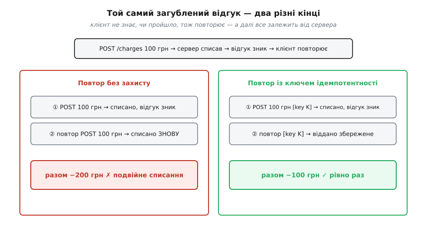
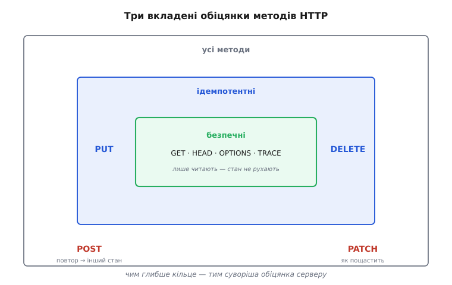
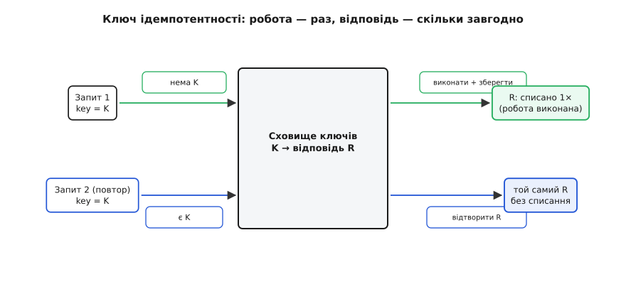

# Ідемпотентність методів як частина контракту

<preknowlist>
- [REST](root:com-protocol/rest-api) — ресурси й HTTP-методи (GET, POST, PUT, DELETE), модель «запит → відповідь». Без цього словника далі нема про що говорити.
- [Ідемпотентність](root:sf-distributed/idempotency) — сама властивість «зроби раз чи сто разів — стан однаковий»; тут беремо її вужче, як обіцянку конкретного HTTP-методу.
</preknowlist>

Уяви найбуденнішу невдачу в мережі. Клієнт шле на сервер «спиши 100 грн», сервер приймає запит, списує гроші, формує відповідь «готово» — і саме тут між ними обривається зв'язок. Відповідь не доходить. Клієнт бачить лише таймаут і не знає головного: **чи сталося списання?** Може, запит згинув дорогою й гроші на місці. А може, сервер усе зробив, і зникла тільки відповідь. Ззовні ці два випадки нерозрізненні — байт, що не прийшов, виглядає однаково, хоч би де він загубився.

І тепер клієнт стоїть перед вибором, у якому обидві дороги погані. Повторити запит — і якщо перший таки пройшов, спишемо 100 грн двічі. Не повторювати — і якщо перший загинув, платіж не відбудеться зовсім. Мережа загнала нас у безвихідь не тому, що ми написали кепський код, а тому, що [часткова відмова — це норма розподіленої системи](root:sf-distributed/distributed-fallacies), а не рідкісний збій: між двома машинами завжди є проміжок, де повідомлення могло пройти або ні, і жодна зі сторін не бачить цього проміжку.

Ідемпотентність — це саме та властивість, що перетворює цю безвихідь на дрібницю. Якщо повторити операцію **безпечно** — тобто повтор нічого не зіпсує, — то на таймаут є проста відповідь: шли ще раз, скільки треба, доки не дістанеш чітку відповідь. Питання «а раптом перший уже пройшов?» просто перестає бути питанням, бо другий, третій і десятий виклик лишають систему в тому самому стані, що й перший. Уся конструкція надійних повторів у мережі стоїть на цьому фундаменті.



*Загублена відповідь виглядає однаково незалежно від того, пройшла операція чи ні. Ідемпотентність робить безпечним єдиний хід, який клієнтові лишається, — повторити.*

## Що таке ідемпотентність — точно

Слово склали з латини: *idem* — «те саме» — і *potens* — «сила», «здатність». «Та сама сила»: скільки не підноси до степеня — результат не рухається. Термін увів математик Бенджамін Пірс 1870 року в книжці «Linear Associative Algebra», описуючи елементи алгебри, для яких x·x = x — як-от 1 (бо 1·1 = 1) чи 0. Згодом значення переповзло в інформатику майже незміненим.

Операція **ідемпотентна**, якщо застосувати її раз чи багато разів поспіль дає **той самий стан системи**, що й один-єдиний раз:

```
f(f(x)) = f(x)
```

Тут криється тонкість, через яку плутаються найчастіше. Ідемпотентність — про **стан на сервері після операції**, а не про **відповідь, яку бачить клієнт**. Це різні речі, і їх легко переплутати.

Візьмімо видалення. Клієнт двічі шле `DELETE /users/42` (мережа змусила повторити):

```
крок 1   DELETE /users/42   → видалено          → 200 OK
крок 2   DELETE /users/42   → уже немає          → 404 Not Found
стан:    користувача 42 немає — однаковий після кроку 1 і після кроку 2
```

Відповіді **різні**: перша каже «видалив», друга — «немає такого». Та стан сервера після обох кроків **тотожний**: користувача 42 не існує. Саме стан і важить — тому DELETE ідемпотентний, попри те що друга відповідь інша. Клієнт, що отримав 404 після повтору, не має лякатися: 404 тут означає «уже зроблено», а не «зламалося».

> 🔧 **Навіщо це.** Коли пишеш клієнт із повторами, не звіряй успіх лише за кодом відповіді повтору. Повторний DELETE, що дав 404, і повторний PUT, що дав 200, обидва означають «бажаний стан досягнуто». Плутанина «різна відповідь = різний результат» породжує фальшиві помилки там, де насправді все гаразд.

Поряд стоїть іще одна властивість — **безпечність** (safe). Безпечний метод не міняє стану сервера **взагалі**: він тільки читає. GET, HEAD, OPTIONS, TRACE — саме такі. Кожен безпечний метод автоматично ідемпотентний (зробити «нічого» сто разів — те саме, що зробити «нічого» раз), але навпаки не працює: DELETE стан міняє, проте лишається ідемпотентним. Безпечність — суворіша обіцянка, ідемпотентність — слабша, і одна вкладена в іншу.

## Контракт HTTP: хто що обіцяє

Найважливіше в цій темі не сама властивість, а те, що для HTTP вона **записана в специфікації**. RFC 9110 (червень 2022, що замінив давніші RFC 2616 і RFC 7231) прямо приписує кожному методу його вдачу. Це не порада й не стиль — це **контракт**, на який спираються всі учасники розмови.

Розклад методів такий:

```
GET · HEAD · OPTIONS · TRACE   безпечні (нічого не міняють) → і тому ідемпотентні
PUT · DELETE                   ідемпотентні (міняють стан, та повтор веде в той самий)
POST                           НЕ ідемпотентний — кожен виклик задумано як окрему дію
PATCH                          НЕ гарантовано ідемпотентний — залежить від того, що всередині
```



*Безпечні методи — підмножина ідемпотентних, а не окремий клас. POST і PATCH лишаються поза колом: їхній повтор може дати інший стан.*

Чому PUT ідемпотентний, а POST — ні, видно з їхнього змісту. **PUT** означає «нехай ресурс за цією адресою стане ось таким». Присвоєння: постав `X` раз чи тричі — там усе одно `X`. **POST** означає «створи новий підпорядкований ресурс» або «додай». Виклич двічі — дістанеш два.

```
крок 1   PUT /users/42   {name:"Іван", city:"Львів"}   → 42 = {Іван, Львів}   → 200
крок 2   PUT /users/42   {name:"Іван", city:"Львів"}   → 42 = {Іван, Львів}   → 200
стан:    запис 42 = {Іван, Львів} — той самий після 1 і після 2   (ідемпотентно)

крок 1   POST /orders    {товар:"книга"}   → створено замовлення #1001   → 201
крок 2   POST /orders    {товар:"книга"}   → створено замовлення #1002   → 201
стан:    два замовлення на одну книгу   (не ідемпотентно)
```

PATCH стоїть окремо, бо він описує **зміну**, а не кінцевий стан, і чи буде він ідемпотентним, вирішує форма цієї зміни. PATCH «встанови поле `city` на `Львів`» — ідемпотентний (присвоєння). PATCH «додай 10 до балансу» — ні (кожен виклик додає ще десять). Тому специфікація й не дає йому гарантії наперед: вона є в того, хто пише обробник.

## Чому це «контракт», а не деталь реалізації

Слово «контракт» тут не окраса. Ідемпотентність — обіцянка, на яку спираються **сторонні учасники, що ніколи не бачили твого коду** — лише метод у запиті.

Розглянь, хто читає цей контракт по всьому шляху запиту:

- [Бібліотека повторів](root:sf-distributed/retries-backoff) сама повторить GET, PUT чи DELETE після [таймауту](root:sf-distributed/timeouts-deadlines), але **відмовиться** автоматично повторювати POST — саме тому браузер на повторне надсилання форми питає «надіслати дані ще раз?». Він не знає твоєї логіки; він знає лише, що POST не обіцяв безпечного повтору.
- Кешувальний проксі може закешувати відповідь GET, бо GET обіцяв нічого не міняти.
- Пошуковий робот вільно ходить за GET-посиланнями, вважаючи їх безпечними для читання.

І ось де контракт кусає того, хто його порушив. Травень 2005-го, Google випускає Web Accelerator — надбудову, що прискорювала перегляд, наперед завантажуючи посилання на сторінці. Деякі вебзастосунки тоді ховали дію «видалити» за звичайним GET-посиланням виду `<a href="/delete?id=5">`. Прискорювач, чесно дотримуючись контракту «GET безпечний», передзавантажував ці посилання — і мовчки видаляв дані користувачів; у сервісі Backpack від 37signals сторінки почали зникати самі собою. Помилки в прискорювачі не було: він **довіряв контракту**. Помилка була в застосунку, що цей контракт зламав — поставив зміну стану за метод, який присягав нічого не міняти.

Ось у чому глибина. Ідемпотентність і безпечність — це **спільна угода** всього шляху запиту, а не приватна деталь твого обробника. Порушиш її на своєму боці — і інструменти, що на неї покладалися, зламаються так, як ти не передбачиш, бо вони ніколи не заглядають усередину сервера: вони бачать тільки метод і вірять його обіцянці.

> 🔧 **Навіщо це.** Практичне правило випливає прямо звідси: **жодної зміни стану за GET**. Вихід із сеансу, підтвердження, видалення — це POST/DELETE, а не посилання-GET. Інакше перший-ліпший передзавантажувач, антивірус, що «перевіряє» посилання в листі, чи прев'ю-бот у месенджері зробить дію за твого користувача, без кліку й без наміру.

## Коли операція за природою не ідемпотентна: ключ ідемпотентності

Списати гроші, створити замовлення, додати до балансу — операції, ідемпотентними яких їх **не зробити оголошенням**. POST не стане PUT від того, що ми так захотіли: два замовлення — це справді два замовлення. Але ту саму безвихідь із таймаутом, з якої почалася розмова, можна прибрати з іншого боку — зробити операцію ідемпотентною **з погляду клієнта**, навіть якщо вона не така за суттю.

Робить це **ключ ідемпотентності** (idempotency key). Клієнт генерує унікальний ключ — зазвичай UUID четвертої версії, випадковий рядок із достатньою ентропією, щоб не збігтися з чужим, — і кладе його в заголовок запиту:

```
POST /charges
Idempotency-Key: 9f8c2b1e-4a77-4e2f-9d3a-6b0c1e5f8a21
{amount: 100}
```

Сервер запам'ятовує: «для ключа K я вже зробив роботу й повернув відповідь R». На повторі з тим самим K він **віддає ту саму R, не виконуючи роботу вдруге**. Списання стається рівно раз, скільки б разів клієнт не надіслав запит через утрачені відповіді. Саме цю домовленість популяризувала платіжна система [Stripe](root:sys-notary/payments-integration), де ключі живуть близько доби; звідти заголовок `Idempotency-Key` розійшовся як фактичний стандарт для платежів та інших небезпечних для повтору дій.



*Сховище ключів робить із повтору не другу дію, а другу видачу того самого результату. Робота коштує один раз, відповідь — скільки завгодно.*

Ось кістяк обробника: перевір ключ, і якщо він новий — зроби роботу й збережи результат; якщо вже бачений — поверни збережене.

:::tabs
```ts
async function handleCharge(req, res) {
  const key = req.header("Idempotency-Key");
  if (!key) return res.status(400).send("потрібен Idempotency-Key");

  // Атомарно: або застовпили ключ за собою, або дізналися, що він уже є.
  const claimed = await store.insertIfAbsent(key);   // false, якщо ключ уже був
  if (!claimed) {
    const saved = await store.getResult(key);         // це повтор
    return res.status(saved.status).json(saved.body); // та сама відповідь
  }

  const result = await charge(req.body.amount);       // робота — рівно раз
  await store.saveResult(key, result);
  return res.status(result.status).json(result.body);
}
```
```py
async def handle_charge(request):
    key = request.headers.get("Idempotency-Key")
    if not key:
        return Response("потрібен Idempotency-Key", status=400)

    # Атомарно: або застовпили ключ за собою, або дізналися, що він уже є.
    claimed = await store.insert_if_absent(key)   # False, якщо ключ уже був
    if not claimed:
        saved = await store.get_result(key)        # це повтор
        return Response(saved.body, status=saved.status)

    result = await charge(request.json["amount"])  # робота — рівно раз
    await store.save_result(key, result)
    return Response(result.body, status=result.status)
```
:::

Уся правильність тримається на одному слові — **атомарно**. Два повтори можуть прилетіти в один і той самий момент (клієнт не дочекався й натиснув ще раз, поки перший запит іще в дорозі). Якщо обидва спершу спитають «бачили K?» — обидва почують «ні» — обидва виконають списання. Це рівно та подвійна дія, від якої ми тікали. Рятує єдине: перевірка й запис ключа мають бути **однією неподільною дією**. На практиці це [унікальне обмеження](root:sf-data/transactions-acid) на стовпець ключа в сховищі: перший `INSERT` виграє, другий падає на порушенні унікальності — і програвач не виконує роботу, а чекає чи віддає результат переможця. Без цієї атомарності ключ ідемпотентності стає діркою, що вдає захист.

Спрощений кістяк вище лишає осторонь стан «уже в роботі» (коли переможець ще рахує, а програвач уже прийшов за результатом, якого ще немає), строк життя ключа й звірку тіла запиту з ключем. Це не дрібниці, а серце надійної реалізації — [повний робочий обробник із гонками, TTL і повторним відтворенням відповіді](root:com-protocol/api-idempotency/proj-idempotency-key.md) винесено окремо.

## Що легко зламати

Ідемпотентність не з'являється сама — її треба **зберегти** в кожному обробнику, і зламати її просто.

- **PUT, що дописує в список,** — не ідемпотентний: другий виклик додасть другий елемент. Це POST у масці PUT.
- **DELETE, що зменшує лічильник,** — не ідемпотентний: кожен виклик віднімає ще одиницю, тоді як справжній DELETE лише переводить ресурс у стан «немає».
- **«Додай 10 до балансу»** — не ідемпотентний за задумом. Ніяке оформлення методу цього не змінить; тут потрібен ключ.
- **GET із побічною дією** (вихід із сеансу, «видалити» посиланням) — ламає безпечність і веде прямо в пастку передзавантажувача.

І навпаки — одна поширена паніка **не** є порушенням. RFC прямо каже: властивість стосується лише **наміру, який запросив клієнт**, а не кожного внутрішнього байта. Якщо PUT принагідно оновлює `updated_at = now()` чи пише рядок у журнал, це **побічний облік сервера**, а не той стан, що його просив клієнт, — тож PUT лишається ідемпотентним у сенсі контракту, хоч мітка часу й різна після кожного виклику. Ідемпотентність — про бажаний результат, не про журнали й службові поля.

Отут і сходяться два боки цієї теми. Там, де ідемпотентність вдається **структурно** — у GET, PUT, DELETE, — ти просто зобов'язаний її не зіпсувати, бо на неї вже покладається весь шлях запиту. Там, де вона неможлива за природою — у платежах, замовленнях, нарахуваннях, — ти **докуповуєш** її ключем ідемпотентності. І в тому, і в тому випадку це та сама обіцянка: «повтори, скільки треба, — гірше не буде». Обіцянка, яку читає й на яку розраховує кожен, хто торкається запиту між клієнтом і базою.
