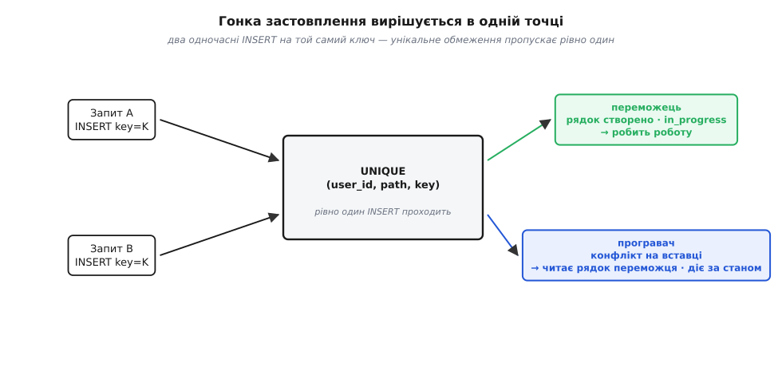
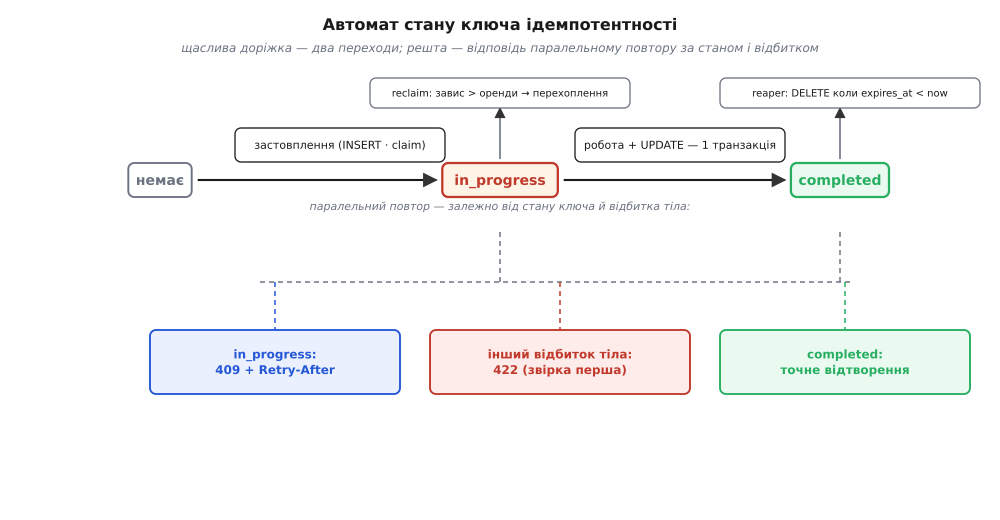

# ⚙️ Робочий обробник ключа ідемпотентності

Кістяк обробника ключа влазить у півекрана: спитай, чи бачив ключ; новий — зроби роботу й збережи; бачений — віддай збережене. Він правильний рівно доти, доки в системі один запит за раз і нічого не падає. У виробництві не буває ні того, ні того. Клієнт, що не дочекався відповіді, тисне «ще раз», поки перший запит іще в дорозі, — і два обробники прокидаються на той самий ключ в одну мілісекунду. Процес, що взявся за роботу, падає посередині — між списанням і збереженням результату. Той самий ключ прилітає з іншим тілом — випадково чи зловмисно. Минає доба — і сховище ключів, якщо його не чистити, з'їдає диск.

Тут ми зберемо обробник, який тримає всі ці випадки. Він робить шість речей, і жодну не можна викинути:

1. **Атомарно застовплює ключ** — так, щоб із двох одночасних запитів рівно один став переможцем.
2. **Веде ключ по скінченному автомату** станів: `in_progress → completed`, і знає, що відповісти на повтор, поки переможець іще рахує.
3. **Звіряє відбиток тіла** запиту, щоб той самий ключ не проніс під собою іншу операцію.
4. **Виконує ефект рівно раз** і завершує ключ **атомарно з ефектом**.
5. **Точно відтворює відповідь** — статус, тіло, потрібні заголовки — байт у байт.
6. **Обмежує строк життя** ключа й прибирає протухле.

Уся конструкція тримається на одному слові — **атомарність застовплення**. Якщо цей крок неатомарний, решта п'ять — театр: захист, що вдає захист. Тому почнемо зі сховища й того єдиного місця, де вирішується гонка.

## Схема сховища: одне обмеження, що робить усю роботу

```sql
CREATE TABLE idempotency_keys (
    user_id          text        NOT NULL,   -- власник ключа
    request_path     text        NOT NULL,   -- ендпоінт, до якого ключ прив'язаний
    key              text        NOT NULL,   -- сам Idempotency-Key від клієнта
    request_hash     bytea       NOT NULL,   -- відбиток тіла запиту (SHA-256)
    state            text        NOT NULL    -- автомат: лише два стани
                     CHECK (state IN ('in_progress', 'completed')),
    response_status  int,                     -- заповнюється при 'completed'
    response_headers jsonb,                   -- відібрані заголовки для відтворення
    response_body    bytea,                   -- ТОЧНІ байти відповіді
    locked_at        timestamptz NOT NULL DEFAULT now(),  -- коли взято claim (оренда)
    completed_at     timestamptz,
    expires_at       timestamptz NOT NULL,    -- доки ключ живий (вікно повторів клієнта)
    PRIMARY KEY (user_id, request_path, key)
);

CREATE INDEX idempotency_keys_expiry ON idempotency_keys (expires_at);
```

Кожен стовпець тут заслужив своє місце, але серце таблиці — `PRIMARY KEY (user_id, request_path, key)`. Це не просто спосіб знайти рядок швидко. Первинний ключ — це **унікальне обмеження**, а унікальне обмеження в базі даних — це апаратна гарантія «двох таких рядків не буде ніколи». Саме воно, а не наш код, розсудить одночасні запити. Усе інше в схемі обслуговує цю ідею.

Чому ключ складений із трьох стовпців, а не з самого `key`? Бо `Idempotency-Key` придумує клієнт, і два різні клієнти можуть згенерувати той самий рядок (малоймовірно для UUIDv4, та не неможливо, а дехто шле й не-UUID). Прив'язавши ключ до `user_id`, ми робимо простір ключів приватним для кожного: твій ключ не зіткнеться з чужим. Додавши `request_path`, ловимо ще й помилку клієнта, що вжив той самий ключ на іншому ендпоінті. Область дії ключа — частина його змісту, і схема цю область фіксує.

`state` із перевіркою `CHECK (state IN ('in_progress','completed'))` — це алфавіт нашого автомата, вписаний прямо в базу. База не дасть записати стан поза автоматом навіть через баг у коді.

> 🔧 **Навіщо це.** Розкладати відповідь на три окремі стовпці — `response_status`, `response_headers`, `response_body` — а не зберігати «готовий об'єкт відповіді» одним блобом, треба тому, що відтворення мусить бути точним на рівні протоколу HTTP, а не на рівні твоєї моделі. Статус `201` проти `200`, заголовок `Location`, точні байти тіла — усе це клієнт побачить і на це покладеться. Збережеш «доменний об'єкт» замість HTTP-відповіді — і при відтворенні перезбереш його наново, ризикуючи, що новий серіалізатор дасть інші байти. Зберігаєш саме те, що пішло по дроту.

## Ідея: уся правильність — в одному INSERT

Спокуса написати перевірку ключа «природно» — спочатку `SELECT`, чи є ключ, а якщо нема, то `INSERT` — і в ній похована та сама гонка, від якої ми тікаємо. Два запити роблять `SELECT` одночасно, обидва бачать «нема», обидва йдуть виконувати. Проміжок між читанням і записом — це вікно, у яке провалюється подвійне списання. Розрив «перевір, тоді дій» ([check-then-act](root:sf-tasks/atomicity-races) — класичне джерело гонок: між перевіркою і дією стан устигає змінитися) не закрити ніякою пильністю коду, бо він структурний.

Закриває його база — одним неподільним ходом. `INSERT` із унікальним обмеженням **сам є** перевіркою й дією разом: спроба вставити рядок або створює його (ключ був вільний), або падає на порушенні унікальності (ключ уже зайнятий). Проміжку між «перевірити» і «зайняти» немає — це одна операція, яку база проводить під захистом [транзакційної атомарності](root:sf-data/transactions-acid) (властивість «усе або нічого»: операція або відбувається цілком, або не відбувається зовсім). Двоє одночасних `INSERT` на той самий ключ конкурують на [унікальному індексі](root:sf-data/database-indexes) первинного ключа: один вставляє рядок, другий гарантовано отримує конфлікт. Переможець рівно один — і його обрала база, а не наш `if`.

Тонкість, яку тут варто назвати вголос: для цього **не потрібен найсуворіший рівень ізоляції**. Багато хто, почувши «гонка», тягнеться по `SERIALIZABLE`. Але правильність застовплення дає не рівень [ізоляції транзакцій](root:sf-data/isolation-levels) (наскільки одна транзакція бачить незавершені зміни інших), а сам унікальний індекс. `READ COMMITTED` — дефолт більшості баз — цілком достатній: другий `INSERT` або побачить уже зафіксований рядок першого й конфліктне, або дочекається завершення першої транзакції на замку індексного запису й конфліктне тоді. У жодному разі другого рядка не з'явиться. Атомарність нам дарує обмеження, а не режим ізоляції, — і це робить рішення дешевим.



*Уся гонка вирішується в одній точці — на унікальному обмеженні. Переможець вставив рядок; програвач не робить роботи, а читає рядок переможця й діє за його станом.*

## Крок 1 — відбиток тіла запиту

Перш ніж застовплювати ключ, порахуємо **відбиток** тіла запиту — короткий рядок фіксованої довжини, що однозначно представляє байти. Порахуємо його [криптографічною гешфункцією](root:sf-security/cryptographic-hash) (перетворення, що з будь-яких даних дає короткий відбиток; та сама вхідна послідовність завжди дає той самий відбиток, а будь-яка зміна вхідних байтів із переважною ймовірністю дає інший) — SHA-256. Навіщо: клієнт, що правильно повторює запит, шле **ті самі** байти під тим самим ключем — відбитки збігаються. А от ключ, під яким проносять **інше** тіло («спиши 100» тепер стало «спиши 10000»), — це або баг клієнта, що переставляє ключі, або спроба зловживання. Такий запит треба відхилити, а не мовчки віддати стару відповідь на нове тіло.

У відбиток кладемо не лише тіло, а й метод із шляхом — щоб зафіксувати весь контекст операції:

:::tabs
```ts
import { createHash } from "crypto";

function fingerprint(method: string, path: string, rawBody: Buffer): Buffer {
  return createHash("sha256")
    .update(method).update("\n")
    .update(path).update("\n")
    .update(rawBody)          // ТОЧНІ байти, як їх отримав сервер
    .digest();                // 32 байти — це й лягає в request_hash BYTEA
}
```
```py
import hashlib

def fingerprint(method: str, path: str, raw_body: bytes) -> bytes:
    h = hashlib.sha256()
    h.update(method.encode()); h.update(b"\n")
    h.update(path.encode());   h.update(b"\n")
    h.update(raw_body)         # ТОЧНІ байти, як їх отримав сервер
    return h.digest()          # 32 байти — це й лягає в request_hash BYTEA
```
```go
func fingerprint(method, path string, body []byte) []byte {
    h := sha256.New()
    h.Write([]byte(method))
    h.Write([]byte("\n"))
    h.Write([]byte(path))
    h.Write([]byte("\n"))
    h.Write(body)              // ТОЧНІ байти, як їх отримав сервер
    return h.Sum(nil)          // 32 байти — це й лягає в request_hash BYTEA
}
```
:::

Пастка тут одна, зате підступна: **що саме гешувати**. Якщо взяти вже розібраний і назад серіалізований JSON, то будь-який проміжний вузол, який переставить поля місцями чи прибере пробіли, зсуне відбиток — і чесний повтор дістане фальшивий `422`. Тому гешуємо **сирі байти тіла, як їх отримав твій сервер** (`rawBody` — до розбору JSON). Клієнт при повторі надсилає той самий рядок байтів, тож відбитки збігаються. Якщо між клієнтом і тобою є проксі, що переписує тіло, — або гешуй після нього (на своєму боці), або домовляйся про канонічну форму (відсортовані ключі) до гешування. Сирі байти на вході обробника — найпростіший надійний вибір.

## Крок 2 — атомарне застовплення (claim)

Ось те саме серце. Одна вставка з `ON CONFLICT DO NOTHING ... RETURNING` робить обидві справи: намагається зайняти ключ і повідомляє, чи це вдалося. Якщо повернувся рядок — ми переможці, ключ наш. Якщо не повернувся жоден — ключ уже хтось зайняв, і ми йдемо його прочитати.

:::tabs
```ts
type Claim = { won: true } | { won: false; row: KeyRow };

async function claim(
  db: Pool, key: string, userId: string, path: string,
  hash: Buffer, expiresAt: Date,
): Promise<Claim> {
  const ins = await db.query(
    `INSERT INTO idempotency_keys
        (user_id, request_path, key, request_hash, state, expires_at)
     VALUES ($1, $2, $3, $4, 'in_progress', $5)
     ON CONFLICT (user_id, request_path, key) DO NOTHING
     RETURNING key`,
    [userId, path, key, hash, expiresAt],
  );
  if (ins.rowCount === 1) return { won: true };   // рядок створено — claim наш

  const sel = await db.query(
    `SELECT state, request_hash, response_status, response_headers, response_body
       FROM idempotency_keys
      WHERE user_id = $1 AND request_path = $2 AND key = $3`,
    [userId, path, key],
  );
  return { won: false, row: sel.rows[0] };        // ключ уже був — ось він
}
```
```py
async def claim(conn, key, user_id, path, req_hash, expires_at):
    inserted = await conn.fetchrow(
        """
        INSERT INTO idempotency_keys
            (user_id, request_path, key, request_hash, state, expires_at)
        VALUES ($1, $2, $3, $4, 'in_progress', $5)
        ON CONFLICT (user_id, request_path, key) DO NOTHING
        RETURNING key
        """,
        user_id, path, key, req_hash, expires_at,
    )
    if inserted is not None:
        return True, None                     # рядок створено — claim наш

    row = await conn.fetchrow(
        """
        SELECT state, request_hash, response_status, response_headers, response_body
        FROM idempotency_keys
        WHERE user_id = $1 AND request_path = $2 AND key = $3
        """,
        user_id, path, key,
    )
    return False, row                         # ключ уже був — ось він
```
```go
func claim(ctx context.Context, db *sql.DB, k keyID, hash []byte, exp time.Time) (bool, *keyRow, error) {
    var scanned string
    err := db.QueryRowContext(ctx,
        `INSERT INTO idempotency_keys
            (user_id, request_path, key, request_hash, state, expires_at)
         VALUES ($1, $2, $3, $4, 'in_progress', $5)
         ON CONFLICT (user_id, request_path, key) DO NOTHING
         RETURNING key`,
        k.userID, k.path, k.key, hash, exp,
    ).Scan(&scanned)
    switch {
    case err == nil:
        return true, nil, nil                 // рядок створено — claim наш
    case !errors.Is(err, sql.ErrNoRows):
        return false, nil, err                // справжня помилка БД
    }
    // ErrNoRows == конфлікт: ключ уже є, читаємо його
    row := &keyRow{}
    err = db.QueryRowContext(ctx,
        `SELECT state, request_hash, response_status, response_headers, response_body
           FROM idempotency_keys
          WHERE user_id = $1 AND request_path = $2 AND key = $3`,
        k.userID, k.path, k.key,
    ).Scan(&row.state, &row.hash, &row.status, &row.headers, &row.body)
    return false, row, err
}
```
:::

Go тут особливо чесний до суті: `RETURNING` при вдалій вставці повертає рядок, а при конфлікті `DO NOTHING` — жодного, тож `QueryRow(...).Scan(...)` віддає `sql.ErrNoRows`. Ця єдина розвилка `err == nil` проти `ErrNoRows` і є двома результатами гонки, названими прямо. У всіх трьох мовах ми **не** покладаємося на `SELECT` перед `INSERT` — читаємо рядок лише **після** того, як програли застовплення, коли рядок переможця вже гарантовано існує й зафіксований.

Зверни увагу: застовплення фіксується **своєю окремою транзакцією** (одинична вставка комітиться сама). Це навмисно: рядок `in_progress` мусить стати видимим для інших запитів **негайно**, ще до того, як переможець закінчить роботу. Інакше паралельний повтор не побачить, що робота вже триває, і не зможе відповісти на неї осмислено. Видимість `in_progress` — те, на чому стоїть наступний крок.

## Крок 3 — скінченний автомат стану ключа

Програвши застовплення, обробник дивиться на прочитаний рядок і вирішує долю повтору за станом ключа. Це і є [скінченний автомат](root:sf-apps/state-machine-model) (модель, де система завжди в одному з кількох станів і переходить між ними за подіями): у ключа лише два стани, `in_progress` і `completed`, а розвилок на повтор — три.



*Щаслива доріжка — два переходи вгорі. Усе інше — відповіді паралельному повтору залежно від стану ключа та відбитка тіла, плюс два способи вийти зі стану: протухання і повернення завислого.*

Ось повний обробник, що зводить застовплення й автомат докупи:

:::tabs
```ts
async function handleCharge(req, res) {
  const key = req.get("Idempotency-Key");
  if (!key || !KEY_RE.test(key))
    return res.status(400).json({ error: "потрібен коректний Idempotency-Key" });

  const userId = req.auth.userId;
  const path = req.path;
  const raw: Buffer = req.rawBody;                     // ТОЧНІ байти, як прийшли
  const hash = fingerprint(req.method, path, raw);
  const expiresAt = new Date(Date.now() + KEY_TTL_MS);

  const c = await claim(pool, key, userId, path, hash, expiresAt);

  if (!c.won) {
    const row = c.row;
    if (!row.request_hash.equals(hash))                // той самий ключ, інше тіло
      return res.status(422).json({ error: "Idempotency-Key уже вжито з іншим тілом запиту" });
    if (row.state === "in_progress") {                 // переможець ще рахує
      res.set("Retry-After", "1");
      return res.status(409).json({ error: "запит із цим ключем ще виконується" });
    }
    return send(res, toStored(row), true);             // completed → точне відтворення
  }

  const stored = await runOnce(pool, key, userId, path, JSON.parse(raw.toString()));
  return send(res, stored, false);                     // свіжий результат — рівно раз
}
```
```py
async def handle_charge(request):
    key = request.headers.get("Idempotency-Key")
    if not key or not KEY_RE.match(key):
        return json_resp({"error": "потрібен коректний Idempotency-Key"}, 400)

    user_id = request["user_id"]
    path = request.path
    raw = await request.read()                         # ТОЧНІ байти, як прийшли
    req_hash = fingerprint(request.method, path, raw)
    expires_at = datetime.now(timezone.utc) + KEY_TTL

    async with pool.acquire() as conn:
        won, row = await claim(conn, key, user_id, path, req_hash, expires_at)

        if not won:
            if bytes(row["request_hash"]) != req_hash:            # ключ той, тіло інше
                return json_resp({"error": "Idempotency-Key уже вжито з іншим тілом"}, 422)
            if row["state"] == "in_progress":                     # переможець ще рахує
                return json_resp({"error": "запит із цим ключем ще виконується"},
                                 409, headers={"Retry-After": "1"})
            return send(to_stored(row), replayed=True)            # completed → відтворення

    stored = await run_once(pool, key, user_id, path, json.loads(raw))
    return send(stored, replayed=False)                           # свіжий результат — раз
```
:::

Три розвилки на програвача застовплення:

**Інший відбиток → `422 Unprocessable Content`.** Порівнюємо збережений `request_hash` із поточним *першим*, ще до перевірки стану. Незбіг означає: цей ключ уже засватаний за іншим тілом. Віддати стару відповідь було б брехнею («ти просив 10000, ось тобі 100»); виконати нове — порушити обіцянку унікальності ключа. Правильно — відмовити й назвати причину.

**Ще `in_progress` → `409 Conflict` (або очікування).** Переможець узяв ключ, але роботи ще не скінчив, тож збереженої відповіді ще нема. Найпростіше й найчесніше — відповісти `409` із заголовком `Retry-After` і віддати рішення клієнтовому циклу повторів: «прийди трохи згодом, тоді буде готово». Це відхиляє паралельний дубль, не блокуючи з'єднання.

Друга політика — **зачекати** на сервері, поки переможець допише, і тоді відтворити його відповідь. Це приємніше клієнтові (одна відповідь замість «409, спробуй ще»), але коштує утриманого з'єднання й ризикує накопиченням тих, хто чекає:

```ts
// Варіант «очікування» замість негайного 409: коротко опитуємо ключ до дедлайну.
async function waitForResult(db, key, userId, path, deadlineMs = 3000): Promise<Stored | null> {
  const until = Date.now() + deadlineMs;
  while (Date.now() < until) {
    const row = await getRow(db, key, userId, path);
    if (row.state === "completed") return toStored(row);   // переможець дописав
    await sleep(100);                                      // 100 мс і ще раз
  }
  return null;                                             // не дочекались — назад до 409
}
```

Опитувати замок можна й на боці бази — [розподіленим замком чи блокувальним читанням](root:sf-distributed/distributed-locks) (механізм, що змушує один запит чекати, поки інший тримає ресурс) рядка ключа. Це прибирає активне опитування, та натомість тримає ще й транзакцію відкритою на весь час роботи переможця — та сама плата за очікування, лише перенесена в базу. Дефолт для більшості API — `409 + Retry-After`: він робить автомат явним і не тримає ресурсів.

**`completed` → точне відтворення.** Відповідь переможця збережена — віддаємо її як є. Що значить «як є», розберемо на кроці 5.

## Крок 4 — виконати рівно раз і завершити атомарно з ефектом

Переможець застовплення тепер має зробити роботу й перевести ключ у `completed`. Найважче й найтонше тут — **атомарність ефекту й завершення разом**. Якщо списати гроші, а перед записом `completed` упасти, ключ застрягне в `in_progress` над уже виконаним списанням; якщо ж навпаки позначити `completed`, а списати не встигнути — віддамо «готово» над роботою, якої не було. Обидва розриви лікуються тим, що ефект і перехід у `completed` кладуться в **одну транзакцію**:

:::tabs
```ts
async function runOnce(db: Pool, key, userId, path, body): Promise<Stored> {
  const client = await db.connect();
  try {
    await client.query("BEGIN");

    // Ефект — у ТІЙ САМІЙ транзакції, що й завершення ключа.
    const p = await client.query(
      `INSERT INTO payments (user_id, amount, currency) VALUES ($1, $2, $3) RETURNING id`,
      [userId, body.amount, body.currency],
    );

    const stored: Stored = {
      status: 201,
      headers: { "Content-Type": "application/json", Location: `/payments/${p.rows[0].id}` },
      body: Buffer.from(JSON.stringify({ paymentId: p.rows[0].id, status: "charged" })),
    };

    await client.query(
      `UPDATE idempotency_keys
          SET state = 'completed', response_status = $1, response_headers = $2,
              response_body = $3, completed_at = now()
        WHERE user_id = $4 AND request_path = $5 AND key = $6`,
      [stored.status, stored.headers, stored.body, userId, path, key],
    );

    await client.query("COMMIT");             // ефект і 'completed' — атомарно разом
    return stored;
  } catch (e) {
    await client.query("ROLLBACK");           // ефект відкотився — звільняємо claim
    await db.query(
      `DELETE FROM idempotency_keys
        WHERE user_id = $1 AND request_path = $2 AND key = $3 AND state = 'in_progress'`,
      [userId, path, key],
    );
    throw e;
  } finally {
    client.release();
  }
}
```
```py
async def run_once(pool, key, user_id, path, body):
    async with pool.acquire() as conn:
        try:
            async with conn.transaction():
                payment_id = await conn.fetchval(
                    "INSERT INTO payments (user_id, amount, currency) VALUES ($1,$2,$3) RETURNING id",
                    user_id, body["amount"], body["currency"],
                )
                stored = {
                    "status": 201,
                    "headers": {"Content-Type": "application/json",
                                "Location": f"/payments/{payment_id}"},
                    "body": json.dumps({"paymentId": str(payment_id),
                                        "status": "charged"}).encode(),
                }
                await conn.execute(
                    """
                    UPDATE idempotency_keys
                       SET state='completed', response_status=$1, response_headers=$2::jsonb,
                           response_body=$3, completed_at=now()
                     WHERE user_id=$4 AND request_path=$5 AND key=$6
                    """,
                    stored["status"], json.dumps(stored["headers"]),
                    stored["body"], user_id, path, key,
                )
            return stored                       # транзакція зафіксована — ефект+'completed'
        except Exception:
            await pool.execute(                 # ефект відкотився — звільняємо claim
                """DELETE FROM idempotency_keys
                    WHERE user_id=$1 AND request_path=$2 AND key=$3 AND state='in_progress'""",
                user_id, path, key,
            )
            raise
```
:::

Дві речі варто розібрати. Перша: **чому на помилці ми видаляємо `in_progress`-рядок.** Застовплення зафіксувалося окремо, тож відкат транзакції з роботою його не прибирає — рядок `in_progress` залишиться висіти над списанням, якого не сталося (транзакція його відкотила). Якби ми його не звільнили, клієнтів чесний повтор дістав би `409` або, гірше, застряг би до кінця TTL. Тому на відкаті прибираємо `in_progress`-рядок — і повтор починає з чистого аркуша. Умова `AND state = 'in_progress'` тут — запобіжник: вона не дасть випадково знести вже `completed`-ключ.

Друга, важливіша: **атомарність ефекту й завершення досяжна лише тоді, коли ефект живе в тій самій базі.** Списання рядком у таблиці `payments` — досяжна. А якщо «списати» означає **зовнішній виклик** платіжного процесора? Його не відкотиш `ROLLBACK`, і в одну транзакцію з твоїм `UPDATE` не поєднаєш. Тоді єдиний надійний хід — **прокинути свій ключ ідемпотентності вниз, у процесор**: ти шлеш йому свій запит теж під `Idempotency-Key`, і якщо впадеш між його викликом і своїм записом `completed`, повтор передрайвить операцію, а процесор, побачивши знайомий ключ, **сам зробить дедуплікацію** й не спише вдруге. Ідемпотентність стає ланцюжком: кожна ланка, що не вміє відкотитися, мусить сама розуміти ключ. Без цього прокидання зовнішній ефект над неатомарним завершенням — діра, яку жоден локальний `BEGIN … COMMIT` не закриє.

> 🔧 **Навіщо це.** Політика на помилку залежить від того, детермінована вона чи минуща. Минущу (обрив до бази, таймаут) — звільни claim, хай повтор передрайвить. Детерміновану відмову-відповідь (`422` на негодяще тіло, `403` на брак прав) можна й **зберегти** як `completed`: вона однакова щоразу, тож відтворювати її дешевше, ніж перевиконувати перевірку. А от `5xx` через минущий збій зберігати **не можна** — інакше отруїш ключ назавжди застиглою помилкою, і клієнтів повтор довіку діставатиме стару `500` замість нової спроби.

## Крок 5 — точне відтворення відповіді

Відтворення виглядає дрібницею — «віддай збережене» — і саме тому його роблять недбало. Точність тут на рівні протоколу: клієнт має отримати з повтору **те саме**, що отримав би з першої відповіді, якби вона до нього дійшла.

:::tabs
```ts
function toStored(row): Stored {
  return { status: row.response_status, headers: row.response_headers ?? {}, body: row.response_body };
}

function send(res, s: Stored, replayed: boolean) {
  for (const [name, value] of Object.entries(s.headers)) res.set(name, value);
  if (replayed) res.set("Idempotent-Replayed", "true");   // чесно кажемо: це відтворення
  return res.status(s.status).send(s.body);                // ті самі байти, той самий статус
}
```
```py
def to_stored(row):
    return {"status": row["response_status"],
            "headers": json.loads(row["response_headers"] or "{}"),
            "body": bytes(row["response_body"])}

def send(s, replayed):
    headers = dict(s["headers"])
    if replayed:
        headers["Idempotent-Replayed"] = "true"   # чесно кажемо: це відтворення
    return raw_response(status=s["status"], headers=headers, body=s["body"])  # ті самі байти
```
:::

Три правила відтворення, кожне куплене чужою кров'ю:

- **Віддавай збережені байти, не перебудовуй відповідь.** Спокуса — витягти з бази `paymentId` і серіалізувати відповідь наново. Не роби так: новий серіалізатор може дати інший порядок полів, інші пробіли, іншу локаль чисел — і повтор перестане бути байт-у-байт тим самим. Зберігай і віддавай саме той рядок байтів, що пішов уперше.
- **Зберігай не всі заголовки, а відібрані.** `Content-Type`, `Location`, доменні заголовки — так. Заголовки, що описують **це конкретне з'єднання** (`Date`, `Connection`, `Content-Length`, які виставить сам сервер зараз) — ні: відтворювати старий `Date` — брехати про час. Тримай білий список того, що осмислено повторити.
- **Признавайся, що це відтворення.** Заголовок `Idempotent-Replayed: true` на відтвореній відповіді (і його відсутність на свіжій) не змінює контракту, зате безцінний у налагодженні: одразу видно, що клієнт дістав старий результат, а не свіжий прогін.

## Крок 6 — строк життя (TTL) і два горизонти часу

Ключі не можна тримати вічно: таблиця росла б без меж, а старі ключі почали б випадково збігатися з новими. Але «строк життя» тут — насправді **два різні горизонти**, і плутати їх дорого.

Перший — **вікно повторів клієнта**: доки завершений ключ лишається відтворюваним. Це `expires_at`, і воно має з запасом перекривати найдовший розумний ланцюжок [повторів клієнта](root:sf-distributed/retries-backoff) (стратегія переслати запит після невдачі). Stripe тримає ключі близько доби; для більшості API доба — здоровий дефолт. Головне правило: `expires_at` мусить бути **більшим** за найпізніший момент, коли клієнт іще може повторити, — інакше протухлий ключ звільниться, повтор його перезастовпить як новий, і операція виконається вдруге.

Другий горизонт — **оренда виконання** (`locked_at` + ліміт): скільки `in_progress`-ключ вважається живим, поки ми не вирішимо, що переможець **завис**. Це набагато коротший строк — на рівні максимальної тривалості запиту, скажімо, 60 секунд. Якщо процес узяв claim і впав, не звільнивши його на помилці (аж до `kill -9`), рядок `in_progress` застрягне, і без оренди кожен повтор довіку діставав би `409`.

Обидва горизонти складаються в одну «виробничу» версію застовплення, що вміє **перехопити** протухлий чи завислий рядок тим самим неподільним ходом:

```sql
INSERT INTO idempotency_keys AS ik
    (user_id, request_path, key, request_hash, state, expires_at, locked_at)
VALUES ($1, $2, $3, $4, 'in_progress', $5, now())
ON CONFLICT (user_id, request_path, key) DO UPDATE
    SET request_hash = EXCLUDED.request_hash,
        state        = 'in_progress',
        expires_at   = EXCLUDED.expires_at,
        locked_at    = now(),
        response_status = NULL, response_headers = NULL, response_body = NULL
    WHERE ik.expires_at < now()                                  -- ключ протух цілком
       OR (ik.state = 'in_progress'
           AND ik.locked_at < now() - interval '60 seconds')     -- переможець завис
RETURNING (xmax = 0) AS fresh_insert;
```

Логіка читається за трьома випадками. Ключ вільний → спрацьовує `INSERT` → повертається рядок (`fresh_insert = true`) → **ми перемогли** як новий. Ключ є, але протух чи завис → спрацьовує `DO UPDATE` (умова `WHERE` пройшла) → повертається рядок (`fresh_insert = false`, бо це оновлення) → **ми перемогли** перехопленням. Ключ живий — `completed` у своєму вікні або `in_progress` іще в межах оренди → умова `WHERE` не пройшла → `DO UPDATE` нічого не оновлює → `RETURNING` **не повертає рядка** → ми не перемогли й ідемо читати ключ, як на кроці 2. Одне речення `INSERT` тепер вміщує і застовплення, і перехоплення; ознака «повернувся рядок» так само значить «claim наш».

Саме прибирання протухлого — окрема періодична мітла (reaper), що дешево зносить усе за горизонтом за індексом `idempotency_keys_expiry`:

```sql
DELETE FROM idempotency_keys WHERE expires_at < now();
```

> 🔧 **Навіщо це.** Перехоплювати завислий `in_progress` **безпечно лише тоді, коли нижчий ефект сам ідемпотентний** — тобто ти прокинув ключ у процесор (крок 4). Інакше «переможець завис» може бути неправдою: він живий, лише повільний, — і перехоплення запустить списання вдруге. Тому оренду став **довшою** за реальний найгірший час запиту, а перехоплення вмикай лише там, де повторний прогін дедуплікується нижче за течією. Де такої гарантії нема — краще чесний `409` до кінця повного TTL, ніж ризик подвійного ефекту.

## Складність і пастки

**Ціна на запит — крихітна.** Щаслива доріжка — одна індексована вставка (`O(log n)` за унікальним індексом первинного ключа) плюс, лише на повторі, одне індексоване читання того самого рядка. Ніяких сканувань, ніяких блокувань поза записом одного індексного запису. Пам'ять сховища — `O(активних ключів)`, і її тримає в межах reaper. Ідемпотентність коштує один додатковий рядок і один додатковий індексний пошук — мізер проти вартості подвійного списання.

Пастки, зібрані докупи, майже всі ростуть з одного кореня — **неатомарності там, де потрібна атомарність**:

- **Застовплення через `SELECT`-тоді-`INSERT`.** Це не оптимізація й не спрощення — це відкрита гонка, від якої весь механізм і мав захистити. Лише `INSERT` з унікальним обмеженням (або рівносильний атомарний примітив) годиться.
- **Ефект окремо від завершення.** Списав, а `completed` записати не встиг — і повтор або зависне, або (при недбалому звільненні) спише ще раз. Одна транзакція на ефект + `completed`; зовнішній ефект — з прокинутим униз ключем.
- **Кешування минущих `5xx`.** Зберігши `500` як `completed`, ти отруїш ключ: повтор довіку діставатиме стару помилку. Зберігай лише те, що хочеш бачити фінальним.
- **Відбиток по розібраному тілу.** Гешуй сирі байти на вході, інакше проксі, що переставить поля JSON, дасть чесному повтору фальшивий `422`.
- **Ключ без області дії.** Самого `key` мало: прив'яжи його до користувача (щоб чужі ключі не збіглися) і до ендпоінта (щоб ловити повторне вживання ключа не там).
- **Відтворення перебудовою відповіді.** Новий серіалізатор — інші байти. Віддавай збережені байти й лише відібрані заголовки, не службові (`Date`, `Content-Length`).
- **TTL коротший за вікно повторів.** Протухлий ключ звільниться, повтор перезастовпить його як новий — і операція повториться. `expires_at` завжди з запасом більший за найпізніший повтор клієнта.
- **Надто охоче перехоплення `in_progress`.** Оренда, коротша за реальний найгірший час запиту, оголосить живого переможця «завислим» і запустить ефект удруге. Довга оренда + ідемпотентний нижній ефект — або просто `409`.

Уся ця машинерія — сховище, автомат, відбиток, транзакція, TTL — розкладає одну обіцянку на деталі: «повтори, скільки треба, — гірше не буде». І кожна деталь важить рівно тому, що тримає ту саму єдину точку — атомарне застовплення, де з багатьох однакових запитів народжується один-єдиний ефект.
