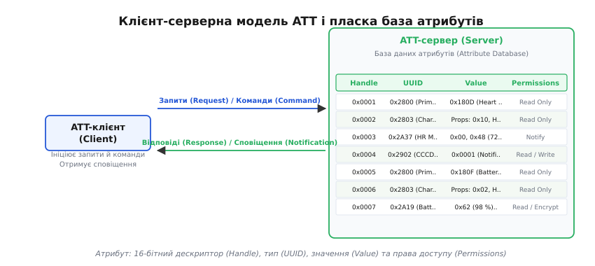
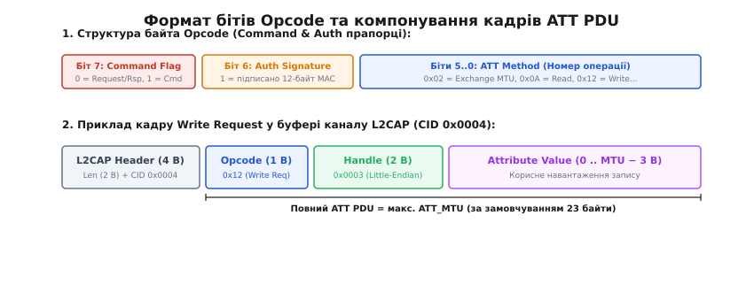
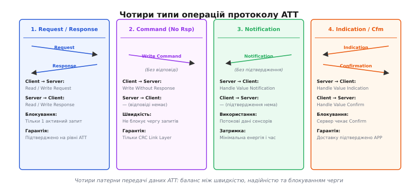
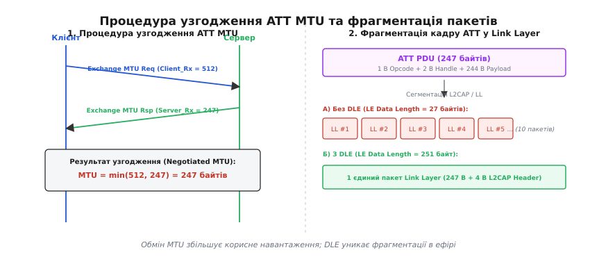
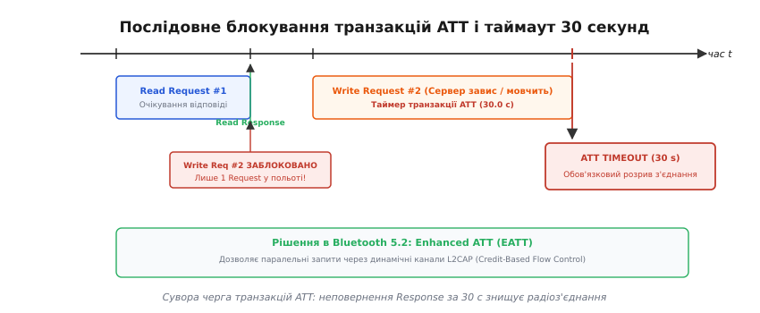
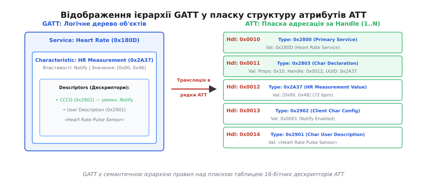

# Протокол атрибутів BLE (ATT)

<preknowlist>
- [BLE GAP](root:com-transport/ble-gap) — ролі центрального та периферійного пристроїв, реклама та встановлення радіоз'єднання
- [BLE GATT](root:com-protocol/ble-gatt) — ієрархія сервісів, характеристик і дескрипторів
- [Проектування пакетних протоколів](root:com-transport/packet-design) — двійкові заголовки, вирівнювання полів та корисне навантаження
</preknowlist>

Коли два пристрої Bluetooth Low Energy встановлюють радіоз'єднання, перед розробником постає суто інженерна проблема: як передавати десятки різнорідних параметрів — від поточного пульсу та заряду батареї до порогів калібрування сенсора — між мініатюрним мікроконтролером із 16 КБ оперативної пам'яті та потужним смартфоном. Якщо організувати обмін як довільний потік байтів на кшталт послідовного порту UART, прошивка давача змушена буде містити власний синтаксичний аналізатор, скінченні автомати розбору складних повідомлень, буфери динамічного розподілу пам'яті для кожного типу даних і систему адресації команд. На крихітному 32-бітному ядрі ARM Cortex-M0, що живиться від дискової батарейки CR2032 і має спати 99.9% часу, такий підхід призводить до перевитрати дефіцитної пам'яті, фрагментації буферів і швидкого вичерпання заряду.

Щоб позбутися потреби створювати спеціалізовані протоколи для кожного сенсора, стек Bluetooth Low Energy уніфікує представлення будь-яких даних на фундаментальному транспортному рівні. Будь-яка інформація на пристрої зводиться до елементарних адресовних записів фіксованої структури.

Цей транспортний рівень зветься **протоколом атрибутів** (англ. *Attribute Protocol*, **ATT**; від лат. *attribuere* — надавати, приписувати). Протокол ATT визначає клієнт-серверну архітектуру роботи з пам'яттю, правила двійкового пакування пакетів, операції читання й запису, а також математичні та часові обмеження транзакцій у радіоефірі.

---

### Пласка база даних та анатомія атрибута

Серцем моделі ATT є концепція сервера атрибутів. Сервер не містить складних об'єктно-орієнтованих дерев або вкладених структур: його внутрішня пам'ять організована як строго **пласка таблиця** (англ. *flat table*), кожен рядок якої називається **атрибутом** (англ. *attribute*).


*Клієнт ініціює операції читання, запису та пошуку, звертаючись до пласкої бази даних атрибутів на сервері. Кожен атрибут містить 16-бітний числовий дескриптор (Handle), тип сутності (UUID), масив даних (Value) та внутрішні правила доступу (Permissions).*

Кожен атрибут у базі даних сервера складається з чотирьох чітко визначених полів:

1. **Дескриптор атрибута (Attribute Handle)**: 16-бітне беззнакове ціле число в діапазоні від `0x0001` до `0xFFFF`. Дескриптор відіграє роль прямої адреси комірки пам'яті. Він унікальний у межах конкретного сервера і дозволяє клієнту звертатися до атрибута безпосередньо за два байти, не витрачаючи енергію на передачу довгих текстових числових ідентифікаторів. Значення `0x0000` зарезервоване специфікацією як недійсне (англ. *invalid handle*) і ніколи не присвоюється реальним атрибутам. Дескриптори в базі даних зазвичай впорядковані за зростанням, що дозволяє клієнту виконувати швидкий двійковий або послідовний пошук діапазонів.
2. **Тип атрибута (Attribute Type / UUID)**: універсальний унікальний ідентифікатор (англ. *Universally Unique Identifier*, UUID), який визначає семантику даних у комірці. Стандарт підтримує два формати:
   * **16-бітний UUID**: скорочений ідентифікатор для стандартних сутностей, затверджених консорціумом Bluetooth SIG (наприклад, `0x2800` для оголошення первинного сервісу або `0x2A37` для вимірювання пульсу). У двійковому кадрі він займає лише 2 байти. Повний 128-бітний еквівалент обчислюється додаванням до базового UUID специфікації Bluetooth:
     ```
     Повний_UUID = 0000xxxx-0000-1000-8000-00805F9B34FB
     ```
     де на місце `xxxx` підставляється 16-бітне шістнадцяткове значення.
   * **128-бітний UUID**: повний 16-байтний ідентифікатор, який використовується розробниками для власних пропрієтарних сервісів і параметрів (наприклад, кастомного каналу оновлення прошивки).
3. **Значення атрибута (Attribute Value)**: довільний масив байтів довжиною від `0` до `512` октетів. Протокол ATT не інтерпретує внутрішній вміст цього масиву: для нього це просто послідовність сирих байтів. Семантичний зміст (ціле число зі знаком, число з рухомою комою за стандартом IEEE-754, текстовий рядок UTF-8 чи бітова маска) визначається рівнями, розташованими над ATT — зокрема профілем GATT та прикладними профілями пристроїв.
4. **Права доступу (Attribute Permissions)**: набір правил, що регламентують, які операції дозволено виконувати клієнту над цим атрибутом, і за яких умов безпеки. Права доступу охоплюють три категорії:
   * *Доступність операцій*: дозволено лише читання (Read Only), лише запис (Write Only) або читання й запис (Read / Write).
   * *Вимоги автентифікації (Authentication)*: вимога обов'язкового спарювання пристроїв із захистом від перехоплення та підміни (англ. *Man-In-The-Middle*, MITM) через PIN-код чи числовий порівняльний код (Numeric Comparison).
   * *Вимоги шифрування (Encryption)*: заборона доступу до атрибута, доки радіоканал не переведено в зашифрований стан за алгоритмом AES-128-CCM.
   * *Вимоги авторизації (Authorization)*: вимога явного підтвердження операції від користувача застосунку перед кожним доступом до даних.

> 🔒 **Архітектурний інваріант прав доступу.** Поле `Permissions` є виключно внутрішньою властивістю бази даних сервера і **ніколи не передається в радіоефір**. Клієнт не може «прочитати права доступу» атрибута окремим запитом. Якщо клієнт намагається виконати операцію запису в атрибут, захищений шифруванням, сервер повертає протокольну помилку `0x0F` (`Insufficient Encryption`). Отримавши таку відповідь, клієнт ініціює процедуру підняття рівня безпеки з'єднання на рівні Security Manager (SMP).

---

### Клієнт-серверна модель і незалежність від ролей GAP

У протоколі ATT взаємодія суворо розподілена між двома взаємодоповнюючими ролями:

* **ATT-сервер (Attribute Server)**: пристрій, який зберігає базу даних атрибутів і приймає вхідні запити та команди від віддаленої сторони, виконуючи операції читання або модифікації комірок пам'яті. Також сервер може за власною ініціативою надсилати клієнту сповіщення про зміну значень.
* **ATT-клієнт (Attribute Client)**: пристрій, який не має локальної бази даних атрибутів для поточного сеансу зв'язку, але надсилає запити на читання та запис до бази атрибутів віддаленої сторони й приймає від неї сповіщення та індикації.

Ці дві ролі не прив'язані до ролей GAP: периферійний пристрій зазвичай виступає ATT-сервером, а центральний — клієнтом, проте стандарт дозволяє і зворотний розподіл, і суміщення обох ролей на одному пристрої в межах одного з'єднання. Увесь обмін між ними складається з кількох базових пар кадрів:

* `Read Request (0x0A)` → `Read Response (0x0B)`: клієнт передає 16-бітний дескриптор, сервер повертає повне значення атрибута (до `MTU - 1` байтів).
* `Write Request (0x12)` → `Write Response (0x13)`: клієнт надсилає дескриптор і нове значення (до `MTU - 3` байтів). Сервер записує байти в пам'ять і повертає порожній позитивний кадр `0x13` як доказ успішного збереження на рівні застосунку.
* `Error Response (0x01)`: універсальна відповідь сервера, коли запит клієнта не може бути виконаний (невірний дескриптор `0x01`, відсутність прав на читання `0x02`, порушення автентифікації `0x05`, невірна довжина значення `0x0D` тощо).

#### 2. Команди (Commands)
Одностороння передача даних від **клієнта до сервера** без очікування протокольного підтвердження на рівні ATT.

* `Write Command (0x52)` (у термінології GATT — *Write Without Response*): клієнт надсилає дескриптор і масив байтів. Сервер приймає пакет і змінює значення в пам'ять, але не генерує жодної відповіді в ефір.
* *Ціна та переваги*: оскільки клієнту не треба чекати зворотного кадру, команди дозволяють передавати дані щокожного інтервалу з'єднання (Connection Event), досягаючи максимальної пропускної здатності. Проте надійність контролюється виключно апаратною контрольною сумою CRC на канальному рівні Link Layer: якщо прошивка сервера переповнена або зайнята, дані можуть бути втрачені на рівні застосунку без відома клієнта.

#### 3. Сповіщення (Notifications)
Асинхронне проштовхування даних від **сервера до клієнта** без підтвердження.

* `Handle Value Notification (0x1B)`: сервер формує пакет, що містить 16-бітний дескриптор джерела та нове значення, і транслює його клієнту в момент події (наприклад, щойно сенсор оцифрував новий удар серця). Клієнт не надсилає відповіді.
* Для активації сповіщень клієнт повинен попередньо записати біт `0x0001` у спеціальний дескриптор конфігурації клієнта (CCCD, `0x2902`). Сповіщення — це найбільш енергоефективний спосіб моніторингу телеметрії у всьому стеку BLE.

#### 4. Індикації та підтвердження (Indications and Confirmations)
Асинхронне проштовхування даних від **сервера до клієнта** з обов'язковим прикладним квитуванням.

* `Handle Value Indication (0x1D)` → `Handle Value Confirmation (0x1E)`: сервер відправляє індикацію і **блокує** відправку будь-яких наступних індикацій доти, доки від клієнта не надійде кадр `Handle Value Confirmation`.

---

### Формат кадру ATT PDU та розбір коду операції

Протокол ATT працює поверх канального рівня L2CAP (англ. *Logical Link Control and Adaptation Protocol*), використовуючи заздалегідь закріплений зарезервований ідентифікатор каналу **`CID = 0x0004`** (LE Attribute Protocol Fixed Channel). Кожен кадр даних, що надходить у цей канал, є протокольним блоком даних (англ. *Protocol Data Unit*, **ATT PDU**).


*Кожен пакет ATT починається з 1-байтового коду операції (Opcode), біти якого містять ознаку команди (Bit 7), криптографічний підпис (Bit 6) та числовий код методу (Bits 5..0). Далі передаються 16-бітні дескриптори та корисні дані у форматі Little-Endian.*

Кожен кадр ATT PDU починається з обов'язкового 1-байтового поля **коду операції** (`Opcode`). Бітова структура цього байта несе службову інформацію про категорію передачі:

```
Біти:    [ 7 ]          [ 6 ]          [ 5 .. 0 ]
Поле:    Command Flag   AuthSignature  Attribute Opcode Method
Розмір:  1 біт          1 біт          6 бітів
```

* **Біт 7 (Command Flag — прапорець команди)**: дорівнює `1` для операцій, які надсилаються клієнтом без очікування протокольної відповіді (наприклад, `Write Command` з кодом `0x52`). Для звичайних запитів, відповідей, індикацій та сповіщень біт 7 дорівнює `0`.
* **Біт 6 (Authentication Signature Flag — підпис автентифікації)**: дорівнює `1`, якщо в кінці кадру додано 12-байтний криптографічний хвіст автентифікації (`Signed Write Command` з кодом `0xD2`). Цей хвіст складається з 4-байтного лічильника передач та 8 байтів коду автентифікації повідомлення MAC (AES-128 CMAC на базі спільного ключа CSRK).
* **Біти 5..0 (Attribute Opcode Method — номер методу)**: 6-бітне число від `0x00` до `0x3F`, що кодує конкретну команду чи відповідь (наприклад, `0x02` — запит узгодження MTU, `0x0A` — запит на читання, `0x12` — запит на запис).

Усі числові значення довжиною понад один байт (16-бітні дескриптори `Handle`, 16-бітні коди `UUID`, розміри буферів `MTU` та числові зміщення `Offset`) завжди серіалізуються у двійковий кадр у порядку **від молодшого байта до старшого (Little-Endian)**. Повний реєстр байтових розкладок усіх 20+ типів повідомлень, правила парсингу та стандартні коди помилок зібрано у [довіднику кадрів ATT PDU](root:com-protocol/ble-att/api-att-pdus.md).

---

### Чотири класи операцій ATT

Будь-який інформаційний обмін між клієнтом та сервером укладається в одну з чотирьох категорій операцій. Кожна категорія оптимізована під свій компроміс між гарантією доставки, затримкою та енерговитратами.


*Чотири фундаментальні патерни передачі ATT: парні запити/відповіді (Request/Response), односторонні команди (Command), непідтверджувані сповіщення (Notification) та підтверджувані індикації (Indication/Confirmation).*

#### 1. Запити та відповіді (Requests and Responses)
Ініціатором запиту завжди виступає **клієнт**, а **сервер** зобов'язаний повернути відповідь або повідомити про помилку.

* `Read Request (0x0A)` → `Read Response (0x0B)`: клієнт передає 16-бітний дескриптор, сервер повертає повне значення атрибута (до `MTU - 1` байтів).
* `Write Request (0x12)` → `Write Response (0x13)`: клієнт надсилає дескриптор і нове значення (до `MTU - 3` байтів). Сервер записує байти в пам'ять і повертає порожній позитивний кадр `0x13` як доказ успішного збереження на рівні застосунку.
* `Error Response (0x01)`: універсальна відповідь сервера, коли запит клієнта не може бути виконаний (невірний дескриптор `0x01`, відсутність прав на читання `0x02`, порушення автентифікації `0x05`, невірна довжина значення `0x0D` тощо).

#### 2. Команди (Commands)
Одностороння передача даних від **клієнта до сервера** без очікування протокольного підтвердження на рівні ATT.

* `Write Command (0x52)` (у термінології GATT — *Write Without Response*): клієнт надсилає дескриптор і масив байтів. Сервер приймає пакет і змінює значення в пам'яті, але не генерує жодної відповіді в ефір.
* *Ціна та переваги*: оскільки клієнту не треба чекати зворотного кадру, команди дозволяють передавати дані щокожного інтервалу з'єднання (Connection Event), досягаючи максимальної пропускної здатності. Проте надійність контролюється виключно апаратною контрольною сумою CRC на канальному рівні Link Layer: якщо прошивка сервера переповнена або зайнята, дані можуть бути втрачені на рівні застосунку без відома клієнта.

#### 3. Сповіщення (Notifications)
Асинхронне проштовхування даних від **сервера до клієнта** без підтвердження.

* `Handle Value Notification (0x1B)`: сервер формує пакет, що містить 16-бітний дескриптор джерела та нове значення, і транслює його клієнту в момент події (наприклад, щойно сенсор оцифрував новий удар серця). Клієнт не надсилає відповіді.
* Для активації сповіщень клієнт повинен попередньо записати біт `0x0001` у спеціальний дескриптор конфігурації клієнта (CCCD, `0x2902`). Сповіщення — це найбільш енергоефективний спосіб моніторингу телеметрії у всьому стеку BLE.

#### 4. Індикації та підтвердження (Indications and Confirmations)
Асинхронне проштовхування даних від **сервера до клієнта** з обов'язковим прикладним квитуванням.

* `Handle Value Indication (0x1D)` → `Handle Value Confirmation (0x1E)`: сервер відправляє індикацію і **блокує** відправку будь-яких наступних індикацій доти, доки від клієнта не надійде кадр `Handle Value Confirmation`.
* Індикації застосовують для критично важливих подій (наприклад, сповіщення про критично низький заряд акумулятора або спрацювання аварійного датчика газу), де втрата повідомлення неприпустима.

---

### Межа MTU: обмеження за замовчуванням та процедура обміну

Будь-який кадр ATT обмежений параметром максимального розміру блоку передачі — **ATT_MTU** (англ. *Maximum Transmission Unit*).

За стандартом Bluetooth Core Specification, значення `ATT_MTU` за замовчуванням для будь-якого щойно встановленого LE-з'єднання строго дорівнює **23 байтам**.

```
Розподіл 23 байтів кадру за замовчуванням (Default ATT_MTU):
[ 1 байт: Opcode ] [ 2 байти: Attribute Handle ] [ 20 байтів: Attribute Value Payload ]
```

Число 23 виникло не випадково, а є прямим наслідком апаратної структури радіокадрів ранніх специфікацій Bluetooth 4.0 та 4.1:

1. Максимальний розмір корисного навантаження пакета канального рівня (Link Layer Data Channel PDU) у специфікації Bluetooth 4.0 становив рівно `27 байтів`.
2. Заголовок рівня L2CAP займає `4 байти` (2 байти довжини `Length` + 2 байти ідентифікатора каналу `CID`).
3. Віднімаючи від ліміту канального рівня службовий заголовок L2CAP, отримуємо точну межу:
   ```
   27 байтів (LL Payload) - 4 байти (L2CAP Header) = 23 байти (ATT_MTU)
   ```
4. Усередині кадру ATT заголовок операції запису або сповіщення забирає ще `3 байти` (1 байт `Opcode` + 2 байти `Handle`).
5. Отже, максимальний розмір корисного корисного значення, яке можна передати за один радіопакет без фрагментації, складав рівно **20 байтів**:
   ```
   23 байти (ATT_MTU) - 3 байти (ATT Header) = 20 байтів корисної інформації
   ```


*Зліва: процедура узгодження розміру MTU, де підсумковий ліміт встановлюється як мінімум із двох значень. Справа: передача великого кадру ATT з використанням розширення довжини даних (DLE) без фрагментації на дрібні пакети канального рівня.*

#### Процедура узгодження MTU (Exchange MTU Request / Response)
Якщо пристроям необхідно передавати довгі блоки даних (масиви вимірювань, спектрограми або блоки оновлення прошивки OTA), ліміт у 20 корисних байтів створює колосальні накладні витрати заголовків.

Для вирішення цієї проблеми протокол ATT передбачає процедуру узгодження — **Exchange MTU**. Одразу після підключення клієнт надсилає кадр `ATT_EXCHANGE_MTU_REQ` (`0x02`), повідомляючи розмір свого буфера прийому `ClientRxMTU`. Сервер відповідає кадром `ATT_EXCHANGE_MTU_RSP` (`0x03`), вказуючи свій `ServerRxMTU`.

Обидві сторони встановлюють робочий `ATT_MTU` рівним математичному мінімуму двох чисел:

```
Узгоджений_MTU = min(ClientRxMTU, ServerRxMTU)
```

Максимальний теоретичний розмір `ATT_MTU` у специфікації Bluetooth обмежений величиною **517 байтів**. При такому MTU один кадр `Write Command` або `Notification` може переносити до `517 - 3 = 514` корисних байтів.

> ⚠️ **Правила процедури Exchange MTU.**
> 1. Процедура узгодження MTU може ініціюватися **лише клієнтом** і виконується **лише один раз** за весь час існування радіоз'єднання. Спроба клієнта надіслати повторний запит `ATT_EXCHANGE_MTU_REQ` відхиляється сервером помилкою `0x06` (`Request Not Supported`).
> 2. Збільшення розміру `ATT_MTU` до 247 або 517 байтів є найбільш ефективним у поєднанні з апаратним розширенням довжини пакета **DLE** (англ. *Data Length Extension*, Bluetooth 4.2+), яке збільшує ємність кадру Link Layer з 27 до 251 байта. Якщо MTU збільшено до 247 байтів, але DLE не підтримується контролером, канальний рівень L2CAP буде автоматично нарізати 247-байтний кадр на 10 дрібних фрагментів по 27 байтів.

#### Робота з довгими атрибутами: Read Blob та Prepare/Execute Write
Якщо розмір значення атрибута перевищує поточний `ATT_MTU` (наприклад, текстовий рядок опису пристрою довжиною 200 байтів при MTU = 23), стек використовує спеціалізовані фрагментовані процедури:

* **Читання довгого атрибута (Read Blob Request `0x0C`)**: клієнт надсилає запит, вказуючи 16-бітне зміщення (`Offset`). Сервер повертає фрагмент даних, починаючи з указаного зміщення. Клієнт циклічно інкрементує `Offset` на розмір отриманого шматка (`MTU - 1`), доки сервер не поверне порожній або неповний кадр.
* **Надійний довгий запис (Prepare Write `0x16` / Execute Write `0x18`)**: двоетапна транзакційна черга (Two-Phase Commit). Клієнт передає дані порціями через `Prepare Write Request`, вказуючи зміщення. Сервер буферизує байти в черзі підготовки (Prepare Queue) і відлунює їх клієнту для побайтової верифікації. Переконавшись, що весь буфер передано без спотворень, клієнт надсилає `Execute Write Request` із прапорцем `0x01` (Commit — записати все в атрибут як атомарну операцію) або `0x00` (Cancel — скинути чергу без змін).

---

### Транзакційна модель ATT, таймаут 30 секунд та блокування черги

На відміну від мережевих протоколів сімейства TCP/IP, де одночасно у польоті можуть перебувати десятки сегментів, класичний протокол ATT має фундаментальне обмеження:

> ⚖️ **Залізне правило транзакцій ATT:**
> У межах одного радіоз'єднання на рівні ATT може бути активним **лише один неповернений запит (Request)**. Клієнт категорично не має права надсилати будь-який наступний Request доти, доки від сервера не надійде відповідь (`Response` або `Error Response`) на попередній.


*Строга послідовність запитів ATT: відправка запиту блокує чергу клієнта. Якщо сервер зависає і не відповідає протягом 30 секунд, спрацьовує обов'язковий протокольний таймаут із примусовим розривом зв'язку.*

Це обмеження було закладено для того, щоб максимально спростити апаратну реалізацію стека: дешевому мікроконтролеру не потрібно підтримувати складні черги очікування транзакцій або таблиці зіставлення ідентифікаторів запитів (Transaction ID).

#### 30-секундний таймер та фатальний таймаут
Щойно клієнт передає в ефір байт кадру `Request` (або сервер надсилає `Indication`), у стеку запускається обов'язковий апаратний **таймер транзакції ATT тривалістю 30.0 секунд**.

1. Якщо протягом 30 секунд від протилежної сторони надходить валідна відповідь (`Response`, `Error Response` або `Confirmation`), таймер скидається, а черга розблоковується для наступних операцій.
2. Якщо протягом 30 секунд відповіді немає (наприклад, мікроконтролер сервера завис у нескінченному циклі обробника переривання або зазнав апаратного скидання), настає стан **ATT Procedure Timeout**.

За стандартом Bluetooth Core Specification, при настанні ATT Timeout стек зобов'язаний виконати **негайний і безповоротний розрив фізичного радіоз'єднання** (виклик команди канального рівня `HCI_Disconnect` із кодом причини `0x13: Remote User Terminated Connection` або `0x22: LMP Response Timeout / LL Response Timeout`).

Протокол ATT не передбачає повторних спроб (retries) на своєму рівні: якщо транзакція зависла, зв'язок вважається повністю скомпрометованим. Детальний скінченний автомат відстеження станів та таймерів реалізовано у проектній вставці про [парсер пакетів та скінченний автомат транзакцій ATT](root:com-protocol/ble-att/proj-att-parser.md).

#### Еволюція: Enhanced ATT (EATT) у Bluetooth 5.2
Жорстке блокування черги запитів стало серйозним вузьким місцем у складних пристроях, де паралельно працюють кілька застосунків (наприклад, фітнес-трекер одночасно транслює пульс, передає GPS-трек і синхронізує налаштування часу).

У специфікації Bluetooth 5.2 було представлено розширення **Enhanced ATT (EATT)**. EATT працює поверх динамічних каналів L2CAP з керуванням потоком на основі кредитів (Enhanced Credit-Based Flow Control, ECBFC). EATT дозволяє відкривати кілька паралельних незалежних каналів ATT між тими самими двома пристроями. У межах кожного окремого EATT-каналу правило «один запит у польоті» зберігається, але різні застосунки можуть відправляти свої запити одночасно через сусідні канали без взаємного блокування (Head-of-Line Blocking).

---

### Зв'язок між ATT та GATT: пласка таблиця проти семантичного дерева

Найбільш важливе концептуальне розуміння стека BLE полягає у розмежуванні сфер відповідальності двох рівнів: ATT та [GATT](root:com-protocol/ble-gatt).

* **ATT (Attribute Protocol)** — це **механізм зберігання та транспортування**. Він оперує виключно поняттями «дескриптор `0x0005`», «тип `0x2800`», «масив байтів `[0x0D, 0x18]`» та правилами запису/читання. ATT не знає, що таке «сервіс», «температура» чи «пульсометр».
* **GATT (Generic Attribute Profile)** — це **структурна семантична схема**, побудована над ATT. GATT визначає правила, як саме набір послідовних рядків таблиці ATT інтерпретується як ієрархічне дерево сервісів, характеристик і дескрипторів.


*Трансляція логічного дерева GATT у послідовні записи пласкої таблиці ATT. Кожен компонент GATT (сервіс, оголошення характеристики, значення, дескриптор конфігурації CCCD) отримує власний унікальний Handle.*

Розглянемо конкретний приклад: стандартний сервіс пульсометра Heart Rate Service (`0x180D`), що містить одну характеристику вимірювання пульсу Heart Rate Measurement (`0x2A37`) із можливістю сповіщення (Notify).

У внутрішній базі даних сервера ATT цей сервіс розгортається у п'ять послідовних числових рядків:

| Handle | UUID (Тип атрибута) | Назва сутності в GATT | Значення в пам'яті (Value) | Права доступу |
|:---|:---|:---|:---|:---|
| `0x0010` | `0x2800` (GATT Primary Service) | Оголошення сервісу пульсу | `0x180D` (Heart Rate Service UUID) | Read Only |
| `0x0011` | `0x2803` (GATT Characteristic) | Оголошення характеристики | Властивості: `0x10` (Notify), Значення Handle: `0x0012`, UUID: `0x2A37` | Read Only |
| `0x0012` | `0x2A37` (HR Measurement) | Власне значення пульсу | `[0x00, 0x48]` (байти прапорців та значення 72 уд/хв) | None (доступ лише через Notify) |
| `0x0013` | `0x2902` (Client Char Config) | Дескриптор CCCD | `0x0001` (підписка на сповіщення активна) | Read / Write |
| `0x0014` | `0x2901` (Char User Description)| Текстовий опис сенсора | `"Оптичний пульсометр"` (UTF-8) | Read Only |

Коли клієнт GATT виконує процедуру виявлення сервісів (Primary Service Discovery), він відправляє запит ATT `Read By Group Type Request` з типом групи `0x2800`. Сервер ATT повертає дескриптори `0x0010..0x0014` та значення `0x180D`. Далі клієнт запитом `Read By Type Request` з UUID `0x2803` знаходить оголошення характеристик і дізнається, що значення пульсу живе за дескриптором `0x0012`.

---

### Програмна реалізація: побудова та обробка кадрів ATT

Для закріплення розуміння двійкового формату нижче наведено реалізацію функцій формування пакета запиту на запис (`ATT Write Request`) та диспетчеризації вхідної відповіді мовами C та C++20.

:::tabs
```c
// att_pdu.h та att_pdu.c
#include <stdint.h>
#include <stdbool.h>
#include <stddef.h>
#include <string.h>

#define ATT_OP_ERROR_RSP   0x01
#define ATT_OP_WRITE_REQ   0x12
#define ATT_OP_WRITE_RSP   0x13

// Пакування кадру Write Request у буфер передачі L2CAP
// Повертає загальну довжину сформованого кадру ATT PDU
size_t att_build_write_req(uint8_t* out_buf, size_t max_len, 
                           uint16_t handle, const uint8_t* payload, size_t payload_len) {
    if (out_buf == NULL || payload == NULL) return 0;
    if (max_len < (3 + payload_len)) return 0; // Перевірка виходу за межі буфера

    out_buf[0] = ATT_OP_WRITE_REQ;             // 1 байт: Opcode (0x12)
    out_buf[1] = (uint8_t)(handle & 0xFF);      // 2 байти: Handle (Little-Endian)
    out_buf[2] = (uint8_t)((handle >> 8) & 0xFF);

    memcpy(&out_buf[3], payload, payload_len); // Корисні дані
    return 3 + payload_len;
}

// Обробка прийнятої відповіді сервера
typedef enum {
    ATT_STATUS_SUCCESS,
    ATT_STATUS_ERROR,
    ATT_STATUS_INVALID_PDU
} att_status_t;

att_status_t att_parse_response(const uint8_t* in_buf, size_t in_len, uint8_t* out_err_code) {
    if (in_buf == NULL || in_len < 1) return ATT_STATUS_INVALID_PDU;

    uint8_t opcode = in_buf[0];
    if (opcode == ATT_OP_WRITE_RSP) {
        return ATT_STATUS_SUCCESS; // Успішне підтвердження запису
    }

    if (opcode == ATT_OP_ERROR_RSP) {
        if (in_len < 5) return ATT_STATUS_INVALID_PDU; // Довжина Error Response рівно 5 байтів
        if (out_err_code) *out_err_code = in_buf[4];   // Байт ErrorCode за зміщенням 4
        return ATT_STATUS_ERROR;
    }

    return ATT_STATUS_INVALID_PDU;
}
```
```cpp
// att_pdu.hpp
#include <cstdint>
#include <cstddef>
#include <span >
#include <vector>
#include <expected>

namespace ble::att {

enum class Opcode : uint8_t {
    ErrorRsp = 0x01,
    WriteReq = 0x12,
    WriteRsp = 0x13
};

enum class ParseError {
    BufferTooSmall,
    InvalidOpcode,
    MalformedPacket
};

// Безпечне пакування Write Request із поверненням готового вектора байтів
inline std::vector<uint8_t> build_write_request(uint16_t handle, std::span<const uint8_t> payload) {
    std::vector<uint8_t> packet;
    packet.reserve(3 + payload.size());

    packet.push_back(static_cast<uint8_t>(Opcode::WriteReq));
    packet.push_back(static_cast<uint8_t>(handle & 0xFF));
    packet.push_back(static_cast<uint8_t>((handle >> 8) & 0xFF));
    packet.insert(packet.end(), payload.begin(), payload.end());

    return packet;
}

// Валідація та десеріалізація вхідного буфера з використанням std::expected (C++23/C++20)
inline std::expected<void, uint8_t> parse_write_response(std::span<const uint8_t> packet) {
    if (packet.empty()) {
        return std::unexpected(0xFF); // Внутрішня помилка: порожній пакет
    }

    const uint8_t opcode = packet[0];
    if (opcode == static_cast<uint8_t>(Opcode::WriteRsp)) {
        return {}; // Успіх
    }

    if (opcode == static_cast<uint8_t>(Opcode::ErrorRsp)) {
        if (packet.size() >= 5) {
            return std::unexpected(packet[4]); // Повертаємо витягнутий ErrorCode
        }
        return std::unexpected(0xFE); // Пошкоджений пакет помилки
    }

    return std::unexpected(0xFD); // Неочікуваний код операції
}

} // namespace ble::att
```
:::

---

### Підсумкова сутність протоколу

Протокол атрибутів ATT створює строго стандартизований фундамент енергоефективного зв'язку Bluetooth Low Energy. Зводячи будь-які фізичні вимірювання чи налаштування до уніфікованої таблиці 16-бітних дескрипторів із правами доступу, ATT усуває потребу у важких прикладних синтаксичних аналізаторах на стороні мікроконтролера. 

Чотири моделі передачі (синхронні запити, односторонні команди, непідтверджувані сповіщення та підтверджувані індикації) у поєднанні з процедурою динамічного розширення MTU надають інженеру повний контроль над компромісом між пропускною здатністю, енергоспоживанням радіотракту та надійністю доставки критичних даних.
