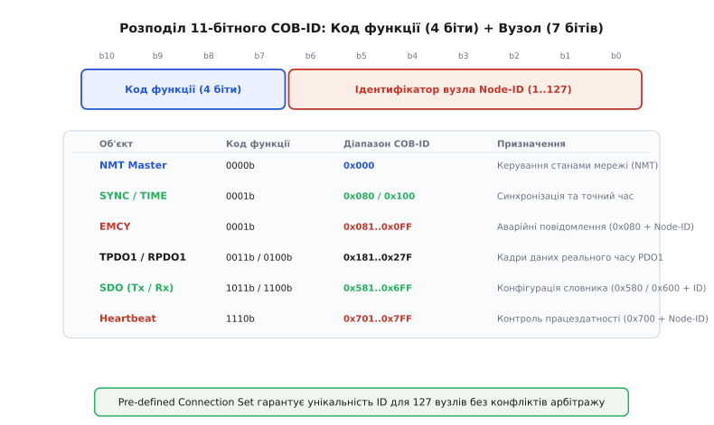
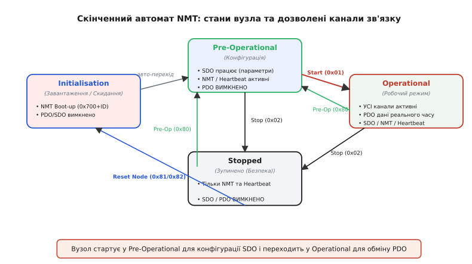
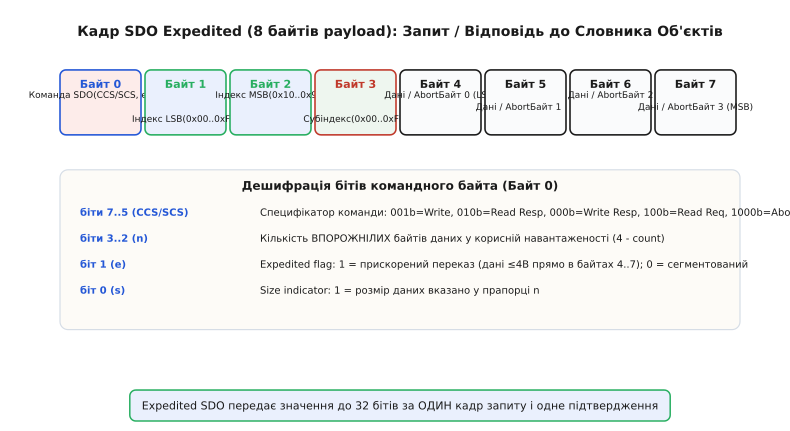
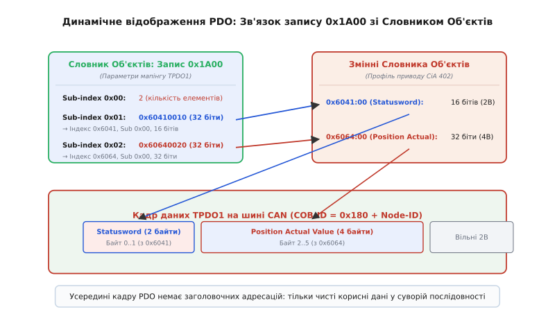

# CANopen: від CAN-кадру до стандартизованого профілю пристрою

<preknowlist>
- [Арбітраж CAN](root:com-devices/can-arbitration) — домінантні та рецесивні біти, ідентифікатор кадру та побітове змагання на шині.
- [Модель OSI](root:com-transport/osi-model) — поділ мережевої взаємодії на фізичний, канальний та прикладний рівні.
</preknowlist>

Уявіть автоматизовану лінію пакування: на єдиній диференційній парі CAN з'єднані три сервоприводи конвеєра, роботизований маніпулятор, оптичний енкодер положення та центральний контролер PLC. Кожні 2 мілісекунди контролер має надсилати нові цільові координати приводам, енкодер — транслювати фактичне положення деталі, а модуль цифрового вводу-виводу — звітувати про стан пневмоциліндрів. Якщо передавати ці дані «сирими» кадрами CAN, система миттєво порине в технологічний хаос. Перший розробник записав швидкість двигуна у перші два байти кадру з ідентифікатором `0x100`, другий — використав той самий ідентифікатор `0x100` для сигналу аварійної зупинки маніпулятора, а третій — передає позицію енкодера 32-бітним числом із протилежним порядком байтів. У разі виходу з ладу одного сервоприводу його заміна на модель іншого виробника вимагатиме повного переписання програмного забезпечення контролера, оскільки новий привід очікує дані у зовсім інших кадрах із власними ідентифікаторами.

Ця проблема виникає через те, що специфікація шини CAN (ISO 11898) визначає лише канальний та фізичний рівні мережевої моделі OSI. Вона гарантує побітовий арбітраж, контроль помилок та доставку 8 байтів корисного навантаження, але залишає абсолютний вакуум у запитанні: що саме означають ці 8 байтів та як адресуються пристрої в мережі. Для подолання цієї роздрібненості та створення єдиної екосистеми сумісних пристроїв на початку 1990-х років було створено протокол **CANopen** (від англ. *Controller Area Network open* — відкрита мережа контролерів), закріплений специфікацією CiA 301.

## 1. Схема адресації Pre-defined Connection Set

Аби запобігти конфліктам ідентифікаторів у мережі, де працюють десятки вузлів від різних виробників, CANopen уводить жорстку стандартизацію 11-бітного поля `COB-ID` (від англ. *Communication Object Identifier* — ідентифікатор комунікаційного об'єкта). 11-бітне значення кадру CAN ділиться на дві функціональні частини: старші 4 біти визначають **Код функції** (від англ. *Function Code*), а молодші 7 бітів — **Ідентифікатор вузла** (від англ. *Node-ID*).

*Структура 11-бітного COB-ID у Pre-defined Connection Set: 4 біти коду функції задають пріоритет та тип об'єкта, а 7 бітів Node-ID гарантують унікальність ідентифікаторів 127 вузлів без конфліктів арбітражу.*

Оскільки поле `Node-ID` займає 7 бітів, CANopen підтримує від `1` до `127` унікальних ведених пристроїв у єдиній мережевій сегментації (`0` зарезервовано для широкомовних команд майстра). Старший код функції визначає категорію повідомлення та його пріоритет під час побітового арбітражу CAN. Чим менше значення коду функції, тим вищий пріоритет має кадр на шині. Припустимо, у мережі одночасно виникає необхідність відправити аварійне повідомлення EMCY від вузла 5 (`COB-ID = 0x085`) та кадр конфігурації SDO від того ж вузла (`COB-ID = 0x585`). Завдяки меншому коду функції кадру EMCY (`0001b` проти `1011b` у SDO), біти ідентифікатора EMCY на початку кадру виграють арбітраж шини, і аварійне сповіщення пройде першим без найменшої затримки.

Завдяки такій структурі, яку назвали **Pre-defined Connection Set** (стандартизований набір з'єднань), кожному пристрою під час присвоєння його `Node-ID` автоматично виділяється власний діапазон ідентифікаторів для всіх типів зв'язку:
- **NMT (Network Management)**: `COB-ID = 0x000` (найвищий пріоритет, широкомовне керування станами);
- **SYNC (Синхронізація)**: `COB-ID = 0x080` (широкомовна мітка часу для вибірки даних);
- **EMCY (Emergency)**: `COB-ID = 0x080 + Node-ID` (аварійні сповіщення про несправності вузлів);
- **TPDO1..4 (Transmit PDO)**: `0x180 + Node-ID`, `0x280 + Node-ID`, `0x380 + Node-ID`, `0x480 + Node-ID` (передача даних реального часу від вузла в мережу);
- **RPDO1..4 (Receive PDO)**: `0x200 + Node-ID`, `0x300 + Node-ID`, `0x400 + Node-ID`, `0x500 + Node-ID` (прийом даних реального часу вузлом із мережі);
- **SDO (Transmit / Slave Response)**: `COB-ID = 0x580 + Node-ID` (відповідь сервера конфігурації);
- **SDO (Receive / Master Request)**: `COB-ID = 0x600 + Node-ID` (запит клієнта конфігурації);
- **Heartbeat / Node Guarding**: `COB-ID = 0x700 + Node-ID` (контроль життєздатності та стану вузла).

[📜 Історію виникнення CANopen та створення консорціуму CiA](root:com-protocol/can-open/hist-cia.md) винесено в окремий екскурс: там детально описано, як у 1992 році шість компаній об'єдналися у консорціум CiA (*CAN in Automation*), щоб спростити специфікацію CAL та створити єдиний відкритий стандарт прикладного рівня для промисловості.

## 2. Словник Об'єктів: єдиний каталог параметрів

Серцем кожного CANopen-пристрою є **Словник Об'єктів** (від англ. *Object Dictionary*, скорочено OD). Це абстрактна концептуальна база даних, у якій впорядковано абсолютно всі налаштування, виміряні значення, змінні стану та комунікаційні параметри пристрою. Замість того щоб хаотично розкидати змінні по окремих кадрах, CANopen вимагає паспортизувати кожну змінну всередині Словника Об'єктів.

Будь-який запис у Словнику Об'єктів адресується двома числами:
1. **16-бітним Індексом** (від `0x0000` до `0xFFFF`);
2. **8-бітним Субіндексом** (від `0x00` до `0xFF`), який використовується для адресації елементів масивів, структур та складних комбінованих параметрів.

Адресний простір Словника Об'єктів суворо регламентований специфікацією CiA 301:
- `0x1000`..`0x1FFF` — **Профіль зв'язку** (від англ. *Communication Profile Area*). Тут містяться загальні параметри пристрою: тип пристрою (`0x1000`), текстова назва моделі (`0x1008`), версія прошивки, період відправки Heartbeat (`0x1017`), ідентифікатори та налаштування відображення PDO (`0x1400`..`0x1A00`).
- `0x2000`..`0x5FFF` — **Специфічний профіль виробника** (від англ. *Manufacturer-Specific Area*). У цьому діапазоні розробник обладнання може розміщувати унікальні внутрішні параметри (наприклад, коефіцієнти PID-регулятора, температура кристала або внутрішні калібрувальні таблиці вендора).
- `0x6000`..`0x9FFF` — **Стандартизований профіль пристрою** (від англ. *Standardized Device Profile Area*). Тут розташовані змінні, визначені галузевими профілями CiA. Наприклад, для профілю сервоприводів CiA 402 за індексом `0x6040` завжди лежить слово керування (`Controlword`), за `0x6041` — слово стану (`Statusword`), за `0x607A` — цільова позиція (`Target Position`), а за `0x6064` — поточна фактична позиція валу (`Position Actual Value`).

[📋 Повну структуру та картографію адресного простору Словника Об'єктів](root:com-protocol/can-open/api-object-dictionary.md) винесено у довідковий атрибутивний файл: там наведено точні індекси, типи даних, атрибути доступу (RO/RW) та стандартизовані регістри профілів CiA 301 та CiA 402.

## 3. Скінченний автомат NMT та контроль зв'язку

Кожен ведений вузол CANopen містить внутрішній скінченний автомат керування мережею — **NMT State Machine** (від англ. *Network Management*). Цей автомат визначає, які саме типи повідомлень вузол має право приймати та відправляти на шину в кожен момент часу.

*Скінченний автомат мережевого керування NMT: перехід між станами Pre-Operational, Operational та Stopped регулює доступність каналів SDO та PDO.*

Автомат NMT підтримує чотири основні стани:
1. **Initialisation (Ініціалізація)**. Виконується під час подачі живлення або після команд скидання (`Reset Node` / `Reset Communication`). Вузол ініціалізує CAN-трансивер, зчитує конфігурацію з EEPROM і повертає широкомовний кадр **Boot-up** (`COB-ID = 0x700 + Node-ID`, байт даних `0x00`). Після відправки Boot-up вузол автоматично переходить у стан *Pre-Operational*.
2. **Pre-Operational (Попередньо-робочий)**. У цьому стані повністю дозволені канали SDO, NMT та Heartbeat, але **критично блоковано канал PDO**. Майстер мережі використовує цей стан для конфігурації Словника Об'єктів: за допомогою SDO він налаштовує режими роботи приводів, межі струму, періоди відправки та параметри відображення PDO.
3. **Operational (Робочий)**. Усі комунікаційні канали (SDO, PDO, NMT, Heartbeat, SYNC, EMCY) повністю активні. Вузол транслює та приймає швидкісні дані реального часу через PDO і виконує свої безпосередні керуючі функції.
4. **Stopped (Зупинено)**. Безпечний аварійний стан. Канали SDO та PDO повністю заблоковані. Вузол приймає лише управляючі команди NMT та транслює повідомлення Heartbeat.

Перехід між станами здійснюється за допомогою 2-байтових команд NMT Master (`COB-ID = 0x000`):
- `Байт 0`: Код команди NMT (`0x01` — Start Remote Node, `0x02` — Stop Remote Node, `0x80` — Enter Pre-Operational, `0x81` — Reset Node, `0x82` — Reset Communication);
- `Байт 1`: Target Node-ID (конкретний `Node-ID` від `1` до `127` або `0` для широкомовного переведення всіх вузлів мережі).

Для контролю життєздатності вузлів у сучасних мережах CANopen застосовується протокол **Heartbeat** (від англ. *Heartbeat* — серцебиття). Кожен вузол з періодичністю, вказаною у записі `0x1017` Словника Об'єктів, самостійно відправляє кадр з `COB-ID = 0x700 + Node-ID` та 1 байтом даних, який містить його поточний стан NMT (`0x04` = Stopped, `0x05` = Operational, `0x7F` = Pre-Operational). На відміну від застарілого протоколу **Node Guarding** (де майстер мусив циклічно опитувати кожен ведений за допомогою RTR-кадрів, подвоюючи трафік шини), Heartbeat функціонує автономно в односторонньому напрямку, що суттєво заощаджує пропускну здатність мережі. Якщо майстер не отримує Heartbeat від вузла впродовж заданого таймауту (запис `0x1016`), він фіксує обрив лінії та переводить систему в аварійний режим.

## 4. Конфігурація та читання через SDO

Для читання та запису будь-якого елемента Словника Об'єктів використовується протокол **SDO** (від англ. *Service Data Object* — об'єкт сервісних даних). SDO працює за класичною моделлю «клієнт-сервер»: майстер (клієнт) надсилає запит на читання або запис до веденого (сервер) з `COB-ID = 0x600 + Node-ID`, а ведений відповідає кадром з `COB-ID = 0x580 + Node-ID`.

Для даних розміром до 4 байтів (що покриває більшість змінних: Boolean, Int8, Int16, Int32, Float) використовується прискорений режим — **Expedited Transfer**. У цьому режимі вся транзакція запису або читання виконується всього за один кадр запиту та один кадр відповіді.

*Структура 8-байтового кадру прискореного переказу SDO Expedited: командний байт містить прапорці розміру та типом транзакції, за яким ідуть 16-бітний індекс, 8-бітний субіндекс та до 4 байтів даних.*

8-байтове корисне навантаження каду SDO Expedited має сувору структуру:
- **Байт 0**: Командний байт. Містить специфікатор команди `ccs`/`scs` у бітах 7..5 (`001b` = Write Request, `010b` = Read Response, `000b` = Write Response, `100b` = Read Request, `1000b` = Abort), прапорець `e=1` (Expedited), `s=1` (Size indicated) та `n` у бітах 3..2 (кількість байтів у кадрі, які **не містять** корисних даних, тобто `4 - count`).
- **Байт 1..2**: 16-бітний індекс Словника Об'єктів (у порядку Little Endian: LSB спочатку).
- **Байт 3**: 8-бітний субіндекс.
- **Байт 4..7**: До 4 байтів даних змінної (у порядку Little Endian).

Якщо пристрій не може виконати запит SDO (наприклад, спроба записати число у параметр "лише для читання" або звернення до відсутнього індексу), сервер повертає кадр **SDO Abort** (командний байт `0x80`), де у байтах 4..7 розміщується 32-бітний код помилки (наприклад, `0x06020000` = Object does not exist, `0x06010002` = Attempt to write a read-only object).

Для передачі великих блоків даних (текстові назви, масиви налаштувань, файли прошивок) використовується **сегментований переказ (Segmented Transfer)**. У цьому режимі перший кадр ініціалізує сесію, вказуючи загальну довжину даних, після чого корисні байти передаються послідовністю кадрів по 7 байтів у кожному з використанням тригерного біта тогла `t` (біт 4 командного байта) для запобігання втраті чи дублюванню сегментів.

[⚙️ Практичну реалізацію збірки та дешифрації SDO-кадрів мовами C та C++](root:com-protocol/can-open/proj-sdo-transfer.md) наведено у прикладному кодовому файлі: там розібрано функції пакування запитів і дешифрації відповідей з підтримкою `std::expected` та перевіркою кодів Abort.

## 5. Обмін даними реального часу через PDO

Хоча протокол SDO дає змогу доступитися до будь-якої змінної, він має високий протокольний оверхед: із 8 байтів каду CAN 4 байти витрачаються на служебну адресу (індекс, субіндекс, командний байт) і лише 4 байти лишаються для даних. Крім того, SDO вимагає обов'язкового підтвердження (запит-відповідь), що неприпустимо для швидкісних контурів керування з частотою 1 кГц.

Для високочастотної трансляції процесного коп'ютера в CANopen застосовують протокол **PDO** (від англ. *Process Data Object* — об'єкт процесових даних). 

Головні відмінності PDO від SDO:
1. **Нульовий оверхед в кадрі**. Усередині кадру PDO відсутні індекси, субіндекси чи командні байти. Усі 8 байтів кадру CAN віддані виключно під корисні дані.
2. **Відсутність підтверджень**. Передача здійснюється у режимі одностороннього мовлення (Broadcast / Unicast) без підтвердження приймачем.
3. **Динамічне відображення (PDO Mapping)**. Приймач та передавач заздалегідь знають, які саме змінні Словника Об'єктів і в якому порядку вкладені у байти кадру PDO.

*Механізм динамічного відображення PDO: 32-бітний запис у покажчику 0x1A00 згадує індекс 0x6041, субіндекс 0x00 та довжину 16 бітів, укладаючи поле Statusword безпосередньо у перші два байти кадру TPDO1.*

Взаємозв'язок між байтами кадру PDO та змінними Словника Об'єктів задається за допомогою двох структур у розділі `0x1000`:
- **Communication Parameters** (`0x1800`..`0x1803` для TPDO1..4): зазначають `COB-ID`, тип передачі (`Transmission Type`), час заборони повторної відправки (`Inhibit Time`) та період таймера подій (`Event Timer`).
- **Mapping Parameters** (`0x1A00`..`0x1A03` для TPDO1..4): містять список 32-бітних покажчиків виду `0xIIII SSS LL`, де `IIII` — індекс, `SSS` — субіндекс, а `LL` — довжина поля у бітах.

Тип передачі (`Transmission Type`, субіндекс `0x02` у `0x1800`) визначає тригери відправки TPDO:
- **Asynchronous / Event-driven** (`254` / `255`): кадр відправляється миттєво при зміні значення змінної або за закінченням інтервалу `Event Timer`.
- **Synchronous** (`1`..`240`): кадр відправляється лише після отримання широкомовного сигналу **SYNC** (`COB-ID = 0x080`). Значення `1` означає відправку на кожен кадр SYNC, значення `2` — на кожен другий SYNC.

Кадр **SYNC** дає змогу синхронізувати вибірку даних на десятках вузлів одночасно. Отримавши SYNC, усі серводвигуни фіксують поточні координати у внутрішніх буферах і послідовно транслюють їх на шину у своїх TPDO, а за наступним SYNC — одночасно застосовують нові цільові позиції з отриманих RPDO, що гарантує сувору фазову синхронність багатовісевого руху.

## 6. Аварійні сповіщення EMCY та діагностика

Якщо у вузлі виникає внутрішній збій (перегрів транзисторів інвертора, падіння напруги живлення, обрив датчика або помилка CRC), вузол негайно транслює широкомовне повідомлення **EMCY** (від англ. *Emergency* — аварія) з `COB-ID = 0x080 + Node-ID`.

Кадр EMCY містить 8 байтів корисного навантаження:
- **Байт 0..1**: 16-бітний аварійний код Emergency Error Code (наприклад, `0x3110` = Over-voltage, `0x2310` = Continuous Over-current, `0x8110` = CAN overrun);
- **Байт 2**: Зміст регістра помилок Error Register (копія запису `0x1001` Словника Об'єктів);
- **Байт 3..7**: 5 байтів додаткової специфічної діагностики від виробника (Manufacturer-specific error info).

> 🔧 **Навіщо це.**
> Для налагодження та розробки CANopen-мереж у середовищі Linux використовують системні утиліти **SocketCAN** та інструмент **Wireshark**. За допомогою команди `candump can0` інженер бачить «сирий» трафік, а утиліта `cansend can0 000#0100` дає змогу відправити широкомовну команду NMT Start All Nodes (`COB-ID = 0x000`, дані `01 00`).
>
> Практичний алгоритм введення нового CANopen-вузла в експлуатацію:
> 1. Подати живлення та пересвідчитися у виході кадру Boot-up (`COB-ID = 0x700 + Node-ID`, дані `00`).
> 2. Через SDO прочитати запис `0x1000` (Device Type) та `0x1018` (Identity Object) для перевірки наявності зв'язку та відповідності моделі.
> 3. За потреби записати нові значення у налаштування мапінгу PDO (`0x1600` / `0x1A00`) та комунікаційні параметри (`0x1400` / `0x1800`).
> 4. Надіслати NMT-команду `Start Remote Node` (`COB-ID = 0x000`, дані `01 Node-ID`), перевівши вузол у стан *Operational*.
> 5. Контролювати періодичні кадри Heartbeat та обмін швидкісними даними PDO.

Таким чином, CANopen перетворює хаотичний набір 8-байтових кадриків шини CAN на суворо детерміновану, розподілену мережу з чіткими профілями пристроїв, стандартизованою базою даних та надійним контролем стану в реальному часі.
