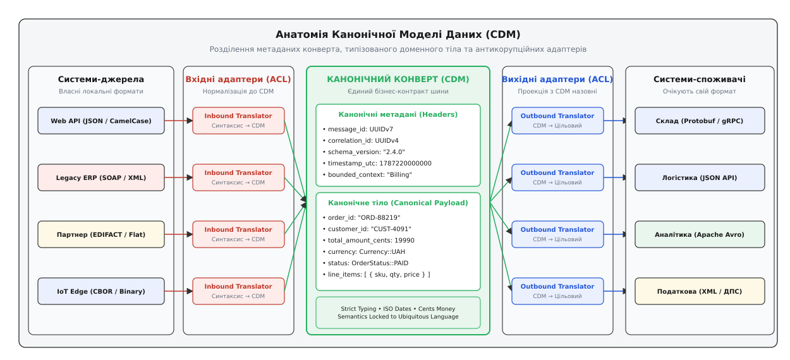
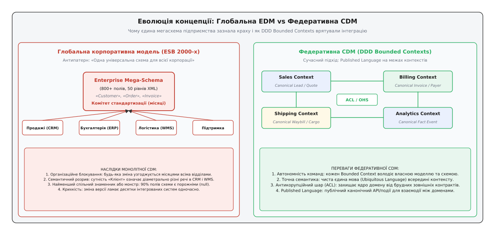
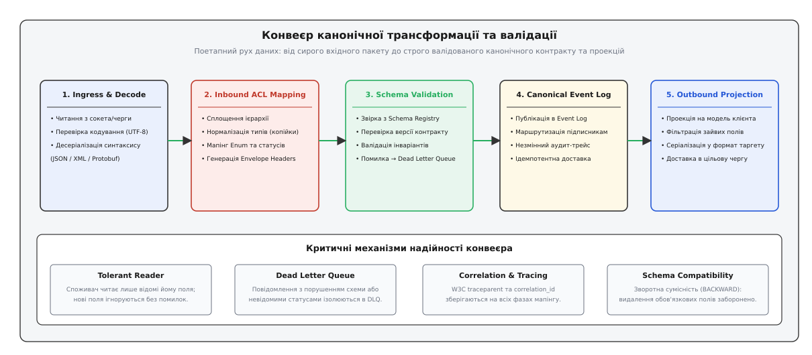

# Канонічна модель даних: подолання семантичного хаосу в розподіленій інтеграції

<preknowlist>
- [Адаптер](root:sf-apps/adapter) — структурний патерн узгодження несумісних інтерфейсів без зміни коду клієнта чи сервера.
- [Порти й адаптери](root:sf-apps/hexagonal-architecture) — ізоляція ядра доменної логіки від зовнішніх протоколів та сховищ даних.
- [Транслятор повідомлень](root:sf-distributed/message-translator) — перетворення форматів між окремими учасниками розподіленого обміну.
- [Еволюція схем і schema-registry](root:com-protocol/schema-registry) — контроль версій, сумісність форматів серіалізації та централізовані контракти даних.
- [Черга повідомлень (point-to-point)](root:sf-distributed/message-queue) — асинхронна доставка повідомлень між незалежними компонентами через проміжний буфер.
- [Pub/sub (тема)](root:sf-distributed/publish-subscribe) — розсилка повідомлень багатьом підписникам без прямого знання відправника про отримувачів.
- [Мертва черга](root:sf-distributed/dead-letter-queue) — ізоляція та збереження пошкоджених або невалідованих повідомлень для діагностики та повторної обробки.
</preknowlist>

Коли великий корпоративний маркетплейс обробляє замовлення покупця, один бізнес-факт «Оформлено покупку на суму 1999.00 грн» повинен одночасно надійти до восьми незалежних систем: платіжного шлюзу, головної бухгалтерської системи ERP, складу, служби кур'єрської доставки, аналітичного сховища Big Data, сервісу боротьби з шахрайством, системи сповіщень та платформи рекомендацій. Кожна з цих систем створена в різний час, різними командами або зовнішніми вендорами. Бухгалтерська система приймає лише XML із суворо фіксованими тегами на кшталт `<CUST_TAX_NO>`, кур'єрська служба вимагає текстовий протокол EDIFACT із позиційними полями, аналітика вичитує двійковий Apache Avro у зміїному регістрі `total_amount_cents`, а платіжний шлюз очікує бінарний Protocol Buffers.

Якщо інженери вирішать інтегрувати кожну підсистему з кожною напряму через індивідуальні двосторонні конвертери, кількість необхідних адаптерів стрімко перетворюється на комбінаторне лихо.

Для системи з `N` автономних сервісів кількість спрямованих трансляторів визначається формулою повного графа `K = N · (N − 1)`. Для 8 систем потрібно написати, протестувати й підтримувати `8 · 7 = 56` адаптерів. Підключення дев'ятого учасника вимагає створення ще 16 нових конвертерів. Але справжня катастрофа настає під час еволюції бізнесу: якщо складська система змінює назву одного внутрішнього атрибута або додає новий статус відвантаження, розробники змушені одночасно переписати й перетестувати 8 сторонніх конвертерів у різних репозиторіях.

Розподілена система впадає в стан крихкого «спагеті інтеграцій», де будь-який локальний реліз загрожує відмовою всієї корпоративної мережі.

## Сутність патерну: спільний семантичний знаменник

Щоб розірвати квадратичну залежність і звести кількість необхідних трансляцій до лінійної шкали `O(N)`, у розподіленій архітектурі застосовують фундаментальний патерн інтеграції корпоративних додатків — **Канонічну модель даних** (англ. *Canonical Data Model*, CDM; від грец. *kanon* — мірило, правило та лат. *modulus* — зразок).

Канонічна модель даних — це єдиний, узгоджений на рівні інтеграційної шини нейтральний формат представлення бізнес-сутностей, команд та подій, що слугує універсальною спільною мовою (лат. *lingua franca*) між усіма неоднорідними підсистемами.

Замість прямої трансляції з формату сервісу `A` у формат сервісу `B`, взаємодія розбивається на два незалежних ізольованих етапи:
1. **Вхідна трансляція (Inbound Translation)**: система-відправник перетворює власні внутрішні структури даних у канонічний формат шини.
2. **Вихідна трансляція (Outbound Translation)**: система-отримувач читає канонічний формат шини та проектує його у свою локальну модель.


*Анатомія канонічного повідомлення: метадані маршрутизації відокремлені від доменного корисного навантаження, а різнорідні підсистеми взаємодіють через ізольовані вхідні та вихідні транслятори.*

Завдяки цьому кожен компонент відповідає лише за два перетворення: «мій внутрішній формат ⇄ канонічна модель». Загальна кількість конвертерів у системі скорочується з `N · (N − 1)` до `2N`. Додавання нової системи до інфраструктури вимагає створення рівно двох адаптерів, не зачіпаючи жодного з наявних сервісів.

Повний математичний доказ точки беззбитковості, обчислення складності топологій та рівняння затримок розгорнуто в окремому дослідженні: [математика топології трансформацій та межі ефективності](root:com-protocol/canonical-data-model/math-translation-topology.md).

## Анатомія канонічного повідомлення: конверт і навантаження

Канонічне повідомлення в розподіленій шині ніколи не є сирим набором бізнес-полів. Воно проектується за принципом строгого розділення відповідальності на два шари: **Канонічний конверт (Envelope)** та **Канонічне корисне навантаження (Payload)**.

Розділення на конверт і тіло розв'язує фундаментальну інженерну проблему продуктивності та безпеки: проміжні інфраструктурні вузли (маршрутизатори, фільтри, черги дедуплікації, аудиторські логери) повинні читати метадані без дорогих операцій десеріалізації та розбору всього дерева бізнес-об'єктів.

```
┌─────────────────────────────────────────────────────────────────────────────┐
│                    СТРУКТУРА КАНОНІЧНОГО ПОВІДОМЛЕННЯ                      │
├─────────────────────────────────────────────────────────────────────────────┤
│ 1. КАНОНІЧНИЙ КОНВЕРТ (METADATA ENVELOPE) — обробляється інфраструктурою    │
│    • message_id        : Глобальний унікальний UUIDv7 (із часовим сортуванням)
│    • correlation_id    : Наскрізний ідентифікатор ланцюжка бізнес-операцій   │
│    • causation_id      : Ідентифікатор попередньої події-причини             │
│    • schema_version    : Версія контракту SemVer (наприклад, "2.4.0")       │
│    • timestamp_utc_ms  : Часова мітка Unix Epoch в абсолютному UTC          │
│    • origin_system     : Ідентифікатор джерела ("crm-service-eu-west")       │
│    • traceparent       : Стандартний контекст трасування W3C Trace Context   │
├─────────────────────────────────────────────────────────────────────────────┤
│ 2. КАНОНІЧНЕ КОРИСНЕ НАВАНТАЖЕННЯ (TYPED PAYLOAD) — бізнес-логіка           │
│    • aggregate_id      : Бізнес-ключ сутності (наприклад, "ORD-2026-9901")   │
│    • domain_event_type : Назва зафіксованого факту ("OrderPaymentCaptured")  │
│    • payload_body      : Строго типізовані структури (гроші в копійках,      │
│                          дати ISO 8601, нормалізовані перерахування Enum)    │
└─────────────────────────────────────────────────────────────────────────────┘
```

### 1. Метадані канонічного конверта

Конверт містить службові атрибути, які потрібні брокерам повідомлень, шлюзам API, фільтрам та маршрутизаторам для транспортування, аудиту та дедуплікації. Інфраструктурні вузли перевіряють ці поля без розпакування внутрішнього бізнес-тіла:
- **`message_id`**: унікальний ідентифікатор конкретного фізичного повідомлення. Найкращою практикою є застосування стандарту UUIDv7, де старші 48 біт кодують мілісекунди Unix Epoch. Це забезпечує природне часове сортування в індексах баз даних та журналах подій. Слугує первинним ключем для фільтрів дедуплікації та сховищ ідемпотентності на боці споживачів.
- **`correlation_id`**: ідентифікатор наскрізної бізнес-транзакції. Коли користувач натискає кнопку в браузері, фронтенд або API Gateway генерує `correlation_id`, який незмінно передається через усі наступні черги, фонові воркери та мікросервіси, дозволяючи зібрати повний лог розподіленого запиту в централізованій системі моніторингу (OpenSearch, Loki, Elasticsearch).
- **`causation_id`**: ідентифікатор того повідомлення чи команди, яке безпосередньо викликало появу поточного повідомлення. Якщо команда `CapturePayment` із `message_id = A` спричинила виникнення події `PaymentCaptured` із `message_id = B`, то в події поле `causation_id` міститиме значення `A`. Це дає змогу автоматично будувати точний орієнтований граф причинності всього бізнес-процесу при аудиті.
- **`schema_version`**: семантична версія канонічного контракту. Дозволяє споживачам перевірити сумісність перед десеріалізацією або звернутися до корпоративного Реєстру схем.
- **`timestamp_utc_ms`**: точний час створення події за нульовим меридіаном UTC у мілісекундах від 1 січня 1970 року. Локальні рядки часу без часових поясів або рядки в нестандартних форматах у канонічній моделі категорично заборонені.
- **`traceparent`**: стандартний заголовок контексту трасування згідно зі специфікацією W3C Trace Context. Забезпечує наскрізне трасування запитів через незалежні сервіси на C++, Go, Java чи Python без прив'язки до вендорських бібліотек.

### 2. Типізоване доменне тіло (Payload)

Доменне тіло будується за правилами непохитної семантичної суворості:
- **Фінансова точність (Money Pattern)**: категорично заборонено використання чисел із плаваючою комою (`float`, `double`), які дають непереборні помилки округлення при конверсії двійкових дробів (`0.1 + 0.2 = 0.30000000000000004`). Усі грошові величини записуються цілими числами в мінімальних одиницях валюти (`uint64_t` у копійках або центах) із зазначенням трилітерного коду валюти за стандартом ISO 4217 (`UAH`, `USD`, `EUR`).
- **Суворі перерахування (Enum)**: замість «магічних рядків» (`"status": "in_progress"`) чи довільних числових кодів бази даних використовуються чітко зафіксовані константи канонічного словника (`CanonicalOrderStatus::Paid`). Нульове значення перерахування завжди резервується під `UNSPECIFIED` для безпечної еволюції схеми.
- **Уніфіковані глобальні ідентифікатори**: усі сутності посилаються на глобальні бізнес-ідентифікатори підприємства (наприклад, глобальний UUID клієнта, податковий код ЄДРПОУ або міжнародний SKU товару), а не на локальні автоінкрементні первинні ключі `id: 42` окремої таблиці реляційної бази даних сервісу.

Повний еталонний опис усіх полів конверта та схеми у форматах Protobuf і JSON Schema представлено в окремій документації: [специфікація канонічного конверта й контрактів схеми](root:com-protocol/canonical-data-model/api-canonical-envelope.md).

## Велика дилема: Крах глобальної моделі та перехід до Bounded Contexts

Історично перша спроба впровадження канонічної моделі у 2000-х роках у рамках концепцій SOA та Корпоративних сервісних шин (ESB) спиралася на утопічну догму: «Створити єдину гігантську XML-схему для всього підприємства».

Ця спроба зазнала гучного краху в сотнях світових корпорацій через три нездоланні фактори:
1. **Організаційний параліч**: коли кожна зміна схеми вимагає засідання центрального комітету архітектури за участі представників усіх відділів, узгодження одного нового поля затягується на місяці.
2. **Семантичний розрив (Semantic Impedance Mismatch)**: одна й та сама назва в різних підрозділах має принципово різний зміст. Для відділу продажів «Клієнт» — це потенційний контакт без реквізитів і договорів. Для бухгалтерії «Клієнт» — це зареєстрована юрособа з кодом ЄДРПОУ та рахунком IBAN. Для складу «Клієнт» — це фізична адреса рампи розвантаження та код домофону. Спроба об'єднати їх в одну сутність призводить до появи монструозних схем із тисячами порожніх полів.
3. **Крихкість моноліту**: будь-яка зміна версії глобальної мегасхеми створює ризик одночасної поломки десятків інтегрованих підсистем.


*Еволюція архітектури: перехід від утопічної єдиної корпоративної мегасхеми (вузьке місце узгоджень) до модульних канонічних моделей у межах окремих обмежених контекстів (Bounded Contexts).*

Сучасна інженерна школа, заснована на парадигмі Domain-Driven Design (DDD) Еріка Еванса, розв'язала цю суперечність через перехід до **Федеративної канонічної моделі (Federated CDM)**:
- Канонічна модель проектується не для всієї корпорації загалом, а в межах конкретного **Обмеженого контексту (Bounded Context)** або на стику взаємодії споріднених доменів.
- Сервіс надає свій публічний канонічний контракт у вигляді **Опублікованої мови (Published Language)** та **Відкритого сервіс-хоста (Open Host Service)**.
- На межі контексту встановлюється **Антикорупційний шар (Anticorruption Layer, ACL)** — адаптер, який транслює зовнішні поняття у внутрішню доменну модель, захищаючи ядро бізнес-логіки від витоку чужої семантики.

Детальна хроніка еволюції інтеграційних мегасхем від перших днів ESB до сучасних Bounded Contexts описана тут: [історія ESB і крах глобальної корпоративної схеми](root:com-protocol/canonical-data-model/hist-esb-and-global-schema.md).

## Семантичний дрейф та контекстне відображення

У розподіленій системі найбільшу загрозу становить не синтаксична несумісність (яку легко виявляє парсер), а **семантичний дрейф (Semantic Drift)** — ситуація, коли дві підсистеми використовують однакову назву поля та однаковий тип даних, але вкладають у нього принципово різний бізнес-зміст.

Розглянемо типовий випадок із полем `is_active` у моделі облікового запису користувача:
- Для сервісу аутентифікації `is_active = true` означає, що користувач підтвердив свою електронну пошту та його пароль не заблоковано системою безпеки;
- Для сервісу білінгу `is_active = true` означає, що у користувача є діюча передплата з позитивним фінансовим балансом;
- Для сервісу маркетингу `is_active = true` означає, що користувач відкривав мобільний додаток або переходив за посиланнями в листах протягом останніх 30 днів.

Якщо ці три сервіси спробують використовувати одне й те саме поле `is_active` у спільній канонічній моделі без уточнення контексту, система неминуче увійде в стан прихованого логічного колапсу: маркетинг почне розсилати сповіщення заблокованим користувачам, а білінг списуватиме кошти з тих, хто просто відкрив додаток.

Канонічна модель даних розв'язує проблему семантичного дрейфу за допомогою шаблонів контекстного відображення (Context Mapping):
1. **Явна спеціалізація атрибутів**: замість загального поля `is_active` канонічний контракт вводить суворо диференційовані атрибути: `is_credentials_valid`, `has_active_subscription`, `last_interaction_timestamp`.
2. **Антикорупційний шар (ACL) на прийомі**: кожен сервіс-споживач у власному адаптері самостійно обчислює локальний прапорець активності на основі точних канонічних фактів.
3. **Опублікована мова подій (Published Language Events)**: замість передачі незрозумілих прапорців стану система публікує дискретні канонічні події: `SubscriptionActivated`, `UserCredentialsLocked`, `UserSessionStarted`.

## Управління основними даними (MDM) та ідентифікація сутностей

У масштабних корпоративних системах сутності часто народжуються в різних місцях: користувач може створити акаунт на сайті, зробити покупку телефоном через кол-центр або укласти договір безпосередньо у фізичному відділенні. У результаті одна й та сама реальна людина фігурує в трьох базах даних під різними локальними ідентифікаторами:
- У CRM: `cust_id = 88410` (відомий лише номер телефону);
- В інтернет-магазині: `user_uuid = "a1b2-c3d4"` (відома адреса електронної пошти);
- У банківському ERP: `client_tax_no = "3210987654"` (відомий податковий код).

Якщо вхідний транслятор просто скопіює локальний ідентифікатор у канонічне повідомлення, система аналітики та бухгалтерії сприйме ці транзакції як дії трьох абсолютно різних клієнтів.

Для вирішення цієї проблеми канонічна модель інтегрується з системою **Управління основними даними (Master Data Management, MDM)** та процесом дедуплікації сутностей (Identity Resolution):
1. **Канонічний глобальний ідентифікатор (Golden Record ID)**: вхідний транслятор викликає швидкий сервіс зіставлення (або кеш ідентифікаторів), який знаходить єдиний глобальний `global_customer_id`.
2. **Збереження перехресних посилань (Cross-Reference Aliases)**: у канонічному повідомленні передається як головний глобальний ідентифікатор, так і словник локальних ключів підсистем: `external_ids: { "crm": "88410", "tax_no": "3210987654" }`.
3. **Ізоляція аналітичних моделей**: сервіси звітності та виявлення шахрайства будують свої графи зв'язків на основі стабільного глобального канонічного ідентифікатора, не залежачи від злиття або розщеплення акаунтів у джерелах.

## Конвеєр обробки повідомлення: від сирих байтів до проекцій

Проходження даних через канонічну модель — це строго структурований багатофазний конвеєр обробки:


*Фази обробки: синтаксичне декодування вхідного формату, структурно-семантичний мапінг в антикорупційному шарі, валідація схеми в реєстрі контрактів та генерація цільового формату для підписника.*

Конвеєр складається з п'яти послідовних етапів:

```
┌─────────────────────────────────────────────────────────────────────────────┐
│                    П'ЯТЬ ФАЗ КАНОНІЧНОГО КОНВЕЄРА                           │
├─────────────────────────────────────────────────────────────────────────────┤
│ 1. Декодування транспорту (Ingress Wire Decode)                             │
│    • Отримання мережевого кадру або пакета з черги (TCP / AMQP / Kafka)     │
│    • Перевірка кодування символів (UTF-8) та контрольних сум                │
│    • Розбір синтаксичного дерева (JSON / XML / Protobuf / CSV)              │
├─────────────────────────────────────────────────────────────────────────────┤
│ 2. Вхідний антикорупційний мапінг (Inbound ACL Translation)                 │
│    • Вилучення сирих бізнес-полів та сплощення структурної ієрархії        │
│    • Конверсія валют і статусів у канонічні типи (копійки, ISO Enum)        │
│    • Генерація метаданих конверта (message_id, correlation_id, timestamp)   │
├─────────────────────────────────────────────────────────────────────────────┤
│ 3. Валідація контракту схеми (Schema Validation & Invariant Checking)       │
│    • Звірка версії схеми з корпоративним Schema Registry                    │
│    • Перевірка обов'язкових полів і числових обмежень                       │
│    • У разі критичної помилки: ізоляція повідомлення в Dead Letter Queue    │
├─────────────────────────────────────────────────────────────────────────────┤
│ 4. Публікація в канонічну шину (Canonical Event Log)                        │
│    • Запис у розподілений незмінний журнал подій (Kafka / Event Log)        │
│    • Маршрутизація підписникам за типами подій та заголовками               │
├─────────────────────────────────────────────────────────────────────────────┤
│ 5. Вихідна проекція споживача (Outbound Consumer Projection)                │
│    • Читання канонічного контракту кінцевим сервісом                        │
│    • Відсікання непотрібних підсистемі полів                                │
│    • Трансформація у локальну модель і збереження в БД сервісу              │
└─────────────────────────────────────────────────────────────────────────────┘
```

Повний вихідний код робочого конвеєра на мовах C++ та TypeScript наведено в практичній реалізації: [робочий конвеєр канонічної трансформації та валідації](root:com-protocol/canonical-data-model/proj-canonical-pipeline.md).

## Інтеграція з Transactional Outbox та Change Data Capture (CDC)

Надійне створення канонічних повідомлень у розподілених транзакціях вимагає захисту від дублювання та втрати даних. Якщо сервіс спочатку записує зміни у власну базу даних PostgreSQL, а потім окремим мережевим викликом публікує повідомлення в Kafka, збій мережі між цими операціями призводить до розсинхронізації системи: дані в БД збережено, але повідомлення в шину так і не надійшло (Dual-Write Problem).

Для гарантованої генерації канонічних повідомлень використовується зв'язка патерну **Transactional Outbox** та технології **Change Data Capture (CDC)**:
1. **Атомарний запис у таблицю `outbox`**: у тій самій локальній транзакції бази даних, де оновлюється таблиця замовлень, сервіс зберігає готовий серіалізований канонічний пакет у спеціальну таблицю `outbox`.
2. **Асинхронне вичитування через CDC (Debezium)**: конектор CDC вичитує двійковий журнал випереджального запису (Write-Ahead Log, WAL) бази даних і публікує збережені канонічні повідомлення в розподілений топік Kafka.
3. **Гарантія доставки At-Least-Once**: повідомлення гарантовано потрапляє в брокер. Можливі дублікати, викликані перезапуском конектора, безпечно відсікаються кінцевими споживачами за допомогою унікального `message_id` із канонічного заголовка.

## Наскрізне трасування замовлення у виробничій системі

Розглянемо повний цикл проходження повідомлення на конкретному прикладі оформлення замовлення:

```
┌─────────────────────────────────────────────────────────────────────────────┐
│              НАСКРІЗНИЙ МАРШРУТ КАНОНІЧНОГО ПОВІДОМЛЕННЯ                    │
├─────────────────────────────────────────────────────────────────────────────┤
│ 1. Клієнт (Мобільний додаток)                                               │
│    POST /api/v2/checkout { "cartId": "c-99", "paymentMethod": "CARD" }      │
│                                    ▼                                        │
│ 2. Inbound Adapter (Checkout Service)                                       │
│    • Генерує W3C Traceparent: 00-4bf92f3577b34da6a3ce929d0e0e4736-...       │
│    • Створює канонічний пакет OrderCreated v2.4.0 (total_amount_cents = 19990)│
│    • Атомарно зберігає в Outbox Table                                       │
│                                    ▼                                        │
│ 3. Canonical Event Bus (Apache Kafka Topic: ecommerce.orders.canonical.v2)   │
│    • Розподіляє повідомлення за partition_key = customer_id                 │
│                                    ▼                                        │
│ 4. Паралельні Outbound Адаптери Підписників:                                │
│    ├── WMS Склад      : бінарний Protobuf gRPC -> резервування на полиці   │
│    ├── SAP Бухгалтерія: SOAP XML конверт -> реєстрація податкової накладної│
│    ├── Кур'єрська служба: EDIFACT пакет -> призначення машини доставки     │
│    └── Data Lakehouse : Apache Avro -> партиція аналітичного сховища Parquet│
└─────────────────────────────────────────────────────────────────────────────┘
```

Якщо під час доставки кур'єрська служба повертає помилку через тимчасову недоступність свого зовнішнього API, це не впливає на склад чи бухгалтерію. Повідомлення лишається в черзі ретраїв або переміщується в Мертву чергу (DLQ) кур'єрського адаптера, забезпечуючи повну ізоляцію відмов між доменами.

## Протокол безпростойної міграції схеми: подвійний запис і тіньовий трафік

Коли виникає невідворотна потреба внести кардинальні несумісні зміни в канонічний контракт (наприклад, перехід від версії `v2` до `v3` зі зміною структури податкових полів), пряме оновлення схеми призвело б до одночасного простою системи.

Для забезпечення безперервної роботи застосовується чотирифазний протокол міграції:
1. **Фаза розгортання подвійної підтримки (Dual Inbound Emission)**: сервіс-продюсер оновлюється та починає публікувати події одночасно у два топіки: старий `orders.canonical.v2` та новий `orders.canonical.v3`. При цьому бізнес-стан залишається узгодженим.
2. **Фаза тіньового споживання (Shadow Traffic Verification)**: новий код споживачів розгортається в режимі тіньового читання (Shadow Mode). Споживачі вичитують топік `v3`, виконують мапінг і логують результат без фіксації у виробничих базах даних, що дозволяє підтвердити стабільність нового транслятора під реальним навантаженням.
3. **Фаза почергового перемикання (Progressive Cutover)**: команди сервісів-підписників автономно перемикають свої адаптери на бойову обробку топіка `v3`.
4. **Фаза зняття з експлуатації (Deprecation & Teardown)**: після того, як останній консюмер мігрував на нову версію, продюсер припиняє публікацію у топік `v2`, а застаріла схема архівується в Schema Registry.

## Порівняння форматів серіалізації: Protobuf vs Avro vs JSON Schema

Вибір формату представлення канонічної моделі визначається вимогами до пропускної здатності, латентності та складності управління схемами:

| Характеристика | Protocol Buffers (v3) | Apache Avro | JSON Schema (Draft 2020) |
| :--- | :--- | :--- | :--- |
| **Тип представлення** | Двійковий, позиційні числові теги | Двійковий, без тегів (схема потрібна для декодування) | Текстовий JSON |
| **Розмір корисного навантаження** | Мінімальний (зазвичай у 4–8 разів менший за JSON) | Ультракомпактний (відсутні назви полів і теги) | Великий (назви полів повторюються в кожному пакеті) |
| **Швидкість парсингу** | Максимальна (нативна компіляція в C++/Go код) | Дуже висока (потокова десеріалізація за схемою) | Помірна (витрати на лексичний аналіз рядків) |
| **Еволюція схем** | Збереження числових тегів, `reserved` поля | Резолюція схем продюсера та консюмера за дефолтами | Ключі `additionalProperties`, `anyOf`, `required` |
| **Найкраще застосування** | Мікросервіси gRPC, високочастотні RPC-виклики | Потокова обробка в Kafka, аналітика Big Data | Зовнішні Web API, клієнтські мобільні додатки |

## Еволюція схем і правила стійкості до змін

Будь-яка промислова розподілена система живе в умовах безперервних змін. Сервіси оновлюються асинхронно різними продуктовими командами. Канонічна модель повинна гарантувати, що оновлення схеми даних не призведе до зупинки системи.

Для забезпечення безперебійної еволюції діють три залізних правила:

### 1. Патерн Tolerant Reader (Толерантний читач)

Сформульований Мартіном Фаулером патерн вимагає: сервіс-споживач повинен вичитувати з канонічного повідомлення лише ті поля, які необхідні йому для виконання роботи, і повністю ігнорувати будь-які нові або незнайомі атрибути.

Якщо у версії `2.1.0` замовлення додано нове поле `loyalty_points_earned`, старий сервіс доставки версії `2.0.0` не повинен падати з помилкою валідації JSON. Він просто пропускає незнайомий ключ. У бінарних форматах на кшталт Protocol Buffers ця властивість забезпечується автоматично: невідомі числові теги зберігаються у внутрішньому буфері `unknownFields` без виклику винятків.

### 2. Закон Постела (Принцип надійності)

«Будь консервативним у тому, що відправляєш, і ліберальним у тому, що приймаєш» (англ. *Be conservative in what you do, be liberal in what you accept from others*).

Сервіс-продюсер зобов'язаний суворо дотримуватися канонічного контракту, заповнювати всі обов'язкові поля та генерувати валідні типи. Сервіс-консюмер зобов'язаний бути стійким до незначних синтаксичних відхилень, порядку полів та наявності розширень.

### 3. Правило зворотної сумісності (Backward Compatibility)

Усі мінорні оновлення схеми (`PATCH` та `MINOR`) мають бути виключно адитивними:
- Дозволено: додавати нові необов'язкові поля з дефолтними значеннями;
- Дозволено: додавати нові значення в перерахування Enum (за умови наявності дефолтного значення `UNKNOWN`);
- **Категорично заборонено**: видаляти обов'язкові поля або змінювати їхній семантичний тип (наприклад, перетворювати числовий `id` на масив рядків).

Якщо бізнес вимагає кардинальної зміни структури (Breaking Change), створюється нова мажорна версія контракту (`v3.0.0`), яка публікується в окремий топік шини, а стара версія підтримується паралельно до завершення міграції всіх клієнтів.

## Тестування контрактів та автоматизація в CI/CD

Надійність канонічної моделі забезпечується не ручними інструкціями, а повною автоматизацією контролю контрактів у процесі неперервної інтеграції (CI/CD):
1. **Тестування споживчих контрактів (Consumer-Driven Contract Testing)**: споживачі за допомогою фреймворків (наприклад, Pact) публікують свої мінімальні очікування від канонічної схеми. Під час складання коду продюсера тести автоматично перевіряють, що жодна зміна не порушує контрактів активних консюмерів.
2. **Автоматичні лінтери схем**: інструменти на кшталт `buf breaking` для Protobuf або CLI Confluent Schema Registry для Avro запускаються на етапі створення Pull Request і блокують злиття гілки, якщо в схемі виявлено порушення зворотної сумісності.
3. **Канаркові релізи схем (Canary Schema Deployment)**: новий формат розгортається на обмежену групу сервісів-споживачів із паралельним аналізом помилок десеріалізації та затримок черг.

## Подієво-орієнтована архітектура та патерн Event-Carried State Transfer

У сучасних мікросервісних екосистемах канонічна модель найчастіше втілюється у формі **Канонічних подій стану (Event-Carried State Transfer)**.

Існує три фундаментальні стилі повідомлень у розподілених системах:
1. **Події-сповіщення (Notification Events)**: передають лише мінімальний факт («Замовлення #1042 створено»). Отримувач змушений зробити зворотний HTTP/gRPC-запит до сервісу замовлень, щоб отримати склад товарів та адресу. Це створює шкідливе зворотне зачеплення (Temporal Coupling) та перевантажує джерело тисячами одночасних запитів.
2. **Команди (Commands)**: несуть пряму інструкцію для конкретного сервісу («СписатиКошти»). Вони жорстко зв'язують відправника з одержувачем.
3. **Канонічні події з перенесенням стану (Event-Carried State Transfer)**: несуть повний самодостатній знімок канонічного стану сутності на момент настання події (ідентифікатори, суми в копійках, повний масив товарів, параметри доставки).

Використання канонічної моделі разом із перенесенням стану повністю усуває необхідність зворотних запитів. Кожен підписник (склад, бухгалтерія, аналітика) отримує повний набір даних із брокера повідомлень і оновлює своє локальне сховище або кеш без жодного мережевого виклику до сервісу-автора.

## Інженерний компроміс: коли CDM потрібна, а коли вона шкідлива

Канонічна модель даних не є універсальним рішенням для будь-якої задачі. Її впровадження має конкретну ціну: додаткові мікросекунди затримки на подвійну серіалізацію, виділення пам'яті під проміжні DTO-об'єкти та витрати робочого часу інженерів на підтримку контрактів.

```
┌─────────────────────────────────────────────────────────────────────────────┐
│                    МАТРИЦЯ ВИБОРУ АРХІТЕКТУРИ ІНТЕГРАЦІЇ                    │
├─────────────────────────────────────────────────────────────────────────────┤
│ 1. КОЛИ КАНОНІЧНА МОДЕЛЬ НЕОБХІДНА:                                         │
│    • Кількість інтегрованих систем N ≥ 4.                                   │
│    • Висока неоднорідність стеків (XML, Protobuf, JSON, EDI, мейнфрейми).   │
│    • Подієво-орієнтована архітектура (Event-Driven Architecture / Pub-Sub). │
│    • Необхідність незалежного розгортання та еволюції команд.               │
├─────────────────────────────────────────────────────────────────────────────┤
│ 2. КОЛИ КАНОНІЧНА МОДЕЛЬ Є ЗАЙВИМ УСКЛАДНЕННЯМ:                             │
│    • Проста взаємодія точка-точка між двома-трьома сервісами (N ≤ 3).       │
│    • Однорідний мікросервісний стек на єдиному транспорті (gRPC / Protobuf).│
│    • Системи ультранизької латентності (High-Frequency Trading, де кожні    │
│      10 мікросекунд подвійної конверсії неприпустимі).                      │
│    • Швидке прототипування стартапу на ранній стадії розвитку.              │
└─────────────────────────────────────────────────────────────────────────────┘
```

## Пастки проектування та антипатерни експлуатації

При практичному впровадженні канонічної моделі інженерні команди нерідко припускаються типових помилок:

### 1. Антипатерн «Витік схеми бази даних» (Database Schema Leak)
Найпоширеніша помилка початківців — автоматична генерація канонічної моделі безпосередньо з таблиць головної реляційної бази даних через інструменти ORM. У такому разі будь-яка внутрішня оптимізація сховища (додавання індексів, партиціювання таблиць чи нормалізація стовпчиків) неминуче ламає публічний контракт усіх сторонніх систем. Канонічна модель повинна проектуватися як абстрактний бізнес-контракт, повністю відв'язаний від фізичного способу зберігання даних.

### 2. Антипатерн «Рядково-типізоване пекло» (Stringly-Typed Payloads)
Намагаючись спростити схему та уникнути суворої валідації, розробники пакують складні об'єкти в неструктуровані текстові поля або сирі JSON-рядки (`"metadata": "{\"custom_key\": 123}"`). Це знецінює саму суть канонічної моделі: помилки синтаксису та типів перестають виявлятися на рівні Schema Registry і спливають лише в рантаймі прикладних сервісів, призводячи до прихованого пошкодження даних.

### 3. Антипатерн «Надмірна гранулярність» (Chatty Integration)
Створення окремого канонічного повідомлення для зміни кожного окремого поля сутності (наприклад, `CustomerMiddleNameChanged`, `CustomerZipCodeUpdated`) створює колосальний потік дрібних повідомлень, перевантажуючи брокери та мережеві з'єднання. Канонічні події повинні відповідати значущим, завершеним бізнес-фактам aggregate-рівня.

### 4. Антипатерн «Подвійний мапінг без валідації» (Blind Projection)
Якщо вихідний адаптер споживача сліпо копіює канонічні поля у свою внутрішню базу даних без перевірки власних доменних інваріантів, будь-яка помилка у вхідному трансляторі моментально отруює базу даних консюмера. Антикорупційний шар обов'язково повинен містити повноцінну локальну валідацію.

## Синтез: CDM як фундамент автономії розподілених систем

Канонічна модель даних перетворює хаотичне плетиво спагеті-інтеграцій на строгу, модульну та передбачувану екосистему. Вона ізолює локальні моделі баз даних від зовнішнього світу, захищає сервіси антикорупційними адаптерами та забезпечує безперешкодне масштабування розподіленої системи протягом десятиліть.

Завдяки чіткому відокремленню метаданих конверта від доменного тіла інфраструктурні компоненти (брокери, шлюзи, фільтри дедуплікації) досягають максимальної пропускної здатності без непотрібного розпакування бізнес-об'єктів. Водночас прикладні продуктові команди отримують повний технологічний та організаційний суверенітет: внутрішня база даних сервісу може змінюватися, оптимізуватися та мігрувати з реляційного сховища на NoSQL-документи без ризику зламати суміжні підсистеми підприємства.

Канонічна модель є не просто форматом серіалізації, а стратегічним контрактом взаєморозуміння в розподіленій системі: вона перетворює технічну інтеграцію на впорядковану співпрацю автономних бізнес-доменів.
